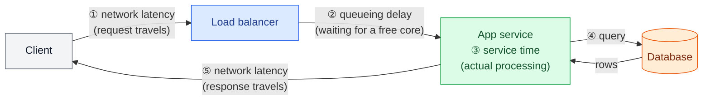
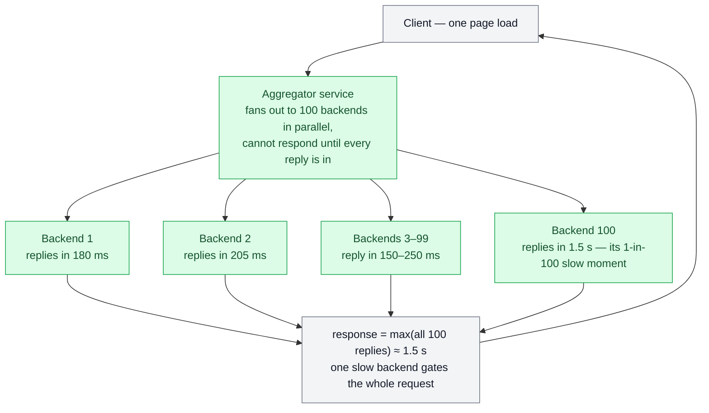

# Latency, Throughput & Percentiles

> **Prerequisites:** [Nonfunctional Requirements](/synapse/system-design-from-first-principles/foundations/nonfunctional-requirements) | **You'll be able to:** define response time, latency, service time, and throughput precisely enough to catch misuse; compute and read p50/p95/p99 from raw data and explain what each extra "nine" costs; quantify tail-latency amplification in a parallel fan-out and write a percentile-based SLO.

## The problem (why this exists)

Your team ships a product-page service. The dashboard reports an average response time of 87 ms — comfortably inside the "it should be fast" line someone wrote in the requirements document. Then the support tickets arrive: checkout sometimes hangs for three seconds, and the complaints are coming disproportionately from your biggest accounts. The dashboard is still green. Nobody is lying. The average is simply doing what averages do: blending millions of quick requests with a slow minority until the slow minority disappears from view.

This is not a hypothetical embarrassment. Amazon observed that the slowest requests to its internal services were systematically the ones from customers with the most data on their accounts — in other words, from the customers who had bought the most, the most valuable ones (p. 40–41). The average said the system was fast. The people generating the revenue experienced something else.

The [previous lesson](/synapse/system-design-from-first-principles/foundations/nonfunctional-requirements) argued that "fast" and "reliable" are empty words until you define them. This lesson supplies the definitions for "fast": what response time, latency, and throughput actually mean; why response time is a distribution rather than a number; how percentiles read that distribution; how tails get *amplified* when one request fans out to many backends; and how these numbers become promises — SLOs and SLAs. By the end, "it should be fast" becomes one precise sentence: *"p99 response time under 1 second, measured at the client."*

## Intuition first

Stand in a supermarket queue. Three quantities describe your afternoon:

- **Throughput** is the store's number: how many customers per hour get through the checkouts. It says nothing about any individual's experience.
- **Response time** is your number: the clock from the moment you join the queue to the moment you walk away with a receipt.
- **Service time** is the cashier's number: the seconds actually spent scanning *your* items. Everything else — standing behind other people — is waiting. Time spent waiting rather than being served is *latency* in the strict sense: your request exists, but nothing is working on it.

The shopper and the store manager care about different numbers, and both are right. You feel response time. The manager buys tills based on throughput, because throughput determines how much hardware — how much money — the operation needs (p. 37). A design conversation that doesn't separate the two goes in circles: "make it faster" might mean *shorten each visit* or *push more people through per hour*, and the fixes are different.

Now the queue teaches its second lesson. It's nearly closing time, one till is open, and the person ahead of you has a mountain of groceries. Your basket holds two items; your *service time* will be ten seconds; your *response time* will be eight minutes. One slow customer at the head of the line delays everyone behind them — **head-of-line blocking**. Notice something subtle: the cashier's own logbook ("time spent per customer") looks perfectly healthy. The suffering is invisible from behind the till. It is only visible from where you are standing (p. 39).

Finally, ask a hundred shoppers how long their trip took. Most say two or three minutes; a few say fifteen. "The average was 3.5 minutes" describes almost nobody. Instead, line all hundred up, sorted from fastest to slowest. The person in the middle is the **median** — half did better, half did worse. The person 95th from the front marks the **95th percentile**: nineteen of twenty shoppers did at least this well. A percentile is nothing more mysterious than a position in that sorted line — and unlike an average, it is a statement about *how many people* had a given experience.

## How it works

### Four clocks, one request

DDIA2 pins the vocabulary down like this (pp. 37–39):

- **Response time** — what the client observes: from sending the request to receiving the answer, including *every* delay anywhere in the system (p. 38).
- **Service time** — the duration a service spends actively processing the request (p. 38).
- **Queueing delay** — time spent waiting rather than being processed. It occurs at several points: waiting for a free CPU core, waiting to buffer a response packet onto the network, waiting behind other requests (p. 38–39).
- **Latency** — strictly, a catchall for time in which the request is *latent*: it exists but is not being worked on. **Network latency** is the slice spent traveling through the network (p. 39; where that time physically goes is [Networking Essentials](/synapse/system-design-from-first-principles/foundations/networking-essentials)' job).

In everyday engineering speech, "latency" and "response time" are used interchangeably. That is usually harmless, but this book flags the distinction wherever it changes a decision — and saying "service time" when you mean it is a quiet signal of precision in an interview.



The client's clock sees ① through ⑤ added together; the server's own instrumentation sees only ③ (and whatever slice of ② happens inside the process). That gap is why two identical requests can have wildly different response times even when the code path is identical. The randomness comes from mundane places: a context switch to a background process, a lost TCP packet waiting for retransmission, a garbage-collection pause, a page fault forcing a disk read — even mechanical vibration in the server rack (p. 39). Variation contributed by the network is called **jitter** (p. 40).

Queueing is the biggest of these variance sources, and it compounds: a server can only process about as many things in parallel as it has CPU cores, so it takes just a few slow requests at the head of the line to hold up everything behind them — head-of-line blocking at datacenter scale. The delayed requests *feel* slow to their clients while looking fast in the server's own accounting, which is exactly why response time must be measured **on the client side** (p. 39).

### Throughput, and the cliff at the edge of capacity

**Throughput** is the count: requests per second processed, or bytes per second (p. 37). For a given hardware footprint there is a maximum throughput, and response time and throughput are coupled by queueing: at light load, response time is roughly flat; as demand approaches capacity, arriving requests increasingly find the CPUs busy and wait, and queueing delay rises *sharply* — the familiar hockey-stick curve (p. 37). A system running near its capacity gets slow before it gets unavailable. That is also why a **scalable** system is defined through this lens: one whose maximum throughput can be raised significantly by adding resources (p. 37).

It gets worse past the knee. When a near-overloaded system slows down, clients time out and *retry*, adding load to a system that was already drowning — a **retry storm** — and the system can lock itself into an overloaded, so-called *metastable* state until something resets it (p. 38). The standard defenses — exponential backoff with jittered retry intervals, circuit breakers, token buckets, load shedding, backpressure (p. 38) — each get proper treatment later in the book; for now, the takeaway is that the right-hand end of the throughput curve is not a place to operate. A practical trigger for app servers: start scaling when CPU utilization sits above ~70–80%.

Throughput is also how you *describe load* in the first place: requests per second, gigabytes of new data per day, checkouts per hour — sometimes as a peak rather than an average (simultaneously online users), plus shape parameters like the read/write ratio, cache hit rate, or data items per user (p. 50). Two questions then frame every scaling discussion: with fixed resources, how does performance degrade as load grows? And to hold performance constant, how much must resources grow (p. 50)?

### Percentiles: reading the distribution

Response time is a **distribution**: measure the same request a thousand times and you get a thousand different numbers, most clustered, a few far out (p. 40). The **arithmetic mean** has a legitimate job — estimating throughput limits and capacity — but it is a poor answer to "how long do users typically wait?", because it doesn't tell you how many users experienced any given delay (p. 40).

Percentiles answer that question directly. Take all response times in some window and sort them. The **median** (**p50**) is the halfway point: half of requests finish faster, half slower (p. 40). Higher percentiles read the tail: **p95**, **p99**, and **p999** are the thresholds that 95%, 99%, and 99.9% of requests beat. A p95 of 1.5 s means 95 out of 100 requests finish in under 1.5 seconds, and 5 take longer (p. 40). These high percentiles are called **tail latencies**, and they hit user experience directly (p. 40).

Feel the difference on a toy dataset — ten measured response times, already sorted, in ms:

```text
32   38   41   45   52   58   71   105   260   1900
```

The median is ~55 ms (between the 5th and 6th values). The p90 is 260 ms. The mean? 2,602 ÷ 10 = **260 ms** — dragged by a single outlier to the level of the *90th percentile*. Report the mean and you'll claim a "typical" experience that nine out of ten requests beat handily; report p50/p95/p99 and the shape of reality survives. (Simplification: there are several conventions for indexing percentiles in small samples — nearest-rank versus interpolation. At monitoring volumes the difference vanishes; what matters at small n is that high percentiles are jumpy, which is why dashboards compute them over rolling windows of many requests.)

How far up the tail should you care? Amazon's answer: internal services specify response-time requirements at the **99.9th percentile**, even though it affects only 1 request in 1,000 — because the slowest requests land on the customers with the most account data, i.e., the most valuable ones (p. 40–41). But Amazon also concluded that optimizing the **99.99th** percentile was too expensive for the benefit: each extra "nine" chases an event ten times rarer, increasingly caused by random factors you cannot control — GC pauses, packet loss, page faults — so the cost curve bends up while the payoff shrinks (p. 41, and the variance list from p. 39).

### Tail-latency amplification: fan-out multiplies your tail

Here is where tail latency stops being a statistical footnote. A modern page load is rarely one backend call — a single user request commonly fans out to many internal services, and *even when the calls run in parallel, the user waits for the slowest one* (p. 41).



Run the numbers. Suppose every backend is individually healthy: p99 of 1 second, so only 1% of its calls run long. Fan out to 100 of them and wait for all. If latencies were independent, the chance that *every* call is fast is 0.99¹⁰⁰ ≈ 37% — meaning **about 63% of user requests are slower than 1 second**. A 1-in-100 event per backend has become a 2-in-3 event per user. At a fan-out of 30, it's still 1 − 0.99³⁰ ≈ 26%. This is **tail-latency amplification**: the more backend calls an end-user request touches, the greater the fraction of end-user requests that end up slow (p. 41).

Name the simplification: independence is an idealization. Real fleets have *correlated* slowness — a shared overloaded node, a GC storm, a hot shard — which can concentrate the pain into fewer, worse requests or spread it further. The qualitative law survives the caveat, and it drives a hard design consequence: your internal services must hold far stricter latency targets than the user-facing promise, and the deeper and wider your call graph grows, the more your architecture is governed by its tails. That is precisely why Amazon manages internal services at p999 rather than at the median (p. 40–41).

### From percentiles to SLIs, SLOs, and SLAs

Percentiles are how performance promises get written down:

- **SLI** (service level indicator) — the thing you measure, e.g., client-observed response time or the fraction of non-error responses. (The term is Google SRE vocabulary rather than DDIA's; [web: Google SRE Book, "Service Level Objectives"].)
- **SLO** (service level objective) — the target: e.g., *median response time < 200 ms and p99 < 1 s, with ≥ 99.9% of valid requests returning non-error responses* (p. 41–42).
- **SLA** (service level agreement) — a contract that attaches consequences, such as refunds, if the SLO is missed (p. 42). Even defining what counts as "available" for an SLA is not straightforward (p. 42) — which requests count as "valid" is itself a negotiation, and the performance envelope you promise is part of your [API's contract](/synapse/system-design-from-first-principles/foundations/api-design).

Operationally, percentiles are computed over a rolling window of recent response times. The naive implementation — keep every measurement, sort the list each minute — works but is inefficient; production systems use compact approximation structures such as HdrHistogram, t-digest, OpenHistogram, and DDSketch (p. 42). One rule matters more than the machinery: to combine response-time data across machines or across time windows, you must **add the histograms** — never average the percentiles (p. 42). The Pitfalls section shows how that mistake manufactures fiction.

## Trade-offs

Choosing *which* number to optimize is a genuine [trade-off decision](/synapse/system-design-from-first-principles/foundations/thinking-in-tradeoffs), not a formality — each step up the percentile ladder buys protection for rarer events at steeply rising cost.

| Option | Gives you | Costs you | Use when |
| --- | --- | --- | --- |
| Optimize the mean | Clean capacity math — the mean is the right input for throughput and cost estimates (p. 40) | Says nothing about how many users wait how long; one outlier distorts it | Capacity planning and cost models — never as the UX claim |
| Target p50 | "The typical user is fine"; cheap to hit | Half of all requests are beyond it; the tail is free to rot unnoticed | Early-stage products; coarse health signals |
| Target p95–p99 | Covers the vast majority of requests; catches systemic slowness early | Needs percentile infrastructure (histograms, rolling windows); noisier than p50 | The default user-facing SLO (p. 41–42) |
| Target p999 | Protects the worst-served 1-in-1,000 — at Amazon, the highest-value customers (p. 40–41) | Expensive engineering against rare, often externally-caused events | High-value transactional paths at large scale |
| Target p9999 | Almost nothing beyond p999 | Amazon judged it too costly for the benefit; dominated by factors outside your control (p. 41) | Almost never — know *why* before promising it |

Measurement point is a second axis with the same shape: server-side metrics are cheap, precise about service time, and blind to queueing in front of the process and to the network; client-side measurement sees the truth users experience but is noisier and harder to collect (p. 39). Mature setups do both — and alert on the client-side numbers.

## Numbers that matter

Anchor figures to carry into any design discussion — the estimation method that uses them lives in [Estimation & the Numbers](/synapse/system-design-from-first-principles/foundations/estimation-and-numbers), which carries the full 2025 hardware table.

| Figure | Value | Source |
| --- | --- | --- |
| Reading "p95 = 1.5 s" | 95 of 100 requests beat 1.5 s; 5 don't | DDIA2 p. 40 |
| Amazon's internal latency bar | p999 (1 in 1,000), because slow requests hit the biggest accounts | DDIA2 pp. 40–41 |
| Percentile Amazon rejected | p9999 — too costly, diminishing returns | DDIA2 p. 41 |
| A well-formed SLO | median < 200 ms; p99 < 1 s; ≥ 99.9% non-error | DDIA2 pp. 41–42 |
| Same-region network round trip | 1–2 ms | Reference figure |
| Cross-region round trip | 50–150 ms | Reference figure |
| In-memory cache read | < 1 ms | Reference figure |
| DB read, cached / disk | 1–5 ms / 5–30 ms; commit 5–15 ms | Reference figure |
| Message-queue hop, in-region | 1–5 ms end-to-end | Reference figure |

And the famous "latency costs revenue" figures deserve honest handling, because DDIA2's own sidebar shows the much-cited data is shaky (all p. 41): a 2006 Google claim (400→900 ms slowdown ≈ 20% traffic/revenue drop) is contradicted by Google's more careful 2009 experiment (400 ms added latency ≈ only 0.6% fewer searches per day); Bing's 2009 experiment found a 2 s slowdown cut ad revenue by 4.3%; an Akamai study claiming 100 ms ≈ up to 7% lower conversion undermines itself (its fastest pages were often near-empty error pages, which also convert poorly); and a Yahoo study that *did* control for result quality found ≥ 1.25 s of speed difference produced 20–30% more clicks on the fast side. Latency clearly matters; no single magic number survives scrutiny. Quote the spread, not a slogan — and measure your own funnel.

## In production

The measurement pipeline is where this lesson becomes an engineering practice. Real monitoring stacks don't store every response time forever; they maintain per-service, per-minute histograms using sketch structures — HdrHistogram, t-digest, OpenHistogram, DDSketch — and compute rolling p50/p95/p99 curves from them (p. 42). The architectural rule embedded in that choice: store and transmit *histograms*, not precomputed percentiles, because histograms can be added across machines and time windows while percentiles cannot be meaningfully combined afterwards (p. 42). Fleet-wide dashboards, region rollups, and month-end SLO reports all depend on that one decision made early.

Where you put the probe changes what you can see. Server-side timing misses queueing in front of the process and everything the network does — the exact places where head-of-line blocking hides — so serious shops track client-observed (real-user) response time as the SLI of record and keep server-side service time as a diagnostic (p. 39).

Percentile SLOs then become the operating contract. Internally, Amazon-style organizations hold services to p999 targets so that fan-out amplification doesn't destroy the end-user experience (p. 40–41); externally, SLAs attach financial consequences — refunds — to missed SLOs (p. 42). Beware the definitional fine print: deciding which requests are "valid," what counts as an error, and over what window availability is computed is genuinely hard (p. 42), and contracts have been argued over less.

Finally, capacity and latency meet in production the ugly way. A service running hot doesn't degrade linearly: queueing pushes the tail out first (your p99 alarms fire while p50 looks fine), then timeouts trigger retries, and the retry storm can hold the system in a metastable overloaded state even after the original spike has passed (p. 38). The mitigations named earlier — backoff with jitter, circuit breakers, token buckets, load shedding, backpressure (p. 38) — are the production answer, and your percentile dashboard is the early-warning system that tells you they're about to be needed.

## Pitfalls & interview traps

<div style="border-left:4px solid #da5233;background:rgba(218,82,51,0.08);padding:0.6rem 1rem;border-radius:0 0.5rem 0.5rem 0;margin:1.25rem 0">

⚠️ **The averaging-percentiles trap.** Ten app servers each report a per-minute p99; a dashboard averages them into a "fleet p99." That number is fiction — "averaging percentiles … is mathematically meaningless. The right way … is to add the histograms" (DDIA2, p. 42). The same applies over time: the day's p99 is not the mean of 1,440 per-minute p99s. If a monitoring tool offers `avg(p99)`, what it computes is not a percentile of anything.

</div>

The other traps interviewers reliably probe:

- **Quoting service time as response time.** "The database lookup takes 10 ms, so the API responds in 10 ms" ignores queueing delay and two network traversals (p. 38–39). Follow-up you should expect: *"Measured where?"* The right answer is client-side, because head-of-line blocking makes server-side numbers optimistic (p. 39).
- **Treating p99 as the worst case.** p99 says nothing about the worst 1%. At 10 million requests/day, 100,000 daily requests live beyond your p99 — and per Amazon's finding, they may skew toward your most valuable users (p. 40–41).
- **Forgetting that sessions amplify like fan-outs do.** A user who performs 20 actions meets your p99 tail with probability 1 − 0.99²⁰ ≈ 18% — the same arithmetic as backend fan-out, with the same independence caveat. "1%" events are everyday events at session scale.
- **Promising heroic percentiles.** An SLO of p9999 sounds rigorous and is mostly a commitment to chase GC pauses and packet loss forever (p. 41). Say what each nine costs.
- **Overestimating baseline latencies, then over-building.** A common estimation error: candidates assume a simple indexed database lookup is slow, when it's on the order of 10 ms, then bolt on a cache the design didn't need — or add a message queue to "buffer" 5k writes/second that a tuned Postgres handles natively. Justify infrastructure with numbers, not vibes — it's one of the calibration signals covered in [The Interview at 10,000 Feet](/synapse/system-design-from-first-principles/foundations/the-interview-at-10000-feet).

## Check yourself

```quiz
{
  "prompt": "A dashboard shows your API's p95 response time is 1.5 s. What does that actually claim?",
  "options": ["95 of every 100 requests finish in under 1.5 s; 5 take longer", "The average request takes 1.5 s", "The slowest request observed took 1.5 s", "95% of servers respond within 1.5 s"],
  "answer": "95 of every 100 requests finish in under 1.5 s; 5 take longer"
}
```

```quiz
{
  "prompt": "In one minute a service handles 100 requests: 90 finish in 100 ms, 9 in 500 ms, and 1 in 4,000 ms. Compute the median and the mean. Which statement is true?",
  "options": ["Median 100 ms, mean 175 ms — the mean nearly doubles the typical user's actual wait", "Median 175 ms, mean 100 ms — the median is inflated by the outlier", "Median and mean are both about 100 ms — the outlier is too rare to matter", "Median 100 ms, mean 500 ms — the mean equals the p99"],
  "answer": "Median 100 ms, mean 175 ms — the mean nearly doubles the typical user's actual wait"
}
```

```quiz
{
  "prompt": "Each of 100 backends has a p99 of 1 s (1% of its calls run longer). A user request calls all 100 in parallel and must wait for every reply. Assuming independent latencies, roughly what fraction of user requests take longer than 1 s?",
  "options": ["About 1%", "About 10%", "About 63%", "About 99%"],
  "answer": "About 63%"
}
```

```quiz
{
  "prompt": "You have sixty per-minute p99 values for the last hour and need the hour's true p99. What is the statistically valid method?",
  "options": ["Average the sixty p99 values", "Take the largest of the sixty p99 values", "Take the median of the sixty p99 values", "Merge the sixty underlying histograms and read the p99 from the combined distribution"],
  "answer": "Merge the sixty underlying histograms and read the p99 from the combined distribution"
}
```

<details>
<summary>Why did Amazon set internal response-time requirements at p999 — and why stop there rather than p9999?</summary>

Because the slowest 1-in-1,000 requests were systematically the ones from customers with the most account data — the most valuable customers — so the far tail was worth real engineering effort (p. 40–41). But p9999 (the slowest 1 in 10,000) was judged too expensive for the benefit: at that rarity, response times are dominated by random factors you can't control — GC pauses, packet retransmissions, page faults — so cost rises steeply while returns diminish (p. 39, 41).

</details>

<details>
<summary>Your server-side p99 is a healthy 40 ms, but clients report a p99 near 900 ms. Name at least three places the missing time can hide.</summary>

(1) Queueing before your process ever sees the request — in the load balancer, the OS accept queue, or behind slow requests occupying all cores (head-of-line blocking), which server-side timers structurally miss (p. 38–39). (2) Network latency and its pathologies in both directions — packet loss and TCP retransmission, plus jitter (p. 39–40). (3) Client-side effects the server can't observe at all. This gap is exactly why DDIA2 says response time must be measured on the client side (p. 39).

</details>

<details>
<summary>Draft a defensible SLO for a checkout API, and say why each clause is there.</summary>

Following the DDIA2 example shape (pp. 41–42): *"Median response time under 200 ms and p99 under 1 s, measured client-side; at least 99.9% of valid requests return non-error responses over the calendar month."* The median clause protects the typical experience; the p99 clause bounds the tail (where the highest-value users often live); "measured client-side" closes the head-of-line-blocking loophole; the error-rate clause makes "fast but wrong" a violation; and the explicit window plus "valid requests" wording avoids the definitional ambiguity that makes SLAs contentious (p. 42).

</details>

## Sources

- DDIA2 ch. 2 pp. 37–42 (describing performance; response time vs. latency vs. service time; queueing and head-of-line blocking; percentiles and tail latency; Amazon p999/p9999; tail-latency amplification; SLOs/SLAs; percentile estimation and histogram aggregation) — via digest `ch02-nonfunctional-requirements`.
- DDIA2 ch. 2 p. 38 (retry storms, metastable failure, overload mitigations); pp. 49–52 (describing load; two lenses on rising load).
- DDIA2 ch. 2 p. 41 (latency-vs-revenue studies: Google 2006/2009, Bing 2009, Akamai, Yahoo — reliability caveats as given in the source).
- [web: Google SRE Book, "Service Level Objectives"] — the term *SLI* only; all SLO/SLA substance from DDIA2.
