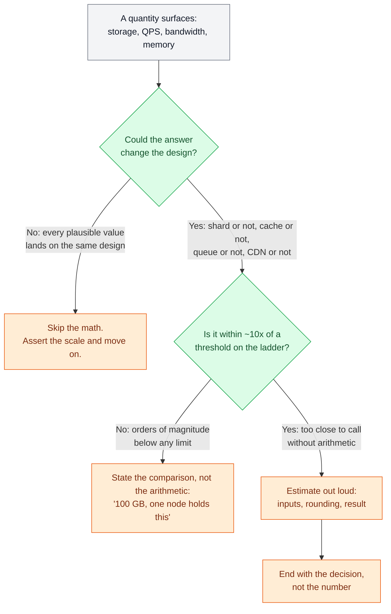
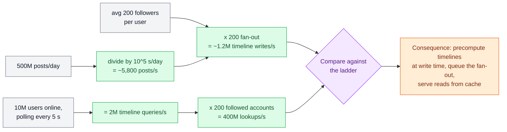

# Estimation & the Numbers

> **Prerequisites:** [Latency, Throughput & Percentiles](/synapse/system-design-from-first-principles/foundations/latency-throughput-percentiles) | **You'll be able to:** decide *when* an estimate is worth doing — only when the result changes a design decision; carry the working ladder of latencies, per-node throughputs, and storage ceilings; run a sixty-second order-of-magnitude estimate out loud, from stated inputs to a design consequence.

## The problem (why this exists)

Watch two candidates fail the same interview in opposite directions.

The first opens with ten minutes of arithmetic: users, requests per user, bytes per request, storage per year, bandwidth, growth — all computed to three significant figures. Then the design begins, and not one of those numbers is ever consulted again. The math was a ritual, not an instrument.

The second skips the math entirely and pays for it. Handed a Yelp-like problem — 10 million businesses at roughly a kilobyte each — they announce a sharding strategy. That dataset is about 10 GB; even 10×'d to hold reviews it is ~100 GB, a size a single modern database node holds without noticing. This is exactly the most common estimation failure: candidates carrying constraints from 2015-era study material into a world where single nodes hold tens of terabytes. Hardware moved an order of magnitude; the intuition didn't.

Both failures share a root cause: no working connection between arithmetic and architecture. And that connection is what real designs turn on. DDIA's social-network case study hinges on one multiplication: serving home timelines by querying at read time costs about **400 million lookups per second**, while precomputing timelines at write time costs **just over 1 million writes per second** [p. 35–36]. Same product, same users — a 400× gap between two architectures, visible only if you run the numbers. The multiplication *is* the design decision.

This lesson teaches estimation the way strong candidates practice it: rarely, quickly, and always in service of a decision.

## Intuition first

Back-of-envelope estimation is not accounting. The number you produce is disposable; the decision it buys is the deliverable. Nobody cares whether your feed generates 470 GB or 520 GB a day. They care whether that's a "one Postgres node" problem or a "shard it from day one" problem, and 470 vs. 520 never flips that answer. Being wrong by 20% is free. Being wrong by 10× ships the wrong system.

That reframing gives you this book's core stance on estimation: **estimate only when the result could change the design** — the common mistakes are almost all failures to run *decision-relevant* math, and the advice before sharding is simple: slow down, do the math. Every estimate is secretly a comparison: a quantity you compute versus a threshold you carry — what one cache node holds, what one database sustains, what one NIC pushes. If the comparison is lopsided by two orders of magnitude, don't perform arithmetic; assert it ("100 GB — one node holds this") and keep designing. If it's within about 10× of a threshold — genuinely too close to call — that's when you slow down and compute, out loud.

Two habits make the computing part fast:

- **Round violently, protect the exponent.** 86,400 seconds per day becomes 10^5. 500 million becomes 5 × 10^8. Multiplication and division become adding and subtracting exponents. You will be off by 20–50% and it will never matter, because thresholds on the ladder are themselves order-of-magnitude creatures.
- **Collapse powers of 2 into powers of 10.** 2^10 = 1,024 ≈ 10^3, so KiB/MiB/GiB/TiB behave like thousand/million/billion/trillion bytes for envelope purposes. Reserve the distinction for the rare case it matters (it almost never does at whiteboard resolution).

<div style="border-left:4px solid #195045;background:rgba(25,80,69,0.08);padding:0.6rem 1rem;border-radius:0 0.5rem 0.5rem 0;margin:1.25rem 0">

💡 **An estimate ends in a verb.** The deliverable is a sentence shaped like *"~400 GB — fits comfortably in one cache node, so we don't shard."* If your estimate ends with a number instead of a decision, it wasn't worth the airtime.

</div>

## How it works

### The method: four moves

Strong estimation is a tight loop you can run in under a minute:

1. **Name the decision first.** "Whether this fits one database node." "Whether the write path needs a queue." If you can't name a decision, you've just discovered you don't need the estimate.
2. **Fix the inputs, out loud.** Use what the interviewer gave you; state assumptions for the rest ("call it a kilobyte per post — text plus metadata"). Saying assumptions aloud invites correction *now*, when it's cheap.
3. **Compute in powers of ten, one line at a time.** Keep units visible at every step — most estimation disasters are silent unit errors (bits vs. bytes, per-day vs. per-second), not wrong multiplication.
4. **Compare against the ladder and state the consequence.** The final sentence names the design move the number just bought.

The decision of whether to estimate at all is itself a tiny flowchart:



### The ladder

The comparison step only works if you carry thresholds in your head — a *ladder* of anchor values you can climb without looking anything up. It has three families of rungs.

**Time rungs** — how long things take, from the [latency and percentile machinery](/synapse/system-design-from-first-principles/foundations/latency-throughput-percentiles) you already have. In-memory cache reads come back in under a millisecond; a network hop within a region costs about 1–2 ms; a cached database read runs 1–5 ms, an uncached disk-backed read 5–30 ms, and a simple indexed row lookup on SSD-backed storage is on the order of 10 ms; crossing regions costs 50–150 ms. Then the tail: DDIA reports cross-region round trips of **up to several minutes** at high percentiles and intra-datacenter packet delays exceeding a minute during network reconfigurations [p. 350] — the ladder's reminder that averages are the top of the distribution, not the whole of it.

**Rate rungs** — what one node of each type sustains: an in-memory cache node serves 100k+ operations/second; a single well-tuned relational database sustains tens of thousands of transactions per second — up to ~50k reads, 10–20k writes, and 20k+ per second for *simple* inserts on Postgres; a modern log broker moves up to ~1M messages/second; an application server holds 100k+ concurrent connections and pushes up to ~25 Gbps.

**Size rungs** — what fits where: a big cache node holds up to ~1 TB in memory; a single database node handles up to ~64 TiB (managed engines like Aurora stretch to 128 TiB); a broker retains tens of TB; object storage is effectively unbounded. 2025 cloud ceilings run to multi-TB RAM machines and tens of TB of local NVMe per instance — treat the specific instance names as perishable, but the order of magnitude as the point.

Under the rungs sit the **constants** — pure arithmetic, no source needed: ~86,400 seconds/day ≈ 10^5; ~2.6M seconds/month; ~3 × 10^7 seconds/year; 1 ASCII character = 1 byte; an int64 or pointer = 8 bytes; a UUID stored as text = 36 bytes.

The compact table version of all of this lives below in *Numbers that matter*. Now, the method applied — three estimates worked end to end, each closing with the design move it buys.

### Worked estimate 1 — the feed write path (QPS)

*Decision at stake: can timelines be computed at read time, or must they be precomputed — and does precomputing need a queue?*

Inputs, from DDIA's case study: 500M posts/day, average 200 followers per user, 10M users online polling every 5 seconds [p. 34–35].

- Write rate: 5 × 10^8 posts/day ÷ ~10^5 s/day ≈ **5,800 posts/s** average, spiking to **150,000 posts/s** [p. 34].
- Read-time approach: 10M online users ÷ 5 s = **2M timeline queries/s**; each checks ~200 followed accounts → **400M lookups/s** [p. 35].
- Write-time approach: 5,800 posts/s × 200 followers ≈ **1.2M timeline writes/s** ("just over 1 million" in DDIA's words) [p. 36].



**Consequence.** 400M lookups/s is unbuildable at sane cost — hundreds of times beyond what any reasonable fleet of database nodes serves. 1.2M writes/s is large but tractable spread across cache shards. So the architecture flips to fan-out-on-write: precompute each timeline as a materialized view and serve reads from cache [p. 35–36]. And the peak seals a second decision: 150k posts/s × 200 = **30M timeline deliveries/s** at spike — you don't provision steady-state infrastructure for that; you put a queue in front of fan-out and let delivery lag a few seconds during bursts, exactly as DDIA prescribes [p. 36]. One multiplication chose the architecture; one more chose the queue.

### Worked estimate 2 — feed storage

*Decision at stake: does the posts table shard, and when?*

Inputs: the same 500M posts/day [p. 34]; assume ~1 KB per post — text plus metadata, media stored separately in object storage (assumption, stated in the room).

- 5 × 10^8 posts/day × 10^3 bytes ≈ **500 GB/day** of new post data.
- Per year: 500 GB × 365 ≈ **~180 TB/year**.
- Single-node ceiling: ~64 TiB ≈ 7 × 10^4 GB → 7 × 10^4 ÷ 500 ≈ **~140 days**.

**Consequence.** The posts store blows through a single node's ceiling in under five months — here sharding is not a reflex, it's arithmetic, so you design the partitioning scheme up front. Contrast deliberately with the Yelp case from earlier: 10M businesses × ~1 KB ≈ 10 GB, roughly 100 GB with reviews — three orders of magnitude below the same ceiling, so it never shards. Identical question, opposite answers, and only the envelope tells you which side you're on.

### Worked estimate 3 — video egress (bandwidth)

*Decision at stake: can a video service serve viewers from origin servers, or is a CDN structural?*

Inputs: 1M concurrent viewers. `Rule of thumb, not from source:` a 1080p stream runs on the order of ~5 Mbps — state it as an assumption and let the interviewer adjust.

- Egress: 10^6 viewers × 5 × 10^6 bits/s = 5 × 10^12 bits/s = **5 Tbps**.
- Per-server NIC: ~25 Gbps → 5,000 ÷ 25 = **200 servers saturated doing nothing but pushing bytes**.
- Cross-region links: typically 100 Mbps–1 Gbps — three to four orders of magnitude short of serving distant regions from one origin.

**Consequence.** Egress dominates the design. You do not serve 5 Tbps from an origin fleet across regions; you terminate it at the edge — a CDN carries the steady-state load and the origin serves only cache fills. Note what the estimate did *not* need: viewer counts to three digits, or the exact bitrate. Any plausible bitrate between 2 and 10 Mbps lands on the same architecture. The estimate was worth doing because "CDN or not" was a real fork; its precision didn't matter because every input in range picks the same branch.

## Trade-offs

Estimation itself is a resource-allocation decision — whiteboard minutes and attention are the budget. The same [trade-off discipline](/synapse/system-design-from-first-principles/foundations/thinking-in-tradeoffs) that governs your architecture governs when you reach for the envelope:

| Option | Gives you | Costs you | Use when |
| --- | --- | --- | --- |
| Assert from the ladder, no arithmetic | Speed; signals calibrated experience | Wrong call if the case was closer than it looked | The quantity is ≥100× from any threshold ("100 GB — one node") |
| Sixty-second envelope at the decision point | A defended, quantified design choice | A minute of airtime; needs practiced mental math | The design genuinely forks and the value is within ~10× of a threshold |
| Full upfront volumetrics pass | A complete numeric picture early | 5–10 minutes producing numbers with no consumer; reads as ritual | The interviewer explicitly asks, or you're writing a real capacity plan |
| Defer with a named trigger ("if writes exceed ~10k TPS, we shard") | Momentum; the threshold is on record | You must actually revisit it when the design firms up | Inputs are genuinely unknowable mid-interview |

The middle two rows are where candidates most often pick wrong: defaulting to the full upfront pass because it feels rigorous. It isn't rigor — it's deferred thinking. The envelope-at-the-decision-point row is what senior interviewers listen for, because it's how the math is actually used on the job.

## Numbers that matter

The working table — every figure carries its source: a DDIA page cite or an explicit flag. (A bare-tables quick reference, kept current, lands in this book's Reference module later.)

| Quantity | Envelope value | Source |
| --- | --- | --- |
| Seconds per day / month / year | ~86,400 ≈ 10^5 / ~2.6 × 10^6 / ~3 × 10^7 | arithmetic |
| Powers bridge | 2^10 = 1,024 ≈ 10^3 (KiB≈KB, GiB≈GB…) | arithmetic |
| Type sizes | char 1 B · int64/pointer 8 B · UUID-as-text 36 B | arithmetic / convention |
| Cache read latency (same region) | < 1 ms | Reference figure |
| Intra-region network hop | 1–2 ms | Reference figure |
| DB read: cached / uncached disk | 1–5 ms / 5–30 ms | Reference figure |
| Indexed row lookup on SSD-backed DB | ~10 ms | Reference figure |
| Cross-region round trip | 50–150 ms | Reference figure |
| Cross-region RTT, high percentiles | up to several **minutes** | [p. 350] |
| GC pauses (modern, well-tuned) | a few ms (historically: minutes, stop-the-world) | [p. 370] |
| Quartz clock drift | up to 200 ppm ≈ 6 ms per 30 s uncorrected; ~17 s/day | [p. 360] |
| NTP sync error over the internet | ~35 ms at best; spikes to ~1 s | [p. 361] |
| Cache node: memory / throughput | up to ~1 TB / 100k+ ops/s | Reference figure |
| Single DB node: storage / reads / writes | ~64 TiB (Aurora to 128 TiB) / up to ~50k read TPS / 10–20k write TPS (simple Postgres inserts 20k+/s) | Reference figure |
| DB concurrent connections | 5–20k | Reference figure |
| Log broker (Kafka-class), per broker | up to ~1M msgs/s · 1–5 ms end-to-end · up to ~50 TB retained | Reference figure |
| App server | 100k+ concurrent connections · up to ~25 Gbps · 64–512 GB RAM standard | Reference figure |
| Intra-DC bandwidth / cross-region bandwidth | ~10–20 Gbps standard / 100 Mbps–1 Gbps | Reference figure |
| HDD annual failure rate | 2–5%/yr → a 10,000-disk fleet loses ~1 disk **per day** | [p. 44] |
| SSD annual failure rate | 0.5–1%/yr; uncorrectable errors ~1/yr/drive | [p. 44] |
| Fan-out reference workload | 500M posts/day = 5,800/s avg, 150k/s peak; ×200 fan-out ≈ 1.2M writes/s | [p. 34–36] |

Two cautions. First, the throughput rows assume *well-tuned, simple* workloads — complex transactions, index write-amplification, and read/write contention pull real ceilings well below them. Second, the table rots: quoting 2015's numbers in 2025 is how experienced-sounding candidates over-engineer. Recalibrate the size and rate rungs every couple of years; the time rungs age far more slowly.

## In production

Real teams use envelope math in a lifecycle, and knowing where you are in it matters more than the arithmetic.

**Before launch, estimation is all you have.** There's no traffic to measure, so the first fleet is sized the way this lesson's worked examples run: assumed volumetrics × ladder thresholds, plus headroom. The headroom isn't superstition — response time degrades sharply as throughput approaches capacity, because queueing delay explodes near saturation [p. 37]. Utilization targets (scale triggers sit at 70–80% CPU and memory for a reason) are the production encoding of that curve.

**Peak-to-average discipline.** DDIA's case-study workload averages 5,800 posts/s but spikes to 150,000 [p. 34] — a 26× ratio. Provision to the average and the spike is an outage; provision to the spike and you idle 25× the fleet you need. Production systems split the difference structurally: capacity for a sustainable multiple of average, a queue to absorb what exceeds it [p. 36], autoscaling to chase the daily curve. `Rule of thumb, not from source:` consumer diurnal peaks commonly run a small single-digit multiple of average; event-driven bursts, as the 26× shows, can be far worse.

**After launch, measurement replaces estimation — mostly.** Load tests and dashboards supersede assumed inputs, but envelope math stays on duty as the *sanity check*: does the cloud bill match the request math? Does the incident graph make sense? Fleet failure math works the same way: at 2–5% annual HDD failure, a 10,000-disk fleet expects roughly a disk *per day* [p. 44] — disk replacement becomes a scheduled process with an arrival rate, not an incident.

**At growth inflections, estimation comes back.** An architecture built for one level of load is unlikely to survive 10× that load, so fast-growing systems revisit their architecture on every order of magnitude — and it's usually wasted effort to design more than one order ahead [p. 52]. That cadence is how experienced teams schedule re-architecture instead of being ambushed by it. Even tail-latency targets get the envelope treatment: Amazon specifies internal SLOs at p99.9 but found optimizing p99.99 too expensive for the benefit [p. 40–41] — a cost-benefit estimate deciding how much tail to buy, feeding back into the [nonfunctional requirements](/synapse/system-design-from-first-principles/foundations/nonfunctional-requirements) you committed to.

## Pitfalls & interview traps

<div style="border-left:4px solid #da5233;background:rgba(218,82,51,0.08);padding:0.6rem 1rem;border-radius:0 0.5rem 0.5rem 0;margin:1.25rem 0">

⚠️ **Precision theater.** Ten minutes of upfront volumetrics — every quantity, three significant figures, none of it consulted again — signals process-following, not judgment. Interviewers at senior levels read it as a memorized ritual. Estimate at the decision point, name the decision *before* the arithmetic, and round to powers of ten. If asked to "do the estimates" upfront, do them fast and flag which ones you'll actually revisit ("storage is the one that might force sharding — I'll come back to it at the data model").

</div>

The recurring traps, most of them documented candidate behavior:

- **Premature sharding.** The single most common estimation failure: proposing a shard key for a 10–100 GB dataset that fits one node a hundred times over. Run the Yelp math before the word "shard" leaves your mouth.
- **Caching a thing that's already fast.** Candidates overestimate simple-lookup latency and bolt a cache onto a ~10 ms indexed read that already meets the SLO. Cache expensive queries, not fast ones — every component you add is complexity you must now defend.
- **Queueing a write load the database eats for breakfast.** 5k writes/s is not "high write throughput" — simple inserts run 20k+/s on one tuned Postgres node. Queues are justified by delivery guarantees, decoupling, event patterns, or genuine spikes (~50k+ WPS), not by 5k/s.
- **Sizing to the average.** The 26× peak-to-average spread in the fan-out example [p. 34] is the canonical counterexample; and remember from [percentiles](/synapse/system-design-from-first-principles/foundations/latency-throughput-percentiles) that latency claims quoted as averages hide the tail your users actually feel.
- **Unit rot.** Bits vs. bytes (that 5 Tbps video estimate is 625 GB/s — an 8× error waiting to happen), per-day vs. per-second, GiB vs. GB at the wrong moment. Keep units written down at every step.
- **Ending on a number.** "So that's about 180 TB a year" — and then silence. The interviewer's follow-up is always some form of *"…and what does that mean for your design?"* Beat them to it.

The interviewer follow-ups to expect: *"Does that fit in memory?"* (ladder comparison), *"What changes at 10× the load?"* (DDIA's order-of-magnitude planning [p. 52] — know which component hits its ceiling first), and *"Where did that number come from?"* (source your inputs: given, assumed, or ladder).

## Check yourself

```quiz
{"prompt": "Mid-interview, you're designing a Yelp-like system (~10M businesses, ~1 KB each, plus reviews at ~10x that). The interviewer hasn't asked for numbers. What do strong candidates do about estimation here?", "options": ["Pause the design for a full volumetrics pass: users, QPS, storage, bandwidth, and growth", "Note that ~100 GB total fits comfortably on one database node, and keep designing", "Assume sharding will be needed at this scale and present the shard-key choice"], "answer": "Note that ~100 GB total fits comfortably on one database node, and keep designing"}
```

```quiz
{"prompt": "A service has 100M DAU, each triggering ~10 reads/day. Using ~10^5 seconds/day, what is the average read QPS, and what does it imply?", "options": ["~1,000 QPS, which a single app server can absorb", "~10,000 QPS, plausible for a modest app-server fleet in front of one well-tuned database", "~1,000,000 QPS, so aggressive sharding is unavoidable"], "answer": "~10,000 QPS, plausible for a modest app-server fleet in front of one well-tuned database"}
```

```quiz
{"prompt": "You ingest 500M posts/day at ~1 KB each (~500 GB/day). A single database node tops out around 64 TiB (~7 x 10^4 GB). Roughly how long until the posts table crosses a single node's ceiling?", "options": ["About 2 weeks", "About 4-5 months", "About 4 years"], "answer": "About 4-5 months"}
```

```quiz
{"prompt": "Average write load is 5,800 posts/s, but spikes reach 150,000 posts/s, and each post fans out to ~200 follower timelines. What does the spike imply for the fan-out tier?", "options": ["Provision the fan-out tier for the steady ~1.2M timeline writes/s; the spike is rare enough to ignore", "The spike implies ~30M timeline writes/s; absorb it with a queue and accept briefly delayed delivery", "Reject all posts above 5,800/s with a rate limiter to protect the tier"], "answer": "The spike implies ~30M timeline writes/s; absorb it with a queue and accept briefly delayed delivery"}
```

**Exercise 1 — leaderboard cache.** A competition platform keeps live leaderboards: 100k competitions, up to 100k entrants each, one entry = a 36-byte ID plus a 4-byte score. Should the leaderboard cache be sharded?

<details>
<summary>Worked answer</summary>

Entries: 10^5 competitions × 10^5 entrants = 10^10 entries. Size: 10^10 × 40 B = 4 × 10^11 B = **400 GB**. The ladder says a large cache node holds up to ~1 TB in memory — 400 GB fits on a single node with headroom. **Consequence: no shard.** This is a scary-sounding multiplication that lands comfortably inside one machine. (If the follow-up is throughput rather than size — sustained ops/s approaching ~100k on one node — *that*, not memory, becomes the reason to shard.)

</details>

**Exercise 2 — video egress.** Your service expects 2M concurrent viewers at an assumed ~5 Mbps per stream (`Rule of thumb, not from source:` state the bitrate as an assumption). Can you serve this from one origin region? What's the design consequence?

<details>
<summary>Worked answer</summary>

Egress: 2 × 10^6 × 5 × 10^6 bits/s = 10^13 bits/s = **10 Tbps**. Per-server NICs push ~25 Gbps, so that's ~400 servers doing nothing but egress, and typical cross-region bandwidth of 100 Mbps–1 Gbps is four orders of magnitude short of carrying it to distant users. **Consequence: a CDN is structural, not an optimization** — the edge serves steady-state traffic and the origin serves cache fills only. Note the estimate is insensitive to the bitrate assumption: anywhere from 2–10 Mbps yields the same architecture, which is exactly why the rough number was good enough.

</details>

**Exercise 3 — the unnecessary queue.** A teammate proposes adding a message queue in front of a Postgres table receiving 5,000 simple inserts/second, "to buffer the high write throughput." Argue with arithmetic.

<details>
<summary>Worked answer</summary>

Compare against the ladder: a well-tuned Postgres node sustains **20k+ simple writes/second** — the proposed load is at ~25% of a single node's capability, inside normal headroom. The queue adds an extra hop, delivery semantics to reason about, and an operational component, and buys nothing throughput-wise. The honest counter-argument names what *would* justify it: delivery guarantees when downstream fails, decoupling producers from consumers, event-sourcing patterns, or genuine spikes toward ~50k+ WPS. If none of those hold, simpler levers come first — batching, schema/index tuning, connection pooling. Estimate → comparison → decision: **no queue**.

</details>

## Sources

- DDIA2 ch. 2 pp. 33–52 — social-network volumetrics and fan-out math (pp. 34–36); queueing near capacity (p. 37); Amazon p99.9 vs. p99.99 (pp. 40–41); HDD/SSD failure rates (p. 44); order-of-magnitude planning cadence (p. 52).
- DDIA2 ch. 9 pp. 350–370 — high-percentile network delays (p. 350); clock drift 200 ppm (p. 360); NTP error ~35 ms (p. 361); modern GC pause magnitudes (p. 370).
- Flagged in place: video stream bitrate and diurnal peak multiples are `Rule of thumb, not from source:`; specific 2025 cloud instance ceilings are order-of-magnitude reference figures and marked perishable.
