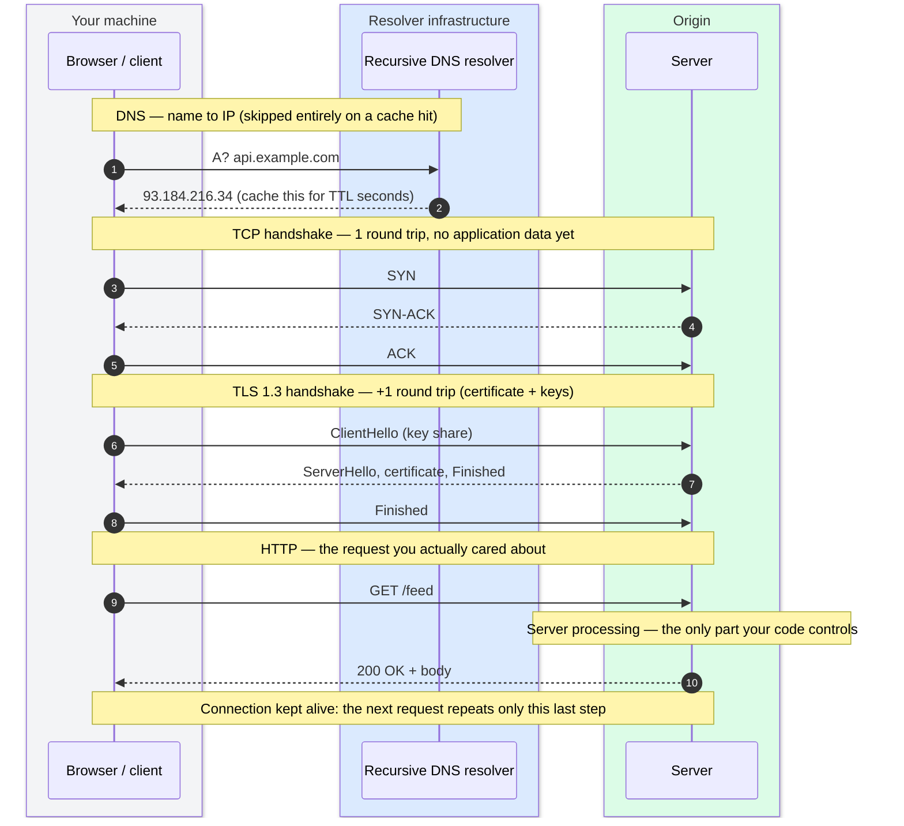
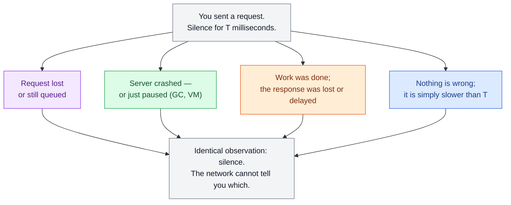

# Networking Essentials

> **Prerequisites:** [Thinking in Trade-offs](/synapse/system-design-from-first-principles/foundations/thinking-in-tradeoffs) | **You'll be able to:** trace every round trip in an HTTPS request and name the cache that removes each one; choose between TCP, UDP, and QUIC — and defend the default; reason about timeouts on a network that guarantees nothing.

## The problem (why this exists)

Your service is fast. The profiler says the handler runs in five milliseconds, the database query in two. Then a user in Mumbai loads the page against your Virginia servers and waits most of a second before your code even begins to run. Nothing is broken. The time went somewhere you never instrumented: name lookups, handshakes, round trips across an ocean. Server processing is usually the only latency engineers measure and control — and on a cold request it can be the smallest line item on the bill.

There is a second, nastier version. You send a payment request downstream and hear nothing for two seconds. Did it fail? Succeed, with the response lost? Is the provider slow, dead, or mid-garbage-collection? The network will not tell you — a lost request, a dead server, and a lost response look identical from where you stand: silence [p. 348].

Every system you design is machines talking over a network, so both problems — latency you didn't count, and uncertainty you can't remove — are load-bearing everywhere. This lesson covers the slice of networking a designer actually uses, ending with the truth that shapes all distributed thinking: the network guarantees you *nothing*.

## Intuition first

Networking survives as a field because of one idea: **layering**. When your code fetches a URL, you don't reason about voltages on a wire or radio frames in the air, just as you call `open()` on a file without instructing the disk head. Each layer offers a small promise to the layer above and hides everything below.

Textbooks present seven OSI layers; practitioners use about four, and speak in the OSI numbers only for three of them — L3, L4, L7:

| Layer | What it moves | The promise it makes | You'll meet |
| --- | --- | --- | --- |
| Link | Frames on one local segment | "I'll get this to a machine on this network — probably" | Ethernet, WiFi |
| Network (L3) | Packets between networks | "I'll route this toward that IP address — best effort, no promises" | IP |
| Transport (L4) | Streams / datagrams end-to-end | "I'll add reliability and ordering — or not, your choice" | TCP, UDP, QUIC |
| Application (L7) | Requests, messages, names | "I'll give these bytes meaning" | HTTP, DNS, TLS*, gRPC |

*TLS is the awkward guest: it rides on top of TCP and underneath HTTP, securing the pipe rather than defining messages. Treat it as a security layer between L4 and L7.

Two intuitions to carry. First, everything above IP inherits IP's manners: the internet and datacenter networks are **asynchronous packet networks** — you can send a packet, but there is no guarantee of when, or whether, it arrives [p. 347]. Packets get dropped, delayed, duplicated, and reordered; every guarantee above that (TCP's ordering, say) is *software compensating*, not the network improving. Second, transport and below run in the OS kernel — efficient, hard to change — while application protocols live in user space, flexible and fast-evolving. The interesting design choices therefore cluster at L4 and L7.

## How it works

### TCP, honestly

TCP turns IP's unreliable packets into a **stream**: a stateful, ordered, byte-oriented connection between two endpoints. Before any data moves, client and server perform the three-way handshake — SYN, SYN-ACK, ACK — one full round trip of pure ceremony. From then on, TCP does four jobs [pp. 348–349]:

- **Retransmission** — the receiver acknowledges data; missing ACKs trigger resends.
- **Ordering** — sequence numbers let the receiver reassemble packets in the order sent, even when the network reorders them.
- **Integrity** — checksums catch corruption in transit.
- **Backpressure** — flow control keeps a fast sender from drowning a slow receiver, and congestion control keeps everyone from drowning the network. When you write to a socket, the OS buffers the data and decides when it may actually leave the machine [p. 349].

That list earns TCP the word "reliable," and the word oversells it. Here is what TCP still can't promise [p. 349]:

1. **An ACK does not mean your message was processed.** It means the remote *kernel* buffered the bytes; the application may crash before reading them. Only a response from the application itself confirms effect.
2. **Deduplication is per-connection.** If the connection drops and your client reconnects and resends, TCP's duplicate suppression does not carry across — the remote application can receive the message twice.
3. **A failed connection tells you nothing about progress.** You cannot know how much of the sent data was processed — none, some, or all.
4. **No timing guarantee at all.** Retransmission is unbounded in time; TCP cannot make a congested network fast, only hide loss as delay [pp. 349, 354].

Those four are the technical backbone of idempotency keys, retries, and timeout design in every later module.

### UDP: when late data is worthless

UDP is the opposite bet: no handshake, no retransmission, no ordering, no backpressure — an 8-byte header versus TCP's 20–60, datagrams flung at an IP and port. Why want that? Because retransmission is only a gift when late data still has value. A packet holding 20 ms of call audio that arrives 500 ms late is worse than useless — players fill the gap with silence and the "retry" happens at the human layer ("sorry, you cut out") [p. 354]. Live video, game state, telemetry, and DNS lookups make the same trade: lower delay variability in exchange for accepting loss [p. 354].

The interview default is TCP — so much so that it usually goes unsaid. Reach for UDP only when you can articulate why stale data is worthless *and* you have an answer for browser clients, which expose UDP essentially only through WebRTC.

### QUIC and HTTP/3, in brief

QUIC is a modern transport built on top of UDP that rebuilds TCP's reliability per-stream and bakes TLS into the transport itself, so the connection and encryption handshakes happen together — one round trip, or zero when resuming a known server [web: RFC 9000]. Because each stream's delivery is independent, one lost packet stalls only its own stream, not the whole connection. HTTP/3 is HTTP running over QUIC [web: RFC 9114]. DDIA's analysis of TCP's limits applies to QUIC too [p. 348] — it is a better-engineered set of the same promises, not an escape from the unreliable network underneath. For interviews, the right framing is to treat QUIC as "a better TCP without TCP's ubiquity" — mention it where handshake latency or mobile networks genuinely hurt, and spend your minutes elsewhere.

### TLS at a glance

TLS gives you an encrypted, integrity-protected channel and proof (via certificate) that you're talking to the server you named. The cost is more round trips before the first byte of application data: the classic TLS 1.2 handshake spends two, TLS 1.3 cuts it to one, and TLS 1.3 **session resumption** lets a returning client send data in the first flight — "0-RTT" — with one sharp caveat: 0-RTT data can be replayed by an attacker, so it's safe only for requests you'd be willing to process twice [web: RFC 8446]. Note the rhyme with TCP's reconnect-duplication problem: at every layer, the escape from a lost handshake is paid for in possible duplicates.

One scoping honesty: TLS encrypts the pipe, it does not sanctify the contents. A request arriving over HTTPS is still attacker-controlled input — validate it server-side.

### DNS: the phone book with a TTL clock

Before any handshake, the client must turn `api.example.com` into an IP address. Your machine asks a **recursive resolver** (your ISP's, or a public one), which — on a cache miss — walks the name hierarchy: root servers point to the `.com` servers, which point to `example.com`'s authoritative servers, which answer [web: RFC 1034]. Lookups typically travel over UDP. The design that makes this scale is caching: every answer carries a **TTL** (time-to-live), and every resolver along the path may serve it from cache until the TTL expires.

Two design consequences follow. First, DNS is free client-side load balancing: return a rotated list of IPs and different clients will land on different servers — this is also the standard way to avoid a load balancer being a single point of failure (two LBs in different regions, DNS rotating between them). Second, **your changes propagate no faster than the TTL**. A "DNS failover" with a 300-second TTL means up to five minutes of clients faithfully dialing the dead address. Low TTLs buy agility and cost you cache efficiency; that tension is the whole game.

### HTTP/1.1 vs HTTP/2: head-of-line blocking at two layers

HTTP/1.1 allows one outstanding request at a time per connection: response N must finish before request N+1 gets going. One slow response blocks everything queued behind it — **head-of-line (HOL) blocking at the application layer**. Browsers work around it by opening several parallel connections per host — typically six — which multiplies every handshake cost [web: MDN — HTTP/1.x connection management].

HTTP/2 fixes that layer: it multiplexes many concurrent **streams** over a single TCP connection, interleaving frames so a slow response no longer blocks the others [web: RFC 9113]. But look one layer down. All those streams ride one TCP byte-stream, and TCP promises in-order delivery of that stream as a whole — so one lost packet halts delivery of *every* stream until the retransmission arrives. HTTP/2 moved HOL blocking from the application layer to the transport layer [web: RFC 9114]. That residue is precisely what QUIC removes with independent streams — which is why HTTP/3 exists.

The lesson generalizes beautifully for interviews: fixing a bottleneck at one layer often reveals the same bottleneck one layer down.

### Connection reuse: why handshake latency compounds

Count the ceremony a cold HTTPS request pays before one application byte moves: a DNS lookup (unless cached), one round trip of TCP handshake, one of TLS 1.3. On an 80 ms cross-Atlantic path that is ~240 ms of overhead before the request itself even departs — against a handler that runs in 5 ms. Now multiply: a service that opens a fresh connection per request pays that tax on *every call*, and a microservice chain pays it at *every hop*.

The remedy is boring and universal: don't throw connections away. HTTP keep-alive holds the connection open for subsequent requests; HTTP/2 goes further and shares one connection among concurrent streams. Clients and services maintain **connection pools** — a set of pre-warmed connections handed out per request and returned after — so steady-state traffic pays the handshake almost never. The catch is that a persistent connection is **state** held at both ends: pools must be sized, idle connections reaped, dead ones detected, and at scale (say, a million WebSocket clients) that state dominates the design. That thread continues in the real-time delivery and load-balancing lessons.

### The walkthrough: what happens when you fetch a URL

Assemble the pieces. You type `https://api.example.com/feed` on a cold client:



Read it as a ledger of round trips — and of the cache that deletes each line. DNS: one or more round trips, deleted by resolver/OS caches until the TTL runs out. TCP handshake: one round trip, deleted by keep-alive and pooling. TLS: one round trip (two on TLS 1.2), deleted by session resumption — or folded into the transport handshake by QUIC. Server processing: yours. The request/response round trip itself: irreducible, unless you move the server closer (that's the CDN lesson). Teardown happens eventually too — FIN/ACK exchanges in both directions — but nobody waits on it.

### What the network actually guarantees: nothing

Now the expert close — the part that quietly underwrites every distributed-systems lesson in this book. When you send a request and hear nothing back, all of the following are possible: your request was dropped; it is sitting in a queue; the server crashed; the server is paused (a garbage collection, a suspended VM) and will resume; the server did the work and the *response* was dropped; or the response is merely delayed [pp. 347–348]. The killer property is not that these failures happen — it's that they are **indistinguishable** from where you sit [p. 348]:



The standard response is a **timeout**: give up after T and assume failure — knowing the work may still happen after you gave up [p. 348]. So how long should T be? If the network guaranteed a maximum delay *d* and servers a maximum handling time *r*, then 2d + r would be a provably safe timeout. Real packet networks guarantee neither [pp. 352–353]. Delay comes overwhelmingly from **queueing** — in switch buffers when a link is contended, in the OS when all cores are busy, in hypervisors while a VM is paused, in TCP's own sender-side buffering — and queues grow without bound as utilization approaches capacity [pp. 353–354]. This is a designed property, not an accident: circuit-switched telephone networks *did* reserve fixed bandwidth end-to-end and delivered bounded delay, but at the price of idle capacity; packet switching was chosen because bursty data traffic gets far better utilization from sharing. "Variable delays in networks are not a law of nature but simply the result of a cost/benefit trade-off" [pp. 355–357].

So timeouts are a genuine trade-off, not a constant to memorize: too short, and you declare slow-but-alive nodes dead — possibly retrying work that succeeded (duplicates), or shedding load onto already-loaded survivors until the whole system cascades; too long, and users wait on the dead [p. 352]. There is no correct value derivable from first principles; mature systems choose timeouts experimentally from measured latency distributions, or continuously adapt them [pp. 355, 357].

Sit with the conclusion, because it is the foundation the rest of the book builds on: "The fact that such partial failures can occur is the defining characteristic of distributed systems" [p. 388]. Networks drop, delay, duplicate, and reorder; anything you build that pretends otherwise is wrong in ways that surface at 3 a.m.

## Trade-offs

Transport choice:

| Option | Gives you | Costs you | Use when |
| --- | --- | --- | --- |
| TCP | Ordering, retransmission, backpressure; universal support | Handshake RTT; loss surfaces as delay; transport-level HOL blocking | Default — nearly everything [p. 349] |
| UDP | Minimal latency variance, no connection state, tiny header | No delivery/ordering guarantees; you build any reliability yourself; weak browser support | Late data is worthless: voice/video, gaming, telemetry, DNS [p. 354] |
| QUIC (HTTP/3) | TCP-like reliability per stream, combined 1-RTT transport+TLS handshake, no cross-stream HOL | Newer, less ubiquitous tooling/support; still an unreliable network underneath | Handshake latency or multiplexed streams dominate; mobile/lossy links [web: RFC 9000] |

Connection strategy:

| Option | Gives you | Costs you | Use when |
| --- | --- | --- | --- |
| New connection per request | Zero connection state; trivially simple clients | Full handshake tax (DNS + TCP + TLS) on every call | Rare, one-off calls; scripts |
| Keep-alive + pooling | Handshake amortized to ~zero; predictable latency | Pool sizing/reaping; state at both ends; stale-connection detection | The default for services and clients |
| Long-lived persistent (WebSocket-style) | Server push, lowest per-message overhead | Connection state dominates at scale; L4-aware load balancing; reconnect storms | High-frequency bidirectional traffic |

## Numbers that matter

The physics floor: light in fiber travels at roughly two-thirds of c — about 200,000 km/s — so New York ↔ London (~5,600 km) has a theoretical minimum round trip of ~56 ms; in practice budget >80 ms, versus <1 ms to a nearby server. No optimization reclaims physics; only moving endpoints closer does.

The handshake ledger, in round trips before the first application byte: TCP 1; TLS 1.2 +2; TLS 1.3 +1; TLS 1.3 resumed +0 to +1; QUIC 1 combined, 0 resumed [web: RFC 8446, RFC 9000]. Worked example on an 80 ms RTT path: fresh HTTPS ≈ 240 ms of pure setup+request round trips before the response arrives; on a pooled connection ≈ 80 ms — a 3× difference your profiler will never show you.

Headers, for intuition about overhead: UDP 8 bytes; TCP 20–60 bytes.

How often the network itself fails: one study of a medium-sized datacenter found ~12 network faults per month — half disconnecting one machine, half a whole rack [p. 350]. Delay tails are worse than intuition: round trips across cloud regions have been observed reaching several *minutes* at high percentiles, and even intra-datacenter packet delay can exceed a minute during a switch topology reconfiguration [p. 350]. Set timeouts with the tail in mind, not the median — the percentile machinery for that lives in [Latency, Throughput & Percentiles](/synapse/system-design-from-first-principles/foundations/latency-throughput-percentiles), and the estimation habit in [Estimation & the Numbers](/synapse/system-design-from-first-principles/foundations/estimation-and-numbers).

## In production

Connection pooling is ambient in real systems: every serious HTTP client, database driver, and RPC framework maintains a pool, and a great many production incidents are pool incidents — exhaustion under a traffic spike, stale connections to a rebooted backend, or a thundering herd of re-handshakes when a load balancer restarts and drops a million keep-alive connections at once. Rule of thumb, not from source: treat "pool exhausted" and "connection reset by peer" as capacity signals, not mysteries.

TLS is usually **terminated at the edge**: an L7 load balancer or CDN edge accepts the client's TCP+TLS handshakes and forwards requests to backends over separate, long-lived internal connections. This moves the handshake round trips onto the short client↔edge path and lets the expensive origin hops be amortized across all users. Rule of thumb, not from source: this edge-termination pattern is a large share of what a CDN buys you even for uncacheable, dynamic traffic.

QUIC/HTTP-3 is real but unevenly deployed — major browsers and large CDNs speak it, much intra-datacenter traffic doesn't. The calibration for interviews: knowing it earns credit with performance-minded interviewers; leaning on it rarely wins a design.

Timeout tuning in the wild follows DDIA's advice: measure round-trip distributions across time and machines, then set timeouts empirically — or adapt continuously, as the Phi Accrual failure detector does in Cassandra and Akka, and as TCP's own retransmission timers do [p. 355]. In multitenant clouds, a noisy neighbor saturating shared links or CPUs can swing your latencies with no visibility into the cause — another reason static timeout constants age badly [pp. 354–355]. And because a timed-out request may still have executed, production retry policy is never bare: retries come with exponential backoff plus jitter, and mutating APIs get idempotency keys so a duplicate arrival is harmless. Those two patterns get their own treatment later in the book.

DNS in production is your cheapest availability lever and your slowest one: rotating records across two load balancers in different regions is the standard defense against an LB as single point of failure, but failover speed is bounded by the TTL your clients cached.

## Pitfalls & interview traps

<div style="border-left:4px solid #da5233;background:rgba(218,82,51,0.08);padding:0.6rem 1rem;border-radius:0 0.5rem 0.5rem 0;margin:1.25rem 0">

⚠️ **The trap: "TCP is reliable, so my request went through."** TCP's ACK means the remote kernel buffered your bytes — not that the application processed them; the app can crash with your request sitting unread in its socket buffer, and a connection error tells you nothing about how much was processed [p. 349]. The twin trap: **"the timeout fired, so it failed."** A timeout is the *absence of information* — the work may have completed after you gave up [p. 348]. Together these force the design rule you'll use all book: confirmation requires an application-level response, and any retry of a mutation must be idempotent.

</div>

More traps interviewers actually probe:

- **Retrying without idempotency.** TCP dedupes only within one connection; your client's reconnect-and-resend can double-charge a card [p. 349]. Expect the follow-up: "your payment call timed out — walk me through exactly what you do next."
- **"HTTP/2 solved head-of-line blocking."** It solved the application layer; the TCP layer still stalls every stream on one lost packet [web: RFC 9114]. Saying "moved, not solved — QUIC is the actual fix" is the senior answer.
- **Ignoring the handshake tax in a microservice chain.** Five hops × fresh TLS connections per call quietly adds up; the interviewer is fishing for "keep-alive and connection pools" the moment latency budgets come up.
- **Treating DNS changes as instant failover.** Clients keep dialing the cached IP until the TTL expires — say the TTL-bound out loud when you propose DNS failover.
- **Choosing UDP for "performance" where loss isn't acceptable** — or where your users are in browsers, which effectively confine UDP to WebRTC.
- **Trusting HTTPS request bodies.** Encryption in transit says nothing about the honesty of the sender; validate server-side.

## Check yourself

```quiz
{"prompt": "A client in New York makes its first HTTPS request to a server in London (~80 ms round trip, TLS 1.3, DNS already cached). Server processing takes 5 ms. Roughly when does the response arrive?", "options": ["~85 ms — one round trip plus processing", "~165 ms — TCP handshake, then request/response", "~245 ms — TCP handshake, TLS handshake, then request/response", "~325 ms — DNS, TCP, TLS, then request/response"], "answer": "~245 ms — TCP handshake, TLS handshake, then request/response"}
```

```quiz
{"prompt": "Ten HTTP/2 streams share one TCP connection. A packet belonging to stream 3 is lost in transit. What do the other nine streams experience?", "options": ["Nothing — HTTP/2 streams are independent", "They stall until TCP retransmits the lost packet", "They are reset and must be retried by the client", "Only streams opened after stream 3 stall"], "answer": "They stall until TCP retransmits the lost packet"}
```

```quiz
{"prompt": "You are designing the media path for a video call. A packet carrying 20 ms of audio is lost. Which behavior do you want from the transport?", "options": ["Retransmit it in order — TCP, so no audio is ever lost", "Skip it and keep playing — UDP, because late audio is worthless", "Retransmit it on a second parallel TCP connection", "Buffer a full second everywhere — TCP with a larger window"], "answer": "Skip it and keep playing — UDP, because late audio is worthless"}
```

```quiz
{"prompt": "Your service sent a charge request to a payment provider. The OS confirms the bytes were ACKed — then the connection dies before any HTTP response arrives. What do you actually know?", "options": ["The charge succeeded — TCP is reliable and the data was delivered", "The charge failed — no response means the request never arrived", "The provider's kernel received the bytes; whether the application processed the charge is unknown", "TCP will automatically resubmit the charge on the next connection"], "answer": "The provider's kernel received the bytes; whether the application processed the charge is unknown"}
```

<details>
<summary><strong>Q:</strong> Walk through fetching <code>https://api.example.com/feed</code> from a completely cold client. Name every round trip before the first byte of the response body — and the mechanism that would remove each one on a warm request.</summary>

**A:** (1) DNS resolution — one or more round trips through the recursive resolver (which may itself walk root → TLD → authoritative on a cold cache); removed by DNS caching until the TTL expires. (2) TCP three-way handshake — one round trip; removed by keep-alive/connection pooling. (3) TLS 1.3 handshake — one round trip (two under TLS 1.2); removed by session resumption, or merged into the transport handshake entirely by QUIC. (4) The HTTP request/response itself — one round trip plus server processing; irreducible except by moving the server closer (CDN/edge) or caching the response. Cold total on an 80 ms path: roughly 320 ms with cold DNS; warm total: ~80 ms plus processing.

</details>

<details>
<summary><strong>Q:</strong> Why is there no "correct" timeout value for a service call, and what do mature systems do instead?</summary>

**A:** A provably safe timeout of 2d + r exists only if the network has a bounded maximum delay d and servers a bounded handling time r. Packet-switched networks bound neither: delay is dominated by queueing — switch buffers, busy CPUs, VM pauses, TCP's own sender buffering — which grows without bound near capacity, and cross-region round trips have reached minutes at high percentiles [pp. 350, 352–354]. Short timeouts declare slow-but-alive nodes dead (duplicate work, load shed onto survivors, cascade risk); long ones make users wait on genuinely dead nodes [p. 352]. Mature systems therefore choose timeouts experimentally from measured latency distributions or adapt them continuously (Phi Accrual in Cassandra/Akka) [p. 355], pair every retry with exponential backoff plus jitter, and make retried mutations idempotent because the timed-out attempt may have executed.

</details>

<details>
<summary><strong>Q:</strong> Your p50 latency is steady at 30 ms, but p99 spikes to 2 s at random times that correlate with nothing in your own deploys. What network-level explanations should you investigate first?</summary>

**A:** Queueing, in its several homes: contended switch/link buffers upstream (congestion), the destination host's OS queueing requests while all cores are busy, hypervisor pauses on virtualized hosts, and TCP retransmissions surfacing packet loss as latency [pp. 353–354]. In a multitenant cloud, a noisy neighbor saturating shared links, NICs, or CPUs produces exactly this signature, and you have no direct visibility into their usage [pp. 354–355]. This is why tail latency, not median, drives timeout and capacity choices.

</details>

## Sources

- DDIA2 ch. 9 pp. 347–349 (asynchronous packet networks; six failure modes of a request; TCP's guarantees and their limits — kernel ACKs, per-connection dedup, unknown progress on failure).
- DDIA2 ch. 9 pp. 350–353 (network faults in practice — ~12/month per medium DC, multi-minute delay tails; timeouts, the 2d + r bound, premature-death cascades).
- DDIA2 ch. 9 pp. 353–355 (queueing as the source of delay variability; TCP vs UDP for latency-sensitive traffic; noisy neighbors; experimentally chosen and adaptive timeouts, Phi Accrual).
- DDIA2 ch. 9 pp. 355–357 (circuit vs packet switching; bounded delay vs utilization; variable delay as a cost/benefit trade-off).
- DDIA2 ch. 9 p. 388 (partial failure as the defining characteristic of distributed systems).
- [web: RFC 8446] — TLS 1.3: 1-RTT handshake, session resumption, 0-RTT replay caveat.
- [web: RFC 9000] — QUIC: UDP-based, combined transport+TLS handshake, independent streams.
- [web: RFC 9113] — HTTP/2 stream multiplexing over one TCP connection.
- [web: RFC 9114] — HTTP/3 over QUIC; TCP head-of-line blocking as HTTP/2's residual limit.
- [web: RFC 1034] — DNS name hierarchy, recursive resolution, TTL-governed caching.
- [web: MDN — HTTP/1.x connection management] — one-at-a-time requests per HTTP/1.1 connection; browsers' ~6 parallel connections per host.
