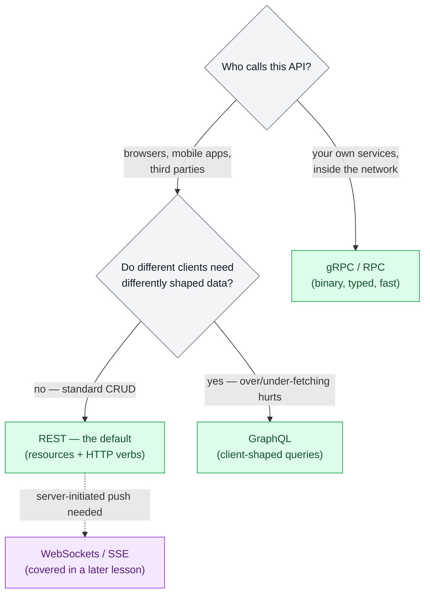
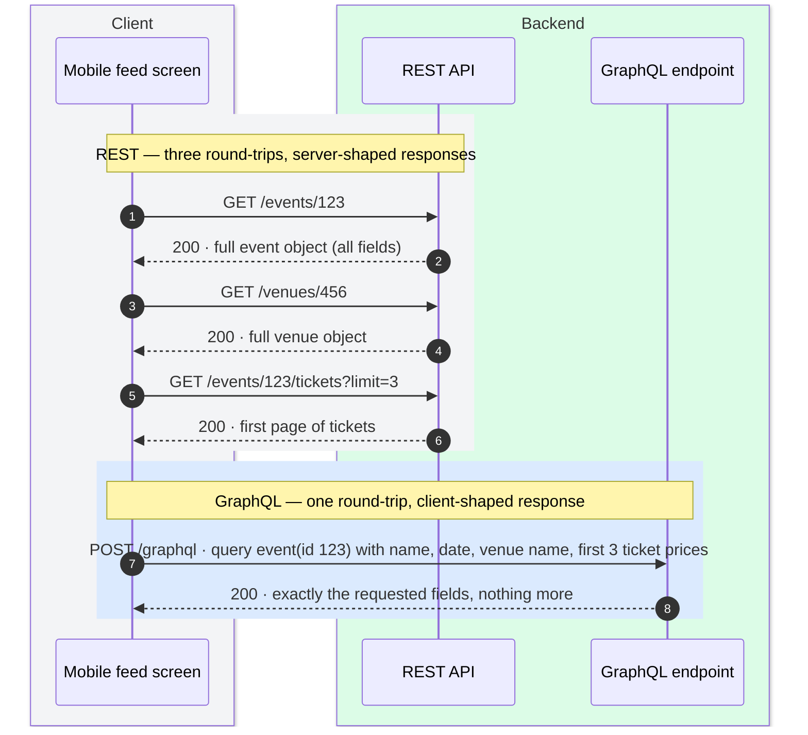

# API Design

> **Prerequisites:** [Networking Essentials](/synapse/system-design-from-first-principles/foundations/networking-essentials) | **You'll be able to:** state a clean REST API for any system in under five minutes; choose between REST, GraphQL, and gRPC with reasons an interviewer will accept; design pagination and versioning that survive both scale and time.

## The problem (why this exists)

Your booking service works. Then two things happen in the same week.

First, a user on hotel Wi‑Fi taps **Book**, the request times out, and their app retries — sensible behavior, since networks drop packets. But the original request had actually reached the server; only the response was lost. Two bookings, one angry customer, and nothing in HTTP stopped it.

Second, your team renames a response field from `start` to `startTime` because it reads better. The web app updates that afternoon. But a third of your users run a mobile build from last year, that build crashes on the missing field, and you cannot force them to update — client-side software upgrades only when users choose to install it, while your servers roll forward on your schedule.

Both failures share a root cause: an API is not an implementation detail. It is a **contract with code you do not control and cannot upgrade in lockstep**. Inside one service you refactor freely — caller and callee ship in the same deploy. Across an API boundary, the two sides change at different times, and the wire between them fails in ways a local function call never does. The contract must therefore be designed to survive two hostile forces: **the network**, which loses, duplicates, and delays messages, and **time**, which guarantees that old and new versions of clients and servers run simultaneously.

Interviews compress this into a five-minute step — "define your API" — and most candidates either rush past it with sloppy endpoints or burn twenty minutes gold-plating it. This lesson gives you the mechanics to do it well *and* fast.

## Intuition first

Think of an API as a restaurant menu. The menu names *dishes* (resources), not kitchen procedures — you order "the ramen," not "boil stock for six hours." The kitchen can change its recipe, its staff, its entire stove layout, and regulars notice nothing as long as the dish that arrives still matches the menu. And the menu can grow: adding a dessert section doesn't confuse a customer who only ever orders ramen — they simply ignore what they don't recognize.

That analogy carries the three questions every API design must answer:

1. **What are the things?** Name the nouns clients care about — users, events, bookings. These become your resources. Verbs come from a small standard set, not from your imagination.
2. **What happens when the network betrays you?** A request can vanish, or succeed while its *response* vanishes. From the client's side those look identical. The contract must say what a retry means — which operations are safe to repeat, and how the server recognizes a repeat.
3. **How does the contract change without breaking anyone?** Old clients will call new servers, and (mid-rollout) new clients will call old servers. Changes must be shaped so that each side can tolerate the other being from a different era — like the regular ignoring the new dessert section.

Everything in this lesson — REST conventions, GraphQL, gRPC, pagination, versioning, idempotency keys — is a worked answer to one of those three questions. Get the nouns right, make retries safe, and only ever change the menu additively, and you've internalized 90% of API design.

## How it works

Three protocol families cover essentially the whole design space. Choose by who calls you and what shape of data they need:



### Resources and REST semantics

REST is not a wire protocol; it's a design philosophy layered on HTTP: simple data formats (almost always JSON), URLs to identify resources, and HTTP's built-in features for caching, authentication, and content negotiation. Designing a REST API is three decisions.

**Decision 1 — name the resources.** Resources are your core entities as plural nouns: `/events`, `/venues`, `/bookings`. They are *things, not actions* — no `/createBooking`, no `/cancel`. If a relationship is required to make sense of a request, nest it in the path (`/events/{id}/tickets` — tickets always belong to an event); if it's an optional filter, use a query parameter (`/tickets?event_id=123&section=VIP`).

**Decision 2 — pick verbs from the standard set.** HTTP's methods carry precise semantics, and the property interviewers probe is **idempotency**: can the operation be repeated with the same effect on server state?

| Method | Meaning | Idempotent? |
| --- | --- | --- |
| `GET` | Read; never changes state ("safe") | Yes |
| `POST` | Create a new resource; server assigns the ID | **No** — two calls, two resources |
| `PUT` | Replace a resource wholesale at a known URL | Yes — same document, same final state |
| `PATCH` | Modify part of a resource | Only if the patch is absolute ("set email to X"), not relative ("add 1 to counter") |
| `DELETE` | Remove a resource | Yes — the resource ends up gone either way |

Two precision points worth having ready. Idempotency is about the **effect on server state**, not identical responses — the second `DELETE` may return `404` where the first returned `200`, and it's still idempotent. And while interview material (including our swiftly source) rounds PATCH up to "idempotent," the HTTP spec deliberately does not guarantee it [web: RFC 5789] — it depends on what the patch document says. Say "PATCH with an absolute update" and you're both fast and correct.

**Decision 3 — place the data.** Path parameters identify (*which* event), query parameters modify (*filtered how, sorted how, which page*), and the request body carries the payload (the booking details themselves — anything structured, large, or sensitive). For responses, what matters is the status-code *family*: `2xx` success (`200` OK, `201` created), `4xx` the client's fault (`400` malformed, `401` unauthenticated, `403` forbidden, `404` missing, `429` rate-limited), `5xx` your fault (`500`). Interviewers care that you distinguish client errors from server errors, not that you've memorized the registry.

### When GraphQL earns its keep

GraphQL came out of Facebook (2012) to fix a concrete pain: the mobile app and the web app needed differently shaped data from the same backend, and with fixed REST endpoints the choices were bad — either proliferate endpoints per screen, or return everything to everyone and let phones download fields they never render (over-fetching), or force clients to stitch several calls per screen (under-fetching).

GraphQL replaces resource endpoints with **one endpoint that accepts a query describing exactly the JSON the client wants**; the response mirrors the query's structure, containing exactly the requested fields — no more, no less. The server doesn't need to know which fields each screen renders, and a frontend team can add a field (say, `imageUrl`) to a screen without any server change, as long as it exists in the schema. That is the actual selling point: **client-shaped aggregation** and frontend iteration speed, not "it's newer than REST."



On a high-latency mobile link, collapsing three sequential round-trips into one is a real win — recall from [Networking Essentials](/synapse/system-design-from-first-principles/foundations/networking-essentials) that each round-trip costs a full RTT.

Now the costs, because they're why GraphQL is not the default. The language is *deliberately restrictive*: queries arrive from untrusted clients, so anything expensive is disallowed — no recursive queries, no arbitrary search conditions beyond what the schema explicitly offers — precisely to prevent a hostile query from becoming a denial-of-service attack. Responses happily duplicate data (the same sender name repeated on every message) as a design choice to keep client rendering simple. The server may store data normalized and join at query time — GraphQL runs fine over relational, document, or graph databases, the "graph" name notwithstanding — but only relationships declared in the schema are traversable. Operationally you inherit query parsing and validation, per-field authorization (a user may see an event's name but not its revenue), rate limiting by query cost rather than request count, and caching that no longer falls out of HTTP for free. And resolvers naïvely written produce the **N+1 problem**: query 100 events with their venues and you fire 1 query for events plus 100 for venues — 101 instead of 2 — until you add batching (the dataloader pattern).

### RPC and gRPC — and the lie of location transparency

Between your own services, resource semantics stop paying rent. When the booking service asks the auth service a question, `checkPermission(userId, resource)` is the honest shape — an action, not a noun. That's RPC: make a network call look like calling a function. The dominant modern framework is gRPC — Protocol Buffers for binary encoding, HTTP/2 for transport. You write a `.proto` contract file, and codegen produces typed client and server stubs in every language your teams use, catching type mismatches at compile time; Apache Thrift (originally Facebook) plays the same role elsewhere. Binary encoding is dramatically tighter than JSON — the numbers below — and that efficiency matters when one user request fans out into dozens of internal calls.

But RPC's founding abstraction — **location transparency**, the idea that a remote call can be made indistinguishable from a local one — is a lie, and DDIA is blunt about it. Four decades of frameworks built on that promise (Java RMI, DCOM, CORBA, SOAP) collapsed under it. A local call is predictable: it succeeds or fails based on arguments you control. A network call can fail because the request was lost, the response was lost, or the remote machine is slow or dead — and a **timeout tells you nothing about whether the operation happened**. Retrying may execute the action twice unless the protocol has deduplication (idempotence) built in. Latency swings from sub-millisecond to seconds; parameters must be encoded into bytes rather than passed by reference; and when client and server are written in different languages, types don't line up cleanly. Part of REST's enduring appeal is that it *doesn't pretend*: it treats network state transfer as visibly different from a function call.

So the working rule: **REST (or GraphQL) at the edge, gRPC inside** — and even inside, write every handler as if it will be called twice, because it will be.

### Pagination done right

Any endpoint that returns a list must be paginated — "return all events" is gigabytes waiting to happen. There are two schemes, and the difference shows up exactly at scale.

**Offset pagination** — `/events?offset=20&limit=10` — is positional: skip 20 rows, return 10. It's trivial to implement and supports "jump to page 5." It fails two ways as data grows. *Correctness:* the offset counts against a live, shifting list — if three posts are inserted while a user reads page 1 of a newest-first feed, page 2 re-serves the tail of page 1 (duplicates); deletions make rows silently vanish between pages. *Cost:* offset is a count of rows to discard, so the database must materialize and throw away 100,000 rows to serve `offset=100000` — deep pages get linearly slower (first-principles consequence of positional addressing, not a quirk of one database).

**Cursor pagination** fixes both by replacing the position with a **pointer to the last item seen**: the response carries an opaque cursor (an encoded ID or timestamp, e.g. `cmd9atj3p0000...`), and the next request says "everything after this." Because the cursor names a *record* rather than a *position*, inserts and deletes elsewhere in the list can't shift it, and the database can seek directly to it via an index and read only one page — constant cost at any depth (the keyset technique: `WHERE (created_at, id) < (cursor) ORDER BY created_at DESC, id DESC LIMIT n`). The requirements: a stable total order — which means a unique tie-breaker column, since timestamps collide — and giving up "jump to page N." Every large feed-shaped system ends up here.

**Filtering and sorting** ride the same query string: `/events?city=NYC&date_from=2026-07-01&sort=-start_time&limit=20`. Two conventions keep this sane: multiple filters combine as AND, and the sortable/filterable fields are an explicit allow-list, not "any column" — every combination you accept is a query shape you must be able to serve efficiently with an index, and it also defines the sort key your cursors encode.

### Versioning and compatibility — evolvability at the contract

Here is the formal frame for the `startTime` disaster from the opening, straight from DDIA. **Backward compatibility**: newer code can read data written by older code. **Forward compatibility**: older code can read data written by newer code — the harder direction, because old code must have been written to *ignore* additions it can't understand.

<div style="border-left:4px solid #15448e;background:rgba(21,68,142,0.08);padding:0.6rem 1rem;border-radius:0 0.5rem 0.5rem 0;margin:1.25rem 0">

ℹ️ **Who reads whose data?** In service dataflow, the standard simplifying assumption is that servers deploy first, clients upgrade later. Requests are then *old-code-writes, new-code-reads* → the server needs **backward compatibility on requests**. Responses are *new-code-writes, old-code-reads* → clients need **forward compatibility on responses**. When you *can't* control deploy order (public APIs, mid-rollout servers), you need both directions on both messages.

</div>

For JSON REST APIs this yields concrete evolution rules: **adding optional request parameters and adding response fields is normally safe**; removing fields, renaming them, changing their types, or making optional things required is breaking. One subtle trap deserves respect: a client that GETs a full object, modifies one field, and PUTs the whole thing back will silently *delete* any field added to the schema since that client was built — the round-trip data-loss hazard. Defenses: prefer PATCH for partial updates, and have clients preserve unknown fields.

For gRPC, the compatibility rules are inherited from Protocol Buffers' field tags: every field has a number, and the encoded data carries tags, not names. So you may rename fields freely, you may add fields with *fresh* tag numbers (old code skips unknown tags; new code fills defaults for missing ones), but you may never change or reuse a tag number — a removed tag is reserved forever.

When a breaking change is truly unavoidable, you version explicitly. **URL versioning** (`/v2/events`) is explicit, easy to route, easy to test — the interview-safe answer. **Header versioning** (`Accept-Version: 2`) keeps URLs clean at the cost of visibility; some providers even pin a version server-side per API key. There's no industry consensus on the mechanism — but there is consensus on the burden: across organizational boundaries you can't force clients to upgrade, so old versions must keep working for a long time, possibly indefinitely. Every version you ship is a promise you'll be keeping for years — which is why the additive-change discipline above is worth so much.

### Idempotency keys

REST's verb semantics leave one hole: the most important operation in most systems — *create* — is a POST, and POST is not idempotent. The network guarantees that some client will eventually retry a create whose response was lost. The contract-level fix is an **idempotency key**: the client generates a unique key per logical operation (not per HTTP attempt) and sends it with the request; the server remembers key → result, executes on first sight, and replays the stored result for any repeat. The retry becomes safe *by contract* — deduplication is built into the protocol rather than hoped for. Payment APIs made this pattern famous (Stripe's `Idempotency-Key` header), and the full mechanics — key storage, expiry, races between concurrent retries — get their own treatment in the patterns module later in this book. At this stage, the design skill is simply *noticing which endpoints need one*: anything unsafe to double-execute.

### Webhooks vs polling

One paragraph, because it's a contract question you'll face constantly: how does a client learn that something happened (payment settled, job finished)? **Polling** — the client re-asks on a timer — is simple and keeps the client in control, but its latency is the poll interval, and at scale most polls return "nothing yet," which is wasted load. A **webhook** inverts the arrow: the consumer registers a callback URL and the provider POSTs events to it as they occur — near-real-time and quiet in between, at the price of the consumer now operating a public endpoint: it must verify signatures (anyone can POST), respond fast, and treat deliveries as at-least-once — providers retry unacknowledged deliveries, so webhook handlers need the same dedup discipline as any retried request, which is why webhook payloads carry event IDs. Rule of thumb: server-to-server integrations across organizations use webhooks (often with polling as a reconciliation backstop); browser/mobile real-time uses the push transports from the realtime lesson later in this book.

### The five-minute version (interview angle)

In the interview, the API step is a checkpoint, not a destination. The efficient script: (1) *"I'll use REST — standard CRUD, well-understood tooling"* — one sentence, only elaborate if there's a real trigger (diverse clients → GraphQL; internal high-QPS hops → "services talk gRPC internally"). (2) Write one endpoint per core entity action, verb + path + payload sketch: `POST /events/{id}/bookings {seats} → 201 {bookingId}`. (3) Add the hygiene line: *"List endpoints are cursor-paginated; mutating endpoints take an idempotency key; auth via JWT — happy to go deeper if useful."* (4) Move on. That's senior signal: completeness *and* time discipline.

## Trade-offs

| Option | Gives you | Costs you | Use when |
| --- | --- | --- | --- |
| **REST** | Ubiquity, human-readable JSON, HTTP caching/auth for free, evolves safely by adding fields, trivial to state in an interview | Fixed response shapes → over/under-fetching; one round-trip per resource; no compile-time contract by default (bolt on OpenAPI) | Default. Public/client-facing CRUD APIs — most systems, most interviews |
| **GraphQL** | Client-shaped responses in one round-trip; frontend adds fields with zero server change; one endpoint aggregating many sources | Resolver complexity, N+1 unless batched, per-field authz, cost-based rate limiting, HTTP caching lost, DoS-guard restrictions | Many client types with genuinely different data needs; read-heavy aggregation UIs (feeds, dashboards) |
| **gRPC (RPC)** | Binary compactness (~2.5× smaller payloads), HTTP/2 multiplexing, codegen with compile-time types, streaming | Not browser-native; binary is opaque to debug; tempts you to treat network calls as local; schema/tag discipline required | Service-to-service inside your perimeter, high call volume, polyglot teams |

And within any of the three, for list endpoints:

| Option | Gives you | Costs you | Use when |
| --- | --- | --- | --- |
| **Offset pagination** | Dead-simple; random page access ("page 5 of 40") | Duplicates/skips as data shifts; cost grows linearly with depth | Small, mostly-static datasets; admin tables; interview default unless probed |
| **Cursor pagination** | Stable under concurrent writes; constant cost at any depth | Opaque to users (no page jumping); needs a stable unique sort key | Feeds, infinite scroll, anything high-volume or real-time |

The deeper pattern — every row of these tables is a gives-you/costs-you pair, never a free lunch — is the through-line of this book; see [Thinking in Trade-offs](/synapse/system-design-from-first-principles/foundations/thinking-in-tradeoffs).

## Numbers that matter

Honest figures for this topic — payload sizes and pagination limits, not padded tables. Calibrate against [Estimation and Numbers](/synapse/system-design-from-first-principles/foundations/estimation-and-numbers).

| Figure | Value | Why it matters |
| --- | --- | --- |
| Same sample record: JSON / MessagePack / Protobuf / Avro | 81 B / 66 B / 33 B / 32 B | Schema-driven binary halves the payload vs JSON — the concrete case for gRPC on high-volume internal hops (DDIA's measured example) |
| Base64-encoding binary into JSON | ~+33% size | Why blob data goes in object storage with URLs in the API, not inline |
| Largest integer JSON survives everywhere | 2^53 | IEEE-754 doubles: 64-bit IDs get silently corrupted in JavaScript — send them as strings too |
| GraphQL N+1 at 100 events | 101 queries instead of 2 | The default resolver cost you must name (and fix with batching) whenever you propose GraphQL |
| Typical page sizes | 10–20 per page in the swiftly examples; *rule of thumb, not from source:* production APIs commonly cap `limit` at ~100 | Uncapped limits are a self-DoS vector — `?limit=1000000` is a full table scan on demand |
| Interview budget for the API step | ~5 minutes | Candidates fail this step by overspending far more often than by underspecifying |

## In production

The compatibility rules above aren't theory — they're visible in the APIs you already use. X (Twitter) returns every 64-bit post ID **twice** in its JSON — once as a number, once as a decimal string — because JavaScript clients silently corrupt integers above 2^53; the contract bends around the weakest decoder. Stripe holds the industry benchmark for both idempotency keys and versioning: every mutating call accepts an `Idempotency-Key`, and each account is pinned to a dated API version so Stripe can evolve without breaking a client integrated years ago — the "maintain old versions possibly indefinitely" burden, productized.

Contract tooling has consolidated onto two interface-definition languages: **OpenAPI** (Swagger) for JSON/REST services and **Protocol Buffers** for gRPC. Teams generate client SDKs, documentation, and test consoles from the definition; frameworks split on direction (FastAPI derives the spec from code; gRPC generates code from the spec). The mature setups wire **compatibility checks into CI** — a proposed schema change is diffed against the published contract, and a build that removes a field or reuses a protobuf tag fails before it ships, which is cheap insurance given that rolling upgrades guarantee mixed versions in production every single deploy.

The GraphQL story in industry matches its origin: Facebook built it for mobile clients, and its production home remains the **aggregation gateway** — a GraphQL layer in front of internal REST/gRPC services (GitHub's public API v4 is GraphQL; Shopify runs storefront APIs on it), with dedicated tooling for query-cost limits, per-field authorization, and translating queries into backend calls. Meanwhile the REST-outside/gRPC-inside split is the standard posture at scale — public traffic terminates at an API gateway speaking JSON, then fans out over binary RPC. Webhooks round out the picture as the cross-organization event backbone (Stripe, GitHub, Slack): signed payloads, retries with backoff, and consumer-side dedup by event ID — at-least-once delivery, by contract.

## Pitfalls & interview traps

<div style="border-left:4px solid #da5233;background:rgba(218,82,51,0.08);padding:0.6rem 1rem;border-radius:0 0.5rem 0.5rem 0;margin:1.25rem 0">

⚠️ **The two ways the network makes a liar of your API.** First: treating a remote call like a local call — a timeout is *not* a failure, it's an unknown; if your booking POST has no idempotency key, the interviewer's next question ("the client retried — how many bookings exist?") sinks the design. Second: offset pagination on a live feed — at depth it re-serves and skips items as data shifts, and the database burns linear work discarding skipped rows. Both traps share a signature: they work perfectly in the demo and fail at scale, which is exactly why interviewers probe them.

</div>

The recurring mistakes, roughly in the order interviewers see them:

- **Verbs in URLs** — `/createBooking`, `/cancelBooking`. Resources are things; the verb is the HTTP method. Model the noun (`POST /bookings`, `DELETE /bookings/{id}`) and the API stops sprawling into a function list.
- **Status-code trivia in either direction** — returning `200` with `{"error": ...}` for everything, or burning interview time reciting the registry. Know the families cold (4xx client, 5xx server), name the handful that matter, move on.
- **Breaking changes in disguise** — renaming a response field, changing a type, making an optional parameter required. State the additive discipline: add fields, never remove or repurpose; for protobuf, never reuse a tag number. The follow-up you should expect: *"an old client PUTs back an object it fetched before your new field existed — what happens to that field?"* (It's silently erased, unless clients preserve unknown fields or you use PATCH.)
- **GraphQL by reflex** — proposing it "for flexibility" with no diverse-client story, then having no answer for N+1, query-cost limits, or per-field authz. Name the trigger (over/under-fetching across client types) or stay on REST.
- **Pagination amnesia** — any unbounded list endpoint. Interviewers care that you paginated at all more than which flavor; saying "cursor-based, because this feed is write-heavy" is the senior version.
- **Spending 15 minutes here** — the most common failure isn't a bad API, it's a good API that ate the deep-dive time. State it, flag idempotency and pagination, and move.

## Check yourself

```quiz
{"prompt": "A client sends POST /events/123/bookings, the connection times out, and the client retries. The original request actually reached the server. With no special handling, what happens?", "options": ["Nothing — POST is idempotent, so the server ignores the duplicate", "The server creates a second booking; the user ends up with two", "The retry fails with 409 Conflict because HTTP detects the duplicate", "The load balancer deduplicates the retry automatically"], "answer": "The server creates a second booking; the user ends up with two"}
```

```quiz
{"prompt": "Your team always deploys API servers before rolling out new client versions. Per DDIA's dataflow-through-services rule, what must you maintain?", "options": ["Backward compatibility on requests, forward compatibility on responses", "Forward compatibility on requests, backward compatibility on responses", "Backward compatibility on both requests and responses", "Nothing — controlling deploy order removes the compatibility problem"], "answer": "Backward compatibility on requests, forward compatibility on responses"}
```

```quiz
{"prompt": "A newest-first feed uses offset pagination. While a user reads page 1 (items 1–10), three new posts are published. What does the request for page 2 (offset=10, limit=10) return?", "options": ["Items 11–20 as expected — offsets are computed against a snapshot", "The last three items of page 1 again, because every row shifted down by three", "An error, because the result set changed between requests", "Items 14–23, silently skipping three posts"], "answer": "The last three items of page 1 again, because every row shifted down by three"}
```

```quiz
{"prompt": "A gRPC service's protobuf schema contains `string email = 2;`. Which change keeps old and new binaries interoperable?", "options": ["Delete the field, then later reuse tag 2 for `string phone`", "Change the field to `int64 email = 2` for compactness", "Rename it to `contact_email`, keeping tag 2", "Move it to tag 1 for tidiness, keeping the name `email`"], "answer": "Rename it to `contact_email`, keeping tag 2"}
```

**Prose questions** — answer out loud before expanding.

<details>
<summary><strong>Q1. State the API for a Ticketmaster-style booking system in under a minute, the way you would in an interview.</strong></summary>

"I'll use REST — this is standard CRUD from web and mobile clients. Core entities are events, venues, tickets, bookings, so:

- `GET /events?city=&date_from=&cursor=&limit=` — search/browse, cursor-paginated
- `GET /events/{id}` — event details (venue embedded or linked)
- `GET /events/{id}/tickets?section=` — available inventory
- `POST /events/{id}/bookings` with `{ticketIds}`, an `Idempotency-Key` header, auth required → `201 {bookingId, status}`
- `DELETE /bookings/{id}` — cancel, idempotent

Booking is the one unsafe operation, hence the idempotency key — a timed-out create will be retried and must not double-book. Internal services would talk gRPC, but that's high-level design. Moving on to the architecture."

That's the whole step: protocol + why, endpoints mapped to entities, the retry hole plugged, exit line.

</details>

<details>
<summary><strong>Q2. Your interviewer pushes: "gRPC is faster — why not use it for the public mobile API too?" Give three grounded reasons.</strong></summary>

1. **You don't control public clients or their upgrade schedule.** Old app builds live for years, so the contract must evolve additively and stay debuggable across versions — JSON's self-describing, human-readable responses and REST's add-a-field evolution path fit that constraint; a binary contract raises the coordination cost with every client you can't force to update.
2. **REST rides HTTP's native machinery** — cache control, content negotiation, auth headers, status semantics — which is exactly what edge infrastructure (CDNs, gateways, browser tooling) is built around. gRPC's HTTP/2 binary framing isn't browser-native and generally needs a translation layer (gRPC-Web/proxy) at the edge, buying complexity where you least want it.
3. **The performance win is real but mislocated.** Binary encoding roughly halves payloads (DDIA's measured record: 33 B protobuf vs 81 B JSON) and matters where call volume is enormous — the internal fan-out, where one user request becomes dozens of service calls you fully control. At the public edge, one mobile RTT dwarfs the JSON-vs-binary delta, so you're spending client-compatibility risk on the wrong bottleneck.

Then the redirect: "so public REST, internal gRPC — which is the standard split."

</details>

## PoC — Proof of concepts

The style guides and frameworks real APIs are actually built against:

- [Google API Design Guide](https://docs.cloud.google.com/apis/design) — resource-oriented design,
  naming, versioning and error models as one of the largest API surfaces on the planet standardises
  them.
- [Zalando RESTful API Guidelines](https://opensource.zalando.com/restful-api-guidelines/) — an
  opinionated, public MUST/SHOULD/MAY style guide you can adopt wholesale rather than re-deriving.
- [gRPC](https://github.com/grpc/grpc) — the reference implementation of contract-first RPC over
  protobuf, the main alternative to REST this lesson weighs.

## Sources

- **DDIA2 ch. 5 pp. 161–186 (REST/RPC, compatibility)** — backward/forward compatibility definitions and request/response directions [pp. 161–163]; round-trip unknown-field loss [pp. 162–163]; encoding sizes and the 2^53 / base64 / X dual-ID facts [pp. 165–172]; protobuf field-tag evolution rules [p. 171]; services, OpenAPI/protobuf IDLs and frameworks [pp. 180–182]; RPC history, location transparency's flaws, idempotence under retry [pp. 182–184]; servers-first compatibility rule, safe JSON evolution, versioning approaches, indefinite cross-org support [p. 186].
- **DDIA2 ch. 3 pp. 98–101 (GraphQL)** — deliberately restrictive query language for untrusted clients; response mirrors query exactly; client-side field additions without server change; accepted duplication; schema-declared joins over any backing database.
- [web: RFC 5789] — PATCH is not guaranteed idempotent by HTTP; idempotency depends on the patch document.
- *Rule of thumb / practice knowledge, flagged inline:* ~100-item page-size caps; Stripe/GitHub/Shopify/Slack production examples (verifiable public API documentation, cited as illustrations rather than sourced claims).
