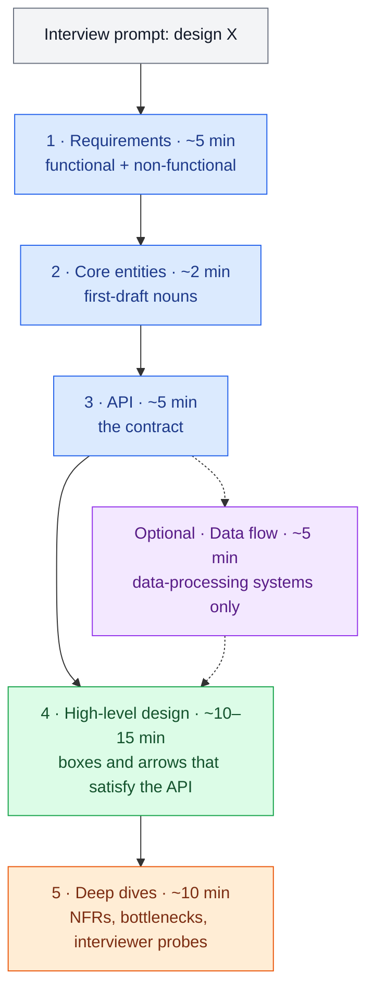

# The Interview at 10,000 Feet

> **Prerequisites:** [Thinking in Trade-offs](/synapse/system-design-from-first-principles/foundations/thinking-in-tradeoffs) | **You'll be able to:** name the five stages of a system-design interview and the minutes each deserves; explain what the interviewer is collecting evidence of at each stage; navigate breadth-first and choose where your depth goes.

## The problem (why this exists)

The most common reason candidates fail a system-design interview is not a knowledge gap. It is failing to deliver a working system inside the slot — a failure that lands on feedback forms as the opaque phrase "time management." Watching this happen across thousands of mock interviews makes the pattern blunt and clear: the problem usually isn't that you need to work twice as fast, it's that you spent your minutes on the wrong things.

That has an uncomfortable implication for this book. You can absorb every later lesson on replication, consensus, and caching and still walk out with a reject: the interview is not a quiz but a timed exercise in building something coherent while somebody grades how you build. Every lesson that follows ends with a "Pitfalls & interview traps" section, and those sections assume you already know the arena — the stages, the clock, and what the person across the table is writing down. This lesson is that map, kept deliberately short. The full treatment — level calibration, follow-up traps, a practice ladder — lives in the Interview Playbook module at the end of the book.

## Intuition first

Strip away the nerves and a design interview is a simulation: forty-five minutes of pretending to be a colleague sketching a system with you. The interviewer's real deliverable is not your diagram — it is a hire/no-hire recommendation they must defend with evidence. Your job is therefore not "know things." It is to generate evidence, on a clock, across the handful of competencies on their rubric.

Think of the whiteboard as a map you are drawing. A cartographer does not ink one mountain range in loving detail before the coastline exists; they sketch the whole territory first, then add detail where the terrain is interesting. The delivery framework below is that discipline applied to design: establish what you are building (requirements), name the things in it (entities), define its surface (API), draw the whole working system (high-level design) — and only then zoom into the two or three places where the hard problems live (deep dives).

The framework has a second, underrated benefit: it is a fallback path. Nearly everyone is nervous, and a linear structure — each stage's output feeding the next — means that when your mind blanks you always know the next move.

## How it works

The framework — the spine this book's interview guidance follows — is five stages plus one optional insert:



### 1. Requirements (~5 minutes)

Two lists, both short. **Functional requirements** are "users should be able to…" statements — the core features. Ask targeted questions as if talking to a product manager and converge on the **top three** — the rest of the interview exists to satisfy exactly the list you write here. **Non-functional requirements** are "the system should be…" statements — availability vs consistency, scale, latency — and they only count if they are quantified and specific to *this* system: "low latency search, under 500 ms" says something; "the system should be low latency" says nothing. Pick the 3–5 that will actually shape the design ([Nonfunctional Requirements](/synapse/system-design-from-first-principles/foundations/nonfunctional-requirements) makes these sharp). What the interviewer scores here is prioritization: top companies directly evaluate whether you can find what matters and ignore the rest.

Capacity estimation is deliberately absent: skip up-front math, announce that you will calculate when a number would change a decision, and move on.

### 2. Core entities (~2 minutes)

A first-draft list of nouns — for a Twitter-like system: `User`, `Tweet`, `Follow`. Not a schema; you don't yet know what you don't know, and fields are cheaper to add next to the database once the high-level design shows what each request reads and writes. Two minutes, and one subtle signal: some interviewers quietly watch whether you choose good names.

### 3. API (~5 minutes)

The contract between your system and its users, usually mapping one endpoint per functional requirement. Default to REST with plural resource nouns; reach for GraphQL or RPC only with a reason ([API Design](/synapse/system-design-from-first-principles/foundations/api-design) covers the decision). One security tell interviewers notice: identity comes from the auth token, never from a user-supplied ID in the request body.

*(Optional insert: for data-processing systems — a web crawler, an analytics pipeline — spend ~5 minutes listing the data flow, the sequence of transformations from input to output, before drawing boxes. Skip it for everything else.)*

### 4. High-level design (~10–15 minutes)

Boxes and arrows that satisfy the API, built up endpoint by endpoint, narrating how data flows and what state changes with each request. The goal is a *simple, complete, working* system that meets the functional requirements — nothing more. You will spot places begging for caches, queues, and shards as you draw; note them aloud, write a marker, and keep moving. The interviewer is scoring whether you can decompose the problem and compose the pieces coherently — "spaghetti design" is a named failure mode — not whether version one is clever.

### 5. Deep dives (~10 minutes)

Now harden the skeleton: satisfy the non-functional requirements, handle edge cases, hunt bottlenecks, and respond to the interviewer's probes. For a Twitter-like design this is where feed fan-out and caching strategy live — the interesting problems you walked past earlier. Who *initiates* the dives is the seniority signal: interviewers expect to prompt a mid-level candidate, and expect a senior one to identify and lead them unprompted.

### Where this book fits

The stages map cleanly onto the modules ahead. This Foundations module gives you the requirements vocabulary and numbers sense for stage 1. Data Foundations, Distributed Data, and Building Blocks are your depth — the material stages 4 and 5 draw on. Patterns are pre-packaged deep dives: reusable solution shapes for the problems stage 5 keeps surfacing. Case Studies are full reps, every stage end to end, thirteen times. The Interview Playbook module later expands this précis into the full treatment.

## Trade-offs

The scarce resource is minutes, and where you spend them is itself a design decision. The one navigation rule: **breadth first, then depth where the interesting problems are.** Everything else is a corollary.

| Option | Gives you | Costs you | Use when |
| --- | --- | --- | --- |
| Breadth first, targeted depth after (the framework) | A complete working system by ~minute 30, then depth evidence where it counts | Discipline — you must walk past fascinating problems and note them for later | Default, always |
| Depth first on the first hard problem | Early depth signal | The most common failure: the clock dies before a complete system exists | Only if the interviewer explicitly steers you there |
| Breadth only, thin everywhere | A complete but shallow tour | Deep dives are where senior signal lives; this caps your level | Salvage move when the clock has collapsed — finish working, then deepen as time allows |
| Up-front capacity math | Comfort of older guides' ritual | ~5 minutes to conclude "so… it's a lot," changing nothing | Only when the number would change the architecture |

How much depth is "enough" is calibrated by level — the 80/20 vs 60/40 split below.

## Numbers that matter

The budgets are the framework's, for a standard 45-minute slot; the discipline is keeping stages 1–3 lean so stages 4–5 get the majority of the clock.

| Quantity | Value |
| --- | --- |
| Requirements | ~5 min |
| Core entities | ~2 min |
| API | ~5 min |
| Data flow (optional, data-processing systems) | ~5 min |
| High-level design | ~10–15 min |
| Deep dives | ~10 min |
| Functional requirements to commit to | top 3 |
| Non-functional requirements | 3–5, quantified |
| Breadth : depth mix, mid-level | ≈ 80 : 20 |
| Breadth : depth mix, senior | ≈ 60 : 40 |

The stage budgets sum to roughly 32–37 minutes, not 45. Rule of thumb, not from source: a "45-minute" interview yields about 35–40 minutes of actual design time after introductions and closing questions — the framework's slack is not an accident. For the estimation technique and the latency/capacity figures worth memorizing, see [Estimation & the Numbers](/synapse/system-design-from-first-principles/foundations/estimation-and-numbers).

## In production

How do real interviewers calibrate? Every company writes its own rubric, but the cross-company pattern is that rubrics converge on four competencies: **problem navigation** (break the problem down, prioritize, don't get stuck — often the most heavily weighted), **high-level design** (solve the pieces, compose them), **technical excellence** (know and apply real technologies and patterns), and **communication & collaboration** (explain clearly, take feedback without defensiveness). The stages exist to generate evidence for these: requirements and entities feed navigation, the high-level design feeds design, deep dives feed technical excellence, and the whole conversation feeds communication. The top-level goal is disarmingly simple — give the interviewer enough confidence to advocate for hiring you.

Calibration varies along two axes. **Level:** design interviews are rare for entry-level roles, common at mid-level, and the norm at senior; everyone must deliver a complete working system, but a mid-level candidate might do it at roughly 80% breadth / 20% depth while a senior candidate runs closer to 60/40 — and seniors are expected to *lead* the deep dives rather than be prompted into them. **Interview type:** companies and even individual interviewers run the loop differently. Product design ("design Slack's backend") is the most common shape and what this framework targets; infrastructure design ("design a rate limiter") shifts emphasis deeper in the stack, toward system-level mastery like consensus and durability; object-oriented design (an Amazon staple) and frontend design are different games this book does not cover.

## Pitfalls & interview traps

<div style="border-left:4px solid #da5233;background:rgba(218,82,51,0.08);padding:0.6rem 1rem;border-radius:0 0.5rem 0.5rem 0;margin:1.25rem 0">

⚠️ **The classic failure: depth before a working skeleton.** Layering caches, queues, and shards onto a half-drawn design is the single most common way candidates run out of clock with no complete system to show — and no complete system usually means no offer. Note the interesting problem, finish the skeleton, then dive.

</div>

The other traps are cheaper but add up. A **requirements laundry list** — ten features instead of three — actively hurts: prioritization is being scored, and every extra requirement is a promise to keep. **Unquantified non-functional requirements** ("it should be low latency") are filler; put a number and a subsystem on them. **Capacity-math theater** — computing QPS and storage up front only to conclude "it's a lot" — burns five minutes producing zero signal. Writing a **full schema during core entities** front-loads guesswork; columns belong next to the database once the design shows what each request touches. In deep dives, **talking over the interviewer** is a double loss: they have specific signals to collect, and monologuing forfeits both their probes and the collaboration points. One logistical trap: not asking the recruiter which **whiteboarding tool** you'll use, then fumbling an unfamiliar canvas on the clock.

## Check yourself

```quiz
{"prompt": "Twenty minutes into a 45-minute interview, you have requirements, core entities, and an API sketched. What does the delivery framework say to do next?", "options": ["Deep dive into caching and sharding while momentum is high", "Draw the high-level design, satisfying your API endpoint by endpoint", "Do back-of-envelope capacity estimation for storage and QPS", "Write out the full database schema with every column"], "answer": "Draw the high-level design, satisfying your API endpoint by endpoint"}
```

```quiz
{"prompt": "Ten minutes in, while sketching a Twitter-like design, you spot the genuinely interesting problem: feed fan-out for users with millions of followers. What is the framework-correct move?", "options": ["Dive in now — depth signal is worth more than a finished skeleton", "Note it aloud and in writing, finish the working high-level design, then lead your deep dives with it", "Ignore it — deep dives are the interviewer's job to direct", "Restart requirements to add a fan-out requirement"], "answer": "Note it aloud and in writing, finish the working high-level design, then lead your deep dives with it"}
```

```quiz
{"prompt": "A mid-level and a senior candidate both deliver complete, working designs for the same question. What most separates the senior performance?", "options": ["Naming more technologies in the high-level design", "Finishing the requirements stage faster", "A deeper breadth-to-depth mix (roughly 60/40 vs 80/20) and proactively leading the deep dives", "Listing more core entities up front"], "answer": "A deeper breadth-to-depth mix (roughly 60/40 vs 80/20) and proactively leading the deep dives"}
```

<details>
<summary>When is up-front capacity estimation actually worth five of your minutes?</summary>

When the number would change the design — only then. The framework's example: for a top-K trending-topics system, the estimated number of topics decides whether a min-heap fits on one instance or must be sharded across many. That estimate reshapes the architecture and earns its minutes; "100M DAU, so lots of QPS" changes nothing. Say at the requirements stage that you'll do math at the decision points that need it — interviewers read that as maturity, not evasion.

</details>

<details>
<summary>Mid-way through your high-level design, the interviewer interrupts: "How would this hold up at 100M DAU?" What now?</summary>

Answer briefly, directly, without defensiveness — probes are how interviewers collect signal, and responsiveness to feedback is scored under communication and collaboration. Point at where the skeleton breaks (say, the single database), name the fix category (sharding, caching, replicas), then offer: "Can I finish the working design and make scaling the first deep dive?" If they'd rather go deep now, follow them — an interviewer's redirect outranks the framework every time.

</details>

## PoC — Proof of concepts

Open-source collections that mirror this lesson's map of the whole field — good for a second pass
over any topic here:

- [System Design Primer](https://github.com/donnemartin/system-design-primer) — the most-referenced
  single index of the topics, with diagrams and worked examples.
- [karanpratapsingh/system-design](https://github.com/karanpratapsingh/system-design) — a linear,
  readable course covering the same ground end to end, if you prefer prose to a wiki.
- [awesome-scalability](https://github.com/binhnguyennus/awesome-scalability) — the real-world
  engineering write-ups and post-mortems behind each concept, from companies that hit the limits.

## Sources

Original synthesis on interview delivery; this book's own framing.
