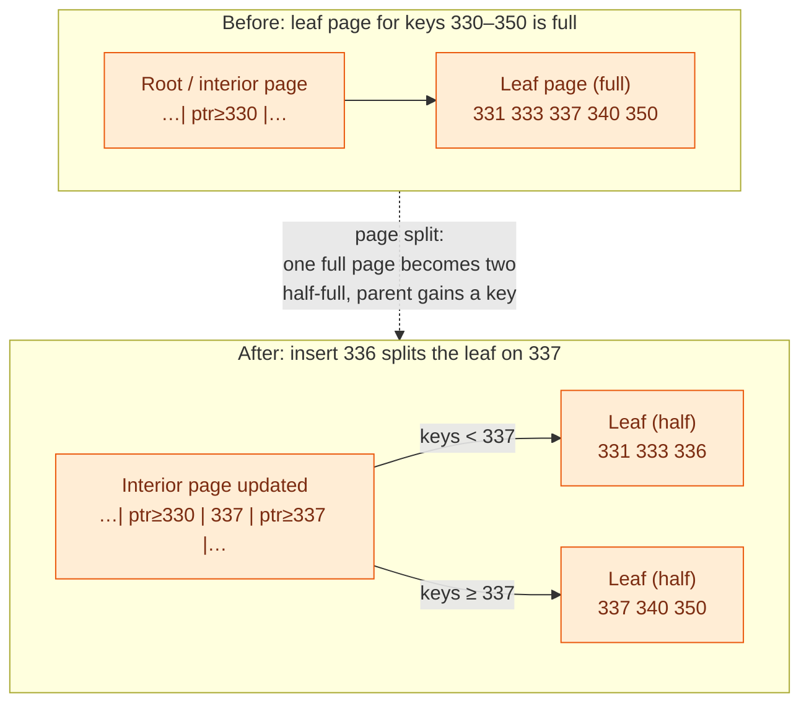

# Storage Engines

> **Prerequisites:** [Data Models](/synapse/system-design-from-first-principles/data-foundations/data-models) | **You'll be able to:** explain from first principles how log-structured (LSM) and page-oriented (B-tree) engines physically store and retrieve a record; trace the write and read paths through memtables, SSTables, compaction, and Bloom filters versus pages, splits, and a WAL; and reason about write, read, and space amplification well enough to pick the right engine for a given workload and defend it.

## The problem (why this exists)

Here is a database you can build in two lines of shell. To store a key, append `key,value` to a text file. To read a key, `grep` the file and take the *last* line that matches, because the newest write wins (p. 115). It works. It is genuinely durable — the data is on disk — and writes are as fast as your disk can append.

Then you put a million keys in it, and a read has to scan the entire file: cost `O(n)`, doubling every time the data doubles (p. 116). So you add an index — some extra structure derived from the data that lets you find a record without scanning everything. But the moment you do, you've made a trade that never goes away: **a well-chosen index speeds up reads, but every index consumes disk space and slows down writes**, because each write now has to update the index too (p. 117). There is no "just index everything" escape hatch; that is why databases make *you* declare indexes from knowledge of your query patterns.

That single tension — reads want structure, writes want to be left alone — splits the entire world of storage engines into two families. One family says: *never modify data in place; only ever append, and clean up later.* That is the **log-structured** approach, and it powers Cassandra, RocksDB, ScyllaDB, and HBase. The other says: *keep data in a fixed, navigable structure on disk and overwrite it carefully in place.* That is the **page-oriented** approach — the **B-tree** — and it is the standard index in almost every relational database, PostgreSQL and MySQL's InnoDB included (pp. 121, 125–126). This lesson is the fork in the road every database conversation eventually reaches. Get these two mechanisms into your bones and the rest of the database world — replication, transactions, tuning — has something solid to stand on.

## Intuition first

Picture two ways of keeping a growing address book.

**The B-tree way is the paper address book.** It has a fixed structure: tabbed sections A–Z, each a page. To find "Nguyen" you flip to the N tab — no scanning from the front. To *add* someone, you find their page and write them in place. This is fast to look things up in, because the structure is navigable. But adding is fiddly: when a page fills up, you have to physically split it into two and update the tab index. You are always modifying the book *in place*, and if someone knocks the book out of your hands mid-edit — a crash — you can be left with a half-written page and a corrupted index.

**The LSM way is a running notebook plus a nightly re-copy.** You never hunt for the right page. Every change — add, update, delete — you just scribble on the next blank line: "Nguyen, new number," "Delete Smith." Writing is trivially fast because you never seek; you only ever append. The cost is deferred to reads and to housekeeping. To look someone up you have to check your most recent notes first, then older notebooks, because a newer note overrides an older one. And periodically — say, each night — you recopy everything into a fresh, tidy, alphabetized notebook, keeping only the latest version of each contact and physically dropping the ones marked "delete." That nightly recopy is **compaction**, and it is the price the log-structured family pays to keep reads from degrading forever.

Notice the symmetry. The B-tree front-loads work onto writes (keep the structure sorted *now*) to make reads cheap and predictable. The LSM back-loads it: make writes trivial *now*, and pay later in reads and background compaction. Neither is free; they just put the bill in different places. The rest of this lesson is about reading that bill precisely.

## How it works

### Family 1 — Log-structured storage (LSM-trees)

Start from the two-line shell database and fix its three real problems: it never reclaims space from overwritten keys, its lookup is `O(n)`, and it can't survive a crash cleanly. The log-structured merge-tree (**LSM-tree**, published under that name in 1996) fixes all three (p. 121). Here is the machinery.

**The SSTable.** Instead of one ever-growing log in arbitrary order, we write **SSTables** — Sorted String Tables: immutable files of key-value pairs *sorted by key*, with each key appearing at most once (p. 119). Sorting buys two things. First, merging two SSTables is a cheap merge-sort walk. Second, you no longer need an in-memory index entry for *every* key — you can keep a **sparse index** holding only the first key of every few-kilobyte block. To find a key like `handiwork`, you binary-search the sparse index to the preceding indexed key (`handbag`), seek there, and scan the one small block up to the next indexed key (`handsome`) (p. 119). A few-KB block scans in microseconds. Each block can also be compressed before writing, saving disk space and I/O bandwidth for a little CPU (p. 119).

**The memtable and the write path.** But writes arrive in random key order, and SSTables must be sorted — so we buffer. Incoming writes go into an in-memory ordered structure (a red-black tree, skip list, or trie) called the **memtable**, which keeps them sorted as they arrive. When the memtable grows past a threshold — typically a few megabytes — it is flushed to disk in one sequential pass as a new immutable SSTable, while a fresh memtable takes over new writes (p. 120). The memtable lives in RAM, so a crash would lose it; to prevent that, every write is *first* appended to a separate on-disk log — a write-ahead log — which need not be sorted and is simply discarded once its memtable has been flushed (p. 120).

Here is that write path, built up in three steps — memory, then flush, then the background merge that keeps it all from bloating:

```d2
classes: {
  client: {style: {fill: "#f3f4f6"; stroke: "#6b7280"}}
  edge:   {style: {fill: "#dbeafe"; stroke: "#2563eb"}}
  svc:    {style: {fill: "#dcfce7"; stroke: "#16a34a"}}
  data:   {style: {fill: "#ffedd5"; stroke: "#ea580c"}}
  async:  {style: {fill: "#f3e8ff"; stroke: "#9333ea"}}
}

title: |md
  # Step 1 — the write lands in memory (durably)
| {near: top-center}

writer: "Client write\nSET dog=3" {class: client}

wal: "① Write-ahead log (on disk)\nappend-only, unsorted\ndog=3" {class: async}

memtable: "② Memtable (in RAM)\nsorted by key\ncat=1  dog=3  emu=7" {class: svc}

disk: "SSTables on disk\n(none yet)" {class: data}

writer -> wal: "append first\n(survives a crash)"
writer -> memtable: "then insert\n(kept sorted)"
memtable -> disk: "not yet —\nstill filling" {style.stroke-dash: 4}
```

```d2
classes: {
  client: {style: {fill: "#f3f4f6"; stroke: "#6b7280"}}
  edge:   {style: {fill: "#dbeafe"; stroke: "#2563eb"}}
  svc:    {style: {fill: "#dcfce7"; stroke: "#16a34a"}}
  data:   {style: {fill: "#ffedd5"; stroke: "#ea580c"}}
  async:  {style: {fill: "#f3e8ff"; stroke: "#9333ea"}}
}

title: |md
  # Step 2 — the memtable fills, then flushes to an SSTable
| {near: top-center}

writer: "Client write\nSET fox=9" {class: client}

wal: "① Write-ahead log\ndog=3 ... fox=9\n(WAL segment discarded\nafter flush)" {class: async}

memtable: "② Memtable full (~few MB)\nfrozen, a fresh one\ntakes new writes" {class: svc}

sst1: "③ SSTable-1 (immutable)\nsorted, one entry per key\ncat=1  dog=3  emu=7  fox=9\n+ sparse index + Bloom filter" {class: data}

disk: "Older SSTables\n(previous flushes)" {class: data}

writer -> wal: "append"
writer -> memtable: "insert"
memtable -> sst1: "③ flush:\nwrite sorted, once,\nsequentially"
sst1 -> disk: "joins the newest\non-disk level (L0)"
```

```d2
classes: {
  client: {style: {fill: "#f3f4f6"; stroke: "#6b7280"}}
  edge:   {style: {fill: "#dbeafe"; stroke: "#2563eb"}}
  svc:    {style: {fill: "#dcfce7"; stroke: "#16a34a"}}
  data:   {style: {fill: "#ffedd5"; stroke: "#ea580c"}}
  async:  {style: {fill: "#f3e8ff"; stroke: "#9333ea"}}
}

title: |md
  # Step 3 — compaction merges levels and reclaims space
| {near: top-center}

l0: "L0 — recent flushes\nSSTable-A: dog=3  emu=7\nSSTable-B: dog=8  emu=DEL" {class: data}

compactor: "Compaction\n(background merge-sort)\nkeep newest value per key\ndrop overwrites + tombstones" {class: svc}

l1: "L1 — merged, larger, sorted\ncat=1  dog=8  fox=9\n(emu deleted; dog=3 gone)" {class: data}

l0 -> compactor: "read overlapping\nSSTables in parallel"
compactor -> l1: "write one\nnew immutable file"
l0 -> l0: "old inputs deleted\nafter merge completes" {style.stroke-dash: 4}
```

**Deletion by tombstone.** You can't delete a record from an immutable file. So a delete is itself a write: a special marker called a **tombstone** appended to the log (p. 121). During compaction the merge sees the tombstone, discards every older value for that key, and once the tombstone has propagated all the way to the oldest segment it can finally be dropped (p. 121). This is why "delete" in an LSM engine is really "write a note that says deleted, and forget the data later" — a fact with sharp consequences we'll return to.

**Compaction, and the read path.** Left alone, flushes would pile up thousands of SSTables and every read would consult all of them. **Compaction** is the background process that merge-sorts segments together (Fig. 4-3), keeping only the most recent value per key and discarding overwritten and deleted values (p. 120) — the nightly recopy from our intuition. A **read** then checks the memtable first, then the newest on-disk segment, then progressively older ones, until the key is found or all segments are exhausted (p. 120). That "or all segments are exhausted" is the expensive case: a key that *doesn't exist* forces a check of every segment.

**The Bloom filter.** That expensive case is fixed with a **Bloom filter** — a small, probabilistic membership test kept per segment (p. 122). It hashes each stored key to several bit positions in a bit array and sets those bits. To test a key, you hash it the same way and look: if *any* of those bits is 0 the key is *definitely absent* (skip that SSTable entirely); if all are 1 the key is *probably present*, with a tunable false-positive rate but never a false negative (pp. 122–123). This is what lets an LSM engine answer "no such key" fast, and it is why Cassandra leverages a Bloom filter to determine which SSTables on disk might have the data before touching disk at all.

**Compaction strategies.** How you schedule those merges is a real tuning knob with two main families (p. 124):

- **Size-tiered:** merge newer, smaller SSTables into older, larger ones as they accumulate. Simple, and it absorbs high write throughput well — but several overlapping tiers can hold copies of the same key, costing read and space overhead.
- **Leveled:** organize fixed-size SSTables into levels L0, L1, L2… where each level (beyond L0) is key-range-partitioned and non-overlapping and holds roughly an order of magnitude more data than the one above. Compaction is more incremental, uses less disk headroom, and gives better read performance — at the cost of more compaction work.

RocksDB and modern Cassandra let you choose per table; the choice is a direct write-vs-read-vs-space lever, which is exactly the amplification story in *Trade-offs*.

<div style="border-left:4px solid #195045;background:rgba(25,80,69,0.08);padding:0.6rem 1rem;border-radius:0 0.5rem 0.5rem 0;margin:1.25rem 0">

💡 **The one idea to keep.** Everything in the LSM family is downstream of a single decision: *never modify a file in place — only append immutable segments and merge them later.* Immutability is what makes writes sequential, crash recovery trivial (delete the half-written SSTable and restart), and point-in-time snapshots nearly free (just remember which segment files existed) (pp. 121–122, 132).

</div>

### Family 2 — Page-oriented storage (B-trees)

The B-tree, introduced in 1970 and called "ubiquitous" within a decade, takes the opposite stance (pp. 125–126). Like SSTables it keeps keys sorted — so it supports both point lookups and range queries — but it never appends-and-merges. Instead it breaks the database into fixed-size **pages** (traditionally 4 KiB; PostgreSQL uses 8 KiB, MySQL 16 KiB) and may **overwrite a page in place** (p. 125).

**The structure and the lookup.** Pages reference each other by page number, which acts as a disk pointer: page number × page size gives the byte offset. This builds a tree of pages (p. 126). Every lookup starts at the single **root page**, whose entries carry key ranges and child pointers. You pick the child whose range contains your key, follow it down, and repeat until you reach a **leaf page**, which holds the value inline or a reference to where the value is stored (p. 126). The number of child references packed into one page — the **branching factor** — is typically several hundred (p. 126). A high branching factor means a shallow tree: because depth is `O(log n)`, most databases fit in a three- or four-level tree, and a four-level tree of 4 KiB pages with branching factor 500 can address up to **250 TB** (p. 127). A lookup therefore touches only about one page per level — a handful of page reads for a quarter-petabyte of data.

**Insertion and the page split.** To add a key, you walk to the leaf page where it belongs and write it in. If the page still has room, done. If it's full, the page must **split** into two half-full pages, and the parent page is updated to reference both (Fig. 4-6, pp. 126–127). A split can cascade upward: if the parent is also full it splits too, and if the split reaches the root, a new root is created above it — which is how the tree grows a level and stays balanced. (Deletion, which may *merge* under-full pages, is the more complex mirror image.)



**Why in-place is dangerous, and the WAL.** Here is the catch that shapes everything about B-tree reliability. A split is a *multi-page* overwrite: you rewrite the full page, its new sibling, and the parent. If the machine crashes partway through, you can end up with orphaned pages and a corrupted tree — and hardware that can't write a full page atomically can leave a **torn page**, half old and half new (p. 128). Because the whole scheme assumes each page's location stays fixed and valid, a partial write is catastrophic in a way it never is for append-only logs.

The standard defense is a **write-ahead log (WAL)** — also called a redo log: an append-only file to which *every* modification is written *before* it is applied to the tree pages (p. 128). After a crash, the engine replays the WAL to restore the tree to a consistent state; the filesystem equivalent is journaling. For performance the engine buffers modified pages in memory and writes them back lazily, so durability holds precisely as long as the change is safely in the WAL and flushed to disk with `fsync` (p. 128). This is exactly PostgreSQL's write path: a change is first written to the Write-Ahead Log (WAL) on disk, and once it's written there the transaction is considered durable, while the modified pages sit in the shared buffer cache as "dirty" and a background writer flushes them to the data files later.

Two consequences worth noting. First, the B-tree writes every piece of data **at least twice** — once to the WAL, once to the tree page — and often writes a whole page even for a few changed bytes (pp. 130–131). Second, not every B-tree engine uses a WAL: LMDB instead uses *copy-on-write*, writing a modified page to a new location and pointing a fresh parent version at it, which doubles as a clean mechanism for concurrency and snapshots (p. 128).

## Trade-offs

The rule of thumb, straight from DDIA: **"LSM-trees are better suited for write-heavy applications, whereas B-trees are faster for reads"** (p. 129). But a senior answer explains *why*, and the "why" is three distinct kinds of **amplification** — the ways one logical operation multiplies into more physical work.

| Dimension | LSM-tree (log-structured) | B-tree (page-oriented) |
| --- | --- | --- |
| On-disk mutation | Append immutable segments; never modify in place | Overwrite fixed-size pages in place |
| Write pattern to disk | **Sequential** (whole segment files at once) | **Random** (scattered individual pages) |
| **Write amplification** | Lower: no full-page writes, and SSTables compress; but re-written repeatedly across compaction levels | Higher: WAL + page, and a whole page rewritten for a few bytes (≥2× minimum) |
| **Read amplification** | Higher: may consult memtable + several SSTables; Bloom filters cut disk I/O for point reads | Lower: ~one page per level, fast and predictable |
| **Space amplification** | Lower: compaction rewrites files, compression shrinks them; but multiple copies exist until compacted | Higher: pages fragment over time (stranded free space needs a vacuum) |
| Range queries | Must scan/merge all segments; Bloom filters *don't help* | Fast: walk the sorted tree; leaves often linked |
| Crash recovery | Delete the unfinished SSTable and restart | Replay the WAL to restore consistency |
| Snapshots | Cheap (immutable segments never change) | Harder (in-place overwrite) |
| Latency profile | Risk of spikes if compaction falls behind writes → backpressure | More uniform and predictable |
| Best fit | Write-heavy: ingestion, time-series, event logs | Read-heavy, range-heavy, strong-consistency OLTP |

**Write amplification** is defined precisely as *bytes actually written to disk ÷ bytes a plain append-only log would have written* (p. 131). The LSM engine writes a value to the WAL, again when the memtable flushes, and yet again on every compaction that touches it — so it is written many times over its life. The B-tree writes each item at least twice (WAL + page) and may write a full 4–16 KiB page to change a few bytes. For typical workloads LSM-trees have *lower* write amplification overall, because they avoid full-page writes and compress their SSTables — and lower write amplification means more useful writes per second within a fixed disk bandwidth (p. 131).

**Sequential versus random writes** is why this matters on real hardware. B-trees scatter small random page writes across the disk; LSM engines write whole segment files (far larger than a page) sequentially (pp. 129–130). Disks strongly favor sequential throughput — dramatically so for HDDs, but for SSDs too: flash reads and writes a ~4 KiB page but *erases* a ~512 KiB block, so random writes force more garbage collection inside the drive and wear it out faster than sequential writes (p. 130). On the same hardware, the LSM engine can generally sustain a higher write throughput.

**Read amplification** cuts the other way. A B-tree lookup reads about one page per level — a shallow, predictable handful of I/Os. An LSM point lookup may have to probe the memtable and several SSTables; Bloom filters rescue point reads by skipping segments that can't contain the key, but **range queries get no help from Bloom filters** and must scan and merge every segment in parallel, which makes ranges materially more expensive than point queries in an LSM engine (p. 129).

**Space amplification** favors LSM on average but with a twist. B-trees fragment as pages are freed mid-file, stranding space and needing a background vacuum (PostgreSQL's `VACUUM` is exactly this) (p. 131). LSM engines fragment less because compaction continuously rewrites files, and compression shrinks them — but *transiently* the same key can exist in several uncompacted segments, so space usage is lower on average yet spikier.

The honest summary is the one the digest lands on: the rule of thumb is real, but benchmarks are workload-sensitive, and the choice is not strictly either/or — engines increasingly blend both ideas (pp. 128–129).

## Numbers that matter

Every figure here is page-cited to DDIA ch. 4; treat them as orders of magnitude, not guarantees.

| Quantity | Value | Why it matters | Source |
| --- | --- | --- | --- |
| Naive log lookup | `O(n)` | Full scan per read → forces an index | p. 116 |
| Memtable flush threshold | ~a few MB | When the in-memory buffer becomes an SSTable | p. 120 |
| SSTable block size | ~a few KiB | Granularity of the sparse index and compression | p. 119 |
| Bloom filter space | ~10 bits/key → ~1% false positives; +5 bits/key → ~10× fewer | Tunes the "is this key here?" test | p. 123 |
| B-tree page size | 4 KiB traditional; PostgreSQL 8 KiB; MySQL 16 KiB | The unit of in-place overwrite | p. 125 |
| B-tree branching factor | typically several hundred | High fan-out → shallow tree | p. 126 |
| B-tree depth | `O(log n)`; usually 3–4 levels | ~one page read per level on lookup | p. 127 |
| B-tree capacity | up to 250 TB | 4 levels, 4 KiB pages, branching factor 500 | p. 127 |
| B-tree minimum writes | ≥ 2× per item | WAL + tree page (write amplification floor) | pp. 130–131 |
| SSD page vs. erase block | ~4 KiB read/write page; ~512 KiB erase block | Why sequential writes beat random on flash | p. 130 |

For the engine-level throughput you'd actually quote in an interview, a good anchor for a *B-tree* OLTP engine on decent hardware is roughly ~5,000 simple inserts/sec/core, ~1,000–2,000 updates-with-index/sec/core, bounded chiefly by WAL disk I/O and by how many indexes each write must update. The write-optimized LSM engine (Cassandra) is chosen precisely when those per-node write ceilings become the bottleneck. Cross-check the shared figures against the reference module's [Estimation and Numbers](/synapse/system-design-from-first-principles/foundations/estimation-and-numbers).

## In production

**RocksDB and LevelDB** are the canonical embeddable LSM engines — libraries you link into your process rather than a server you talk to over a socket (p. 125). RocksDB is the storage engine under a remarkable amount of infrastructure (it backs Kafka Streams state stores, CockroachDB, and countless others), and it is where you'll actually meet the tuning knobs from this lesson: choosing size-tiered vs. leveled compaction, sizing memtables and Bloom filters, and applying **backpressure** — RocksDB deliberately throttles writes when the memtable fills faster than compaction can drain it, trading a latency spike now for not falling permanently behind (p. 129).

**Cassandra (and ScyllaDB)** put the LSM model at cluster scale. Cassandra's storage engine is a textbook LSM: a **commit log** (its write-ahead log for durability), a **memtable** sorted by primary key, and immutable **SSTables** on disk; writes hit the commit log then the memtable, the memtable flushes to an SSTable on a size or time threshold, and the corresponding commit-log entries are then discarded. Reads check the memtable, use a Bloom filter to narrow which SSTables to touch, and read newest-to-oldest; compaction consolidates SSTables and drops tombstoned rows. This is why Cassandra is the reflexive pick for **write-heavy, high-ingest** workloads — message stores, time-series, activity feeds — where its per-node write throughput and horizontal scalability shine, and why it explicitly gives up JOINs and ad-hoc queries to get there. **HBase** and Google's **Bigtable** (which coined "SSTable" and "memtable") are the same lineage (p. 121).

**PostgreSQL and MySQL/InnoDB** are the B-tree standard-bearers. Every default primary-key index in either is a B-tree, made crash-safe by the WAL exactly as described above (p. 125). This buys the read predictability and strong range-query performance that make PostgreSQL the sensible default for relational, consistency-sensitive OLTP — and it's why the operational conversation around Postgres is dominated by WAL disk I/O, buffer-cache hit rate, and `VACUUM` reclaiming space from the fragmentation that in-place updates inevitably create.

**Object storage as the disk.** A newer production pattern drops the assumption that SSTables live on local disk. Because SSTables are immutable, they sit naturally in object storage (S3), which decouples storage from compute and scales them independently; SlateDB and Delta Lake take this approach (p. 122). The same immutability that makes crash recovery trivial makes cloud-native, disaggregated storage practical — the log-structured idea aging remarkably well into the object-storage era.

### Hands-on: build the LSM

A runnable **toy LSM engine** lives at `proof-of-concepts/02-data-foundations/02-storage-engines/` in the repo root — pure Python, no external services, ~200 lines: a `Memtable`, immutable `SSTable`s (each with a Bloom filter and sparse index), a `Compactor`, and the `LsmEngine` tying them together.

```bash
cd proof-of-concepts/02-data-foundations/02-storage-engines
./run            # the demonstration
./run test       # mypy --strict + unit tests + demo
```

The demo makes every idea in this lesson concrete: writes buffer in the memtable and flush to `segment-*.dat` files at a threshold; a repeatedly-overwritten key physically exists in *five* segments (write amplification) while a read returns the newest; a `get` for an absent key is answered by each segment's Bloom filter *without a scan*; a delete writes a tombstone; and compaction merges eight segments into one — reclaiming the space overwrites and deletes had cost. Watch the segment files appear and then collapse.

## Pitfalls & interview traps

<div style="border-left:4px solid #da5233;background:rgba(218,82,51,0.08);padding:0.6rem 1rem;border-radius:0 0.5rem 0.5rem 0;margin:1.25rem 0">

⚠️ **"LSM is always faster for writes, so it's always the better choice."** This is the single most common oversimplification, and it's wrong on both halves. *Write throughput* on the same hardware usually does favor LSM (sequential writes, lower write amplification) — but *write latency* can be **worse and spikier**: when writes outrun compaction, the memtable backs up and the engine applies backpressure, stalling reads and writes until it catches up (p. 129). And "faster for writes" says nothing about the read side, where B-trees are more predictable and range queries are cheaper because Bloom filters don't help ranges (p. 129). The correct interview answer names the workload — read/write ratio, point vs. range, latency-sensitivity — *then* picks. "Write-heavy" earns LSM; "read-heavy with range scans and strong consistency" earns a B-tree.

</div>

Three more traps interviewers probe:

- **"Deletes free space immediately."** In an LSM engine a delete is a *tombstone* — a write, not an erasure. The old data physically persists, potentially across higher compaction levels, until the tombstone propagates through every level (pp. 121, 132). This is a genuine problem for data-protection compliance (a "deleted" record can linger), and it's why an LSM store under a delete-heavy or high-churn workload can *grow* even as you delete — the classic "why is disk usage climbing when we're deleting rows?" incident.
- **Confusing the WAL with the LSM log.** Both are append-only logs, and both provide durability, but they serve different roles. The B-tree's WAL is a *recovery* log — replayed after a crash to fix the in-place tree, then truncated. The LSM's segments *are the database itself*, merged forever by compaction. Cassandra's commit log is a WAL in the B-tree sense (durability for the memtable); its SSTables are the LSM store.
- **Assuming a B-tree writes only what you changed.** It writes at least twice (WAL + page), and often a full page for a few bytes — the amplification that makes very high write rates expensive on a B-tree and pushes you toward an LSM engine or sharding (pp. 130–131).

## Check yourself

```quiz
{"prompt": "You point-read a key that does NOT exist in a RocksDB (LSM) store with many SSTables and a Bloom filter per segment. What most likely happens on disk?", "options": ["Every SSTable is read from disk in full before concluding the key is absent", "The Bloom filters let the engine skip nearly all SSTables, so little or no disk I/O occurs", "The B-tree root page is consulted to rule out the key", "Compaction is triggered synchronously to resolve the missing key"], "answer": "The Bloom filters let the engine skip nearly all SSTables, so little or no disk I/O occurs"}
```

```quiz
{"prompt": "A workload issues a huge, sustained burst of writes to an LSM engine — far faster than compaction can merge segments. Predict the behavior.", "options": ["Write latency stays flat; LSM writes are always O(1)", "The memtable fills faster than it can drain, so the engine applies backpressure and read/write latency spikes", "The Bloom filter false-positive rate drops to zero", "The B-tree splits cascade to the root"], "answer": "The memtable fills faster than it can drain, so the engine applies backpressure and read/write latency spikes"}
```

```quiz
{"prompt": "You change a single 20-byte field in one row, repeatedly, in a B-tree engine using 8 KiB pages and a WAL. Roughly how does the physical write cost compare to the 20 bytes of logical change, and why?", "options": ["About 20 bytes, because B-trees write only the changed bytes", "Far more than 20 bytes: the change is written to the WAL AND a whole ~8 KiB page is rewritten — write amplification", "Less than 20 bytes, because the WAL compresses every write", "Exactly 40 bytes: 20 to the WAL and 20 to the page"], "answer": "Far more than 20 bytes: the change is written to the WAL AND a whole ~8 KiB page is rewritten — write amplification"}
```

```quiz
{"prompt": "Which single property of SSTables most directly explains why LSM crash recovery is simple, snapshots are cheap, AND writes are sequential?", "options": ["Their sparse index", "Their per-segment Bloom filter", "Their immutability — segments are never modified in place", "Their sort order by key"], "answer": "Their immutability — segments are never modified in place"}
```

<details>
<summary>Your team ingests 200k sensor readings/second, mostly recent-time-window reads, occasional deletes for GDPR. LSM or B-tree, and what's the one operational risk you'd call out?</summary>

**LSM (e.g. Cassandra/RocksDB).** The workload is write-heavy with sequential-ish keys and rare range reads over recent data — exactly LSM's sweet spot (sequential writes, low write amplification, high per-node throughput). The operational risk to name: **tombstones from the GDPR deletes**. Deleted readings persist until compaction propagates the tombstone through every level, so disk usage can climb despite deletes, and tombstone-heavy partitions can slow reads. Mitigations: tune compaction (and TTLs) so tombstones are reclaimed promptly, and avoid delete-then-reinsert churn on the same keys (pp. 121, 129, 132).

</details>

<details>
<summary>Both an LSM engine and a B-tree engine use an append-only "log." Are they the same thing? Explain the difference in one or two sentences.</summary>

No. The B-tree's **write-ahead log** is a *recovery* mechanism: every change is appended there before the in-place page write, and it's replayed after a crash then truncated — the log is not the data. The LSM's **segments (SSTables)** *are* the database: durable, immutable, and merged forever by compaction. Cassandra makes this concrete — its commit log is a WAL (durability for the memtable), while its SSTables are the actual store (pp. 120, 128).

</details>

## PoC — Proof of concepts

**Run it yourself.** [Toy LSM engine](https://github.com/ani2fun/synapse-content/tree/main/proof-of-concepts/02-data-foundations/02-storage-engines)
— a from-scratch log-structured merge tree in pure Python: watch the write path, an overwrite, a
Bloom-filter skip, a delete tombstone, compaction and a scan happen step by step. From
`proof-of-concepts/02-data-foundations/02-storage-engines/`, run `./run`.

**Study real implementations.**

- [LevelDB](https://github.com/google/leveldb) — Google's compact, readable LSM key-value store; the
  canonical codebase to read *after* the toy, small enough to follow end to end.
- [RocksDB](https://github.com/facebook/rocksdb) — the same design taken to production scale
  (leveled compaction, column families, tuning knobs); what the toy grows up into.
- [The Architecture of SQLite](https://www.sqlite.org/arch.html) — the other family: a B-tree engine
  laid out file by file, so you can compare update-in-place against the log-structured approach.

## Sources

DDIA2 ch. 4 pp. 115–132 (log-structured storage, SSTables, memtables, compaction, Bloom filters, B-trees, WAL, and the LSM-vs-B-tree comparison; specific figures cited inline). All numeric figures are DDIA ch. 4 page-cited in *Numbers that matter*; engine throughput figures are rule-of-thumb estimates flagged as such.
