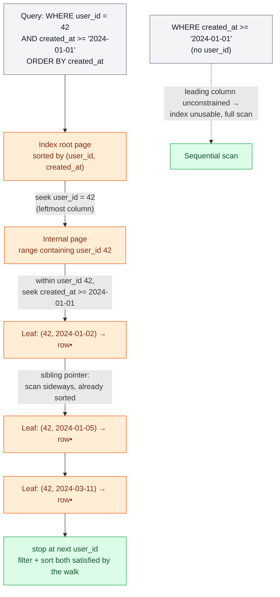

# Indexing

> **Prerequisites:** [Storage Engines](/synapse/system-design-from-first-principles/data-foundations/storage-engines) | **You'll be able to:** decide which columns deserve an index and justify the write cost; read a composite index and predict which queries it can serve via the leftmost-prefix rule; explain to an interviewer what "we'll index `user_id, created_at`" actually buys and costs.

## The problem (why this exists)

You have a `users` table with fifty million rows, and your login endpoint runs `SELECT * FROM users WHERE email = ?`. The email column is not the primary key. So the database does the only thing it can: it reads the table from the front and checks every row until it finds a match, or reaches the end. That is a **full table scan** — O(n) in the number of rows. On a cold cache it might touch every page on disk. At fifty million rows, one login takes seconds. Ten thousand concurrent logins take the database down.

The naive fix — "make it faster" — has no purchase, because the slowness is structural. The rows sit on disk in insertion (or primary-key) order, a layout optimized for one access pattern: *find a row by primary key, or scan them all.* Any query filtering on a different column fights that layout. The table is a phone book sorted by account number, and you have been handed a name.

You can't sort the table differently to fix it — you get one primary order, and other queries want other orders. So you keep a **second, redundant copy** of just enough data, arranged in exactly the shape this query needs: emails, sorted, each paired with a pointer back to its row. That copy is an **index**. DDIA states the mechanism precisely: *an index is an additional structure derived from the primary data; adding or removing one changes query performance but never the database's contents* [p. 116]. You trade disk space and write speed for read speed — deliberately, and only where a real query pattern justifies it.

<div style="border-left:4px solid #15448e;background:rgba(21,68,142,0.08);padding:0.6rem 1rem;border-radius:0 0.5rem 0.5rem 0;margin:1.25rem 0">

ℹ️ **Definition.** An *index* is a data structure, separate from the table, that maps the value of one or more columns to the location(s) of the matching rows. It is redundant by design: everything in it is derived from the table, so you could drop it and rebuild it. Its only job is to let a query skip rows it would otherwise have to read.

</div>

## Intuition first

Think about the back of a textbook. The book itself is ordered by chapter — that is the "table," sorted the way the author wanted to present it. But you want every page that mentions "deadlock." Reading all six hundred pages to find them is the full scan. So the publisher builds a second, redundant structure: the index at the back, where terms are listed *alphabetically* — a different order from the book — and each term points to the page numbers where it appears. You find "deadlock" in seconds because that structure is sorted for the question you are asking, and each entry hands you a pointer (the page number) instead of the content itself.

Three properties of that back-of-book index are the whole lesson in miniature:

- **It is query-shaped.** It is sorted by *term*, not by page, because the question is "where is this term?" An index sorted by page number would be useless for that. The ordering *is* the power; the index only helps queries that ask in that order.
- **It is redundant, and it costs.** The index adds pages — a heavier volume. In a database, an index is extra bytes on disk, sometimes nearly as large as the data it points into.
- **It taxes writes.** Add a paragraph mentioning "deadlock" on a new page and the index entry must be updated too, or it lies. In a database, *every* write — insert, update, delete — must also update *every* index covering an affected column. This is the tax, and the single most underappreciated fact about indexes.

So the mental model is: **an index is a query-shaped, redundant, always-in-sync copy of a slice of your data.** You are not speeding up the table; you are building a purpose-built side structure and paying to keep it truthful on every write. The question is never "should I index?" in the abstract — it is "does a real, frequent query justify the write tax and the space, on *this* column, in *this* order?"

## How it works

An index must answer two kinds of question fast: *"the row where column = X"* (equality) and *"all rows where column is between X and Y"* (range). The data structure you pick decides which it can do. Two families dominate.

### Hash indexes: equality only, no order

The simplest possible index is a hash map from the indexed value to the row's location. Look up `email = 'a@b.com'`: hash the string, jump to the bucket, follow the pointer. This is the persistent-disk cousin of the in-memory hash index DDIA describes for log-structured storage — a map from key to the byte offset of the value, where a read needs no disk I/O at all if the data is already in the filesystem cache [p. 117]. Average lookup is O(1). It is the fastest thing there is for *exact-match* queries.

But a hash deliberately scatters similar keys into unrelated buckets — that is what makes it uniform. So `email = 'a@b.com'` is instant, and `email > 'a@b.com'` or `ORDER BY email` is impossible: the index has no notion of "next." Ranges, sorting, prefix matches — all dead. That single limitation is why hash indexes are rare on disk. Even where a system offers them (PostgreSQL does), the default is a B-tree, because — as the PostgreSQL documentation itself notes — B-trees handle equality *almost* as fast as a hash while also serving ranges and sorts. A hash index solves a narrow problem you rarely have in isolation.

### B-tree indexes: the default, and why

Almost every relational database, and many non-relational ones, indexes with a **B-tree** (or its close variant the B+ tree). DDIA calls it the standard index that was already "ubiquitous" within a decade of its 1970 introduction [pp. 125–126]. It earns that place because it does *both* jobs — equality and range — while staying friendly to disk.

A B-tree keeps keys **sorted** and breaks the structure into fixed-size **pages** (PostgreSQL uses 8 KiB, MySQL's InnoDB 16 KiB) [p. 125]. Each page holds many sorted keys and pointers to child pages; the number of children per page — the **branching factor** — is typically several hundred [p. 126]. A lookup starts at the root page and follows the one child pointer whose key range contains your target, down through internal pages to a **leaf page** that holds the value inline or a pointer to it [p. 126]. Because each step multiplies the reachable rows by the branching factor, the tree is shallow: it stays balanced at depth O(log n), and most databases fit in three or four levels — a four-level tree of 4 KiB pages with branching factor 500 can address up to **250 TB** [p. 127].

That shallowness is the point. A lookup in a fifty-million-row table reads perhaps three or four pages instead of scanning millions. And because keys are sorted, a range query (`created_at > '2024-01-01'`) walks to the first qualifying leaf and then scans *sideways* through sorted leaves — many B-trees add sibling pointers between leaf pages precisely so a range scan never has to climb back up to a parent [p. 128]. Equality, range, and `ORDER BY` (when the order matches the index) all fall out of the same sorted structure. That versatility — not raw speed on any one operation — is why the answer to "which index?" in an interview is, by default, "a B-tree."

The cost side is structural too. A B-tree updates **in place**: to insert into a full page it performs a **page split** into two half-full pages and updates the parent, which can cascade upward [pp. 126–127]. To survive a crash mid-split, B-tree engines write every modification first to a **write-ahead log (WAL)** — an append-only file replayed on recovery — so a single logical write becomes *at least* two physical writes: WAL then page [pp. 128, 130–131]. Hold that thought; it is the tax, made concrete.

### Where the rows live: clustered vs. heap

When the index leaf hands you a "location," where does it point? Two designs, and the difference shows up in every secondary-index lookup.

- **Heap file + reference.** The table rows sit in a **heap** — an unordered pile in roughly insertion order — and every index (including the primary key's) stores a pointer *into* the heap. This is PostgreSQL's model. One heap, many indexes, each pointing at it [p. 133].
- **Clustered index.** The table *is* the primary-key B-tree: the full row lives in the leaf, in primary-key order. There is no separate heap. This is InnoDB's model — the primary key is always clustered [p. 133].

The consequence is **secondary-index indirection**. In a clustered world there is no heap, so a secondary index stores the *primary key* of the matching row — and a lookup costs two traversals: walk the secondary index to get the primary key, then walk the primary-key tree to get the row. In a heap world the secondary index points straight at the heap location — one hop to the index, one to the heap. Neither is strictly better; it is a trade-off you should be able to name.

<div style="border-left:4px solid #15448e;background:rgba(21,68,142,0.08);padding:0.6rem 1rem;border-radius:0 0.5rem 0.5rem 0;margin:1.25rem 0">

ℹ️ **Definition.** A **secondary index** is any index that is not the primary key — created with `CREATE INDEX`. Its values need not be unique (many rows can share an email-domain, a `status`, a `user_id`), so the engine either stores a **postings list** of row IDs per value or appends a row identifier to make each entry unique [p. 132].

</div>

### Composite indexes and the leftmost-prefix rule

Real queries filter on more than one column: *this user's posts, newest first.* You could index `user_id` and `created_at` separately, but then the planner must find all of one user's posts via one index, find all recent posts via another, intersect the two sets, and sort — a lot of work. A **composite** (multicolumn) index does it in one structure by concatenating the columns into a single sorted key. DDIA's image is the phone book: a **concatenated index** on `(lastname, firstname)` is sorted by last name, then by first name within each last name [p. 145].

That ordering dictates exactly which queries the index can serve — the **leftmost-prefix rule**. An index on `(a, b, c)` is a B-tree sorted by `a`, then `b`, then `c`. So it can efficiently answer a query that constrains a *prefix* of that column list, in order:

| Query filters on | Can the `(a, b, c)` index help? | Why |
| --- | --- | --- |
| `a` | Yes | `a` is the leading column; seek straight to it |
| `a` and `b` | Yes | `(a, b)` is a prefix; entries for a fixed `a` are sorted by `b` |
| `a`, `b`, and `c` | Yes (fully) | the whole key is pinned |
| `a` and `c` (skipping `b`) | Partially — seek on `a`, then filter `c` | rows for a given `a` are ordered by `b`, not `c`, so `c` can't seek |
| `b`, or `c`, alone | No | the phone book is useless for a first-name-only search |

The phone-book intuition makes the last row obvious: a book sorted by (last, first) can't find everyone named "Maria" — the Marias are scattered across every last name. So column order in a composite index is a genuine design decision. The rule of thumb is "most selective column first," but query shape often overrides it: if you always sort by `created_at`, putting it in the index skips the sort even though a timestamp isn't selective. The diagram below traces a composite lookup honoring the rule.



### Covering indexes: answering from the index alone

Normally an index gets you to the row, then the engine fetches the full row from the heap or clustered tree to read the columns you `SELECT`. If the index already contains *every* column the query touches, that second fetch is skipped entirely — the query is answered **from the index alone**. DDIA calls this a **covering index** (in PostgreSQL, an index with `INCLUDE`d columns): it stores some columns in the index itself so a query is answered without touching the table, trading extra disk space and slower writes for faster reads [p. 133]. If your feed query reads only `(user_id, created_at, like_count)` and your index covers exactly those three, the like counts come straight out of the index leaves. It is the same redundancy-for-speed bargain, dialed up: you are now copying whole columns into the index, so it grows and writes get heavier.

## Trade-offs

| Option | Gives you | Costs you | Use when |
| --- | --- | --- | --- |
| **No index** (scan) | Zero write tax, zero extra space | O(n) reads | Tiny tables; write-only tables (audit logs) rarely queried |
| **Hash index** | O(1) equality | No ranges, no sort, no prefix; larger than B-tree | In-memory exact-match only (Redis, MySQL MEMORY); almost never on disk |
| **B-tree index** | Equality *and* range *and* `ORDER BY`; predictable O(log n) | WAL + page writes on every mutation; disk space | The default for essentially every disk-based index |
| **Composite index** | One traversal for multi-column filter+sort | Only serves leftmost-prefix queries; order is a commitment | You repeatedly filter/sort on the same column combination |
| **Covering index** | Reads answered from index alone (no table fetch) | Largest footprint; heaviest write tax | A hot read query needs only a few columns from a big table |
| **Clustered storage** | Primary-key range scans read rows sequentially | Secondary lookups need a second traversal (via PK) | PK-ordered access dominates (InnoDB's default) |
| **Heap storage** | Secondary indexes point straight at rows | No inherent row ordering; needs vacuum for dead rows | Many secondary indexes, no single dominant order (PostgreSQL) |

The unifying idea: **every index is the same trade in different clothes** — space and write-throughput spent to buy read latency on one specific query shape.

## Numbers that matter

The cost of an index is not abstract; you can put figures on it.

- **Reads: scan vs. seek.** A B-tree lookup reads about **3–4 pages** regardless of table size, because the tree is 3–4 levels deep [p. 127]. A full scan reads *every* page. On a 50 M-row table that is the difference between four page reads and millions — the entire reason indexes exist.
- **The write tax, quantified.** A B-tree write costs **at least two** physical writes — WAL then page — and a page split writes more [pp. 130–131]. Now multiply by index count: PostgreSQL routes *each* index update through the WAL, so a row with five indexes turns one logical insert into one heap write plus five index updates, each WAL-logged. This is why write throughput falls roughly linearly as you add indexes.
- **Throughput, order-of-magnitude.** A well-tuned single PostgreSQL node on decent hardware handles roughly **~5,000 simple inserts/sec/core**, but only **~1,000–2,000 updates/sec/core once index modifications are involved** — the indexes are the difference [rule-of-thumb, hardware-dependent]. Indexed point lookups reach **tens of thousands/sec/core**. Space-wise, a secondary index can approach the size of the columns it covers; a covering index adds every included column on top.
- **Selectivity.** An index earns its keep by *eliminating* rows. A `user_id` filter that narrows fifty million rows to twelve is fabulous; an index on a `gender` or `is_active` column with two values, where each value matches half the table, barely beats a scan — and the planner will often skip it, as we'll see next.

Route deeper back-of-envelope figures through the reference module ([Estimation and Numbers](/synapse/system-design-from-first-principles/foundations/estimation-and-numbers)).

## In production

An index only helps if the **query planner** decides to use it — and that decision is where theory meets the messy reality of production databases.

**The planner is a cost estimator, not a rule-follower.** PostgreSQL does not blindly use whatever index matches. It estimates the cost of several plans — sequential scan, index scan, index-only (covering) scan, bitmap scan, join strategies — and picks the cheapest. Crucially, *the plan is not always the index.* If statistics say a query will match a large fraction of the table, a sequential scan can be genuinely cheaper, because an index scan on a heap jumps to a scattered, random location for every matching row, and random I/O is far slower than reading pages in order. So an index you carefully created may sit unused — not a bug, but the planner correctly judging your low-selectivity filter isn't worth the random hops.

**Statistics drive that estimate.** The planner leans on collected statistics — row counts, per-column value distributions and histograms — to guess how many rows a filter returns (its *selectivity*). PostgreSQL refreshes these via `ANALYZE` (autovacuum runs it automatically). When statistics go stale — after a bulk load or a shifted distribution — estimates drift, the planner mis-guesses selectivity, and it chooses a bad plan. A large share of "the database got slow overnight and nothing changed" incidents trace to exactly this. `EXPLAIN ANALYZE` shows the plan actually chosen and compares its *estimated* row counts against the *actual* ones; a big gap is the tell-tale of stale statistics.

**Real engines blend the storage families.** The clean B-tree-vs-hash split is a teaching device. DynamoDB uses *both* B-trees and LSM-trees, routing write-heavy data (IoT readings) to LSM storage and read-heavy data (product catalogs) to B-tree storage, switching behind the scenes on observed access patterns. PostgreSQL ships specialized index types beyond the B-tree — **GIN** (a generalized inverted index) for full-text search and JSONB, and **GiST** (backing PostGIS's R-tree) for geospatial data — each query-shaped for something a B-tree can't serve. And its in-place MVCC updates leave dead row versions behind, which **autovacuum** must reclaim; neglect it and the heap bloats and scans slow down.

**In-memory stores change the calculus, not the principle.** When the dataset lives in RAM (Redis, Memcached, VoltDB), disk-shaped B-trees lose their reason to exist — DDIA notes the counterintuitive point that in-memory speed comes not from avoiding disk reads (the OS caches those anyway) but from avoiding the overhead of encoding data into a disk-writable form [p. 134]. Such engines lean on hash tables for O(1) key-value access and offer structures awkward on disk, like Redis's sorted sets. But the trade never disappears: even in RAM, a secondary index is a redundant, query-shaped structure you update on every write.

### Hands-on: watch the planner choose

A runnable walkthrough lives at `proof-of-concepts/02-data-foundations/03-indexing/` in the repo root — it seeds a 200k-row Postgres table and runs the *same query before and after* creating an index, printing the plan `EXPLAIN (ANALYZE)` actually chose.

```bash
cd proof-of-concepts/02-data-foundations/03-indexing
./run            # start Postgres, seed, run the walkthrough
./run test       # mypy --strict + assert each plan node
./run stop
```

Three experiments, three lessons: a point lookup flips **Seq Scan → Index Scan** (~250× faster); a query selecting only an `INCLUDE`d column becomes an **Index Only Scan** (no heap fetch); and a filter matching ~90% of rows **keeps its Seq Scan even with an index present** — the planner won't use an index that doesn't narrow the search, the single most important thing to internalize about when indexes help.

## Pitfalls & interview traps

<div style="border-left:4px solid #da5233;background:rgba(218,82,51,0.08);padding:0.6rem 1rem;border-radius:0 0.5rem 0.5rem 0;margin:1.25rem 0">

⚠️ **The two classic traps.** First, *"just index every column."* Every index you add taxes every write on that table and consumes disk — and low-selectivity indexes may never even be chosen by the planner, so you pay the write cost for zero read benefit. Second, *trusting ORM-generated queries and default indexes blindly.* An ORM will happily emit a query your indexes can't serve (filtering on a non-leading composite column, or forcing a sort the index doesn't provide), and it won't warn you. Both traps share a root cause: treating indexes as free. They are not — they are a standing write tax you levy deliberately, per query pattern, and verify with `EXPLAIN`.

</div>

More specific ways people get it wrong:

- **Redundant composite/single overlap.** If you have a composite index on `(user_id, created_at)`, a separate index on `user_id` alone is usually redundant — the composite already serves `user_id`-only queries via its leftmost prefix. You are paying the write tax twice for one capability.
- **Wrong column order.** `(created_at, user_id)` cannot serve *"this user's posts, newest first"* efficiently, because `user_id` is not the leading column — the interviewer's follow-up is exactly this. Leading column = the one you always filter by equality.
- **Indexing a low-selectivity column and expecting a speedup.** An index on a boolean or a two-value `status` rarely helps; the planner often prefers a scan. If you *must* target a rare value, a **partial index** (indexing only `WHERE status = 'pending'`) is the right tool.
- **Forgetting the write side entirely.** The candidate who says "we'll add indexes on `user_id`, `created_at`, `email`, and `status`" without mentioning that this is now a write-taxed table on a write-heavy workload has revealed they think indexes are free. The senior signal is naming the cost in the same breath as the benefit.

The interview move to internalize: when you say "we'll index `user_id, created_at`," follow it immediately with *"which serves the feed-by-user-newest-first query as a single index traversal — filter and sort both — at the cost of one more structure to update on every post insert. Since this table is read-heavy, that trade is worth it."* That sentence is the difference between naming an index and understanding one.

## Check yourself

```quiz
{"prompt": "You have a composite B-tree index on (country, city, age). Which query can use this index most efficiently (seeking, not just filtering)?", "options": ["WHERE city = 'Paris' AND age = 30", "WHERE country = 'FR' AND city = 'Paris'", "WHERE age = 30", "WHERE city = 'Paris'"], "answer": "WHERE country = 'FR' AND city = 'Paris'"}
```

```quiz
{"prompt": "A table takes 8,000 inserts/second with no secondary indexes. You add four secondary indexes. What is the most likely effect on write throughput, and why?", "options": ["Unchanged — indexes only affect reads", "Roughly unchanged — the planner batches index updates for free", "It drops substantially, because every insert must also update all four indexes (each WAL-logged)", "It increases, because indexes make the table smaller"], "answer": "It drops substantially, because every insert must also update all four indexes (each WAL-logged)"}
```

```quiz
{"prompt": "You created an index on the `is_active` boolean column (about 50% of rows are active), but EXPLAIN shows the query still does a sequential scan. What is the most likely reason?", "options": ["The index is corrupt and must be rebuilt", "The column is low-selectivity, so the planner estimates a scan is cheaper than random index hops for half the table", "PostgreSQL cannot index boolean columns", "The index needs a covering column added"], "answer": "The column is low-selectivity, so the planner estimates a scan is cheaper than random index hops for half the table"}
```

```quiz
{"prompt": "Why is a hash index almost never the default choice for a disk-based database, even though it offers O(1) equality lookups?", "options": ["Hash indexes cannot store pointers to rows", "Hash indexes use more CPU per lookup than B-trees", "Hashing scatters similar keys, so it cannot serve range queries, sorting, or prefix matches — and a B-tree does equality almost as fast while doing all of those too", "Hash indexes are not crash-safe"], "answer": "Hashing scatters similar keys, so it cannot serve range queries, sorting, or prefix matches — and a B-tree does equality almost as fast while doing all of those too"}
```

<details>
<summary>You have a heap-stored table (PostgreSQL). Walk through the disk accesses for a lookup via a <em>secondary</em> index, then explain how a <em>covering</em> index changes that.</summary>

For a normal secondary-index lookup: (1) traverse the secondary index's B-tree — about 3–4 page reads — to reach the leaf, which holds a pointer into the heap; (2) follow that pointer to fetch the full row from the heap — one more (often random) page read. So roughly 4–5 page accesses, the last of which is a random heap hop per matching row. A **covering index** includes every column the query needs directly in the index leaves, so step (2) disappears entirely — the query is answered from the index alone, no heap fetch. The cost is that the index is now larger (it stores the extra columns) and every write that touches those columns must update it. Worth it for a hot read query that needs only a few columns from a large table.
</details>

<details>
<summary>An interviewer says: "You proposed indexing <code>user_id</code> and <code>created_at</code> separately. I'd instead make it a single composite index on <code>(user_id, created_at)</code>. Why might I do that, and what's the risk if I get the column order backwards?"</summary>

The composite index serves the query *"posts by this user, newest first"* in one B-tree traversal: seek to `user_id`, then walk the leaves — already sorted by `created_at` within that user — to satisfy both the date filter and the `ORDER BY` in a single pass, no separate sort, no set intersection between two indexes. Two separate indexes force the planner to find both result sets and combine them, which is more work. The risk of reversing to `(created_at, user_id)`: `user_id` is no longer the leading column, so a query filtering by a single user can't seek — the users are scattered across every timestamp — and the index degrades to nearly useless for that access pattern. Leading column must be the one you constrain by equality; the range/sort column comes second.
</details>

## Sources

DDIA2 ch. 4 pp. 116–117 (index as derived structure, the read/write trade) · pp. 125–128 (B-trees: pages, branching factor, splits, WAL) · pp. 132–133 (secondary, clustered, covering indexes; heap files) · p. 134 (in-memory stores) · p. 145 (concatenated/multicolumn indexes)
