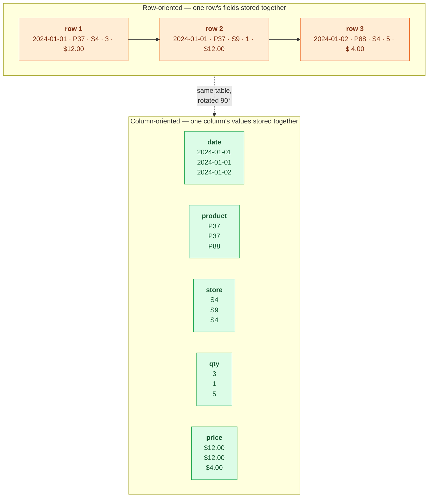

# Analytics & Column Stores

> **Prerequisites:** [Storage Engines](/synapse/system-design-from-first-principles/data-foundations/storage-engines), [Data Models](/synapse/system-design-from-first-principles/data-foundations/data-models) | **You'll be able to:** explain why analytics storage is turned on its side into columns; read and design a star schema of facts and dimensions; and reason about column compression, sort order, vectorized execution, and the cloud-warehouse storage/compute split — and say when a row store is still the right call.

## The problem (why this exists)

A product manager asks a simple question: total revenue by product category, for every order in the last year. The orders live in the checkout database — a well-tuned relational store servicing carts, payments, and inventory thousands of times a second. So the query goes there: `SELECT category, SUM(net_price) FROM orders … GROUP BY category`, and the database dutifully begins reading a year of orders.

Here is what it does under the hood, and why it hurts. Each order is stored as a *row*: order ID, customer ID, product ID, timestamp, quantity, price, discount, tax, address, payment method — a hundred-odd columns sitting together on disk, because that's exactly what checkout wants (fetch one order, get everything in a single read). But this query needs only two of those columns. To reach `category` and `net_price`, the engine still hauls entire rows off disk — all hundred columns of every one of hundreds of millions of orders — and throws ninety-eight away. It reads maybe fifty times more data than the answer requires, while the disk and buffer cache checkout depends on saturate, and carts start timing out.

The [foundations lesson](/synapse/system-design-from-first-principles/foundations/thinking-in-tradeoffs) named the resolution at the architecture level: analytics gets its own read-only copy, so it can't hurt the transactional system of record. This lesson is about the *shape* of that copy — because the fix isn't just "a second database," it's a database on a completely different physical layout, one where reading two columns of a hundred costs roughly two columns' worth of work, not a hundred. Getting there means turning the table on its side.

## Intuition first

Recall the operational/analytical split from foundations, compressed to one paragraph. **OLTP** (online transaction processing) is the interactive access pattern: look up a few records by key — a *point query* — and insert, update, or delete on user input. **OLAP** (online analytical processing) is the opposite: one query scans an enormous number of records and computes an aggregate — a count, sum, average — returning a summary rather than the records themselves [ch1 p. 5]. Operational datasets run gigabytes to terabytes, analytical ones terabytes to petabytes, because analytics keeps the full *history of events* while the operational store keeps only the latest *state* [ch1 p. 5]. Analytics is fed by ETL from the operational systems of record and is, by definition, derived data. That's the whole recap; the [foundations lesson](/synapse/system-design-from-first-principles/foundations/thinking-in-tradeoffs) owns the concept.

Now the two structural ideas this lesson adds, both stated plainly before any detail.

First, **the schema is reorganized around events**. Analysts don't want your normalized operational tables with their tangle of foreign keys. They want one giant table of *things that happened* — every sale, click, or page view as its own row — surrounded by small lookup tables describing the who, what, where, and when. That arrangement is a **star schema**, and analysts deliberately denormalize into it because it makes their questions easy to write and fast to run.

Second, **the data is stored by column, not by row**. This is the counterintuitive move, so hold the mental picture: instead of storing all the values of one row together (order 4711's ID, then its customer, then its product…), a column store keeps all the values of one *column* together (every order's product ID in one place, every net_price in another). When your query touches five columns out of a hundred, it reads five and ignores the other ninety-five entirely. Reading three columns of a hundred should not cost a hundred columns of work — and laid out by column, it doesn't. Everything else in this lesson (compression, sorting, vectorized execution) is a consequence of that one decision paying off.

## How it works

### Stars and snowflakes: the schema analysts want

Data warehouses are almost always relational, because SQL fits analytical queries well and the graphical BI tools analysts use generate SQL under the hood [ch1 p. 6]. The dominant table layout is the **star schema** (dimensional modeling). At its center sits a **fact table**: each row is an event that occurred at a particular time — a purchase, a page view, a click [ch3 pp. 77–78]. Facts are captured as individual events at the finest grain possible, for maximum analysis flexibility — which is exactly why fact tables become enormous. A big enterprise's warehouse may hold many petabytes of transaction history, mostly fact tables [ch3 p. 78].

Each column of the fact table is one of two things: an **attribute** — a numeric measurement like sale price or quantity — or a **foreign-key reference** to a **dimension table** [ch3 p. 78]. The dimensions capture the *who, what, where, when, how, and why* of the event: which product, customer, store, date. Even date is usually modeled as a dimension table rather than stored inline, so extra facts about a day — a public holiday, a promotion period — can be encoded and joined in [ch3 p. 79]. The name is literal: the fact table sits in the middle, dimension tables surround it, and the foreign keys radiate out like a star's rays [ch3 p. 79].

Here is the shape, for a grocery retailer's sales warehouse:

```d2
direction: right

classes: {
  data:   {style: {fill: "#ffedd5"; stroke: "#ea580c"}}
  svc:    {style: {fill: "#dcfce7"; stroke: "#16a34a"}}
}

fact: "fact_sales  (the fact table)\n———————————\ndate_key       →\nproduct_sk     →\nstore_sk       →\ncustomer_sk    →\npromotion_sk   →\nquantity     (attr)\nnet_price    (attr)\ndiscount     (attr)" {class: svc}

dim_date: "dim_date\n———————\ndate_key\nday_of_week\nis_holiday\nquarter" {class: data}
dim_product: "dim_product\n—————————\nproduct_sk\nname\ncategory\nbrand" {class: data}
dim_store: "dim_store\n————————\nstore_sk\ncity\nregion\nsize_sqft" {class: data}
dim_customer: "dim_customer\n——————————\ncustomer_sk\nsegment\nsignup_date" {class: data}
dim_promotion: "dim_promotion\n———————————\npromotion_sk\nname\nchannel" {class: data}

fact -> dim_date: date_key
fact -> dim_product: product_sk
fact -> dim_store: store_sk
fact -> dim_customer: customer_sk
fact -> dim_promotion: promotion_sk
```

A star schema is made almost entirely of many-to-one relationships — many sales point to one product, one store, one date [ch3 p. 79]. A multi-item purchase isn't represented explicitly either: the fact table simply has one row per product, each sharing the same customer, store, and timestamp [ch3 p. 79]. That's the price of the flat, event-per-row design, and analysts happily pay it.

The **snowflake schema** further normalizes the dimensions — breaking `dim_product` into separate `brand` and `category` sub-tables, say. It's more normalized than a star, but stars are usually preferred simply because they're *simpler for analysts to work with* [ch3 p. 79]. Warehouse tables run very wide either way: fact tables frequently exceed a hundred columns, and dimension tables carry every scrap of metadata that might one day be useful [ch3 p. 79].

Why denormalize at all, when [data-models](/synapse/system-design-from-first-principles/data-foundations/data-models) taught normalization as the disciplined default? Because the trade-off inverts for analytics. Normalized data is faster to write but slower to read (references need joins); denormalized data is faster to read but more expensive to write [ch3 p. 74]. Operational systems are write-heavy and update-in-place, so normalization wins there; analytics is read-dominated over a mostly-immutable log, so the write cost barely matters and the read speedup is pure profit [ch3 p. 74]. Some warehouses push this to **one big table (OBT)**: fold the dimension columns directly into the fact table, precomputing every join — more storage, sometimes faster queries, unproblematic because the data doesn't change [ch3 p. 79].

### Turning the table on its side: column-oriented storage

The star schema tells us *how the tables relate*. Column storage is about *how one table's bytes sit on disk* — and it's the heart of the lesson. The setup that motivates it: a fact table is often over a hundred columns wide, but a typical analytics query reads only four or five of them — `SELECT *` is rare in analytics [ch3 p. 79; ch4 p. 136].

In row-oriented storage — what the OLTP engines from [storage-engines](/synapse/system-design-from-first-principles/data-foundations/storage-engines) use — all the values from one row are stored next to each other, so an analytical query must load every row in full, all hundred-plus attributes, and discard what it doesn't need [ch4 p. 137]. **Column-oriented (columnar) storage** does the obvious opposite, captured in the one sentence DDIA uses to introduce it: "instead of storing all the values from one row together, store all the values from each column together instead" [ch4 p. 137]. Every product ID lands in one file, every net_price in another, every date in a third. A query reads and parses only the columns it references, and skips the rest at the level of disk I/O — not by reading and filtering, but by never reading them at all.



The layout rests on one invariant: **every column stores its rows in the same order** [ch4 pp. 137–138]. The 23rd entry of the date column, of the product column, and of the price column together reconstruct the 23rd row — there are no per-row identifiers threading the columns, just positional agreement. Real engines don't store a column as one monolithic petabyte file; they break the table into blocks of thousands to millions of rows and store columns separately *within each block*, often making each block a timestamp range so a date-filtered query can skip whole blocks before it even looks at columns [ch4 p. 138]. Parquet is the widely-used on-disk embodiment of this idea, and it even supports nested document-style data via a technique borrowed from Google's Dremel [ch4 p. 137].

<div style="border-left:4px solid #15448e;background:rgba(21,68,142,0.08);padding:0.6rem 1rem;border-radius:0 0.5rem 0.5rem 0;margin:1.25rem 0">

**Not to be confused with "wide-column."** Cassandra, HBase, and Bigtable are sometimes called "column-family" or "wide-column" stores — but they are *row-oriented*: all of a row's values are stored together, the row can just have thousands of columns that vary between rows [ch4 p. 140]. That's a data-model idea, the opposite of the column-*oriented* physical layout here. Same adjective, unrelated concept.

</div>

### Why columns compress, and why compression makes scans fast

Splitting into columns unlocks something a row store can't easily do: **the values in one column are often extremely repetitive**, and repetitive data compresses beautifully [ch4 p. 139]. A retailer might have a hundred thousand distinct products but sell billions of units — so the product column is billions of entries drawn from a hundred-thousand-value vocabulary [ch4 p. 139]. The technique DDIA highlights for warehouses is **bitmap encoding**: take a column with *n* distinct values and turn it into *n* bitmaps — one per distinct value, one bit per row, set to 1 where that row holds that value [ch4 p. 139]. When distinct values are few relative to row count, this is remarkably compact.

And when a bitmap is *sparse* — mostly zeros, as it will be when a value is rare — you compress it further with **run-length encoding**: instead of `0,0,0,0,0,0,0,0,1,0,…`, store the run lengths "eight zeros, one, …" [ch4 pp. 139–140]. (Roaring bitmaps go further, switching representations to pick whichever is smallest per chunk [ch4 p. 140].) Two payoffs follow, and the second is the one people miss. The obvious one is space. The deeper one: **bitmap-encoded columns turn analytical filters into bitwise operations**. A `WHERE product_sk IN (30, 68, 69)` becomes a bitwise OR of three bitmaps; a `WHERE a AND b` becomes a bitwise AND of two — and because the *k*th bit of every column's bitmap refers to the same row *k*, those ANDs and ORs line up for free [ch4 p. 140]. Bitwise AND/OR over packed bits is about the cheapest thing a CPU can do, and it handles many rows per instruction. So compression here isn't only saving disk — it's converting predicate evaluation into a form the processor devours.

That's the key inversion worth stating outright: **in a row store, compression fights the CPU (you decompress before you can use the data); in a columnar analytics engine, compression *helps* the CPU**, because scans read less off disk *and* run their filters directly on the compact encoded form.

### Sort order as a (free) index

Rows in a column store don't have to be in any particular order — insertion order is easiest [ch4 p. 140]. But an administrator can *choose* to sort the whole table by one or more columns, and this acts as a kind of index. The subtlety: you can't sort each column independently (that scrambles the positional agreement that reconstructs rows) — the table is sorted as a whole, every column reordered together to preserve row alignment [ch4 p. 140].

Pick `date_key` as the first sort key, and a query for "last month's sales" scans only the relevant contiguous stretch of rows instead of the whole table [ch4 pp. 140–141]. Add a second sort key like `product_sk` and rows sharing a date are further grouped by product. But sorting buys a quieter second win: it **supercharges compression**. A low-cardinality first sort key produces long runs of identical values — sort by date and every row for a given day is adjacent — so run-length encoding crushes that column to a few kilobytes even across billions of rows [ch4 p. 141]. The effect is strongest on the first sort key and fades for later columns, which are only locally ordered [ch4 p. 141]. Choosing the sort order is therefore a genuine design decision, tuned to your most common queries.

### How writes get into a column store

All this compression and sorting seems to make writes impossible — and for single-row writes, it nearly is. Insert one row into a sorted, compressed columnar table and you'd rewrite every column from that position onward [ch4 p. 141]. So column stores don't: warehouse writes are typically bulk ETL loads, which amortize the rewrite across millions of rows at once [ch4 p. 141].

For the writes that do trickle in, column stores borrow the exact trick from [storage-engines](/synapse/system-design-from-first-principles/data-foundations/storage-engines): a **log-structured** approach. Incoming writes go first to a row-oriented, sorted, in-memory store — an LSM-tree's memtable by another name — which is periodically merged in bulk with the on-disk column files to produce new immutable column files (object storage suits this: you only ever write whole new files, never mutate in place) [ch4 p. 141]. Queries read *both* the on-disk columns and the recent in-memory writes, so an insert, update, or delete takes effect immediately even though the compressed on-disk columns are untouched — Snowflake, Vertica, Pinot, and Druid all work this way [ch4 p. 141]. If the memtable-flush-compaction mechanism feels familiar, that's the point: analytics reuses the write-optimization machinery you already met and layers columnar read-optimization on top.

### Making the scan CPU-bound: vectorization and compilation (expert)

Once columns are compressed and the right blocks are loaded, the bottleneck shifts. For a query scanning millions of rows, CPU time matters as much as disk reads — and a naive engine wastes it badly [ch4 p. 142]. A SQL query compiles into a plan of **operators** (stages), possibly distributed for parallelism; the naive operator interprets the query row by row, re-deciding what to do at every single value — far too slow across millions of them [ch4 p. 142]. Two techniques fix this, presented by DDIA as siblings:

**Vectorized processing** keeps interpreting the query but processes column values in *batches* through predefined operators — hand a chunk of a column plus a constant to an equality operator and get back a bitmap; AND two bitmaps for their intersection [ch4 pp. 142–143]. **Query compilation** instead generates custom code for the specific query and compiles it to machine code (often via LLVM, JIT-style like the JVM), then runs that over the in-memory columns [ch4 p. 142]. Different implementations, both in production. What unites them is exploiting the same CPU properties: sequential memory access (few cache misses), tight inner loops (few branch mispredictions), thread- and SIMD-level parallelism, and — critically — the ability to **operate directly on compressed column data without decoding it first** [ch4 p. 143]. This is where the compression-helps-the-CPU claim cashes out at the instruction level.

### Precomputing answers: materialized views and data cubes

The last optimization trades storage for speed by precomputing results. A **virtual view** is just a query shortcut, expanded on read; a **materialized view** is an actual copy of the query's results, written to disk [ch4 p. 143]. Materialized views must be refreshed when the underlying data changes — more write work for much faster repeated reads — and some databases update them automatically, while specialized systems like Materialize exist to do exactly that [ch4 pp. 143–144].

A **data cube** (OLAP cube) is the classic case: a materialized grid of aggregates grouped by dimensions [ch4 p. 144]. Picture a grid indexed by date on one axis and product on the other, each cell holding the SUM of net_price for that combination; sum along an axis to summarize by date alone, or by product alone. Precomputed like this, "total sales per store yesterday" needs no row scan — the answer sits in a cell [ch4 p. 144]. The catch is flexibility: a cube only answers along its chosen dimensions. Ask something it didn't anticipate — "total sales for items over \$100," where price isn't a dimension — and it can't help [ch4 pp. 144–145]. So warehouses keep the raw fact data as the source of truth and use cubes only as a *boost* for common, expensive queries [ch4 pp. 144–145].

### The cloud warehouse: separating storage from compute

Everything above describes the *engine*; the modern deployment wraps it in a cloud architecture that is itself a design lesson. Traditional on-premises warehouses (Teradata, Vertica, SAP HANA) bundled storage and query processing on the same machines. Cloud-only warehouses — BigQuery, Amazon Redshift, Snowflake — instead exploit object storage and serverless compute, and their defining move is to **decouple query compute from storage**: the data lives in object storage, so storage and compute scale independently [ch4 p. 135]. This is the same separation-of-storage-and-compute pattern the [foundations lesson](/synapse/system-design-from-first-principles/foundations/thinking-in-tradeoffs) introduced, applied to analytics — and it's why cloud warehouses are so much more elastic than the on-prem generation. Bursty analytics (heavy parallel query, then idle) is the ideal fit: spin up a large compute fleet for a big scan, return it when done, and never move the underlying data.

The same forces broke the monolithic warehouse into swappable layers, especially in the open-source data-lake world [ch4 p. 135]:

| Layer | What it does | Examples |
| --- | --- | --- |
| Query engine | Parses SQL, optimizes into a plan, executes (often distributed) | Trino, Presto, DataFusion, Spark, Flink |
| Storage format | Encodes table rows as bytes in a file, usually in object storage | Parquet, ORC, Lance, Nimble |
| Table format | Since those files are immutable, defines which files make up a table (plus schema, time travel, GC, transactions) | Apache Iceberg, Delta Lake |
| Data catalog | Defines which tables a database contains (create/rename/drop) | Snowflake Polaris, Databricks Unity Catalog |

Decoupling these isn't only about elasticity — running the catalog as a standalone REST service, for instance, lets governance tools reach the metadata directly [ch4 p. 136]. This layered, object-storage-backed stack — a table format like Iceberg or Delta Lake adds transactions and *time travel* (querying the table as it existed earlier) on top of immutable files — is what "the modern data lakehouse" refers to, and it's the direct descendant of the column-store ideas in this lesson.

## Trade-offs

| Option | Gives you | Costs you | Use when |
| --- | --- | --- | --- |
| Column-oriented storage | Reads only the columns a query touches; excellent compression; CPU-friendly scans | Terrible at single-row point access and single-row writes; whole-row fetches are scattered | Analytical scans over a few of many columns — OLAP |
| Row-oriented storage | Fetch a whole record in one read; cheap in-place single-row writes | Analytical scans haul entire rows and discard most columns | Point queries and record-level CRUD — OLTP |
| Star schema (denormalized) | Simple for analysts; fast reads; the join is mostly precomputed by design | More storage; the fact table restates dimension keys on every row | Standard warehouse modeling; analyst-facing BI (snowflake only when dimension duplication genuinely hurts) |
| Sort order on a column | Skip-scan by the sort key; dramatically better compression via long runs | You get *one* physical sort order per table; must match your dominant query | A dominant filter/range column (usually a timestamp) |
| Materialized view / data cube | Common expensive queries answered with no scan | Extra storage; refresh cost on every underlying change; cube fixes its dimensions | A handful of hot, predictable aggregations over stable data |
| Cloud warehouse (storage/compute split) | Independent elastic scaling; pay compute only when querying | Network between compute and object storage; per-query billing to watch | Bursty analytics; large history; elastic demand |

## Numbers that matter

The scale anchors that make the columnar case obvious — carry these into any analytics design:

- **A fact table runs to trillions of rows and petabytes; dimension tables are millions of rows**, and fact tables are often **100+ columns wide** [ch3 pp. 78–79; ch4 p. 136]. That asymmetry is the whole reason the star schema and column storage exist.
- **A typical analytics query reads only about four or five columns** of that 100+ column table [ch4 p. 136]. That ratio — ~5 of 100 — is the entire economic argument for columnar storage: a row store pays the full 100 every time.
- **~100,000 distinct products vs. billions of sales.** This low-cardinality-in-a-huge-column ratio is exactly what makes bitmap and run-length encoding so effective [ch4 p. 139].
- **Operational datasets: GB–TB. Analytical datasets: TB–PB** [ch1 p. 5]. Three orders of magnitude more history on the analytical side — it keeps events, not just current state.

For the numbers habit itself — estimating data volume and query load before choosing a layout — see [Estimation & the Numbers](/synapse/system-design-from-first-principles/foundations/estimation-and-numbers).

## In production

The column-store idea is everywhere analytics runs. Columnar storage underpins Snowflake, DuckDB, Apache Pinot, and Druid; the on-disk formats are Parquet, ORC, Lance, and Nimble; the in-memory representation is Apache Arrow (and, informally, Pandas/NumPy); time-series systems like InfluxDB's IOx and TimescaleDB lean on it too [ch4 p. 138]. "Parquet on S3 queried by Trino" is exactly the layered, object-storage-backed column store this lesson described.

The cloud-native generation is where the storage/compute split shows its commercial value: Snowflake, BigQuery, and Redshift store the bytes in object storage and rent compute separately, so a team can run a monster quarter-end query on a huge cluster, pay for those minutes only, then drop back to a small warehouse for daily dashboards [ch4 p. 135]. The open-source world reassembled the same capabilities from the swappable layers above (Trino, Parquet, Iceberg, a standalone catalog) into what's now called the "lakehouse" — the current center of gravity for analytics engineering, because immutable columnar files plus a thin metadata layer turned out to beat a monolithic warehouse box.

A note on the boundary. Not all analytics is batch and high-throughput. **Real-time / product-analytics** systems — Pinot, Druid, ClickHouse — run aggregating workloads *inside* user-facing products, ingesting continuously and optimizing for low-latency responses rather than overnight throughput [ch1 p. 6]; they still use columnar storage and the in-memory-buffer-plus-immutable-files write path, just tuned for seconds-fresh data feeding a live dashboard. And **HTAP** systems (SAP HANA, SingleStore, SQL Server) promise OLTP and OLAP in one product — but even these typically resolve into a row-oriented engine and a column-oriented engine behind a shared SQL interface, the clearest evidence that the two workloads genuinely want different physical layouts [ch4 p. 135].

## Pitfalls & interview traps

**Running analytics on the OLTP primary "just this once."** The opening story, and the single most common self-inflicted outage in this space. It seems harmless — it's one query — but a full-table aggregate on a row store reads every column of every row and saturates the disk and buffer cache the transactional workload depends on.

<div style="border-left:4px solid #da5233;background:rgba(218,82,51,0.08);padding:0.6rem 1rem;border-radius:0 0.5rem 0.5rem 0;margin:1.25rem 0">

⚠️ **"I'll just run the report against production — it's read-only, it can't hurt anything."** Read-only doesn't mean resource-free. A heavy OLAP scan on a row-oriented OLTP database competes for exactly the I/O bandwidth and cache that live traffic needs, and the row layout forces it to read far more than it uses. The fix is never "add another index" or "ask the analyst to be careful" — it's a *separate, differently-shaped copy* (a warehouse or a read replica feeding one). If an interviewer floats "can't we just query the primary for the dashboard?", naming this failure mode — and the columnar copy that resolves it — is the senior answer.

</div>

**Confusing "column-family" (wide-column) with "column-oriented."** Cassandra and HBase are wide-column stores and are *row-oriented* — a beginner trap that reads as sloppiness in an interview [ch4 p. 140]. "Wide-column" is a flexible data model; "column-oriented" is a physical disk layout for scans. Asked "is Cassandra a column store?", the precise answer is "it's wide-column — a row-oriented model, not the columnar analytics layout."

**Expecting a column store to serve point lookups.** Fetching one complete row means seeking into every column file and reassembling — the exact operation a row store does in a single read. Column stores are built for wide scans over few columns, not "give me this one order in full"; using one as an operational database is the mirror image of running analytics on OLTP.

**Assuming denormalization is always wrong.** [Data-models](/synapse/system-design-from-first-principles/data-foundations/data-models) rightly teaches normalization as the operational default, and a candidate who parrots "always normalize" gets caught here. In analytics the trade-off flips — near-immutable log, bulk writes, read-dominated — so the star schema (and even one-big-table) denormalizes *on purpose*, and it's the correct call [ch3 pp. 74, 79].

**Forgetting a materialized view or cube must be refreshed.** A precomputed aggregate is derived data with a sync obligation, exactly like a cache: it speeds reads but adds write cost and staleness, and a cube only answers along its chosen dimensions — a boost over raw data, never a replacement [ch4 pp. 143–145].

## Check yourself

```quiz
{"prompt": "A fact table has 120 columns and billions of rows. An analytics query reads just 4 of those columns and aggregates them. Why does column-oriented storage make this dramatically cheaper than a row store?", "options": ["The column store reads only the 4 columns the query references and never touches the other 116, whereas a row store must load every full row and discard the unused columns", "The column store has fewer rows because columns are deduplicated across the table", "The column store keeps the entire table in RAM, so no disk reads are needed", "The column store automatically converts the query to a point lookup by primary key"], "answer": "The column store reads only the 4 columns the query references and never touches the other 116, whereas a row store must load every full row and discard the unused columns"}
```

```quiz
{"prompt": "In a star schema, which statement is correct?", "options": ["The fact table holds one row per event and references small dimension tables via foreign keys; it's denormalized on purpose because analytics is read-heavy over near-immutable data", "The dimension tables hold the events and the fact table holds descriptive metadata", "A star schema is more normalized than a snowflake schema", "Star schemas forbid storing any numeric attributes directly in the fact table"], "answer": "The fact table holds one row per event and references small dimension tables via foreign keys; it's denormalized on purpose because analytics is read-heavy over near-immutable data"}
```

```quiz
{"prompt": "Why does choosing a low-cardinality first sort key (e.g. date) both speed up range scans AND improve compression in a column store?", "options": ["Sorting groups equal values into long contiguous runs, so range queries scan only the relevant stretch and run-length encoding crushes those runs to a few KB", "Sorting removes duplicate rows, shrinking the table before it is stored", "Sorting lets each column be ordered independently, so every column compresses separately", "Sorting converts the column store into a row store, which compresses better"], "answer": "Sorting groups equal values into long contiguous runs, so range queries scan only the relevant stretch and run-length encoding crushes those runs to a few KB"}
```

```quiz
{"prompt": "A cloud warehouse like Snowflake or BigQuery 'separates storage from compute.' What concrete advantage does that give an analytics team with bursty query load?", "options": ["Data sits in object storage, so a large compute cluster can be spun up for a heavy query and released afterward — paying for that compute only while it runs — without moving the data", "It eliminates the need for a query engine, since object storage runs the SQL itself", "It makes single-row OLTP writes as fast as a relational database", "It guarantees every query result is precomputed, so no scanning ever happens"], "answer": "Data sits in object storage, so a large compute cluster can be spun up for a heavy query and released afterward — paying for that compute only while it runs — without moving the data"}
```

**1.** Bitmap encoding turns a column with *n* distinct values into *n* bitmaps of one bit per row. Explain why this makes a filter like `WHERE product_sk IN (30, 68, 69)` fast — and what property of the bitmaps makes combining conditions across *different* columns work.

<details><summary>Answer</summary>

Each distinct value of `product_sk` has its own bitmap with one bit per row, set where that row holds that value. `IN (30, 68, 69)` is answered by taking the bitmaps for 30, 68, and 69 and OR-ing them together — a bitwise OR over packed bits, one of the cheapest and most parallel operations a CPU can perform, producing a result bitmap marking every matching row. Combining conditions across columns works because of positional alignment: the *k*th bit of *every* column's bitmap refers to the same row *k*. So a `product_sk IN (…) AND store_sk = 4` is a bitwise OR (within product) followed by a bitwise AND (against the store bitmap), and the bits line up without any join or row identifier. Sparse bitmaps are additionally run-length encoded, and AND/OR still work efficiently on the encoded form [ch4 p. 140].

</details>

**2.** Column stores are famously hostile to single-row inserts, yet Snowflake and Druid let you insert a row and see it in query results immediately. How is that reconciled?

<details><summary>Answer</summary>

Inserting one row directly into sorted, compressed column files would force a rewrite of every column from that position onward — so column stores don't do it. Instead they use a log-structured write path, exactly like an LSM-tree's memtable: incoming writes go to a row-oriented, sorted, in-memory store first. That buffer is periodically merged in bulk with the on-disk column files, producing new immutable column files (a good fit for object storage, since you only ever write whole new files). Queries read *both* the on-disk columns and the recent in-memory writes and combine them, so the new row appears immediately even though the compressed on-disk columns are untouched until the next bulk merge [ch4 p. 141].

</details>

**3.** Your team wants sub-second "total sales per store, per day" on a dashboard, refreshed continuously. Would you reach for a data cube, and what's the catch you'd flag?

<details><summary>Answer</summary>

Yes — that query is a fixed aggregation along two dimensions (store × day), which is exactly what a data cube precomputes: the answer sits in a cell, needing no row scan, so sub-second response is easy [ch4 p. 144]. Two catches to flag. First, a cube is derived data with a refresh obligation — every underlying change means recomputing affected cells, so "continuously refreshed" is real write cost, and a materialized-view/real-time system (or a Pinot/Druid-style engine) may fit better than a batch cube. Second, a cube can only answer along its chosen dimensions; the moment someone asks a variant the cube didn't anticipate — "sales of items over \$100," where price isn't a dimension — it can't help, so you keep the raw fact data as the source of truth and treat the cube as a boost, not a replacement [ch4 pp. 144–145].

</details>

## Sources

- DDIA2 ch. 4 pp. 134–146 (cloud data warehouses & storage/compute separation; column-oriented storage; bitmap & run-length compression; sort order; log-structured writes to column stores; query compilation & vectorization; materialized views & data cubes; wide-column vs column-oriented)
- DDIA2 ch. 3 pp. 77–80 (star & snowflake schemas; fact vs dimension tables; one big table; normalization/denormalization trade-off for analytics)
- DDIA2 ch. 1 pp. 3–10 (OLTP vs OLAP recap; data warehousing, ETL, and data lakes; real-time analytics; HTAP)
