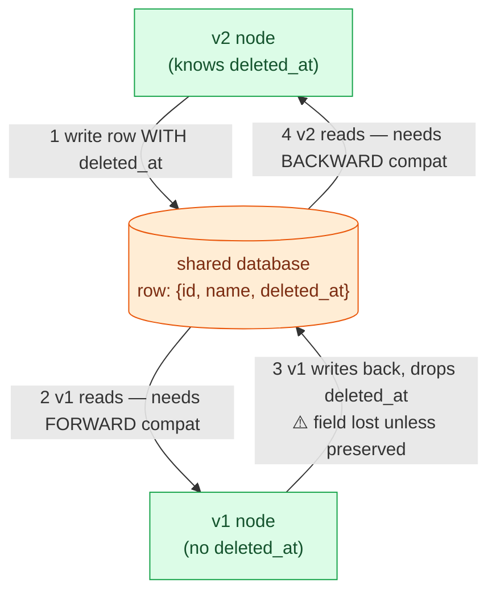

# Encoding & Schema Evolution

> **Prerequisites:** [Data Models](/synapse/system-design-from-first-principles/data-foundations/data-models), [API Design](/synapse/system-design-from-first-principles/foundations/api-design) | **You'll be able to:** define backward and forward compatibility precisely and say who reads and who writes in each direction; choose between JSON, Protocol Buffers, and Avro with reasons that survive scrutiny; and answer the senior follow-up "how do you roll this schema change out?" for databases, services, and event pipelines.

## The problem (why this exists)

You add a field — a single column, `deleted_at`, so rows can be soft-deleted instead of vanishing. You test it, you ship it. Mid-deploy, a support ticket lands: a record the customer clearly deleted has come back from the dead.

This isn't a bug in your code so much as a fact about the universe it runs in. Your deploy is a **rolling upgrade** — the new version goes out a few nodes at a time, monitored, with no downtime, because you cannot replace every process at once [p. 161]. For a stretch of minutes, some nodes know about `deleted_at` and some have never heard of it. A new node writes a record carrying the field; an old node reads it, does its job, and writes it back — and because *its* record has no `deleted_at`, the field evaporates on the way back to disk [pp. 162–163]. The delete is undone by a peer that meant no harm.

Scale the timeline up and the collision reappears in a second dimension. A schema-on-read store enforces nothing and holds a mixture of formats written at different moments; even a relational database, migrated only via ALTER, keeps old rows in place [p. 161]. So a row you wrote five years ago still sits there in its original encoding, waiting for code you wrote this morning. Old code meets new data across a rolling upgrade; new code meets old data across the passage of time — both permanent conditions of any system that stays up and keeps changing.

This is **evolvability** — building systems easy to change [p. 161] — reduced to its mechanical core: how do you encode data so two versions of your software, and two eras of your data, coexist without corrupting each other? Get it right and "your application's evolution [is] rapid and your deployments [are] frequent" [p. 192] — you ship additively, all day, without fear.

## Intuition first

Everything here rests on two words people constantly swap by accident. Nail them once.

**Backward compatibility: new code can read old data.** You look *backward* in time at data written by an earlier version — normally the easy direction, since the author of the new code knows the old format and handles it deliberately [p. 162].

**Forward compatibility: old code can read new data.** You ask code written *before* to cope with data from the *future* — the tricky direction, because old code must gracefully ignore additions it doesn't understand rather than choke or discard them [p. 162].

A picture that sticks: **backward is reading your ancestors' letters; forward is your ancestors reading yours.** Which direction you need depends entirely on **who writes and who reads**, and that flips with the arrangement. In one database under a rolling upgrade: new node writes, old node reads → forward; old node writes, new node reads → backward — both at once, so a database needs **both** [pp. 178–179]. For a service API: an older client calling a newer server needs backward compatibility on the request and forward compatibility on the response; a newer client flips both [p. 162]. Say "who reads, who writes" every time and you'll never reverse the direction in an interview — which is exactly where candidates trip.

The second intuition is about **schemas** — a contract stating what fields exist and their types. Some formats carry it *inside every message* (JSON writes `"userName"` next to the value); others keep it *outside*, agreed in advance (Protobuf ships only the number `1`; Avro ships nothing but the bare value). Where the contract lives determines how compactly you encode and how gracefully you change — the ladder next.

## How it works

In memory, data is objects, lists, and trees threaded with pointers; on disk or a network, pointers are meaningless, so it must become a **self-contained sequence of bytes** [p. 163]. Turning the in-memory shape into bytes is **encoding** (serialization); the reverse is **decoding** (parsing, deserialization) [p. 163]. Every claim about compatibility is a claim about a specific format, so we climb the ladder worst to best, using one running record: `{userName, favoriteNumber, interests}`.

### Rung 1 — Language-native serialization (the trap)

Java's `Serializable`, Python's `pickle`, Ruby's `Marshal` save and restore an object graph in a couple of lines [pp. 164–165]. It's a trap, for four compounding reasons: **language lock-in** (bytes tied to one language's object model); **security holes** (decoding instantiates arbitrary classes, a recurring path to remote code execution); **versioning as an afterthought**; and **bad efficiency** (Java's is infamously slow and bloated). The verdict: don't use it beyond a transient, same-process purpose [p. 165].

### Rung 2 — JSON, XML, CSV (the lingua franca, and what's lossy)

Standardized, cross-language, human-readable text gives you JSON, XML, and CSV — good enough that they dominate interchange *between* organizations, where agreeing on the format beats being pretty or fast [pp. 165–166]. But "human-readable" hides real losses [pp. 165–166]:

- **Numbers are ambiguous.** XML and CSV can't tell a number from a digit-string without a schema; JSON separates strings from numbers but not integers from floats. Worse, an IEEE 754 double can't represent integers above 2^53 exactly, so a language parsing JSON numbers as floats (JavaScript) mangles them — X (Twitter) returns 64-bit tweet IDs *twice*, once as a number and once as a decimal string [p. 165].
- **No binary strings.** JSON/XML carry Unicode text but not raw bytes, so people Base64-encode binary data — hacky, and about **33% larger** [p. 165].
- **CSV has no schema** and is vague about commas, newlines, and escaping, with rules not every parser implements correctly [p. 166].

Schema languages exist — JSON Schema is widely adopted (OpenAPI, registries, databases), with validation like "this port is 1 to 65,535" [p. 166] — but content models, conditional rules, and remote references make evolving them compatibly genuinely hard [pp. 166–167].

Text's size cost prompted **binary JSON** variants (MessagePack, CBOR, BSON) [p. 167]. But they keep JSON's model and still prescribe *no schema*, so they must embed every field name in the bytes [p. 167]. MessagePack shrinks our record from 81 bytes to 66 — the field names still ride along, so you've lost human-readability for a small win [p. 169].

### Rung 3 — Protocol Buffers (field tags earn their keep)

Protocol Buffers (Google) — and its cousin Thrift (Facebook) — require a schema in an IDL, from which a code generator emits encode/decode classes in many languages; the schema is deliberately simple, just fields and types, no value validation [p. 169].

The move that changes everything: instead of field *names*, the bytes carry **field tags** — the numbers `1`, `2`, `3` you assign in the schema, acting as compact aliases [p. 170]. Type and tag pack into one byte, and integers use **variable-length encoding** (a varint), where the top bit of each byte says whether more follow, so small numbers cost one byte and large ones grow only as needed [p. 170]. Our record drops to **33 bytes**; there's no array type, so a `repeated` field is just the same tag appearing several times [pp. 169–170].

Now watch the evolution rules fall straight out of that one choice — tags, not names, identify fields [p. 171]:

- **Rename a field freely** — names aren't in the bytes, so a rename is invisible to encoded data.
- **Never change a tag** — it would orphan every record ever written.
- **Add a field with a new tag.** Old code hitting an unknown tag reads the datatype annotation, learns how many bytes to skip, and skips it — *preserving* the unknown field. Forward compatibility, for free.
- **New code reading old data** finds the added field missing and fills a type default (empty string, 0) — backward compatibility.
- **Remove a field like adding one, in reverse** — and reserve the dead tag forever.
- **Changing a type risks truncation.** Widening `int32`→`int64` lets new code read old values (missing bits become 0), but old code reading a new 64-bit value into a 32-bit variable truncates on overflow.

### Rung 4 — Avro (no tags, two schemas)

Avro (2009, a Hadoop subproject Protobuf didn't fit) carries, remarkably, **no field tags and no type markers at all** [p. 172]. Our record is **32 bytes**, the most compact of the lot; a string is just a length prefix plus UTF-8 bytes, with *nothing* marking it as a string [p. 172].

If nothing in the bytes says what anything is, how does decoding work? You walk fields in schema order and let the schema supply each type — so the reader must use the exact schema the writer used, or the bytes decode to garbage [p. 172]. Avro's central idea: the **writer's schema** (whatever encoded the data) and the **reader's schema** (what the consumer expects) may differ [p. 173]. To decode, Avro holds both and **resolves** them — matching fields **by name** so order can differ; a writer field the reader doesn't want is ignored; a field the reader expects but the writer lacks is filled from a **default in the reader's schema** [pp. 173–174].

That resolution *is* the evolution story, and it restates our two words exactly [p. 175]:

- **Forward** = writer on a *newer* schema than reader; **backward** = writer on an *older* schema.
- You may add or remove only a field that **has a default value** [p. 175]. No default: adding breaks backward compatibility, removing breaks forward.
- Nullability is explicit: `null` is never a valid default alone, so to allow null you use a **union type** like `union { null, long }`, with `null` first — verbose, but it stamps out a class of bugs [p. 175].
- Renaming works via **aliases** in the reader's schema (backward but not forward compatible), and so does adding a union branch [p. 175].

The reader must still obtain the writer's schema, and shipping it in every record would erase the savings. So the solution depends on the setting [pp. 175–176]: a **big file** (a Hadoop dump) writes the schema once at the front — Avro's **object container files**; a **database of individual records** tags each with a **version number** and keeps a table of schema versions to look up (Confluent's Kafka registry and LinkedIn's Espresso work this way); a **network connection** negotiates the version at handshake [p. 176].

That version table is worth having anyway — it documents history and lets you *check* compatibility before deploying [p. 176]. And because Avro matches by name with no tags to hand-assign, it's uniquely friendly to **dynamically generated schemas**: dump a relational database, machine-generate a schema one field per column, and on a column add/drop just regenerate — by-name matching still lines up old readers with new writers [pp. 176–177]. Protobuf can't: it needs hand-assigned tags babysat on every change [p. 177].

<div style="border-left:4px solid #195045;background:rgba(25,80,69,0.08);padding:0.6rem 1rem;border-radius:0 0.5rem 0.5rem 0;margin:1.25rem 0">

💡 **The ladder in one line.** *Where the schema lives decides everything.* Inline in every message (JSON) → readable but bulky and loosely typed. A number baked in the schema (Protobuf tags) → compact, evolution rules follow from the tag. Nothing in the bytes, separate reader's and writer's schemas (Avro) → most compact, matches by name, best for generated schemas.

</div>

### The genuine merits of schemas

The idea isn't new — it echoes ASN.1 (1984, still encoding SSL's X.509 certificates), too complex to pick today [p. 177]. What modern schema-based binary formats buy is concrete [pp. 177–178]: **more compact** than binary JSON (no field names); a schema that doubles as **always-current documentation** (you can't decode without it); a registry to **check compatibility before deploying**; and, in typed languages, **codegen with compile-time checks**. You get much of schema-on-read JSON's flexibility with far better guarantees — if you keep live schema versions few [p. 178].

### The dataflow modes — where compatibility actually bites

Compatibility is a relationship between an encoding process and a decoding process — it exists anywhere you send data to something that doesn't share your memory [p. 178]. Four modes matter.

**Through databases.** Storing a value is "sending a message to your future self" — backward compatibility [p. 178] — but concurrent old and new processes during a rolling upgrade add the forward direction too [pp. 178–179]. And a database holds values written five milliseconds and five years ago; deploying new code leaves old *data* in its original encoding — **"data outlives code"** [p. 179]. Rewriting every row is expensive, so databases avoid it: a nullable-column add needs no rewrite (missing values read as null), and LSM engines rewrite to the latest format during compaction [p. 179]. Schema evolution thus makes the database *look* like one schema though storage is a museum of versions; immutable snapshots are the moment to re-encode consistently, into Avro container files or Parquet [pp. 179–180].

**Through services.** Clients call servers exposing an application-specific API — a *service* — meant to be **independently deployable**, so old and new clients and servers run at once and must stay compatible across API versions [pp. 180–181]. REST versus RPC, IDLs, and why a network call can't be made to look local are owned by the [API Design](/synapse/system-design-from-first-principles/foundations/api-design) lesson. The one fact to carry here is the **compatibility direction**: a simplifying assumption databases don't get is that servers upgrade *first* and clients *second*, so you need only **backward compatibility on requests and forward compatibility on responses** [p. 186]. Across organizational boundaries it's harder — a provider can't force clients to upgrade, so compatibility may hold indefinitely, and breaking changes force multiple API versions side by side [p. 186].

**Through workflows and durable execution.** Split an app across services and one operation — a payment — becomes a **workflow**: a graph of **tasks** (fraud check → debit card → deposit funds) run by a **workflow engine** [pp. 186–187]. **Durable execution** engines (Temporal, Restate) give exactly-once semantics: on a mid-workflow failure the framework re-runs the code but *skips* the RPCs and state changes already completed, replaying their logged results from a write-ahead log [p. 188]. That replay imposes a hard **determinism constraint**: because it expects a re-execution to make the same calls in the same order, reordering function calls yields undefined behavior — so you deploy a new version *separately* and avoid nondeterministic ingredients like random numbers or the clock (frameworks supply deterministic substitutes and analyzers to catch violations) [p. 189]. (We revisit determinism under faults in Distributed Data.)

**Event-driven, through a broker.** A request is an **event** sent through a **message broker** that stores it temporarily; the sender doesn't wait [p. 189]. The encoding rules carry straight over — a message is bytes plus metadata, and the common pattern is Protobuf/Avro/JSON with a **schema registry** beside the broker checking compatibility [p. 190]. The trap recurs: a consumer republishing to another topic must **preserve unknown fields**, or it re-creates the field-loss corruption on the stream [p. 191]. The Patterns module's event-driven lesson goes deeper.

The opening database collision, drawn as the rolling upgrade that makes it permanent:



Step 2 demands forward compatibility (old code reading new data), step 4 backward (new code reading old data) — which is why a database, alone among the modes, needs both.

## Trade-offs

| Format | Gives you | Costs you | Use when |
| --- | --- | --- | --- |
| Language-native | Trivial object-graph save/restore | One language; RCE-prone; weak versioning; slow & bloated | Never beyond a transient same-process cache [pp. 164–165] |
| JSON / XML / CSV | Human-readable; universal; cross-org | Bulky; ambiguous numbers; 2^53 corruption; +33% Base64 | Public APIs, config, debugging, cross-org exchange [pp. 165–166] |
| Binary JSON (MessagePack) | Slightly smaller; keeps JSON's model | Names still inline (66 B); loses readability for little gain | Rarely worth it — prefer a schema format [pp. 167–169] |
| Protocol Buffers / Thrift | Compact (33 B); tag-based evolution; strong codegen | Not readable; tags hand-assigned; hard to auto-generate | Service RPC (gRPC), typed internal contracts you control [pp. 169–172] |
| Avro | Most compact (32 B); by-name; great for generated schemas | Reader must obtain the writer's schema | Big-data dumps, Kafka pipelines, dynamic schemas [pp. 172–177] |

The cross-cutting axis: **text** is readable and needs no schema sharing but is bulky and loosely typed; **schema-driven binary** roughly halves the payload and turns the schema into live documentation and a compatibility gate — at the cost of readability and sharing the schema [pp. 165–178].

## Numbers that matter

DDIA's measured or stated values for the running record and its formats:

| Figure | Value | Why it matters | Page |
| --- | --- | --- | --- |
| JSON, whitespace stripped | 81 bytes | The text baseline | p. 169 |
| MessagePack (binary JSON) | 66 bytes | Names still inline → only ~19% smaller | p. 169 |
| Protocol Buffers | 33 bytes | Tags + varints drop names → ~60% off JSON | p. 169 |
| Avro | 32 bytes | No tags/type markers → most compact shown | p. 172 |
| Base64 overhead | ~+33% | Cost of binary through JSON/XML | p. 165 |
| Exact-integer ceiling, IEEE 754 double | 2^53 | Above it, JSON numbers corrupt in float languages | p. 165 |
| Protobuf varint ranges | −64..63 (1 B), −8,192..8,191 (2 B) | Small numbers cost fewer bytes | p. 170 |
| ASN.1 first standardized | 1984 | Tag-based evolution is ~40 years old | p. 177 |

The interview headline: **binary schema formats roughly halve payload versus JSON** (33 B vs 81 B), and that win compounds in the internal service fan-out where one request becomes dozens of calls you control; at a public mobile edge one round-trip dwarfs the delta, so JSON's debuggability usually wins. *Rule of thumb, not from source:* keep concurrently-live schema versions in the low single digits; DDIA says only "keep the number minimal" [p. 178].

## In production

**Kafka pipelines run on a schema registry.** Confluent's Schema Registry (and Red Hat's Apicurio) sit beside the broker, store every schema version, and *reject* a producer whose new schema would break the configured compatibility mode before a bad message ships [pp. 176, 190]. Each message carries a schema-ID; consumers fetch the writer's schema by ID and resolve it against their reader's [p. 176]. This is DDIA's "database of schema versions" made standard infrastructure — the reference architecture behind "how would you evolve events in a Kafka system?" AsyncAPI plays the OpenAPI role for messages [p. 190].

**gRPC is Protobuf on the wire**, inheriting its evolution rules — add a tag, never reuse one, reserve the dead ones [pp. 181, 186]. Teams enforce this with schema-linters (Buf) in CI that fail the build on a wire-breaking change, turning "don't reuse tag 2" into a gate.

**"Data outlives code" is a daily reality.** LSM engines (Cassandra, RocksDB) rewrite records to the latest format during compaction, so old encodings age out on their own [p. 179]; relational shops lean on nullable-column-add-without-rewrite to ship changes on live multi-terabyte tables [p. 179]. The genuinely hard migrations — splitting a column into a table, a value into a list — fall to application-level backfills, which DDIA flags as an open research problem [p. 179].

**Durable execution is spreading for exactly-once workflows.** Temporal and Restate back payment flows where a mid-sequence crash must never charge a card without delivering the goods — impossible to wrap in one database transaction once a third-party gateway is involved [p. 188]. The catch is the determinism constraint: the engine replays logged history, so you can't reorder workflow code and must deploy new versions *separately*; sneaking a `now()` or `rand()` into it is the classic outage [p. 189].

### Hands-on: evolve a schema

A runnable, from-first-principles demo lives at `proof-of-concepts/02-data-foundations/05-encoding-and-evolution/` in the repo root — a tiny **tag/type/value binary codec** (the essence of Protobuf/Thrift), no external libraries.

```bash
cd proof-of-concepts/02-data-foundations/05-encoding-and-evolution
./run            # the three evolution scenarios
./run test       # mypy --strict + unit tests + demo
```

It writes a record with schema v1 and reads it back with an evolved v2 (and vice versa): a **new reader reads old data** (the added field falls back to its default; a field renamed on the same tag still resolves), an **old reader reads new data** (the unknown tag is skipped), and reusing a tag for a *different type* raises `EvolutionError` — the one change compatibility can't survive. The rule that drops out: add fields on new tags, give them defaults, never reuse a tag.

## Pitfalls & interview traps

<div style="border-left:4px solid #da5233;background:rgba(218,82,51,0.08);padding:0.6rem 1rem;border-radius:0 0.5rem 0.5rem 0;margin:1.25rem 0">

⚠️ **The read-modify-write field-drop.** New code adds a field and writes a record. Old code that doesn't know the field reads it, updates something else, and writes the whole record back — silently discarding the field it never understood [pp. 162–163]. This is the bug in the opening story, and it is *not* fixed by the encoding format alone: your application code must **preserve unknown fields** through a read-modify-write cycle. A stream consumer that reads an event, enriches it, and republishes re-creates the same data loss on the pipeline [p. 191].

</div>

Other traps interviewers probe:

- **Reversing the direction.** Anchor on *who reads, who writes*: new code reading old data is backward; old code reading new data is forward [p. 162].
- **Reusing a Protobuf tag.** Deleting `email = 2` then shipping `phone = 2` makes old records decode their `email` bytes as `phone` — silent corruption. Reserve dead tags forever [p. 171].
- **Assuming `int32`→`int64` is always safe.** New code reads old data fine, but *old* code reading a large new value into a 32-bit variable truncates it [p. 171].
- **Forgetting Avro needs the writer's schema.** "Just use Avro, it's compact" is half an answer — without an object container file or registry to carry the writer's schema, the bytes are undecodable [pp. 175–176].
- **Avro defaults and null.** Add/remove is compatible only if the field *has a default*, and `null` isn't a default unless the field is a union with `null` first [p. 175].
- **The senior follow-up: "how do you roll this schema change out?"** The expected shape: *additive change only*; for a **database**, ship the compatible schema and backfill asynchronously, relying on both directions during the rollout [p. 179]; for a **service**, exploit servers-first ordering (backward requests, forward responses) and version only when a break is unavoidable, running versions side by side [p. 186]; for **events**, register the new schema and let the registry enforce compatibility [p. 190]. For anything genuinely breaking, **expand-then-contract**: add the new, migrate readers, remove the old in a *later* deploy — and always preserve unknown fields.

## Check yourself

```quiz
{"prompt": "During a rolling upgrade, a node still running the OLD code reads a record that a NEW node just wrote with an extra field. For this to work, which property must the system have — and relative to what?", "options": ["Backward compatibility: new code reading old data", "Forward compatibility: old code reading new data", "Backward compatibility: old code reading new data", "Forward compatibility: new code reading old data"], "answer": "Forward compatibility: old code reading new data"}
```

```quiz
{"prompt": "You need the most compact encoding for a nightly dump of a relational table to a data lake, and the table's columns change occasionally. Which format fits best, and why?", "options": ["JSON — human-readable, so ops can inspect the dump", "Protocol Buffers — tags make it the most compact and evolution-safe", "Avro in an object container file — most compact, and its schema can be auto-generated from the table and matched by name", "MessagePack — binary JSON needs no schema management"], "answer": "Avro in an object container file — most compact, and its schema can be auto-generated from the table and matched by name"}
```

```quiz
{"prompt": "A gRPC service's schema has `string email = 2;`. Which change keeps old and new binaries interoperable?", "options": ["Rename the field to `contact_email`, keeping tag 2", "Delete the field and later reuse tag 2 for `string phone`", "Move it to tag 1 for tidiness, keeping the name `email`", "Change it to `int64 email = 2` to save space"], "answer": "Rename the field to `contact_email`, keeping tag 2"}
```

```quiz
{"prompt": "In a workflow run by a durable-execution engine like Temporal, why is it unsafe to reorder the function calls in an already-deployed workflow?", "options": ["Reordering changes the payload encoding and breaks the schema registry", "The engine replays logged calls in order on re-execution; a reordered sequence produces undefined behavior, so new versions must deploy separately", "Workflow engines forbid any code change once a workflow is running", "Reordering only matters if the workflow uses random numbers or the clock"], "answer": "The engine replays logged calls in order on re-execution; a reordered sequence produces undefined behavior, so new versions must deploy separately"}
```

**Prose questions** — answer out loud before expanding.

<details>
<summary><strong>Q1. Protobuf identifies fields by numeric tag; Avro carries no tags and matches by name. Give one concrete capability each choice enables that the other makes hard.</strong></summary>

**Protobuf's tags** let you rename a field with zero risk — names aren't in the bytes, so a rename is invisible to every record ever written [p. 171]. Avro renames only via reader-schema aliases, and even then it's backward- but not forward-compatible [p. 175].

**Avro's by-name matching** makes *dynamically generated schemas* painless: dump a relational table, machine-generate a schema one field per column, and on a column add/drop just regenerate — old readers still line up with new writers by name [pp. 176–177]. Protobuf would need hand-assigned tags babysat on every change, which is why dynamic schema generation was never a Protobuf goal [p. 177].

So: tags buy cheap renames and self-contained decoding; no-tags buys machine-generated schemas and maximum compactness, at the price of needing the writer's schema on hand.

</details>

<details>
<summary><strong>Q2. Why does a database need both compatibility directions, while a service often needs only backward-on-requests and forward-on-responses?</strong></summary>

A **service** gets an assumption a database can't: you control deploy order and upgrade *all servers first, then all clients* [p. 186]. That ordering collapses the problem — an old client calling a new server only needs the server to read an old request (backward) and the client to read a new response (forward); a new client never hits an old server, so the other directions don't arise.

A **database** has no such ordering. During a rolling upgrade, a new write may be read by an old node (forward) and an old write by a new node (backward), in the same window [pp. 178–179]. And "data outlives code" means new code reads rows written years ago (backward) while old code reads rows just written by new (forward) [p. 179]. Both directions are unavoidable, so both must hold.

</details>

## Sources

- **DDIA2 ch. 5 pp. 161–163 (compatibility & rolling upgrades)** — rolling upgrades and client-update lag; schema-on-read holding mixed formats; backward vs forward definitions and request/response directions; the read-modify-write field-loss hazard (Fig. 5-1).
- **DDIA2 ch. 5 pp. 163–169 (encoding, language-native, JSON/XML, binary JSON)** — encode/decode terms; the four failings of language-native serialization; JSON/XML/CSV losses (numbers, 2^53, Base64 +33%, CSV); JSON Schema; MessagePack 66 B vs 81 B.
- **DDIA2 ch. 5 pp. 169–172 (Protocol Buffers)** — IDL + codegen; field tags; packed type+tag byte and varints; 33 B; `repeated`; tag-based evolution (rename, add, remove/reserve, type-widening truncation).
- **DDIA2 ch. 5 pp. 172–178 (Avro & merits of schemas)** — no tags, 32 B; writer's vs reader's schema resolution by name; add/remove-with-default rule; union types for null; aliases; object container files, version tables, negotiation; dynamic schemas; ASN.1 lineage; the merits of schema-based encodings.
- **DDIA2 ch. 5 pp. 178–181 (dataflow: databases & services intro)** — "message to your future self"; concurrent access needing both directions; "data outlives code"; nullable-column adds and LSM compaction; archival snapshots and Parquet; independent deployability.
- **DDIA2 ch. 5 pp. 186–191 (RPC, durable execution, event-driven)** — servers-first direction (backward requests / forward responses); cross-org indefinite compatibility and side-by-side versions; workflows, durable execution's replay and determinism constraint; brokers, schema registries, AsyncAPI, preserving unknown fields on republish.
- REST/RPC framing and the network-call reasoning are developed in the sibling [API Design](/synapse/system-design-from-first-principles/foundations/api-design) lesson; service-transport detail is deferred there.
- *Flags:* the **Data Models** prerequisite link targets a module-02 lesson authored alongside this one; it resolves once that ships. "Low single digits of live schema versions" is a rule of thumb, not sourced. Buf, Confluent/Apicurio, and Cassandra/RocksDB are cited as industry illustrations of DDIA's mechanisms, not as DDIA claims.
