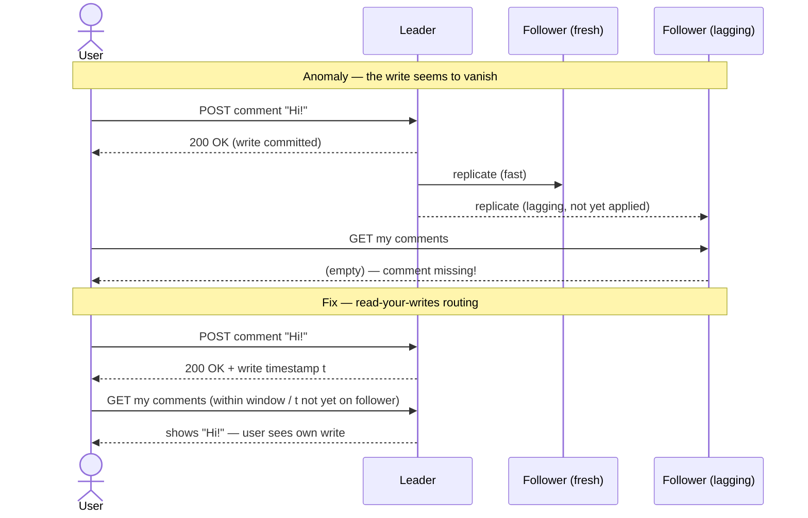

# Replication

> **Prerequisites:** [Data Models](/synapse/system-design-from-first-principles/data-foundations/data-models), [Storage Engines](/synapse/system-design-from-first-principles/data-foundations/storage-engines) | **You'll be able to:** reason from first principles about the three replication families (single-leader, multi-leader, leaderless) and the sync-vs-async trade-off at their core; name the anomalies that replication lag introduces and the read guarantees that patch each one; and design conflict handling for concurrent writes using LWW, CRDTs, and version vectors well enough to defend the choice in an interview.

## The problem (why this exists)

You have one database on one machine, and it is working fine — until the machine isn't there. A disk dies, a datacenter loses power, a kernel patch reboots the box, and suddenly your entire service is down because the only copy of the data was on the thing that just failed. So you keep a second copy on another machine. Now you have durability against a single failure, and a bonus: reads can be served from either copy, doubling your read throughput. Push the copies out to other continents and users everywhere get local-latency reads. Availability, read-scaling, low latency — replication buys all three at once (p. 197).

Here is the catch, and it is the whole subject. Copying data that never changes is trivial — you copy it once and you are done. **All the difficulty in replication lies in handling changes** (p. 197). The moment a write lands on one copy, every other copy is momentarily wrong, and you have to decide: do you make the writer *wait* until every copy agrees (safe, but slow, and a single slow copy stalls everyone)? Or do you let the write return immediately and propagate the change in the background (fast, always available, but now different copies briefly disagree, and a reader can see stale data)?

That single fork — wait or don't wait — cascades into every hard question in distributed data. It is why a user can post a comment, refresh, and watch it vanish. It is why two people editing the same wiki page can each "win." It is why a globally-distributed database cannot promise you unique usernames. The principles here have barely changed since the 1970s, because the underlying constraint — networks are slow and unreliable, machines fail independently — hasn't changed either (p. 197). This lesson builds the three canonical answers to "where do writes go," from the simplest to the most permissive, and names every simplification along the way.

<div style="border-left:4px solid #15448e;background:rgba(21,68,142,0.08);padding:0.6rem 1rem;border-radius:0 0.5rem 0.5rem 0;margin:1.25rem 0">

**Replication is not backup.** Replicas propagate every write — including the accidental `DELETE FROM users` — to all copies within seconds. A backup is a *frozen snapshot* of an earlier state you can restore from. You need both: replication for availability, backups for "undo" (p. 197).

</div>

## Intuition first

Forget databases for a moment. Imagine a shared shopping list that three flatmates keep copies of on their phones.

**The single-leader way:** one person — say, the flatmate who does the shopping — owns the master list. Anyone who wants to add "milk" texts *them*, and only they write it down. Then they broadcast the updated list to the others. There is never any confusion about what the list says, because exactly one pen touches the paper. The cost: if that person is asleep or unreachable, nobody can add anything.

**The multi-leader way:** each flatmate keeps their own writable copy and syncs with the others when convenient. Everyone can add items anytime, even offline on the bus. The cost: two of them might independently cross off "buy soap" and "we're out of soap, buy two" at the same time, and now the copies disagree about soap. Someone — or some rule — has to reconcile that.

**The leaderless way:** there is no owner at all. To add an item you text it to *most* of the group (say two of three) and consider it done. To read the list you ask *most* of the group and trust the newest-looking answer. As long as your "write to most" and "read from most" groups overlap by at least one person, whoever you ask will have heard the latest — even though no single copy is authoritative.

Every real replication system is one of these three, and the entire spectrum is about how much you're willing to trade *consistency* (everyone agrees right now) for *availability* (you can always write, even when parts are unreachable). Single-leader keeps agreement easy by funneling writes through one point. Leaderless keeps writes always-available by never depending on any one point. Multi-leader sits in between and pays for it in conflicts. Hold those three pictures; the rest is mechanism.

Here are the three families side by side — note where writes are allowed to land in each:

```d2
classes: {
  client: {style: {fill: "#f3f4f6"; stroke: "#6b7280"}}
  edge:   {style: {fill: "#dbeafe"; stroke: "#2563eb"}}
  svc:    {style: {fill: "#dcfce7"; stroke: "#16a34a"}}
  data:   {style: {fill: "#ffedd5"; stroke: "#ea580c"}}
  async:  {style: {fill: "#f3e8ff"; stroke: "#9333ea"}}
}

single: "Single-leader" {
  L: "Leader\n(all writes)" {class: svc}
  F1: "Follower" {class: data}
  F2: "Follower" {class: data}
  L -> F1: "replication log"
  L -> F2: "replication log"
}

multi: "Multi-leader" {
  A: "Leader\nregion A" {class: svc}
  B: "Leader\nregion B" {class: svc}
  C: "Leader\nregion C" {class: svc}
  A <-> B: "async"
  B <-> C: "async"
  A <-> C: "async"
}

leaderless: "Leaderless" {
  cl: "Client" {class: client}
  R1: "Replica" {class: data}
  R2: "Replica" {class: data}
  R3: "Replica" {class: data}
  cl -> R1: "w=2"
  cl -> R2: "w=2"
  cl -> R3: "(missed)" {style.stroke-dash: 4}
}
```

## How it works

### Single-leader replication

Designate one replica the **leader** (also called primary or active). Every write goes to the leader, which applies it locally and then ships the change to every **follower** (read replica, secondary, hot standby) as an ordered stream — the **replication log**. Followers apply the log in the same order the leader did. Clients may read from the leader or any follower, but writes go *only* to the leader (pp. 198–199). This is the model built into PostgreSQL, MySQL, Oracle Data Guard, and SQL Server; it is also what MongoDB and — despite its leaderless-Dynamo name — the modern DynamoDB use (pp. 199, 229). See the [PostgreSQL deep dive](/synapse/system-design-from-first-principles/data-foundations/storage-engines) context for how a single-node engine feeds this.

**Synchronous vs asynchronous — the decision that defines everything.** When the leader gets a write, does it wait for followers before telling the client "done"? In **synchronous** replication it waits for the follower's acknowledgment; the follower is then guaranteed current, so the write survives even if the leader dies the next instant. But a synchronous follower that hangs — GC pause, network blip, overload — blocks *all* writes until it recovers (pp. 200–201). In **asynchronous** replication the leader sends and immediately returns, never waiting; it keeps accepting writes even when every follower lags, but a leader that dies unrecoverably takes its unreplicated writes with it — writes the client was already told succeeded (p. 201).

Making *all* followers synchronous is impractical: any one outage halts the whole system. The usual compromise is **semisynchronous** — exactly one follower is synchronous, the rest asynchronous; if the sync follower stalls, an async one is promoted to take its place (p. 201). Most real deployments, especially with many or geographically-distant followers, run fully async and accept the durability risk, because the alternative — writes that block on the slowest replica in another continent — is worse (p. 201). This is why **asynchronous is the honest default**: it is what you actually get in production, and pretending otherwise is how teams get surprised.

**Setting up a new follower** cannot be a file copy — the data is changing underneath you, and locking the database to freeze it would destroy availability (pp. 201–202). The standard no-downtime dance: take a consistent snapshot at a known position in the replication log, copy it to the new follower, have the follower request all changes *since* that position, and let it catch up until it's streaming live (p. 202). The log position has database-specific names — PostgreSQL's log sequence number, MySQL's binlog coordinates or GTIDs (p. 202).

**Handling outages** is the point of all this. A failed *follower* is easy: on restart it reads its local log for the last transaction it processed, asks the leader for everything since, and resumes — **catch-up recovery** (p. 204). A failed *leader* is where it gets dangerous. **Failover** means promoting a follower to leader, redirecting writes, and pointing the other followers at it (p. 204). Automatic failover: detect the death (usually a timeout — e.g. 30 seconds of silence), elect the most up-to-date follower as new leader (itself a consensus problem — see [Consensus and Coordination](/synapse/system-design-from-first-principles/distributed-data/consensus-and-coordination)), and reconfigure so the old leader steps down if it returns (pp. 204–205).

Failover is a minefield. With async replication the promoted follower may be missing the old leader's last writes; the common "fix" is to *discard* them — meaning committed writes weren't durable after all (p. 205). Discarded writes can corrupt other systems: a real GitHub incident promoted a stale MySQL follower whose autoincrement counter had fallen behind, so it reused primary keys that a Redis cache still mapped to *other* users, leaking private data to the wrong accounts (p. 205). Worst is **split brain** — two nodes both believing they're leader, both accepting writes, silently diverging (pp. 205–206). Guarding against it by forcibly shutting down old leaders is called **fencing** (p. 206). And the failover timeout is a genuine dilemma: too long means slow recovery; too short means a load spike triggers a needless failover that piles more load on an already-struggling system (p. 206).

**What the replication log actually contains** decides how coupled your leader and followers are:

| Method | Coupling to storage engine | Cross-version leader/follower? | Breaks on |
| --- | --- | --- | --- |
| Statement-based | low | possible | nondeterminism (`NOW()`, `RAND()`), autoincrement order, triggers/UDFs (pp. 206–207) |
| WAL shipping | very tight (byte/block-level) | usually no — blocks zero-downtime upgrades | storage-format version mismatch (pp. 207–208) |
| Logical (row-based) | decoupled | yes — enables CDC + rolling upgrades | little; the modern default (p. 208) |

Statement-based replication ships each SQL statement to re-execute — compact, but it explodes on anything nondeterministic (p. 206). WAL shipping sends the storage engine's byte-level write-ahead log, so followers rebuild identical files — simple but so tightly coupled that leader and follower usually can't even run different database versions, blocking rolling upgrades (pp. 207–208). **Logical (row-based) log** replication describes changes at the row level — full new values for inserts, primary key plus changed columns for updates — decoupling the log from the storage format. It survives version differences and is easy for external systems to parse, which is exactly why it's the foundation of **change data capture** feeding search indexes and warehouses (p. 208).

### Multi-leader replication

Single-leader's fatal limitation: every write funnels through one node, so losing connectivity to the leader means losing the ability to write (p. 215). **Multi-leader** (active/active) lets more than one node accept writes, each also acting as a follower to the others. Synchronous multi-leader degenerates back to single-leader — a network break would block writes — so multi-leader is *always asynchronous*: any leader keeps accepting writes even when cut off from the rest (pp. 215–216).

Inside a single datacenter, multi-leader's complexity rarely pays off. Where it shines is **geo-distribution** — a leader per region (p. 216). Compared with a single leader in one region, a multi-leader setup processes each region's writes locally (no cross-ocean round-trip on the write path), keeps every region running independently during a regional outage, and tolerates the flaky inter-region link — each region just catches up when connectivity returns (pp. 216–217). This is the model behind global write-heavy systems and collaborative apps like [Google Docs](/synapse/system-design-from-first-principles/case-studies/google-docs), where each open browser tab is effectively a leader editing a local replica (pp. 220–221).

The bill for all this arrives as **write conflicts**. If two leaders concurrently update the same record — user A renames a wiki page to "B" in region 1 while user B renames it to "C" in region 2 — the async streams cross, and now the two regions disagree. Crucially, "concurrent" here does *not* mean literally simultaneous: two writes are concurrent if **neither was aware of the other** when it was made (p. 222). This is a problem single-leader simply never has, because the leader serializes everything.

Multi-leader topologies — the paths writes flow along — matter for both fault tolerance and correctness. **All-to-all** (every leader to every other) is most robust but lets messages overtake each other, so an update can arrive before the insert it depends on (a causality violation). **Circular** and **star** topologies forward writes hop-by-hop, tagging each with the node IDs it has passed so it isn't replayed forever — but a single failed node breaks the chain until reconfigured (pp. 218–219). And the deepest limitation is a consistency one: multi-leader **cannot enforce global constraints**. You cannot guarantee a unique username or a non-negative bank balance, because two leaders may each independently accept a write that is fine locally but jointly illegal (p. 217). That is not a bug to be fixed; it is a fundamental property of allowing independent writers.

### Leaderless replication

The third family abandons the leader entirely: any replica accepts writes directly from clients, and no node enforces an ordering (p. 229). Amazon's in-house **Dynamo** (2007) revived the idea, inspiring the "Dynamo-style" datastores **Cassandra**, **Riak**, and **ScyllaDB** (p. 229). (Confusingly, AWS's *DynamoDB* product is single-leader — the name is the only thing they share.)

With three replicas and one down, there is no failover because all replicas are equal. The client writes to all three in parallel and, if two acknowledge, calls the write a success — ignoring the one that missed it (pp. 229–230). When that node returns it holds stale data, so the client also *reads* from several nodes in parallel and takes the value with the newest version number, even if only one replica returned it (p. 230). Two mechanisms then heal the staleness: **read repair**, where the client writes the fresh value back to any stale replica it noticed during a read (great for frequently-read keys), and **anti-entropy**, a background process that continuously copies differences between replicas (reaches even never-read keys) (p. 230). A third, **hinted handoff**, has a reachable node temporarily store writes on behalf of an unavailable one and forward them when it recovers (p. 230).

The math that makes this work is the **quorum**. With `n` replicas, require every write to be acknowledged by `w` nodes and every read to query `r` nodes. If **`w + r > n`**, the read set and write set are guaranteed to overlap by at least one node — so at least one replica the reader contacts has the latest write (pp. 231–232). A common choice is odd `n` (3 or 5) with `w = r = (n+1)/2` rounded up: `n=3, w=2, r=2` tolerates one node down; `n=5, w=3, r=3` tolerates two (p. 232).

```d2
classes: {
  client: {style: {fill: "#f3f4f6"; stroke: "#6b7280"}}
  svc:    {style: {fill: "#dcfce7"; stroke: "#16a34a"}}
  data:   {style: {fill: "#ffedd5"; stroke: "#ea580c"}}
  async:  {style: {fill: "#f3e8ff"; stroke: "#9333ea"}}
}

title: |md
  # n = 5, w = 3, r = 3  →  w + r > n  →  read set must overlap write set
| {near: top-center}

writer: "Writer" {class: client}
reader: "Reader" {class: client}

n1: "Replica 1\nv7 (new)" {class: svc}
n2: "Replica 2\nv7 (new)" {class: svc}
n3: "Replica 3\nv7 (new)" {class: svc}
n4: "Replica 4\nv6 (stale)" {class: data}
n5: "Replica 5\nv6 (stale)" {class: data}

writer -> n1: "write"
writer -> n2: "write"
writer -> n3: "write"

reader -> n3: "read" {style.stroke: "#9333ea"}
reader -> n4: "read" {style.stroke: "#9333ea"}
reader -> n5: "read" {style.stroke: "#9333ea"}

note: "Overlap = Replica 3.\nReader sees v7 (max version wins)." {class: async}
```

The catch — and this is a favorite interview trap — is that **quorums tune the *probability* of a fresh read, not an absolute guarantee** (p. 234). Even with `w + r > n`, edge cases confound it: a **sloppy quorum** (accepting writes on any reachable node, not the value's designated `n`) breaks the overlap; concurrent rebalancing can leave read and write sets non-overlapping; a read racing a write may or may not see the new value and can even revert; and real-time-clock timestamps (used by Cassandra) can silently drop a write to a faster-clocked node (pp. 233–234). Dynamo-style stores are built for workloads that *tolerate* eventual consistency; `w` and `r` shift the odds, they don't buy linearizability (see [Linearizability and Ordering](/synapse/system-design-from-first-principles/distributed-data/linearizability-and-ordering)).

## Trade-offs

| Dimension | Single-leader | Multi-leader (async) | Leaderless |
| --- | --- | --- | --- |
| Where writes go | one leader | any of several leaders | several replicas in parallel |
| Consistency achievable | strong (linearizable/serializable) possible | much weaker; conflicts inherent | tunable via quorum; eventual |
| Enforce uniqueness / balances | yes | **no** (fundamental limit) | no |
| Write availability under partition | poor (leader unreachable → no writes) | good (each leader independent) | good (quorum of reachable nodes) |
| Failover | required, disruptive | none (regions independent) | none (all replicas equal) |
| Multi-region fit | leader region is a bottleneck | strong (leader per region) | strong (coordinator + per-region quorum) |
| Conflict resolution | not needed | LWW / manual / CRDT / OT | LWW / manual / CRDT + version vectors |

Sources: synthesized from pp. 216–217, 235–236, 243.

The through-line: as you move left to right, you trade the ability to enforce invariants and reason simply for the ability to keep writing when the network misbehaves. Single-leader gives you a database you can mostly treat like one node — until the leader dies. Leaderless never stops taking writes — but hands you the reconciliation problem. There is no free lunch; pick the corner of the [trade-off space](/synapse/system-design-from-first-principles/foundations/thinking-in-tradeoffs) your workload actually needs.

## Numbers that matter

These are the figures worth carrying into a design discussion. All are rules of thumb from DDIA, not hard guarantees — replication lag has *no* upper bound.

| Figure | Value | Context |
| --- | --- | --- |
| Follower apply latency | usually < 1 second | typical, but can stretch to minutes under load or recovery (p. 200) |
| Failover detection timeout | ~30 seconds of silence | common leader-death threshold; tuning it is a genuine dilemma (p. 204) |
| Read-your-writes window | ~1 minute after last update | read from leader for this long after a user's write (p. 211) |
| Stale-follower cutoff | > 1 minute behind | bar queries against followers lagging more than this (p. 211) |
| Sync-engine frame budget | 16 ms | one frame at 60 Hz — why local-first apps read/write locally, not over RPC (p. 221) |
| Typical quorum | `n`=3 or 5, `w`=`r`=(n+1)/2 | Dynamo-style default (p. 232) |
| Practical quorum ceiling | rarely above 4-of-7 or 5-of-9 | larger quorums wait on more (likely-slow) responses (p. 236) |

For back-of-envelope work on how many read replicas a read-heavy service needs, see [Estimation and Numbers](/synapse/system-design-from-first-principles/foundations/estimation-and-numbers) and [Latency, Throughput, Percentiles](/synapse/system-design-from-first-principles/foundations/latency-throughput-percentiles).

## In production

**Read-scaling with single-leader async followers** is the workhorse pattern behind almost every read-heavy service — a [news feed](/synapse/system-design-from-first-principles/case-studies/news-feed), a timeline, a product page. You add followers and spread reads across them, offloading the leader (p. 209). This realistically *requires* async replication — synchronous replication to every follower would let one node's failure halt all writes (p. 209). PostgreSQL and MySQL deployments do exactly this: one primary, a fleet of read replicas, application code routing reads to replicas and writes to the primary.

**Cassandra and ScyllaDB** run the leaderless quorum model in the wild. Each write carries a per-column timestamp and conflicts resolve last-write-wins; consistency is tunable per query from `ONE` to `QUORUM` to `ALL`, and multi-region writes go to a local coordinator that forwards one copy per remote region (pp. 236–237). This is the design to reach for when write throughput and always-on availability matter more than strict consistency.

**DynamoDB**, despite inheriting the Dynamo name and paper, actually uses single-leader replication over Multi-Paxos internally, exposing eventually-consistent reads (any replica) versus strongly-consistent reads (leader-routed) as a per-request choice (p. 229). It's a clean illustration that the *marketing lineage* of a database tells you little about its actual replication family — always check the mechanism.

**Collaborative and offline-first apps** (Google Docs, Figma, Linear, a calendar syncing across your phone and laptop) are multi-leader taken to the extreme: each device or browser tab is a leader with an extremely unreliable link (pp. 220–222). They lean on a **sync engine** that captures local edits, queues them, and merges incoming ones — responding within the 16 ms frame budget because reads and writes hit the *local* replica, never a server round-trip (pp. 221–222). This is where CRDTs and operational transformation earn their keep (below).

## Pitfalls & interview traps

Replication lag isn't a nuisance — it produces three specific, nameable anomalies, and each has a specific fix. This is the single most reliable place an interviewer probes.

**Reading your own writes.** You post a comment, the write commits on the leader, but your immediate re-read hits a follower that hasn't caught up — and your comment is gone. Terrifying UX. The fix is **read-your-writes (read-after-write) consistency**: guarantee a user always sees their *own* updates (it says nothing about others'). Read a user's own editable data from the leader; or read from the leader for ~1 minute after their last write; or have the client remember its last write's timestamp and only accept a replica that has caught up to it (pp. 210–211).



**Time moving backward.** Your first read hits a fresh follower and shows a comment; your next read hits a laggier follower and the comment is gone again — as if time reversed. The fix is **monotonic reads**: route each user's reads to the *same* replica (chosen by a hash of the user ID, not at random), so their view never rewinds (pp. 212–213).

**Causality violation.** On a sharded database with no global ordering, an observer can see an *answer* before the *question* it responds to, because the two live on different shards that replicate at different speeds. The fix is **consistent prefix reads**: guarantee writes are seen in the order they happened, by keeping causally-related writes on one shard or tracking dependencies explicitly (pp. 213–214). This connects directly to [Sharding and Consistent Hashing](/synapse/system-design-from-first-principles/distributed-data/sharding-and-consistent-hashing).

<div style="border-left:4px solid #da5233;background:rgba(218,82,51,0.08);padding:0.6rem 1rem;border-radius:0 0.5rem 0.5rem 0;margin:1.25rem 0">

⚠️ **The LWW trap.** "We'll just resolve conflicts last-write-wins" sounds safe and is the default in Cassandra. But the real meaning of LWW is that *when two writes are concurrent, one is randomly chosen as the winner and the other is silently discarded* (p. 224). With real-time-clock timestamps it's worse: a node with a fast clock can make a genuinely-later write lose to an earlier one (pp. 224–225). LWW is safe only when keys are written once and never updated. If an interviewer proposes LWW for anything mutable, name the silent data loss.

</div>

**Resolving concurrent writes properly.** When you can't avoid conflicts (multi-leader, leaderless), the honest options are: keep all conflicting values as **siblings** and let the app merge them (CouchDB — but Amazon's cart famously merged by set-union, resurrecting deleted items, p. 225); or use a **CRDT** (conflict-free replicated datatype) or **operational transformation (OT)**, which auto-merge concurrent edits so every replica converges to the same state regardless of arrival order — *strong eventual consistency* (pp. 226–228). To *detect* concurrency correctly in the first place, you need the **happens-before** relation: A happens before B if B builds on A; if neither knows of the other, they're concurrent (p. 238). A single version number captures this on one replica, but with multiple writable replicas you need a **version vector** — one version number per replica per key — which lets the database distinguish a genuine overwrite from a concurrent conflict, and makes it safe to read from one replica and write back to another (pp. 242). Reaching for version vectors in a leaderless-store design signals real depth.

## Check yourself

```quiz
{"prompt": "A team runs single-leader PostgreSQL with async read replicas. Users complain that right after posting a comment, refreshing sometimes shows the comment missing. Which guarantee fixes THIS specific complaint?", "options": ["Monotonic reads", "Read-your-writes consistency", "Consistent prefix reads", "Synchronous replication to all followers"], "answer": "Read-your-writes consistency"}
```

```quiz
{"prompt": "A leaderless store has n = 5 replicas. The team wants reads to stay available even when 2 nodes are down, while still guaranteeing a read overlaps the latest write. Which (w, r) works?", "options": ["w = 2, r = 2", "w = 3, r = 3", "w = 5, r = 1", "w = 1, r = 1"], "answer": "w = 3, r = 3"}
```

```quiz
{"prompt": "Why is multi-leader replication treated as always asynchronous in practice?", "options": ["Synchronous multi-leader is impossible to implement", "Synchronous multi-leader degenerates to single-leader — a network break between leaders would block writes, defeating the point", "Asynchronous replication guarantees stronger consistency", "Followers cannot apply logs synchronously"], "answer": "Synchronous multi-leader degenerates to single-leader — a network break between leaders would block writes, defeating the point"}
```

```quiz
{"prompt": "An interviewer proposes last-write-wins to resolve concurrent writes on a mutable counter in a multi-leader system. What is the strongest objection?", "options": ["LWW is slower than CRDTs", "LWW silently discards all but one concurrent write, losing increments; clock skew can even pick the earlier write as winner", "LWW requires a leader, which multi-leader lacks", "LWW cannot store timestamps"], "answer": "LWW silently discards all but one concurrent write, losing increments; clock skew can even pick the earlier write as winner"}
```

<details>
<summary>Why is asynchronous replication called "the honest default," and what exactly does it forfeit?</summary>

Because it is what production systems overwhelmingly use — synchronous replication to all followers is impractical (one slow follower halts every write), and even semisynchronous keeps only one follower current. Async lets the leader keep accepting writes regardless of follower lag, which is what you need at scale and across regions. What it forfeits: **durability of the most recent writes on leader failure** (unreplicated writes are lost, and failover often *discards* them — so a "committed" write wasn't durable) and **freshness of follower reads** (they can be arbitrarily stale, producing the read-your-writes / monotonic / consistent-prefix anomalies). The dishonest move is to run async but reason as though it were synchronous; the honest move is to name the lag and design guarantees around it (pp. 201, 205, 209–214).

</details>

<details>
<summary>You need globally-unique usernames. Can a multi-leader geo-distributed database enforce that constraint? Why or why not?</summary>

No. Uniqueness is a global invariant, and multi-leader lets two regions independently accept writes that are each locally valid but jointly illegal — both regions register "alice" at the same time, neither aware of the other, and the async streams later collide. This isn't a tuning problem; it's a fundamental limitation of allowing independent writers (p. 217). To enforce it you must serialize the check through a single point (single-leader for that data, or route all username registrations to one designated leader) or accept eventual detection-and-repair (flag the collision after the fact and force one user to rename). The interview-grade answer names the fundamental limit rather than hand-waving a merge.

</details>

## Sources

- DDIA2 ch. 6 pp. 197–199 (motivations for replication; single-leader model; backup vs replication)
- DDIA2 ch. 6 pp. 200–202 (synchronous vs asynchronous; semisynchronous; setting up new followers)
- DDIA2 ch. 6 pp. 203–206 (handling node outages; catch-up recovery; failover hazards — lost writes, GitHub incident, split brain, fencing, timeout tuning)
- DDIA2 ch. 6 pp. 206–208 (replication-log implementations — statement-based, WAL shipping, logical/row-based, CDC)
- DDIA2 ch. 6 pp. 209–214 (replication lag; eventual consistency; read-your-writes, monotonic reads, consistent prefix reads)
- DDIA2 ch. 6 pp. 215–222 (multi-leader; geo-distribution; topologies; sync engines / local-first; concurrent writes)
- DDIA2 ch. 6 pp. 222–228 (conflict resolution — LWW, siblings, CRDTs, OT, strong eventual consistency)
- DDIA2 ch. 6 pp. 229–237 (leaderless; quorums w+r>n; read repair, hinted handoff, anti-entropy; sloppy quorums; multi-region)
- DDIA2 ch. 6 pp. 238–242 (happens-before; detecting concurrent writes; version vectors)

Figures redrawn as original D2/Mermaid from the digest's figure inventory (Fig 6-1, 6-3, 6-13). All numeric figures are DDIA rules of thumb (p. cited); replication lag has no guaranteed upper bound.
