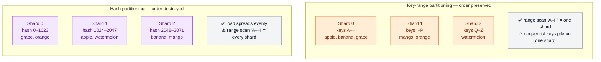
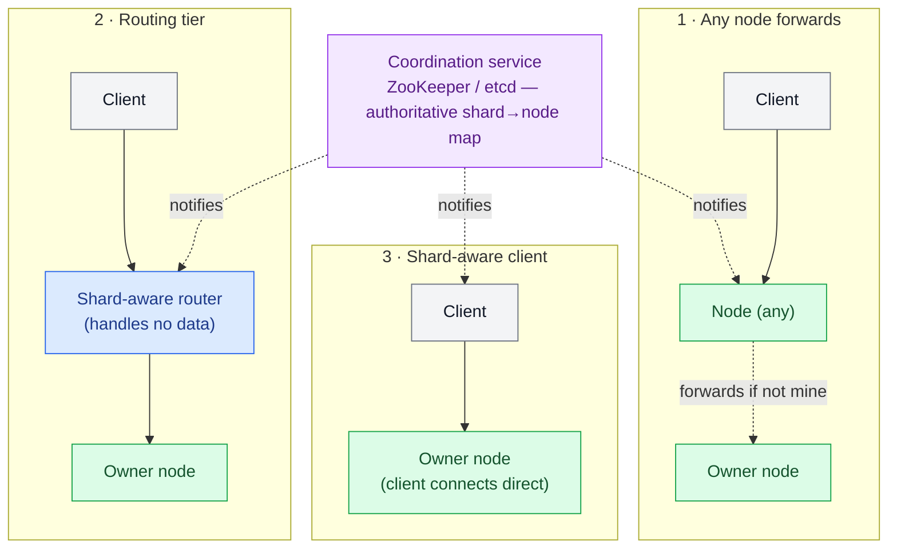

# Sharding & Consistent Hashing

> **Prerequisites:** [Replication](/synapse/system-design-from-first-principles/distributed-data/replication), [Storage Engines](/synapse/system-design-from-first-principles/data-foundations/storage-engines) | **You'll be able to:** explain from first principles why a dataset gets split across machines and how sharding differs from replication; choose between key-range and hash partitioning and defend the trade-off; derive consistent hashing from the failure of `hash(key) % N`, including virtual nodes; and reason about hot keys, rebalancing, request routing, and secondary indexes well enough to hold a senior-level interview.

## The problem (why this exists)

You have followed every trick in the book. You added [read replicas](/synapse/system-design-from-first-principles/distributed-data/replication) so reads fan out across copies. You put a cache in front. You bought a bigger machine, then a bigger one. And still, one of two walls is coming.

The first wall is **size**. A single node has a finite disk. When your dataset genuinely exceeds what one machine can hold — Amazon Aurora, for example, tops out around 256 TB per instance — no amount of replication saves you, because replication makes *copies* of the same data; every replica still has to hold the whole thing. Ten replicas of a 300 TB dataset is not 3 PB of capacity. It is 300 TB, stored ten times.

The second wall is **write throughput**. Replication scales *reads* beautifully — add followers, spread the read load — but every write still has to be applied by the leader, and eventually by every follower. If a single leader cannot keep up with the incoming write rate, more followers do nothing but add more machines that also cannot keep up. Read scaling has no answer for a write bottleneck (p. 253).

When you hit either wall, exactly one move is left: stop putting all the data on one machine. Split the dataset into pieces — **shards** — and give each to a different node, so ten nodes hold ten times the data and absorb ten times the writes of one (p. 255). That is sharding: the heavyweight tool of last resort, and this lesson is about doing it without shooting yourself in the foot.

<div style="border-left:4px solid #15448e;background:rgba(21,68,142,0.08);padding:0.6rem 1rem;border-radius:0 0.5rem 0.5rem 0;margin:1.25rem 0">

**Definition.** A **shard** (also called a *partition*) is a subset of the data such that every record belongs to exactly one shard. Each shard is effectively a small database of its own. The word varies by system — Kafka calls it a *partition*, HBase and TiDB a *region*, Cassandra a *token-range*, Bigtable a *tablet*, Riak a *vnode* — but the idea is identical (p. 252).

</div>

## Intuition first

Forget databases for a moment. Think about a print encyclopedia.

A single volume can only hold so many pages, so the publisher splits the work across many volumes. The obvious way is **by key range**: volume 1 holds titles A–B, volume 2 holds C–D, and so on. To find "Jupiter" you reach for the J volume directly — no scanning the whole set. And because each volume is internally alphabetized, you can pull *all* the J entries in one sweep. That is the great gift of key-range splitting: things that sort near each other live near each other, so range scans are cheap.

But the ranges are not evenly sized. Far more English words start with S than X, so a naive split gives one skinny volume and one bloated one. Worse, imagine the volumes take *live edits* and every new entry this month starts with the same letter — key by timestamp and every write right now lands in the "2026-July" volume. One volume is white-hot while the rest idle. Splitting by range groups related things together, which is exactly why related writes pile onto the same shard.

The other approach throws adjacency away on purpose. Run every title through a **hash function** — a meat grinder that turns "Jupiter" into a seemingly random number. Now assign each volume a range of *hash values* instead of a range of *titles*. Similar titles scatter to different volumes; load spreads out beautifully. The price: you destroyed ordering. "All titles J–K" is no longer one volume — it is smeared across all of them, so range scans are gone.

That is the central tension of this entire lesson, and it never goes away:

> **Key-range partitioning keeps order (range scans work) but risks hot spots. Hash partitioning kills hot spots but destroys order.** Almost every real system's partitioning story is a variation on managing this one trade.

Two more intuitions before the machinery. First: **sharding and replication are orthogonal, and you almost always use both.** Sharding decides *which* node owns a record; replication decides *how many copies* of that record's shard exist for fault tolerance. A record belongs to one shard, but that shard is copied across several nodes — one leader, some followers — and a single node typically holds a mix: leader for some shards, follower for others (p. 251). Sharding is about capacity; replication is about survival. They compose.

Second, the villain of the piece: **skew.** The point of sharding is that N nodes do N times the work. If the split is uneven — one shard holds far more data, or serves far more queries, than the others — you have **skew**, and in the extreme all load lands on one shard while the others idle (pp. 255–256). A shard with disproportionate load is a **hot shard**; a single overloaded key (a celebrity's user ID) is a **hot key** (p. 256). Fighting skew is most of the job.

## How it works

### Sharding by key range

Assign each shard a contiguous range of partition keys, min to max — exactly the encyclopedia volumes (p. 256). To route a key, find the shard whose range contains it. Because ranges adapt to the data, boundaries need not be evenly spaced. An administrator can set them manually (Vitess), or the system can manage them automatically (HBase, MongoDB's range mode, CockroachDB) (p. 257).

Within each shard, keys are stored **sorted** — in a B-tree or in SSTables (see [Storage Engines](/synapse/system-design-from-first-principles/data-foundations/storage-engines)). That is what makes range scans efficient, and it lets you use a **compound key as a concatenated index**: shard by `sensor_id`, sort within the shard by timestamp, and "all readings from sensor 5 in July" is one tight scan (p. 257).

The failure mode is the timestamp trap. If your partition key *is* the timestamp, every write happening right now targets the single "current" shard while every other shard idles — a textbook hot shard (p. 257). The fix is to put something else first in the key: prefix the timestamp with a sensor ID so writes spread across sensors, at the cost of a separate range scan per sensor for a multi-sensor time query (p. 257). You bought write-spread by giving up some read-locality — the trade in miniature.

Key-range systems rebalance by **splitting**: when a shard gets too big (HBase splits at a 10 GB default) or too hot, it divides into two sub-ranges that can move to different nodes; if data is deleted, adjacent small shards **merge** (pp. 257–258). Splitting is expensive — it rewrites all the shard's data into new files, much like a compaction — and the shard being split is often already under load, so the split can make a bad moment worse (p. 258).

### Sharding by hash of key

If you do not care about key adjacency — tenant IDs, user IDs — hash the partition key first (p. 258). A good hash function maps even highly skewed inputs to a uniform spread: a 32-bit hash sends any string to a seemingly random number in 0…2³²−1, always giving the same output for the same input (p. 258). It need not be cryptographic — MongoDB uses MD5, Cassandra and ScyllaDB use Murmur3 (p. 258). One trap: do **not** use a language's built-in object hash (Java's `Object.hashCode()`) — it can return different values in different processes for the same key, scattering a key's own data across shards (p. 258).

Here is the two families side by side — the same six keys, partitioned two ways:



Now the crucial question: once you have a hash, how do you map it to a shard? The naive answer is where everything goes wrong.

### Why `hash(key) % N` is a trap

The obvious mapping is `node = hash(key) % N`, where N is the number of nodes. It is trivial to compute and it distributes evenly. It has one catastrophic property: **when N changes, almost every key moves.**

Walk the arithmetic. With 3 nodes, a key whose hash is 7 lives on node `7 % 3 = 1`. Add a fourth node so N becomes 4, and the same key now belongs on `7 % 4 = 3`. It has to move. Do this for every key and changing the modulus reshuffles the *entire* dataset — a key stays put only by luck (pp. 258–259). Since adding a node is supposed to be routine, a scheme that copies almost all your data across the network every time you scale is unusable (p. 259). The rest of this section exists to avoid `mod N`.

### Fixed number of shards

The simplest fix that actually works: **create many more shards than nodes, and never change the shard count.** Make 1,000 shards on a 10-node cluster (100 shards per node). A key lives in shard `hash(key) % 1000` — and 1000 never changes, so that mapping is stable forever. What changes is only the *shard→node assignment*, tracked separately (p. 259).

Now adding an 11th node just means: reassign roughly 90 whole shards from the existing nodes onto the new one until things are even again (p. 259). Only entire shards move, the key→shard math is untouched, and while a shard is mid-transfer the old node keeps serving it (p. 260). This is used by Citus, Riak, Elasticsearch, and Couchbase (p. 260).

The catch is picking the count up front. Each shard holds a fixed fraction of the data, so shards grow with the dataset; too few and each becomes unwieldy, too many and you pay per-shard overhead (pp. 260–261). You can never have more nodes than shards. If your guess is wrong, you face an expensive **resharding** — splitting every shard and rewriting it, sometimes with downtime (p. 260). Choose a count with many divisors (not a power of 2) so it splits evenly across many possible node counts (p. 260).

### Consistent hashing, from first principles

Fixed-shard-count works but forces a hard up-front guess. **Consistent hashing** is the family of algorithms that lets the number of shards *change* while still moving as few keys as possible. Formally it guarantees two properties: (1) roughly equal keys per shard, and (2) when the number of shards changes, the minimum possible number of keys move (p. 263).

<div style="border-left:4px solid #15448e;background:rgba(21,68,142,0.08);padding:0.6rem 1rem;border-radius:0 0.5rem 0.5rem 0;margin:1.25rem 0">

**Naming warning.** "Consistent" here has *nothing* to do with replica consistency or ACID consistency. It describes the tendency of a key to *stay in the same shard* when the cluster changes — a completely different use of the word (p. 263).

</div>

The classic construction is **the ring.** Imagine the entire hash output space — 0 to 2³²−1 — bent into a circle, so the largest value wraps around to 0. Hash each *node* to a position on this ring. Then hash each *key* to a position too, and assign the key to the **first node you reach walking clockwise** from the key's position. That is the whole rule.

Why does this move so little data? Adding a node drops one new point onto the ring. It steals only the keys in the arc between it and the previous node clockwise — the ones that now reach the newcomer first. Every other key still walks to the same node it always did. **Only the neighbours are affected; the rest of the cluster never notices.** Remove a node and its keys spill forward to the next node clockwise, and nobody else moves (p. 263).

There is one problem the naive ring has, and its fix is essential. With only a handful of node points on the ring, the arcs are wildly uneven — one node might own a huge sweep of the circle and another a sliver, so load is lumpy. Worse, when a node dies, *all* its keys dump onto its single clockwise neighbour, doubling that one node's load. The fix is **virtual nodes**: instead of placing each physical node once, hash it to many positions — dozens or hundreds of points scattered around the ring. Each physical node is now a cloud of small arcs spread all over the circle. The arcs average out, so load is even; and when a physical node dies, its many small arcs are inherited by many *different* neighbours, spreading the recovered load across the whole cluster instead of dumping it on one victim (this is exactly Cassandra's "vnodes").

```d2
direction: right
classes: {
  client: {style: {fill: "#f3f4f6"; stroke: "#6b7280"}}
  svc:    {style: {fill: "#dcfce7"; stroke: "#16a34a"}}
  data:   {style: {fill: "#ffedd5"; stroke: "#ea580c"}}
  async:  {style: {fill: "#f3e8ff"; stroke: "#9333ea"}}
}

title: |md
  # Consistent-hash ring with virtual nodes
  Each physical node hashes to MANY points. A key walks clockwise to the first vnode.
| {near: top-center}

ring: "Hash ring  (0 → 2³²−1, wraps at top)" {
  A1: "A#1\npos 40" {class: svc}
  B1: "B#1\npos 95" {class: data}
  C1: "C#1\npos 150" {class: async}
  A2: "A#2\npos 200" {class: svc}
  B2: "B#2\npos 260" {class: data}
  C2: "C#2\npos 310" {class: async}

  A1 -> B1 -> C1 -> A2 -> B2 -> C2 -> A1: "clockwise" {style.stroke-dash: 3}
}

key: "key = 'user:8123'\nhash → pos 118" {class: client}
key -> ring.C1: "walk clockwise →\nfirst vnode is C#1\n(owned by node C)" {style.stroke: "#16a34a"}

legend: |md
  **A#1, A#2** = two virtual nodes of ONE physical node A.
  Add node D → it drops new points on the ring and steals
  only the small arcs just behind each of its points.
  Nothing else moves.
| {class: client}
```

Cassandra and ScyllaDB use a *variant* — they split the hash space into ranges proportional to node count (16 and 256 per node respectively), resembling the original consistent-hashing definition. Other variants — **rendezvous hashing** (highest random weight) and **jump consistent hashing** — assign a new node individual keys scattered from all others rather than splitting contiguous ranges (pp. 262–263).

### Try it — consistent hashing vs `mod N`

A short simulation of the core claim: consistent hashing moves far fewer keys than `mod N` when a node joins. It hashes 100,000 keys, then adds one node under each scheme and counts how many keys changed owner.

```python run
import hashlib, bisect

def h(s):
    return int(hashlib.md5(s.encode()).hexdigest(), 16)

keys = [f"user:{i}" for i in range(100_000)]

# --- Scheme 1: hash % N ---
def mod_owner(key, n):
    return h(key) % n

moved_mod = sum(mod_owner(k, 3) != mod_owner(k, 4) for k in keys)

# --- Scheme 2: consistent-hash ring with virtual nodes ---
VN = 150  # virtual nodes per physical node
def build_ring(nodes):
    ring = []
    for node in nodes:
        for v in range(VN):
            ring.append((h(f"{node}#{v}"), node))
    ring.sort()
    return ring

def ring_owner(key, ring):
    positions = [p for p, _ in ring]
    i = bisect.bisect(positions, h(key)) % len(ring)
    return ring[i][1]

ring3 = build_ring(["A", "B", "C"])
ring4 = build_ring(["A", "B", "C", "D"])
moved_ring = sum(ring_owner(k, ring3) != ring_owner(k, ring4) for k in keys)

n = len(keys)
print(f"Adding a 4th node to 3, over {n:,} keys:")
print(f"  hash % N            moved {moved_mod:>7,}  ({moved_mod/n:6.1%})")
print(f"  consistent hashing  moved {moved_ring:>7,}  ({moved_ring/n:6.1%})")
print(f"  ratio: mod N moves {moved_mod/max(moved_ring,1):.1f}x more keys")
```

Expect `mod N` to move roughly 3 out of 4 keys, while the ring moves only about a quarter — close to the theoretical ideal of `1/new_N`. Change `VN` to `1` and watch the ring's balance get lumpy: that is *why* virtual nodes exist.

### Skew and hot keys — where even hashing fails

Here is the humbling limit. Consistent hashing spreads *keys* uniformly — but not *load* (p. 263). Hash `celebrity_42` and it lands on exactly one shard. If that celebrity has ten million followers all hitting that one key, that shard melts while the perfect hash distribution looks on, helpless (p. 263). A uniform spread of keys does nothing when traffic concentrates on a single key.

Mitigations, in order of reach:

- **Isolate the hot key.** A range-based scheme can put a single hot key on its own dedicated shard, even its own machine (p. 264).
- **Key salting.** Append a random suffix to the hot key — two random digits turn `celebrity_42` into `celebrity_42_00` … `celebrity_42_99`, splitting its writes across 100 keys that hash to different shards (p. 264). The cost is real: every *read* must now query all 100 salted keys and combine them, and you need bookkeeping to remember which keys are split. So salt only the few genuinely hot keys, not everything (p. 264). And note salting splits *write* load; read volume per shard is a different problem.
- **Adaptive capacity.** Some managed systems detect and rebalance hot shards automatically — Amazon calls this "heat management" or "adaptive capacity" (p. 264).

Skew is also temporal: a viral post is white-hot for two days then cools, and some keys are hot for writes while others are hot for reads — so the right mitigation shifts over the key's lifetime (p. 264).

### Rebalancing: automatic vs manual

**Rebalancing** is moving load between nodes as the cluster changes; the rule for all good schemes is *do not use `mod N`* — move as little as possible. Fixed-shard-count moves whole shards; hash-range and consistent-hashing schemes split on demand (pp. 259–263).

The subtler choice is *who pulls the trigger*. Fully **automatic** rebalancing is convenient and can autoscale — DynamoDB adds and removes shards within minutes (p. 265). But automation is dangerous with automatic failure detection: an overloaded, slow node can be *mistaken for dead*, triggering a rebalance that moves its load onto already-busy neighbours, which then also slow down and get declared dead — a **cascading failure** (p. 265). Hence many systems keep a human in the loop, who can also *preemptively* rebalance ahead of a known surge like Cyber Monday (p. 265). Couchbase and Riak split the difference — the system suggests an assignment, an administrator commits it (p. 264).

### Request routing

One question remains: a client has a key to read — *which node holds it?* This is **request routing**, and unlike a stateless service behind a load balancer, only a node that is a replica for that key's shard can serve it (p. 265). There are three shapes (p. 266):



All three need the same fact — the current shard→node map — and something must own it authoritatively. A single coordinator is simplest but must be fault-tolerant and avoid **split-brain** (two coordinators handing out contradictory maps). So many systems delegate to a consensus-backed coordination service: **ZooKeeper** or **etcd**, which holds the map and notifies routers and clients on change (p. 267). HBase and SolrCloud use ZooKeeper; Kubernetes uses etcd; MongoDB uses config servers plus `mongos` routers; Kafka, YugabyteDB, and TiDB use built-in Raft (p. 267). Riak deliberately uses a weaker gossip protocol, tolerating occasional disagreement because its leaderless model already makes weak guarantees (p. 267). See [Consensus & Coordination](/synapse/system-design-from-first-principles/distributed-data/consensus-and-coordination).

### Secondary indexes

Everything so far assumes you look records up by partition key. But real queries also ask "all red cars," "all articles containing *hogwash*" — **secondary indexes**, which search for a value rather than identify one record. They do not map cleanly onto shards, forcing a choice (p. 268):

**Local (document-partitioned) index.** Each shard indexes only its *own* records. A write touches just one shard — cheap and naturally consistent (p. 268). But "all red cars" doesn't know which shards hold matches, so it must **scatter/gather**: query every shard and combine (p. 269). That is prone to **tail-latency amplification** — as fast as the slowest shard — and doesn't scale, since every shard processes every query (pp. 269–270). Used by MongoDB, Cassandra, Elasticsearch, Riak (p. 270).

**Global (term-partitioned) index.** The index itself is sharded, but by the *indexed value* rather than the record's key — colors a–r on index-shard 0, s–z on index-shard 1 (p. 270). Now "red cars" reads a single index shard for the postings list — fast reads (p. 271). The cost lands on writes: one record carries many indexed terms, each possibly on a different index shard, so a single write may update several — hard to keep in sync, often done asynchronously, which is why DynamoDB's global-index reads can be **stale** (p. 271). Used by CockroachDB, TiDB, YugabyteDB, and DynamoDB (p. 271).

The pattern is a mirror: local indexes make writes cheap and reads expensive; global indexes make reads cheap and writes expensive. Exactly the read/write tension from [Storage Engines](/synapse/system-design-from-first-principles/data-foundations/storage-engines), one level up.

## Trade-offs

| Decision | Option A | Gives you | Costs you | Use when |
| --- | --- | --- | --- | --- |
| Partition scheme | **Key-range** | Efficient range scans; concatenated-key locality | Hot-spot risk on sequential keys (timestamps) | You query by ranges (time series, sorted scans) |
| Partition scheme | **Hash-of-key** | Even load distribution | Range scans scatter across all shards | Access is by exact key (user/tenant IDs) |
| Hash→shard mapping | **`hash % N`** | Trivial to compute | Changing N reshuffles nearly everything | Never, for a cluster that grows |
| Hash→shard mapping | **Fixed shard count** | Only shard→node assignment moves | Count is a hard up-front guess; nodes ≤ shards | Dataset size is roughly predictable |
| Hash→shard mapping | **Consistent hashing** | Shard count adapts; minimal key movement | More moving parts; still needs vnodes for balance | Cluster size changes often; DHTs, caches |
| Rebalancing trigger | **Automatic** | Less ops toil; autoscales | Can cascade-fail with false death detection | Load swings are large and frequent |
| Rebalancing trigger | **Manual** | Human prevents surprises; preemptive | Slower to react | Stakes are high; surges are predictable |
| Secondary index | **Local** | Cheap writes; consistent | Scatter/gather reads, tail-latency amplification | Writes dominate; queries often know the key |
| Secondary index | **Global** | Cheap single-condition reads | Expensive multi-shard writes; may be stale | Reads dominate; write rate is modest |

## Numbers that matter

Numbers worth carrying into an interview (see [Estimation & Numbers](/synapse/system-design-from-first-principles/foundations/estimation-and-numbers) for the full kit):

- **When to even consider sharding.** A single well-provisioned node handles a lot — roughly up to 50 TiB and 10–20k writes/sec before sharding is justified. Below that it is usually premature: 500M users × 5 KB ≈ 2.5 TB fits comfortably on one node, so you'd shard for the *write rate*, not the size.
- **The N-node ideal.** The goal is linear: 10 nodes → 10× the data and 10× the read/write throughput of one, ignoring replication (p. 255). Skew is any deviation from this line.
- **Hash width.** A 32-bit hash gives 0…2³²−1 (~4.3 billion ring positions); a 16-bit example gives 0…65,535 (p. 258).
- **Fixed shard count.** 1,000 shards over 10 nodes = 100 shards/node (p. 259); add a node → ~90 shards migrate.
- **Split thresholds.** HBase auto-splits a key-range shard at a **10 GB** default (p. 258).
- **Virtual nodes.** Cassandra defaults to **16** vnodes per node, ScyllaDB to **256** (pp. 262–263) — more vnodes, smoother balance.
- **Salting fan-out.** Two random digits split one hot key's *writes* across **100** keys — but multiply its *reads* by 100 too (p. 264).

## In production

**Cassandra / ScyllaDB** are the reference implementation of ring-based partitioning. Data is hashed with Murmur3 onto a token ring; each node owns many vnodes (16 / 256 by default). Adding a node is a routine operation — it claims tokens around the ring and streams in only the ranges it now owns, no full reshuffle. This is consistent hashing made operational, and why these stores scale out so smoothly (pp. 258, 262–263).

**DynamoDB** hides all of this. You never see a ring; you pick a partition key and DynamoDB internally hash-partitions, splitting and merging shards automatically ("adaptive capacity") to chase load, reportedly within minutes (pp. 262, 265). Its global secondary indexes are term-partitioned and updated *asynchronously*, so a GSI read can lag the base table — a documented staleness you must design around (p. 271).

**MongoDB** offers both range and hash sharding. A **balancer** moves chunks between shards to even things out, `mongos` daemons form the routing tier, and config servers hold the authoritative map — a textbook "routing tier + coordination service" deployment (p. 267).

**Kafka** shards a topic into partitions; the partition is the unit of parallelism and ordering. Choosing a partition key that spreads producers evenly — while keeping each entity's events on one partition for ordering — is the key-range-vs-hash trade in a streaming skin.

The recurring production lesson: **shard late, and shard on a key you have stress-tested for skew.** The classic incident is not "we ran out of capacity" but "one hot key — a celebrity, a viral post, a default `null` foreign key — melted one shard while the cluster sat 90% idle." The distribution of your *load*, not your data, is what decides whether sharding works.

### Hands-on: run the ring

A runnable **consistent-hash ring** lives at `proof-of-concepts/03-distributed-data/02-sharding-and-consistent-hashing/` in the repo root — pure Python, standard library only: a `ConsistentHashRing` (SHA-256 positions, virtual nodes, clockwise lookup) and a `SimulatedCluster` that mimics N machines as N in-process key/value stores (the README spells out what is simulated versus what is exactly-as-production).

```bash
cd proof-of-concepts/03-distributed-data/02-sharding-and-consistent-hashing
./run            # movement + balance numbers over 100k keys
./run test       # mypy --strict + unit tests + demo
```

The demo puts numbers on this whole lesson: naive `hash % N` relocates ~80% of keys when the cluster grows 4→5, while the ring moves only ~19% — within a hair of the theoretical `1/5`. Remove a node and *only that node's* keys move. Then it sweeps `vnodes = 1 → 10 → 200` and prints the load spread collapsing from ~4.8× to ~1.2×, making concrete why virtual nodes are not optional.

## Pitfalls & interview traps

<div style="border-left:4px solid #da5233;background:rgba(218,82,51,0.08);padding:0.6rem 1rem;border-radius:0 0.5rem 0.5rem 0;margin:1.25rem 0">

⚠️ **The two traps that sink candidates.** First, *`hash(key) % N`*: it looks clean on a whiteboard, but the instant the interviewer says "now add a node," you must recognize that it reshuffles nearly the entire dataset — reach for consistent hashing or a fixed shard count instead. Second, *"just hash the key and load is even"*: hashing distributes **keys** evenly, never **load**. A single celebrity key defeats a perfect hash. If you propose hash sharding, immediately name the hot-key problem and a mitigation (salting, dedicated shard) before the interviewer asks.

</div>

More traps:

- **Premature sharding.** Sharding adds cross-shard-query pain, cross-shard-transaction pain, and operational weight. If one node fits the load, *do not shard* — it is a heavyweight tool for large scale only (p. 253). Show the capacity math that forces your hand.
- **Choosing the partition key carelessly.** The whole design hinges on this one choice, and it is hard to change later. Shard by low-cardinality or skewed keys (country, status, a timestamp) and you manufacture hot shards. Interviewers probe this directly: "what's your shard key, and what's its skew?"
- **Forgetting cross-shard operations.** A query or transaction spanning shards needs scatter/gather or a slow distributed transaction. Sharding by `user_id` makes per-user queries fast but "top 10 posts globally" a fan-out — see [Distributed Transactions](/synapse/system-design-from-first-principles/distributed-data/distributed-transactions).
- **Confusing sharding with replication.** They are orthogonal. Replication is copies for fault tolerance; sharding is splits for capacity. "We'll add replicas" is not an answer to a write-throughput wall.
- **Ignoring rebalancing safety.** Fully automatic rebalancing plus automatic failure detection can cascade-fail (p. 265). At senior level, mention the human-in-the-loop safeguard.

## Check yourself

```quiz
{"prompt": "A cluster uses hash(key) % N with N = 4 nodes. You add a fifth node, making N = 5. Roughly what fraction of keys must move to a different node?", "options": ["About 1/5 — only the new node's share", "About 4/5 — nearly all of them", "None — hashing is stable", "Exactly 1/2"], "answer": "About 4/5 — nearly all of them"}
```

```quiz
{"prompt": "You shard a time-series database by using the raw event timestamp as the partition key. Under load, what happens?", "options": ["Load spreads evenly because timestamps are unique", "One shard (the current time window) is hot while others idle", "Range queries over time become impossible", "Every write fails until you add a hash"], "answer": "One shard (the current time window) is hot while others idle"}
```

```quiz
{"prompt": "A consistent-hash ring holds nodes A, B, C, each with many virtual nodes. You add node D. Which keys move?", "options": ["Every key is rehashed and may move", "Only keys in the arcs immediately behind D's virtual-node points", "All of A's keys, since D is inserted first alphabetically", "Half of every node's keys"], "answer": "Only keys in the arcs immediately behind D's virtual-node points"}
```

```quiz
{"prompt": "Your hash sharding spreads keys perfectly evenly, yet one shard is at 100% CPU while others are near idle. Most likely cause?", "options": ["The hash function is broken", "A single hot key receives a huge share of the traffic", "You have too many shards", "Replication lag on that shard"], "answer": "A single hot key receives a huge share of the traffic"}
```

<details>
<summary>Why are virtual nodes necessary — isn't hashing each node once onto the ring enough?</summary>

Two reasons. **Balance:** with only a few points on the ring, the arcs between them are wildly uneven, so some nodes own far more of the key space than others. Many virtual points per node average the arcs out. **Graceful failure:** if each node sits at one point and a node dies, *all* its keys dump onto its single clockwise neighbour, doubling that neighbour's load. With virtual nodes, a dead node's many small arcs are inherited by many *different* neighbours, spreading the recovered load across the whole cluster.

</details>

<details>
<summary>Consistent hashing distributes keys evenly. Why doesn't that solve the celebrity/hot-key problem?</summary>

Because it distributes *keys*, not *load*. A celebrity is a single key; it hashes to exactly one position and lands on exactly one shard. If ten million requests hit that one key, they all hit that one shard — the even distribution of the *other* keys is irrelevant. Hashing solves data skew, not request skew. You need a different tool: isolate the key on a dedicated shard, or salt it to split its writes across many keys (at the cost of fan-out reads).

</details>

<details>
<summary>When would you deliberately choose key-range partitioning despite the hot-spot risk?</summary>

When range scans are core to the workload and you can neutralize the hot spot. Time-series and event logs are the classic case: you want "all readings for sensor 5 in July" to be one efficient scan, which hash partitioning cannot give you. You defuse the timestamp hot spot by making the timestamp the *second* part of a compound key (e.g. `sensor_id, timestamp`), so writes spread across sensors while each sensor's history stays sorted and locally scannable.

</details>

## Sources

DDIA2 ch. 7 pp. 251–272 (sharding, key-range vs hash, consistent hashing, hot keys, rebalancing, request routing, secondary indexes)
