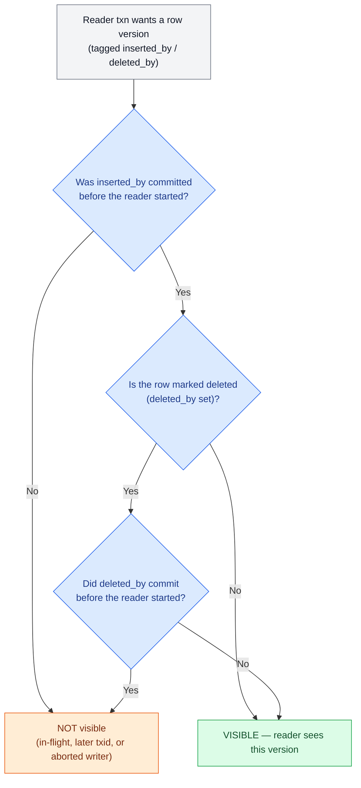
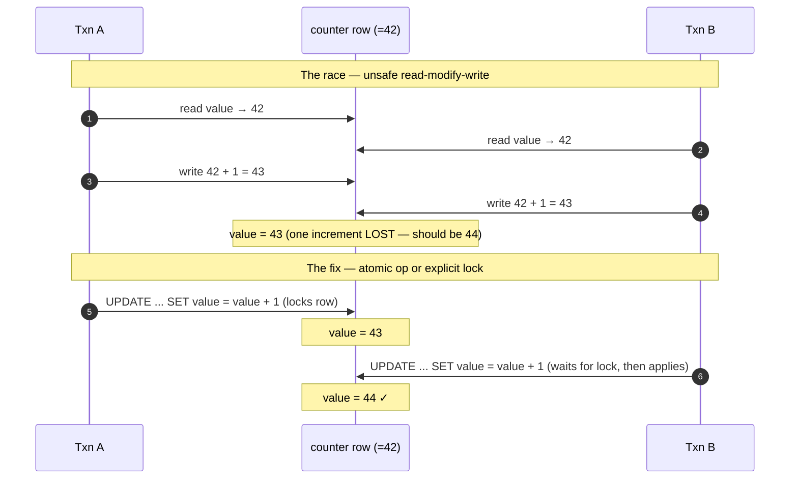
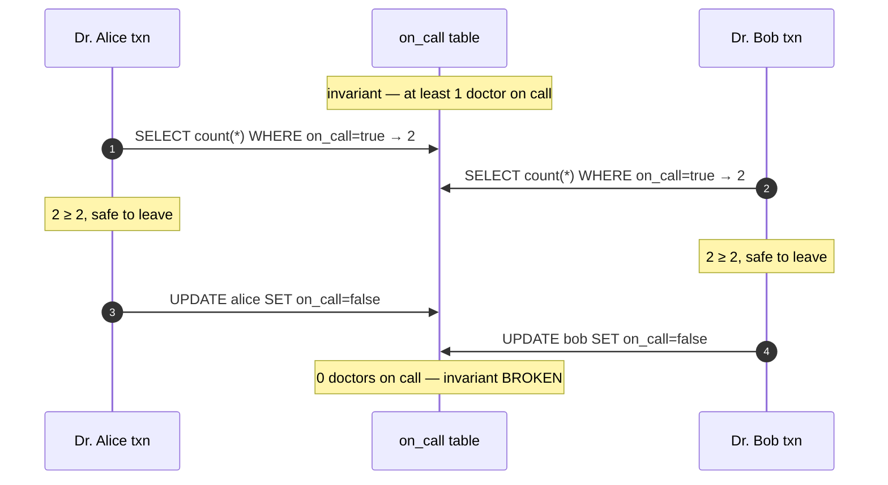

# Transactions & Isolation

> **Prerequisites:** [Storage Engines](/synapse/system-design-from-first-principles/data-foundations/storage-engines), [Data Models](/synapse/system-design-from-first-principles/data-foundations/data-models) | **You'll be able to:** state precisely what each ACID letter guarantees; name any concurrency anomaly (dirty read, read skew, lost update, write skew, phantom) from a scenario; and pick the right isolation level or locking technique for a contended workload.

## The problem (why this exists)

Two customers hit "buy" on the last concert ticket at the same millisecond. Your handler reads `seats_left = 1`, decides the sale is valid, writes `seats_left = 0`, and confirms. Both handlers did exactly that — and you've now sold one seat twice. Nothing crashed. No exception fired. Each line of code was correct in isolation. The bug lives *between* the two executions, in the interleaving your code never wrote down.

This is the whole reason transactions exist. A **transaction** groups several reads and writes into one logical unit that either wholly commits or wholly aborts, so that a large class of hardware faults and concurrency races collapse into a single, boring outcome: "abort and retry" [p. 277]. It is a deliberate abstraction — not a law of nature — and its entire value is that it lets you *stop reasoning* about partial failures and unlucky interleavings, provided you understand exactly what it promises.

The trouble is that "just use an ACID database" misses the point, because many ACID-labelled relational databases use *weak isolation by default* [p. 289]. These weak-isolation bugs are not theoretical: DDIA notes they have bankrupted a Bitcoin exchange, triggered financial-auditor investigations, and corrupted customer data [p. 289]. An attacker can even fire a burst of concurrent requests deliberately to exploit them [p. 289]. So the goal of this lesson is to make ACID precise and to walk the isolation ladder one anomaly at a time — because you cannot judge whether you need a guarantee until you can name the exact race it prevents.

## Intuition first

Start with the naive mental model and watch it break.

The naive model is: "the database runs my transaction, then the next one, then the next — one at a time." If that were literally true, concurrency bugs would be impossible. Any result you could observe would match *some* single-file ordering, and since each transaction is correct on its own, the whole thing would be correct. That property has a name — **serializability** — and it is the strongest isolation a database offers [p. 308].

But running strictly one-at-a-time is slow. A single long-running report would freeze every write in the system. So real databases let transactions *overlap* and only pretend to isolate them, to varying degrees. Every weaker isolation level is a bargain: "I'll let more transactions run concurrently (faster), and in exchange I'll permit a specific, named set of ways they can interfere with each other." Read committed permits some interference; snapshot isolation permits less; serializable permits none.

The engineering skill is knowing which anomalies each level lets through, and whether your application can tolerate them. A read-only analytics dashboard can tolerate almost anything. A ledger that must never make money appear or vanish cannot. The rest of this lesson names each anomaly precisely so you can make that call instead of guessing.

## How it works

### ACID, made precise

ACID was coined in 1983 by Härder and Reuter to pin down fault-tolerance terminology [p. 279]. It has since decayed into a marketing term — one database's "ACID" is not another's — so the letters are only useful if you hold each to its exact meaning.

- **Atomicity** is *not* about concurrency. It describes what happens if a fault hits partway through a group of writes: the transaction aborts and every write it made so far is discarded [p. 280]. "Abortability" would have been the clearer name. Atomicity is what lets you safely retry — you know a failed transaction left no half-written mess behind.
- **Consistency** (the C) is the odd one out: it means your *application-defined* invariants stay true — credits equal debits, a username is unique. This depends on how the application uses the database, so **the C is not a property of the database alone** [p. 280]. The database can enforce a *subset* (foreign-key, uniqueness, check constraints); every richer invariant must be preserved by correctly-written application code. Most of this lesson is really about the other three letters.
- **Isolation** means concurrently executing transactions don't step on each other; the textbook formalization is serializability — each transaction may pretend it is the only one running [p. 281]. Because true serializability has a cost, most databases ship a *weaker* default. Oracle even calls its snapshot-isolation level "serializable," though it is strictly weaker [p. 281]. This gap is where the entire isolation ladder lives.
- **Durability** promises that once a transaction commits, its writes survive a crash — via nonvolatile storage (an `fsync` to disk), a write-ahead log, and checksums on one node, or replication to several nodes [p. 282]. Perfect durability doesn't exist; it's a matter of degree.

### Single-object vs multi-object operations

Storage engines almost universally give you atomicity and isolation *for a single object on one node* — atomicity via a crash-recovery log, isolation via a per-object lock [p. 286]. Some go further with richer single-object atomics: an **increment** operation (which removes the read-modify-write cycle) and a **compare-and-set** conditional write (write only if the value hasn't changed), directly analogous to a CPU's CAS instruction [p. 286]. These prevent some races but are *not* transactions in the usual sense — they cover one object, not several [p. 286].

Multi-object transactions are the harder, more valuable case: they keep foreign-key references valid, keep denormalized data in sync, and keep secondary indexes consistent with the base table [p. 287]. Relational databases mark which operations belong together using the client's connection — everything between `BEGIN TRANSACTION` and `COMMIT` — and a dropped connection forces an abort [p. 285]. Many nonrelational stores lack any such grouping, so a multi-key write can succeed for some keys and fail for others, leaving a partially updated state [p. 285].

### The ladder, rung 1: read committed

**Read committed** is the most basic useful level. It makes exactly two guarantees [p. 290]:

- **No dirty reads** — you only ever read data that has been committed. A **dirty read** is seeing another transaction's writes before it commits [p. 290]. Forbidding it matters because otherwise you might see a partially updated multi-row state, or read a value that later gets rolled back.
- **No dirty writes** — you only overwrite committed data. A **dirty write** is a write that clobbers a value written by an earlier, still-uncommitted transaction [p. 291]. This is prevented with row-level locks held until commit: one writer per row [p. 292]. Dirty reads are prevented not by read locks (too slow — one long writer would block every reader [p. 292]) but by remembering both the old committed value and the new uncommitted value, and handing readers the old one until commit [p. 292].

Read committed is the *default* in Oracle, PostgreSQL, and SQL Server [p. 292]. Note what it does **not** prevent: the lost-update counter race, because there the second write happens *after* the first commits [p. 291].

### The ladder, rung 2: snapshot isolation and MVCC

Read committed still lets through **read skew** (a *nonrepeatable read*): a transaction observes different parts of the database at different times [p. 293]. Aaliyah checks account A (before a transfer completes) and account B (after it completes); $100 seems to vanish. Read committed permits this because each value was committed at the moment she read it. Temporary read skew is intolerable for backups (part-old, part-new → permanent inconsistency on restore) and for long analytical queries [p. 294].

**Snapshot isolation** fixes it: each transaction reads from a consistent snapshot — *all* data committed as of the transaction's start — even if other transactions change it afterward [p. 294]. It is the standard remedy for long-running read-only queries and is supported by PostgreSQL, MySQL/InnoDB, Oracle, and SQL Server [p. 294].

The implementation is **MVCC** (multiversion concurrency control), and its governing principle is worth memorizing: *readers never block writers, and writers never block readers* [p. 295]. Write locks still prevent dirty writes, but reads take no locks at all, so a long report coexists with normal writes. PostgreSQL-style MVCC works like this [p. 295–296]:

- Every transaction gets a unique, always-increasing transaction ID (`txid`).
- Every written row carries `inserted_by` (the creating txid) and `deleted_by` (set on delete, not physically removed). An **update is internally a delete + insert**, so an updated row exists as two versions until garbage collection reclaims the dead one.

A snapshot read then applies **visibility rules** to decide which version each reader sees:



Concisely: a row is visible iff its inserting transaction committed before the reader started **and** it is either not marked for deletion or its deleting transaction had not committed before the reader started [p. 297]. Writes by in-progress transactions, by transactions with a *later* txid, and by aborted transactions are all ignored [p. 297].

A quick naming warning you'll hit constantly: snapshot isolation is called **"repeatable read"** in PostgreSQL and **"serializable"** in Oracle; MySQL's "repeatable read" is weaker than snapshot isolation; Db2's "repeatable read" means true serializability [p. 298]. The SQL standard predates snapshot isolation and defines "repeatable read" so ambiguously that, as DDIA puts it, nobody really knows what it means [p. 298].

### The ladder, rung 3a: preventing lost updates

Snapshot isolation gives you consistent *reads*, but concurrent *writes* can still collide. The **lost update** problem happens in a read-modify-write cycle: two transactions read the same value and one modification clobbers the other [p. 299]. Two increments of a counter at 42 both read 42, both write 43 — the result is 43 when it should be 44 [p. 281]. This shows up as counter increments, editing a list inside a JSON document, or two users saving the same wiki page [p. 299].

Here is the race, and its fix:



There are four standard fixes [p. 299–302]:

1. **Atomic write operations** — `UPDATE counters SET value = value + 1` removes the read-modify-write cycle entirely and is usually the best answer when applicable. (ORMs make it easy to *accidentally* write the unsafe read-modify-write version instead.)
2. **Explicit locking** — `SELECT ... FOR UPDATE` locks the rows you're about to update so a concurrent updater must wait. Needed when the decision logic can't be expressed as a single DB statement (e.g. validating a game move). Easy to forget a lock; risks deadlock, which the DB resolves by aborting one transaction.
3. **Automatic lost-update detection** — let transactions run in parallel and have the manager abort-and-retry when it detects a lost update. PostgreSQL repeatable read, Oracle serializable, and SQL Server snapshot isolation do this automatically; **MySQL/InnoDB repeatable read does not** [p. 301].
4. **Compare-and-set** — `UPDATE ... WHERE value = <last read>` (or a version-number column, a.k.a. optimistic locking), the DB equivalent of CPU CAS [p. 302].

In multi-leader or leaderless replication there is no single up-to-date copy, so locks and CAS don't apply; the usual approach is to let concurrent writes create conflicting siblings and merge them. Merging is safe when operations are **commutative** (increment a counter, add to a set) — the idea behind CRDTs — whereas Last-Write-Wins, the common default, is prone to lost updates [p. 302].

### The ladder, rung 3b: write skew and phantoms

Lost update has a subtler cousin. **Write skew** is a race where two transactions read the *same* objects but each updates *different* objects, together breaking an invariant [p. 303]. The canonical example: a hospital requires at least one doctor on call. Two doctors, both feeling unwell, each open a transaction, each reads "2 doctors on call," each concludes "it's fine, the other is still on," and each takes themselves off. Result under snapshot isolation: zero doctors on call.



Write skew is a *generalization* of lost update: when the two transactions update the *same* object it degenerates into a dirty write or lost update; here they update different objects, so the earlier fixes don't catch it [p. 304]. Atomic single-object ops don't help (multiple objects). Automatic lost-update detection doesn't fire (PostgreSQL/MySQL repeatable read, Oracle serializable, and SQL Server snapshot isolation all miss it) [p. 304]. The same shape appears in meeting-room double-booking, claiming a unique username, moving two game figures to one square, and double-spending [p. 305–306].

Underneath write skew is the **phantom**: a write in one transaction changes the result of a search query in another [p. 307]. Each transaction checks a condition (how many doctors on call? is this room free?) then writes something that would have changed the other's check. When the condition is the *absence* of rows (no booking exists yet), `SELECT ... FOR UPDATE` has nothing to lock — you can't lock rows that don't exist [p. 307]. **Materializing conflicts** (pre-creating placeholder lock rows, e.g. a room×time-slot table) can turn a phantom into a concrete lock conflict, but it's ugly and error-prone — a last resort [p. 307–308]. The clean fix is true serializable isolation.

### The top rung: serializability, three ways

Serializable isolation guarantees the result is always equal to *some* serial execution, so if each transaction is correct alone it stays correct under any concurrency — it prevents *all* races [p. 308]. Essentially every serializable database uses one of three techniques [p. 308–309]:

- **Actual serial execution** — run one transaction at a time on a single thread, making isolation serializable by definition [p. 309]. Feasible only since the 2000s, thanks to two enablers: RAM cheap enough to hold the active dataset in memory (so transactions don't wait on disk), and OLTP transactions being short [p. 309]. Used by VoltDB/H-Store, Redis, and Datomic [p. 309]. Because a thread idling on the network would stall everything, interactive multi-statement transactions are forbidden — you submit each transaction as a **stored procedure** ahead of time [p. 310]. It's capped at one CPU core unless you shard so each transaction touches one shard; cross-shard transactions are vastly slower (VoltDB reports ~1,000 cross-shard writes/second) [p. 312–313].
- **Two-phase locking (2PL)** — for ~30 years the only widely-used serializability algorithm [p. 313]. It uses per-object shared/exclusive locks: readers block writers and writers block readers — the exact opposite of snapshot isolation's mantra [p. 313–314]. "Two-phase" means a *growing* phase (acquire locks while executing) then a *shrinking* phase (release all at commit) [p. 315]. To prevent phantoms it uses **predicate locks** — a lock on all objects matching a condition, even ones not yet inserted — usually approximated by cheaper **index-range (next-key) locks** that lock a safe superset [p. 316–317]. The cost is performance: reduced concurrency, unstable tail latencies under contention, and frequent deadlocks [p. 315–316]. **2PL is not 2PC** — 2PL is serializable isolation on one node; 2PC (covered in the next lesson) is atomic commit across nodes [p. 313].
- **Serializable snapshot isolation (SSI)** — first described in 2008, the modern sweet spot [p. 317]. It is *optimistic*: transactions run against a consistent snapshot as if all is well, and at commit the database checks whether isolation was actually violated and aborts-and-retries if so [p. 318]. It detects two conflict cases — a transaction that read a stale MVCC version, and a write that invalidates another transaction's earlier read (a "tripwire" that flags rather than blocks) [p. 319–322]. Because no transaction blocks on another's locks, latency is predictable and reads run lock-free; and unlike serial execution it scales beyond one core [p. 322]. The catch: it performs badly under *high contention* (many aborts, and retried load can worsen a saturated system) and needs read/write transactions to stay reasonably short [p. 318, 322]. Used by PostgreSQL's serializable level, CockroachDB, and FoundationDB [p. 317].

The choice between them is really pessimistic vs optimistic concurrency control: 2PL and serial execution *wait* if anything might go wrong (winning under high contention by avoiding wasted work); SSI *proceeds and checks* (winning when there's spare capacity and low contention) [p. 318].

## Trade-offs

The isolation-level ladder — each rung buys stronger guarantees at a concurrency cost. This table is the reference the rest of the book links back to (from Table 8-1, [p. 335]):

| Isolation level | Prevents | Still allows | Cost / mechanism |
| --- | --- | --- | --- |
| **Read uncommitted** | (dirty writes only) | dirty reads, read skew, phantoms, lost updates, write skew | cheapest; almost never worth it |
| **Read committed** | dirty reads, dirty writes | read skew, phantoms, lost updates, write skew | row locks on write + remembered old value; the common default |
| **Snapshot isolation** (a.k.a. "repeatable read" / Oracle "serializable") | + read skew, phantom reads | lost updates *(impl-dependent)*, **write skew** | MVCC; readers don't block writers — but write skew slips through |
| **Serializable** | **all anomalies** | — | serial execution, 2PL, or SSI; reduced concurrency or abort-and-retry |

Dirty writes are omitted as a column because almost every implementation prevents them [p. 335].

And the three serializable implementations, compared [p. 309–322]:

| Technique | Style | Strengths | Weaknesses | Used by |
| --- | --- | --- | --- | --- |
| **Serial execution** | pessimistic (extreme) | simplest; serializable by definition | one CPU core; needs in-memory data + stored procedures; cross-shard is slow | VoltDB, Redis, Datomic |
| **2PL** | pessimistic | decades-proven, correct | poor throughput, unstable tail latency, frequent deadlocks | MySQL/InnoDB & SQL Server serializable, Db2 |
| **SSI** | optimistic | predictable latency, lock-free reads, scales past one core | aborts under high contention; needs short txns | PostgreSQL serializable, CockroachDB, FoundationDB |

## Numbers that matter

- **The lost-update race outcome**: two concurrent increments of a counter at 42 yield 43, not 44 — one increment is silently lost [p. 281]. That single "off by one under load" is the shape of most contention bugs.
- **VoltDB cross-shard throughput**: ~1,000 cross-shard writes/second, orders of magnitude below single-shard, and not improvable by adding machines [p. 312–313]. This is why serial-execution systems push you to keep each transaction inside one shard.
- **PostgreSQL txid width**: 32-bit, overflowing after ~4 billion transactions; the vacuum process must clean up to prevent overflow from corrupting visibility [p. 295]. A real operational concern on high-throughput Postgres.
- **SSI first described**: 2008 [p. 317] — young enough that "serializable" in an older database almost certainly means 2PL, with its very different performance profile.
- **Durability is genuinely hard**: 30%–80% of SSDs develop at least one bad block within four years, and PostgreSQL's `fsync` handling was subtly incorrect for over 20 years [p. 283]. "It committed, so it's safe" is a probabilistic statement, not an absolute one.

For back-of-envelope capacity planning that feeds these contention questions, see [Back-of-the-Envelope Estimation](/synapse/system-design-from-first-principles/foundations/estimation-and-numbers).

## In production

Real systems rarely run at serializable by default — they run at read committed or snapshot isolation and *surgically* upgrade the few transactions that need more. A few patterns show up repeatedly:

- **Know your database's actual default.** PostgreSQL, Oracle, and SQL Server default to read committed [p. 292]. That means lost updates and write skew are *on the table* for every transaction unless you opt into something stronger. Teams are routinely surprised that their "ACID Postgres" happily lost an update.
- **Reach for the narrowest tool first.** An atomic `UPDATE ... SET x = x + 1` or a uniqueness constraint solves a huge fraction of real contention (stock decrements, claiming a username) without any isolation-level change [p. 299, 305]. Explicit `SELECT ... FOR UPDATE` handles the cases where the decision can't be one statement.
- **Use SSI when contention is low and you want correctness cheaply.** PostgreSQL's `SERIALIZABLE` (SSI) and CockroachDB's default serializable give you write-skew safety with predictable latency — as long as you keep transactions short and are willing to retry aborts [p. 317–322]. Modern NewSQL databases (CockroachDB, Spanner, TiDB, FoundationDB) combine sharding with consensus to offer strong ACID *at scale*, disproving the 2000s belief that transactions couldn't scale [p. 279].
- **Design for abort-and-retry.** Because both deadlock resolution (2PL) and conflict detection (SSI) abort transactions, application code must wrap contended transactions in a retry loop — and retries are imperfect: a lost commit-ack causes a duplicate unless you add app-level dedup, and side effects outside the DB (like sending email) may fire even on abort [p. 288]. This is exactly the reasoning behind payment **idempotency keys** — see [Stripe Payments](/synapse/system-design-from-first-principles/case-studies/stripe-payments).
- **Contention is a system-design decision, not just a DB setting.** The seat-booking race that opened this lesson is the heart of [Ticketmaster](/synapse/system-design-from-first-principles/case-studies/ticketmaster); the concurrent-counter problem is central to the [Rate Limiter](/synapse/system-design-from-first-principles/case-studies/rate-limiter). Both are, at bottom, isolation problems.

When the transaction spans *multiple nodes* — cross-shard writes, or a global secondary index on a different node — concurrency control generalizes fairly directly, but atomic *commit* becomes a genuinely new problem. That's two-phase commit, exactly-once semantics, and the in-doubt coordinator failure mode, all covered in the sibling lesson on [Distributed Transactions](/synapse/system-design-from-first-principles/distributed-data/distributed-transactions). The ordering and freshness guarantees that make cross-node isolation meaningful are covered in [Linearizability & Ordering](/synapse/system-design-from-first-principles/distributed-data/linearizability-and-ordering).

### Hands-on: watch the anomalies happen

A runnable harness lives at `proof-of-concepts/03-distributed-data/03-transactions-and-isolation/` in the repo root — it reproduces a **lost update** and a **write skew** against a real Postgres, then shows the guard that prevents each. It holds two connections and interleaves their statements deterministically, so you see the race every time instead of hoping to hit it.

```bash
cd proof-of-concepts/03-distributed-data/03-transactions-and-isolation
./run            # start Postgres + run both experiments
./run test       # mypy --strict + smoke (asserts anomaly AND fix)
./run stop       # tear down
```

The output is a before/after for each anomaly: under `READ COMMITTED` two read-modify-writes on a balance of 100 land on **80** (one −10 lost); adding `SELECT … FOR UPDATE` makes the second writer block and land on the correct **70**. Under `REPEATABLE READ` two on-call doctors both go off (the "≥1 on call" constraint drops to **0**); under `SERIALIZABLE` Postgres's SSI aborts the second commit with SQLSTATE 40001, the retry re-reads the true state and refuses, holding at **1**. Nothing about the isolation is faked — only the timing is staged; the README says exactly what is real versus arranged.

## Pitfalls & interview traps

<div style="border-left:4px solid #da5233;background:rgba(218,82,51,0.08);padding:0.6rem 1rem;border-radius:0 0.5rem 0.5rem 0;margin:1.25rem 0">

⚠️ **The two traps that catch everyone.** First: **isolation-level names are not portable.** "Repeatable read" means snapshot isolation in PostgreSQL, something weaker in MySQL, and true serializability in Db2; Oracle's "serializable" is actually snapshot isolation [p. 298, 281]. Never reason about a level by its name — reason about the anomalies it prevents. Second, and the classic interview follow-up: **snapshot isolation does NOT prevent write skew.** It stops dirty reads, read skew, and phantoms in read-only queries, but two transactions that read overlapping data and write *different* rows can still break an invariant together [p. 303–304]. If your correctness depends on a check-then-write across rows (doctors on call, seat availability, budget limits), snapshot isolation is not enough — you need serializable isolation, an explicit lock, or a constraint.

</div>

Other traps worth naming:

- **Confusing atomicity with isolation.** Atomicity is about *faults* (abort-and-discard); isolation is about *concurrency* [p. 280–281]. They're independent guarantees, and the A does nothing to prevent a lost update.
- **"The C in ACID is the database's job."** No — consistency is application-defined, and the database only enforces the subset you express as constraints [p. 280]. If an interviewer asks what ACID guarantees, saying the database keeps your invariants true is wrong.
- **Confusing 2PL with 2PC.** Same "two-phase" name, entirely different concepts: 2PL is single-node serializable isolation; 2PC is multi-node atomic commit [p. 313]. Mixing them up is a fast way to look shaky.
- **Assuming "serializable" is free.** It costs real throughput — reduced concurrency and deadlocks under 2PL, aborts under SSI [p. 315–318]. The senior answer is "serializable for the few transactions that need it, weaker for the rest," not "serializable everywhere."

## Check yourself

```quiz
{"prompt": "A booking system runs at snapshot isolation. Two users each read 'meeting room 5 is free from 2–3pm', both see no conflicting booking, and both insert a booking for that slot. The room is now double-booked. Which anomaly is this?", "options": ["Lost update", "Write skew (via a phantom)", "Dirty read", "Read skew"], "answer": "Write skew (via a phantom)"}
```

```quiz
{"prompt": "Two transactions both run 'balance = balance - 10' as read-modify-write on the SAME account row, concurrently. The balance drops by 10 instead of 20. Which anomaly is this, and which single-statement fix removes it?", "options": ["Write skew; fixed by snapshot isolation", "Lost update; fixed by an atomic 'UPDATE ... SET balance = balance - 10'", "Dirty write; fixed by read uncommitted", "Phantom; fixed by a predicate lock"], "answer": "Lost update; fixed by an atomic 'UPDATE ... SET balance = balance - 10'"}
```

```quiz
{"prompt": "Your workload has LOW write contention and you want to prevent all anomalies including write skew, with predictable tail latency and reads that never block. Which serializability technique fits best?", "options": ["Two-phase locking (2PL)", "Actual serial execution on one thread", "Serializable snapshot isolation (SSI)", "Read committed with row locks"], "answer": "Serializable snapshot isolation (SSI)"}
```

```quiz
{"prompt": "Which statement about the ACID letters is correct?", "options": ["Atomicity prevents concurrent transactions from interfering", "Consistency (the C) is guaranteed entirely by the database engine", "Isolation's textbook formalization is serializability", "Durability means a committed write can never possibly be lost"], "answer": "Isolation's textbook formalization is serializability"}
```

<details>
<summary>Why does read committed prevent dirty reads but still allow read skew?</summary>

Read committed only guarantees that *each individual read* returns committed data — it says nothing about consistency *across* reads within one transaction. So if you read account A, then a transfer commits, then you read account B, both values were committed at the moment you read them (no dirty read), yet together they reflect two different points in time (read skew). Snapshot isolation fixes this by pinning every read in a transaction to one consistent point-in-time snapshot. [p. 293–294]

</details>

<details>
<summary>Why does snapshot isolation's MVCC let readers and writers run without blocking each other?</summary>

MVCC keeps multiple committed versions of each row (tagged with `inserted_by`/`deleted_by` transaction IDs). A reader doesn't need a lock — it just applies the visibility rules to pick the version that was committed as of its snapshot, ignoring anything newer or uncommitted. A writer creates a *new* version rather than mutating the one readers are looking at. So "readers never block writers, and writers never block readers." Writers still take locks against *each other* (to prevent dirty writes), but never against readers. [p. 295–297]

</details>

<details>
<summary>If SSI is optimistic and 2PL is pessimistic, when would you deliberately choose 2PL?</summary>

Under *high contention*. Optimistic control (SSI) lets transactions run and aborts the losers at commit time — but under heavy contention that means many aborts, and re-running the aborted work can worsen an already-saturated system. Pessimistic control (2PL) makes conflicting transactions wait instead of doing throwaway work, so it wastes less effort when conflicts are frequent. The trade flips with spare capacity and low contention, where SSI's lock-free reads and predictable latency win. [p. 318]

</details>

## Sources

- DDIA2 ch. 8 pp. 277–282 (what a transaction is; the meaning of Atomicity, Consistency, Isolation, Durability)
- DDIA2 ch. 8 pp. 285–288 (single-object vs multi-object operations; atomic increment and compare-and-set; safe retries)
- DDIA2 ch. 8 pp. 288–289 (weak isolation and why concurrency bugs are dangerous, not theoretical)
- DDIA2 ch. 8 pp. 290–292 (read committed; dirty reads; dirty writes; read uncommitted)
- DDIA2 ch. 8 pp. 293–298 (read skew; snapshot isolation; MVCC and visibility rules; naming confusion)
- DDIA2 ch. 8 pp. 299–302 (lost update; atomic ops, explicit locks, automatic detection, compare-and-set; commutativity/CRDTs)
- DDIA2 ch. 8 pp. 303–308 (write skew; phantoms; materializing conflicts)
- DDIA2 ch. 8 pp. 308–322 (serializability; serial execution; two-phase locking; serializable snapshot isolation)
- DDIA2 ch. 8 p. 335 (Table 8-1 — the anomaly-vs-level matrix)
- DDIA2 ch. 8 pp. 283, 295, 312–313, 317 (durability/SSD figures; txid width; VoltDB cross-shard throughput; SSI first described 2008)
