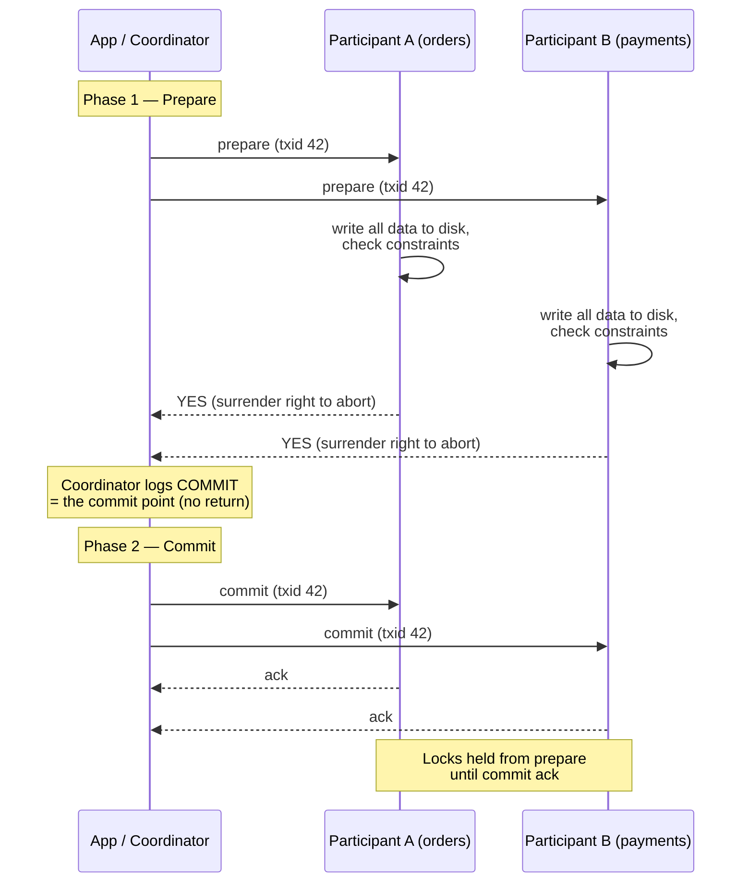
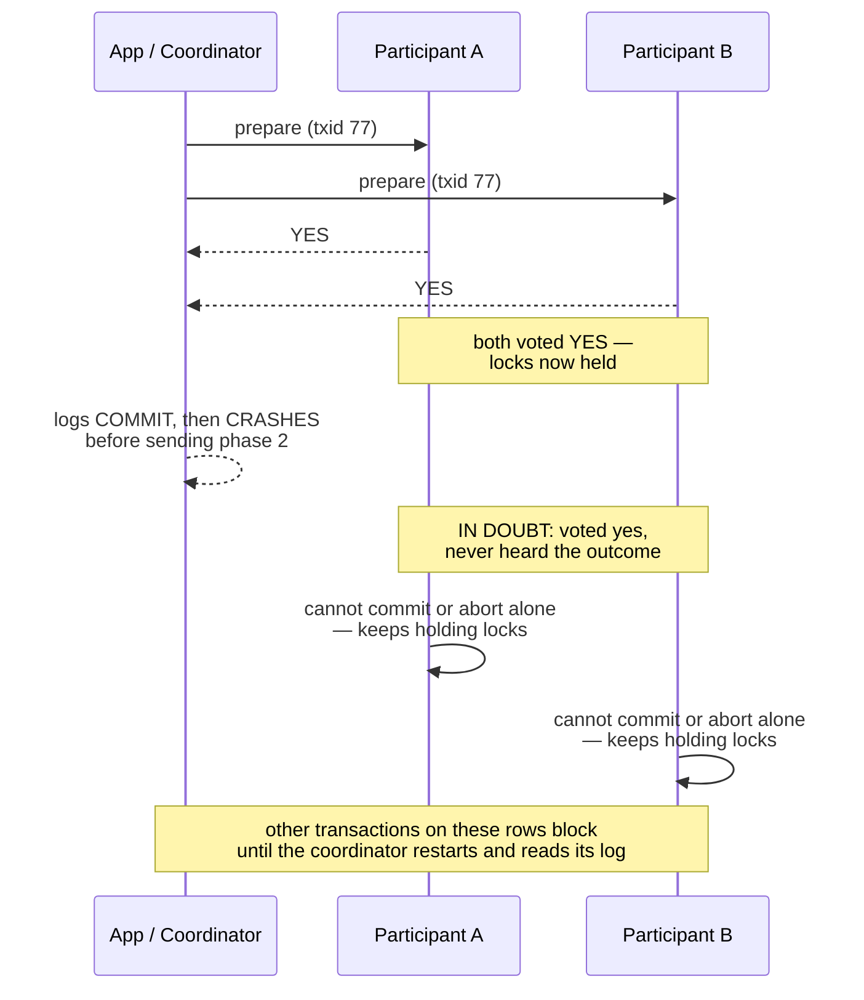
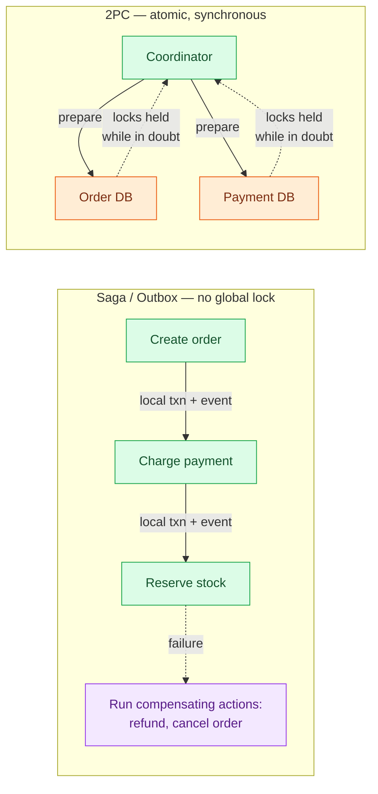

# Distributed Transactions

> **Prerequisites:** [Transactions & Isolation](/synapse/system-design-from-first-principles/distributed-data/transactions-and-isolation), [Replication](/synapse/system-design-from-first-principles/distributed-data/replication) | **You'll be able to:** trace two-phase commit prepare→commit and name the exact "points of no return"; explain why a crashed coordinator strands participants in-doubt holding locks; and decide when 2PC is acceptable versus reaching for idempotency, the outbox, or a saga.

## The problem (why this exists)

On a single node, "commit" is a physical event you can point at. The storage engine writes your data durably (to the write-ahead log), then appends a **commit record**. The deciding moment is when the disk finishes writing that record: before it, a crash aborts the transaction and discards the writes; after it, the transaction is committed and its effects are permanent [p. 323]. One disk controller on one machine makes the outcome atomic — all-or-nothing — because there is exactly one place where the decision lives.

Now split the write across two machines. An order goes to the `orders` database; the matching payment goes to the `payments` database. You want both or neither — an order with no payment is free product, a payment with no order is theft. The obvious approach is to send each machine an independent commit request. It doesn't work. The request can succeed on one node and fail on the other: a constraint fires on `payments`, or the network drops the request to `orders`, or a node crashes after committing but before you hear back [p. 323]. Worse, once one node has committed, you **cannot take it back** — under read-committed-or-stronger isolation, other transactions can already see that committed data, so there is no "undo" [p. 323–324].

This is the **atomic commitment problem**: getting every participant to agree on a single outcome — all commit, or all abort, never a mixture [p. 324]. It is the distributed sibling of single-node atomicity, and it is genuinely hard, which is the first reason to be suspicious of any design that casually reaches for a transaction spanning machines.

<div style="border-left:4px solid #15448e;background:rgba(21,68,142,0.08);padding:0.6rem 1rem;border-radius:0 0.5rem 0.5rem 0;margin:1.25rem 0">

**Definition.** A **distributed transaction** touches more than one node — multiple shards, or a global secondary index whose entry lives on a different node from the row it points at. Concurrency control (2PL, serial execution, distributed conflict checkers) generalizes fairly directly across nodes; the genuinely new problem is atomicity [p. 323].

</div>

## Intuition first

Picture a wedding. The officiant asks each partner, separately, "do you take this person?" Crucially, they ask *both before declaring anyone married*. If either says no, nobody is married and everyone goes home. Only once **both** have said "I do" does the officiant pronounce them married — and after that pronouncement, neither can walk it back.

That is two-phase commit exactly. A **coordinator** (the officiant) first asks every **participant** (each partner) a question — "can you commit?" — and collects the answers. This is the *prepare* phase. Only if everyone says yes does the coordinator move to the second phase and tell everyone "commit." The magic is entirely in the ordering: nobody is allowed to commit unilaterally during the questioning, and once a participant has said "I do," it has surrendered the right to change its mind [p. 326].

The beauty of the wedding analogy is also where it breaks, and the break is the whole lesson. What if the officiant collects two "I do"s, and then — before pronouncing anyone anything — collapses? The two partners are standing at the altar, each having committed irrevocably to the other, with no idea whether they are married. They cannot decide for themselves: one guessing "married" and the other guessing "not married" is exactly the split outcome the whole ceremony existed to prevent. All they can do is **wait** for the officiant to wake up. That waiting — with locks held the entire time — is the flaw that pushes most of the industry to avoid 2PC whenever it can.

## How it works

### The cast: coordinator and participants

2PC introduces a **coordinator** (also called a transaction manager). It is often not a separate server but a library running inside your application process — Narayana, JOTM, and MSDTC are real examples [p. 325]. The database nodes doing the actual work are the **participants**. The flow, in DDIA's precise form [p. 326]:

1. The application asks the coordinator for a **globally unique transaction ID**.
2. The application runs an ordinary single-node transaction on each participant, tagging each with that global ID. If anything fails here, nothing is committed yet — safe to abort.
3. When the app is ready to commit, the coordinator sends a **prepare** request to every participant, tagged with the global ID (phase 1).
4. Each participant, on receiving prepare, must make sure it can commit **under all circumstances**: it writes all the transaction's data to disk and checks every constraint and conflict. By replying **"yes,"** it **surrenders the right to abort** — but it has not committed yet [p. 326].
5. Once the coordinator has collected all the responses, it makes a definitive decision — commit if every vote was yes, abort if any vote was no or timed out — and **writes that decision to its own on-disk log**. This is the **commit point** [p. 326].
6. The coordinator sends the decision (commit or abort) to every participant (phase 2), and **retries forever** until each one acknowledges [p. 326].

Here is the happy path end to end:



### The two points of no return

What actually makes 2PC atomic is a pair of irreversible commitments, and it is worth naming them precisely because interviewers probe exactly here:

- **A participant's "yes" vote.** Once a participant votes yes, it can no longer refuse to commit — even if it crashes and restarts, it must be prepared to honor that yes. It has promised to commit *if asked*, whatever happens.
- **The coordinator's logged decision.** Once the coordinator has written "commit" to its log, that decision is irrevocable. Even if it crashes immediately afterward, on restart it reads the log and drives the commit to completion.

Single-node atomic commit collapses both of these into one event — writing the commit record to disk [p. 326–327]. 2PC's contribution is to split that one atomic event into two separate promises across machines, arranged so that the *combination* is still all-or-nothing. Notice the asymmetry: a participant that has voted yes is trusting the coordinator to eventually tell it the outcome. That trust is the vulnerability.

### When the coordinator crashes: the in-doubt problem

Take a participant that has voted yes and is waiting. The coordinator crashes before phase 2 reaches it. The participant is now **in doubt** (or *uncertain*): it has voted yes, so it cannot abort on its own (the coordinator may have decided commit and told another participant, who already committed); but it cannot commit on its own either (the coordinator may have decided abort) [p. 327]. Guessing wrong breaks atomicity — the exact thing 2PC exists to prevent. So it can only do one thing: **wait**, holding its locks.



Could the participants just talk to each other to resolve it? No — inter-participant negotiation to break the deadlock is explicitly **not** part of 2PC [p. 327], and it doesn't help anyway: even if A and B compare notes, neither knows what the coordinator decided or whether a third participant already acted on it. The **only** completion path is coordinator recovery. On restart, the coordinator reads its log: any transaction with a logged commit decision is driven to commit; any without one is aborted. In this sense the whole protocol's commit point reduces to a single-node atomic commit — on the coordinator's disk [p. 327].

This is also why the coordinator's log is as precious as the databases themselves. If the coordinator's disk is lost, in-doubt transactions cannot be resolved without a human. And losing only the *recent tail* of the log is subtly worse: the coordinator may then wrongly abort transactions it had actually committed, silently violating atomicity [p. 327–328].

A natural question: can't we design a *nonblocking* commit protocol? **Three-phase commit (3PC)** tries, inserting an extra "pre-commit" round so participants can finish without the coordinator. But 3PC only works if you assume bounded network delay and bounded response times — and in the real world of unbounded network delays and arbitrary process pauses (see [Faults, Clocks & Time](/synapse/system-design-from-first-principles/distributed-data/faults-clocks-and-time)), it cannot guarantee atomicity [p. 328]. The practical fix is different: replace the single fragile coordinator with a fault-tolerant, replicated one backed by a [consensus](/synapse/system-design-from-first-principles/distributed-data/consensus-and-coordination) protocol, so the coordinator itself survives crashes.

### XA and heterogeneous transactions

What if the two systems aren't even the same database — a PostgreSQL table and a message broker, say? That is a **heterogeneous** distributed transaction, and the standard for it is **XA** (X/Open eXtended Architecture), introduced in 1991 [p. 330]. XA is not a network protocol; it is a **C API** for talking to a transaction coordinator, exposed in Java as JTA over JDBC and JMS drivers. It is supported broadly: PostgreSQL, MySQL, Db2, SQL Server, Oracle, and brokers like ActiveMQ and IBM MQ [p. 330].

The canonical use is **exactly-once message processing**. You want to atomically commit *both* a message broker's acknowledgment *and* the database writes that the message triggered — so the message is acked if and only if the processing committed. If either fails, both abort and the broker safely redelivers [p. 329–330]. It works only if every affected system speaks the same atomic-commit protocol: an email server with no 2PC support could still send the email twice on a retry, because it never enrolled in the transaction [p. 330].

Under XA, the coordinator is usually a **library inside the application process**, keeping its commit/abort log on that app server's local disk [p. 330–331]. This has a nasty consequence: if the app process or machine dies, prepared-but-uncommitted participants are stuck in doubt, and *that specific server* must be restarted to recover them — the database servers cannot contact the coordinator directly, because all communication flows through the client library [p. 331]. Your application process has become a single point of failure whose local log is now as critical as the databases.

### Why database-internal distributed transactions are less bad

DDIA is careful to separate two things people conflate [p. 329]:

- **Database-internal** distributed transactions — every participating node runs the *same* database software (CockroachDB, TiDB, Spanner, FoundationDB, YugabyteDB; Kafka too). Many of these use 2PC internally for cross-shard atomicity [p. 333].
- **Heterogeneous** ones — participants are different technologies or vendors, or non-database systems. This is XA territory, and it is far harder.

Internal distributed transactions escape XA's worst traps precisely because they are not constrained to a lowest common denominator [p. 333]. They can: replicate the coordinator with automatic failover (so a crashed coordinator doesn't strand anyone); let the coordinator and shards communicate **directly**, without app-code intermediaries; replicate the participating shards to reduce fault-induced aborts; and couple atomic commit with a real distributed concurrency-control protocol that supports deadlock detection and consistent cross-shard reads [p. 333]. Consensus algorithms typically back both the coordinator and the shards, failing over automatically. This is exactly how NewSQL systems deliver strong ACID guarantees at scale [p. 333] — see [Sharding & Consistent Hashing](/synapse/system-design-from-first-principles/distributed-data/sharding-and-consistent-hashing) for how the data gets split in the first place.

### The honest modern answer: route around 2PC

Here is the part interviewers actually want to hear. **You do not need distributed transactions for exactly-once semantics.** A database-only approach suffices [p. 334]: keep a table of processed message IDs. When a message arrives, begin an ordinary single-node DB transaction, check whether its ID is already present — if so, ack the broker and drop it; if not, insert the ID, do the processing (all writes in the *same* transaction), commit, then ack the broker. Recording the ID makes the processing **idempotent**, so retries can't duplicate side effects — the same idea Kafka Streams uses for exactly-once [p. 334].

Walk the crash cases and it holds up [p. 334]: crash before commit → the transaction aborts and the broker redelivers; crash after commit but before the ack → the redelivery sees the ID and drops; crash after the ack → harmless leftover ID; a retry racing in before the original aborts → stopped by a **uniqueness constraint** on the message-ID table. No coordinator, no in-doubt window, no cross-system locks.

The two dominant patterns built on this idea get their own lessons later, but in brief:

- **The outbox pattern** — instead of writing to the database *and* publishing to a broker in one distributed transaction, you write the event into an `outbox` table in the *same* local transaction as your business data. A separate relay reads the outbox and publishes to the broker, retrying idempotently. One local commit replaces the fragile 2PC.
- **The saga pattern** — for a workflow spanning several services (create order → charge payment → reserve stock), each step is its own **local** transaction, and each step that could fail has a **compensating action** (refund, cancel) to semantically undo it. There is no global lock and no in-doubt window; the trade-off is that a saga is not isolated — intermediate states are visible — so you design for it.



## Trade-offs

| Approach | Gives you | Costs you | Use when |
| --- | --- | --- | --- |
| **2PC across heterogeneous systems (XA)** | True atomic commit across different technologies | In-doubt blocking, coordinator as SPOF, extra `fsync`s + round trips, no cross-system deadlock detection, no SSI [p. 332–333] | Almost never in new designs; legacy enterprise integration |
| **Database-internal 2PC (NewSQL)** | Strong ACID across shards, automatic coordinator failover | Cross-shard commit is slower than single-shard; you buy into one vendor's stack | Cross-shard invariants that truly must be atomic (Spanner, CockroachDB) |
| **Idempotency + message-ID dedup** | Exactly-once effects with only local transactions | You must design idempotent operations and store dedup keys | Consuming a message stream, processing payments/webhooks |
| **Outbox pattern** | Atomic "update DB + emit event" via one local commit | Eventual (not instant) delivery; a relay to operate | Reliably publishing events after a DB write |
| **Saga** | Multi-service workflows without global locks | No isolation — intermediate states visible; you write compensations | Long-running business processes across service boundaries |

The through-line: distributed transactions are blamed for operational pain and poor performance, which is why many cloud services decline to implement XA at all [p. 328–329]. The default has shifted from "make the commit atomic" to "make the operation idempotent and let it retry."

## Numbers that matter

- **Extra durability cost.** Each participant in a distributed transaction pays additional `fsync`s for crash recovery and extra network round trips beyond a single-node commit [p. 328–329] — the concrete reason 2PC is slower, not just riskier.
- **In-doubt window = coordinator recovery time.** Locks are held for as long as the coordinator is down. A coordinator that takes 20 minutes to restart holds those locks for 20 minutes; a coordinator whose log is lost holds them **forever** until an administrator intervenes [p. 331]. There is no bound the protocol itself provides.
- **Cross-shard commit is far slower than single-shard.** VoltDB reports on the order of **~1,000 cross-shard writes/second** — orders of magnitude below single-shard throughput, and not improvable by adding machines [p. 312–313]. Budget for this cost in [estimation](/synapse/system-design-from-first-principles/foundations/estimation-and-numbers).
- **XA vintage.** The standard dates to **1991** [p. 330]; treat "we'll just use XA" as an enterprise-legacy tell, not a modern default.

## In production

Real systems overwhelmingly **avoid** heterogeneous 2PC. Payment platforms like [Stripe](/synapse/system-design-from-first-principles/case-studies/stripe-payments) are built around **idempotency keys**: the client attaches a unique key to a charge request, and the server records it so a retried request returns the original result instead of charging twice — the message-ID dedup pattern in production dress [p. 334]. This is the same mechanism DDIA describes for exactly-once, and it is why a dropped network response on a payment API is safe to retry.

Event-driven systems reach for the **outbox pattern** rather than trying to atomically write to a database and a broker together. Debezium-style change-data-capture and Kafka Connect popularized reading a database's log/outbox and republishing reliably, sidestepping XA entirely. When teams *do* need cross-partition atomicity, they buy it inside a single system — **Google Spanner** and **CockroachDB** run 2PC internally, but with a consensus-replicated coordinator and shards so a crash fails over automatically instead of stranding locks [p. 333]. That is the crucial distinction: 2PC is acceptable when the coordinator is fault-tolerant and lives *inside* one well-engineered database; it is dangerous when it is a library on one app server bridging unrelated systems.

Multi-step business workflows — an [Uber](/synapse/system-design-from-first-principles/case-studies/uber) trip that touches pricing, dispatch, and payments, or a [Ticketmaster](/synapse/system-design-from-first-principles/case-studies/ticketmaster) booking that reserves a seat then charges a card — are typically modeled as **sagas** with compensating actions (release the seat if the charge fails), precisely because holding distributed locks across a human-speed workflow is untenable.

## Pitfalls & interview traps

<div style="border-left:4px solid #da5233;background:rgba(218,82,51,0.08);padding:0.6rem 1rem;border-radius:0 0.5rem 0.5rem 0;margin:1.25rem 0">

⚠️ **2PC holds locks across the entire in-doubt window.** A participant that voted yes keeps its exclusive locks (and, under serializable 2PL, its shared locks) until it hears the outcome. If the coordinator is slow to restart, those rows are blocked for other transactions the whole time; if the coordinator's log is lost, they can be blocked *indefinitely* [p. 331]. A distributed transaction is not a free upgrade of a local one — it converts a coordinator outage into an application-wide availability outage.

</div>

- **2PC is not 2PL.** They share "two-phase" and nothing else. **2PL** (two-phase locking) provides *serializable isolation on one node*; **2PC** provides *atomic commit across nodes* [p. 313]. An interviewer who hears you blur them will dig; keep them in separate boxes.
- **"Heuristic decisions" are a euphemism.** Many XA implementations let an operator force an in-doubt participant to commit or abort unilaterally. DDIA is blunt: *"heuristic here is a euphemism for probably breaking atomicity"* [p. 332]. It exists only as a catastrophic escape hatch, never for routine use.
- **Orphaned in-doubt transactions really happen.** A lost or corrupted coordinator log, or a software bug, can leave in-doubt transactions that survive database restarts (a correct 2PC *must* preserve their locks across restarts) and require an administrator to manually reconcile each participant — usually mid-outage, under stress [p. 331–332].
- **Exactly-once needs idempotency, not necessarily 2PC.** The strongest answer to "how do you process each message exactly once?" is not "distributed transaction" — it is "make the consumer idempotent with a dedup key and a uniqueness constraint, so retries are safe" [p. 334]. Reach for 2PC only when you genuinely cannot make the operation idempotent.
- **The coordinator is a single point of failure — unless it's replicated.** The XA coordinator plus the app code form a SPOF, and even replicating the coordinator doesn't fully help because XA gives it no way to talk to participants except through the app [p. 332–333]. This is the single biggest reason internal (consensus-backed) distributed transactions are "less bad" than XA.

## Check yourself

```quiz
{"prompt": "In a 2PC transaction, a participant has replied YES to the prepare request. The coordinator then crashes before sending phase 2. What must the participant do?", "options": ["Commit the transaction, since it already agreed", "Abort the transaction to release its locks quickly", "Wait for the coordinator to recover, holding its locks", "Ask the other participants what they decided and follow the majority"], "answer": "Wait for the coordinator to recover, holding its locks"}
```

```quiz
{"prompt": "What is the 'commit point' in two-phase commit — the moment after which the outcome is irrevocable?", "options": ["When the first participant replies YES to prepare", "When the coordinator writes its commit decision to its own on-disk log", "When the last participant acknowledges the phase-2 commit", "When the application requests the global transaction ID"], "answer": "When the coordinator writes its commit decision to its own on-disk log"}
```

```quiz
{"prompt": "A team needs each payment webhook processed exactly once despite retries. Which approach best matches how production systems actually do this?", "options": ["Wrap the broker ack and the DB write in an XA distributed transaction", "Store a processed-message ID with a uniqueness constraint and make processing idempotent", "Use three-phase commit so no coordinator is needed", "Disable retries so a message is never delivered twice"], "answer": "Store a processed-message ID with a uniqueness constraint and make processing idempotent"}
```

```quiz
{"prompt": "Why are database-internal distributed transactions (e.g. Spanner, CockroachDB) considered 'less bad' than heterogeneous XA transactions?", "options": ["They avoid two-phase commit entirely", "They never hold locks", "They can replicate the coordinator with automatic failover and let it talk to shards directly, without app-code intermediaries", "They run on a single node so atomicity is trivial"], "answer": "They can replicate the coordinator with automatic failover and let it talk to shards directly, without app-code intermediaries"}
```

<details>
<summary>Two participants have both voted YES and are in doubt because the coordinator crashed. Why can't they just talk to each other to resolve the outcome, and what actually resolves it?</summary>

Inter-participant negotiation is not part of 2PC, and it wouldn't help even if allowed: neither participant knows what decision the coordinator wrote to its log, and a *third* participant might already have committed based on that decision. Guessing risks a split outcome — exactly what 2PC exists to prevent. The only safe resolution is coordinator recovery: on restart it reads its log, drives any logged-commit transaction to commit and any transaction without a commit record to abort [p. 327]. That is why the coordinator's log is as critical as the databases themselves.

</details>

<details>
<summary>Your service must "update the orders table and publish an order-created event to Kafka." Why is an outbox usually preferable to a distributed transaction across Postgres and Kafka?</summary>

An XA transaction across Postgres and Kafka introduces an in-doubt window with locks and makes your app process a single point of failure whose local coordinator log is now as critical as both systems [p. 330–331]. The outbox avoids all of that: you write the event row into an `outbox` table in the *same local Postgres transaction* as the order, so it commits atomically with zero cross-system coordination. A separate relay then reads the outbox and publishes to Kafka, retrying idempotently. You trade instantaneous delivery for eventual delivery, and in return you delete the entire class of distributed-commit failure modes.

</details>

## Sources

- DDIA2 ch. 8 pp. 323–324 (single-node commit; the atomic commitment problem; why independent commits are unsafe)
- DDIA2 ch. 8 pp. 324–328 (two-phase commit mechanics; coordinator & participants; the two points of no return; in-doubt; coordinator recovery; 3PC)
- DDIA2 ch. 8 pp. 328–333 (distributed transactions in practice; XA; holding locks while in doubt; heuristic decisions; orphaned in-doubt txns; internal vs heterogeneous)
- DDIA2 ch. 8 pp. 333–334 (database-internal distributed transactions; consensus-backed coordinators; exactly-once via idempotent message-ID dedup)
- DDIA2 ch. 8 pp. 312–313 (cross-shard write throughput cost, VoltDB figure)
- DDIA2 ch. 8 p. 313 (2PL ≠ 2PC)
