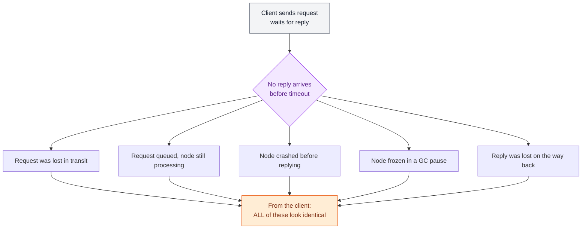
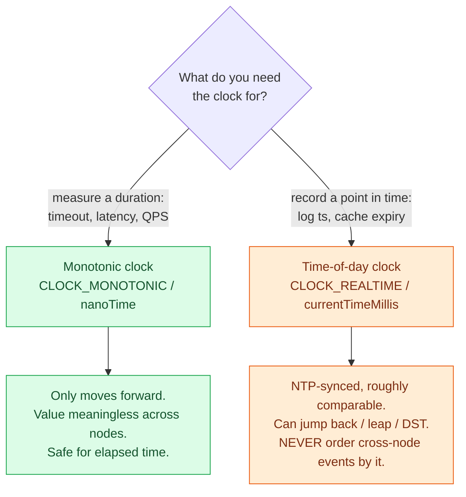
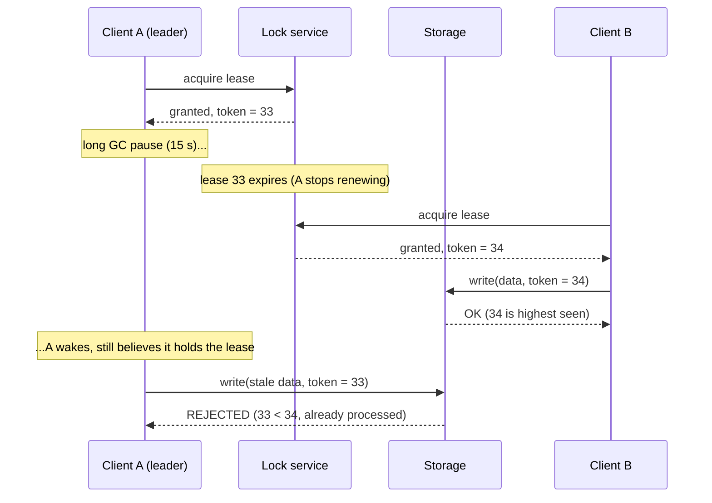

# Faults, Clocks & Time

> **Prerequisites:** [Networking Essentials](/synapse/system-design-from-first-principles/foundations/networking-essentials), [Nonfunctional Requirements](/synapse/system-design-from-first-principles/foundations/nonfunctional-requirements) | **You'll be able to:** reason about why a timeout tells you almost nothing, explain why you must never order events across nodes by wall-clock time, and design a lease + fencing-token scheme that survives a paused leader.

## The problem (why this exists)

On a single machine, software is comfortingly deterministic. Run the same function on working hardware and you get the same answer; when the hardware genuinely breaks, the machine usually crashes cleanly — a kernel panic, a blue screen — rather than quietly handing you a wrong result [p. 345]. This is deliberate: a computer is designed to fail loudly rather than lie, because wrong results are far harder to cope with than a clean crash [p. 345].

Wire a few of those machines together with a network and that comfort evaporates. Now some parts of the system can be broken while others keep humming along, and — this is the sharp part — **you often cannot tell which**. DDIA calls this a **partial failure**, and it is nondeterministic: the same multi-node operation may work now and fail a moment later, and you may never learn whether it actually succeeded [p. 346]. "The fact that such partial failures can occur is the defining characteristic of distributed systems." [p. 388]

That single fact reshapes everything downstream. You cannot trust silence from a node, trust which of two cross-machine events came first, or assume a thread that checked its watch a moment ago still holds a valid lease. This is the humility lesson — *why* the network lies, *why* clocks lie, and the one mechanism (fencing tokens) that lets you build something correct anyway. Get it wrong and you get the split-brain corruption bugs that haunt half the case studies in this book.

## Intuition first

Three things conspire against you, and it helps to name them in plain language before any formalism.

**The network can lose or delay anything, silently.** When you send a request and wait for a reply, the request might be lost, or stuck in a queue, or delivered to a node that has died, or delivered to a node that is merely frozen, or the reply might be lost, or the reply might just be slow [pp. 347–348]. From where you sit, **all six look identical**: no response yet [p. 348]. There is no packet that arrives saying "your earlier packet definitely died."

**Every machine keeps its own time, and every clock is a little wrong.** Each node has a cheap quartz oscillator that drifts, nudged periodically toward the truth by NTP over the same unreliable network [p. 358]. So "now" on machine A and "now" on machine B disagree — usually by a little, occasionally by a lot — and neither knows by how much.

**A process can freeze at any instant, for a long time, without noticing.** A garbage-collection pause, a hypervisor suspending your VM to migrate it, the OS paging your memory to disk — any of these can stop your thread mid-function for hundreds of milliseconds or, historically, minutes [pp. 367–369]. During that freeze the rest of the world moves on. It may decide you are dead, elect a replacement, and hand your job to someone else — and you will not find out until you wake up and, perhaps, do something catastrophic.

The takeaway a beginner should leave with: **the network lies, and so do clocks, and your own process can black out.** Everything else is engineering around those three truths.

## How it works

### The network: no response means *nothing*

Datacenter and internet networks are **asynchronous packet networks** — send a packet and the network makes no promise about when, or whether, it arrives [p. 347]. The usual defense is a **timeout**: wait some interval, then give up and assume the worst. But a timeout does not tell you the node is dead. On timeout you still don't know if the remote node received your request — it may be sitting in a queue and get processed later, long after you moved on [p. 348].

This ambiguity is not academic. Network faults are common even inside one company's datacenter — one medium-sized study found roughly **12 network faults per month**, half cutting off a single machine and half cutting off an entire rack [p. 350]. Redundant switches help less than you'd hope, because they don't guard against the human misconfiguration behind many outages [p. 350]. And delays get wild: across cloud regions, round-trip times of **up to several minutes** appear at high percentiles, and even inside one datacenter a packet can be delayed **more than a minute** during a topology reconfiguration [p. 350]. Assume any message can be delayed arbitrarily.

Doesn't TCP fix this? TCP is "reliable" in that it retransmits dropped packets, reorders them, and checksums for corruption [pp. 348–349]. But it sits *on top of* an unreliable network and does not remove it: TCP infers loss from a missing ACK, can't tell whether your packet or the ACK was lost, can't guarantee a resend gets through, and eventually gives up and hands your app an error [p. 349]. Worse, a delivery ACK only means the remote *kernel* received the bytes — the application may have crashed before processing them. **A definitive "yes, I did it" requires a positive response from the application itself**, not from TCP [p. 349].

Here is what that ambiguity looks like when you send one request:



### Why there is no good timeout value

If networks had a maximum packet delay `d` and servers had a maximum handling time `r`, every successful request would return within **`2d + r`**, and you could set your timeout just above that [pp. 352–353]. Real asynchronous networks have neither bound, so `2d + r` doesn't hold. That leaves you tuning a timeout by feel, and every choice hurts:

- **Too short**, and you declare a merely-slow node dead. That's dangerous — an in-flight action (sending an email, writing a row) may be performed twice when a replacement takes over [p. 352]. And declaring a node dead shifts its load onto others; under high load, premature death declarations can trigger a **cascading failure** where every node declares every other node dead and the whole system stops [p. 352].
- **Too long**, and you wait ages before reacting to a genuinely dead node, hurting availability.

Because the variability comes mostly from **queueing** — at congested switches, busy destination CPUs, the sender's own TCP rate-limiter, and noisy neighbors in a multitenant cloud [pp. 353–355] — the practical answer is to *measure*, not guess: track the round-trip-time distribution and adapt. Production systems use accrual failure detectors (the **Phi Accrual** detector in Cassandra and Akka) that output a suspicion level from observed jitter rather than a hard yes/no [p. 355].

### Clocks: which one, for which job

Every modern machine actually has *two* clocks, and confusing them is a classic bug [p. 359]:

- A **time-of-day clock** (`CLOCK_REALTIME`, `System.currentTimeMillis`) tells you the calendar date and time, synced by NTP so a timestamp means roughly the same thing across machines. But it can **jump backward** when NTP yanks it into line, jump for a leap second, or jump for DST — which makes it useless for measuring how much time elapsed [p. 359].
- A **monotonic clock** (`CLOCK_MONOTONIC`, `System.nanoTime`) only ever moves forward, like a stopwatch. Its absolute value is meaningless (nanoseconds since some arbitrary point), so comparing monotonic readings *across* machines is nonsense — but for measuring a duration on one machine, it's exactly right [pp. 359–360].



The rule: **durations → monotonic clock; points in time → time-of-day clock; ordering events across nodes → neither.**

### Why wall-clock ordering is a trap

It is tempting to order writes across nodes by comparing their time-of-day timestamps — Last-Write-Wins. It is also silently wrong. Quartz clocks drift (Google assumes up to **200 ppm**), NTP over the internet manages a **minimum error around 35 ms** and can spike to a full second, and the reading you get is a false-precision point, not a range [pp. 360–361, 364–365]. With multi-leader replication and LWW, a causally *later* write can carry a *smaller* timestamp and get dropped — silently losing data — even when the clock skew between nodes is under **3 ms** [pp. 362–363]. NTP simply cannot be made accurate enough to prevent this, because its accuracy is bounded by the network round-trip time it rides on [p. 364]. The honest way to order events across nodes is **logical clocks** — counters that capture happened-before relationships — which we build in [Linearizability & Ordering](/synapse/system-design-from-first-principles/distributed-data/linearizability-and-ordering).

The one honest exception is to stop pretending a clock reading is a point and treat it as a **confidence interval** `[earliest, latest]`. Google **Spanner's TrueTime** and Amazon **ClockBound** expose exactly that [p. 365]. Spanner orders transactions by waiting out the interval: if interval A ends before interval B begins, B definitely happened after A. To keep the wait short it keeps uncertainty tiny — a GPS receiver or atomic clock per datacenter syncs to within **~7 ms** — then *deliberately waits the interval's width before committing* so later readers never overlap it [p. 366]. The lesson isn't "buy atomic clocks"; it's that being honest about uncertainty is what makes clock-based ordering safe — and most APIs (`clock_gettime`) never tell you whether your error is 5 ms or 5 years [p. 365].

### Process pauses: "I checked 10 ms ago" means nothing

Suppose a node holds a **lease** — a lock with a timeout that it must renew before expiry, so a dead node's lease can be reassigned. A naive check looks safe:

```
while (true) {
  request = getNextRequest();
  if (lease.isValid()) {   // checked... it's valid!
    process(request);      // ...so process it
  }
}
```

This is buggy in two ways [p. 367]. It compares a lease expiry set on *another* machine against the *local* clock, so clock skew breaks it. And it assumes no meaningful time passes between `isValid()` returning true and `process()` running. But a process can pause **right there**, between those two lines, for 15 seconds. During the pause the lease expires, another node takes over — and the paused thread, on waking, sails straight into `process()` believing it still holds a lease it lost long ago [p. 367].

These pauses are not exotic. Historically, stop-the-world garbage collection could freeze a JVM for **several minutes**; modern collectors usually keep it to a few ms, but the tail is still there [pp. 367, 370]. A hypervisor can suspend an entire VM for live migration at any moment for any length of time; the OS can page your memory to disk so an innocent memory access blocks on I/O; a context switch or `SIGSTOP` can descheduled you [pp. 367–369]. The uncomfortable conclusion: **a node must assume it can be paused at any point, even mid-function, and resume without realizing time has passed** [p. 369]. "Checked 10 ms ago" tells you nothing about now.

### The payoff: knowledge, truth, and lies

Given all that, a node can know *nothing* for certain about any other node — it can only guess from messages it did or didn't receive [p. 371]. Two defenses make this workable.

**The majority rules.** A node cannot trust its own judgment (it may be the one that's partitioned or paused), and the system cannot trust any single node (it may fail at any moment). So decisions — including "is node X dead?" — are made by a **quorum**, a vote among nodes. The usual quorum is an **absolute majority** (more than half), which is safe because two conflicting majorities cannot exist at once, and it tolerates a minority of failures: 3 nodes tolerate 1 fault, 5 tolerate 2 [pp. 372–373]. If a majority declares a node dead, it must step down. This is the seed of consensus, developed in [Consensus & Coordination](/synapse/system-design-from-first-principles/distributed-data/consensus-and-coordination).

**Fencing tokens.** Leases enforce "only one of some thing" — one leader per shard, one writer per file — but a paused **zombie** (a former leaseholder that hasn't learned it was replaced) can still issue a write, and even a *crashed* leader's delayed write can arrive minutes late after someone else took over [pp. 373–374]. Shutting the zombie down (STONITH) doesn't help: it can't catch a request already delayed in the network, and by the time you detect the zombie the damage may be done [pp. 374–375]. The robust fix: the lock service returns a **fencing token** — a number that increases on every grant — and every write to storage must carry the client's current token. **Storage rejects any write whose token is lower than one it has already accepted** [p. 375]. The zombie's stale token is smaller than the new leader's, so its write bounces harmlessly off.



This is the mechanism half the case studies in this book quietly depend on. Real systems already hand you the token: ZooKeeper's `zxid` or node `cversion`, etcd's revision number, Chubby's **sequencers**, Kafka's **epoch numbers**, and — in consensus — Raft's *term* or Paxos's *ballot* [pp. 375–376]. Where a separate lock service is overkill, storage that supports a **conditional atomic write** (succeeds only if unmodified since you read it) gives you the same protection — S3 conditional writes, Azure Blob conditional headers, GCS preconditions [p. 376].

### A note on Byzantine faults

Fencing tokens stop a node that errs *honestly* — slow, silent, or out of date, but truthful if it answers. They do not stop a node that **lies**: sends fake tokens, casts contradictory votes, deliberately subverts the protocol. That is a **Byzantine fault**, and tolerating it (the Byzantine Generals Problem) is expensive — most BFT algorithms need a supermajority of more than **two-thirds** correct [pp. 377, 379]. For interview systems you can almost always assume nodes are **unreliable but honest** — they're your own machines in your own datacenter [pp. 378–379]. Byzantine tolerance is for aerospace (radiation flipping bits) and trustless multi-party systems (blockchains); note it and move on.

## Trade-offs

| Decision | Gives you | Costs you | Use when |
| --- | --- | --- | --- |
| Short failure-detection timeout | Fast reaction to dead nodes | False positives; double-executed actions; risk of cascading failure [p. 352] | Low, predictable latency; spare capacity |
| Long failure-detection timeout | Few false positives | Slow reaction; users wait during real failures [p. 352] | Latency is variable; false takeovers are costly |
| Monotonic clock | Correct durations; no cross-node sync needed | Meaningless as a wall-clock timestamp [pp. 359–360] | Timeouts, latency, session length |
| Time-of-day clock | Human-meaningful timestamps | Jumps back/forward; unsafe for ordering [p. 359] | Log dates, cache expiry, reminders |
| Lease alone | Simple mutual exclusion | Zombie/delayed-write split-brain [pp. 373–374] | Only wasted work at stake, not corruption |
| Lease + fencing token | Zombie writes are rejected permanently | Storage must check tokens; token must be monotonic [p. 375] | Correctness matters: one writer, one leader |
| STONITH (shoot the node) | Removes an obviously-bad node | Doesn't stop already-delayed requests; can go wrong [pp. 374–375] | A crude backstop, never the sole defense |

## Numbers that matter

Keep these in your head — they're the back-of-envelope figures that justify "assume the network and clocks are hostile." (For the estimation toolkit, see [Estimation & Numbers](/synapse/system-design-from-first-principles/foundations/estimation-and-numbers).)

| Figure | Value | Why it matters | Page |
| --- | --- | --- | --- |
| Network faults, medium datacenter | ~12 / month (½ one machine, ½ whole rack) | Faults are routine even in one company's DC | 350 |
| Cross-region round-trip, high percentile | up to several minutes | Any message can be delayed arbitrarily | 350 |
| Intra-DC packet delay during topology change | more than a minute | Even "local" delays can be enormous | 350 |
| Failure-detection bound (hypothetical) | `2d + r` | The timeout you'd love — but real networks have no `d` or `r` | 352–353 |
| Quartz clock drift (Google's assumption) | up to 200 ppm | ≈6 ms drift if resynced every 30 s; ≈17 s if resynced daily | 360 |
| NTP sync error over the internet | ~35 ms min, spikes to ~1 s | Bounded by network delay — can't be made tight | 361 |
| Clock skew that still loses an LWW write | < 3 ms | Even tiny skew silently drops data | 362–363 |
| Best internet clock accuracy | tens of ms, >100 ms under congestion | Microsecond timestamp digits are often meaningless | 364–365 |
| MiFID II clock-sync requirement | within 100 µs of UTC | What it costs to get *serious* accuracy (HFT) | 361 |
| Spanner per-DC clock sync | within ~7 ms | Small enough that TrueTime's commit-wait stays short | 366 |
| Historic stop-the-world GC pause | sometimes several minutes | Why "I checked the lease just now" is worthless | 367, 370 |
| Majority-quorum fault tolerance | 3 nodes → 1 fault; 5 → 2 | The safety of "more than half" | 372–373 |
| Byzantine fault tolerance | supermajority > 2/3 (4 nodes → 1) | Why BFT is expensive and usually skipped | 379 |

## In production

Real systems live and die by these mechanisms. **ZooKeeper, etcd, and Chubby** exist largely to hand out leases and monotonic fencing tokens (`zxid`, revision numbers, sequencers) so leader-elected workers can't corrupt shared state when one pauses [pp. 375–376]. **Kafka** attaches epoch numbers to partition leaders for the same reason [p. 375]. The pattern recurs across this book's case studies: the [Job Scheduler](/synapse/system-design-from-first-principles/case-studies/job-scheduler) leases each job to exactly one worker (fencing stops a paused worker's late completion from double-running); [Ticketmaster](/synapse/system-design-from-first-principles/case-studies/ticketmaster) holds seats under short-lived locks a zombie must not re-grant; and [Uber](/synapse/system-design-from-first-principles/case-studies/uber) leans on leader ownership for dispatch regions.

On the clock side, **Cassandra and ScyllaDB** default to client-clock LWW and inherit the silent-data-loss hazard above — an operational footgun that pushes careful teams toward version vectors [pp. 363–364]. **Spanner** and **YugabyteDB** take the opposite bet: invest in tight clock sync (GPS/atomic clocks, or AWS ClockBound) and use the confidence interval to get global ordering [p. 366]. And on failure detection, **Cassandra and Akka** ship the Phi Accrual detector precisely because a single hard timeout is too brittle against real-world jitter [p. 355]. Operationally, if your software *requires* synchronized clocks, you must **monitor clock offsets across all machines and eject any node that drifts too far** — because a bad clock fails silently, drifting your data into subtle loss rather than crashing loudly [p. 362].

Teams prove these designs survive failure with **fault injection**: Netflix's Chaos Monkey (chaos engineering), Jepsen for testing distributed databases, and deterministic simulation testing at FoundationDB and TigerBeetle, which mock the clock and network so a failing run can be replayed exactly [pp. 385–387].

## Pitfalls & interview traps

<div style="border-left:4px solid #da5233;background:rgba(218,82,51,0.08);padding:0.6rem 1rem;border-radius:0 0.5rem 0.5rem 0;margin:1.25rem 0">

⚠️ **Two traps that fail candidates.** First: **a timeout does not mean the node is dead.** It means *no response yet* — the request may still be queued and land later, so any takeover must be safe against the original also completing [p. 348]. Second: **never order events across nodes by wall-clock timestamps.** Clock skew under 3 ms already silently drops LWW writes [pp. 362–363]. Reach for logical clocks or a confidence-interval clock, never a bare `currentTimeMillis` comparison.

</div>

- **"Just use a distributed lock."** The senior follow-up is always: *what happens when the lock holder pauses?* If your answer isn't "fencing tokens," you've shipped a split-brain corruption bug [pp. 373–375].
- **Trusting a delivery ACK.** TCP delivery means the kernel got the bytes, not that the app processed them; and reconnect-and-retransmit can duplicate data. Real confirmation needs an application-level response and idempotency [pp. 349].
- **Using the time-of-day clock for timeouts.** It can jump backward and make a duration negative. Use the monotonic clock [p. 359].
- **Assuming redundant hardware removes faults.** It doesn't touch human misconfiguration, a leading cause of outages [p. 350].
- **Reaching for Byzantine fault tolerance.** In a normal datacenter your nodes are honest; BFT's >2/3 supermajority cost is almost never worth it — say so and move on [pp. 378–379].

## Check yourself

```quiz
{"prompt": "A node holds a lease and its code runs: if (lease.isValid()) process(request). Between isValid() returning true and process() running, the JVM undergoes a 15-second stop-the-world GC pause, during which the lease expires and another node acquires it. What happens?", "options": ["Nothing bad — isValid() was checked, so the lease is guaranteed valid when process() runs", "The paused node resumes and runs process() believing it still holds the lease, risking split-brain corruption", "The GC pause automatically renews the lease, so ownership is preserved", "The OS aborts process() because the lease object is stale"], "answer": "The paused node resumes and runs process() believing it still holds the lease, risking split-brain corruption"}
```

```quiz
{"prompt": "You send a request to a remote node and no response arrives before your timeout. Which conclusion is justified?", "options": ["The remote node has definitely crashed", "The remote node definitely never received the request", "You cannot distinguish a lost request, a dead node, a frozen node, or a lost response — only that no response has arrived yet", "The request was definitely processed but the reply was lost"], "answer": "You cannot distinguish a lost request, a dead node, a frozen node, or a lost response — only that no response has arrived yet"}
```

```quiz
{"prompt": "Which mechanism actually prevents a paused zombie leaseholder's stale write from corrupting shared storage?", "options": ["STONITH — forcibly shutting the zombie node down", "A monotonically increasing fencing token that storage checks, rejecting any write with a token lower than one already accepted", "Setting a shorter lease timeout so the pause can't outlast it", "Synchronizing all clocks with NTP so the zombie knows its lease expired"], "answer": "A monotonically increasing fencing token that storage checks, rejecting any write with a token lower than one already accepted"}
```

```quiz
{"prompt": "Two datacenters run multi-leader replication with Last-Write-Wins resolution using each node's time-of-day clock. Clock skew between them is well under 3 ms. What is the risk?", "options": ["None — sub-3ms skew is far too small to affect ordering", "A causally later write can carry a smaller timestamp than an earlier one and be silently discarded, losing data", "The clocks will refuse to accept writes until they resync", "Writes will be duplicated rather than lost"], "answer": "A causally later write can carry a smaller timestamp than an earlier one and be silently discarded, losing data"}
```

<details>
<summary>Why is a monotonic clock the right choice for a timeout, but the wrong choice for a log timestamp?</summary>

A monotonic clock only ever moves forward and never jumps, so a duration measured between two of its readings is always sane — exactly what a timeout needs. But its absolute value is meaningless (e.g. nanoseconds since boot) and is not comparable across machines, so it can't express "this event happened at 14:32 UTC." A log timestamp needs a human-meaningful, cross-machine-comparable point in time, which is the time-of-day clock's job — accepting that it may occasionally jump backward when NTP corrects it [pp. 359–360].
</details>

<details>
<summary>Your teammate proposes STONITH ("shoot the other node in the head") to handle a suspected zombie leader instead of fencing tokens. Give the two-sentence rebuttal.</summary>

STONITH can't protect against a request that was *already* delayed in the network before you shut the node down — that write can still land after the new leader took over and corrupt state [pp. 374–375]. Fencing tokens are strictly better because they reject the stale write at the storage layer permanently, regardless of whether the zombie is still running, and require no risky remote power-off.
</details>

<details>
<summary>Why can't you just tighten NTP synchronization enough to make wall-clock event ordering safe across nodes?</summary>

NTP's accuracy is bounded by the network round-trip time it relies on — the best you get over the internet is tens of milliseconds, spiking past 100 ms under congestion [pp. 364–365]. To order events safely you'd need clock error far *below* the network delay between the events, which is physically impossible. The honest alternatives are logical clocks (which capture ordering without measuring time) or a confidence-interval clock like TrueTime that waits out its own uncertainty [pp. 364–366].
</details>

## Sources

- DDIA2 ch. 9 pp. 345–347 (faults & partial failure; reliable systems from unreliable components)
- DDIA2 ch. 9 pp. 347–352 (unreliable networks; six failure modes; TCP's limits; network faults in practice; fault detection)
- DDIA2 ch. 9 pp. 352–355 (timeouts; the `2d + r` bound; queueing; Phi Accrual)
- DDIA2 ch. 9 pp. 358–360 (unreliable clocks; monotonic vs time-of-day)
- DDIA2 ch. 9 pp. 360–366 (clock drift 200 ppm; NTP ~35 ms error; MiFID II 100 µs; confidence intervals; Spanner TrueTime ~7 ms)
- DDIA2 ch. 9 pp. 362–364 (why wall-clock ordering loses writes; logical clocks)
- DDIA2 ch. 9 pp. 366–370 (process pauses; the buggy lease loop; GC pauses)
- DDIA2 ch. 9 pp. 371–377 (majority quorums; leases; zombies; STONITH; fencing tokens)
- DDIA2 ch. 9 pp. 377–379 (Byzantine faults; unreliable-but-honest assumption)
- DDIA2 ch. 9 pp. 385–387 (fault injection; Chaos Monkey; Jepsen; deterministic simulation testing)
