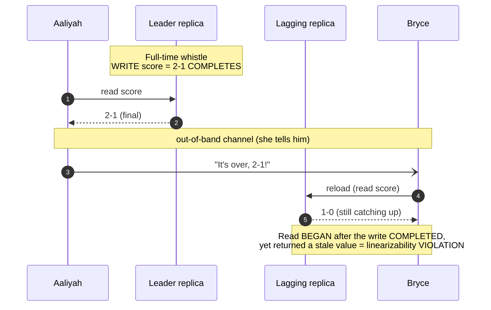
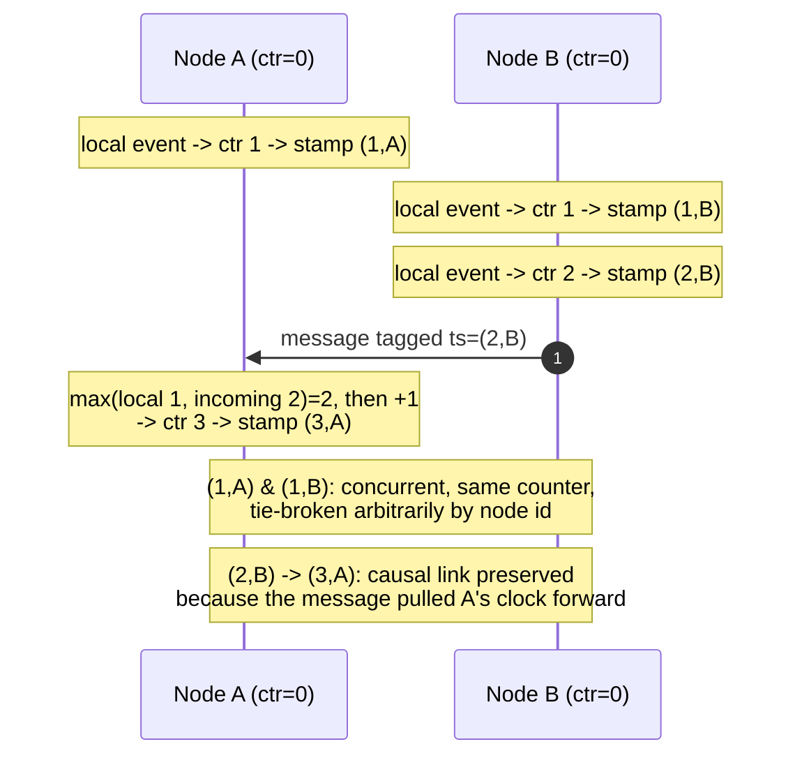

# Linearizability & Ordering

> **Prerequisites:** [Faults, Clocks & Time](/synapse/system-design-from-first-principles/distributed-data/faults-clocks-and-time), [Replication](/synapse/system-design-from-first-principles/distributed-data/replication) | **You'll be able to:** define linearizability precisely and spot a violation from a timeline, decide when a system genuinely needs it versus when a weaker guarantee suffices, and reason about causal versus total ordering well enough to see why consensus is the next chapter.

## The problem (why this exists)

You replicate data so a machine can die without taking your service down. But the moment you keep more than one copy, you open a gap between them. A write lands on one replica; a read a millisecond later hits another that hasn't caught up. Now two clients, asking the same question at the same instant, get different answers. Replication buys fault tolerance and charges you inconsistency in return [p. 401].

There are two honest ways to cope. You can **expose** the gap to the application and let developers reason about stale reads and conflicting writes — this is eventual consistency, the world of multi-leader and leaderless replication you met in [Replication](/synapse/system-design-from-first-principles/distributed-data/replication). Or you can **hide** the gap entirely and make the whole cluster behave as if there were just one copy of the data, updated in real time. That second promise is what people mean, usually vaguely, by "strong consistency" [p. 401].

The trouble is that "strong consistency" is a marketing phrase until you pin it down. Does it mean my read never lags? That two writers can't both think they won? That transactions don't interleave weirdly? These are *different* guarantees, and conflating them is one of the most expensive confusions in system design. This lesson pins down the precise one — **linearizability** — shows what it costs, and then argues that the real subject underneath it is **ordering**: which event came before which, the hard problem that consensus exists to solve.

## Intuition first

Forget replicas, quorums, and clocks for a moment. Imagine the data lives in a **single variable on a single machine**, and every read and write touches that one variable, one at a time, instantaneously. There is never any ambiguity: once you write `x = 2`, the very next read — by you or anyone — returns `2`. No "which copy did I hit?" because there is only one copy; no "is this fresh?" because a write takes effect at a single instant and everyone after sees it.

**Linearizability is the promise that a distributed system behaves exactly like that imaginary single variable**, even though under the hood there are many replicas and a lossy network between them [pp. 402–403]. DDIA calls it, in two words worth memorizing, a **"recency guarantee"**: as soon as one client's write completes, every subsequent read — from *any* client — must return that value or a newer one, never older [p. 403]. No stale caches; no lagging replica visible to anyone.

The beginner takeaway is that sentence: **act as if there is one copy of the data, updated in real time.** Everything below is what it takes to keep that illusion alive.

One sharpening: linearizability is about a **single object** — DDIA calls it a *register*: one key in a key-value store, one row, or one document [p. 404]. It is *not* about grouping several operations into an all-or-nothing transaction. Hold that thought; it becomes the classic interview trap later.

## How it works

### What a linearizable history looks like

Because the network delays messages unpredictably, a client never knows the exact instant its operation took effect — only that it happened *somewhere* between sending the request and receiving the response [p. 404]. Linearizability constrains what answers are legal across that uncertainty with two rules:

1. A read that **completes before** a write begins must return the old value; a read that **begins after** the write completed must return the new value. A read that **overlaps** the write may return either — the write may "take effect" anywhere inside its window [pp. 404–405].
2. There is a **single instant** at which the register atomically flips. So once *any* read returns the new value, every later read — by any client — must too; it may not flip back and forth [p. 405].

Rule 2 makes it a *recency* guarantee, not merely "eventually consistent": it forbids reading `2`, telling a colleague, and having their read a second later return `1`.

That is DDIA's sports-website example. The match ends; a write sets the final score. Aaliyah refreshes, sees it, and tells Bryce out loud, "it's over, 2–1." Bryce reloads — his request lands on a replica still catching up, showing the game in progress. Aaliyah's read *completed* before Bryce's *began*, so linearizability demands he see at least as fresh a value. He didn't — and the violation is observable only because a second channel, Aaliyah's voice, leaked information faster than replication did [pp. 403–404].



If the system *were* linearizable, Bryce's read — beginning strictly after Aaliyah's completed — would be forced to return `2-1` or newer, no matter which replica it touched.

### A third operation: compare-and-set

Reads and writes alone don't capture everything. The decisive primitive is **compare-and-set**: `CAS(x, expected, new)` atomically sets `x` to `new` **only if** `x` currently equals `expected`, else fails [p. 406]. CAS expresses "I want to be the one who changes this, only if nobody beat me to it" — the atom under locks, leader election, and uniqueness. A linearizable CAS is strictly harder than linearizable reads/writes, and (spoiler) can't be built on quorums alone — it needs consensus [p. 413].

### What makes a real system linearizable — or not

Map it onto the replication strategies from [Replication](/synapse/system-design-from-first-principles/distributed-data/replication):

- **Single-leader replication** *can* be linearizable, if reads and writes go to the leader **and you actually know who the leader is**. A "delusional" former leader still serving requests violates it, and asynchronous failover can lose a committed write [p. 411]. Knowing who the true leader is itself requires consensus.
- **Consensus algorithms** (Raft, etc.) are single-leader replication with automatic, safe leader election bolted on — so they *can* be linearizable, though reads served without re-confirming leadership can be stale [pp. 411–412].
- **Multi-leader replication** is never linearizable — concurrent writes on different leaders conflict [p. 412].
- **Leaderless / quorum replication** is *probably not* linearizable, and this surprises people. Even with `w + r > n` — the condition that supposedly guarantees reader/writer overlap — variable network delay yields a nonlinearizable history: a read begun after another completed can still return an *older* value [p. 412]. And last-write-wins on time-of-day clocks (Cassandra, ScyllaDB) is almost certainly nonlinearizable, since skew misorders writes [p. 412]. You can bolt linearizability onto Dynamo-style quorums with synchronous read repair, at a cost — but never a linearizable CAS [pp. 412–413].

The through-line: `w + r > n` guarantees you *overlap* with the latest write, not that you *order* consistently with real time. Overlap is not recency.

### When you actually need it

Linearizability is expensive, so spend it only where correctness genuinely depends on a single, agreed, up-to-date value [pp. 408–409]:

- **Locking and leader election.** Single-leader systems must have exactly one leader; two is **split brain**. The lease that elects it must be linearizable, or two nodes hold it at once. This is what ZooKeeper and etcd are *for*.
- **Uniqueness constraints.** One account per email, one username, one booking per seat — each is an atomic CAS on that name at write time. Without linearizability, two concurrent requests both "win."
- **Cross-channel timing dependencies.** DDIA's video-transcoder race: a web server writes the raw file to storage, then queues a "transcode this" message. If the file store isn't linearizable, the message outruns internal replication and the worker fetches a file that isn't there yet — corrupting the job permanently [p. 410]. Two channels connecting two components is the recurring shape of this bug; you saw its cousin (fencing a paused leader) in [Faults, Clocks & Time](/synapse/system-design-from-first-principles/distributed-data/faults-clocks-and-time).

When you *don't* need it: loosely-enforceable constraints. Overselling a flight is recoverable — rebook and apologize [pp. 409–410]. Foreign-key and many attribute constraints don't need it either. Ask: "does correctness break, or is this just untidy and fixable after the fact?"

### The cost: CAP, and latency even without faults

Here's the bill. Picture two datacenters, a client near each, the link cut — a **network partition**. With multi-leader replication, each side keeps taking writes and reconciles later: available, but not linearizable [pp. 413–414]. With single-leader (or consensus) replication, the side *without* the leader can't do writes or linearizable reads at all — those clients get an outage until the link heals [pp. 413–414].

That fork is the entire content of the **CAP theorem**: any linearizable system, when partitioned, must choose **CP** (stay consistent, become unavailable on the cut-off side) or **AP** (stay available, give up linearizability) [pp. 414–415]. The better phrasing DDIA endorses is "**consistent *or* available when partitioned**" — you don't "pick two of three," because a partition is a fault that happens *to* you, not a property you choose [p. 416]. Formal CAP is narrow to the point of near-uselessness for design: one consistency model (linearizability), one fault (partitions), which Google data pins at **under 8%** of incidents [p. 415]. Real work needs the fuller PACELC framing — *Else, Latency vs Consistency* — developed later in this module.

The part people miss: **linearizability costs you even when nothing is broken.** By the Attiya–Welch result, if you insist on linearizability the response time of reads and writes is *at least proportional to the uncertainty in network delay* — so on a jittery network linearizable operations are inescapably slow, and no cleverer algorithm rescues you [p. 417]. Even RAM on a multi-core CPU isn't linearizable without a memory barrier, because each core has its own cache and store buffer — dropped purely for **performance, not fault tolerance** [pp. 416–417]. Most systems abandon linearizability for everyday speed, not just to survive partitions.

### The deeper idea: ordering

Step back and ask *why* linearizability is hard, and you reach something more fundamental: **ordering**. Linearizability is really the demand for a single, total, real-time-consistent order that every node agrees on — and much of its cost is the cost of agreeing on one order.

**Total order** means any two operations are comparable: for every pair, everyone agrees which came first. A linearizable register imposes a total order consistent with real time. It is expensive precisely because it forces a decision even between operations that never interacted.

**Causal order** is the weaker, cheaper, often *sufficient* alternative. It orders only related operations: if A *could have influenced* B — you read a value, then wrote based on it — everyone must agree A came first. Genuinely concurrent operations (neither could have seen the other) are left unordered. Causal consistency is, in fact, the **strongest model that stays available under a partition** — it doesn't force the CAP choice. For many requirements — "don't show the reply before the comment," "don't show the photo before the privacy setting meant to hide it" — causal order is all you need.

So the real design question is rarely "linearizable or not?" It's "do I need *total* order here, or does *causal* order suffice?" Total order (and thus linearizability) is what you pay consensus for; causal order is often far cheaper.

### Capturing order without a global clock: logical clocks

How do you establish order across machines when — per [Faults, Clocks & Time](/synapse/system-design-from-first-principles/distributed-data/faults-clocks-and-time) — you must **never** order events by wall-clock time, because every clock drifts and NTP skew silently misorders them? A **logical clock**: an algorithm that *counts events* instead of *measuring time* [pp. 419–420]. Its timestamps tell you nothing about what o'clock it is; they only compare which of two events is earlier.

The classic is a **Lamport clock** (Lamport, 1978). Each node keeps a counter and follows two rules [pp. 420–421]:

- On generating any event, increment your counter.
- On receiving a message with a foreign counter greater than your own, jump yours up to match (then increment on your next event).

The timestamp is the pair **(counter, node ID)**; the node ID breaks ties so every timestamp is globally unique — e.g. `(1,"A") < (1,"C") < (2,"B")`, comparing counters first, then node IDs [p. 421]. The forward-jump rule makes it *causal*: if A happened-before B, A's timestamp is less than B's. So it gives a **total order consistent with causality** — but, crucially, **not linearizability** [p. 420].



Two limits. First, Lamport timestamps have **no relation to physical time**, so you can't ask "what happened Tuesday" without storing wall time separately, and nodes that never talk drift to wildly different counters [p. 421]. **Hybrid logical clocks (HLC)** fix this by seeding the counter with physical-clock units while keeping the forward-jump, so the timestamp reads almost like wall time yet stays causally consistent and monotonic even when NTP steps backward — CockroachDB uses this [pp. 421–422]. Second, Lamport and HLC **flatten concurrency**: given two timestamps you can't tell whether they were causally ordered or concurrent. To *detect* concurrency (surfacing a conflict rather than silently picking a winner), use a **vector clock** — a counter per node, stored per write — which distinguishes "A before B," "B before A," and "concurrent," at the cost of timestamps growing with node count [p. 422]. That's the machinery behind sibling detection in leaderless replication.

### Why logical clocks still aren't enough — linearizable ID generators

Here is the wall that pushes us toward consensus. Consider a distributed **ID generator**. A single-node autoincrementing counter is simple, fits in 64 bits, encodes creation order, and is itself linearizable (an atomic fetch-and-add) — but it's a single point of failure, a throughput bottleneck, and brutal for a client on the other side of the planet [pp. 417–418]. Every alternative trades away order: sharded ranges and preallocated blocks lose ordering; random UUIDv4 has none; wall-clock-prefixed schemes (Snowflake, UUIDv7, ULID) give only *approximate* order, since a fast clock on an earlier write can outrun a slow clock on a later one [pp. 418–419].

Surely a Lamport/HLC generator fixes it? Not quite — and the gap is the whole point. Linearizability demands that **if A completed before B began, B gets the higher ID — even if A and B ran on nodes that never communicated** [p. 423]. A Lamport clock only promises a node's timestamp exceeds the ones it has *actually seen*; two nodes that never exchanged a message can have counters in any relation. DDIA's example: you set your account private on your laptop, then upload a photo from your phone. If the two actions hit different databases with a nonlinearizable generator, the photo can get a *lower* timestamp than the privacy change — so a viewer's snapshot sees the photo while the account still reads public [pp. 423–424]. Causal order didn't save you, because the devices never talked; only *real-time* recency would have.

The fix is a genuinely **linearizable ID generator**: a single node that atomically increments and returns a counter, persists it so a crash can't hand out duplicates, and replicates for fault tolerance — TiDB/TiKV's **timestamp oracle**, after Google's Percolator [p. 424]. Hand out IDs in **batches** to amortize persist-and-replicate; a crash may then *skip* IDs but never duplicate or reorder [p. 424]. You can't shard it without breaking order, so every request funnels to one region — tolerable, since one node serves this simple job at high throughput. (Spanner takes the other road: physical clocks returning a time *range*, *waiting out the uncertainty* for linearizable order with no communication — but only by buying synchronized clock hardware [pp. 424–425].)

Notice what the linearizable generator quietly required: a single node everyone agrees is *the* generator, with safe failover. That is consensus. A logical clock alone can't enforce a lock or uniqueness constraint, because a node can never *know* its timestamp is the lowest without hearing from every node that might have generated one — and if one is unreachable, the scheme stalls: not fault-tolerant [p. 425]. Fault-tolerant agreement on a single value needs something stronger: **consensus**, the next lesson.

## Trade-offs

| Guarantee | Gives you | Costs you | Use when |
| --- | --- | --- | --- |
| Linearizability (total order) | Recency: reads never stale; safe CAS, locks, uniqueness | Latency ∝ network-delay uncertainty *always*; unavailable on the cut-off side under a partition (CP) | Leader election, uniqueness, seat/inventory booking, cross-channel handoffs |
| Causal consistency | Agreement on cause→effect order; stays available under partition | Concurrent ops unordered; needs metadata (vector clocks) to track dependencies | Comments/replies, collaborative editing, "hide-before-reveal" ordering |
| Eventual consistency | Highest availability, lowest latency | Stale reads, conflicts surfaced to the app | Caches, feeds, counters where "off by a bit, briefly" is fine |
| Single-node autoincrement ID | Linearizable, ordered, compact (64-bit) | SPOF, throughput bottleneck, bad for remote regions | Small/regional systems; the mental baseline |
| Wall-clock-prefixed ID (Snowflake/UUIDv7) | Local generation, no coordination, roughly time-ordered | Only *approximate* order (clock skew inverts pairs); not linearizable | Distributed ID at scale where exact order isn't required |
| Linearizable ID oracle (timestamp oracle) | Exact order + fault tolerance | Single region; every request funnels through it | MVCC/transaction IDs needing true recency |

## Numbers that matter

- **Autoincrement ID width:** 64 bits comfortably; 32 bits is risky above ~4 billion records [p. 417]. Random UUIDv4 is 128 bits with no ordering [pp. 418–419].
- **Linearizable latency floor:** response time is *at least proportional to the uncertainty of network delay* (Attiya–Welch); no faster linearizable algorithm exists [p. 417]. So your network jitter [percentiles](/synapse/system-design-from-first-principles/foundations/latency-throughput-percentiles) directly bound your linearizable p99.
- **Partitions as a fault source:** under 8% of incidents in Google's data — CAP optimizes for a rare case [p. 415].
- **Lamport timestamp size:** a compact `(counter, node ID)` pair. A vector clock is ~one integer *per node* — reach for it only when you must *detect* concurrency [p. 422].

For back-of-envelope ID throughput and cross-region round-trips, see [Estimation & Numbers](/synapse/system-design-from-first-principles/foundations/estimation-and-numbers).

## In production

**etcd and ZooKeeper** are the industry's linearizability workhorses, existing precisely because it's hard enough not to roll your own. Both provide linearizable writes via consensus; an operational subtlety is that **ZooKeeper's reads may be stale** (not guaranteed from the current leader), while **etcd since v3 gives linearizable reads by default** [pp. 408, 436]. Kubernetes stores all cluster state in etcd for exactly this reason — one agreed, up-to-date view of "what should be running." A service doing leader election "using ZooKeeper" is buying a linearizable lease plus a monotonic fencing token against the paused-zombie problem from the faults lesson.

**Snowflake-style ID generators** (X/Twitter, now echoed by UUIDv7, ULID, Hazelcast Flake, MongoDB ObjectIDs) are the pragmatic answer when you *don't* need exact order: a wall-clock prefix in the high bits, machine and sequence bits below, generated locally with zero coordination [pp. 418–419]. The trade is that IDs are only *roughly* time-sorted — fine for a URL shortener key or a tweet ID, unacceptable for a transaction commit order.

**CockroachDB** ships hybrid logical clocks to timestamp transactions with causal consistency and no special hardware [p. 422]; **Google Spanner** took the capital-intensive path — GPS and atomic clocks in every datacenter (TrueTime) to bound clock uncertainty and *wait it out*, buying linearizable ordering across continents with no cross-node communication [pp. 424–425]. Two philosophies, same problem: order without a trustworthy global clock.

**Riak and Cassandra** sit on the other side: Riak skips synchronous read repair for performance; Cassandra waits on it for quorum reads but *still* loses linearizability because its last-write-wins uses time-of-day clocks [pp. 412–413]. So don't reach for Cassandra as a lock service or uniqueness enforcer — a common mistake.

## Pitfalls & interview traps

<div style="border-left:4px solid #da5233;background:rgba(218,82,51,0.08);padding:0.6rem 1rem;border-radius:0 0.5rem 0.5rem 0;margin:1.25rem 0">

⚠️ **Linearizability ≠ serializability.** They sound alike and get swapped constantly, but answer different questions. **Serializability** is a *transaction isolation* level: multi-object transactions behave as if run one-at-a-time in *some* serial order that **need not match real time**, so stale reads are allowed [pp. 407–408]. **Linearizability** is a *recency* guarantee on *single-object* reads/writes: no transactions, no protection against cross-object write skew, but any later operation must observe a state at least as new as any earlier completed one [pp. 407–408]. Providing **both** is **strict serializability** (strong-1SR) — Spanner and FoundationDB offer it; CockroachDB gives serializability with only *some* recency, skipping the expensive cross-transaction coordination strict serializability needs [p. 408]. In an interview: *linearizability is about a single register being fresh; serializability is about a group of operations not interleaving badly.* The two can be chosen largely independently [p. 408].

</div>

Other traps that catch people:

- **"Quorum reads (`w + r > n`) are linearizable."** No. Overlap with the latest write is not consistent real-time ordering; DDIA shows a nonlinearizable execution even at `n=3, w=3, r=2` [p. 412]. So Dynamo-style replication is not strongly consistent by default, and never gives you CAS.
- **"Everything should be linearizable to be safe."** It's a *latency tax you pay all the time*, not just under partition [p. 417]. Reserve it for the operations where correctness truly breaks; use causal or eventual consistency elsewhere.
- **"We'll order events by timestamp."** Wall-clock ordering across nodes is a bug, per [Faults, Clocks & Time](/synapse/system-design-from-first-principles/distributed-data/faults-clocks-and-time). Use logical/HLC clocks for causal order; a linearizable oracle for real-time recency.
- **"CAP means pick two of three."** The honest framing is *consistent or available **when partitioned*** — normal-operation availability is never in tension with consistency the way the triangle implies [p. 416].

## Check yourself

```quiz
{"prompt": "A read that BEGINS strictly after another client's write has COMPLETED returns the value from before that write. Which guarantee is violated?", "options": ["Serializability", "Linearizability", "Causal consistency", "Read-your-writes"], "answer": "Linearizability"}
```

```quiz
{"prompt": "Which statement correctly distinguishes linearizability from serializability?", "options": ["Linearizability groups operations into transactions; serializability is per-object", "Linearizability is a recency guarantee on a single object; serializability is an isolation level over multi-object transactions whose serial order need not match real time", "They are two names for the same guarantee", "Serializability guarantees reads are never stale; linearizability allows stale reads"], "answer": "Linearizability is a recency guarantee on a single object; serializability is an isolation level over multi-object transactions whose serial order need not match real time"}
```

```quiz
{"prompt": "You need a distributed ID generator whose IDs are EXACTLY ordered by real time — if A finished before B started, A must get the smaller ID, even if the two nodes never communicated. Which approach delivers this?", "options": ["Lamport/hybrid-logical-clock timestamps generated per node", "Random UUIDv4 generated locally", "A linearizable single-node timestamp oracle (or Spanner-style clock-uncertainty wait)", "Snowflake IDs with a wall-clock prefix"], "answer": "A linearizable single-node timestamp oracle (or Spanner-style clock-uncertainty wait)"}
```

```quiz
{"prompt": "Under a network partition, a linearizable single-leader database on the side WITHOUT the leader will:", "options": ["Keep accepting writes and reconcile later", "Serve writes and linearizable reads normally", "Refuse writes and linearizable reads until the link heals (CP)", "Silently return stale data as if nothing happened"], "answer": "Refuse writes and linearizable reads until the link heals (CP)"}
```

<details>
<summary>Why does a Lamport clock give total order consistent with causality, yet still fail to provide a linearizable ID generator?</summary>

The forward-jump-on-message rule guarantees that if A *happened-before* B (a chain of messages links them), A's timestamp is smaller — causal order, totalized by the `(counter, node ID)` tie-break. But linearizability demands more: if A *completed in real time* before B *began*, B must get the larger ID **even if the two never exchanged a message**. Nodes that never communicate can have counters in any relation, so a later-in-real-time event can get a smaller Lamport timestamp. Lamport captures *causal* precedence, not *real-time* recency — and recency is what linearizability adds [pp. 420, 423].

</details>

<details>
<summary>Your team wants to enforce "one account per email address" across a sharded, multi-region user service. Which consistency guarantee do you need, and why can't a Snowflake-style ID generator or a Lamport clock provide it?</summary>

You need **linearizability** on the check — an atomic compare-and-set on the email key, so two concurrent signups can't both succeed [p. 409]. A Snowflake/UUID generator only hands out *distinct* identifiers; it says nothing about whether two requests for the *same* email raced. A Lamport clock can order events it has seen but can't let a node *know* its proposal is the winner without hearing from every node that might have proposed the same email — and if one is unreachable, it stalls, so it isn't fault-tolerant [p. 425]. Fault-tolerant agreement on a single winner is the definition of **consensus** — which is why uniqueness constraints route through a consensus-backed store (etcd/ZooKeeper) or a linearizable database, not a bare ID generator.

</details>

## PoC — Proof of concepts

The consistency hierarchy this lesson formalises, mapped and stress-tested:

- [Jepsen — consistency models](https://jepsen.io/consistency) — the definitive map from linearizable
  down through causal to eventual, with the phenomena that separate each level.
- [Please stop calling databases CP or AP](https://martin.kleppmann.com/2015/05/11/please-stop-calling-databases-cp-or-ap.html)
  — Kleppmann on why linearizability (not "consistency" in the vague sense) is the property CAP is
  actually about.
- [Jepsen analyses](https://jepsen.io/analyses) — real systems caught violating the ordering they
  claimed to provide; where the theory meets an actual failing test.

## Sources

- DDIA2 ch. 10 pp. 401–402 (eventual vs strong consistency; two philosophies)
- DDIA2 ch. 10 pp. 402–407 (linearizability defined; recency guarantee; register; read/write/CAS rules; vs weaker models)
- DDIA2 ch. 10 pp. 407–408 (linearizability vs serializability; strict serializability / strong-1SR)
- DDIA2 ch. 10 pp. 408–411 (relying on linearizability: locks/leader election, uniqueness, cross-channel race; implementing it across replication strategies)
- DDIA2 ch. 10 pp. 412–413 (quorums not linearizable; Dynamo-style; CAS needs consensus)
- DDIA2 ch. 10 pp. 413–417 (cost of linearizability; CAP; PACELC; performance-not-fault-tolerance; Attiya–Welch bound)
- DDIA2 ch. 10 pp. 417–422 (ID generators; single-node autoincrement; distributed alternatives; logical clocks; Lamport; hybrid logical; vector clocks)
- DDIA2 ch. 10 pp. 423–425 (linearizable ID generators; timestamp oracle; Spanner clock-uncertainty wait; why logical clocks can't enforce constraints → consensus)
- DDIA2 ch. 9 pp. 358, 367–369 (clock drift, NTP skew, process pauses — why wall-clock ordering across nodes is unsafe; carried via the Faults, Clocks & Time lesson)
