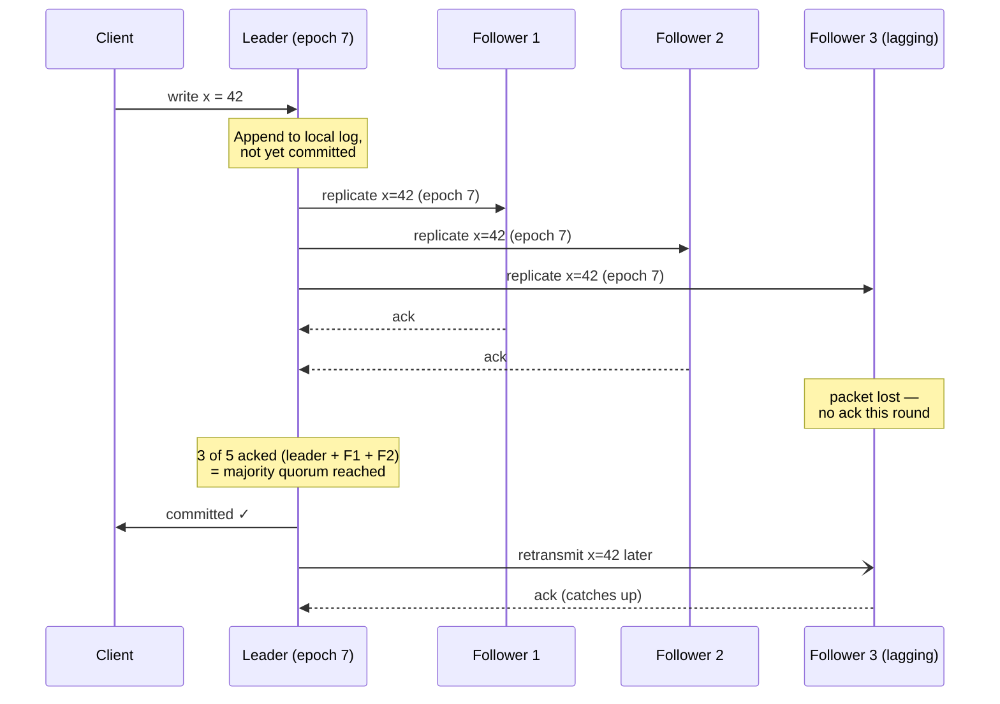
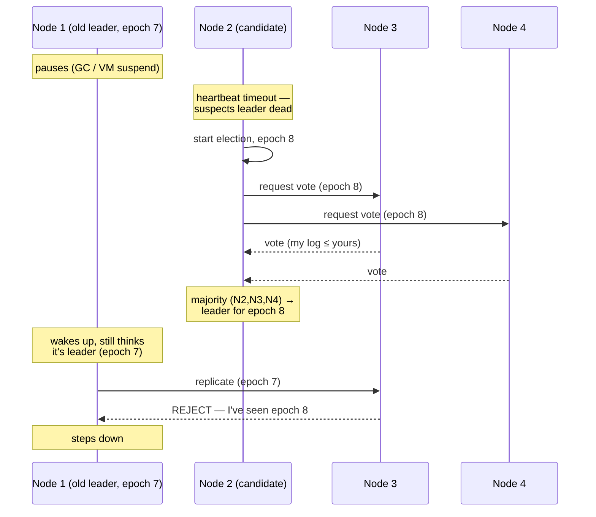

# Consensus & Coordination

> **Prerequisites:** [Linearizability & Ordering](/synapse/system-design-from-first-principles/distributed-data/linearizability-and-ordering), [Faults, Clocks & Time](/synapse/system-design-from-first-principles/distributed-data/faults-clocks-and-time) | **You'll be able to:** explain what consensus is and recognize the many everyday problems that are secretly the same problem; state the FLP impossibility result honestly and say how real systems get around it; and decide when to reach for a coordination service like ZooKeeper or etcd — and why you should almost never build consensus yourself.

## The problem (why this exists)

Everything in the [Faults, Clocks & Time](/synapse/system-design-from-first-principles/distributed-data/faults-clocks-and-time) lesson pointed at one uncomfortable conclusion: a node can know almost nothing for certain about the other nodes. Silence is ambiguous, clocks disagree, and a process can black out mid-function and wake up to find the world has moved on. Yet a huge amount of what we want a distributed system to do reduces to a single, deceptively simple request:

**Get a set of machines to agree on one value.**

Which follower becomes the new leader after the old one dies? Who holds the lock on this file right now? Was this username claimed first by Aaliyah or by Bryce? Did *every* shard in this transaction agree to commit, or must they all abort? In what order did these writes happen, so that every replica applies them identically? Each of these is a group of machines that must arrive at one answer — and stick to it — even though some of them may be slow, crashed, or unreachable at the worst possible moment.

On a single machine, all of these are trivial: a mutex, an autoincrement column, one `if` statement. The difficulty is *entirely* a product of wanting fault tolerance [p. 428]. And when you get it wrong, you get the split-brain corruption bugs that haunt real systems: two nodes both convinced they are the leader, both writing, both overwriting each other. This lesson is about the mechanism that lets a group agree safely — **consensus** — and, just as importantly, about why you should reach for an existing implementation of it rather than rolling your own.

## Intuition first

Start with no computers: a committee must pick one restaurant for dinner. People shout suggestions. How do you guarantee everyone walks out believing the *same* decision, even if a couple of members leave the room partway through? Two ideas get you most of the way, and they are the heart of every real consensus algorithm:

**Majority rules.** A decision is "official" only once **more than half** the members agree to it. This works because two different majorities of the same group must share at least one member — so you can never have two conflicting decisions each "officially" approved. If Aaliyah's proposal got 3 of 5 votes and Bryce's also claimed 3 of 5, at least one person voted for both, which isn't allowed. The overlap is the safety net. As a bonus, a majority can proceed even if a minority has left: with 5 members you tolerate 2 walking out and still have 3 to form a majority [pp. 428–429, 372–373].

**Have one person run the meeting at a time.** Free-for-all shouting is chaos. It's simpler if one member acts as chair, collects proposals, and announces decisions — everyone else just agrees or disagrees. The trick is what happens when the chair leaves: a new chair must be chosen *without* two people simultaneously believing they're in charge. The fix is to number the chairmanships — chair #1, then #2, then #3 — so if a stale chair #1 wakes up and tries to run the meeting, everyone sees #2 is now in charge and ignores them.

That's it, at an intuition level. **Getting machines to agree needs a majority vote and a leader**, plus a way to hand off leadership cleanly. A beginner can stop here and be roughly right. The rest of this lesson makes those two ideas precise, shows why even they can't *guarantee* progress in the worst case (FLP), and shows what a real coordination service gives you on top of it all.

## How it works

### What consensus formally asks for

The textbook formulation of consensus is: one or more nodes **propose** values, and the algorithm **decides** on one of them, subject to four properties [pp. 427–428]:

- **Uniform agreement** — no two nodes decide differently.
- **Integrity** — once a node has decided, it never changes its mind.
- **Validity** — if a node decides value *v*, then *v* was proposed by some node (this rules out the cheat of "always decide `null`").
- **Termination** — every node that doesn't crash eventually decides.

The first three are **safety** properties — a violation is a specific, irreversible moment you can point to. The fourth, termination, is a **liveness** property — "something good eventually happens" [p. 428]. That split (from the [Faults, Clocks & Time](/synapse/system-design-from-first-principles/distributed-data/faults-clocks-and-time) lesson) is the whole game: without fault tolerance the safety properties are trivial (hardcode a dictator that always wins), and **all** the difficulty lives in termination when nodes can crash and stay gone [p. 428].

### The many faces of consensus

Here is the insight that makes consensus worth a whole lesson: a family of unrelated-looking problems are **exactly equivalent** — a solution to any one converts mechanically into a solution for all the others [pp. 426–427]. That's why we lump them under one name.

| Problem | What it looks like | Why it's consensus |
| --- | --- | --- |
| Single-value agreement | Elect a leader; grant a lock/lease | Nodes propose "me"; one is decided [p. 427] |
| Linearizable compare-and-set | Atomic CAS on a register | Each proposer does `CAS(null → me)`; the winner is decided [p. 429] |
| Uniqueness constraint | First to claim a username/email wins | A CAS on the name — same as above [p. 409] |
| Total order broadcast | A shared append-only log all nodes read in one order | One consensus instance per log slot [pp. 429–431] |
| Atomic commit | All shards in a distributed txn commit, or all abort | Decide "commit" only if none voted abort [p. 432] |
| Fetch-and-add | A linearizable counter / ID generator | Solvable via CAS — *but with a catch, below* [p. 431] |

The most practically useful member of the family is the **shared log**, formally **total order broadcast**: a protocol that delivers messages to every node in the same order [p. 430]. If every entry is a write and every replica applies entries in that fixed order with deterministic logic, all replicas converge — this is **state machine replication**, exactly how a consensus-backed database keeps its copies identical [p. 433]. It's the idea underneath [single-leader replication](/synapse/system-design-from-first-principles/distributed-data/replication) and behind [distributed transactions'](/synapse/system-design-from-first-principles/distributed-data/distributed-transactions) atomic commit.

One member is a near-miss worth knowing: **fetch-and-add** (a plain counter) can be built from CAS, but alone it solves consensus for only **two** proposers — if three nodes race and the winner crashes before announcing itself, the losers can't tell who won or safely proceed. It has a **consensus number of 2**, whereas CAS and shared logs have a consensus number of **∞** [pp. 431–432]. The takeaway: a bare atomic counter is *not* enough to build leader election on.

### The honest bad news: FLP

Before we build anything, we have to be honest about a limit. The **FLP result** (Fischer, Lynch, and Paterson) proves that **no deterministic algorithm can *guarantee* it will always reach consensus if even one node may crash** [p. 426].

Read that carefully, because it's routinely overstated. FLP does *not* say consensus is impossible — real systems reach consensus millions of times a day. It says three specific things:

1. It applies to the **fully asynchronous** model — no clocks, no timeouts, no bound on message delay.
2. It bites the **termination** (liveness) property only. Safety is never at risk.
3. So you can't promise consensus will *always terminate in bounded time* in that model.

The escape hatch is exactly what real networks give you: **timeouts and randomization**. The moment a node may use a clock to *suspect* another node has died — even if that suspicion is sometimes wrong — consensus becomes solvable in practice [p. 426]. Real algorithms lean on partially-synchronous timing: the network behaves most of the time and only occasionally misbehaves, a realistic model of the systems we run. So FLP is not a wall; it's the reason every practical consensus system has a *timeout knob* and occasionally wastes time on a spurious election.

<div style="border-left:4px solid #15448e;background:rgba(21,68,142,0.08);padding:0.6rem 1rem;border-radius:0 0.5rem 0.5rem 0;margin:1.25rem 0">

**Definition — the non-Byzantine assumption.** All the mainstream algorithms (Raft, Paxos, Viewstamped Replication, Zab) assume nodes are *unreliable but honest*: they may crash, restart, disconnect, or be slow, but if they respond they follow the protocol and tell the truth [p. 426]. Tolerating nodes that actively *lie* (Byzantine faults) is a harder, more expensive problem used in blockchains, and is out of scope here.

</div>

### How leader-based consensus actually runs

Nearly every practical algorithm — Raft, Multi-Paxos, Viewstamped Replication, Zab — shares one skeleton, and you can reason about all of them without the papers [pp. 434–435]:

1. **A quorum elects a leader.** Nodes vote; a candidate that collects votes from a majority becomes leader.
2. **Every proposal needs a second quorum vote.** Before a value (a log entry) is confirmed, the leader replicates it to a majority and waits for their acknowledgment. Only then is it "committed" and safe to tell the client.

That's **two rounds of voting** — one to elect, one per proposal — and their quorums must overlap, so a successful proposal always shares a node with the latest election [p. 435]. Because each round needs only a *majority*, the system tolerates a minority being down.

Here is a single proposal flowing through a five-node cluster, including a follower that misses the round entirely — and how it's still committed and later caught up:



Notice what majority buys you: the write is confirmed **without** waiting for the slow follower. F3 catching up later doesn't change the decision — the value was committed the instant a majority held it, and any future leader is guaranteed to have it, because a new election also needs a majority, which must overlap the one that committed this write.

### Electing a leader without two leaders

The subtle part is leadership handoff. There's an apparent chicken-and-egg — you need consensus to elect a leader, but a leader to run consensus. The knot is cut by not requiring a unique leader *at all times*. Instead, each algorithm defines an **epoch number** (a *term* in Raft, a *ballot* in Paxos, a *view* in Viewstamped Replication) and guarantees the leader is unique **within** one epoch [pp. 434–435].

When a node suspects the leader has died (its heartbeat timed out), it starts an election with a **higher** epoch number. If an old leader was merely paused and wakes up, its epoch is now stale; the moment it tries to act, other nodes see a higher epoch exists and refuse it. Conflicts are resolved in favor of the higher epoch. A node votes for a candidate only if it isn't already aware of a higher-epoch leader.



Algorithms differ only in how they ensure the new leader doesn't lose entries the old one already committed. Raft only lets a node become leader if its log is at least as up-to-date as a majority of followers; Paxos lets any node become leader but forces it to catch up first [pp. 435–436]. Both preserve the golden rule: **a committed entry is never lost, and two nodes never both act as leader in a way that corrupts data.**

These two voting rounds resemble two-phase commit but differ crucially: in consensus, *any* node can start an election and needs only a **quorum** to respond, whereas [2PC](/synapse/system-design-from-first-principles/distributed-data/distributed-transactions) has a single coordinator that needs a "yes" from *every* participant [p. 435]. That's why 2PC blocks when one participant dies, and consensus doesn't.

### Coordination services: consensus you rent

You now understand consensus well enough to see why almost nobody implements it from scratch. Instead, they use a **coordination service** — ZooKeeper, etcd, or Consul (all modeled on Google's Chubby) [pp. 437–438]. These hold a small amount of data in memory, durably replicated across a fixed node set via a proven algorithm (ZooKeeper uses Zab, etcd uses Raft), and package the raw agreement primitive into features you actually want:

- **Locks and leases** via a fault-tolerant atomic CAS — only one client acquires at a time [p. 438].
- **Fencing tokens** — a monotonically increasing ID granted with each lock (ZooKeeper's `zxid`, etcd's revision) that storage uses to reject a stale write from a paused zombie [p. 438] — the exact fix from the [Faults, Clocks & Time](/synapse/system-design-from-first-principles/distributed-data/faults-clocks-and-time) lesson, now built in.
- **Failure detection** — clients hold heartbeated sessions; a lease whose client stops heartbeating past the timeout is auto-released (ZooKeeper's **ephemeral nodes**) [p. 438].
- **Change notifications** — clients subscribe to a key and are told when it changes, learning when a peer joins or dies without polling [p. 438].

A dedicated coordination service runs on a **fixed, small ensemble — usually 3 or 5 nodes — regardless of how large the cluster it coordinates is** [pp. 439–440]. It's built for slow-changing, coordination-shaped data ("IP 10.1.1.23 is the leader for shard 7," changing over minutes or hours), not high write volume. This is the standard way to do leader election for a [single-leader database](/synapse/system-design-from-first-principles/distributed-data/replication), assign shards to nodes, or elect a primary among workers — the pattern behind a [distributed job scheduler](/synapse/system-design-from-first-principles/case-studies/job-scheduler) picking one active scheduler, or [Uber](/synapse/system-design-from-first-principles/case-studies/uber) and [Google Docs](/synapse/system-design-from-first-principles/case-studies/google-docs) coordinating stateful components.

One efficiency note on *reads*: not every read needs full consensus. Service discovery — "where is service X right now?" — usually doesn't need linearizability, so it's better served from a TTL cache (DNS-style) or from ZooKeeper **observers**, which receive the log and serve possibly-stale but highly-available reads without joining the vote [p. 440].

```d2
classes: {
  client: {style: {fill: "#f3f4f6"; stroke: "#6b7280"}}
  edge:   {style: {fill: "#dbeafe"; stroke: "#2563eb"}}
  svc:    {style: {fill: "#dcfce7"; stroke: "#16a34a"}}
  data:   {style: {fill: "#ffedd5"; stroke: "#ea580c"}}
  async:  {style: {fill: "#f3e8ff"; stroke: "#9333ea"}}
}

app1: "App node A\n(wants the shard-7 lease)" {class: svc}
app2: "App node B\n(standby)" {class: svc}
app3: "App node C\n(standby)" {class: svc}

ensemble: "Coordination ensemble (consensus over Raft/Zab)" {
  style: {fill: "#fff7ed"; stroke: "#ea580c"}
  z1: "Node 1 (leader)" {class: data}
  z2: "Node 2 (follower)" {class: data}
  z3: "Node 3 (follower)" {class: data}
  z1 <-> z2: "replicate\n+ quorum vote" {class: async}
  z1 <-> z3: "replicate\n+ quorum vote" {class: async}
}

app1 -> ensemble.z1: "acquire lease → token 34" {class: edge}
app2 -> ensemble.z1: "watch: notify me on change" {class: edge}
app3 -> ensemble.z1: "watch: notify me on change" {class: edge}

storage: "Shard 7 storage\n(rejects writes with token < highest seen)" {class: data}
app1 -> storage: "write with fencing token 34" {class: svc}
```

## Trade-offs

| Approach | Gives you | Costs you | Use when |
| --- | --- | --- | --- |
| Single-leader, **manual** failover | Simplicity; no election machinery | Human-in-the-loop downtime; no termination guarantee; ad hoc split-brain risk | Small systems where minutes of downtime is acceptable |
| **Consensus** (Raft/Paxos), self-built | Automatic failover, no lost writes, no split brain | Extremely hard to get right; subtle safety bugs | Essentially never — the risk isn't worth it |
| **Coordination service** (ZooKeeper/etcd) | Proven consensus + locks, leases, fencing, failure detection, notifications | Extra system to operate; not for high write volume | You need fault-tolerant leader election, locks, or config — the default answer |
| **Leaderless / eventual** (no consensus) | High availability, low latency, scales with nodes | No linearizability; conflicts to resolve; no single agreed value | The problem tolerates staleness (discovery, caches, feeds) |

The deeper trade-off is from [CAP & PACELC](/synapse/system-design-from-first-principles/distributed-data/cap-and-pacelc-honestly): consensus is a **CP** choice. During a network partition, only the majority side makes progress; the minority must stop rather than risk disagreement. You buy correctness with availability during partitions — and with latency all the time, since every decision needs a round trip to a quorum.

## Numbers that matter

A few figures worth committing to memory (see the [estimation lesson](/synapse/system-design-from-first-principles/foundations/estimation-and-numbers) for how to wield back-of-envelope numbers in an interview):

- **Fault tolerance is `⌊n/2⌋`.** A cluster of *n* nodes tolerates a failing **minority**: 3 tolerate 1, 5 tolerate 2, 7 tolerate 3 [p. 437]. You need a strict *majority* alive to progress, which is why 5 tolerate **2, not 4** — with 4 down, the last node can't form a majority of 5.
- **Odd sizes are the sweet spot.** 5 and 6 nodes both tolerate exactly 2 failures (a majority of 6 is 4), but 6 costs more and is slower — so ensembles are almost always **3, 5, or 7**.
- **Adding nodes does *not* add throughput.** Every operation needs a quorum round trip, so more voters means *more* communication per decision — a consensus cluster gets slower, not faster, as it grows [p. 437]. Hence a small fixed ensemble coordinating a large cluster [pp. 439–440].
- **Byzantine tolerance is stricter:** tolerating *lying* nodes needs a supermajority of more than two-thirds honest (4 to tolerate 1) — far more expensive, and unnecessary inside a trusted datacenter [pp. 426, 379].

## In production

**etcd runs Kubernetes.** Every Kubernetes cluster stores its entire desired state — every pod, service, and secret — in etcd, which uses Raft to keep a 3- or 5-node ensemble consistent [pp. 437–438]. When you `kubectl apply`, you're writing to a Raft log: consensus as literal infrastructure.

**ZooKeeper coordinated Kafka for a decade** — broker registration, topic metadata, partition-leader election, consumer-group membership, the canonical "coordinate a distributed system" workload. (Newer Kafka replaces it with KRaft, its own Raft implementation — a sign that even Kafka wanted consensus *built in*, not that it wanted to hand-roll it casually.) Spark and Flink in HA mode likewise elect their master via ZooKeeper.

**The fencing tie-back.** The reason to prefer a coordination-service lock over a naive one is the **fencing token**. A [distributed job scheduler](/synapse/system-design-from-first-principles/case-studies/job-scheduler) that elects one active scheduler via an ephemeral node gets automatic failover *and* a monotonic token, so a scheduler paused by a long GC that wrongly thinks it's still active has its late writes rejected by storage [pp. 375, 438]. Without that token, the paused-zombie scenario from the [Faults, Clocks & Time](/synapse/system-design-from-first-principles/distributed-data/faults-clocks-and-time) lesson corrupts data.

**The performance escape valve.** Not everyone pays the full cost. Ticketmaster and Uber famously use **Redis** locks rather than ZooKeeper on hot paths, trading strict correctness for speed where a rare double-grant is tolerable. Knowing *when* strict consensus is worth its latency — and when a cheaper, weaker lock is fine — is exactly the senior judgment an interviewer probes for.

## Pitfalls & interview traps

<div style="border-left:4px solid #da5233;background:rgba(218,82,51,0.08);padding:0.6rem 1rem;border-radius:0 0.5rem 0.5rem 0;margin:1.25rem 0">

⚠️ **Never hand-roll consensus, and never build automatic failover on a naive lock.** DDIA is blunt: any automatic-failover system *not* using a proven consensus algorithm is likely unsafe [pp. 436–437]. The failure modes — a stale leader that never learned it was replaced, an even-sized cluster split into two halves with no majority, a "lock" with no fencing token that a paused zombie violates — are exactly the ones that corrupt data silently. If an interviewer hears "I'll elect a leader by grabbing a database row-lock," the expected senior response is: use ZooKeeper/etcd, and make the lock hand out a fencing token.

</div>

Common traps, and the follow-up an interviewer will ask:

- **"5 nodes tolerate 4 failures, right?"** No — a majority (3) must survive, so 5 tolerate **2**. Confusing "how many nodes" with "how many failures" is the classic slip.
- **Even-sized clusters.** A 4-node cluster tolerates only 1 failure — same as *3* nodes but slower, and a 2-2 partition leaves *neither* side with a majority. Always pick odd (3, 5, 7).
- **"Just add nodes to make it faster."** Backwards. More voters means more messages per decision; consensus throughput *drops* as the ensemble grows [p. 437]. Scale by sharding into independent consensus groups.
- **Reads look free but aren't.** A linearizable read must *also* confirm the leader is still current via a quorum, or it may return stale data from a deposed leader [p. 436]. For cheap reads, explicitly opt into staleness (observers, caches).
- **Treating FLP as "consensus is impossible."** It only says termination can't be *guaranteed* in a fully asynchronous model; real systems sidestep it with timeouts.

## Check yourself

```quiz
{"prompt": "A consensus cluster has 5 nodes. What is the maximum number of node failures it can tolerate while still making progress?", "options": ["1", "2", "4", "5"], "answer": "2"}
```

```quiz
{"prompt": "Why can a majority-based consensus system never make two conflicting decisions at once?", "options": ["Because the leader serializes all writes by itself", "Because any two majorities of the same node set must share at least one node, and that node won't approve both", "Because network partitions are impossible in practice", "Because each node has a synchronized clock that breaks ties"], "answer": "Because any two majorities of the same node set must share at least one node, and that node won't approve both"}
```

```quiz
{"prompt": "The FLP result proves which of the following?", "options": ["Consensus is impossible in any real distributed system", "No deterministic algorithm can guarantee consensus terminates in a fully asynchronous model if a node may crash — but timeouts/randomization sidestep it", "Consensus can violate safety if the network is slow enough", "You need synchronized clocks to reach consensus"], "answer": "No deterministic algorithm can guarantee consensus terminates in a fully asynchronous model if a node may crash — but timeouts/randomization sidestep it"}
```

```quiz
{"prompt": "You need one-and-only-one active leader for a job scheduler, with automatic failover. What's the recommended production approach?", "options": ["Hand-roll a Raft implementation in the scheduler", "Use a coordination service (ZooKeeper/etcd) for leader election, and use its fencing token on downstream writes", "Have each node grab a row-lock in the primary database, no token needed", "Rely on each node's wall-clock to decide who is oldest and therefore leader"], "answer": "Use a coordination service (ZooKeeper/etcd) for leader election, and use its fencing token on downstream writes"}
```

<details>
<summary>Total-order broadcast, a linearizable compare-and-set, a distributed lock, and atomic commit are described as "the same problem." In what precise sense?</summary>

They are **equivalent** to consensus: a solution to any one of them can be mechanically transformed into a solution for any of the others [pp. 426–427]. For example, a linearizable CAS solves single-value consensus (each proposer does `CAS(null → its value)`, and the decided value is whatever the register ends up holding); conversely, running one consensus instance per log slot gives you a total-order-broadcast shared log [pp. 429–431]. Because they're interconvertible, if you can build one fault-tolerantly you can build them all — and if you can't build one without a proven consensus algorithm, you can't build any of them safely.

</details>

<details>
<summary>Why do coordination services run on a small fixed ensemble (3 or 5) rather than one node per member of the cluster they coordinate?</summary>

Because every consensus decision requires a quorum round trip, so adding voting members makes the algorithm *slower*, not faster — throughput does not scale by adding nodes [p. 437]. A coordination service only needs enough nodes for the fault tolerance you want (3 tolerates 1 failure, 5 tolerates 2) and then coordinates an arbitrarily large cluster from that fixed base [pp. 439–440]. Its data is small and slow-changing ("who is leader for shard 7"), so a tiny ensemble is plenty; running consensus across thousands of nodes would be far slower for no benefit.

</details>

<details>
<summary>A node was the leader in epoch 7, got paused for 20 seconds by a GC, and wakes up still believing it's the leader. Why can't it corrupt the system?</summary>

While it was paused, the other nodes timed out, started an election with a *higher* epoch number (say 8), and elected a new leader by majority [pp. 434–435]. When the old leader wakes and tries to replicate an entry tagged epoch 7, every follower it contacts has already seen epoch 8 and rejects the stale request, forcing the old leader to step down. If the paused node also tries to write to shared storage directly, the fencing token from the coordination service (which increased when the new leader was elected) causes storage to reject its lower-numbered write [pp. 375, 438]. The epoch number and the fencing token are the same idea — a monotonically increasing generation counter that makes zombies harmless.

</details>

## Sources

- DDIA2 ch. 10 pp. 425–429 (consensus intro; FLP; non-Byzantine assumption; the four properties; majority quorums)
- DDIA2 ch. 10 pp. 426–433 (the many faces of consensus; CAS/uniqueness/shared log/atomic commit equivalence; consensus numbers; total order broadcast; state machine replication)
- DDIA2 ch. 10 pp. 434–437 (from single-leader to consensus; epochs/terms; two-round voting; consensus vs 2PC; Raft vs Paxos recovery; pros and cons; fault tolerance ⌊n/2⌋)
- DDIA2 ch. 10 pp. 437–440 (coordination services; ZooKeeper/etcd/Consul; locks, leases, fencing, failure detection, notifications; fixed 3/5-node ensemble; observers; service discovery)
- DDIA2 ch. 9 pp. 372–377 (majority quorum safety; leases; zombies; fencing tokens; epoch/ballot/term as fencing)
