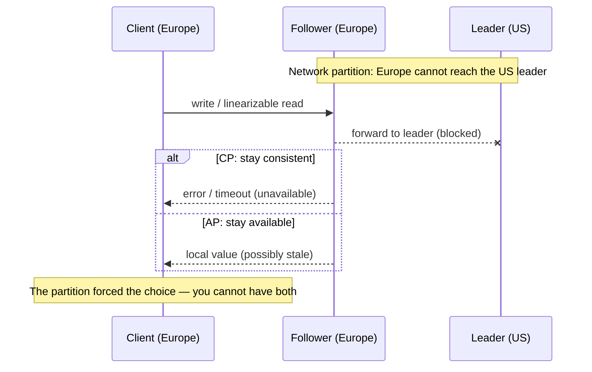

# CAP & PACELC, Honestly

> **Prerequisites:** [Linearizability & Ordering](/synapse/system-design-from-first-principles/distributed-data/linearizability-and-ordering), [Nonfunctional Requirements](/synapse/system-design-from-first-principles/foundations/nonfunctional-requirements) | **You'll be able to:** state what CAP actually claims (and the three things it does *not*), explain why "pick 2 of 3" and "CA systems" are misreadings, and place any real datastore on the PACELC map and defend the placement.

## The problem (why this exists)

Ask a room of engineers to explain CAP and you will get a confident, fluent, and usually **wrong** answer: "Consistency, Availability, Partition-tolerance — pick two." It is the single most-cited result in system design, and also the most misquoted. The folklore version leads people to say things like "MySQL is a CA database" or "we chose AP, so we gave up consistency" — sentences that sound rigorous and mean almost nothing.

The cost of the folklore is real. A candidate who says "we'll pick CA" in an interview has just told the interviewer they don't understand the theorem, because for a distributed system CA is not a reachable option. An engineer who believes "AP means eventually consistent everywhere" will happily serve stale seat inventory on the one code path that must never oversell. The theorem is narrow and precise; the folklore is broad and misleading, and the gap between them is where bad designs live.

This lesson does two things. First, it states CAP the way its own author and the theory community state it — including the uncomfortable admission, straight from DDIA, that formal CAP has "little practical design value today" [p. 415]. Then it hands you the tool practitioners actually reach for: **PACELC**, which keeps CAP's partition case but adds the trade-off that governs your system the overwhelming majority of the time, when nothing is broken at all.

## Intuition first

Strip everything away and CAP is a statement about **one bad moment**: a network partition, when some nodes cannot talk to others (recall from [Faults, Clocks & Time](/synapse/system-design-from-first-principles/distributed-data/faults-clocks-and-time) that a partition is a fault you suffer, never a knob you turn).

Picture a database replicated across two regions, US and Europe, kept in sync over the link between them. Now the link dies. A user in Europe issues a write. Europe cannot reach the US side to coordinate. It has exactly two honest options:

- **Refuse** — return an error until the link heals. The data everyone sees stays consistent, but Europe is *unavailable*.
- **Accept it locally** — take the write on the European replica and reconcile later. Europe stays *available*, but for the duration of the partition the two sides can disagree, so the system is no longer *consistent* in the strict sense.

That's the whole theorem in one breath: **when a partition happens, you must choose between consistency and availability.** You genuinely cannot have both, because "both" would require the two sides to agree, and by definition they can't talk.

Here is the part the folklore drops. CAP says **nothing whatsoever about the case where there is no partition.** When the network is healthy — which is nearly always — CAP is silent. It does not say you sacrifice anything. It does not license a design. It is a statement about a failure mode, not a personality type for your database. Hold onto that; half the misreadings die right there.

## How it works

### CAP's words are not the everyday words

The reason "pick 2 of 3" misleads is that CAP defines its three letters far more narrowly than English does.

**C is linearizability — not "the database is correct."** CAP's consistency is exactly the recency guarantee from the [linearizability lesson](/synapse/system-design-from-first-principles/distributed-data/linearizability-and-ordering): the system behaves as if there is a single copy of the data, and once a write completes every later read sees it [pp. 402–403]. This is a strong, specific property. It is *not* the "C" in ACID (that's a transaction-integrity property), and it is *not* a vague sense that your data is right.

**A is total availability — a brutal definition.** In the formal CAP model, "available" means *every* request to a *non-crashed* node must eventually return a non-error response. A single node that returns "try again later" during a partition counts as unavailable. That is a far stricter bar than the everyday "our service has four nines of uptime."

**P is not a choice.** Partition-tolerance is the assumption that the network may drop or delay arbitrary messages — which, as we saw in Faults, Clocks & Time, it always may. You do not "pick" P. It is the environment.

Once P is understood as a given rather than an option, "pick 2 of 3" collapses. You never get to trade P away, so the only real question is what happens *during* a partition: do you keep C (and lose A) or keep A (and lose C)? The choice is binary and it only exists while the network is broken.

### The scenario, precisely



DDIA frames the same picture with replication topologies [pp. 413–414]. Under **single-leader** replication, clients in a region cut off from the leader simply cannot do writes or linearizable reads — they get an outage on that side (possibly-stale follower reads are all that remain) until the link is repaired. That is the **CP** behavior: consistent, unavailable on the minority side. Under **multi-leader** replication, each region keeps a leader, keeps accepting writes, and queues them to exchange once the link returns — the **AP** behavior: available, but the regions diverge and must reconcile conflicts afterward.

The theorem was named by Eric Brewer in 2000, though DDIA notes the trade-off was already familiar to distributed-database designers in the 1970s [pp. 414–415]. Brewer stated it as a conjecture; it was later given a formal proof under a specific model, which is exactly why its letters have those narrow technical meanings.

### Why DDIA calls CAP "unhelpful"

DDIA is unusually blunt here, and an honest lesson has to pass that along. Formal CAP is **narrow on both axes**: it considers only *one* consistency model (linearizability) and only *one* kind of fault (network partitions) [p. 415]. It says nothing about network *delays*, dead nodes, crashes, or slow disks — the faults that actually cause most incidents. And per Google's own data, network partitions account for **fewer than 8%** of incidents [p. 415]. So a theorem that only speaks to under one-in-twelve of your bad days, and even then only about the strongest consistency model, is not much of a design tool. DDIA's verdict: CAP "has little practical design value today" and "has been superseded by more precise impossibility results" [p. 415]. It is now largely of historical interest.

There is a deeper reason CAP undersells the real trade-off. Most systems that drop linearizability don't drop it for *fault tolerance* — they drop it for **performance**, all the time, not just during partitions [pp. 416–417]. DDIA's arresting example: even the RAM in a modern multi-core CPU is not linearizable without an explicit memory barrier, because each core has its own cache and store buffer with asynchronous write-back — and that's a choice made purely for speed, with no network partition anywhere in sight [pp. 416–417]. This isn't a metaphor; it's the same trade-off. And it has a hard floor: the **Attiya–Welch** result says that if you insist on linearizability, read/write response time is at least proportional to the uncertainty in network delay [p. 417]. Linearizable systems are slower *always*, not just when something breaks. CAP, fixated on the partition, misses this entirely — which is precisely the gap PACELC fills.

### PACELC: the honest upgrade

PACELC (say it "pass-elk") keeps CAP's partition case and bolts on the case CAP ignored [p. 415]:

> **If** there is a **P**artition, choose between **A**vailability and **C**onsistency. **E**lse (no partition — the normal state), choose between **L**atency and **C**onsistency.

The "else" clause is the whole point. It says: even with a perfectly healthy network, you are *still* trading consistency against something — now latency instead of availability. Want every read to reflect the very latest write across all replicas? You pay coordination latency on the critical path, every single request (that Attiya–Welch floor). Willing to serve a slightly stale read from the nearest replica? It's faster. This is the trade-off your system actually lives with, because the "else" branch is where it spends ~99.9% of its life. PACELC inherits CAP's counterintuitive definitions — its C is still linearizability [p. 415] — but by naming the no-partition trade-off, it describes the choice that matters far more often.

```d2
classes: {
  edge:  {style: {fill: "#dbeafe"; stroke: "#2563eb"}}
  svc:   {style: {fill: "#dcfce7"; stroke: "#16a34a"}}
  data:  {style: {fill: "#ffedd5"; stroke: "#ea580c"}}
  async: {style: {fill: "#f3e8ff"; stroke: "#9333ea"}}
}

title: "PACELC: if Partitioned (A vs C) — Else (L vs C)" {near: top-center; style: {font-size: 22; bold: true}}

grid: "" {
  grid-rows: 2
  grid-columns: 2
  grid-gap: 40

  q1: "PA / EL\nAvailable under partition,\nlow latency otherwise" {
    class: async
    ex: "Dynamo, Cassandra,\nScyllaDB, Riak,\nDynamoDB (eventual)"
  }
  q2: "PA / EC\nAvailable under partition,\nconsistent otherwise" {
    class: edge
    ex: "some MongoDB configs\n(rare in practice)"
  }
  q3: "PC / EL\nConsistent under partition,\nlow latency otherwise" {
    class: svc
    ex: "PNUTS (Yahoo)"
  }
  q4: "PC / EC\nConsistent always,\npays latency always" {
    class: data
    ex: "Spanner, CockroachDB,\nVoltDB, single-leader\nRDBMS, HBase"
  }
}
```

## Trade-offs

Classifying a store means answering two independent questions: *under a partition*, does it keep serving (A) or refuse to stay consistent (C)? And *with no partition*, does it favor low latency (L) or strict consistency (C)? DDIA grounds the two anchor archetypes directly: a leaderless Dynamo-style store is **PA/EL**, and a linearizable store is **PC/EC** [pp. 412–413, 415]. The finer placements below follow Abadi's original PACELC classification.

| Store archetype | Partition (P) | Else (E) | Why it lands here |
| --- | --- | --- | --- |
| Leaderless quorum (Dynamo, Cassandra, ScyllaDB, Riak) | **A** | **L** | Quorum reads/writes stay available under partition; LWW with time-of-day clocks isn't linearizable anyway, and reads favor speed over recency [pp. 412–413] `[web: Abadi 2012]` |
| Linearizable / consensus store (Spanner, CockroachDB, VoltDB) | **C** | **C** | A quorum must confirm the leader before every write and every linearizable read — it refuses on the minority side during a partition and pays coordination latency always [p. 415], [p. 436] `[web: Abadi 2012]` |
| Single-leader RDBMS (Postgres/MySQL, replicated) | **C** | **C** | The leader is the single source of truth; cut-off followers can't take writes or linearizable reads [pp. 411, 413–414] |
| PNUTS (Yahoo) | **C** | **L** | Deliberately gives up availability under partition yet optimizes latency in normal operation `[web: Abadi 2012]` |
| MongoDB (default majority write concern) | **A** | **C** | Fails toward availability during partition but favors consistency when healthy `[web: Abadi 2012]` |

Two things this table makes concrete. First, **the "else" column is where most stores actually differ in daily behavior** — the partition column only bites during that <8% of incidents. Second, a single product can occupy different cells depending on configuration: DynamoDB in eventual-consistency mode reads as PA/EL, but its strongly-consistent-read option pulls it toward the PC/EC corner [p. 412]. PACELC classifies a *configuration*, not a brand.

## Numbers that matter

- **Partitions are a small slice of incidents.** Fewer than **8%** of incidents are network partitions (Google data) [p. 415] — so a theorem scoped only to partitions speaks to a minority of your failures, while PACELC's "else" clause covers the rest.
- **Linearizability has a latency floor.** By Attiya–Welch, linearizable read/write response time is **at least proportional to the uncertainty in network delay** [p. 417] — no algorithm does better, so the EC choice is inherently slower whenever delays vary.
- **Consensus quorum cost.** A consensus-backed PC/EC store confirms every write *and* every linearizable read with a majority quorum (3 nodes tolerate 1 failure, 5 tolerate 2) [p. 437] — round-trips that get expensive across regions. Cross-region round-trips run ~50–150 ms, which is the concrete price tag on "EC" for a globally-replicated design.
- **The everyday gap.** A cache read at ~1 ms versus a cross-region consistent read at tens of milliseconds is the L-vs-C trade in the "else" branch, made of latency you pay on every healthy request — not a partition in sight.

## In production

**Two DynamoDB knobs, one theorem.** Amazon DynamoDB exposes the PACELC "else" choice as a per-request flag. Default reads are eventually consistent — served from the nearest replica, low latency, occasionally stale (EL). Ask for a strongly-consistent read and DynamoDB routes to a replica that can confirm recency, at higher latency and lower throughput (EC) [p. 412]. Same table, same partition behavior; the operator chooses L-vs-C per call. This is PACELC as a production API, not a whiteboard abstraction.

**Spanner buys its way into PC/EC with hardware.** Google Spanner sits in the strict corner: linearizable (in fact strictly serializable) even across continents. It pays the Attiya–Welch tax by *shrinking* the network-delay uncertainty with tightly synchronized atomic/GPS clocks (TrueTime), so it can wait out a small, bounded clock-uncertainty interval instead of a large one [pp. 424–425]. The lesson: PC/EC is achievable at global scale, but only by spending money on the very uncertainty that sets the latency floor.

**Cassandra's tunable consistency is PACELC per query.** Cassandra lets each read and write pick a consistency level (ONE, QUORUM, ALL). At ONE it is squarely PA/EL — fast, available, stale-tolerant. Crank writes and reads to QUORUM and it moves toward stronger consistency at higher latency — yet DDIA warns it still isn't truly linearizable, because its last-write-wins uses time-of-day clocks vulnerable to skew [pp. 412–413]. A production trap hides here: turning the knob to QUORUM feels like "now we're consistent," but you've bought latency without buying linearizability.

**The design move interviewers reward: split CAP per feature.** Real systems don't pick one global stance. Ticketmaster is the canonical example: the *seat-reservation* path must be consistent (never sell one seat twice — it needs the linearizable, CP/EC behavior), while *browsing the event catalog* can be highly available and mildly stale. You place the consistency-critical path (see [Ticketmaster](/synapse/system-design-from-first-principles/case-studies/ticketmaster)) on the strict side and everything else on the fast side. The same split governs [Stripe Payments](/synapse/system-design-from-first-principles/case-studies/stripe-payments) (ledger writes strict, dashboards eventual) and a [News Feed](/synapse/system-design-from-first-principles/case-studies/news-feed) (feed reads eventual, the "block this user" setting strict). PACELC is applied *per data path*, not per system.

## Pitfalls & interview traps

<div style="border-left:4px solid #da5233;background:rgba(218,82,51,0.08);padding:0.6rem 1rem;border-radius:0 0.5rem 0.5rem 0;margin:1.25rem 0">

⚠️ **"Pick 2 of 3" is a misreading, and "CA" is a category error.** Partition-tolerance is not a dial you turn — the network *will* partition, so P is a given, not a choice. That leaves the real question: *during a partition*, keep C or keep A? A single-node database can be called "CA" only because it has no partitions to tolerate; the moment you distribute it, "CA" evaporates and you must answer the C-or-A question. And CAP's **C is linearizability**, not the everyday word "consistent" and not ACID's C — a system can be perfectly correct in the ACID sense while being non-linearizable. If you say "we'll go CA" or "AP means we gave up all consistency," you've signalled the folklore.

</div>

Other traps that catch people:

- **"AP means eventually consistent everywhere."** No — AP is only about behavior *during a partition*. It says nothing about the healthy case, and it certainly doesn't force every path in your system to be eventually consistent. Classify per data path.
- **Confusing linearizability with serializability.** They're different guarantees on different things: serializability is about transaction *isolation* (some serial order, real-time order not required), linearizability is about *recency* on a single object [pp. 407–408]. CAP's C is the latter. See the [linearizability lesson](/synapse/system-design-from-first-principles/distributed-data/linearizability-and-ordering).
- **Treating CAP as the design tool.** The interviewer who knows the material wants PACELC. Leading with "the else clause is where the system actually lives" instantly reads as senior.
- **Thinking QUORUM = linearizable.** Cassandra at QUORUM is *more* consistent but still not linearizable under clock skew [pp. 412–413]. Quorum overlap alone doesn't buy you recency.

**The follow-up an interviewer asks:** "You said you'll use an AP store — what specifically breaks during a partition, and which of your features can tolerate it?" The strong answer names the diverging state, the reconciliation strategy, and the *one* path (payment, booking, uniqueness) you'd instead route to a CP/EC store.

## Check yourself

```quiz
{"prompt": "A colleague says: 'MySQL on a single server is a CA system — it gives us Consistency and Availability and just skips Partition-tolerance.' What's the most accurate correction?", "options": ["Correct — single-node databases are the classic example of CA", "It's a category error: with no network there are no partitions to tolerate, so 'CA' says nothing; CAP's choice only exists for distributed systems during a partition", "Wrong — MySQL is actually an AP system", "Wrong — MySQL is actually a CP system because it's consistent"], "answer": "It's a category error: with no network there are no partitions to tolerate, so 'CA' says nothing; CAP's choice only exists for distributed systems during a partition"}
```

```quiz
{"prompt": "The network is perfectly healthy — no partition anywhere. According to CAP, what does the theorem tell you about the consistency-vs-something trade-off you're making right now?", "options": ["You must still trade consistency for availability", "You must trade consistency for partition-tolerance", "Nothing — CAP is silent about the no-partition case; you need PACELC's 'else' (latency vs consistency) clause to describe it", "You automatically get all three properties"], "answer": "Nothing — CAP is silent about the no-partition case; you need PACELC's 'else' (latency vs consistency) clause to describe it"}
```

```quiz
{"prompt": "How would you classify a leaderless Dynamo-style store (default eventual-consistency reads) on the PACELC map, and a globally-linearizable store like Spanner?", "options": ["Dynamo = PC/EC, Spanner = PA/EL", "Dynamo = PA/EL, Spanner = PC/EC", "Both are PA/EL", "Both are PC/EC"], "answer": "Dynamo = PA/EL, Spanner = PC/EC"}
```

```quiz
{"prompt": "DDIA argues formal CAP has 'little practical design value today.' Which pair of reasons does it give?", "options": ["It considers only one consistency model (linearizability) and only one fault (network partitions, <8% of incidents)", "It's mathematically unproven and was never peer-reviewed", "It only applies to relational databases and ignores NoSQL", "It was disproven by the Attiya–Welch result"], "answer": "It considers only one consistency model (linearizability) and only one fault (network partitions, <8% of incidents)"}
```

<details>
<summary>Why is "we chose AP, so our whole system is eventually consistent" a flawed statement?</summary>

Because AP describes behavior only *during a network partition*, and only for the paths served by that AP store. It says nothing about the healthy-network case (that's PACELC's "else" clause), and real systems route different features to different stores. You can run an AP store for the browse/feed path and still put seat-booking or payment on a CP/EC store. Consistency is chosen **per data path**, not stamped once across the system.
</details>

<details>
<summary>Two systems are both "strongly consistent." One reads every request in ~1 ms locally; the other takes ~40 ms cross-region. Neither is partitioned. Which theorem explains the difference, and what's the underlying floor?</summary>

PACELC's **else** clause: with no partition, you still trade **latency vs consistency**. The 40 ms system pays coordination latency to guarantee recency on every request; the 1 ms system is serving from a nearby replica and is not actually linearizable. The underlying floor is **Attiya–Welch**: linearizable response time is at least proportional to the uncertainty in network delay [p. 417], so a globally-replicated linearizable read is inherently slow unless you shrink that uncertainty (as Spanner does with synchronized clocks). CAP alone can't explain this — there's no partition — which is exactly why PACELC exists.
</details>

<details>
<summary>An interviewer asks you to justify placing a single design on "both sides" of CAP. How do you answer?</summary>

You apply the choice **per feature/data path**, not per system. Identify the paths where a stale or conflicting read is unacceptable — booking the last seat, debiting a balance, enforcing a unique username — and route those to a CP/EC store (linearizable, consensus-backed), accepting reduced availability under partition and higher latency always. Route everything tolerant of slight staleness — catalog browsing, feeds, timelines — to a PA/EL store for availability and speed. Naming *which* state can diverge and *how* you'd reconcile it is the senior-level answer.
</details>

## PoC — Proof of concepts

The primary sources behind this lesson's insistence that CAP is more slogan than tool:

- [Please stop calling databases CP or AP](https://martin.kleppmann.com/2015/05/11/please-stop-calling-databases-cp-or-ap.html)
  — Kleppmann's argument that most real databases fit neither label, with Postgres, MongoDB and
  ZooKeeper as worked examples.
- [Problems with CAP, and Yahoo's little-known NoSQL system](https://dbmsmusings.blogspot.com/2010/04/problems-with-cap-and-yahoos-little.html)
  — Daniel Abadi introducing PACELC, the "else / latency" half of the trade-off CAP omits.
- [Jepsen — consistency models](https://jepsen.io/consistency) — the map that replaces the two-letter
  labels with a hierarchy you can actually reason about.

## Sources

DDIA2 ch. 10 pp. 402–417 (linearizability, the cost of linearizability, the unhelpful CAP theorem, PACELC, Attiya–Welch) · DDIA2 ch. 10 pp. 424–425, 436–437 (Spanner TrueTime, consensus quorum cost) · `[web: Abadi, "Consistency Tradeoffs in Modern Distributed Database System Design," IEEE Computer, 2012]` (PACELC store classifications: PNUTS PC/EL, MongoDB PA/EC, Dynamo PA/EL, VoltDB PC/EC)
