# Load Balancing & Gateways

> **Prerequisites:** [Networking Essentials](/synapse/system-design-from-first-principles/foundations/networking-essentials), [Nonfunctional Requirements](/synapse/system-design-from-first-principles/foundations/nonfunctional-requirements) | **You'll be able to:** choose L4 vs L7 for a given need and defend it; pick a load-balancing algorithm and reason about session affinity; explain health checks and connection draining, and say why a load balancer is both your scaling lever and a single point of failure you must design around.

## The problem (why this exists)

You did the estimation and one server won't do. Traffic is 50,000 requests per second, a single machine tops out around a few thousand, and even one giant box is a single fuse: when it reboots, everyone is down. So you run many identical copies and spread work across them — [horizontal scaling](/synapse/system-design-from-first-principles/foundations/nonfunctional-requirements) — which creates a new problem: *which* copy handles the next request?

You cannot push that decision onto the client. Hand every user a list of ten server IPs and adding an eleventh means updating every client on Earth, a crashed server keeps receiving traffic until each client independently notices, and your internal topology leaks to the public. What you want is a single, stable front door — one address clients dial — with something behind it deciding, request by request, which healthy machine does the work and steering traffic away from sick ones. That something is a **load balancer**. Sitting slightly upstream, doing the same job for a whole fleet of *different* services plus the cross-cutting chores none of them should each reimplement, is the **API gateway**. This lesson is about both boxes: how they choose a backend, how fast they notice a dead one, and why the thing that lets you scale is also the thing most likely to take you down.

## Intuition first

A load balancer is a restaurant host at the door. Diners (requests) arrive at one entrance; the host glances at which tables (servers) are free and walks each party to one. The diners never need the floor plan, a table being bussed simply isn't offered, and adding tables changes only what the host knows — not what the diners do.

Underneath the metaphor is one of the most reusable ideas in systems: **a layer of indirection**. Clients talk to an address that never changes; behind it, machines come and go, multiply on Black Friday, and die at 3 a.m., none of it visible from outside. The load balancer *decouples* the stable thing clients depend on (one endpoint) from the volatile thing you operate (a shifting pool of servers). Almost everything it does — spreading load, hiding failures, deploying without downtime, terminating TLS in one place — falls out of owning that seam between "what clients see" and "what you run."

The single most important design choice is *how deep the box looks* before deciding. One that only glances at the envelope — source and destination IP and port — works at the transport layer, **L4**. One that opens the envelope and reads the letter — HTTP method, URL path, headers, cookie — works at the application layer, **L7**. That distinction drives everything else, so it's where we start.

## How it works

### L4 vs L7: how deep does the box look?

Recall the [layering model](/synapse/system-design-from-first-principles/foundations/networking-essentials): the transport layer (L4) moves TCP/UDP streams between IP-and-port endpoints; the application layer (L7) gives bytes meaning as HTTP requests, gRPC calls, and the like. A load balancer can operate at either.

An **L4 load balancer** decides using only transport-level facts: source and destination IPs and ports. It picks a backend for each new connection and forwards that connection's packets to it — often without terminating the TCP connection, sometimes rewriting only the destination address (NAT). It cannot know whether the bytes inside are a login or a video upload; the payload is opaque, and if it's TLS-encrypted the L4 box couldn't read it anyway. The consequence that matters most: **an L4 balancer binds a whole connection to one backend for that connection's lifetime** — every request multiplexed over a persistent HTTP/2 connection lands on the same server, because L4 sees one flow, not the requests inside it.

An **L7 load balancer** terminates the client's connection, reads the actual HTTP request, and decides afresh *per request*. Understanding the application protocol lets it do what an L4 box structurally cannot: route `/api/*` to one pool and `/media/*` to another, pin a user to a server by cookie, retry a failed idempotent request on a different backend, read or inject headers, enforce rate limits, and terminate TLS so certificates live in one place. All of that costs CPU — parsing and often decrypting every request, holding two connections instead of shuffling packets — so an L7 balancer handles less raw throughput per core and adds a little latency. You buy application awareness with compute.

```d2
direction: right
classes: {
  client: {style: {fill: "#f3f4f6"; stroke: "#6b7280"}}
  edge:   {style: {fill: "#dbeafe"; stroke: "#2563eb"}}
  svc:    {style: {fill: "#dcfce7"; stroke: "#16a34a"}}
}

clients: Clients {class: client}

l4: "L4 balancer (transport)\nsees IP:port only — opaque bytes\none TCP flow pinned to one backend" {class: edge}
l7: "L7 balancer (application)\nterminates TLS, reads HTTP\nre-decides per request" {class: edge}

api: "Service pool: api" {
  class: svc
  a1: app-1
  a2: app-2
  a3: app-3
}
media: "Service pool: media" {
  class: svc
  m1: app-1
  m2: app-2
}

clients -> l4: "opaque TCP flow"
clients -> l7: "HTTP request"

l4 -> api.a1: "forward flow"
l4 -> api.a2
l4 -> api.a3

l7 -> api: "route /api/*"
l7 -> media: "route /media/*"
```

The practical pattern in large systems is not "pick one" but **layering both**: an L4 balancer at the very edge absorbs enormous connection volume and spreads it across a bank of L7 balancers, which then do the smart per-request routing. AWS makes the split explicit in its product line — the Network Load Balancer is L4, the Application Load Balancer is L7 [web: AWS Elastic Load Balancing docs].

### Load-balancing algorithms: which backend?

Once the box knows it must choose a backend, *how* it chooses is the algorithm. The common ones, in rough order of sophistication:

- **Round-robin** — hand out backends in rotation: 1, 2, 3, 1, 2, 3. Dead simple, stateless, and fine when requests are roughly uniform and servers roughly identical. Its blind spot is variance: a round-robin balancer will cheerfully route a request to a server already choking on three slow queries because "it's your turn."
- **Weighted round-robin** — give beefier servers a larger share (weight 3 vs weight 1). Useful for heterogeneous fleets or for gradually shifting traffic onto a new server pool during a deploy.
- **Least-connections** — route to whichever backend currently has the fewest open connections. This adapts to real load rather than assuming uniformity, so it handles requests of uneven cost far better than round-robin. It's the sensible default when request durations vary. Variants like least-response-time fold in observed latency.
- **Power-of-two-choices** — sample *two* backends at random and send the request to the less loaded of the pair. This costs O(1) state (no global connection table) yet lands remarkably close to full least-connections — a famous result: two random probes beat one, and a third barely helps. It's what large meshes (e.g. Envoy) often use because a global "fewest connections" view is expensive to keep accurate across many balancer instances.
- **Consistent hashing** — hash a stable key (client IP, session ID, cache key) and map it to a backend via a hash ring, so the *same* key keeps landing on the *same* server even as the pool changes. You use this when a backend holds state or a warm cache for a key and you want affinity — and adding or removing a node only remaps a small fraction of keys instead of reshuffling everything. This is the exact mechanism from [Sharding & Consistent Hashing](/synapse/system-design-from-first-principles/distributed-data/sharding-and-consistent-hashing), reused at the load-balancing layer; CDNs use it to pick which edge cache owns an object, and it is how a cache-backed service preserves hit rates across scaling events.

A related but cruder tool is the **sticky session** (session affinity): pin a given user to one backend, usually via a cookie the L7 balancer sets, so their session state (held in that server's memory) stays reachable. It works, but it fights elasticity — we'll return to why in the traps.

### Hands-on: race the algorithms

A runnable simulation lives at `proof-of-concepts/04-building-blocks/01-load-balancing-and-gateways/` in the repo root — pure Python, standard library only. It routes one identical request stream (variable, exponential service times) through all five strategies over a pool of simulated backends and reports the **peak concurrent load on the busiest backend**, the quantity that sets your tail latency.

```bash
cd proof-of-concepts/04-building-blocks/01-load-balancing-and-gateways
./run            # compare five strategies on tail load
./run test       # mypy --strict + unit tests + demo
```

The ranking in the output *is* this section: routing blind-random runs the hottest tail; round-robin helps but still ignores that a backend drew several long requests; least-connections and power-of-two hold the lowest peak — and power-of-two gets within one of full least-connections while only ever inspecting *two* backends. Consistent hashing deliberately accepts a worse peak in exchange for pinning each client to one backend. The README notes what is simulated (backends as in-process objects, a virtual clock) versus what is exactly-as-production (the routing algorithms).

### Health checks: noticing a dead backend fast

Spreading load is only half the job; the other half is *not* sending requests into a black hole. A backend can be up as a process but unable to serve — its database pool exhausted, stuck in a GC pause, disk full. The balancer needs to pull it out of rotation fast, then put it back when it recovers. Two ways to notice:

- **Active health checks** — the balancer proactively probes each backend on an interval (say, `GET /healthz` every few seconds) and counts consecutive results. Miss *N* in a row and the node is marked unhealthy and removed; pass *M* in a row and it's re-added. This is predictable and catches a sick node even when it isn't currently receiving user traffic, but it lags reality by up to one probe interval and its accuracy is only as good as what `/healthz` actually tests.
- **Passive health checks** — the balancer watches *real* traffic and infers health from it: a backend returning a burst of 5xxs, timing out, or refusing connections gets ejected. This reacts instantly to problems real users are hitting and costs no extra probe traffic, but it can only judge a node that's currently receiving requests, and it learns of failure by *serving* some failures first. Envoy calls this "outlier detection" and runs it alongside active checks [web: Envoy documentation — outlier detection].

Mature setups run both: active checks to keep dead nodes out proactively, passive checks to eject a node the instant it fails live requests. **Why speed matters:** every second a dead backend stays in rotation, the balancer hands it a proportional slice of traffic that fails or hangs. On a 10-node pool, a node that takes 30 seconds to eject silently fails ~10% of requests for those 30 seconds. Fast detection is directly an availability number.

### Connection draining: removing a node without dropping requests

You also remove healthy nodes on purpose, constantly, to deploy or scale down. Yanking a backend mid-request would drop in-flight requests and show users errors during a routine deploy. The fix is **connection draining** (graceful shutdown): when a node is scheduled for removal, the balancer stops sending it *new* requests but lets *existing* ones finish, up to a timeout, before it goes away. This is what makes zero-downtime rolling deploys possible — the same lifecycle whether a node leaves because it's sick or because you're replacing it.

```mermaid
flowchart LR
    classDef client fill:#f3f4f6,stroke:#6b7280,color:#111827;
    classDef edge   fill:#dbeafe,stroke:#2563eb,color:#1e3a8a;
    classDef svc    fill:#dcfce7,stroke:#16a34a,color:#14532d;
    classDef data   fill:#ffedd5,stroke:#ea580c,color:#7c2d12;
    classDef async  fill:#f3e8ff,stroke:#9333ea,color:#581c87;

    LB[Load balancer<br/>probes /healthz + watches live traffic]:::edge
    H[Node healthy<br/>in rotation]:::svc
    U[Misses N probes or spikes 5xx<br/>→ marked unhealthy]:::async
    D[Draining: no new requests,<br/>let in-flight finish to timeout]:::async
    R[Reroute new traffic to<br/>remaining healthy nodes]:::svc
    B[Passes M probes<br/>→ back in rotation]:::svc

    LB --> H
    H -->|missed heartbeats / live errors| U
    U --> D
    D --> R
    R -.->|node recovers| B
    B --> H
```



### The API gateway: an L7 concentrator for a fleet of services

Once you have many *different* services rather than copies of one, chores appear that every service would otherwise reimplement: authenticate the caller, enforce rate limits, terminate TLS, validate requests, route to the right service. The **API gateway** is an L7 box in front of the whole fleet doing these cross-cutting jobs in one place — in essence, a specialized L7 load balancer whose job description grew. A request flows through it in a fixed lifecycle: validate → run middleware (auth, rate limiting) → match the routing table (path, method, headers) → forward to the backing service (itself load-balanced) → transform the response → optionally cache it.

Its signature extra trick is **request aggregation**: a mobile client asks for a screen's worth of data, and the gateway fans out to three services and composes one response, sparing three round trips over a slow link. It's also the natural home for authentication and per-user rate limiting, because it's the one point every request must cross — and that very centrality is the danger the traps section returns to. In interviews the calibration is deliberately low-key: name that a gateway handles routing and cross-cutting middleware, place it at the edge, and move on.

### A brief, honest look at the internals

How the biggest load balancers work is mostly [web:] territory — DDIA and the interview sources treat the LB as a black box — so treat the following as supplementary, and note vendor specifics change. The interesting internals all answer "how do you load-balance when *the load balancer itself* must scale past one machine?"

- **DNS-based global load balancing (GLB).** Before a client reaches a regional balancer, DNS can steer it — returning different IPs by the client's approximate location (GeoDNS) so users hit the nearest region. It's coarse and slow to change (bounded by DNS TTL, per [Networking Essentials](/synapse/system-design-from-first-principles/foundations/networking-essentials)), but it's the standard first tier and the standard way to avoid a single regional balancer being a global SPOF [web: Cloudflare — what is DNS load balancing].
- **Anycast.** Announce the *same* IP from many data centers via BGP, and the internet's routing delivers each client to the nearest site — one virtual IP, many locations, automatic failover if a site withdraws. This is how large CDNs and DNS providers front themselves [web: Cloudflare — what is anycast].
- **Maglev-style consistent hashing.** Google's Maglev is a software L4 balancer on commodity machines; a bank of them shares one anycast IP, and each independently maps flows to backends via consistent hashing designed so different balancers make the *same* choice and adding/removing a balancer or backend disrupts minimal existing connections [web: Eisenbud et al., "Maglev: A Fast and Reliable Software Network Load Balancer," NSDI 2016].
- **Direct server return (DSR).** An L4 trick: the balancer forwards the request to a backend, but the backend replies *directly* to the client, bypassing the balancer on the return path. Since responses dwarf requests, this takes the balancer off the heavy path and lets it front far more throughput [web: Maglev, NSDI 2016].

The through-line: at hyperscale, load balancing stops being "a box" and becomes a distributed system of stateless balancers coordinated by anycast and consistent hashing — the same primitives you met for sharding, applied to traffic.

## Trade-offs

L4 vs L7 is the decision you'll actually defend:

| Option | Gives you | Costs you | Use when |
| --- | --- | --- | --- |
| **L4 (transport)** | Very high throughput per core; low latency; protocol-agnostic (any TCP/UDP); can't be confused by encrypted payloads | Blind to HTTP — no path/header routing, no per-request retry, no app-level rate limiting; one connection pinned to one backend | Raw connection spreading at the edge; non-HTTP or opaque protocols; extreme throughput; front tier before L7 boxes [web: AWS ELB docs] |
| **L7 (application)** | Path/host/header/cookie routing; per-request re-balancing; retries; rate limiting; TLS termination; request/response rewriting | More CPU and latency per request (parse + often decrypt); lower raw throughput; terminates connections (more state) | You need to route or act on request content; microservice fan-out; centralized TLS/auth |

Algorithm choice, given you're at L7 (or a stateful L4):

| Algorithm | Gives you | Costs you | Use when |
| --- | --- | --- | --- |
| Round-robin | Trivial, stateless, even *count* distribution | Ignores actual load; a slow request lands on an already-busy node | Uniform requests, homogeneous servers |
| Weighted round-robin | Respects heterogeneous capacity; gradual traffic shifting | Static weights don't track live load | Mixed instance sizes; canary/gradual rollout |
| Least-connections | Adapts to real, uneven request cost | Needs live connection counts; slightly more state | Variable request durations — a strong default |
| Consistent hashing | Session/cache affinity; minimal remap when pool changes | Uneven load if keys are skewed (hot keys); more complex | Backend holds per-key state or warm cache; CDN edge selection (see [Sharding](/synapse/system-design-from-first-principles/distributed-data/sharding-and-consistent-hashing)) |

## Numbers that matter

Rough figures for calibration, not constants to recite. A modern software load balancer on commodity hardware handles tens of thousands to low hundreds of thousands of requests per second per instance; dedicated enterprise hardware balancers are quoted into the hundreds of millions of requests per second — which is why one balancer can front a very large fleet, and why you add more of them for redundancy, not throughput.

Health-check timing is a direct availability lever: probe interval times failure threshold sets detection latency, so a 2-second interval with a 3-miss threshold means up to ~6 seconds of a dead node still taking traffic. Tighten it and you detect faster but risk ejecting a node over a transient blip; loosen it and you fail more real requests first. On a pool of *N* nodes, one un-ejected dead node fails roughly `1/N` of traffic until it's pulled — the arithmetic that makes fast detection worth the probe cost.

Connection state is the other cost that scales: an L7 balancer holds two connections per request (client-side and backend-side) plus TLS state, so at a million concurrent connections the *memory and file-descriptor* footprint — not CPU — is often the binding constraint. This is the same pressure flagged in [Networking Essentials](/synapse/system-design-from-first-principles/foundations/networking-essentials), and it dominates [Real-time Delivery](/synapse/system-design-from-first-principles/building-blocks/realtime-delivery).

## In production

The load-balancing tier is one of the most standardized parts of modern infrastructure. **NGINX** and **HAProxy** are the workhorse software balancers/reverse proxies (both primarily L7, both L4-capable); **Envoy** is the newer, dynamically-configurable L7 proxy underpinning most service meshes; **F5 BIG-IP** is the classic hardware appliance; and every cloud offers managed balancers — AWS's ELB family splits cleanly into the L4 **Network Load Balancer** and L7 **Application Load Balancer**, with Google Cloud Load Balancing and Azure Load Balancer as counterparts [web: AWS Elastic Load Balancing docs]. Cloudflare and other CDNs run global anycast networks fronting origins with L7 balancing at the edge [web: Cloudflare — what is anycast].

Two production realities. First, **the balancer terminates TLS in most real deployments**: the L7 balancer or CDN edge accepts the client's TCP+TLS handshake and forwards to backends over separate internal connections, so certificates live in one managed place rather than in every service — the same edge-termination pattern from the networking lesson, and a large part of what this tier buys you beyond mere distribution.

Second, at scale the load balancer is increasingly **not a central box but a mesh**. DDIA's survey names the progression: hardware balancers, then software balancers (NGINX, HAProxy), then DNS-based balancing, then **service-discovery systems** (etcd, ZooKeeper) where instances register and heartbeat, and finally **service meshes** (Istio, Linkerd) that deploy the balancer as a sidecar proxy next to every service [DDIA2 ch. 5 pp. 184–186]. In a mesh, load balancing, retries, health checking, mutual-TLS, and observability all move into the sidecar — the same consolidation the API gateway does at the north-south edge, applied to east-west service-to-service traffic [DDIA2 ch. 5 pp. 185–186].

Named case studies lean on this tier directly: the [rate limiter](/synapse/system-design-from-first-principles/case-studies/rate-limiter) is most naturally enforced at the gateway/L7 layer, and [WhatsApp](/synapse/system-design-from-first-principles/case-studies/whatsapp)'s millions of persistent connections are exactly the connection-state-dominated, L4-fronted design this lesson's numbers point at.

## Pitfalls & interview traps

<div style="border-left:4px solid #da5233;background:rgba(218,82,51,0.08);padding:0.6rem 1rem;border-radius:0 0.5rem 0.5rem 0;margin:1.25rem 0">

⚠️ **The trap: your load balancer is your new single point of failure.** You added a balancer to survive server failures — and quietly funneled *all* traffic through one box, so now *its* death is total. Two mistakes follow. First, forgetting to make the balancer itself redundant: run at least two (active-passive or active-active), and use DNS or anycast so clients can reach either — the balancer needs the same "no single fuse" treatment you gave the servers behind it. Second, **sticky sessions defeating elasticity**: pinning users to specific backends by cookie means a drained or crashed node takes its users' sessions with it, load can't rebalance when you add capacity (existing users stay stuck to old nodes), and autoscaling stops helping under a spike. The senior move is to make backends stateless — push session state into a shared store like Redis — so *any* balancer can send *any* request to *any* node, and stickiness becomes an optimization you can drop, not a correctness crutch you depend on.

</div>

More traps interviewers probe:

- **A shallow health check that lies.** If `/healthz` returns `200 OK` from the web framework without touching the database or downstream deps, a node with a dead database still reports healthy and keeps taking traffic. Make health checks test what serving requires — but not so deeply that one slow dependency ejects the whole fleet. This tension (liveness vs readiness) is a real design choice.
- **Retry storms and cascading failure.** L7 retries are great until a backend gets slow: every timed-out request is retried, multiplying load onto an already-struggling pool and turning a brownout into an outage. Retries need budgets, backoff, and circuit breakers — and the timed-out original may have *succeeded*, so retried mutations must be idempotent (from [Networking Essentials](/synapse/system-design-from-first-principles/foundations/networking-essentials)).
- **The gateway as a bottleneck.** Centralizing auth, rate limiting, and routing at one gateway is clean until it's a throughput ceiling and a blast radius — everything behind it is unreachable when it's overloaded. Scale it horizontally (it's usually stateless), distribute it regionally, and keep heavy or latency-critical paths off it where you can.
- **Thundering herd on failover.** When a node drops, clients reconnect all at once, and the survivors plus the balancer absorb a reconnect spike exactly when capacity is already reduced. Design for the failover transient, not just steady state.
- **Confusing L4 speed for L7 features.** Reaching for L4 because it's "faster," then needing path routing or per-request retries, means you picked the wrong layer. Let the *requirement* — do you need to act on request content? — choose the layer, not raw throughput.

## Check yourself

```quiz
{"prompt": "You need to route requests to different backend pools based on the URL path (/api vs /media) and retry failed idempotent requests on a different server. Which load balancer must you use?", "options": ["L4 — it's faster and that's what matters for routing", "L7 — path-based routing and per-request retries require reading the HTTP request", "Either works; L4 can inspect paths with configuration", "Neither; path routing is done by DNS"], "answer": "L7 — path-based routing and per-request retries require reading the HTTP request"}
```

```quiz
{"prompt": "Requests to your service vary wildly in cost — some return in 2 ms, some take 800 ms. Servers are identical. Which algorithm best avoids piling work onto an already-busy node?", "options": ["Round-robin — it distributes evenly by count", "Least-connections — it routes to whichever backend has the fewest active connections", "Consistent hashing — it keeps requests on the same server", "Weighted round-robin — it accounts for server size"], "answer": "Least-connections — it routes to whichever backend has the fewest active connections"}
```

```quiz
{"prompt": "A backend node's database pool is exhausted, but its process is alive and its /healthz endpoint just returns 200 from the web framework. What actually happens?", "options": ["The load balancer ejects it immediately — the process is technically overloaded", "Active health checks pass, so the node stays in rotation and keeps failing real requests until passive checks or a deeper probe catch it", "Consistent hashing routes around it automatically", "Connection draining kicks in and removes it"], "answer": "Active health checks pass, so the node stays in rotation and keeps failing real requests until passive checks or a deeper probe catch it"}
```

```quiz
{"prompt": "You pin each user to a backend with sticky sessions because session state lives in that server's memory. You then autoscale from 4 to 8 nodes under load. What goes wrong?", "options": ["Nothing — new nodes immediately share the load evenly", "Existing users stay pinned to the original 4 nodes, so the 4 new nodes get little traffic and a crashed node loses its users' sessions", "The load balancer rehashes all sessions to the new nodes automatically", "Consistent hashing prevents any remapping"], "answer": "Existing users stay pinned to the original 4 nodes, so the 4 new nodes get little traffic and a crashed node loses its users' sessions"}
```

<details>
<summary><strong>Q:</strong> An interviewer says "put a load balancer in front of your servers." What have you actually gained, and what new risk have you introduced in the same breath?</summary>

**A:** Gained: a single stable endpoint decoupling clients from a churning server pool, which buys horizontal scaling (spread load), failure hiding (route around dead nodes via health checks), zero-downtime deploys (connection draining), and a natural place to terminate TLS. Introduced: a single point of failure — all traffic now funnels through the balancer, so its death is total. The immediate follow-up you must pre-empt is "make the balancer itself redundant" (two or more, reachable via DNS/anycast), and, if you used sticky sessions, "make backends stateless so any node can serve any request." Naming the SPOF before the interviewer does is the senior signal.

</details>

<details>
<summary><strong>Q:</strong> Why do the largest edge load balancers (e.g. Google's Maglev) combine anycast with consistent hashing rather than using a single balancer with a shared connection table?</summary>

**A:** A single balancer is both a throughput ceiling and a SPOF, and a *shared* connection table across a fleet is a coordination cost that doesn't scale — every balancer would have to agree, in real time, which backend owns each flow. Anycast lets many balancers announce one IP so routing spreads clients across sites with automatic failover; consistent hashing lets each balancer *independently* compute the same backend for a flow with no shared state, and ensures adding or removing a balancer or backend disrupts only a small fraction of flows [web: Maglev, NSDI 2016]. Direct server return takes the balancers off the larger response path. The result is a stateless, horizontally scalable tier — the sharding primitives applied to traffic instead of data.

</details>

<details>
<summary><strong>Q:</strong> When would you deliberately choose an L4 load balancer even though L7 has more features?</summary>

**A:** When you don't need to act on request *content* and you do need raw throughput, low added latency, or protocol-agnosticism. Concretely: a front tier absorbing huge connection volume before fanning out to L7 balancers; non-HTTP or opaque/encrypted protocols the balancer shouldn't (or can't) parse; extreme requests-per-second where per-request HTTP parsing and TLS termination would be wasteful; or a design where you *want* a whole connection pinned to one backend (e.g. long-lived persistent connections) rather than re-balanced per request. The rule is to let the requirement pick the layer — if nothing in your design needs to read the request, the cheaper, faster L4 box is the right tool [web: AWS ELB docs].

</details>

## Sources

- DDIA2 ch. 5 pp. 184–186 — dataflow through services: load balancers (hardware, software NGINX/HAProxy, DNS), service discovery (etcd, ZooKeeper) with registration and heartbeats, and service meshes (Istio, Linkerd) deploying the balancer as an in-process library or sidecar handling encryption and observability.
- [web: AWS Elastic Load Balancing documentation] — the L4 Network Load Balancer vs L7 Application Load Balancer split.
- [web: Envoy documentation — outlier detection] — passive health checking ("outlier detection") run alongside active checks.
- [web: Cloudflare — what is DNS load balancing / what is anycast] — DNS/GeoDNS steering and anycast (one IP announced from many sites, routing-based failover).
- [web: D. E. Eisenbud et al., "Maglev: A Fast and Reliable Software Network Load Balancer," USENIX NSDI 2016] — hyperscale software L4 balancing: anycast-fronted stateless balancer fleet, consistent hashing for consistent flow-to-backend mapping, direct server return.
