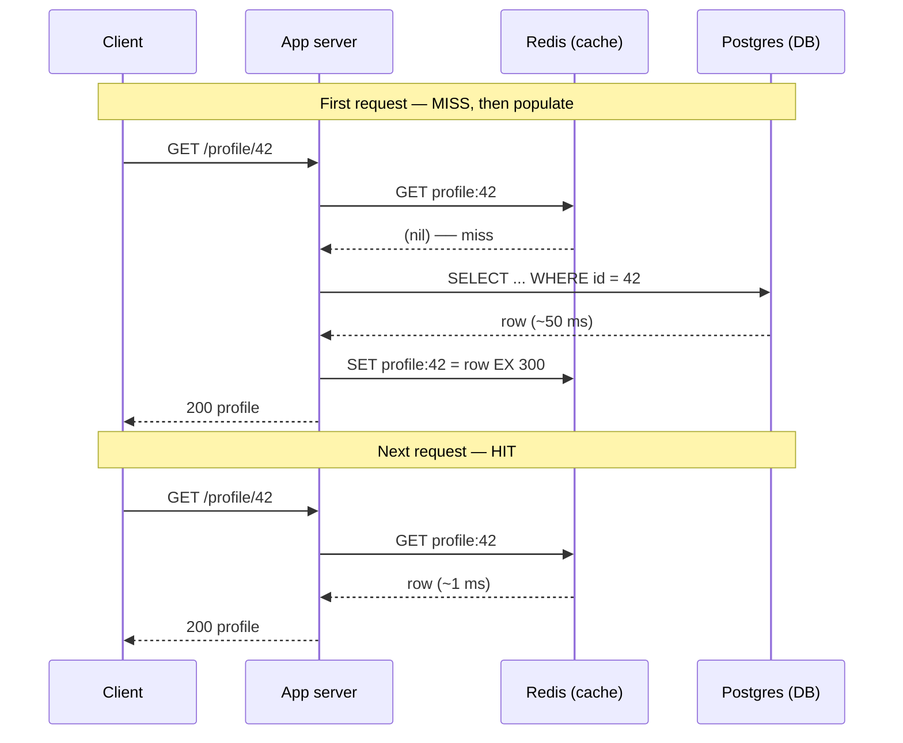
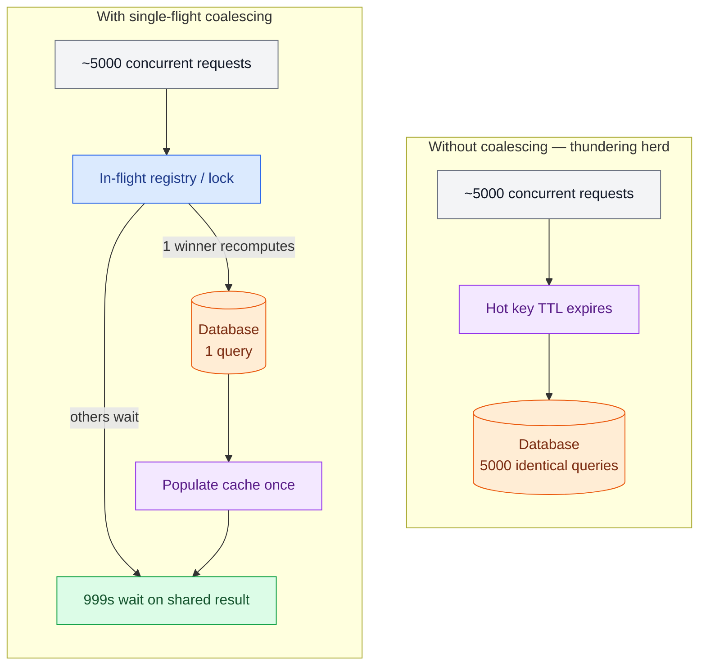

# Caching

> **Prerequisites:** [Storage Engines](/synapse/system-design-from-first-principles/data-foundations/storage-engines), [Latency, Throughput & Percentiles](/synapse/system-design-from-first-principles/foundations/latency-throughput-percentiles) | **You'll be able to:** pick a read/write caching strategy and defend it, choose an eviction policy for a workload, and name a stampede mitigation you could implement.

## The problem (why this exists)

You launch a social app. The home page shows a user's profile with their follower count, a computed "trending" score, and a joined feed. Each page load runs a handful of queries against Postgres; each query takes 20–50 ms. At a few hundred users this is invisible. At ten million daily actives generating two hundred million reads a day, the database CPU sits pinned at 80% during peak, p99 latency balloons, and connections queue. You are one traffic spike away from a brownout.

The uncomfortable part is that almost none of this work is new. The same profiles, the same trending scores, the same feed slices are recomputed thousands of times per second. The database is a very expensive, very durable calculator being asked the same question over and over. What you want is a way to **remember the answer** — to pay the 50 ms cost once and serve the next thousand requests in roughly a millisecond from memory.

That is caching. And it is genuinely the single biggest lever you have for read performance: a well-placed cache can turn a 50 ms database read into a sub-millisecond memory read — a 50× improvement — and cut database load by 70–80% at peak. It is also the source of some of the nastiest bugs in distributed systems, because the moment you keep a second copy of the truth, you inherit the problem of keeping it honest.

## Intuition first

A cache is a small, fast store that sits in front of a large, slow one and holds copies of things you have recently or frequently needed. The bet is simple: **most workloads are skewed.** A small fraction of the data is responsible for the overwhelming majority of the reads — the popular profile, the hot product, the front-page article. If you can hold that hot fraction in fast memory, you serve most requests without ever touching the slow store.

Two numbers describe how well the bet is paying off. The **hit ratio** is the fraction of lookups the cache answers itself; the **miss ratio** is the rest, which fall through to the backing store. If your cache serves 95% of reads in 1 ms and the other 5% cost 50 ms, your average read is about `0.95×1 + 0.05×50 ≈ 3.5 ms` instead of 50 ms. The hit ratio is the whole game — a cache with a poor hit ratio is just an extra network hop with a memory bill.

Crucially, caching is not one thing in one place. Between a user's eyes and your database there is a whole **hierarchy** of places to remember answers, each faster and smaller as you move toward the user:

- **Client / browser cache.** The browser holds images, scripts, and API responses locally under HTTP cache headers (`Cache-Control`, `ETag`). A cache hit here costs zero network round trips — the fastest cache is the request you never send. Strava caching a user's own activity list on-device is a classic example.
- **CDN / edge cache.** Points of presence near the user hold static assets and cacheable responses. A user in India hitting an edge node sees 20–40 ms instead of the 250–300 ms it would cost to reach an origin in Virginia. This is the subject of its own lesson — see [CDN & Edge](/synapse/system-design-from-first-principles/building-blocks/cdn-and-edge).
- **Application / in-memory cache.** A shared, in-memory store like Redis or Memcached sits beside your services and holds hot query results, sessions, and computed values. This is the cache you reach for most in a system-design interview, and the main subject of this lesson.
- **Database buffer pool.** The database itself caches recently touched pages in RAM so that a "disk" read is often really a memory read. You don't manage this directly, but it is why a warm database is far faster than a cold one — and why your own cache and the buffer pool are solving overlapping problems at different layers.

You will often use several of these at once. The mental model to keep is a funnel: each layer absorbs as much traffic as it can and passes only its misses down to the next, slower, more authoritative layer.

## How it works

An application cache stores **key → value** entries in memory. You decide the key (`profile:42`, `feed:user:42:page:1`), the value (a serialized row, a rendered fragment, a computed number), and how the two stores — cache and database — are wired together on reads and writes. Those wiring choices are the substance of caching.

### Read strategies: cache-aside and read-through

The default, and the one you should reach for unless something argues otherwise, is **cache-aside** (also called lazy loading). The application owns the logic: on a read, it checks the cache first; on a hit it returns immediately; on a miss it reads the database, writes the result back into the cache, and returns it. The cache is populated lazily, only with data that is actually requested.



Cache-aside has three properties that make it the default. It is **resilient**: if the cache is down, reads still work by falling through to the database (slower, but correct). It caches **only what is used**, so cold data never wastes memory. And it is simple to reason about. Its costs: every entry pays a first-miss penalty, and because the application writes the cache, cache and database can drift apart if writes aren't handled carefully (see write strategies).

**Read-through** moves that miss logic out of your application and into the cache layer itself. The application always asks the cache; on a miss, the cache — via a provided loader function or a caching library — fetches from the database, stores the value, and returns it. The application no longer sees the database on the read path at all. This centralizes the load logic (good when many services share the same cache) at the cost of a cache that must be able to reach the database and understand your loading logic.

### Write strategies: keeping the copy honest

Reads are the easy half. The hard question is what happens on a **write**, because now you have two copies — cache and database — and you must decide how they stay consistent. There are three canonical strategies, plus a common modifier.

- **Write-through.** Every write goes to the cache *and* the database synchronously, before the write is acknowledged. Cache and database are always in agreement, and reads after a write always see fresh data. The price is write latency: every write pays for both stores, and you may cache data that is never read again.
- **Write-back (write-behind).** The write goes to the cache and is acknowledged immediately; the cache flushes to the database asynchronously, often batching many writes together. This gives the lowest write latency and can absorb enormous write bursts. The danger is durability: an acknowledged write lives only in memory until it is flushed, so a cache node crash loses data, and the database is eventually — not immediately — consistent with the cache.
- **Write-around.** The write goes straight to the database, bypassing the cache entirely; the cache is populated only later, on a read miss. This avoids filling the cache with write-heavy data that is rarely read back, at the cost that a just-written value is a guaranteed cache miss on its first read.

In practice, the most common production combination is **cache-aside reads paired with a write that updates the database and then invalidates (deletes) the cache entry.** Deleting rather than updating the cached value is deliberate: the next read repopulates it from the source of truth, which is simpler and less bug-prone than trying to keep the cached copy perfectly in step. We return to why in Pitfalls.

### Eviction: what to forget

A cache is bounded — that is the whole point — so when it fills, it must evict something to make room. The policy decides what:

- **LRU (Least Recently Used)** evicts whatever hasn't been touched for the longest. It is the sensible default: it assumes recency predicts reuse, which holds for most workloads. Its weakness is scan pollution — a one-time sweep over cold data can flush your hot set.
- **LFU (Least Frequently Used)** evicts whatever has been accessed the fewest times. It protects a stable popular set from being displaced by bursts of one-off accesses, at the cost of tracking frequencies and reacting more slowly to shifts in what's popular.
- **TTL (time to live)** is orthogonal to both: every entry carries an expiry, after which it is evicted regardless of use. TTL is less about capacity and more about **freshness** — it bounds how stale a cached value can be, which makes it your simplest tool against the consistency problem below.

Real systems combine these: an entry might have a TTL for freshness *and* live under LRU/LFU for capacity. Redis, for instance, offers `allkeys-lru`, `allkeys-lfu`, `volatile-ttl`, and several other eviction modes you select per deployment.

### Redis: the canonical in-memory store

When an interviewer hears "add a cache," the assumed implementation is **Redis** (or Memcached for a pure, simpler cache). Redis is an in-memory, **single-threaded** data-structure server, and both of those words matter.

*In-memory* is why it is fast — but, per DDIA, not for the reason people assume. The speed advantage comes less from avoiding disk (the OS page cache already keeps hot disk blocks in RAM) and more from **avoiding the overhead of encoding in-memory structures into a disk-writable form**; serving directly from native memory structures is what wins (DDIA2 ch. 4 pp. 133–134). Redis pursues durability optionally, through append-only logging and periodic snapshots, but its consistency guarantees are weak by default — it is squarely in DDIA's "weak durability via asynchronous disk writes" category (DDIA2 ch. 4 pp. 133–134).

*Single-threaded* is why its semantics are clean. Redis executes commands one at a time on a single core, so each command is effectively atomic — an `INCR` or a `SET` cannot interleave with another client's command. That property is what lets Redis serve not just as a cache but as a distributed lock, a rate-limiter counter, a leaderboard, and a lightweight queue. The trade-off is that a single slow command (a big `KEYS` scan, a large sorted-set operation) blocks *everyone*, and a single node's throughput — roughly O(100k) operations per second, with read latencies often in the microsecond range — is the ceiling before you must shard across a cluster.

Redis's data structures are why it is more than a key-value box. Strings hold cached blobs and counters; hashes hold structured objects; sorted sets power leaderboards and time-ordered data; sets do membership; streams do lightweight queues. A cached feed slice, a session hash, and a `top-N` leaderboard can all live in the same Redis without a second technology.

## Trade-offs

The central design decision is the **write strategy**, because it is where you trade consistency against latency. Read this table as "what do I give up to get what."

| Strategy | Cache/DB consistency | Write latency | Read latency | Use when |
| --- | --- | --- | --- | --- |
| Cache-aside + invalidate | Good (read repopulates from source of truth) | DB write + cache delete | Fast on hit; first read after write is a miss | The default: read-heavy, occasional writes, resilience matters |
| Write-through | Strong (cache always matches DB) | Slow (DB **and** cache, synchronous) | Fast, always fresh | Reads must never see a value older than the last write |
| Write-back (write-behind) | Weak (DB lags cache; loss on crash) | Fastest (cache only, async flush) | Fast | Write-heavy bursts you can flush later; some loss tolerable |
| Write-around | DB authoritative; cache may lag | DB write only | First read after write is a miss | Write-heavy data that is rarely read back |

Three cross-cutting trade-offs sit underneath the table. First, **more caching layers means more places to be wrong** — every copy is a potential source of staleness. Second, **freshness costs hit ratio**: a short TTL keeps data fresh but forces more misses and more database load; a long TTL is cheap but serves staler data. Third, **memory is finite and skew is your friend**: caching pays off precisely because the hot set is small relative to the whole; if access were uniform, no affordable cache could hold enough to help.

## Numbers that matter

Order-of-magnitude figures you should be able to recall and defend in a design discussion:

- **Read latency.** Postgres disk read ≈ 20–50 ms; the same value from Redis ≈ 1 ms (often microseconds for small values) — a 50× improvement.
- **CDN edge vs origin.** Edge hit ≈ 20–40 ms; origin miss across a continent ≈ 250–300 ms. Cross-link [CDN & Edge](/synapse/system-design-from-first-principles/building-blocks/cdn-and-edge).
- **Redis throughput.** ~100k operations/sec/instance with sub-millisecond reads; treat ~1 TB of memory or ~100k ops/sec as the trigger to shard across a cluster. See [Estimation & Numbers](/synapse/system-design-from-first-principles/foundations/estimation-and-numbers) for the full sheet.
- **Load shed.** A cache in front of a hot query commonly cuts database CPU by 70–80% at peak.
- **Hit ratio math.** With a 95% hit ratio, average read ≈ `0.95×1 ms + 0.05×50 ms ≈ 3.5 ms`. Push the hit ratio to 99% and it drops to ≈ 1.5 ms — the last few percent of hit ratio are worth a surprising amount.

A quick sizing sanity check: if the hot working set is a few million profiles at ~5 KB each, that's on the order of tens of gigabytes — comfortably inside a single Redis node's memory, so no sharding is needed for capacity alone. Always check the hot-set size against the ~1 TB single-node ceiling before proposing a cluster.

## In production

Real systems run caches at a scale where the failure modes below stop being theoretical.

**Facebook / Meta** run one of the largest known deployments of **Memcached**, fronting their databases with a vast fleet of cache servers. Their published engineering `[web: Nishtala et al., "Scaling Memcache at Facebook", NSDI 2013]` describes exactly the problems this lesson names — thundering herds when a hot key expires, and the "look-aside" (cache-aside) pattern with careful invalidation — and the leases and coordination they added to tame them. The lesson is that at scale the cache is not a convenience bolted on the side; it *is* the read path, and the database is a fallback that must never be allowed to take full traffic.

**CDNs** (Cloudflare, Fastly, Akamai) are caching as a product: a global fleet of edge caches with configurable TTLs and invalidation APIs, absorbing static and cacheable dynamic traffic before it ever reaches your origin.

**Hot keys** are the production failure that surprises people. A cache cluster spreads keys across nodes by hashing the key — but a single key can only live on one node, so if one key is wildly popular (a celebrity's profile, a viral post), all of its traffic lands on one node while the other 99 stay cool. That node saturates; the cluster as a whole looks under-utilized while one shard melts. The standard remedies: replicate the hot key to several nodes and read from a random replica; add an in-process (local) cache in front of the shared cache so most hot-key reads never leave the app server; or split the key into several sub-keys. This connects directly to the scaling-reads work in the [News Feed](/synapse/system-design-from-first-principles/case-studies/news-feed) case study, where a handful of celebrity accounts dominate read traffic.

**Rate limiting** is a place where the "cache" is really Redis used as a shared atomic counter — `INCR` plus `EXPIRE` implements a fixed-window limiter, leaning on the single-threaded atomicity described above. See the [Rate Limiter](/synapse/system-design-from-first-principles/case-studies/rate-limiter) case study.

## Pitfalls & interview traps

**Invalidation is the hard problem.** The old joke — "there are only two hard things in computer science: cache invalidation and naming things" — is quoted so often because it is true. The trouble is that a cache is a *copy*, and the moment the source of truth changes, every copy is potentially wrong. You have three families of invalidation, in increasing precision and effort:

- **TTL (time-based):** let entries expire after N seconds. Dead simple, no coordination, but guarantees a window of staleness up to N seconds. The right default for data that can tolerate being a little old (a follower count, a trending list).
- **Explicit (write-driven):** on every write, delete or update the affected cache keys. Precise, but only as correct as your ability to enumerate *every* key a write affects — miss one derived key and it serves stale data indefinitely.
- **Event-driven:** publish change events (often from the database's change stream) and let subscribers invalidate. Scales to many caches and derived views, at the cost of real infrastructure (a change-data-capture pipeline, a message broker).

The common bug is choosing "explicit" and then forgetting a derived key — a cached feed that includes a username won't update when the username changes unless you remember to bust the feed key too. This is exactly why the cache-aside default is *delete on write, repopulate on read*: it needs you to identify the affected keys, but not to reconstruct their new values correctly.

<div style="border-left:4px solid #da5233;background:rgba(218,82,51,0.08);padding:0.6rem 1rem;border-radius:0 0.5rem 0.5rem 0;margin:1.25rem 0">

⚠️ **The stampede / dogpile trap.** A single very popular key expires. In the same millisecond, thousands of in-flight requests all miss, and all of them independently run the same expensive query against the database at once. The cache was the only thing protecting the database from that hot query — and it just vanished for a few milliseconds. This *thundering herd* can knock over a database that was comfortable a moment earlier, and it is a favorite interview follow-up precisely because the naive cache design invites it.

</div>

The stampede has well-understood mitigations, and being able to name one is the point of the follow-up:



- **Request coalescing / single-flight.** Only the first request to miss recomputes the value; every other request for the same key waits on that in-flight computation and shares its result. A thousand misses become one database query. This is the most direct fix and the one to reach for first.
- **Locking / leases.** A request that misses acquires a short lock (a Redis `SETNX`) before recomputing; others that fail to get the lock briefly wait and retry the cache. Facebook's memcache leases `[web: Nishtala et al., NSDI 2013]` are an industrial version of this.
- **Early / probabilistic recompute.** Refresh a hot key *before* it expires — either on a schedule, or probabilistically as it nears its TTL — so it is never simultaneously popular and absent.

**Other traps worth a sentence each.** *Stale reads after a write*: with cache-aside, the first read after an invalidation is a miss that repopulates — if you instead update the cache in place, a race between two writers can leave the older value cached; prefer delete-on-write. *Caching failures*: caching a database error or an empty result under a long TTL turns a transient blip into a persistent outage — cache negative results only briefly, if at all. *Treating the cache as durable*: it is not the source of truth; any design that can't survive a cold cache (every key a miss at once) is a design that will page you.

## Check yourself

```quiz
{"prompt": "A balance-display service must never show a number that disagrees with the ledger database, and writes are infrequent while reads are constant. Which write strategy fits best?", "options": ["Write-back (write-behind)", "Write-through", "Write-around, never caching balances", "Cache-aside with a 24-hour TTL"], "answer": "Write-through"}
```

```quiz
{"prompt": "One extremely popular key expires and ~5,000 requests arrive within the same millisecond, all miss, and all hit the database at once. What is the most direct mitigation?", "options": ["Switch the eviction policy from LRU to LFU", "Request coalescing / single-flight: one request recomputes while the rest wait on its result", "Shorten the TTL so the key expires more often", "Replace Redis with Memcached"], "answer": "Request coalescing / single-flight: one request recomputes while the rest wait on its result"}
```

```quiz
{"prompt": "Your working set exceeds cache memory. Access is a stable set of popular keys plus frequent one-off scans over cold data. Which eviction policy best protects the hit rate for the popular keys?", "options": ["FIFO", "LRU", "LFU", "Random"], "answer": "LFU"}
```

<details>
<summary>Why does the common cache-aside pattern <em>delete</em> the cache entry on a write instead of updating it with the new value?</summary>

Deleting is simpler and more robust. To update in place you must reconstruct the exact new cached value correctly for every affected key, and two concurrent writers can race so that the *older* write's value ends up cached last — a silent, persistent staleness bug. Deleting only requires you to identify which keys a write affects; the next read repopulates each one from the source of truth, which is authoritative by construction. You trade one guaranteed cache miss (the first read after the write) for eliminating a whole class of consistency races.

</details>

<details>
<summary>You add a Redis cluster and hit ratio is great, but during a viral event one node's CPU pins at 100% while the others idle. What's happening and what do you do?</summary>

A **hot key**. The cluster shards by hashing keys across nodes, but a single key lives on exactly one node — so a viral post's traffic all lands on that one node while the rest stay cool. Remedies: replicate the hot key across several nodes and read a random replica; put an in-process (local) cache in front of the shared cache so most hot-key reads never reach Redis at all; or split the key into sub-keys spread across nodes. The general principle — a few keys carrying most of the traffic — is the same skew that makes caching work in the first place, turned against you.

</details>

## PoC — Proof of concepts

The caches this lesson's strategies are implemented on top of:

- [Redis](https://github.com/redis/redis) — the data-structure server most application caches are
  built on; read it for eviction policies (LRU/LFU), TTLs and the single-threaded execution model.
- [Memcached](https://github.com/memcached/memcached) — the deliberately simpler multithreaded
  key/value cache; the classic contrast to Redis and the subject of this lesson's Facebook source.
- [MDN — HTTP caching](https://developer.mozilla.org/en-US/docs/Web/HTTP/Guides/Caching) — the *other*
  cache: `Cache-Control`, `ETag`, freshness and validation, which is how caching works above the
  application entirely.

## Sources

DDIA2 ch. 4 pp. 133–134 (in-memory databases) · [web: Nishtala et al., "Scaling Memcache at Facebook", NSDI 2013] · Cross-links: [CDN & Edge](/synapse/system-design-from-first-principles/building-blocks/cdn-and-edge), [News Feed](/synapse/system-design-from-first-principles/case-studies/news-feed), [Rate Limiter](/synapse/system-design-from-first-principles/case-studies/rate-limiter), [Estimation & Numbers](/synapse/system-design-from-first-principles/foundations/estimation-and-numbers).
</content>
</invoke>
