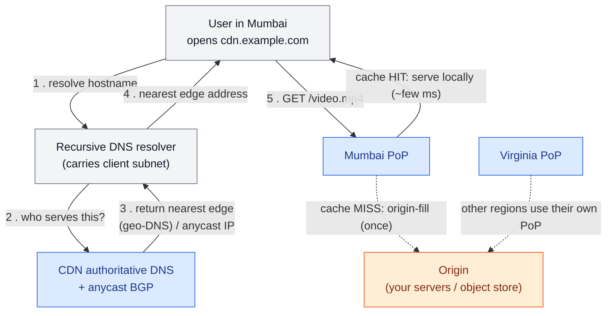

# CDN & Edge

> **Prerequisites:** [Caching](/synapse/system-design-from-first-principles/building-blocks/caching), [Networking Essentials](/synapse/system-design-from-first-principles/foundations/networking-essentials) | **You'll be able to:** explain why moving bytes physically closer to users is the only way to beat the speed of light; reason about cache-hit ratio as a business metric, not a vanity number; decide what is safe to cache at a shared edge and what must never be.

## The problem (why this exists)

You ship a product image, a JavaScript bundle, and a video from a single datacenter in Virginia. It is fast — for people near Virginia. A user in Mumbai clicks play and waits. Not because your servers are slow, but because the request must cross an ocean and back before the first frame even leaves the building.

The [networking lesson](/synapse/system-design-from-first-principles/foundations/networking-essentials) gave us the floor: light in fiber travels at roughly two-thirds of *c* — about 200,000 km/s — so New York ↔ London (~5,600 km) has a minimum round trip of ~56 ms, and in practice you budget over 80 ms, versus under 1 ms to a nearby server. Mumbai ↔ Virginia is more than twice that distance. No amount of faster code, a bigger database, or a smarter load balancer reclaims a millisecond of it. The bytes are simply too far away.

And it compounds. A modern web page is not one request; it is dozens — HTML, then the CSS and JS it references, then fonts and images. Every one pays the ocean-crossing tax. A 100 ms disadvantage per asset, multiplied across a page and a session, is the difference between an app that feels instant and one users abandon. There is exactly one lever that moves the physics: **put a copy of the content in a city near the user**. That is what a CDN is.

## Intuition first

A **Content Delivery Network** is a globally distributed cache of your content, run as a service by someone who has already built out hundreds of datacenters around the world. Instead of every user reaching back to your origin, they reach a nearby **edge location** — often called a **Point of Presence (PoP)** — that holds a copy of your files. If the copy is there, the user gets it in a few milliseconds off a machine in their own metro. If it isn't, the edge fetches it from your origin once, keeps it, and every subsequent nearby user is served locally.

The mental model is the [caching lesson](/synapse/system-design-from-first-principles/building-blocks/caching) stretched across geography. A cache trades staleness for speed by keeping a copy close to the reader; a CDN does exactly that, except "close" means *physically close* — same city — and the cache is replicated to every PoP the provider runs. The three questions from caching return wearing geographic clothes: **What do we cache?** (a keyed copy of a response). **How long?** (a TTL). **How do we drop a bad copy?** (invalidation — which, we'll see, gets genuinely hard when your cache lives in a thousand places at once).

The beginner's one-sentence takeaway: *a CDN serves your files from a city near the user, so the bytes have less distance to travel.* Everything below is the machinery that makes that true at scale — plus the newer twist that edge locations are close enough that it now pays to run a little of your *logic* there too, not just store your files.

## How it works

### Finding the nearest edge

The first problem is routing: a user in Mumbai types your URL — how does their request reach the Mumbai PoP rather than the Virginia one? The CDN sits in the request path from the first step, DNS: you point your domain's DNS at the provider, and their nameservers answer with the address of a nearby edge. Two mechanisms make "nearby" happen, and large providers combine them.

**DNS-based geo-routing.** The CDN's authoritative DNS looks at *where the query came from* — the resolver's IP, or an EDNS Client Subnet hint — and returns the IP of a close PoP. Different users resolving the same hostname get different answers, each pointed at their own metro [web: AWS CloudFront developer docs]. This is the "DNS as client-side load balancing" idea from the networking lesson, aimed at geography. Its weakness is inherited from DNS: the answer is only as fresh as the TTL, and it reflects the *resolver's* location, usually but not always near the user.

**Anycast.** The other approach announces the *same IP address* from every PoP simultaneously via BGP. The internet's own routing then delivers each user's packets to the topologically nearest announcement — the network just hands their packets to the closest edge. Cloudflare's network is built on anycast for exactly this reason [web: Cloudflare "What is Anycast?" learning center]. Anycast also degrades gracefully: if a PoP goes down, BGP re-converges to the next-nearest one with no DNS change to wait on.

Here is the routing decision, end to end:



### Cache keys and what "the same" means

Once a request lands on a PoP, the edge has to decide whether it already holds the answer. It does this the way any cache does — with a **cache key**. By default the key is built from the request: the hostname, the path, and usually the query string. A request for `/img/logo.png` is one key; `/img/logo.png?v=2` is, by default, a *different* key — which is exactly why "cache busting" works, appending a version to the URL forces a fresh key and a fresh fetch.

The subtlety, and a rich source of bugs, is that two requests you think are identical may need *different* cached copies — or two you think are different may safely share one. A response compressed for `Accept-Encoding: gzip` must not be served verbatim to a client that didn't send it. CDNs handle this by letting you fold specific request headers into the key (the HTTP `Vary` mechanism) — and by letting you *strip* dimensions that don't matter, so `?utm_source=twitter` and `?utm_source=email` collapse to one cached object [web: MDN HTTP `Vary` documentation]. Every dimension you add to the key multiplies the number of distinct objects and *lowers your hit ratio*; every one you wrongly strip risks serving the wrong body. Cache-key design is the quiet center of CDN tuning.

### TTLs, and pull vs push

How long may the edge keep a copy? That is the **TTL**, set by the origin with an HTTP header — `Cache-Control: max-age=3600` says "good for an hour" [web: MDN `Cache-Control` documentation]. Within the TTL the edge answers from its copy without contacting you. When the TTL expires the object is **stale**, and the edge revalidates — a conditional request (`ETag`) that lets the origin answer "still good" with a tiny `304` instead of resending the whole body.

Two models get content *into* the edge in the first place:

- **Pull (origin-fill on miss).** The default and by far the most common. The edge caches lazily: the *first* user to request an object in a given metro takes a cache miss, the edge fetches it from origin once, stores it, and everyone after them is served locally. You publish content simply by making it available at the origin; the CDN fills itself on demand. The cost is that first miss — and that a purge or a cold PoP means someone pays the origin round trip again.
- **Push.** You proactively upload content to the CDN ahead of demand, so even the first request in a region is a hit. This earns its keep for a small set of large, universally-wanted files with a predictable spike — a game patch, a launch-day video — where you'd rather not have the first user in every metro eat a cross-ocean fill, and you'd rather not have a thousand PoPs stampede your origin the moment the file goes live.

The overwhelming default is pull. Push is a deliberate optimization for known, hot, heavy content.

### The whole path, hit and miss

Putting the pieces together — the edge is a cache in front of your origin, and the only two outcomes are hit and miss:

```d2
direction: right
classes: {
  client: {style: {fill: "#f3f4f6"; stroke: "#6b7280"}}
  edge:   {style: {fill: "#dbeafe"; stroke: "#2563eb"}}
  svc:    {style: {fill: "#dcfce7"; stroke: "#16a34a"}}
  data:   {style: {fill: "#ffedd5"; stroke: "#ea580c"}}
  hit:    {style: {fill: "#dcfce7"; stroke: "#16a34a"}}
  miss:   {style: {fill: "#ffedd5"; stroke: "#ea580c"}}
}

user: User (Mumbai) {class: client}
pop: Nearest edge PoP {class: edge}

pop.hit: "Cache HIT\nserve local copy\n~ few ms" {class: hit}
pop.miss: "Cache MISS\nfetch + store" {class: miss}

origin: Origin\n(your servers / object store) {class: data}

user -> pop: "GET /video.mp4"
pop.hit -> user: "bytes, fast"
pop.miss -> origin: "origin-fill (once)\ncross-region round trip"
origin -> pop.miss: "object + Cache-Control TTL"
pop.miss -> user: "bytes (slow this once)"
```

The whole business case lives in the ratio between those two boxes. The **cache-hit ratio** is the fraction of requests served from the edge without touching origin. At 95%, only 1 in 20 requests pays the origin round trip and consumes origin bandwidth and compute; the other 19 are served in-metro, fast and nearly free. Nudge that from 95% to 98% and you cut origin load — and egress bills — by more than half. This is why hit ratio is a business metric, not a diagnostic: it is proportional to how much traffic you serve cheaply, and inversely proportional to how much infrastructure you must run yourself.

### Purging: easy to want, hard to do globally

Suppose you shipped a broken CSS file and it's now cached, with a one-day TTL, in every PoP on earth. You can't wait a day. You issue a **purge** (or **invalidation**): a command telling the CDN to drop that object everywhere so the next request re-fills from your fixed origin.

The reason this is hard is the reason the CDN was valuable in the first place: the cache lives in hundreds of independent locations. A purge is a *distributed* operation — the instruction has to propagate to every PoP, and until it lands, that PoP keeps serving the old bytes. Providers make global purge fast — Cloudflare documents typical global purge on the order of seconds [web: Cloudflare cache-purge documentation] — but "fast" is not "instant," and not free to do constantly. Two consequences shape real designs:

1. **Prefer versioned URLs over purging.** Instead of overwriting `/app.js` and purging it, publish `/app.<contenthash>.js` and change the reference in your HTML. The new URL is a new cache key that was never cached, so it's correct everywhere the instant you point at it — no purge, no propagation window, and the old version can expire on its own. Immutable, content-addressed assets are the single most effective CDN pattern precisely because they sidestep invalidation entirely.
2. **Purge is for mistakes and the un-versionable.** Keep it for the broken deploy and for URLs you don't control (a fixed API path), and lean on short TTLs plus `stale-while-revalidate` — a directive that lets the edge serve a slightly stale copy instantly while it refreshes in the background — for content that changes on its own schedule [web: MDN `stale-while-revalidate` documentation].

### Private content: signed URLs and signed cookies

A CDN's cache is, by design, a shared surface — that's what makes it cheap. So how do you serve a *private* object through it, like a paid video or a user's file in [object storage](/synapse/system-design-from-first-principles/building-blocks/object-storage-and-blobs)? Not with a login check at the edge. Instead you hand the authorized user a **signed URL** or **signed cookie**: a normal-looking link carrying a cryptographic signature and an expiry, produced by your origin with a secret key. The edge verifies the signature and expiry before serving; anyone without a valid, unexpired signature is refused [web: AWS CloudFront signed URLs and signed cookies documentation].

This is the exact mechanism the [object-storage lesson](/synapse/system-design-from-first-principles/building-blocks/object-storage-and-blobs) uses for presigned URLs, now extended through the CDN: your application server authorizes *once*, mints a short-lived signed link, and the heavy bytes flow from the nearest edge to the user without touching your application servers. Signed URLs suit one-off links (a download button); signed cookies suit granting access to *many* objects at once (every segment of a streamed video) without signing each URL. Either way, the private bytes still get the proximity and offload of the CDN — the signature just gates who may fetch them.

### Edge compute, briefly

If the provider already runs code in hundreds of locations next to the user, the natural next step is to let *you* run a little logic there too. **Edge compute** — Cloudflare Workers, AWS Lambda@Edge, Fastly Compute — runs small functions at the PoP, in the request path, before or instead of reaching your origin [web: Cloudflare Workers documentation; AWS Lambda@Edge documentation].

What it's genuinely good for is work that is *cheap, stateless, and latency-sensitive* — the things you'd hate to send across an ocean:

- Request manipulation and routing: rewrite headers, A/B-split traffic, redirect by country, normalize the cache key.
- Auth at the door: validate a token or signed cookie and reject bad requests at the edge instead of forwarding them.
- Personalization on a cached shell: serve one cached HTML page to everyone, then stitch in the user's name or locale so the expensive part stays cacheable.

What it is *not* is a place to run your whole backend. Edge functions are constrained — tight CPU and memory limits, short execution budgets, and no cheap access to your primary database, which still lives in one or a few regions. Reach across the ocean to that database from the edge and you've reintroduced the very latency you came to delete. The durable rule: **push compute to the edge only when it needs to be near the user and can act on data that is also near the user** (or on the request itself). Everything stateful and central stays central.

## Trade-offs

| Decision | Gives you | Costs you | Use when |
| --- | --- | --- | --- |
| Long TTL | High hit ratio, minimal origin load, cheapest egress | Stale content lingers; purges become necessary | Immutable/versioned assets; content that rarely changes |
| Short TTL + `stale-while-revalidate` | Fresh content, no purge storms | More revalidation traffic, slightly lower hit ratio | Content that updates on its own schedule (feeds, prices) |
| Pull (origin-fill) | Zero pre-publishing work; fills on demand | First request per metro is a miss; cold-PoP penalty | The default — almost everything |
| Push (pre-warm) | Even the first request is a hit; no origin stampede | Operational effort; wasted storage for cold objects | Large, hot, predictable files (launch video, game patch) |
| Anycast routing | Instant failover, no DNS TTL wait | Less control over exact PoP selection | Provider-managed networks (e.g. Cloudflare) |
| DNS geo-routing | Fine-grained, per-metro answers | Failover bounded by DNS TTL; reflects resolver location | Multi-CDN, or where you steer traffic yourself |
| Versioned URLs | Correct everywhere instantly; no purge | Build tooling must rewrite references | Any deployable static asset — strongly preferred |
| Global purge | Fixes a bad object without a redeploy | Propagation delay; rate-limited; not instant | Broken deploys; un-versionable fixed paths |

## Numbers that matter

- **The physics floor.** ~200,000 km/s in fiber; a round trip grows ~1 ms per ~100 km, so an intra-metro edge (<1 ms) versus a cross-ocean origin (80+ ms) is a 50–100× latency gap you cannot close any other way.
- **Tail delay is worse than the mean.** Cross-region round trips have reached several *minutes* at high percentiles, and even intra-datacenter delay can exceed a minute during a switch reconfiguration [p. 350]. A cache miss exposes the user to the origin's whole tail; serving from the edge caps the tail your users see.
- **Hit ratio is leverage, not vanity.** Going from a 90% to a 99% hit ratio cuts origin-bound requests roughly tenfold (10% → 1%). Since the miss path is the expensive one, hit ratio maps almost linearly onto both your latency profile and your infrastructure bill.
- **Page fan-out multiplies everything.** One page is dozens of assets; a session is many pages. The per-asset proximity win is small alone and enormous in aggregate — which is why "static assets on a CDN" is the most universal optimization on the web.

## In production

Every large web property runs behind a CDN — the named providers (Cloudflare, Akamai, Fastly, AWS CloudFront, Google Cloud CDN, Fastly) collectively front a large share of internet traffic [web: Cloudflare, Akamai company documentation]. A few patterns recur once you look at how they're actually operated.

**The two-tier cache.** Big CDNs don't run one flat layer of PoPs. They put many small edge PoPs close to users and a smaller number of larger **regional/shield** caches behind them. A miss at a small edge checks the regional cache before crossing to your origin, so your origin sees traffic only from a handful of shields rather than every edge on earth. This is **origin shielding** — how a CDN protects your origin from the thundering herd a single-tier design would create the moment a popular object expires everywhere at once [web: AWS CloudFront origin shield documentation].

**Video and the [YouTube](/synapse/system-design-from-first-principles/case-studies/youtube)-shaped case.** Streaming is the canonical CDN workload: video is chopped into many small segment files (a few seconds each), every segment is an immutable, cacheable object with a stable URL, and the player fetches them in sequence from the nearest edge. Immutability makes the cache trivially correct; proximity makes startup fast and rebuffering rare. Netflix took this to its logical end with Open Connect, placing its own cache appliances *inside* ISP networks — the CDN idea pushed one hop closer than a normal PoP [web: Netflix Open Connect documentation].

**File sync and [Dropbox](/synapse/system-design-from-first-principles/case-studies/dropbox)-shaped downloads.** When the heavy object is a user's file rather than public media, the CDN still carries the bytes — but access is gated with signed URLs, and the origin is object storage rather than an application server. The application authorizes, mints a signed link, and steps out of the data path entirely; the edge serves the blob. This is the exact seam between this lesson and [object storage](/synapse/system-design-from-first-principles/building-blocks/object-storage-and-blobs).

**What operators watch.** Cache-hit ratio per property (a drop usually means a cache-key change or a bad `Cache-Control` header quietly disabling caching); origin egress and request rate (the bill, and the blast-radius if the CDN has a bad day); and purge volume (constant purging means versioned URLs haven't been adopted). The CDN also does double duty as DDoS defense and TLS termination — recall that TLS is usually terminated at the edge, so even fully dynamic, uncacheable traffic benefits by moving the handshake round trips onto the short client↔edge path.

## Pitfalls & interview traps

<div style="border-left:4px solid #da5233;background:rgba(218,82,51,0.08);padding:0.6rem 1rem;border-radius:0 0.5rem 0.5rem 0;margin:1.25rem 0">

⚠️ **The private-data leak.** The single most dangerous CDN mistake is caching personalized or private content at a shared edge. If an authenticated response — a page showing *this* user's name, balance, or cart — is served with a caching `Cache-Control` header and a cache key that doesn't include the user's identity, the edge stores one user's private page and serves it to the *next* person who requests that URL. This has caused real, public data-exposure incidents. The rule is absolute: responses that vary per user must be marked `Cache-Control: private, no-store` (or `no-cache`), and anything you *do* cache per-user must carry the user identity in the cache key. When in doubt, do not cache authenticated responses at a shared edge.

</div>

A few more traps interviewers reach for:

- **"Just purge it" as a change-propagation strategy.** Global purge is not instant and is rate-limited; purging on every content edit will hit propagation delay and provider limits. The senior answer is versioned/immutable URLs, with purge reserved for mistakes. Expect the follow-up: *"Your CSS is cached with a one-day TTL and you just shipped a bug — fix it in production."* The strong answer names both the immediate purge and the structural fix (content-hashed filenames) so it never recurs.
- **Confusing a low hit ratio with a slow CDN.** A CDN that's "not helping" is almost always a caching-*configuration* problem — an over-specific cache key (a session cookie or `utm_` parameter fragmenting every object into millions of one-hit variants), or an origin sending `Cache-Control: no-cache` on things that are actually static. The fix is in the headers and the key.
- **Putting stateful logic at the edge.** Edge functions that reach back to a single-region database on every request delete the latency win and add a failure mode.
- **Forgetting the cold-cache cost.** "Everything is served from the edge" is only true in steady state. The first request per object per metro is a miss, and a mass invalidation makes *every* PoP cold at once — what origin shielding and staggered TTLs exist to soften.
- **Treating the CDN as only for images.** It also terminates TLS, absorbs DDoS, and increasingly runs compute. Reaching for a CDN should be reflexive for any read-heavy, geographically-distributed, static-or-semi-static workload.

## Check yourself

```quiz
{"prompt": "Which of these is the SAFEST thing to cache at a shared CDN edge with a long TTL?", "options": ["A logged-in user's account dashboard HTML", "A product image referenced by a content-hashed URL like /img/shoe.a1b2c3.jpg", "The JSON response of GET /api/cart for the current user", "A Set-Cookie response that establishes a new session"], "answer": "A product image referenced by a content-hashed URL like /img/shoe.a1b2c3.jpg"}
```

```quiz
{"prompt": "A user in Mumbai requests a video for the first time and the nearest PoP has never seen it. What happens?", "options": ["The request fails until you push the file to that PoP", "A cache miss: the edge fetches it from origin once, stores it, and serves it — subsequent nearby users get a hit", "Every PoP worldwide fetches the file simultaneously to stay consistent", "The user is redirected to the origin in Virginia for the whole session"], "answer": "A cache miss: the edge fetches it from origin once, stores it, and serves it — subsequent nearby users get a hit"}
```

```quiz
{"prompt": "You shipped a broken /app.css (TTL: 24h) that is now cached in every PoP. What is the BEST durable fix going forward?", "options": ["Wait for the 24-hour TTL to expire everywhere", "Issue a global purge and keep overwriting /app.css on every deploy", "Purge once to stop the bleeding, then switch to content-hashed filenames like /app.<hash>.css so future deploys never need purging", "Lower every asset's TTL to a few seconds permanently"], "answer": "Purge once to stop the bleeding, then switch to content-hashed filenames like /app.<hash>.css so future deploys never need purging"}
```

<details>
<summary><strong>Q:</strong> Anycast and DNS geo-routing both send a user to a nearby edge. What does anycast give you that plain DNS geo-routing does not?</summary>

**A:** Failover that isn't bottlenecked by DNS TTL. With DNS geo-routing, if the PoP you handed out goes down, clients keep dialing the dead address until their cached DNS answer expires — up to the TTL you configured. Anycast announces the *same* IP from every PoP over BGP, so when a PoP fails, the internet's routing simply re-converges and delivers packets to the next-nearest PoP, with no DNS change to wait on. Anycast trades away fine-grained control over exactly which PoP a user hits (you're at the mercy of BGP's notion of "nearest") in exchange for that automatic, propagation-free failover. Large providers often use anycast for the network and DNS for coarser steering, combining both.
</details>

<details>
<summary><strong>Q:</strong> Your CDN hit ratio silently dropped from 96% to 40% overnight, origin load spiked, and nobody changed the CDN config. What do you investigate first?</summary>

**A:** A change in the *cache key* or in the origin's caching *headers* — because the CDN itself didn't change, so something upstream made objects stop matching or stop being cacheable. Prime suspects: (1) the origin started emitting `Cache-Control: no-cache`/`private` (a framework upgrade or a misconfigured middleware doing this to *all* responses is common); (2) a new query parameter or request header got folded into the cache key, fragmenting one hot object into millions of one-hit variants (a tracking parameter like `utm_source`, or a per-request cookie, is the classic culprit); (3) a deploy changed asset URLs so the whole population is cold at once. The diagnosis is header inspection and cache-key configuration, not "the CDN is broken."
</details>

<details>
<summary><strong>Q:</strong> Why is running your primary application logic at the edge usually a mistake, even though the edge is closest to the user?</summary>

**A:** Because most application logic is *stateful* — it reads and writes a primary database that lives in one or a few regions. An edge function that calls back to that central database on every request pays the full cross-region round trip anyway (the very latency the edge was supposed to remove), and it adds a new failure mode and a new place to reason about consistency. Edge compute wins only for work that is local to the *request* (header rewriting, routing, token validation, cache-key normalization) or that acts on data already replicated to the edge. The durable rule: push compute to the edge only when both the compute *and* the data it needs are near the user; everything central stays central.
</details>

## PoC — Proof of concepts

A CDN is mostly an HTTP cache placed close to users — so the open building blocks are readable:

- [MDN — HTTP caching](https://developer.mozilla.org/en-US/docs/Web/HTTP/Guides/Caching) — the
  `Cache-Control`, `Vary` and revalidation semantics every edge decision rests on.
- [Apache Traffic Server](https://github.com/apache/trafficserver) — a production caching proxy that
  powered a real CDN; the open-source thing closest to what a CDN edge node actually runs.
- [Envoy](https://github.com/envoyproxy/envoy) — increasingly the edge/mid-tier proxy of choice;
  useful for seeing routing, TLS termination and cache filters as configuration.

## Sources

- DDIA2 ch. 9 p. 350 (cross-region round-trip tail latency reaching minutes at high percentiles; intra-DC delay exceeding a minute during topology reconfiguration — the tail a cache miss exposes).
- CDN internals (Tier-3, web): [web: Cloudflare "What is Anycast?" learning center] (anycast routing and failover); [web: AWS CloudFront developer documentation] (geo-DNS routing, signed URLs and signed cookies, origin shield); [web: MDN `Cache-Control`, `Vary`, and `stale-while-revalidate` documentation] (TTLs, cache-key headers, background revalidation); [web: Cloudflare cache-purge documentation] (global purge propagation on the order of seconds); [web: Cloudflare Workers and AWS Lambda@Edge documentation] (edge compute capabilities and constraints); [web: Netflix Open Connect documentation] (ISP-embedded caching appliances).
