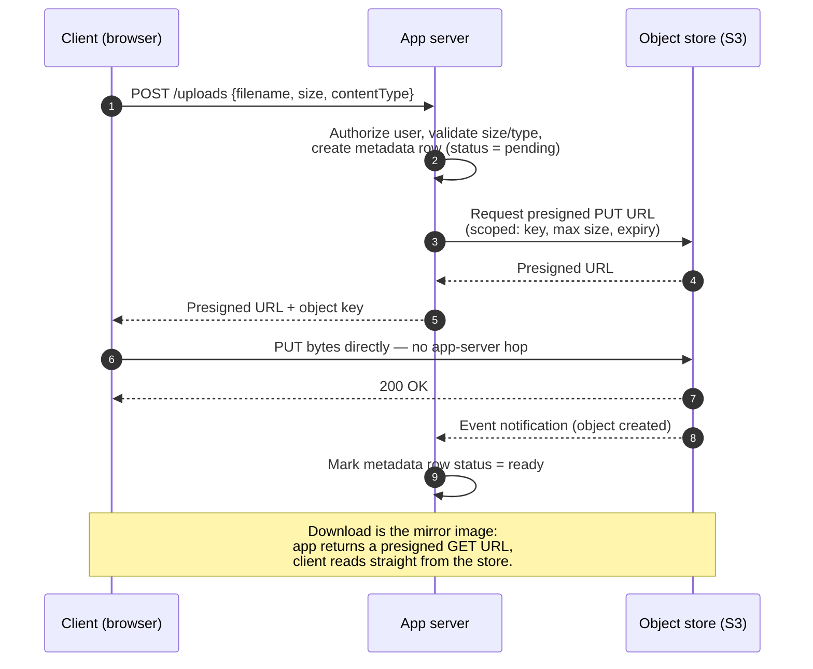

# Object Storage & Blobs

> **Prerequisites:** [Replication](/synapse/system-design-from-first-principles/distributed-data/replication), [Data Models](/synapse/system-design-from-first-principles/data-foundations/data-models) | **You'll be able to:** (1) explain the object-storage model and when to reach for it instead of a database; (2) design a blob upload/download path where bytes never touch your application servers; (3) reason about durability, consistency, and cost tiering well enough to defend the choice in an interview.

## The problem (why this exists)

Your app lets users upload profile pictures. Early on, the obvious design works: the browser POSTs the image to your API server, your server writes it to a database `BLOB` column or a local disk, done. Then the product grows. Users upload 4K videos. A single request is now 2 GB. Ten users upload at once and your API server — the same box that also serves login, search, and the news feed — is pinned at 100% network and memory, buffering gigabytes it doesn't even care about. It's acting as a very expensive, very slow pipe.

Two things have gone wrong. First, you're storing large opaque bytes in a system built for small structured rows. A relational database is tuned for millions of KB-sized values with frequent low-latency random access; object stores and distributed filesystems are tuned for the opposite — large objects (MB–GB) read less frequently in bigger chunks [DDIA2 p. 461]. Putting a 2 GB video in a `BLOB` column bloats your backups, wrecks your buffer cache, and slows every unrelated query. Second, you're routing the bytes *through* the machine that should be doing business logic. That machine's job is to decide *who* is allowed to upload — not to personally carry every byte.

This lesson is about the storage layer that solves both problems: **object storage**, the giant key→file bucket you talk to over HTTP.

## Intuition first

Forget filesystems for a moment. An object store is a **dictionary that lives across a network**. You give it a key (a string) and a blob of bytes plus some metadata; later you hand back the key and get the bytes. That's the whole mental model a beginner needs: *S3 is a giant hash map from string keys to files, and you talk to it over HTTP.*

Two properties make it different from the filesystem on your laptop, and both fall straight out of "it's a networked dictionary":

- **It's flat, not a tree.** There are no real directories. An object's address is just `bucket` + `key`, exposed as a URL like `s3://my-bucket/videos/2026/cat.mp4` [DDIA2 p. 460]. The slashes in that key are *just characters* — the store doesn't have folders, it fakes them by letting you list keys that share a prefix, which behaves like a recursive `ls -R` [DDIA2 pp. 460–461]. Bucket names are globally unique; keys are unique within a bucket [DDIA2 p. 460].
- **Objects are effectively immutable.** You `put` a whole object and `get` a whole object. You cannot open a handle and seek into the middle to overwrite 50 bytes the way you would a file — there is no `fopen`/`fseek`. Changing an object means rewriting it in full, just like a value in a key-value store [DDIA2 p. 460]. (A few stores bolt on append — S3 Express One Zone, Azure Blob — but the base model is: write once, replace wholesale [DDIA2 p. 460].)

Because it's reached over HTTP by URL, the object store is a *service anyone with the right credentials can call directly* — including the user's own browser. That single fact is the key that unlocks the entire architecture below.

## How it works

### The store itself

Concrete instances: Amazon **S3**, Google Cloud Storage, Azure Blob Storage, OpenStack Swift [DDIA2 p. 460]. S3's HTTP API became a de-facto standard, so a whole ecosystem speaks it — MinIO, Cloudflare R2, Backblaze B2, Tigris [DDIA2 p. 459]. Under the hood the store shards each object across many machines and **replicates** it for durability, either as full copies or via **erasure coding** (Reed–Solomon), which recovers lost data with far less storage overhead than N full copies — conceptually RAID, but done in software over an ordinary datacenter network [DDIA2 pp. 459–460]. We'll return to what that buys you under "durability."

Critically, object stores **separate storage from compute**: the bytes sit in a storage service, and whatever processes them runs elsewhere, so you scale CPU and storage independently [DDIA2 p. 461]. This is exactly why the store can afford to talk directly to millions of clients — it isn't your app tier, it's a purpose-built fleet.

### The move: get the bytes out of your app tier

Here's the reframe that matters most. Your application server's role shifts from *transferring data* to *controlling access*. Think of it as a ticket booth: the booth decides whether you may enter and hands you a ticket, but you walk through the turnstile yourself. Concretely, the app hands the client a **presigned URL** — a time-limited, cryptographically signed URL that grants permission to `PUT` (or `GET`) one specific object key, and nothing else. The client then uploads or downloads **directly to/from the object store**, and the bytes never traverse your servers.



Notice the split of concerns. Your database holds a small **metadata row** — object key, owner, size, content type, status — while the store holds the heavy bytes. The app writes the row and mints the URL (microseconds of work); the store moves the gigabytes. Downloads mirror this: the app returns a presigned `GET` URL (often fronted by a CDN — see [CDN & Edge](/synapse/system-design-from-first-principles/building-blocks/cdn-and-edge)) and the client streams from the store directly.

### Big files: multipart & resumable uploads

A single `PUT` of a 5 GB video is fragile. Over a 100 Mbps connection that upload takes about 429 seconds — over seven minutes — and if the connection blips at minute six, a naive single-request upload starts over from zero. **Multipart upload** fixes this: the client splits the file into parts (S3 parts are 5 MB–5 GB; Azure block-blob blocks are 4 MB–100 MB), uploads each part independently — in parallel, and each retryable on its own — then sends a final "complete" call that stitches the parts into one object. A network hiccup now costs you one 5 MB part, not the whole file. The client can also track which parts succeeded and **resume** after a crash. Each part typically gets its own presigned URL, so even multi-GB uploads never touch your app tier.

### Durability vs availability

These two words get conflated constantly; interviewers love the distinction.

- **Durability** = "once I've stored it, will the bytes still be there later?" It's about *not losing* data.
- **Availability** = "can I read/write it right now?" It's about *being reachable* at this instant.

S3 advertises **eleven nines** of durability — 99.999999999%. Intuitively: store ten million objects and you'd expect to lose one about every ten thousand years. How? By storing enough independent redundancy across enough independent failure domains that the probability of losing *every* copy of an object in the same window is astronomically small. The store writes each object across multiple devices, racks, and (for the standard tier) multiple availability zones, using replication or erasure coding so that several disks or a whole zone can die and the object is still fully reconstructable [DDIA2 pp. 459–460; DDIA2 pp. 202–203]. DDIA describes exactly this pattern — object stores offering "high-durability multi-zone/region replication" as a first-class property [DDIA2 pp. 202–203].

<div style="border-left:4px solid #15448e;background:rgba(21,68,142,0.08);padding:0.6rem 1rem;border-radius:0 0.5rem 0.5rem 0;margin:1.25rem 0">

The exact **mechanism** behind "11 nines" — the specific erasure-coding parameters, how many copies across how many zones, the failure-independence assumptions — is provider-internal and not in our Tier-1 sources. Treat the *figure* as a published guarantee and the *derivation* as `[web: AWS S3 durability model — reputable but not primary here]`. The takeaway that matters: durability comes from **independent redundancy across independent failure domains**, and it is far higher than any single database you'd run yourself.

</div>

Availability is the *lower* of the two numbers — the standard S3 tier targets around four nines (~99.99%) of availability, because a zone outage can make an object briefly unreachable without ever endangering the bytes `[web: AWS S3 SLA]`. Durability outlives availability: your data survives an outage you can't read through.

### Storage classes & lifecycle tiering

Not all bytes are equal. Yesterday's video thumbnail is read constantly; a seven-year-old compliance PDF is read almost never but must be kept. Object stores expose **storage classes** that trade access cost against storage cost: a *hot* tier (cheap, fast reads, higher per-GB price), an *infrequent-access* tier (cheaper per-GB, but you pay a retrieval fee and often higher latency), and an *archive* tier (cheapest per-GB storage, but restoring an object takes minutes to hours). DDIA notes the same economics from the database side: object storage "optimized for infrequent access is cheaper for old data" [DDIA2 p. 197], and lists "cheap tiered storage" as a defining object-store property [DDIA2 pp. 202–203].

You don't move objects between tiers by hand. You declare **lifecycle rules** — "after 30 days, demote to infrequent access; after 90, archive; after 365, delete" — and the store enforces them automatically.

```d2
direction: right
classes: {
  svc:   {style: {fill: "#dcfce7"; stroke: "#16a34a"}}
  data:  {style: {fill: "#ffedd5"; stroke: "#ea580c"}}
  async: {style: {fill: "#f3e8ff"; stroke: "#9333ea"}}
}

upload: "New object PUT\n(app-authorized)" {class: svc}
hot: "Hot / Standard\nfrequent reads, ms latency\nhighest cost per GB stored" {class: data}
warm: "Infrequent Access\ndays old, occasional reads\nlower cost per GB + retrieval fee" {class: data}
cold: "Archive\nweeks+ old, rarely read\ncheapest per GB, restore in min-hrs" {class: data}
gone: "Expire / delete" {class: async}

upload -> hot: written here
hot -> warm: "lifecycle rule:\nafter 30 days"
warm -> cold: "lifecycle rule:\nafter 90 days"
cold -> gone: "lifecycle rule:\nafter 365 days"
```

The same lifecycle machinery does housekeeping: a rule that auto-deletes **incomplete multipart uploads** after 24–48 hours reclaims the storage of uploads that were started but never completed.

### Consistency model

When you `PUT` a brand-new object and immediately `GET` it, do you see it? Modern S3 provides **strong read-after-write consistency** for new objects — the write is visible the instant it succeeds `[web: AWS S3 consistency docs]`. This wasn't always true: **historically S3 was eventually consistent**, and a read that raced a just-completed write could return a 404 or a stale version, which forced awkward workarounds. That caveat is worth knowing because a lot of older system-design writing assumes it, and because plenty of S3-compatible stores still offer weaker guarantees — DDIA warns explicitly that object stores' "consistency guarantees differ" and you should test that a given store behaves as you expect [DDIA2 p. 460]. Beyond simple read-after-write, some object stores now support **conditional writes (compare-and-set)**, which is strong enough to build transactions and even leader election on top of the store [DDIA2 pp. 202–203] — a sign of how far the model has come from "dumb file dump."

## Trade-offs

| Decision | Gives you | Costs you | Use when |
| --- | --- | --- | --- |
| Object store vs. DB `BLOB` column | Cheap, near-infinite, 11-nines storage; keeps big bytes out of your DB's cache/backups | Bytes aren't queryable via SQL; you store a key, not the file, in the DB | File > ~10 MB and you don't need to query *inside* it |
| Presigned direct transfer vs. proxy through app | App tier stays tiny; bandwidth scales with the store, not your fleet | More moving parts; metadata can drift from actual store state | Files are large or traffic is heavy — essentially always for real blobs |
| Multipart/resumable vs. single `PUT` | Retry a part, not the whole file; parallel upload; resume after crash | More client complexity; must clean up abandoned parts | Files above ~100 MB, where a single request's failure really hurts |
| Hot tier vs. lifecycle to cold/archive | Big storage-cost savings on rarely-read data | Retrieval fees + latency (minutes–hours for archive) on the rare read | Access frequency drops predictably with object age |
| Immutable objects | Simple, cacheable, versionable; no in-place corruption | No random writes; "editing" = rewrite whole object | Almost always — embrace it rather than fighting it |

## Numbers that matter

- **Durability:** 11 nines (99.999999999%) on S3 standard; availability is lower, ~4 nines [`web: AWS S3 SLA`].
- **When to use blob storage:** rule of thumb — file over ~**10 MB** and doesn't need SQL queries → object store, not the DB.
- **When direct upload earns its keep:** files over ~**100 MB**, where the pain of proxying through the app tier becomes real.
- **Upload time:** a 5 GB video over a 100 Mbps link ≈ **429 s (7 min 9 s)** — the case for chunked, resumable uploads.
- **Part sizes:** S3 multipart parts **5 MB–5 GB**; Azure block-blob blocks **4 MB–100 MB**.
- **Metadata limits:** S3 object tagging caps at **10 tags × 256 chars** — object metadata is for small labels, not a database.
- **Cleanup:** expire incomplete multipart uploads after **24–48 h** via a lifecycle rule.

For back-of-envelope storage sizing (objects × average size × replication factor × cost/GB across tiers), see the numbers module and cross-check against [Specialized Stores](/synapse/system-design-from-first-principles/building-blocks/specialized-stores).

## In production

**Dropbox and file sync.** A file-sync product is essentially an object store plus a metadata service and a sync protocol. The bytes live in blob storage (chunked, deduplicated, content-addressed); a separate metadata database tracks which chunks compose which file version for which user. Clients upload and download chunks directly via signed URLs, and the app server only arbitrates permissions and reconciles metadata — the pattern this whole lesson describes, at scale. Walk it end to end in the [Dropbox case study](/synapse/system-design-from-first-principles/case-studies/dropbox).

**YouTube and video platforms.** Raw uploads land in object storage via multipart upload, then a **transcoding pipeline** — kicked off by a store **event notification** dropped onto a queue — reads the original object, produces many renditions (resolutions/codecs), and writes each back as new objects. Delivery is a `GET` from the store fronted by a CDN, using HTTP **range requests** so a player can seek without downloading the whole file. See the [YouTube case study](/synapse/system-design-from-first-principles/case-studies/youtube).

**Keeping metadata honest.** The one genuinely hard operational problem is that the upload happens *outside* your app's control, so your metadata row can lie. Two mechanisms tame it, in layers. First, the store fires an **event notification** when an object is created (S3 → SNS/SQS, GCS → Pub/Sub, Azure → Event Grid), and a consumer flips the metadata row to `ready` — a natural fit for your [queues & brokers](/synapse/system-design-from-first-principles/building-blocks/queues-and-brokers) layer. Second, because events can be missed, a periodic **reconciliation job** compares long-`pending` rows against what's actually in the store and repairs the drift. This is the same "derived data must be pushed/reconciled, not trusted blindly" discipline DDIA raises when batch jobs write results into a live-serving store [DDIA2 pp. 479–481].

**Object stores as database backends.** The frontier: stores are no longer just for blobs. Their cheap tiered storage, multi-zone durability, and conditional-write support now underpin live query systems — "zero-disk" architectures (WarpStream, Turbopuffer, most cloud warehouses) persist *everything* to object storage and use local disk only as cache [DDIA2 p. 203]. The humble key→blob bucket has quietly become a foundational storage primitive.

## Pitfalls & interview traps

<div style="border-left:4px solid #da5233;background:rgba(218,82,51,0.08);padding:0.6rem 1rem;border-radius:0 0.5rem 0.5rem 0;margin:1.25rem 0">

⚠️ **Never stream large files through your application servers.** The single most common blob-design mistake is proxying bytes: client → app server → object store. It turns every app instance into a bandwidth-bound, memory-hungry pipe, couples upload throughput to your compute fleet, and blows request timeouts on big files. The app should mint a **presigned URL** and step out of the byte path entirely. If your design has gigabytes flowing through the API tier, you've missed the point of object storage.

</div>

Other traps:

- **Treating the object store like a mutable filesystem.** There are no in-place edits, no atomic renames (a "rename" is copy-to-new-key-then-delete, and it isn't atomic), no file locks, and no real directories [DDIA2 pp. 460–461]. Designs that assume "just append to the file" or "move this folder atomically" are wrong. Model objects as **immutable, versioned** — to change one, write a new object (often a new key) and update the metadata pointer.
- **Assuming strong consistency everywhere.** S3 gives read-after-write for new objects today, but many S3-*compatible* stores and older assumptions don't — DDIA's advice is to verify the actual guarantees of the store you're using [DDIA2 p. 460]. Don't build a correctness-critical read-after-write loop without confirming it holds.
- **Over-scoping presigned URLs.** A presigned URL is a bearer credential. Scope it tightly — one key, minimal expiry, size limits, expected content-type — or a leaked URL becomes an open write endpoint. The follow-up an interviewer asks after you say "presigned URL" is almost always *"how do you prevent abuse of it?"*
- **Cramming queryable data into object metadata.** With only ~10 small tags per object, the store's metadata is for labels, not search. Anything you need to *query* belongs in your database next to the object key.

## Check yourself

```quiz
{"prompt": "Why do we hand the client a presigned URL and let it upload straight to the object store, instead of streaming the bytes through the application server?", "options": ["Because the object store cannot authenticate users, so the app must generate the URL first", "So the large bytes never consume the app tier's bandwidth and memory, letting upload throughput scale with the store rather than the compute fleet", "Because presigned URLs compress the file before upload", "Because the database requires the file to arrive as a single stream"], "answer": "So the large bytes never consume the app tier's bandwidth and memory, letting upload throughput scale with the store rather than the compute fleet"}
```

```quiz
{"prompt": "An interviewer says 'S3 gives eleven nines of durability but only about four nines of availability.' What does this mean?", "options": ["The data is very unlikely to be lost, but at any given moment it may briefly be unreachable", "The data is often lost but always reachable", "Durability and availability are the same thing measured on two scales", "Eleven nines refers to upload speed and four nines to download speed"], "answer": "The data is very unlikely to be lost, but at any given moment it may briefly be unreachable"}
```

```quiz
{"prompt": "You need to change 50 bytes in the middle of a 2 GB object in S3. What actually happens?", "options": ["The store seeks to the offset and overwrites those 50 bytes in place", "You must rewrite the whole object, because objects are immutable — there is no in-place random write", "The store locks the object, edits it, then unlocks it", "You issue an atomic rename to swap the bytes"], "answer": "You must rewrite the whole object, because objects are immutable — there is no in-place random write"}
```

```quiz
{"prompt": "Which is the best reason to put a lifecycle rule that moves 90-day-old objects to an archive tier?", "options": ["Archive storage reads faster than the hot tier", "Rarely-read old data costs far less per GB in archive, at the price of slow, fee-bearing retrieval on the rare read", "Archive tier gives more durability nines than standard", "It makes the objects queryable via SQL"], "answer": "Rarely-read old data costs far less per GB in archive, at the price of slow, fee-bearing retrieval on the rare read"}
```

<details>
<summary>Your upload flow marks the metadata row <code>ready</code> as soon as the app returns the presigned URL. Why is that a bug, and how do you fix it?</summary>

The app returning the URL only means *permission was granted* — the client may still fail, abandon, or never actually complete the `PUT`. Marking `ready` there means your database claims the file exists when the store may hold nothing. Fix it by flipping the row to `ready` only when the store confirms the object exists: subscribe to the store's **object-created event** (S3→SNS/SQS, GCS→Pub/Sub, Azure→Event Grid) and update on that event. Add a **reconciliation job** that sweeps long-`pending` rows against the store to catch missed events. The metadata's source of truth is the store, not the act of handing out a URL.

</details>

<details>
<summary>A teammate proposes storing user documents in the object store and letting the app "append a new paragraph" to an existing document object on each edit. What's wrong, and what would you do instead?</summary>

Object stores don't support in-place random writes or partial edits — an object is written or replaced wholesale [DDIA2 p. 460]. "Append a paragraph" would mean downloading the whole object, editing, and re-uploading the entire thing on every keystroke-batch, which is slow and race-prone. Better: treat each save as writing a **new immutable object version** (new key or versioned object) and update a small metadata pointer in the database to the current version. That gives you cheap history/rollback for free and matches the store's immutable grain instead of fighting it. For genuinely fine-grained collaborative editing, the live edit state belongs in a different system (a database or an operational-transform/CRDT service), with the object store holding periodic materialized snapshots.

</details>

<details>
<summary>Why might a read-after-write loop that worked on real S3 break when you point it at a self-hosted S3-compatible store?</summary>

Real S3 provides strong read-after-write consistency for new objects, so a `GET` immediately after a successful `PUT` returns the object. Many S3-*compatible* stores (and S3 itself historically) offer weaker, eventually-consistent behavior, where that immediate read can 404 or return a stale version. DDIA's explicit warning is that object stores' consistency guarantees differ and you must test that a given store behaves as expected [DDIA2 p. 460]. The fix is to not assume: confirm the store's guarantee, and if it's eventual, drive the follow-up read off the store's object-created event rather than an optimistic immediate `GET`.

</details>

## Sources

- DDIA2 ch. 11 pp. 459–461 — object-store model (flat bucket+key, immutability, no directories/links/atomic renames), storage-vs-compute separation, replication & erasure coding, KV-vs-object-store access profiles.
- DDIA2 ch. 6 pp. 197, 202–203 — tiered storage economics for cold data; object stores as durable multi-zone backends with conditional-write (CAS) and cheap tiered storage.
- DDIA2 ch. 11 pp. 479–481 — pushing/reconciling derived data into serving systems (the metadata-consistency discipline).
- `[web: AWS S3 durability model / SLA / consistency docs]` — the internal mechanism behind eleven-nines durability, the standard-tier availability target, and strong read-after-write consistency for new objects (reputable/provider docs; not a Tier-1 source here). Object-storage internals (erasure-coding parameters, placement) are provider-internal and flagged as web-derived.
