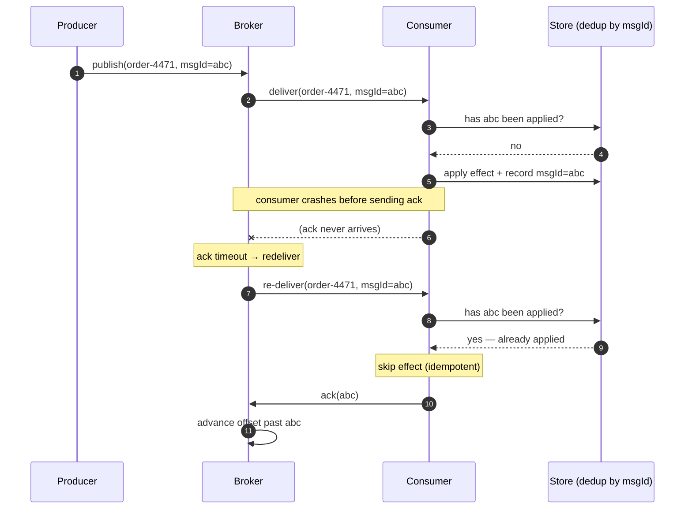

# Queues & Brokers

> **Prerequisites:** [Replication](/synapse/system-design-from-first-principles/distributed-data/replication), [Faults, Clocks & Time](/synapse/system-design-from-first-principles/distributed-data/faults-clocks-and-time) | **You'll be able to:** choose between a traditional message queue and a log-based broker for a given workload; reason honestly about at-most-once, at-least-once, and "exactly-once" delivery; and explain how partitioning trades throughput against ordering.

## The problem (why this exists)

Picture a checkout service. A customer clicks "Buy," and now six things need to happen: charge the card, decrement inventory, email a receipt, notify the warehouse, update the recommendation model, and refresh the analytics dashboard. If the web request does all six inline, the customer stares at a spinner for two seconds — and if the email provider is having a bad day, the *purchase itself* fails because a downstream, non-critical step timed out. You have coupled the customer's latency and the customer's success to the slowest, flakiest thing in the building.

Worse, load is spiky. A flash sale sends ten thousand orders in a minute. Your fraud-scoring service can process two thousand per minute. If every order calls fraud-scoring synchronously, the extra eight thousand requests don't wait politely in line — they pile up as open connections, exhaust thread pools, and take down the whole tier. The synchronous call couples the *rate* at which work arrives to the *rate* at which it can be done, and when those two numbers disagree, something breaks.

What you want is a shock absorber between "something happened" and "something processed it" — a place to put work so the producer can move on and the consumer can catch up at its own pace. That shock absorber is a **queue**, and the server that manages it is a **broker**.

## Intuition first

A queue is a buffer with a door on each end. Producers drop messages in one end; consumers pull them out the other. The moment the checkout service hands "order #4471 placed" to the broker, it's done — it returns "success" to the customer in milliseconds and never waits for the receipt email. The email service reads from the queue whenever it's ready. If it's slow, messages simply accumulate; nobody upstream notices.

This buys you four things at once, and it's worth naming them separately because interviewers probe each:

- **Decoupling.** The producer doesn't know or care who consumes, how many consumers there are, or whether they're even online right now. You can add a new consumer — say, a fraud auditor — without touching the checkout code.
- **Buffering bursts.** The flash-sale spike lands in the queue, not on the consumer's thread pool. The consumer drains it at a steady two thousand a minute; the queue depth rises and then falls. The spike is *smoothed* into a manageable, roughly constant load.
- **Load smoothing.** Because the consumer works at its own pace, you provision it for the *average* rate, not the *peak*. That's the difference between paying for ten machines and paying for one hundred.
- **Retries and durability.** If a consumer crashes mid-message, a good broker hands that message to someone else rather than dropping it. The broker is a database optimized for streams of messages [p. 491] — it centralizes durability so clients can connect, disconnect, and crash without losing work.

A message here is an **event**: a small, self-contained, immutable object recording that something happened at a point in time, usually carrying a timestamp [p. 488]. Producers publish events to a named **topic** (a grouping of related events, like `orders` or `clicks` [pp. 488–489]); consumers subscribe to topics.

The beginner's one-sentence takeaway: *a queue lets the sender move on and the receiver catch up.* Everything below is about the two very different ways brokers implement that sentence — and why the difference decides half your design.

## How it works

When a producer outpaces its consumers, a messaging system has exactly three options, and every design is a choice among them: **drop messages, buffer them in a queue, or apply backpressure** — flow control that blocks the producer from sending more until there's room [p. 489]. Unix pipes and TCP use backpressure with a small fixed buffer. Most brokers instead choose unbounded buffering: they let the queue grow (disk permitting) and let consumers run asynchronously, so the producer waits only for the broker to accept the message, not for anyone to process it [p. 491]. Dropping is a legitimate choice too — a metrics agent sending UDP packets happily loses the occasional reading because an approximate counter is fine [pp. 490–491] — but for anything you must not lose, dropping is off the table.

Given that a broker buffers, two design questions remain: how do *multiple* consumers share a topic, and what happens when a consumer *crashes*? The answers split brokers into two families.

### Family 1 — traditional message queues (AMQP/JMS style)

This is the classic model behind RabbitMQ, ActiveMQ, IBM MQ, Amazon SQS, and Google Cloud Pub/Sub [pp. 491–492]. The broker tracks the state of **each individual message**. When several consumers subscribe to one topic, you can arrange them two ways [pp. 492–493]:

- **Load balancing** — each message goes to *one* of the consumers, so you parallelize expensive per-message work across a pool. This is the "competing consumers" pattern: add more consumers, get more throughput.
- **Fan-out** — each message goes to *every* consumer independently, so several subsystems each get their own copy of the stream.

To survive consumer crashes, the broker uses **acknowledgments**. It delivers a message, waits for the consumer to signal "done processing," and only then deletes it. If the ack never arrives (the consumer died mid-message), the broker redelivers that message to another consumer [p. 493]. The message is deleted on ack — **the read is destructive**. Once processed and acked, it's gone; you cannot rewind and read it again.

That destructive read has a subtle consequence: load balancing plus redelivery inevitably **reorders** messages. If consumer 2 takes message m3, crashes, and m3 is redelivered later, it arrives *after* m4, which some other consumer already handled [p. 494]. For work items with no causal dependency between them, that's fine. When order matters, you need a separate queue per consumer — which sacrifices the load balancing.

This family shines for **task queues / asynchronous RPC**: expensive, independent units of work where per-message parallelism matters and strict order does not [p. 529] — resize this image, transcode that video, score this transaction for fraud.

### Family 2 — log-based brokers (Kafka style)

Kafka, Amazon Kinesis, and (architecturally) Google Cloud Pub/Sub take the opposite stance [p. 497]. Instead of tracking each message and deleting it on ack, the broker keeps an **append-only log**: a sequence of records on disk. A producer appends to the end; a consumer reads sequentially and, on reaching the end, waits for new appends — exactly like `tail -f` on a file [p. 496]. Reading does *not* delete anything.

A single disk would cap throughput, so the log is sharded. Kafka calls a shard a **partition**; a topic is a group of partitions carrying the same kind of message [p. 496]. Within a partition the broker stamps each message with a monotonically increasing **offset**. Two guarantees follow, and they are the crux of the whole model:

1. **Messages within a partition are totally ordered.**
2. **There is no ordering guarantee across partitions** [pp. 496–497].

Consumers are organized into **consumer groups**, which fuse load balancing and fan-out. Within one group, the partitions are divided among the group's consumers — each partition assigned to exactly one consumer — so the group as a whole load-balances. Two *separate* groups each receive every message, giving fan-out across groups [p. 493]. Crucially, the unit of parallelism is the *whole partition*, not the individual message: the number of consumers usefully sharing a topic is capped at the number of partitions [p. 497].

Because a consumer reads a partition strictly in order, the broker doesn't ack every message. It periodically records a single **consumer offset** — the position the consumer has processed up to. Everything below the offset is done; everything above is unseen [p. 498]. This is precisely single-leader replication in disguise: the broker is the leader, the consumer is a follower, and the offset is its log sequence number [p. 498].

Here's the log-based broker in one picture — three producers keyed into three partitions, and two consumer groups reading the same log at independent offsets:

```d2
direction: right
classes: {
  svc:    {style: {fill: "#dcfce7"; stroke: "#16a34a"}}
  data:   {style: {fill: "#ffedd5"; stroke: "#ea580c"}}
  async:  {style: {fill: "#f3e8ff"; stroke: "#9333ea"}}
}

producers: Producers {
  p1: "order-svc (key=A)" {class: svc}
  p2: "order-svc (key=B)" {class: svc}
  p3: "order-svc (key=C)" {class: svc}
}

topic: "Topic: orders (append-only log)" {
  part0: "Partition 0  [0][1][2][3][4]→" {class: data}
  part1: "Partition 1  [0][1][2]→" {class: data}
  part2: "Partition 2  [0][1][2][3]→" {class: data}
}

groupA: "Consumer group: fulfillment" {
  ca0: "consumer 0  offset=3" {class: async}
  ca1: "consumer 1  offset=2" {class: async}
}

groupB: "Consumer group: analytics" {
  cb0: "consumer 0  offset=0 (replaying)" {class: async}
}

producers.p1 -> topic.part0: hash(key)
producers.p2 -> topic.part1: hash(key)
producers.p3 -> topic.part2: hash(key)

topic.part0 -> groupA.ca0: assigned
topic.part1 -> groupA.ca1: assigned
topic.part2 -> groupA.ca0: assigned

topic.part0 -> groupB.cb0: full topic
topic.part1 -> groupB.cb0
topic.part2 -> groupB.cb0
```

Two independent groups reading the same partitions at different offsets is the whole point: `fulfillment` is near the head processing live orders, while `analytics` rewound to offset 0 to recompute yesterday's numbers — and neither disturbs the other.

### Disk, retention, and replay

The log is split into **segments**; old segments are deleted or archived on a retention policy — Kafka's default is roughly seven days. So the log is a bounded, on-disk **circular buffer**: it holds a large fixed window of history and discards the oldest when full [p. 498]. As a back-of-envelope, a single 20 TB drive writing sequentially at ~250 MB/s takes about 22 hours to fill — so even one disk buffers the better part of a day's messages, and real deployments keep days to weeks [p. 499]. Many brokers now use **tiered storage**, serving old messages from cheap object storage so retention isn't bounded by local disk [p. 499].

This retention is what makes **replay** possible, and it is the single biggest practical difference from a traditional queue. Because the offset is under the consumer's control and reads are non-destructive, you can point a consumer at yesterday's offset and reprocess everything — any number of times, with new code [pp. 499–500]. You can spin up a fresh consumer to debug production traffic without disturbing anyone else; a crashed consumer leaves behind nothing but its last offset [p. 499]. The log turns messaging into something that behaves like repeatable batch processing.

## Trade-offs

The two families are not competitors so much as tools for different jobs. This is the table to have memorized:

| | Traditional message queue (AMQP/JMS) | Log-based broker (Kafka) |
| --- | --- | --- |
| **Message after delivery** | Deleted on ack (destructive read) | Retained until retention expires (non-destructive) |
| **Unit of parallelism** | Individual message → any consumer | Whole partition → one consumer per group |
| **Max useful consumers per topic** | Many (per-message competing consumers) | ≤ number of partitions |
| **Ordering** | Reordered by load-balance + redelivery | Total order *within* a partition; none across |
| **Replay** | Not possible — gone after ack | Trivial — rewind the offset |
| **Slow message** | Redelivered elsewhere; others proceed | Head-of-line blocks the rest of its partition |
| **Best for** | Expensive, independent tasks; async RPC; per-message parallelism | High throughput; ordered, fast-per-message; multiple independent consumers; replay/analytics |

The rule of thumb from the source is worth quoting almost verbatim: JMS/AMQP-style brokers suit workloads where each message is expensive to process and you want message-by-message parallelism, and where ordering isn't critical; log-based brokers suit high throughput with fast per-message processing where ordering matters and you want durable, replayable, multi-subscriber delivery [p. 497].

## Numbers that matter

A few figures anchor capacity conversations (see [Estimation & the Numbers](/synapse/system-design-from-first-principles/foundations/estimation-and-numbers) for how to wield them):

- **Log buffer horizon.** One 20 TB drive at ~250 MB/s sequential write fills in ~22 hours [p. 499]. That's your worst-case "how long can a consumer be down before it loses data" window on a single disk — and it's why "keep 7 days" is comfortable, not heroic.
- **Kafka throughput, order of magnitude.** A single broker handles roughly up to a million messages/second and ~1 TB of storage, with messages kept under ~1 MB (put big blobs in object storage and pass a pointer). These are hand-wavy interview figures, not SLAs — flag them as such.
- **Replication factor 3** is the common durability default: each partition has three copies so two nodes can fail without data loss. This ties directly back to [Replication](/synapse/system-design-from-first-principles/distributed-data/replication) — a partition is a single-leader replicated log.
- **Partition count** is the real scaling knob and it's sticky: it caps consumer parallelism (≤ partitions per group [p. 497]) and it's awkward to change later because it changes which partition a key hashes to. Size it for peak *and* future growth.

## In production

Real event pipelines are dominated by two systems. **Kafka** is the default log-based broker: LinkedIn built it, and it now backs order pipelines, activity streams, metrics firehoses, and the change-data-capture backbone of countless companies. The reason it wins at scale is mechanical — sequential disk appends plus batching and compression (Snappy/LZ4/GZIP) push throughput into the millions of messages per second despite writing everything to disk. Kafka deliberately ships *without* a built-in dead-letter queue or automatic per-message retry; teams build those in the consumer, which is a real operational cost you should name in an interview. **Amazon SQS** sits at the other end: a managed traditional queue with built-in visibility timeouts, redelivery, and native dead-letter queues — which is exactly why the [web crawler](/synapse/system-design-from-first-principles/case-studies/web-crawler) design reaches for SQS over Kafka, trading replay for out-of-the-box retry and poison-message handling.

The choice recurs across the case studies. The [ad-click aggregator](/synapse/system-design-from-first-principles/case-studies/ad-click-aggregator) puts a log-based broker at its core: clicks land in Kafka partitioned by ad ID, so all events for one ad stay ordered in one partition, and a stream processor reads them to maintain rolling counts — with replay available to recompute a window after a bug or a late correction. That partition-key choice is the whole design: pick the wrong key and you lose either ordering or the ability to parallelize. When one ad goes viral, its partition becomes a **hot partition** — a single overloaded shard while the rest sit idle — and the standard remedies are salting the key, using a compound key, or applying backpressure.

The operational reality that separates the families in practice is **backpressure and lag**. In a log-based broker, a slow consumer doesn't threaten anyone else — it just falls behind, its offset trailing the head, and the only risk is falling so far behind that its offset points into a segment that's already been deleted, at which point it silently *misses* messages [p. 498]. That's why **consumer lag** (head offset minus committed offset, per partition) is the single most important metric to alarm on for any Kafka pipeline: rising lag is your early warning that a consumer can't keep up, long before it starts losing data.

## Pitfalls & interview traps

**The "exactly-once" myth.** This is the trap interviewers set most often. There are three honest delivery guarantees:

- **At-most-once** — fire and forget. The producer sends and never retries; a lost message is simply lost. Zero duplicates, possible data loss. Fine for a metrics tick, fatal for a payment.
- **At-least-once** — retry until acknowledged. No message is ever lost, but a message can be delivered *more than once* (the classic case: the consumer processes a message, then crashes before recording its offset, so on restart it processes that message again [p. 498]). This is the default you should assume.
- **"Exactly-once"** — sounds ideal, and is *almost always* marketing for **at-least-once delivery plus an idempotent consumer**. The message may arrive several times; you make reprocessing harmless.

<div style="border-left:4px solid #da5233;background:rgba(218,82,51,0.08);padding:0.6rem 1rem;border-radius:0 0.5rem 0.5rem 0;margin:1.25rem 0">

⚠️ **True end-to-end "exactly-once delivery" is a myth.** DDIA is blunt that "effectively-once" is the more honest term [p. 527]: records *are* processed multiple times, but the visible effect is as if they weren't. Frameworks like Flink give exactly-once *for state inside the framework*, but the instant an effect leaves the boundary — a database write, an email, a call to another service — a retried task performs that side effect **twice** [p. 527]. You close the gap two ways: **atomic commit** (outputs and the offset commit together, all-or-nothing — the two-phase-commit idea kept efficient by staying inside one framework [pp. 527–528]) or, far more common in practice, **idempotence** — make the operation safe to repeat. Deleting a key is naturally idempotent; incrementing a counter is not, but you can tag each write with the message's offset and skip any offset you've already applied [p. 528]. If an interviewer says "exactly-once," your move is to ask: *delivery, or effect?* — and design for idempotent effects.

</div>

Here's at-least-once with a missed ack, redelivery, and an idempotent consumer that dedupes the second copy:



**Ordering is only within a partition.** The second-most-common trap. Candidates say "Kafka gives ordered delivery" and stop. It gives total order *within a partition* and *none* across partitions [pp. 496–497]. If order matters for a given entity — all events for one user, one account, one ad — you must route them to the *same* partition by using a natural key (user ID, account ID) as the **partition key** [p. 498]. Get this wrong and two events for the same account can be processed out of order because they landed in different partitions.

**Poison messages and dead-letter queues.** A message that reliably crashes its consumer — a malformed record, a missing JSON field — will be redelivered, crash the consumer again, and loop forever, burning resources or, under strict ordering, blocking *all* progress behind it [pp. 494–495]. The fix is a **dead-letter queue (DLQ)**: after N failed attempts, move the poison message aside into a separate queue that's monitored, so an operator can inspect, fix, or drop it while the main flow proceeds [p. 495]. Traditional brokers like SQS have DLQs built in; with Kafka you build the retry-count-and-redirect logic yourself.

**Head-of-line blocking.** In a log-based broker, one slow message stalls every message behind it in the same partition [p. 497], because a partition is consumed strictly in order. If a few slow items can't be allowed to hold up everything else, that's an argument for a traditional queue (which redelivers the slow one elsewhere and moves on) or for more partitions.

## Check yourself

```quiz
{"prompt": "You're designing a pipeline that must (a) let an analytics job reprocess the last 3 days of events after a logic fix, and (b) guarantee all events for a given account are processed in order. Which broker model fits, and how?", "options": ["Traditional message queue; rely on ack ordering", "Log-based broker; partition by account ID", "Traditional message queue with a dead-letter queue", "Log-based broker with a single partition for the whole topic"], "answer": "Log-based broker; partition by account ID"}
```

```quiz
{"prompt": "A consumer processes a message, performs a database write, then crashes before its offset is recorded. On restart it processes the same message again. Which delivery semantic is this, and what makes the duplicate harmless?", "options": ["At-most-once; nothing needed", "At-least-once; an idempotent consumer (e.g. dedupe by message ID)", "Exactly-once, guaranteed by the broker", "At-least-once; increasing the ack timeout"], "answer": "At-least-once; an idempotent consumer (e.g. dedupe by message ID)"}
```

```quiz
{"prompt": "In a Kafka topic with 6 partitions, what is the maximum number of consumers in a single consumer group that can actively share the load?", "options": ["Unlimited", "6", "3", "1"], "answer": "6"}
```

```quiz
{"prompt": "Which statement about ordering in a log-based broker is correct?", "options": ["All messages in a topic are globally ordered", "Messages are ordered within a partition, but not across partitions", "Ordering is guaranteed only after log compaction", "Consumer groups guarantee cross-partition ordering"], "answer": "Messages are ordered within a partition, but not across partitions"}
```

<details>
<summary>Why does a log-based broker let you run a throwaway debugging consumer against production traffic without risk, when a traditional queue does not?</summary>

Because reads in a log-based broker are **non-destructive** and each consumer group tracks its **own** offset. A new debug consumer joins as its own group, reads from whatever offset it likes (even offset 0), and advances only its own position — it never removes messages or affects other consumers' progress; a crash leaves behind only its offset [p. 499]. In a traditional queue, reading and acking a message *deletes* it, so a second consumer competing on the same queue would steal messages from the real consumer, and you cannot re-read what's already gone [p. 495].
</details>

<details>
<summary>Your consumer's lag on one partition is climbing steadily while the others stay flat. What's likely happening, and what are your levers?</summary>

One partition is receiving disproportionate traffic — a **hot partition**, usually because the partition key is skewed (one viral ad, one whale account). The consumer assigned to it can't keep up, so its committed offset falls further behind the head. Levers: change the partition key to spread the hot entity (salting, or a compound key), add partitions and rebalance (costly and changes key→partition mapping going forward), scale up the single overloaded consumer, or apply backpressure upstream. What you *cannot* do is add more consumers to the same group to help with that one partition — a partition is consumed by exactly one consumer per group [p. 497].
</details>

## Sources

DDIA2 ch. 12 pp. 488–500 (messaging systems, acknowledgments & redelivery, log-based brokers, consumer offsets, replay), pp. 527–528 (delivery semantics, atomic commit, idempotence) · Related: [Stream Processing](/synapse/system-design-from-first-principles/building-blocks/stream-processing), [Ad-Click Aggregator](/synapse/system-design-from-first-principles/case-studies/ad-click-aggregator), [Web Crawler](/synapse/system-design-from-first-principles/case-studies/web-crawler)
