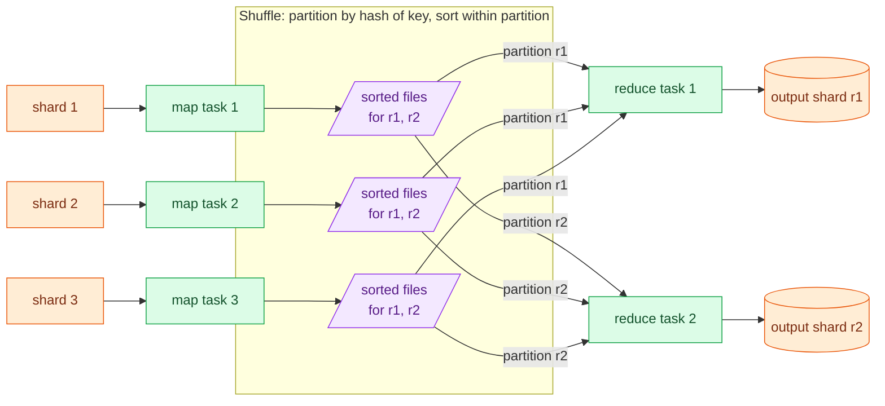
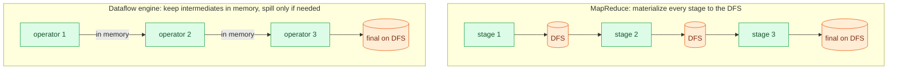

# Batch Processing

> **Prerequisites:** [Sharding & Consistent Hashing](/synapse/system-design-from-first-principles/distributed-data/sharding-and-consistent-hashing), [Data Models](/synapse/system-design-from-first-principles/data-foundations/data-models) | **You'll be able to:** reason about why the shuffle is the expensive part of a distributed job; explain how dataflow engines (Spark-style DAGs) beat classic MapReduce; and design batch pipelines whose output is immutable and safe to re-run.

## The problem (why this exists)

You have a terabyte of web-server access logs and a simple question: which five URLs got the most hits yesterday? There is no request to answer, no user waiting on a spinner — just a big pile of data and an answer you want by morning. This is a fundamentally different shape of work from everything in the online world you have designed so far. An online service is judged by **response time**: a request comes in, you answer it as fast as you can, and availability is life-or-death because a human is waiting [p. 451]. A batch job is judged by **throughput**: how much data it grinds through per unit time, running for minutes to days, usually on a schedule [p. 452]. Nobody is waiting on any single record.

That difference is not cosmetic — it changes what you are allowed to do. A batch job reads **read-only, bounded input** and produces its output **generated from scratch every run** [p. 451]. It never mutates its input in place the way a read/write transaction does. And that one property is worth an enormous amount, because it means a batch job is *re-runnable*. Ship a bug, notice the output is wrong, fix the code, and just run it again over the same untouched input — you get correct output and the bad output is simply overwritten. DDIA calls this **human fault tolerance**: the ability to recover from buggy code by rolling back and rerunning [p. 451–452]. A database with in-place read/write transactions gives you nothing of the sort — once the bad code has written bad rows, rolling back the code does not fix the data.

So batch processing is the foundation of all **derived data**: analytics, search indexes, machine-learning features, recommendation sets. The pile-in, output-file-out shape is what makes those things cheap to build, cheap to iterate on, and safe to get wrong. This lesson is about how you do it on data far too big for one machine.

## Intuition first

Before any distributed machinery, the whole idea lives in a single line of Unix. Here is the top-5-URLs job, in full [p. 454–455]:

```
awk '{print $7}' access.log | sort | uniq -c | sort -r -n | head -n 5
```

Read it left to right. `awk '{print $7}'` pulls the requested-URL field out of every log line. `sort` puts identical URLs next to each other. `uniq -c` walks the now-adjacent lines and collapses each run into a count. The second `sort -r -n` ranks those counts descending, and `head` takes the top five. This pipeline chews through gigabytes in seconds and you can modify it in place with a text editor [p. 455].

The interesting part is *why the `sort` is in there*. You have two ways to count distinct things. One: keep a hash table in memory, URL → running count, and bump the counter as you scan — this is what an equivalent Python script with a `defaultdict` would do [p. 455–456]. Two: **sort the records so identical keys become adjacent**, then count adjacent runs, which is what the Unix pipeline does [p. 456]. Which is better depends entirely on the **working set** — the amount of data you need random access to, which is proportional to the number of *distinct* keys, not the number of records [p. 456].

If the distinct URLs fit in memory (roughly a gigabyte covers many small and mid-size sites), the in-memory hash table wins and runs on a laptop [p. 456]. But the moment the working set exceeds memory, **sorting wins**, and this is the pivotal insight of the whole chapter. Sorting degrades gracefully to disk: `sort` collects a chunk in memory, spills it to disk as a sorted segment, and later mergesorts the segments — all *sequential* access, which disks and SSDs are good at [p. 456]. GNU Coreutils `sort` does this spill-and-merge automatically and parallelizes across CPU cores; the bottleneck just becomes how fast the disk reads [p. 456]. A hash table that overflows RAM, by contrast, falls off a cliff into random I/O.

The one thing Unix tools cannot do is run on more than one machine [p. 456]. When the data is too big for a single box's memory *and* disk, you need to spread both the storage and the sort across a cluster — and that is exactly what distributed batch frameworks are.

## How it works

A distributed batch framework is best understood as a **distributed operating system** [p. 453, 457]. A single machine gives you a filesystem (storage), a scheduler (the kernel handing out CPU), and processes connected by pipes. A cluster needs the same three layers: a **storage layer**, an **orchestration layer** that decides where and when jobs run, and a **computation layer** that does the processing [p. 481].

**Storage.** The input and output live in a distributed filesystem (HDFS, and historically GlusterFS/CephFS) or, increasingly, an object store like S3 [p. 453]. Both break large files into big blocks spread and replicated across many machines — HDFS defaults to 128 MB blocks, many object stores use 4 MB, versus ext4's 4 KB [p. 458]. Big blocks mean less metadata to track over petabytes and less seek overhead relative to the read [p. 458]. Replication (full copies, or cheaper erasure coding like Reed–Solomon) tolerates disk and machine failure on commodity hardware, and lets the scheduler run a task on *any* node holding a replica of its input [p. 459–460]. Object stores are the pragmatic default now — see [Object Storage & Blobs](/synapse/system-design-from-first-principles/building-blocks/object-storage-and-blobs) — trading co-located compute for independently scalable storage and compute [p. 461].

**Orchestration.** A job orchestrator (Kubernetes, Hadoop YARN) plays the kernel's role: it takes a job request — how many tasks, how much CPU/memory/disk each, where the code lives — and decides which tasks run on which nodes [p. 461–462]. Scheduling many jobs optimally is NP-hard, so orchestrators lean on heuristics: FIFO, dominant resource fairness, priority queues, bin-packing [p. 463–464]. Because batch is not time-sensitive, it is a natural fit for cheap, preemptible **spot instances** that can be killed when higher-priority work shows up — and preemptions happen *more often* than hardware faults, which is why fault handling has to be routine, not exceptional [p. 465].

That fault handling is where batch's re-runnability pays off again. When a task fails — crash, preemption, whatever — the framework just deletes that task's partial output and reschedules it elsewhere; rerunning the whole job for one failed task would be wasteful, so MapReduce and its successors keep parallel tasks independent so they can retry at *task* granularity [p. 466].

### MapReduce: map, shuffle, reduce

The **computation layer** is where the models diverge. The original is **MapReduce** (Google, 2004), and its four steps are exactly the Unix pipeline generalized to a cluster [p. 453, 466–467]:

1. **Read and split.** The framework reads input files from the DFS/object store and breaks them into records (Parquet, Avro, etc.).
2. **Map.** Your **mapper** is called once per record and emits zero or more key-value pairs. It keeps no state between records — the `awk '{print $7}'` analogue. Many mappers run in parallel over different input shards [p. 467].
3. **Sort/shuffle.** The framework sorts all pairs by key. This step is implicit — you never write it — but it is where the money goes.
4. **Reduce.** Your **reducer** is called once per distinct key, with an *iterator* over all values collected for that key, and combines them — the `uniq -c` analogue. Reducers for different keys run in parallel [p. 467].

Only steps 2 and 4 are your code; step 1 is the input-format parser and step 3 is the framework's implicit sort [p. 467]. The model comes straight from functional programming — Lisp's `map` and `reduce`/`fold` — and the reason it insists on stateless functions is that avoiding mutable state is what makes it safe to run mappers and reducers in parallel and to *re-invoke* them after a failure [p. 467].

Here is what step 3 actually costs. The **shuffle** is the machinery that gets every value for a given key to the same reducer, and it is a full **distributed sort** across the cluster:



Trace the flow [p. 470–471]. One map task runs per input shard; the number of reduce tasks is chosen by the job author. To route same-key pairs to the same reducer, each mapper writes **one local file per reducer**, and a hash of the key decides which file each pair goes into — this is sharding by hash of key, exactly as in [Sharding & Consistent Hashing](/synapse/system-design-from-first-principles/distributed-data/sharding-and-consistent-hashing). Within each of those files, the mapper sorts the pairs using log-structured-storage techniques (collect in a sorted in-memory structure, write sorted segments, merge). Once the mappers finish, each reducer **pulls its files from every mapper and mergesorts them** — so the same keys, now consecutive across all mappers, arrive together — and calls the reducer function once per key. Reducer output is written sequentially, one file per reduce task, back to the DFS as the job's output shards.

Notice the name is a lie in a useful way. As DDIA puts it: "the shuffle we're talking about produces a sorted order" [p. 470] — there is nothing random about it, despite the card-shuffling connotation. And notice *why* it is expensive: it moves **every** intermediate record across the network from mappers to reducers, and sorts all of it. Map and reduce are embarrassingly parallel and cheap; the all-to-all data movement and distributed sort in the middle is the part that saturates the network and the disks.

### Joins in batch: the sort-merge join

The shuffle is not just for counting — it is also how you **join**. The canonical example: a log of user-activity events (a fact table) that you want to enrich with each user's profile (a dimension) [p. 471]. You cannot look up each user's profile with a network request per event — that would be orders of magnitude slower than batch throughput. Instead you shuffle both sides by the same key. One mapper emits `user_id → page-view URL` from the activity log; another emits `user_id → date-of-birth` from the user database. The shuffle brings a user's profile record and all of their activity events to the **same reducer** [p. 472].

A **secondary sort** arranges the records so that, within each user, the profile record arrives *first*, then the activity events. The reducer stashes that first value (the DOB) in a local variable and then streams through the same user's events, emitting each one enriched with the DOB — **one user's record in memory at a time, and no network requests at all** [p. 472]. That is a **sort-merge join**: both sides sorted by the join key, mergesorted together at the reducer.

<div style="border-left:4px solid #15448e;background:rgba(21,68,142,0.08);padding:0.6rem 1rem;border-radius:0 0.5rem 0.5rem 0;margin:1.25rem 0">

**Scope note.** This DDIA edition develops the **sort-merge (shuffle-based)** join thoroughly and notes only that cost-based optimizers auto-select join algorithms [p. 473–474]. It does *not* develop broadcast or hash joins as named techniques — so don't attribute those to this chapter. They exist and matter; they're just outside what we can ground here.

</div>

### Why dataflow engines replaced MapReduce

Raw MapReduce has two chronic problems. The APIs are laborious — you write join algorithms by hand — and it is **slow**, because its file-based I/O prevents pipelining: a downstream job cannot start until the upstream one has fully finished and written its results to the DFS [p. 467–468]. MapReduce achieves fault tolerance precisely by **always writing intermediate data back to the DFS** and waiting for the producer to finish before consumers read [p. 466]. Robust under frequent preemption — but a mountain of DFS writes.

**Dataflow engines** (Spark, Flink) were built to fix this. They model an *entire workflow* as one job with an explicit graph of operators, rather than a chain of independent map/reduce subjobs [p. 468]. That single change unlocks a pile of optimizations [p. 468–469]:



- **Sort only where needed**, not between every single stage.
- **Keep intermediate state in memory** (spilling to local disk if it overflows), writing only the *final* result to the DFS.
- **Fuse** consecutive shard-preserving operators (a `map` followed by a `filter`) into one task, eliminating a copy.
- **Start operators as soon as their inputs are ready** instead of blocking on full-job completion.
- **Reuse processes** rather than launching a fresh JVM per task.

The fault-tolerance story changes to match. Spark tracks the **lineage** of intermediate data — the sequence of operations that produced it — so if a partition is lost it recomputes just that partition from its inputs; Flink instead periodically **checkpoints** task snapshots [p. 466]. Same computations as a MapReduce workflow, usually significantly faster [p. 469]. This is why DDIA is blunt that MapReduce "is largely obsolete and no longer used at Google" [p. 453] — the model taught the industry how to think, and then better engines ate its lunch.

Above the engine, the programming model converged on **SQL and DataFrame APIs** [p. 473, 475]. Once the physical machinery was solved, a SQL query is less code than a handwritten job, lets analysts work interactively, and — crucially — lets a cost-based optimizer pick join algorithms and reorder joins to minimize intermediate state [p. 473–474]. Batch frameworks and cloud warehouses (BigQuery, Snowflake) have converged so far that the line between them is now mostly about cost and convenience [p. 474].

## Trade-offs

| Decision | Option A | Option B | Choose by |
| --- | --- | --- | --- |
| Aggregate distinct keys | In-memory hash table | Sort, then count adjacent runs | Does the working set (distinct keys) fit in RAM? Yes → hash; no → sort spills to disk gracefully [p. 456] |
| Compute engine | MapReduce | Dataflow engine (Spark/Flink) | Almost always dataflow now; MapReduce only for legacy or its extreme-preemption robustness [p. 466–469] |
| Storage layer | Distributed filesystem (HDFS) | Object store (S3) | Object store for independent scaling of storage/compute; DFS when co-locating compute with data saves real bandwidth [p. 461] |
| Fault model for intermediates | Materialize to DFS (MapReduce) | Recompute from lineage (Spark) / checkpoint (Flink) | Materializing survives frequent preemption; in-memory is faster but recomputes on loss [p. 466] |
| Serving derived output | Direct per-record DB writes | Stream (Kafka) or bulk-load a fresh DB | Never per-record; stream for continuous, bulk-load for atomic version swaps [p. 479–481] |

## Numbers that matter

Ground your estimates — the [Estimation & Numbers](/synapse/system-design-from-first-principles/foundations/estimation-and-numbers) module is the reference — but a few batch-specific figures anchor intuition [p. 456, 458, 465, 473]:

- **Working-set rule of thumb:** roughly **1 GB** of distinct keys-plus-counters covers many small-to-mid sites — the threshold below which an in-memory hash table beats sorting. *Rule of thumb, not a hard limit.*
- **HDFS default block: 128 MB** (many object stores: 4 MB), versus a local ext4 block of 4 KB — big blocks slash metadata overhead across petabytes.
- **Workflow size: 50–100 jobs** per pipeline is common; mature clusters run over **10,000 machines** across many petabytes.
- **Preemptions outnumber hardware faults** on spot/preemptible capacity — so a long job with thousands of tasks *will* lose tasks mid-run, and the design must shrug that off.
- The dominant cost you can actually influence is the **shuffle**: it moves and sorts every intermediate record over the network. Halving the data that crosses the shuffle (filter early, project only needed columns, pre-aggregate) is usually the highest-leverage tuning you have.

## In production

Batch is the quiet workhorse under an astonishing amount of real infrastructure — DDIA notes the US banking network runs almost entirely on batch [p. 476]. Four use cases dominate.

**ETL / ELT.** Extract from production databases, transform, load into a warehouse. Much of the transform work — filtering, projecting fields, reshaping — is *embarrassingly parallel*, which is exactly batch's sweet spot [p. 476]. In practice this is run by **workflow schedulers** — Airflow, Dagster, Prefect — which manage the dependency DAG *between* jobs (as distinct from the orchestrator that schedules a single job's tasks) [p. 465, 476]. Airflow ships operators for MySQL, Postgres, Snowflake, Spark, and Flink out of the box. When a job fails, you inspect the failed input files, fix the logic, and rerun — troubleshooting is genuinely easy because nothing was mutated [p. 476–477].

**Building search indexes.** The offline index-construction stage of a search engine or [Web Crawler](/synapse/system-design-from-first-principles/case-studies/web-crawler) is a batch job: shuffle documents by term, build the inverted index as immutable output files, then load them into the serving tier.

**Analytics.** OLAP queries scan huge numbers of records doing groupings and aggregations — see [Analytics & Column Stores](/synapse/system-design-from-first-principles/data-foundations/analytics-and-column-stores). The modern shape is a **data lakehouse**: a SQL engine (Trino, Spark SQL) over an object store, with table formats like Apache Iceberg and a catalog managing metadata [p. 477]. Pre-aggregation jobs roll data into cubes on a schedule, sometimes pushed into real-time OLAP systems like Druid or Pinot — the [Ad-Click Aggregator](/synapse/system-design-from-first-principles/case-studies/ad-click-aggregator) and [YouTube](/synapse/system-design-from-first-principles/case-studies/youtube) analytics tiers both lean on this pattern.

**Machine learning.** Batch feature engineering, model training, and bulk (offline) inference [p. 478]. LLM data prep is a giant batch pipeline: pull raw web text from object storage, extract clean text from HTML, dedupe and drop low-quality documents, tokenize, embed [p. 479]. Frameworks like Ray, Kubeflow, and Flyte target these workloads — OpenAI uses Ray for ChatGPT training [p. 479].

The subtle production concern is **serving the derived data** — moving a batch job's precomputed output back into a live-serving database. The naive approach, writing to the production DB one record at a time from the job, is a classic trap [p. 479–480]. A network request per record is orders of magnitude slower than batch throughput; thousands of parallel tasks can overwhelm the DB and degrade live query performance; and those external writes are *visible side effects* that break batch's all-or-nothing guarantee — a retried task produces partial or duplicate rows. Better: have the batch job push its output to a stream like a Kafka topic that the serving store ingests, or **bulk-load a freshly built database** and atomically swap dataset versions [p. 480–481]. The stream path leans directly on [Queues & Brokers](/synapse/system-design-from-first-principles/building-blocks/queues-and-brokers) — sequential writes, buffering, multiple consumers, and a security boundary between the batch and production networks.

## Pitfalls & interview traps

<div style="border-left:4px solid #da5233;background:rgba(218,82,51,0.08);padding:0.6rem 1rem;border-radius:0 0.5rem 0.5rem 0;margin:1.25rem 0">

⚠️ **Skew is the silent job-killer, and it lives in the reduce phase.** The shuffle sends every value for a key to *one* reducer. If one key is wildly hotter than the rest — a celebrity user, a `null` join key, a viral URL — that reducer gets a mountain of data while its peers sit idle, and the whole job's finish time is held hostage by that one straggler. The map phase parallelizes beautifully; skew concentrates work at exactly the point that *can't*. Watch for it whenever you shuffle by a key with a heavy-tailed distribution, and mitigate by salting the hot key across sub-reducers or pre-aggregating before the join.

</div>

A second trap is **treating batch output as mutable**. The entire value proposition — re-runnability, human fault tolerance, cheap iteration — depends on output being immutable and produced from scratch. The instant you have a job that reads its own previous output and edits it in place, or writes side effects to an external system mid-run, you've forfeited the ability to just fix-and-rerun, and a retried task now double-counts. Immutable output that you overwrite wholesale is the discipline that makes everything else work [p. 451–452, 479–480].

Two more the interviewer will reach for. **"Why is the shuffle the expensive part?"** — because map and reduce are local and parallel, but the shuffle moves *every* intermediate record across the network and performs a distributed sort; it is the all-to-all step, so it dominates the network and disk cost. And **"batch or stream?"** — this lesson is the **bounded** world: a fixed pile of input, a job that ends, output produced from scratch. When the input is *unbounded* and never-ending, you are in streaming territory; hand off to [Stream Processing](/synapse/system-design-from-first-principles/building-blocks/stream-processing). The honest one-liner: batch = "process a finite dataset, produce an output file"; stream = "process an endless dataset, forever."

## Check yourself

```quiz
{"prompt": "In a MapReduce job, why is the shuffle typically the most expensive stage?", "options": ["Because the mapper code is slow to execute per record", "Because it moves every intermediate record across the network and performs a distributed sort", "Because reducers must open a new network connection per output record", "Because the input files must be re-read from the DFS multiple times"], "answer": "Because it moves every intermediate record across the network and performs a distributed sort"}
```

```quiz
{"prompt": "You are counting distinct URLs in a dataset whose number of distinct URLs is far larger than any single machine's RAM. Which approach handles this better and why?", "options": ["An in-memory hash table, because hashing is O(1) per record", "Sorting, because it spills sorted segments to disk and mergesorts them using sequential I/O", "An in-memory hash table, because sorting always requires the whole dataset in memory", "Neither — the job is impossible without more RAM"], "answer": "Sorting, because it spills sorted segments to disk and mergesorts them using sequential I/O"}
```

```quiz
{"prompt": "What is the key architectural change that lets dataflow engines (Spark/Flink) run faster than classic MapReduce?", "options": ["They skip sorting entirely, so joins are approximate", "They model the whole workflow as one job and keep intermediate state in memory instead of materializing every stage to the DFS", "They replace the distributed filesystem with a relational database", "They run mappers and reducers on GPUs"], "answer": "They model the whole workflow as one job and keep intermediate state in memory instead of materializing every stage to the DFS"}
```

```quiz
{"prompt": "A batch job that builds recommendation data needs to load its output into a production key-value store. Which approach is the anti-pattern?", "options": ["Bulk-load a freshly built database and atomically swap versions", "Push the output to a Kafka topic that the store ingests", "Write each output record directly to the production DB, one row per network request, from the parallel tasks", "Write the output to the object store and have the serving system pull it"], "answer": "Write each output record directly to the production DB, one row per network request, from the parallel tasks"}
```

<details>
<summary>Why does batch's immutable, from-scratch output give you "human fault tolerance" that a read/write database doesn't?</summary>

Because the input is never mutated, a batch job can always be re-run to regenerate its output. If you ship buggy code, you notice the wrong output, fix the code, and rerun over the same untouched input — correct output overwrites the bad output [p. 451–452]. A database with in-place read/write transactions gives you no such safety net: once the bad code has committed bad rows, rolling back the *code* does nothing to fix the *data*. Object stores and open table formats even support "time travel" to a previous output version [p. 451].

</details>

<details>
<summary>Walk through how a batch sort-merge join enriches activity events with user profiles without any per-record lookups.</summary>

Shuffle both inputs by the same key — `user_id`. One mapper emits `user_id → activity event`; another emits `user_id → profile record`. The shuffle routes every record for a given user to the *same* reducer, and a secondary sort makes the profile record arrive before that user's events. The reducer holds the profile in a local variable, then streams through the user's events emitting each one enriched — one user in memory at a time, zero network requests [p. 472]. All the "lookups" happened for free as a side effect of the distributed sort.

</details>

<details>
<summary>Where does data skew bite in a shuffle, and why can't the map phase's parallelism save you?</summary>

Skew bites in the **reduce** phase. The shuffle sends all values for a key to a single reducer, so a heavy-tailed key (a celebrity, a `null` join key, a viral URL) dumps a disproportionate load onto one reducer while its peers finish early and idle. The map phase parallelizes across input shards regardless of key distribution, so it's unaffected — but the job can't complete until the overloaded reducer does, making that one straggler the job's wall-clock time. Mitigate by salting the hot key across sub-reducers or pre-aggregating before the join.

</details>

## Sources

- DDIA2 ch. 11 pp. 451–453 (batch vs online; throughput; human fault tolerance; MapReduce obsolete)
- DDIA2 ch. 11 pp. 454–456 (Unix pipeline; sorting vs in-memory aggregation; working set)
- DDIA2 ch. 11 pp. 457–461 (distributed OS; DFS blocks/replication; object stores)
- DDIA2 ch. 11 pp. 461–466 (orchestration; scheduling; spot instances; task-level fault handling)
- DDIA2 ch. 11 pp. 466–469 (MapReduce steps; dataflow engines; lineage vs checkpoint)
- DDIA2 ch. 11 pp. 469–472 (shuffle as distributed sort; sort-merge join; secondary sort)
- DDIA2 ch. 11 pp. 473–475 (SQL/DataFrame convergence; cost-based optimizers; batch vs warehouse)
- DDIA2 ch. 11 pp. 476–481 (use cases: ETL, search indexes, analytics, ML; serving derived data)
