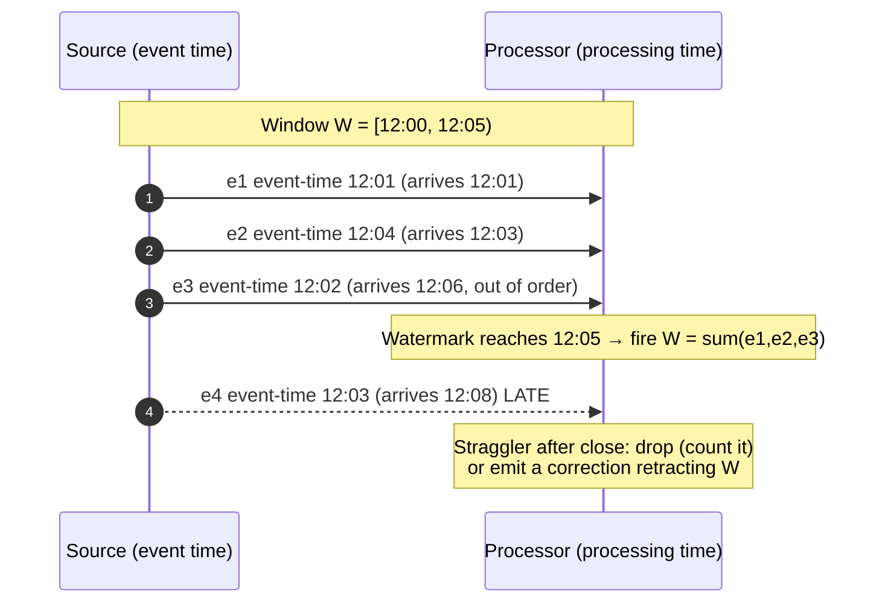
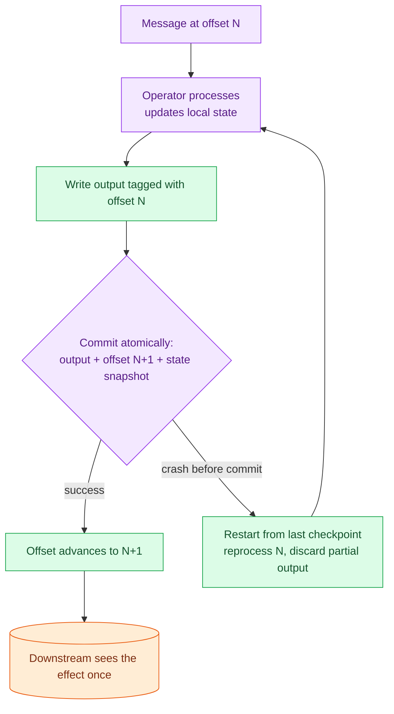

# Stream Processing

> **Prerequisites:** [Queues & Brokers](/synapse/system-design-from-first-principles/building-blocks/queues-and-brokers), [Distributed Transactions](/synapse/system-design-from-first-principles/distributed-data/distributed-transactions) | **You'll be able to:** explain why unbounded input forces you to reason about *time* rather than *arrival order*; place a late event correctly with event-time windows and watermarks; and argue why "exactly-once" really means effectively-once.

## The problem (why this exists)

A batch job has a comforting property: its input is *finished*. Yesterday's clickstream is a file of known size sitting in object storage. You can sort it, scan it start-to-end, join it, and when the last record is read you know the answer is complete. [Batch processing](/synapse/system-design-from-first-principles/building-blocks/queues-and-brokers) trades latency for that certainty — you wait until midnight, then compute over a bounded chunk.

But most interesting questions are not about yesterday. "How many people are watching this stream *right now*?" "Is this credit-card swipe fraudulent *before* we approve it?" "Has this sensor been climbing for the last thirty seconds?" These questions never have a "last record." Events keep arriving — a click, a swipe, a temperature reading — and they will keep arriving tomorrow and the day after. The input is **unbounded**. You cannot wait for it to finish, because it never does.

That single change — from a finite file to an infinite stream — breaks almost every batch technique. You cannot sort an infinite input. You cannot do a sort-merge join when one side never ends. You cannot "restart from the beginning" after a crash when the beginning was three years ago. And most subtly, you can no longer trust arrival order to tell you *when things happened*, because a slow network, a queued backlog, or an offline phone can deliver an event that occurred at noon long after events that occurred at 12:05 [DDIA2 p. 514].

Stream processing is the discipline of answering questions over data that never stops. The mental shift is small to state and enormous to master: **stop processing bounded batches; react to each event as it arrives, forever.**

## Intuition first

Start with the thing you already know: a [log-based broker](/synapse/system-design-from-first-principles/building-blocks/queues-and-brokers) like Kafka. A topic partition is an append-only log — producers append **events**, and a consumer reads sequentially, then waits at the end for the next append, exactly like `tail -f` on a file [DDIA2 p. 496]. An event is just a small, immutable record describing something that happened at a point in time, usually carrying a timestamp [DDIA2 p. 488].

A **stream processor** is nothing more than a consumer that does work on each event and appends its results somewhere else — another topic, a database, a dashboard. Conceptually it is the same shape as a Unix pipe or a MapReduce operator: read input, transform, write output [DDIA2 p. 513]. If that were the whole story, stream processing would be a footnote.

The reason it is a rich subject is that useful stream jobs are almost never *stateless*. "Count clicks per video per minute" has to remember a running count. "Join each click to the search that produced it" has to remember recent searches. "Alert if temperature rose for thirty seconds" has to remember the last thirty seconds. The moment you keep state, three hard problems appear at once:

1. **Time.** A "per-minute" count needs a definition of *which minute an event belongs to* — and the honest answer is "the minute it happened," which is not the same as "the minute we processed it."
2. **State that spans time.** A join or a window must buffer events until it can be sure it has seen everything relevant, on a machine with finite memory, while the stream keeps flowing.
3. **Fault tolerance without a finish line.** A batch job that crashes just re-runs. A stream job that crashes after three years cannot re-run — it must restore its accumulated state and continue as if nothing happened.

Everything technical in this lesson is a response to one of those three. Get the intuition that *state + unbounded input = you must reason about time explicitly*, and the rest follows.

## How it works

### What people actually build

Before the mechanics, the payoff — the four things streams are for [DDIA2 pp. 514–517]:

- **Real-time analytics.** Rolling counts, rates, and averages over huge event volumes: requests per second, click-through rate, revenue per minute. This is the [ad-click aggregator](/synapse/system-design-from-first-principles/case-studies/ad-click-aggregator) shape.
- **Materialized-view maintenance.** Keeping a cache, search index, or a per-user [news-feed](/synapse/system-design-from-first-principles/case-studies/news-feed) timeline continuously up to date as source data changes, instead of recomputing it on read.
- **Complex event processing (CEP).** Searching the stream for *patterns* — a sequence of events that together mean "fraud" or "machine about to fail." CEP inverts the database: the *queries* are stored long-term, and each arriving event is tested against the standing queries [DDIA2 p. 515].
- **Monitoring and alerting.** Fraud detection, trading signals, factory-floor sensors — anything that must react within seconds.

### The deep problem: reasoning about time

Here is the trap that catches everyone. A stream processor runs on a machine with a clock. The obvious thing to do is: when an event arrives, look at the wall clock, and put the event in "the current minute." This is **processing time** — the time on the processing machine when the event is handled [DDIA2 p. 518].

The correct thing, almost always, is **event time** — the timestamp embedded in the event, recording when it actually happened [DDIA2 p. 518]. Batch jobs use event time by default (they read the timestamp in each record), which is exactly why re-running a batch job gives the same answer.

Why does the difference matter? Because processing *lags* event time, for many reasons: network delays, message-queue backlogs, consumer restarts, and reprocessing after a bug fix [DDIA2 pp. 518–519]. And lag is not constant, so events arrive **out of order**: an event that happened at 12:02 can show up after one that happened at 12:04.

The classic failure: measure request rate by processing time, then redeploy the consumer. While it was down, a backlog built up; when it restarts it drains that backlog in a burst. Plotted by processing time, you see a huge **spike** in traffic — but the true request rate never changed. The spike is an artifact of measuring the wrong clock [DDIA2 p. 519].

<div style="border-left:4px solid #15448e;background:rgba(21,68,142,0.08);padding:0.6rem 1rem;border-radius:0 0.5rem 0.5rem 0;margin:1.25rem 0">

**Event time vs processing time.** Event time = when it happened (embedded timestamp). Processing time = when your machine touched it (wall clock). They diverge whenever processing lags, and lag is normal. Business logic — counts, rates, billing — must use event time, or a redeploy fabricates data.

</div>

### Windows: slicing an infinite stream

You cannot aggregate an infinite stream — "the total forever" never resolves. So you slice it into **windows** and aggregate within each [DDIA2 pp. 521–522]:

| Window type | Shape | Example | An event belongs to |
| --- | --- | --- | --- |
| **Tumbling** | Fixed length, no overlap | 1-minute buckets | Exactly one window |
| **Hopping** | Fixed length, overlapping by a smaller hop | 5-min length, 1-min hop | Several windows (smoothing) |
| **Sliding** | All events within an interval *of each other* | "within 5 min of each other" | No fixed boundaries |
| **Session** | Variable length, ended by an inactivity gap | 30-min idle ends a session | One session per active burst |

Tumbling and hopping have fixed clock boundaries (round the event's timestamp down). Sliding windows have no fixed edges — they hold every event within a given interval of each other, evicting expired ones. Session windows have no fixed duration at all; they group a user's events until a gap of inactivity (say 30 minutes) closes the session — the standard tool for website-analytics sessionization [DDIA2 p. 522].

### Watermarks: "this window is probably done"

Windows expose the real difficulty of event time. To emit the result for the window `[12:00, 12:05)`, you need to know you have seen *all* the events with event-time in that range. But with out-of-order arrival you can never be *certain* — a straggler could always be one more network hop away [DDIA2 p. 520].

The mechanism that resolves this is the **watermark** (the term is Flink/Beam vocabulary; DDIA describes the mechanism without the name `[web: Apache Flink docs]`). A watermark is an assertion injected into the stream that says: *"I do not expect any more events with event-time earlier than T."* When the watermark passes 12:05, the processor declares `[12:00, 12:05)` complete, fires the window, and emits its result [DDIA2 p. 520].

A watermark is a *bet*, not a proof. Set it aggressively (T close to now) and you get low latency but risk dropping stragglers. Set it conservatively (T lagging well behind now, "bounded out-of-orderness") and you tolerate late events but add delay to every result. This latency-vs-accuracy dial is the heart of practical stream tuning.



When a **straggler** does arrive after its window closed, you have two honest choices [DDIA2 p. 520]:

- **Ignore it**, tracking a dropped-event counter as a data-quality metric; or
- **Emit a correction** — an updated window value, possibly retracting the previously published result.

There is a further subtlety about *whose clock* to trust. If events buffer on an offline mobile device and upload days later, the true event time is the device clock — but device clocks lie. The standard fix is to log **three timestamps**: event time (device clock), send time (device clock), and receive time (server clock). The device/server offset is `receive − send`, and subtracting it corrects the event time [DDIA2 pp. 520–521].

### Stream joins need state and time

Joins are where state and time collide. There are three kinds [DDIA2 pp. 523–525]:

- **Stream–stream (window join).** Join two streams within a time window — e.g., join each search event to its click event by session ID within one hour, to compute click-through rate. The processor indexes recent events from each side by join key and, on every arrival, probes the other index. It cannot wait forever, so the window bounds the state. (Note: embedding search details inside the click event is *not* a join — it would silently miss searches that got no click, corrupting your CTR [DDIA2 p. 523].)
- **Stream–table (enrichment).** Augment each event with data from a table — e.g., add profile fields by user ID. A remote database lookup per event is too slow, so you keep a **local copy** of the table (an in-memory hash join) and keep it current via change data capture. The table's changelog is a window reaching all the way back to the beginning of time, newer values overwriting older [DDIA2 pp. 523–524].
- **Table–table (materialized-view maintenance).** Maintain a derived view of a join — e.g., a per-user timeline "inbox." On each new post, add it to every follower's timeline; on unfollow, remove. This is exactly the [news-feed](/synapse/system-design-from-first-principles/case-studies/news-feed) fan-out-on-write pattern, kept live [DDIA2 pp. 524–525].

All three keep state from one input and probe it from the other, so **event order matters**: follow-then-unfollow is not the same as unfollow-then-follow. Within one Kafka partition order is preserved, but there is no order guarantee across partitions or streams [DDIA2 pp. 525–526]. When cross-stream order is undetermined the join is **nondeterministic** — re-running on the same input need not give the same result. Data warehouses hit the same issue as a *slowly changing dimension*, fixed by giving each version of a record a unique ID [DDIA2 p. 526].

### Fault tolerance: effectively-once, not magic

Batch fault tolerance is trivial: if a task fails, discard its output and re-run it; inputs are immutable and output only becomes visible on success, so the result is "as if nothing went wrong" [DDIA2 p. 526]. You cannot do that on a stream because you can never wait for a task to finish — the input is infinite [DDIA2 p. 527].

Two mechanisms create checkpoints of progress instead:

- **Microbatching** (Spark Streaming): chop the stream into ~1-second blocks and treat each as a tiny batch job. Smaller blocks = more overhead; larger = more latency [DDIA2 p. 527].
- **Checkpointing** (Flink): periodically snapshot each operator's state to durable storage, triggered by **barriers** flowing through the stream. On crash, restart from the last checkpoint and discard everything since [DDIA2 p. 527].

Both give **exactly-once semantics** — records may be *processed* multiple times, but the visible effect is as if each were processed once. DDIA is blunt that "**effectively-once** would be a more descriptive term" [DDIA2 p. 527]. The word "exactly" describes the *outcome*, never the number of executions.

And here is the crucial limitation: checkpointing gives exactly-once **only inside the framework**. The moment an effect leaves — a write to an external database, a message to another broker, an email — a restarted task performs that side effect *twice* [DDIA2 p. 527]. Getting effectively-once end-to-end needs one of two additional tools, and both connect directly to the [distributed-transactions](/synapse/system-design-from-first-principles/distributed-data/distributed-transactions) lesson:

- **Atomic commit.** Commit all outputs *and* the input offset advance together — all or nothing. This is the two-phase-commit idea, but kept *internal* to the framework so it can be done efficiently by batching many inputs per transaction (Dataflow, Kafka, VoltDB) [DDIA2 pp. 527–528].
- **Idempotence.** Make the operation harmless to repeat. Deleting a key is idempotent; incrementing a counter is not — but you can *make* it idempotent by storing the input's offset alongside the write and skipping any update whose offset was already applied [DDIA2 p. 528]. Idempotence assumes the same messages replay in the same order, deterministic processing, and no concurrent writer — with [fencing](/synapse/system-design-from-first-principles/distributed-data/distributed-transactions) on failover to block a presumed-dead node [DDIA2 p. 528].



Finally, stateful operators must **rebuild their state** after a crash. Options: query a remote replicated store (slow per message); replicate local state periodically (Flink snapshots to durable storage; Kafka Streams mirrors state changes to a log-compacted topic, which is itself just CDC); or rebuild state from scratch by replaying the input stream [DDIA2 p. 528].

### Databases as streams: CDC and event sourcing

The deepest idea in this area, per DDIA, is that **every write to a database is an event**, and a replication log *is* a stream of those write events [DDIA2 p. 500]. That connection runs both ways and gives you two patterns:

- **Change data capture (CDC).** Observe all changes written to a database and extract them as a stream, so derived systems — a search index, a cache, a warehouse — can apply the same changes in the same order. CDC makes the source database the single **leader** and turns every derived store into a **follower** [DDIA2 pp. 503–504]. This is the disciplined alternative to **dual writes**, where the app writes to two systems independently and a race leaves them permanently, silently inconsistent [DDIA2 pp. 501–502]. Tools like Debezium expose these change streams from MySQL, Postgres, and others [DDIA2 p. 504].
- **Event sourcing.** Instead of storing current state and mutating it, store the full log of immutable events and *derive* state from them. State becomes the log **integrated over time**; the change stream is state **differentiated** — "two sides of the same coin" [DDIA2 p. 509]. This buys auditability (fix mistakes with compensating events, never erasure), the ability to derive *many* read-optimized views from one log, and time-travel debugging [DDIA2 pp. 509–511].

Both push the same philosophy [DDIA2 ch. 13]: designate a **system of record**, write to it first, and derive everything else — indexes, caches, feeds, even the client UI — through deterministic, idempotent stream processors over an ordered log. This is more robust than distributed transactions across heterogeneous stores, because an asynchronous log *contains* a fault: a slow or failed consumer just falls behind and catches up, while a distributed transaction aborts everyone [DDIA2 pp. 544, 549].

## Trade-offs

| Decision | Choose this | Gives you | Costs you | Use when |
| --- | --- | --- | --- | --- |
| Clock for windows | **Event time** | Deterministic, re-runnable, correct history | Must handle out-of-order + stragglers | Almost always (billing, analytics) |
| | **Processing time** | Dead simple, no watermarks | Fabricates artifacts under lag (false spikes) | Only when lag is negligible and approximate is fine |
| Watermark aggressiveness | **Aggressive (near now)** | Low latency | Drops more late events | Latency matters more than a few stragglers |
| | **Conservative (lagging)** | Catches late events | Adds delay to every result | Accuracy matters more than latency |
| Fault-tolerance model | **Microbatching** | Simple; reuses batch engine | ~1s latency floor; implicit processing-time window | Second-scale latency is fine |
| | **Checkpointing** | Low latency; true event-time windows | More complex state machinery | Sub-second, event-time-correct results |
| End-to-end once-ness | **Idempotent writes** | No coordination; cheap | Needs deterministic replay + fencing | You control the sink and can dedupe by key/offset |
| | **Atomic commit** | Works for non-idempotent effects | 2PC overhead (amortized by batching) | Effects can't be made idempotent |
| Keep systems in sync | **CDC / event log** | Fault contained; replayable; loose coupling | Async — no read-your-writes by default | Multiple derived stores from one source |
| | **Dual writes** | No extra infrastructure | Race conditions → silent permanent divergence | Essentially never |

## Numbers that matter

Concrete figures worth carrying into an interview, from DDIA's own back-of-envelope work:

- **Log buffer sizing.** A single 20 TB drive writing sequentially at ~250 MB/s takes ~22 hours to fill. So one disk buffers *at least* a day of messages; real Kafka deployments retain days to weeks, giving consumers enormous slack to fall behind and replay [DDIA2 p. 499]. See [sharding](/synapse/system-design-from-first-principles/distributed-data/sharding-and-consistent-hashing) for how partitions multiply this.
- **Microbatch size.** ~1 second is Spark Streaming's default compromise — small enough for near-real-time, large enough to amortize per-batch overhead [DDIA2 p. 527].
- **Window examples.** A 30-minute inactivity gap is a typical session-window boundary for web analytics; a 1-hour window is a reasonable span to join a click to its originating search [DDIA2 pp. 522–523].
- **Throughput.** Log-based brokers sustain *millions* of messages per second despite writing to disk, purely by sharding across partitions and replicating for fault tolerance [DDIA2 p. 497].

## In production

The reference stream engine for interviews is **Apache Flink**. Its architecture makes the concepts above concrete:

- **Job structure.** A Flink job is a dataflow graph of operators connected by streams, reading from **sources** (usually Kafka) and writing to **sinks**. Operators hold typed **state** (value, list, map, aggregating, reducing) — e.g., a `ValueState` holding a running click count per key.
- **Watermarks are first-class.** You configure a watermark strategy — most commonly *bounded out-of-orderness* (allow lateness up to a fixed bound) versus *no watermarks* (pure processing-time) — turning the latency-vs-accuracy dial explicitly.
- **Windows** are built in as tumbling, sliding, session, and global, framed as an accuracy-versus-latency trade-off, exactly as above.
- **Checkpointing** uses Chandy–Lamport-style barriers to snapshot operator state to a **state backend** (in-memory, filesystem, or RocksDB for terabyte-scale state that exceeds RAM). On failure, Flink runs a fixed recovery sequence: detect, pause, restore state from the last checkpoint, rewind the sources to the checkpointed offsets, and resume.
- **The exactly-once caveat is explicit.** Flink's exactly-once guarantee covers *internal* state; extending it to external sinks needs idempotent writes or a transactional sink — precisely the atomic-commit-or-idempotence choice above.

The canonical case study is the [ad-click aggregator](/synapse/system-design-from-first-principles/case-studies/ad-click-aggregator): count ad clicks per minute for billing, where late-arriving clicks and watermarks force an honest decision about lateness — and a nightly batch "true-up" job reconciles the approximate real-time numbers against the complete event log, the practical embodiment of the [lambda-vs-kappa](/synapse/system-design-from-first-principles/building-blocks/queues-and-brokers) architecture debate.

## Pitfalls & interview traps

<div style="border-left:4px solid #da5233;background:rgba(218,82,51,0.08);padding:0.6rem 1rem;border-radius:0 0.5rem 0.5rem 0;margin:1.25rem 0">

⚠️ **Two traps that fail every interview.** (1) *Using processing time for business logic.* If you bucket events by the wall clock, your very next deploy or backlog drain fabricates a traffic spike that never happened. Bill or alert on **event time**. (2) *Believing "exactly-once" means a side effect happens once.* Checkpointing guarantees once-ness only *inside* the framework; an external DB write or email from a restarted task fires **twice** unless you add idempotent writes or an atomic offset+output commit. Say "effectively-once" and name the mechanism.

</div>

Other classics:
- **Treating a stream–stream join as event enrichment.** Copying search fields into the click event silently drops searches with no click — your click-through rate is wrong and you won't notice.
- **Ignoring cross-partition ordering.** Order holds *within* a partition, not across. If two causally related events land in different partitions, your join is nondeterministic. Route them to the same partition via a shared key.
- **Unbounded state.** A sliding window or a stream–stream join buffers events until the window closes. Pick large windows on a high-throughput stream and you will run the processing nodes out of memory [DDIA2 p. 522].
- **The follow-up question interviewers love:** "A click arrives 20 minutes late — where does it go?" The senior answer names event-time bucketing, the watermark that already closed the window, and the explicit drop-or-correct decision.

## Check yourself

```quiz
{"prompt": "A window covers event-time [12:00, 12:05). The watermark has already advanced past 12:05 and the window fired. An event with event-time 12:03 now arrives (processing time 12:08). Under event-time windowing with watermarks, what happens to it?", "options": ["It is placed in the currently-open window because it arrived now", "It is a straggler for the already-closed [12:00,12:05) window; it is dropped (and counted) or triggers a correction", "It is silently added to [12:00,12:05) with no other effect, since event time is authoritative", "It resets the watermark back to 12:03"], "answer": "It is a straggler for the already-closed [12:00,12:05) window; it is dropped (and counted) or triggers a correction"}
```

```quiz
{"prompt": "You measure requests/second by processing time. You redeploy the consumer; it was down for two minutes and drains its backlog on restart. What do you see, and why?", "options": ["A flat line, because event time and processing time always agree", "A dip during the outage only, then normal", "A large false spike as the backlog drains, because processing time mismeasures when events actually happened", "Nothing unusual, because watermarks correct for it automatically"], "answer": "A large false spike as the backlog drains, because processing time mismeasures when events actually happened"}
```

```quiz
{"prompt": "Your Flink job has exactly-once checkpointing enabled and writes a row to an external SQL database per event. A task crashes and restarts from the last checkpoint. Without any extra measures, what is the risk?", "options": ["No risk: exactly-once covers the external database write automatically", "The external write may be applied twice, because framework exactly-once only covers internal state", "The database write is skipped entirely on restart", "The checkpoint is corrupted and the job cannot restart"], "answer": "The external write may be applied twice, because framework exactly-once only covers internal state"}
```

```quiz
{"prompt": "You must compute click-through rate = clicks joined to their originating searches. Why is embedding the search details inside each click event NOT a valid substitute for a stream-stream join?", "options": ["It uses too much memory", "It would miss searches that produced no click, so the denominator is wrong", "Embedded fields cannot be serialized in Kafka", "It forces processing-time windows"], "answer": "It would miss searches that produced no click, so the denominator is wrong"}
```

<details>
<summary>Why is "exactly-once" better described as "effectively-once"?</summary>

Because records genuinely *are* processed more than once — a task that crashes and restarts re-reads and re-runs messages since its last checkpoint. What the system guarantees is that the *visible effect* is as if each record were processed a single time. "Exactly-once" describes the outcome, not the execution count; DDIA prefers "effectively-once" as the more honest term [DDIA2 p. 527].
</details>

<details>
<summary>Why does keeping heterogeneous stores in sync with CDC beat dual writes?</summary>

Dual writes let each store decide its own ordering, so two concurrent writes can land in opposite orders and leave the stores permanently, *silently* inconsistent — no error is raised [DDIA2 pp. 501–502]. CDC makes the source database the single leader whose commit order is fixed in its replication log; every derived store is a follower applying the same changes in the same order. The log also contains the fault: a slow follower just lags and catches up, whereas a distributed transaction across the stores would abort everyone on any single failure [DDIA2 pp. 503–504, 544].
</details>

<details>
<summary>When would you deliberately choose processing time over event time?</summary>

When processing lag is reliably negligible and the answer only needs to be approximate — for example a coarse real-time ops dashboard where a rough "events in the last minute we saw" is good enough and you want to avoid the complexity of watermarks. The moment the number feeds billing, alerting thresholds, or anything re-run over historical data, you must switch to event time, because processing time is not reproducible and misbehaves under any backlog [DDIA2 pp. 518–519].
</details>

## PoC — Proof of concepts

Watermarks, windows and exactly-once are easiest to believe once you see the engines that implement
them:

- [Apache Flink](https://github.com/apache/flink) — the reference stateful stream processor: event
  time, watermarks, windowing and checkpointed exactly-once, all first-class.
- [Apache Beam](https://github.com/apache/beam) — the Dataflow model in code (windowing, triggers,
  allowed lateness); the clearest expression of the concepts this lesson names.
- [Apache Kafka](https://github.com/apache/kafka) — the log that most streams flow through, and (via
  Kafka Streams) a lighter processing model worth contrasting with Flink's.

## Sources

DDIA2 ch. 12 pp. 487–529 · DDIA2 ch. 13 pp. 539–579 · [web: Apache Flink docs] (the term "watermark"; DDIA describes the mechanism without naming it)
