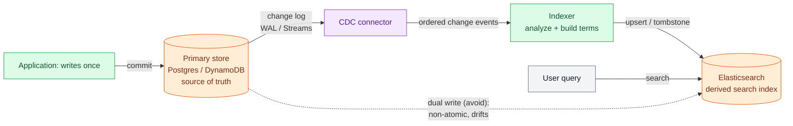

# Search

> **Prerequisites:** [Indexing](/synapse/system-design-from-first-principles/data-foundations/indexing), [Data Models](/synapse/system-design-from-first-principles/data-foundations/data-models) | **You'll be able to:** explain why an ordinary B-tree index cannot answer "which documents contain this word"; build an inverted index in your head and turn a multi-word query into set operations on posting lists; and reason about analysis, relevance scoring, segment merges, and index-sync lag well enough to decide when Elasticsearch earns its keep.

## The problem (why this exists)

You have a table of a million product reviews. The `title` column is indexed with a B-tree, so `WHERE title = 'Great sound, terrible battery'` is instant, and `WHERE title LIKE 'Great%'` is fast too. Now the product manager asks for the feature every user actually wants: a search box. Type `battery`, and get back every review that *mentions* battery — anywhere in the title or body, in any position.

Reach for the index you already have and it collapses. `WHERE body LIKE '%battery%'` — a leading wildcard — cannot use the B-tree at all. To see why, remember what a B-tree buys you: it keeps keys **sorted**, so a lookup is a walk down a tree of key ranges, and a prefix query like `Great%` works because everything starting with `Great` sits together in that sorted order (see [Indexing](/synapse/system-design-from-first-principles/data-foundations/indexing) for the mechanism). But `%battery%` fixes no prefix. The word could start at character 1 or character 900 of the body. Sorting whole documents doesn't cluster the ones that happen to contain `battery` somewhere in the middle — those documents are scattered uniformly through the sorted order. The index offers no way to jump to them, so the database falls back to reading every row and scanning its text. That is a full table scan with a substring match on top: O(n) in documents times O(m) in document length, and it gets worse with every review you add.

This is not a tuning problem you can index your way out of *with the same kind of index*. The B-tree answers "find the document whose key is X." Search asks the transposed question: "find the documents that contain X." Swapping the roles of the thing you look up and the thing you get back demands a different data structure — one built from the words, pointing back at the documents. That structure is the **inverted index**, and it is the engine inside every search system from `grep -l` to Google.

## Intuition first

Think about the index at the back of a textbook. You don't read all 600 pages hunting for "mitochondria." You flip to the index, find the single entry `mitochondria`, and it hands you a little list: *pages 88, 141, 142, 301*. One lookup, then you jump straight to the pages. The book's body is organized by page number; the index inverts that — it's organized by **term**, and each term points at the list of places it appears.

An inverted index is exactly that, built for a document collection instead of a book. For every distinct word across all your documents, you store the word once, and next to it the list of document IDs that contain it. That list is called a **posting list** (or postings list). So:

```
battery  → [3, 7, 12, 88, 141, ...]
great    → [1, 3, 7, 12, ...]
terrible → [3, 88, 205, ...]
```

Now `battery` isn't a scan of a million documents — it's a single lookup that returns a ready-made answer list. The word "inverted" is the whole idea: a normal (forward) index maps document → its words; we invert the arrows to map word → its documents [p. 146].

The magic compounds when you search for *more than one word*. What documents contain **both** `great` **and** `battery`? Fetch the two posting lists and **intersect** them — keep only the IDs present in both. Want documents with `great` **or** `terrible`? **Union** the lists. A multi-word query has quietly become a set-algebra problem over a handful of short lists, and set intersection of two sorted lists is a linear merge — walk both with two pointers, emit the matches. DDIA frames it precisely: because posting lists can be stored as bitmaps when doc IDs are sequential, "find documents with both terms" is literally a **bitwise AND** of the two term bitmaps, efficient even when the bitmaps are run-length encoded [pp. 146–147].

The beginner's one-sentence takeaway: *an inverted index maps each word to the list of documents that contain it, so a query is a set operation on those lists instead of a scan of the documents.* Everything below is about the two hard parts that sentence hides — deciding *what counts as a word* (analysis), and deciding *which matches to show first* (relevance) — plus how real systems store and sync all this.

## How it works

### Building the index: the analysis pipeline

Before a document can be indexed, its text must be chopped into terms — and *how* you chop decides what searches will ever succeed. This is **analysis**, and it runs as a small pipeline on both the documents (at index time) and the query (at search time). The two must use the *same* pipeline, or they won't meet in the middle.

A typical pipeline has four stages:

1. **Tokenize.** Split the raw text into candidate words. `"Great sound, terrible battery!"` becomes `["Great", "sound", "terrible", "battery"]` — punctuation dropped, split on whitespace and boundaries. Tokenization is language-specific: splitting English on spaces is easy; Chinese has no spaces, and German glues compound nouns together [p. 146].
2. **Lowercase (normalize).** `Great` → `great`, so a search for `great` matches a title that shouted `GREAT`. Normalization also folds accents (`café` → `cafe`) and unifies width/case quirks.
3. **Stem or lemmatize.** Reduce words to a root so morphological variants collapse: `batteries`, `battery` → `batteri`; `running`, `ran`, `runs` → `run`. Now a search for `battery` finds a review that wrote `batteries`. This is pure recall engineering — every collapse you make widens what a query catches.
4. **Remove stopwords (optional).** Drop ultra-common words — `the`, `a`, `is`, `and` — that appear in nearly every document and so carry almost no discriminating power. This shrinks the index and speeds queries, at the cost of no longer being able to search for the phrase *"the"* meaningfully. Modern engines often keep stopwords and lean on scoring instead, because dropping them breaks phrase queries like `"to be or not to be"`.

The load-bearing insight: **analysis decides recall.** If your pipeline stems `batteries` to `batteri` at index time but your query analyzer doesn't, the query for `batteries` looks up `batteries`, finds no such term, and returns nothing — even though the document is right there. Recall (did we find everything we should have?) is set the moment you choose the analyzer, long before any scoring runs. Choose an aggressive stemmer and you find more but risk false matches (`university` and `universe` can stem together); choose none and you miss `batteries` when the user typed `battery`. There is no neutral choice — analysis *is* the recall policy.

Here is the whole build-and-query path in one picture: documents flow through analysis into the term dictionary and its posting lists, and a two-word query fetches two posting lists and intersects them.

```d2
direction: right
classes: {
  client: {style: {fill: "#f3f4f6"; stroke: "#6b7280"}}
  svc:    {style: {fill: "#dcfce7"; stroke: "#16a34a"}}
  data:   {style: {fill: "#ffedd5"; stroke: "#ea580c"}}
  async:  {style: {fill: "#f3e8ff"; stroke: "#9333ea"}}
}

docs: "Documents" {
  d1: "doc 1: 'Great sound'" {class: client}
  d3: "doc 3: 'Great battery, terrible app'" {class: client}
  d7: "doc 7: 'Batteries last'" {class: client}
}

analysis: "Analysis pipeline\n(tokenize → lowercase → stem → stopwords)" {class: svc}

index: "Inverted index (term → posting list)" {
  t1: "great    → [1, 3]" {class: data}
  t2: "sound    → [1]" {class: data}
  t3: "batteri  → [3, 7]" {class: data}
  t4: "terribl  → [3]" {class: data}
  t5: "app      → [3]" {class: data}
}

query: "Query: 'great battery'\n→ analyze → [great, batteri]" {class: async}
result: "great:[1,3] ∩ batteri:[3,7]\n= [3]" {class: async}

docs.d1 -> analysis
docs.d3 -> analysis
docs.d7 -> analysis
analysis -> index: emit terms

query -> index: look up each term
index.t1 -> result: "fetch [1,3]"
index.t3 -> result: "fetch [3,7]"
```

The intersection `[1,3] ∩ [3,7] = [3]` is the answer: only document 3 contains both words. Note that the query `battery` matched document 7 (`Batteries last`) *only because* both were stemmed to `batteri` — a live demonstration that analysis, not scoring, decided the recall.

### Ranking the matches: relevance scoring

Intersection tells you *which* documents match. It doesn't tell you which to show first, and for a search box that ordering is the product. A query for `battery life` might match ten thousand reviews; the user reads three. Relevance scoring decides which three.

The intuition rests on two forces, both of which you already believe:

- **Term frequency (TF).** A review that says `battery` five times is probably more about batteries than one that says it once. More occurrences → higher score. (With diminishing returns — the tenth mention adds less than the second.)
- **Inverse document frequency (IDF).** A **rare** term is more informative than a common one. In a query for `battery life`, the word `battery` narrows the field far more than `life`, which appears everywhere. So matches on rare terms should count for more. IDF weights each term by how rare it is across the whole collection — literally the inverse of how many documents contain it. This is why stopwords barely matter to scoring even if you keep them: `the` has an IDF near zero.

Combine them — reward documents where the query's terms are frequent (TF) *and* rare in general (IDF) — and you have the classic **TF-IDF** family of scoring. The modern default in Lucene and Elasticsearch is **BM25**, a refinement of TF-IDF that adds two things: it saturates term frequency (so the 20th occurrence barely beats the 10th) and it normalizes for document length (so a 10,000-word article doesn't automatically outrank a tight 50-word review just for having more room to repeat the term) `[web: Lucene BM25Similarity docs, lucene.apache.org]`. The exact BM25 formula and its `k1`/`b` tuning knobs are beyond our sources — the takeaway you need is the *shape*: **rarer terms matter more, repeated terms matter with diminishing returns, and longer documents are penalized for length.**

> DDIA's storage chapter covers the inverted-index *data structure* thoroughly but treats relevance ranking as out of scope — "a specialist topic" of information retrieval [p. 146]. The TF-IDF/BM25 material here is flagged `[web:]` accordingly; it is well-established consensus, not invented, but it is not from the pinned sources.

### How Lucene and Elasticsearch actually store this

An inverted index sounds like a hash map, but you can't just mutate a live hash map on disk under a firehose of writes and reads. Lucene — the library inside Elasticsearch and Solr — borrows the exact trick from the [storage engines](/synapse/system-design-from-first-principles/data-foundations/storage-engines) lesson: it stores term → posting lists in **SSTable-like sorted files and merges them with the log-structured (LSM) approach** [p. 147]. If the LSM write path is fresh in your mind, Lucene's design is a special case of it.

Concretely, Lucene writes **immutable segments**. A batch of new documents is analyzed and flushed as a brand-new, self-contained mini-index (a segment) — sorted, compressed, never modified again. This immutability is the same bargain LSM makes: sequential writes, no in-place mutation, crash-safe (a half-written segment is just discarded), and cheap point-in-time snapshots. Three consequences fall straight out of it, and interviewers love all three:

- **A search must consult every segment.** Because each segment is its own little inverted index, a query fans out across all current segments and merges the results — exactly like an LSM read checking every SSTable. More segments → slower reads.
- **Background merges keep segment count bounded.** A merge process periodically combines many small segments into fewer large ones — Lucene's version of LSM **compaction** — reclaiming space and keeping reads fast. This is where deleted and updated documents finally get physically cleaned up.
- **Updates and deletes are indirection, not mutation.** You can't edit an immutable segment, so a **delete** just marks the document dead with a tombstone (a soft-delete bit); the space is reclaimed later during a merge. An **update** is a delete-plus-reinsert: tombstone the old version, write a fresh copy into a new segment. This is why, in Elasticsearch, **updates are more expensive than fresh inserts** — an insert is one append, an update is a tombstone plus an append plus eventual merge work.

Elasticsearch wraps Lucene in a distributed cluster: an index is split into **shards** (each shard is a full Lucene index of immutable segments), shards are replicated for availability and read throughput, and a query executes in two phases — a *query phase* that asks every shard for its top-ranked doc IDs, and a *fetch phase* that retrieves the actual documents for the merged winners. The nesting is worth holding in your head: **index → shards → Lucene segments → inverted index + posting lists.**

### Keeping the index in sync with the source of truth

Here is the architectural fact that trips up more designs than any scoring subtlety: **Elasticsearch is almost never your source of truth.** Your authoritative data lives in Postgres or DynamoDB; Elasticsearch is a derived, query-optimized *copy* — a secondary index that happens to live in a separate cluster. Which means every write to the primary store must somehow also reach the search index, and now you have a data-synchronization problem.

There are two ways to do it, and one of them is a trap.

The naive way is a **dual write**: your application writes to Postgres *and* writes to Elasticsearch, in the same request. It works in the demo and fails in production, because the two writes are not atomic. If the Postgres commit succeeds and the Elasticsearch call times out (or the process crashes between them), the two stores disagree — a document exists in your database that search will never find, or vice versa — with no transaction to roll either back. You've created a distributed-consistency bug in application code.

The robust way is **change data capture (CDC)**: treat the primary database's own change log (Postgres's write-ahead log, DynamoDB Streams) as the single ordered source of truth, and run a stream processor that consumes those change events and applies each one to the search index. The primary commits once, atomically; the change is captured from the log it already writes for durability; the indexer replays those changes in order into Elasticsearch. This is the standard pairing — CDC-from-Postgres or CDC-from-DynamoDB feeding Elasticsearch — and it is an instance of the stream-processing pattern (a durable, replayable log of changes driving a derived view). If the indexer falls behind or crashes, it resumes from its last offset and catches up; nothing is lost, because the log is the truth.



The dashed arrow is the dual-write shortcut you should be able to name and reject. The solid path — primary → change log → CDC → indexer → search index — is the answer. The unavoidable cost, even done right, is **lag**: the search index is *eventually* consistent with the primary, trailing by however long the CDC pipeline takes (typically sub-second to seconds). A document just written may not be findable for a moment. Usually fine; occasionally a requirement to design around ("why didn't my new post show up in search immediately?").

### Fuzzy matching for typos

Users misspell things. A search for `battriy` should still find batteries. The inverted index looks up exact terms, so a naive lookup of `battriy` finds nothing. The fix is **fuzzy matching within an edit distance** — treat two terms as matching if one can be turned into the other in at most *k* single-character edits (insert, delete, substitute). Lucene implements this efficiently: it compiles the query term into a **Levenshtein automaton** (a finite-state machine, trie-like) that accepts exactly the terms within edit distance *k*, then intersects that automaton against the sorted term dictionary to find all close terms at once [p. 147]. A related tool for substring and regex search is **n-grams** — indexing every length-*n* substring (the trigrams of `hello` are `hel`, `ell`, `llo`), which enables arbitrary substring matching at the cost of a much larger index [p. 147]. Both are recall tricks layered on top of the same inverted-index core.

### Hands-on: build the index and shard it

A runnable search engine lives at `proof-of-concepts/04-building-blocks/08-search/` in the repo root — pure Python, standard library only: a tokenizer, an `InvertedIndex`, TF-IDF and BM25 scorers behind one port, and a `SearchCluster` that scatter-gathers across shards.

```bash
cd proof-of-concepts/04-building-blocks/08-search
./run            # ranking + scatter-gather demonstration
./run test       # mypy --strict + unit tests + demo
```

The demo makes the ranking real (a `raft leader log` query returns the Raft doc first; a rare term outweighs a common one via IDF) and then makes the **distributed** subtlety concrete: it splits the corpus across 4 simulated shards and shows that merging each shard's top-k reproduces the single-index ranking *only* when every shard scores against **global** collection statistics (N, document frequency, average length). Score each shard with its own local IDF instead and the merged ranking drifts — because a term that's globally rare can look common on one shard. This is exactly why Elasticsearch offers a `dfs_query_then_fetch` search type that gathers global term statistics before ranking; the README maps what is simulated (shards as in-process objects) to what is exactly-as-production (the index, the scoring, and the global-stats problem).

## Trade-offs

The central design decision is whether to introduce a dedicated search engine at all, versus using your primary database's own search features. A second stateful cluster plus a sync pipeline is real, permanent cost.

| Option | Gives you | Costs you | Use when |
| --- | --- | --- | --- |
| **`LIKE '%term%'` in the primary DB** | Zero new infrastructure; always consistent | Full scan, O(n·m); no relevance ranking, no analysis | Tiny tables, admin tools, exact-substring lookups |
| **Postgres full-text (GIN inverted index)** | Real inverted index *inside* your ACID store; no sync, no second cluster | Weaker relevance tuning, faceting, and scale ceiling than Elasticsearch | Search is a feature, not the product; up to ~tens of millions of docs |
| **Dedicated Elasticsearch cluster** | Best-in-class relevance (BM25), analysis, faceting, fuzzy, huge scale | A second stateful cluster to run **plus** a CDC sync pipeline and eventual-consistency lag | Search is core; ranking/faceting/scale exceed what the primary DB can do |

The middle row deserves emphasis because candidates forget it exists: PostgreSQL ships a genuine inverted index (its GIN index type backs full-text and JSON search, using posting lists just like Lucene [p. 147]). For a great many "add a search box" features, turning on Postgres full-text is the right answer and Elasticsearch is over-engineering. Reach for the dedicated cluster when the *search* requirements — relevance quality, faceted navigation, typo tolerance, scale — outgrow what a general-purpose database's search extension can do.

## Numbers that matter

Search sizing is dominated by rules of thumb, not hard SLAs — flag them as such in an interview (and see [Estimation & the Numbers](/synapse/system-design-from-first-principles/foundations/estimation-and-numbers) for how to wield them):

- **The "skip Elasticsearch under ~100k documents" heuristic.** For collections below roughly a hundred thousand documents, a dedicated search cluster is usually not worth its operational weight — your primary database's indexes (or full-text extension) will serve. Use this as the tripwire for *when* the trade-off table's third row wins.
- **Bloom-filter-style membership** doesn't apply to the term dictionary, but the LSM read cost does: a query touches *every segment*, so segment count is a latency knob. Merges trade write/CPU cost now for read speed later — the same LSM tension from [storage engines](/synapse/system-design-from-first-principles/data-foundations/storage-engines).
- **Posting-list intersection is linear** in the length of the shorter list when both are sorted — which is why query planners intersect the **rarest** term's (shortest) posting list first, shrinking the candidate set before touching the common term's long list. Rare-term-first is both a relevance principle (IDF) and a performance one.
- **Index size** roughly tracks the number of distinct terms times average posting-list length, plus per-document position data if you support phrase queries. Stemming and stopword removal shrink it; n-grams and position indexes inflate it. Recall features are not free in storage.

## In production

**Elasticsearch (and OpenSearch, its fork) is the default dedicated search engine**, and Lucene is the library beneath both — the same Lucene that powers Solr and Postgres's conceptual cousin, GIN. When a company says "we run Elasticsearch," what they operate is a cluster of shards, each a Lucene index of immutable segments, continuously merging in the background, fed by a sync pipeline from an authoritative store.

The pairing that recurs in real architectures — and the one worth naming in an interview — is **Postgres (or DynamoDB) as source of truth, CDC into Elasticsearch as the query layer**. The primary store owns writes and transactional correctness; Elasticsearch owns the search box. Change data capture (DynamoDB Streams, Debezium reading the Postgres WAL) carries every write across as an ordered stream, and the indexer applies it. This is the concrete, common instance of the derived-data pattern: one system of record, one or more specialized read models kept in sync through a log. It shows up anywhere a design has both "store this reliably" and "let users search it" requirements — product catalogs, message history, listings, logs.

Two operational realities dominate running it. First, **reindexing is a fact of life.** Because analysis is baked into the index at write time, changing the analyzer (a new stemmer, a new language, a new field) means rebuilding the index from scratch — you cannot retroactively re-analyze immutable segments. Mature teams keep the primary store as the replayable source precisely so they can rebuild Elasticsearch from zero when the mapping changes, treating the search index as disposable and regenerable. Second, **index-sync lag is the metric to watch.** The CDC pipeline's lag (how far behind the primary the search index trails) is the search equivalent of Kafka consumer lag from [queues & brokers](/synapse/system-design-from-first-principles/building-blocks/queues-and-brokers): rising lag means users are searching stale data, and if the indexer falls far enough behind or dies silently, search quietly diverges from reality with no error thrown.

Search also underpins case studies you'll build later. The [ticketmaster](/synapse/system-design-from-first-principles/case-studies/ticketmaster) design uses Elasticsearch to let users search events by name, city, or performer over data whose source of truth is a relational store; the [web crawler](/synapse/system-design-from-first-principles/case-studies/web-crawler) feeds crawled pages into an inverted index so they become searchable. In both, the search engine is a *derived* view, never the primary.

## Pitfalls & interview traps

**"Just add an index to the text column."** The most common beginner move, and the one this whole lesson exists to correct. A B-tree on the text column speeds up equality and *prefix* queries; it does nothing for `%contains%` because a leading wildcard fixes no prefix, so the sorted order can't cluster the matches. If an interviewer asks how you'd support keyword search and you reach for a normal secondary index, you've missed that search is the *transposed* query (word → documents) and needs the *transposed* structure (an inverted index). Say "inverted index" and explain the transposition.

**Mismatched analyzers between index and query.** A silent, maddening class of bug: documents are stemmed and lowercased at index time, but the query is looked up raw. `Batteries` was indexed as `batteri`; a search for `Batteries` looks up `Batteries`, finds no such term, returns nothing — even though the document is sitting right there. Recall silently drops to zero for a whole class of queries and no error fires. The rule: **the query must pass through the same analysis pipeline as the documents.**

<div style="border-left:4px solid #da5233;background:rgba(218,82,51,0.08);padding:0.6rem 1rem;border-radius:0 0.5rem 0.5rem 0;margin:1.25rem 0">

⚠️ **Never treat Elasticsearch as your source of truth, and never sync to it with a dual write.** Elasticsearch is a derived, eventually-consistent copy optimized for search — it has no ACID transactions across documents, and its immutable-segment model makes it the wrong place to own authoritative state. If you write to your database and to Elasticsearch as two separate calls in the same request, the writes are **not atomic**: a crash or timeout between them leaves the two stores permanently disagreeing, with no transaction to roll back — a document your database has but search can never find. Keep the authoritative data in Postgres/DynamoDB and propagate changes through **CDC** (a replayable, ordered change log), accepting sub-second-to-seconds **index-sync lag** as the price. When an interviewer asks "how does the search index stay current?", the wrong answer is "we write to both"; the right answer names CDC and the lag it implies.

</div>

**Forgetting relevance entirely.** Returning *all* matches unordered is technically a search and practically useless — users read the top three results. If you describe the inverted index and stop, expect the follow-up: "and how do you rank them?" Have TF-IDF/BM25's *shape* ready: rarer query terms count more (IDF), repeated terms count with diminishing returns (saturated TF), and longer documents are penalized for length — even if you can't recite the formula.

**Over-reaching for Elasticsearch.** The opposite failure. A second stateful cluster plus a CDC pipeline is a large, permanent operational commitment. For a small collection or a simple feature, Postgres full-text (a real inverted index inside your existing ACID store) or even `LIKE` is the proportionate choice. The interview-grade instinct is to *name* the dedicated-search-cluster cost and justify paying it — search being genuinely core, or scale/relevance/faceting exceeding the primary DB — rather than defaulting to Elasticsearch for every search box.

## Check yourself

```quiz
{"prompt": "Your `documents` table has a B-tree index on the `body` text column. Why can it still not efficiently answer \"find all rows whose body contains the word 'battery' somewhere\"?", "options": ["B-tree indexes only work on integer columns", "A leading wildcard (%battery%) fixes no prefix, so the index's sorted order can't cluster the matching rows — it degrades to a full scan", "The index would work if you rebuilt it with more memory", "B-trees can't store text longer than 255 characters"], "answer": "A leading wildcard (%battery%) fixes no prefix, so the index's sorted order can't cluster the matching rows — it degrades to a full scan"}
```

```quiz
{"prompt": "At index time your pipeline stems words (batteries → batteri) and lowercases them, but your query analyzer does neither. A user searches for \"Batteries\". What happens, and why?", "options": ["It works fine — Elasticsearch normalizes queries automatically", "It returns zero results, because the query looks up the term 'Batteries' while the index stored 'batteri' — analysis mismatch destroys recall", "It returns every document, because unanalyzed queries match everything", "It throws an error about the missing analyzer"], "answer": "It returns zero results, because the query looks up the term 'Batteries' while the index stored 'batteri' — analysis mismatch destroys recall"}
```

```quiz
{"prompt": "In a query for \"quantum battery\", the term 'battery' appears in 400 documents and 'quantum' in 12. Why should the ranking weight a match on 'quantum' more heavily?", "options": ["Because 'quantum' has more letters", "Because rarer terms are more informative (inverse document frequency) — matching a term that appears in few documents narrows the result far more than matching a common one", "Because it comes first alphabetically", "Because term frequency always outweighs document frequency"], "answer": "Because rarer terms are more informative (inverse document frequency) — matching a term that appears in few documents narrows the result far more than matching a common one"}
```

```quiz
{"prompt": "Why are document updates more expensive than fresh inserts in Elasticsearch/Lucene?", "options": ["Updates lock the entire index", "Lucene segments are immutable, so an update is a tombstone-plus-reinsert (soft-delete the old copy, append a new one, clean up during a later merge), whereas an insert is a single append", "Updates require a full cluster restart", "Inserts are throttled by default while updates are not"], "answer": "Lucene segments are immutable, so an update is a tombstone-plus-reinsert (soft-delete the old copy, append a new one, clean up during a later merge), whereas an insert is a single append"}
```

<details>
<summary>You need to keep an Elasticsearch index in sync with a Postgres source of truth. Walk through why a dual write is fragile and what you'd do instead.</summary>

A **dual write** has the application write to Postgres and to Elasticsearch as two separate operations in one request. They aren't atomic: if Postgres commits and the Elasticsearch call then times out or the process dies in between, the two stores disagree permanently — Postgres has a row that search can't find (or the reverse), and there's no transaction spanning both to roll back. You've hand-rolled a distributed-consistency bug.

The robust design is **change data capture**: let Postgres commit once, atomically, to its own write-ahead log; run a CDC connector (e.g. Debezium) that reads that log as an ordered stream of change events; and have an indexer consume those events and apply each upsert/delete to Elasticsearch. The database's durability log becomes the single source of truth for the sync. If the indexer crashes it resumes from its last offset and catches up — nothing is lost. The cost is **eventual consistency**: the index trails the primary by the pipeline's lag (usually sub-second to seconds), so a just-written document may briefly be unsearchable. That's the trade you accept for correctness. [p. 147]
</details>

<details>
<summary>Elasticsearch stores its inverted index in immutable Lucene segments. Name two consequences of that immutability for how queries and deletes behave.</summary>

Immutability is the same bargain the LSM storage engine makes, and the consequences follow directly [p. 147]:

1. **Queries fan out across all segments.** Each segment is its own self-contained inverted index, so a search must consult every current segment and merge the results — exactly like an LSM read checking every SSTable. Segment count is therefore a read-latency knob, which is why a **background merge** process (Lucene's compaction) periodically combines small segments into fewer large ones.
2. **Deletes and updates are indirection, not mutation.** You can't edit an immutable segment, so a delete just writes a tombstone (soft-delete bit) and the space is reclaimed at the next merge; an update is a tombstone-plus-reinsert. This is why updates cost more than inserts. It also makes point-in-time snapshots cheap (record which segments exist) and crash recovery simple (discard a half-written segment).
</details>

## PoC — Proof of concepts

**Run it yourself.** [Inverted index & ranked search](https://github.com/ani2fun/synapse-content/tree/main/proof-of-concepts/04-building-blocks/08-search)
— build an inverted index, rank with TF-IDF/BM25, and run a scatter-gather query across sharded
in-process indexes; the tokenise → post → score → merge pipeline made concrete. From
`proof-of-concepts/04-building-blocks/08-search/`, run `./run`.

**Study real implementations.**

- [Apache Lucene](https://github.com/apache/lucene) — the inverted-index library under Elasticsearch,
  Solr and much else; the canonical implementation of postings, scoring and segment merges.
- [Elasticsearch](https://github.com/elastic/elasticsearch) — Lucene turned into a distributed engine:
  sharding, the query DSL and the scatter-gather this POC imitates, at scale.
- [Tantivy](https://github.com/quickwit-oss/tantivy) — a Lucene-inspired engine in Rust, small and
  readable enough to follow the index format end to end.

## Sources

DDIA2 ch. 4 pp. 146–147 (full-text search, inverted index, postings lists, bitwise-AND intersection, Lucene's SSTable-like log-structured storage, n-grams, Levenshtein-automaton fuzzy matching), p. 132 (secondary indexes as postings lists) · `[web: Lucene BM25Similarity docs, lucene.apache.org]` (BM25 as the modern TF-IDF refinement — term-frequency saturation and length normalization; scoring is out of scope in DDIA) · Related: [Indexing](/synapse/system-design-from-first-principles/data-foundations/indexing), [Storage Engines](/synapse/system-design-from-first-principles/data-foundations/storage-engines), [Queues & Brokers](/synapse/system-design-from-first-principles/building-blocks/queues-and-brokers), [Ticketmaster](/synapse/system-design-from-first-principles/case-studies/ticketmaster), [Web Crawler](/synapse/system-design-from-first-principles/case-studies/web-crawler)
