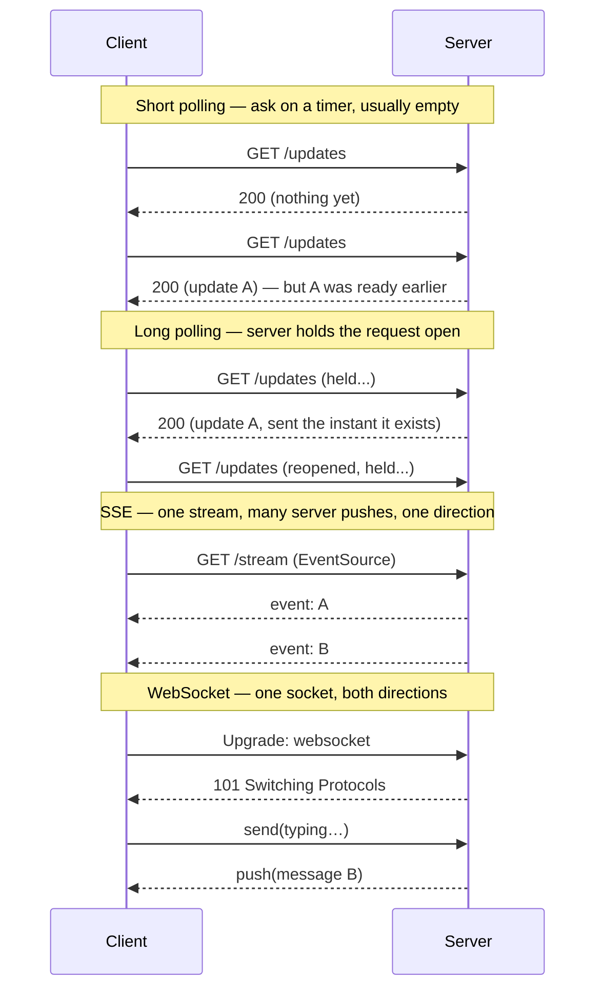

# Real-time Delivery

> **Prerequisites:** [Networking Essentials](/synapse/system-design-from-first-principles/foundations/networking-essentials), [API Design](/synapse/system-design-from-first-principles/foundations/api-design) | **You'll be able to:** pick the right transport (polling, SSE, WebSocket, WebRTC) for a given feature by reasoning about directionality and overhead; and explain how a message reaches the *one* server holding a specific user's live connection.

## The problem (why this exists)

Two people are messaging. Alice types "on my way" and hits send. It lands in the server's database in a few milliseconds. Bob, on the other side of the world, is staring at the same chat — and sees nothing. The server *knows* there is a new message. Bob's phone does not. The information exists; it just hasn't crossed the last hop to the client that cares about it.

The plain request/response web has no answer for this. HTTP is a client-initiated protocol: the browser asks, the server answers, the connection closes. The server cannot speak first. It has no way to tap Bob on the shoulder and say "something changed." So Bob's app is stuck doing the only thing it can — asking, over and over, "anything new? anything new? anything new?" — hoping to stumble onto the update shortly after it happens.

That gap between *when the server knows* and *when the client finds out* is the whole subject of this lesson. Chat messages, a sports score ticking over, a Google Doc cursor moving, a stock price, a "your driver is 2 minutes away" banner, a live-comments feed under a video — all of them need server-side changes to reach clients the moment they occur, not on the client's next guess. And once you can push, a second, harder problem appears: at scale, *which of your thousand servers* is even holding the connection to the specific client that needs this particular update?

## Intuition first

There are two ways to learn that something changed: **pull** (you keep asking) and **push** (you get told). A restaurant with no pager makes you walk up to the counter every two minutes to ask "is my order ready?" — that's polling. A restaurant that hands you a buzzer lets you sit down; the buzzer goes off the instant your food is up — that's push. Push is strictly better on latency and wasted effort, but it costs the restaurant something: they have to keep track of every buzzer they've handed out and which table it belongs to.

That bookkeeping is the crux. Pull is stateless and easy — the server answers each question and forgets you. Push means the server must hold an open line to you and *remember* it, so it can reach you later, unprompted. Holding millions of open lines, and knowing which line goes to which user, is where all the real engineering lives.

It helps to see that real-time delivery is really **two hops**, not one:

1. **Source → server.** Some event enters your backend — a write to the database, a message on a queue, another user's action.
2. **Server → client.** That event has to travel out to every connected client that should see it.

The transport protocols below (polling, SSE, WebSockets) are only about *hop 2* — the pipe between one server and one client. They say nothing about how the event got to *that* server in the first place, or what to do when the client you need to reach is connected to a *different* server. Beginners often stop at hop 2 and think they're done. The second half of this lesson is about hop 1 and the routing problem that connects the two. For now, the one-sentence takeaway: **stop making the client ask repeatedly; let the server push the moment it knows.**

## How it works

### The transport ladder

There is a ladder of techniques, each adding capability (and cost) over the last. Climb only as high as the feature actually needs.

**Short polling.** The client asks on a fixed timer — every few seconds it sends a normal HTTP request: "any updates since I last checked?" The server answers immediately with whatever it has, usually nothing. It's trivial to build on top of any existing HTTP API and needs zero special infrastructure. But it's wasteful in two directions at once: most requests return empty (burning bandwidth, CPU, and battery for nothing), *and* an update that lands right after a poll waits nearly a full interval before the next poll discovers it. You can't win — poll faster to cut latency and you multiply the wasted requests; poll slower to save resources and latency gets worse.

**Long polling.** A clever twist that keeps the simplicity of HTTP but kills most of the waste. The client sends a request and the server *does not answer right away* — it holds the request open until it actually has something to send (or a timeout fires, commonly after 15–30 seconds). The instant an update arrives, the server responds; the client processes it and immediately opens a new long-poll request. Now the client learns of updates within a round-trip of them happening, and idle periods cost one held-open connection instead of a storm of empty replies. The price: latency still includes a full request/response round-trip per update, and under a fast stream of updates you pay the reconnect overhead over and over.

**Server-Sent Events (SSE).** A one-way, server→client stream *standardized* over a single long-lived HTTP response. The client opens one request (`EventSource` in the browser); the server keeps the response open and writes events into it as a `text/event-stream` for as long as it likes `[web: MDN Server-Sent Events]`. No reconnect per message — one connection carries an unbounded sequence of pushes. It's ordinary HTTP, so it sails through proxies, load balancers, and firewalls, and the browser handles **automatic reconnection** and even resumes from the last event id for free `[web: MDN Server-Sent Events]`. The catch is in the name: it's *server-sent* only. The client can't send data back over the same channel — for that it uses a separate ordinary HTTP request. Perfect for feeds that flow one way: notifications, live scores, an LLM streaming tokens, a progress bar.

**WebSockets.** A genuinely bidirectional, **full-duplex**, persistent connection. It starts life as an HTTP request carrying an `Upgrade: websocket` header; the server agrees, and the same TCP connection is then "upgraded" to the WebSocket protocol, over which either side can send messages at any time with very low per-message overhead `[web: RFC 6455]`. This is the tool for genuinely interactive, two-way, low-latency features: chat, multiplayer collaboration, live cursors in a doc, a trading terminal. The cost is that you've left plain HTTP behind — the connection is stateful and long-lived, some older or misconfigured proxies mishandle the upgrade, and *your servers must now hold and manage every open socket* (the second-half problem).

**WebRTC.** The last rung, and a different animal: **peer-to-peer**, designed for direct client-to-client media (audio, video, low-latency data) that doesn't route through your servers at all. Peers discover each other and punch through NATs using STUN/TURN helper servers, then stream directly to one another `[web: MDN WebRTC API]`. This is what powers video calls and screen-sharing. It's powerful but heavy to operate (signaling, NAT traversal, TURN relays for peers that can't connect directly), so reach for it only when you truly need peer-to-peer media, not for ordinary server-push.

This sequence diagram contrasts how the first four behave over the same two updates:



### The hard part: delivering to the *right* client at scale

Suppose you chose WebSockets for chat. A message for Bob arrives. Which of your servers do you send it to? A stateless HTTP API doesn't care — any server can handle any request, so a load balancer sprays traffic across the fleet. But a persistent connection is **stateful**: Bob's socket is a live object in the memory of *one specific server*, the one he happened to connect to. Server 7 holds Bob's socket; servers 1 through 6 and 8 through 1000 have never heard of him. When Alice's message lands — and Alice is connected to server 3 — server 3 has the message but *not the socket*, and server 7 has the socket but *not the message*. This mismatch is the central problem of real-time systems, and no transport protocol solves it.

You need two pieces working together:

**A connection registry.** Somewhere the system must know "user Bob → server 7." One approach is a shared store (Redis, ZooKeeper/etcd) mapping each connected user to the server holding their socket; a sender looks up the target and forwards the message there. Another is **consistent hashing** — hash the user id onto a ring of servers so any sender can *compute* which server owns a given user without a lookup, the same technique used to place data across shards (see [Sharding & Consistent Hashing](/synapse/system-design-from-first-principles/distributed-data/sharding-and-consistent-hashing)). Registries are exact but need updating on every connect/disconnect; consistent hashing avoids the lookup but reshuffles ownership when the server set changes.

**A pub/sub backplane.** Rather than every server tracking every other server's connections, you put a message bus in the middle. Each server *subscribes* to the channels for the users it currently holds. When any server needs to deliver a message, it *publishes* to that user's channel; the bus fans the message out to whichever server is subscribed, and that server writes it down the socket. The sender doesn't need to know *where* the recipient is — the backplane handles the routing. Redis Pub/Sub and Kafka are the usual backbones; this is the same decoupling idea as a [message broker](/synapse/system-design-from-first-principles/building-blocks/queues-and-brokers), applied to live connections instead of background jobs.

```d2
direction: right
classes: {
  client: {style: {fill: "#f3f4f6"; stroke: "#6b7280"}}
  edge:   {style: {fill: "#dbeafe"; stroke: "#2563eb"}}
  svc:    {style: {fill: "#dcfce7"; stroke: "#16a34a"}}
  async:  {style: {fill: "#f3e8ff"; stroke: "#9333ea"}}
}

alice: Alice's client {class: client}
lb: Load balancer {class: edge}
s3: Gateway server 3\n(holds Alice's socket) {class: svc}
s7: Gateway server 7\n(holds Bob's socket) {class: svc}
bus: Pub/Sub backplane\n(Redis / Kafka) {class: async}
bob: Bob's client {class: client}

alice -> lb: send msg for Bob
lb -> s3: routed to Alice's server
s3 -> bus: publish to channel user:bob
bus -> s7: fan-out to the subscriber
s7 -> bob: push down Bob's socket
```

**Presence and heartbeats.** How does the system know Bob is even still there? TCP connections can die silently — a phone loses signal, a laptop lid closes — without a clean close ever reaching the server. So both sides exchange periodic **heartbeats** (ping/pong frames): if the server hears nothing for a couple of intervals, it declares the connection dead, tears it down, and updates presence to "offline." Heartbeats also keep intermediary proxies from closing an "idle" connection. Presence — the little green "online" dot — is built directly on this liveness signal.

**Scaling persistent connections (C10K → C10M).** Holding many idle connections is a distinct challenge from serving many requests. The classic **C10K problem** was handling ten thousand simultaneous connections on one machine; modern event-driven servers (epoll/kqueue, async runtimes) push a single node toward hundreds of thousands or more, and the frontier is now discussed as **C10M** — ten million connections on commodity hardware `[web: The C10K problem, Dan Kegel]`. Each idle socket still costs kernel buffers and application memory, so the fleet is sized by *concurrent connections*, not request rate. And because these connections are long-lived, **deploys are painful**: restarting a server drops every socket it holds. Production systems use **connection draining** — on shutdown, stop accepting new connections, let clients reconnect elsewhere gracefully (often nudged by the server), and only then exit — so a rolling deploy doesn't manifest as a synchronized reconnect storm.

## Trade-offs

The transport choice is the first decision, and it's mostly mechanical once you know the feature's shape:

| Transport | Direction | Overhead | Reconnect | Use when |
| --- | --- | --- | --- | --- |
| Short polling | Client pulls | High (many empty requests) | N/A — new request each time | Updates are rare and seconds of latency are fine; you want zero new infra |
| Long polling | Client pulls, server holds | Medium (one round-trip per update) | Reconnect after every message | You need low latency but must stay on plain HTTP and updates are infrequent |
| SSE | Server → client only | Low (one stream, many pushes) | Automatic, built into browser | One-directional feed: notifications, live scores, streaming tokens, progress |
| WebSocket | Full-duplex both ways | Very low per message | Manual — you implement it | Genuinely interactive two-way: chat, collaboration, live cursors, games |
| WebRTC | Peer-to-peer | High setup, low media latency | Manual, plus NAT traversal | Direct client-to-client media: video/audio calls, screen share |

The meta-trade-off: every rung up buys capability at the cost of statefulness and operational weight. Short polling adds nothing to your infrastructure; WebSockets force you to build a connection registry, a pub/sub backplane, heartbeat handling, and deploy-time draining. Don't pay for a rung you don't stand on.

## Numbers that matter

Rough figures worth carrying into an interview (rules of thumb, not hard limits):

- **Long-polling latency stacks up.** With ~100 ms client↔server latency, two updates 10 ms apart can leave the second arriving up to ~290 ms after it occurred — the first response finishing (~90 ms) plus a fresh request (~100 ms) plus its response (~100 ms). Long polling is "near real-time," not instant.
- **SSE / streaming connections** are often deliberately capped at **30–60 seconds** and then reconnected, to avoid stale intermediaries and rebalance load.
- **A pub/sub backplane** adds only single-digit milliseconds (**< 10 ms** typical) to delivery — cheap compared to the round-trips it saves.
- **Ticketmaster-style long-poll intervals** of **15–30 seconds** are common for low-urgency "is a better seat available yet?" updates.
- **Connection density:** one modern node can hold **hundreds of thousands** of idle WebSocket/SSE connections; reaching **millions per node (C10M)** is an engineering feat, not a default `[web: The C10K problem, Dan Kegel]`. Budget memory per connection and size the fleet by concurrent connections, not QPS.

## In production

**WhatsApp** famously ran on a small fleet of servers each holding on the order of a million-plus concurrent connections, leaning on an efficient event-driven stack (Erlang/BEAM) to keep per-connection cost tiny — the canonical demonstration that connection density, not request throughput, is the metric that matters for chat. The full design lives in the [WhatsApp case study](/synapse/system-design-from-first-principles/case-studies/whatsapp), where the connection-registry and delivery problem is treated end to end.

**Live comments** under a video or livestream is the fan-out extreme: one event must reach hundreds of thousands of viewers essentially at once. Here the pub/sub backplane earns its keep — publishers write once, and a tier of connection-holding servers (each subscribed on behalf of its viewers) fans the comment out to every socket. The naive alternative, every server polling a database, collapses under the read load.

**Google Docs** and collaborative editors use a persistent bidirectional channel to stream keystrokes and cursor movements between collaborators with sub-second latency, reconciling concurrent edits on top (see the [Google Docs case study](/synapse/system-design-from-first-principles/case-studies/google-docs)). **Slack and Discord** maintain a WebSocket per active client for messages, typing indicators, and presence, backed by pub/sub fan-out across their gateway fleet. The common thread across all of them: the transport (WebSocket) is the *easy* part; the hard, differentiating engineering is the registry + backplane + presence + graceful-deploy machinery behind it.

## Pitfalls & interview traps

<div style="border-left:4px solid #da5233;background:rgba(218,82,51,0.08);padding:0.6rem 1rem;border-radius:0 0.5rem 0.5rem 0;margin:1.25rem 0">

⚠️ **Reaching for WebSockets when SSE would do.** WebSockets are the flashy answer, so candidates default to them for *every* real-time feature. But if data flows only one way — a notification feed, a live score, an LLM streaming its response, a progress indicator — SSE is simpler, rides plain HTTP through every proxy, and gives you automatic reconnection for free. Naming SSE for a one-directional feed (and WebSocket only for genuinely bidirectional interaction) is exactly the discrimination interviewers are probing for.

</div>

Other traps that separate a shallow answer from a real one:

- **Forgetting connection state on deploys.** "Just use WebSockets" ignores that every deploy drops every socket. If you don't mention connection draining and graceful reconnection, a good interviewer will ask what happens when you ship a new version at 5pm — and "all ten million clients reconnect at once" is the wrong answer.
- **Answering hop 2 and stopping.** Picking a transport is half the problem. The follow-up is always "the message is on server 3 but the recipient's socket is on server 7 — now what?" If you can't produce a connection registry (or consistent hashing) plus a pub/sub backplane, you haven't finished the design.
- **Load balancers that buffer or time out.** Many L7 load balancers and proxies buffer responses or kill "idle" connections after ~60 seconds, silently breaking SSE and long polling. Real deployments tune idle timeouts and disable response buffering on streaming routes, or use L4 (connection-level) balancing for WebSockets (see [Load Balancing & Gateways](/synapse/system-design-from-first-principles/building-blocks/load-balancing-and-gateways)).
- **Heartbeats too aggressive or too lax.** Too frequent and you burn battery and bandwidth on millions of clients; too infrequent and you keep pushing messages into dead connections and show stale "online" dots. The interval is a real tuning decision, not a detail.
- **Assuming delivery is guaranteed.** A socket write is not an ack. If the client is briefly offline, the message can vanish. Durable real-time systems persist messages and let clients re-sync missed ones on reconnect — delivery semantics (at-least-once, ordering) are the same concerns as any [message broker](/synapse/system-design-from-first-principles/building-blocks/queues-and-brokers).

## Check yourself

```quiz
{"prompt": "You're building a live sports-score ticker: the server pushes score updates to millions of viewers, and viewers never send anything back over this channel. Which transport is the best fit?", "options": ["WebSockets, because real-time always means WebSockets", "Server-Sent Events, because the flow is one-directional and SSE rides plain HTTP with automatic reconnection", "Short polling every second, because it's simplest", "WebRTC, because it has the lowest latency"], "answer": "Server-Sent Events, because the flow is one-directional and SSE rides plain HTTP with automatic reconnection"}
```

```quiz
{"prompt": "A message for user Bob arrives at server 3, but Bob's WebSocket is held in the memory of server 7. What component lets server 3 get the message to Bob without knowing where he's connected?", "options": ["A bigger load balancer", "A pub/sub backplane that server 7 subscribes to on Bob's behalf, so server 3 just publishes to Bob's channel", "A faster database", "A CDN edge cache"], "answer": "A pub/sub backplane that server 7 subscribes to on Bob's behalf, so server 3 just publishes to Bob's channel"}
```

```quiz
{"prompt": "Why is short polling a poor choice for low-latency updates?", "options": ["It requires WebSocket infrastructure", "It can't work through firewalls", "An update that arrives just after a poll waits nearly a full interval, and most polls return empty — you can't cut latency without multiplying wasted requests", "It only works server-to-client"], "answer": "An update that arrives just after a poll waits nearly a full interval, and most polls return empty — you can't cut latency without multiplying wasted requests"}
```

```quiz
{"prompt": "Why are deploys uniquely painful for a fleet of servers holding millions of persistent connections?", "options": ["The code takes longer to compile", "Restarting a server drops every socket it holds, so a careless rolling deploy causes a synchronized reconnect storm", "Persistent connections can't be load-balanced at all", "Databases must be taken offline during deploys"], "answer": "Restarting a server drops every socket it holds, so a careless rolling deploy causes a synchronized reconnect storm"}
```

<details>
<summary>Why is a persistent connection "stateful" in a way an ordinary HTTP request is not — and what does that force you to build?</summary>

An ordinary HTTP request is self-contained: any server in the fleet can handle it, because nothing about the request depends on which machine touched it before. A load balancer can spray requests anywhere. A WebSocket (or SSE stream) is different — it's a live object sitting in the memory of *one specific server*, the one the client connected to. That server, and only that server, can write bytes down that socket. So to deliver a message to a given user, the system must *know which server holds their connection* (a connection registry, or consistent hashing) and have a way to get the message to that server (a pub/sub backplane). That machinery is exactly what a stateless request/response API never needs.

</details>

<details>
<summary>Long polling and SSE both keep a request "open." What's the essential difference?</summary>

Long polling holds *one* request open until *one* update is ready, then responds and closes — the client must immediately open a new request for the next update. It's a sequence of one-shot held requests. SSE holds a *single* response open and streams *many* events down it over its lifetime without reconnecting per message. Long polling is a clever hack on top of ordinary request/response; SSE is a purpose-built streaming standard (with browser-native `EventSource`, automatic reconnection, and last-event-id resume). For a steady stream of updates, SSE avoids the per-message reconnect overhead that long polling pays.

</details>

## PoC — Proof of concepts

The transports and the servers that route real-time messages to millions of connections:

- [MDN — WebSockets API](https://developer.mozilla.org/en-US/docs/Web/API/WebSockets_API) — the
  primary reference for the handshake and framing behind persistent connections (with SSE as the
  lighter one-way alternative).
- [Socket.IO](https://github.com/socketio/socket.io) — the widely-used client/server library that adds
  reconnection, rooms and fallbacks on top of raw WebSockets.
- [Centrifugo](https://github.com/centrifugal/centrifugo) — a scalable real-time messaging *server*:
  channels, presence and horizontal fan-out — exactly the connection-routing problem this lesson
  frames.

## Sources

[web: MDN — Server-Sent Events / EventSource] · [web: MDN — WebRTC API] · [web: RFC 6455 — The WebSocket Protocol] · [web: "The C10K problem", Dan Kegel]
