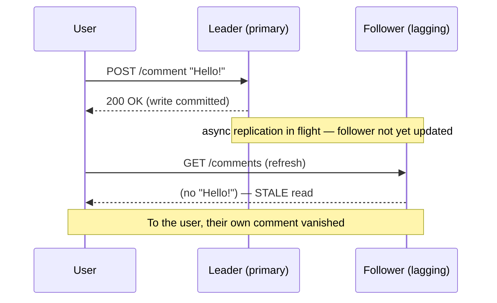

# Scaling Reads

> **Prerequisites:** [Caching](/synapse/system-design-from-first-principles/building-blocks/caching), [Replication](/synapse/system-design-from-first-principles/distributed-data/replication) | **You'll be able to:** sequence the read-scaling ladder from cheapest to most invasive, name the consistency or freshness tax each rung charges, and pick the right rung for a given scenario in an interview.

## The problem (why this exists)

Most systems you will ever design are read-heavy. A social feed, a product catalog, a news site, a URL shortener — for every write there are ten, a hundred, sometimes a thousand reads. The read-to-write ratio starts around 10:1 for a normal app and climbs past 100:1 for anything content-heavy. That asymmetry is the single most important fact about the workload, because it tells you exactly where to spend your effort: making reads cheap is worth almost any amount of extra work on the write path.

Here is the failure it prevents. You launch, and everything runs off one primary database. Traffic grows. Every page load fans out into a handful of queries — a profile lookup, a follower count, a joined feed — and each one costs 20–50 ms against the primary. At a few thousand users this is invisible. At ten million daily actives generating hundreds of millions of reads a day, the primary's CPU sits pinned during peak, p99 latency balloons as queries queue behind each other, and connections pile up until the pool is exhausted. One traffic spike from a brownout.

The instinct of a beginner is to buy a bigger database. That works exactly once, and then you are out of bigger machines. The instinct of an expert is different: *stop recomputing the same answers.* The primary is a very expensive, very durable calculator being asked the same questions thousands of times per second. The entire discipline of scaling reads is the discipline of making **copies** and **precomputations** so those questions get answered somewhere cheaper than the primary — and knowing precisely what each copy costs you in freshness, storage, or write-amplification.

## Intuition first

Every read-scaling technique is a variation on one idea: **serve the read from somewhere other than the authoritative primary.** That "somewhere else" is always a copy or a precomputed derivative of the truth, and a copy is never free. The instant you keep a second version of the data, it can disagree with the first. So the mental model is not "how do I make reads faster" — it is a ladder of moves, ordered from cheapest and least invasive to most powerful and most disruptive, where **every rung trades some property of the data for read speed.**

The rungs, from bottom to top:

1. **Cache aggressively.** Remember answers in fast memory so the read never touches the database at all. This is by far the biggest lever, and it is covered in depth in its own lesson — see [Caching](/synapse/system-design-from-first-principles/building-blocks/caching). *Tax: staleness, and the invalidation problem.*
2. **Add read replicas.** Keep full copies of the database that only serve reads, and point the read traffic at them. *Tax: replication lag — reads can be stale, and you lose read-your-writes.*
3. **Denormalize and precompute read models.** Store the data in the shape the read wants it, so the read is a single lookup instead of a fan-out of joins and aggregations. *Tax: write cost, storage, and the read model can drift from the source.*
4. **Push static-ish content to the edge.** Let CDNs serve cacheable responses from points of presence near the user, cutting both latency and origin load. *Tax: TTL-bounded staleness and invalidation lag across the edge.*
5. **Shard for read throughput.** Split the data across machines so no single node carries all the reads. *Tax: the biggest one — cross-shard queries, hot partitions, and operational complexity.*

The discipline is to climb this ladder **in order** and stop as soon as the numbers work. Caching a hot read is a one-line change; sharding is a multi-quarter migration. A senior engineer exhausts the cheap rungs before touching the expensive ones, and can name the tax at every step. The rest of this lesson is that ladder, rung by rung, with the tax made explicit each time.

```d2
direction: right
classes: {
  client: {style: {fill: "#f3f4f6"; stroke: "#6b7280"}}
  edge:   {style: {fill: "#dbeafe"; stroke: "#2563eb"}}
  svc:    {style: {fill: "#dcfce7"; stroke: "#16a34a"}}
  data:   {style: {fill: "#ffedd5"; stroke: "#ea580c"}}
}
user: "Client" {class: client}
cdn: "CDN / Edge\n(static-ish content)" {class: edge}
cache: "Cache\n(Redis / Memcached)" {class: edge}
app: "App servers" {class: svc}
replicas: "Read replicas\n(followers)" {class: data}
primary: "Primary\n(all writes)" {class: data}

user -> cdn: "1. edge hit?"
cdn -> app: "miss"
app -> cache: "2. cache hit?"
cache -> replicas: "3. read from follower"
replicas -> primary: "async replication"
app -> primary: "reads that must be fresh"
```

Read that diagram as a funnel: each rung absorbs as much traffic as it can and passes only its misses down to the next, slower, more authoritative layer. The primary — the one machine that must be correct — should see the smallest possible trickle of reads.

## How it works

### Rung 1: cache aggressively

The first and largest lever is to not read from the database at all. A cache holds `key → value` copies of hot data in memory; a read checks the cache first and only falls through to the database on a miss. Because real workloads are heavily skewed — a small fraction of the data serves the overwhelming majority of reads — a modest cache can absorb the large majority of read traffic. A well-placed cache turns a 50 ms database read into a sub-millisecond memory read and can cut database load by 70–80% at peak.

This lesson does **not** re-derive caching — the strategies (cache-aside, read-through, write-through), eviction policies, and the hard problems (invalidation, stampede, hot keys) all live in [Caching](/synapse/system-design-from-first-principles/building-blocks/caching). What matters here is its place on the ladder: it is rung one because it is the cheapest to add and the highest-leverage. Reach for it first, always. **The tax** is staleness bounded by your TTL, and the perennial difficulty of invalidating entries when the underlying data changes.

### Rung 2: read replicas

When the cache misses — or when the data is too varied to cache well — the read still has to hit a database. Rung two makes sure that database is not your primary. In single-leader replication, one node (the **leader** or primary) accepts all writes and streams its change log to a set of **followers** (read replicas), which apply the same writes in the same order and serve reads only (p. 198). You point your read traffic at the followers and reserve the primary for writes. Add followers, spread reads across them, and you scale read throughput almost linearly — this is the canonical read-scaling architecture (p. 209).

The catch is baked into the word "almost." Realistic read-scaling requires **asynchronous** replication: the leader reports a write successful and moves on without waiting for followers to confirm, because making it wait for every follower would mean a single slow follower stalls all writes (p. 209). Asynchronous propagation means a follower is always a little behind the leader — usually under a second, but with no upper bound; under load or network trouble a follower can lag seconds or minutes (p. 209). A read served by a lagging follower returns **stale data**. This is eventual consistency: stop writing, and the followers eventually catch up (p. 209).

Most of the time a few hundred milliseconds of staleness is harmless. But one case bites immediately: **a user reading their own writes.** They post a comment, the write lands on the leader, they refresh, the read hits a follower that hasn't received it yet — and the comment is gone. To them it looks like the write failed. The guarantee that prevents this is **read-your-writes (read-after-write) consistency**: a user always sees their own submitted updates, though it promises nothing about other users' updates (p. 210).



The standard fixes, in rough order of cost (p. 210–211): **read from the leader** for data the user may have just modified — for example, always serve a user's own profile from the leader, everyone else's from a follower; or, when most data is editable, **read from the leader for a short window** (say one minute) after the user's last write, and refuse to serve reads from followers lagging more than a threshold; or, most precise, have the client **remember the timestamp** (a log-sequence number) of its last write and require the serving replica to have caught up at least that far, waiting or rerouting if not. Related lag anomalies — *monotonic reads* (a user's successive reads never go backward in time) and *consistent prefix reads* (writes seen in the order they happened) — and their fixes are developed in full in [Replication](/synapse/system-design-from-first-principles/distributed-data/replication). **The tax of rung two is replication lag** and every guarantee you have to bolt on to hide it.

### Rung 3: denormalize and precompute read models

Rungs one and two make an expensive read faster or move it off the primary, but they don't change the *shape* of the work. If rendering a feed requires joining five tables and aggregating a follower's posts, that expensive query runs on every cache miss no matter which replica serves it. Rung three attacks the shape: **store the data pre-joined, pre-aggregated, in exactly the form the read wants**, so the read is a single key lookup instead of a fan-out.

This is denormalization, and its more structured cousin is the **materialized read model** — a derived copy of the data, maintained separately from the source of truth, optimized purely for one read pattern. Instead of computing a user's home feed from scratch at read time, you maintain a precomputed feed row that a background process updates whenever a followed user posts. The read becomes trivial; the *write* now has to do more work, updating every read model the written data feeds into.

That is the trade the whole rung is built on, and it foreshadows a pattern you will meet later: **CQRS** (Command Query Responsibility Segregation), where the write model and the read model are deliberately split — writes update a normalized source of truth, and a separate pipeline projects that into denormalized read models. The read models can drift behind the source (they are updated asynchronously), so you are once again paying in freshness. See [Event-Driven, CQRS, Outbox & CDC](/synapse/system-design-from-first-principles/patterns/event-driven-cqrs-outbox-cdc) for the full treatment, and the [News Feed](/synapse/system-design-from-first-principles/case-studies/news-feed) case study for precomputed feeds in anger. **The tax of rung three** is extra write cost, extra storage for the redundant copies, and a read model that can fall out of sync with the source it derives from.

### Rung 4: push static-ish content to the edge

Some reads don't need your servers at all. Static assets — images, video, scripts, and any response that is the same for many users and changes slowly — can be served from a **CDN**: a network of points of presence near users that cache your content at the edge. A user in Mumbai hits an edge node 20–40 ms away instead of an origin 250 ms across an ocean, and your origin never sees the request. Edge caching can cut origin load by 90%+ and drop response times from hundreds of milliseconds to single digits.

The edge is a cache, so it inherits the cache tax with a geographic twist: content is stale up to its TTL, and **invalidating it is slow** because a purge has to propagate to every point of presence. This rung is powerful precisely for content that tolerates some staleness — product images, a mostly-static profile page, a video segment. It is a poor fit for per-user, must-be-fresh data. The mechanics of edge caching, cache-control headers, and purge strategies are covered in [CDN & Edge](/synapse/system-design-from-first-principles/building-blocks/cdn-and-edge).

### Rung 5: shard for read throughput

If you have cached, replicated, denormalized, and pushed to the edge, and reads *still* overwhelm you, the last rung splits the data itself. **Sharding** partitions the dataset across many machines so each holds only a slice; reads for a given key go only to the shard that owns it, and total read throughput scales with the number of shards. Read replicas per shard multiply this further.

Sharding is genuinely primarily a *write*-scaling and dataset-size technique — you reach for it when the data no longer fits or the write volume exceeds one machine — but it also raises the read ceiling, because reads spread across shards instead of contending on one node. It is deliberately last on the ladder because it is the most invasive: a query that used to be a single lookup may now fan out to every shard; a poorly chosen partition key creates **hot shards** that concentrate load; and the operational burden — resharding, rebalancing, cross-shard transactions — is a different league from adding a cache. The partition-key discipline ("a good key spreads load flat") and consistent hashing live in [Sharding & Consistent Hashing](/synapse/system-design-from-first-principles/distributed-data/sharding-and-consistent-hashing), and the write-scaling side is the companion lesson [Scaling Writes](/synapse/system-design-from-first-principles/patterns/scaling-writes). **The tax of rung five** is cross-shard complexity, hot-partition risk, and real operational cost.

## Trade-offs

| Rung | Gives you | Costs you (the tax) | Use when |
| --- | --- | --- | --- |
| Cache | Sub-ms reads, 70–80% less DB load; cheapest to add | Staleness (TTL-bounded); invalidation is hard | Almost always — reach first, especially for hot, skewed reads |
| Read replicas | Near-linear read throughput; offloads the primary | Replication lag → stale reads, lost read-your-writes | Read-heavy on data too varied to cache; can tolerate ~sub-second staleness |
| Denormalize / read models | Turns an expensive fan-out into one lookup | Extra write cost + storage; read model drifts from source | The read query is intrinsically expensive and runs constantly |
| CDN / edge | Cuts latency and origin load 90%+ for static-ish content | TTL staleness; slow cross-edge invalidation | Content is cacheable, shared across users, changes slowly |
| Shard | Raises the read (and write) ceiling past one machine | Cross-shard queries, hot partitions, ops burden | Data won't fit or all cheaper rungs are exhausted |

The through-line: **every rung trades consistency, freshness, storage, or write-amplification for read speed.** There is no free read. When you can't answer "what does this cost me?" for a proposed move, you don't yet understand the move.

## Numbers that matter

- **Read:write ratio.** Starts ~10:1 for a typical app; reaches 100:1+ for content-heavy systems. The higher it is, the more read-scaling effort pays off.
- **Cache impact.** A good cache serves the large majority of reads sub-millisecond and cuts DB load 70–80% at peak. Rung one earns its place at the bottom.
- **Replication lag.** Usually under 1 second, but *unbounded* — a follower can fall seconds or minutes behind under load or network trouble (p. 200, p. 209). Your read-your-writes design must assume the bad case.
- **Read-from-leader window.** A common read-your-writes tactic serves a user's reads from the leader for ~1 minute after their last write, and bars reads from followers lagging more than ~1 minute (p. 211).
- **Edge caching.** Can cut origin load 90%+ and drop response times from ~200 ms to <10 ms for cacheable content.
- **Rough capacity ceiling.** *Rule of thumb, not from source:* beyond roughly 50,000–100,000 read requests/second on a well-indexed single database, you are into replica-and-cache territory.

For estimating whether a given design clears its read budget, see [Estimation & Numbers](/synapse/system-design-from-first-principles/foundations/estimation-and-numbers) and [Latency, Throughput & Percentiles](/synapse/system-design-from-first-principles/foundations/latency-throughput-percentiles).

## In production

Real systems run several rungs at once, and the interesting engineering is in how they combine.

**Read replicas are standard infrastructure.** Single-leader replication with async followers is built into PostgreSQL, MySQL, Oracle, and SQL Server, and is how MongoDB and DynamoDB scale reads (p. 199). A typical production topology puts the primary in one availability zone, synchronous or semi-synchronous replicas nearby for durability, and a fleet of asynchronous read replicas — sometimes cross-region — serving read traffic. Operators watch **replication lag** as a first-class metric: because single-leader replication applies writes in the same order everywhere, lag is cheaply measured as the difference between the follower's log position and the leader's (p. 234). A lag alarm is an early warning that reads are going stale.

**Read-your-writes is a routing decision, not a database feature.** In production it usually lives in the application or a routing layer: send a user's reads to the primary for a short window after they write, or track a per-session "read-at-least-this-position" watermark and route accordingly. Getting this wrong is a classic source of "my edit didn't save" support tickets that aren't bugs at all — just a read that hit a lagging follower.

**Precomputed read models power the systems you use daily.** Home feeds, timelines, and "trending" lists are almost never computed at read time at scale; they are materialized by background pipelines and read as a single lookup. This is the fan-out-on-write model explored in [News Feed](/synapse/system-design-from-first-principles/case-studies/news-feed), and it is the read side of the [Fan-out: Push vs Pull](/synapse/system-design-from-first-principles/patterns/fan-out-push-vs-pull) decision. The [URL Shortener](/synapse/system-design-from-first-principles/case-studies/url-shortener) is the purest read-scaling case study in the book: a redirect is a read with a ratio well past 100:1, and the entire design is cache-plus-replica on an immutable mapping — which makes it unusually forgiving, because an immutable value is never stale.

**Knowing when to stop.** The failure mode at the top of the ladder is scaling reads "too far." Over-caching invites the [Caching](/synapse/system-design-from-first-principles/building-blocks/caching) stampede — when a hot key expires and thousands of requests hit the database simultaneously to rebuild it. Over-relying on replicas surfaces lag anomalies to users. Every rung has a regime where it stops helping and starts hurting; the senior skill is recognizing which rung you are actually bottlenecked on before adding another.

## Pitfalls & interview traps

<div style="border-left:4px solid #da5233;background:rgba(218,82,51,0.08);padding:0.6rem 1rem;border-radius:0 0.5rem 0.5rem 0;margin:1.25rem 0">

⚠️ **Reading from a replica silently breaks read-your-writes.** The moment you move reads to asynchronous followers to scale throughput, a user can write to the leader and then read stale data from a lagging follower — their own change appears to vanish. This is not a rare edge case; it is the *default* behavior of the architecture you just built. If your design routes reads to replicas, you must say, unprompted, how you preserve read-your-writes for the writer (read-from-leader window, or a per-session log-position watermark). Interviewers wait for candidates to add replicas and then ask "what happens when the user who just posted refreshes?"

</div>

A few more traps that separate a working answer from a senior one:

- **Reaching for the expensive rung first.** Proposing sharding when a cache would do is the classic over-engineering tell. Climb the ladder in order; justify each rung by the numbers before moving up.
- **Treating replication lag as zero.** "Just add read replicas" without naming the staleness tax is an incomplete answer. Lag is unbounded in the worst case — design for the bad case, not the median.
- **Caching data that must be fresh.** A cache and an edge both introduce staleness. Per-user financial balances, ticket-seat availability, and anything with a hard freshness requirement either skip these rungs or need explicit, aggressive invalidation. Write-heavy or strong-consistency workloads (a live location tracker, a collaborative editor) are the wrong fit for the read-scaling ladder entirely.
- **Forgetting the read model can drift.** A denormalized read model updated asynchronously is a form of eventual consistency. If the projection pipeline stalls, reads go stale in a way that is harder to notice than replica lag, because there's no built-in "lag" metric unless you build one.

## Check yourself

```quiz
{"prompt": "Your API is read-heavy (roughly 200:1 reads to writes), the hot data is small and highly skewed, and a few hundred milliseconds of staleness is acceptable. Which move do you make FIRST?", "options": ["Shard the database by user ID", "Add an in-memory cache in front of the database", "Introduce CQRS with a separate read model", "Switch to multi-leader replication"], "answer": "Add an in-memory cache in front of the database"}
```

```quiz
{"prompt": "You add read replicas and route all reads to followers. A user posts a comment and immediately refreshes, but their comment is missing. What is the direct cause?", "options": ["The write to the leader failed silently", "Asynchronous replication lag — the follower hasn't received the write yet, breaking read-your-writes", "The cache returned a stale entry", "The comment was written to the wrong shard"], "answer": "Asynchronous replication lag — the follower hasn't received the write yet, breaking read-your-writes"}
```

```quiz
{"prompt": "Which statement best captures the through-line of the read-scaling ladder?", "options": ["Each rung is strictly better than the one below it", "Every rung trades some consistency, freshness, storage, or write cost for read speed", "Sharding should always be done before caching", "Read replicas eliminate the need for a primary database"], "answer": "Every rung trades some consistency, freshness, storage, or write cost for read speed"}
```

```quiz
{"prompt": "For which content is a CDN/edge cache the STRONGEST fit?", "options": ["A user's per-request account balance", "A live collaborative document being edited in real time", "Product images and mostly-static profile pages shared across many users", "Ticket-seat availability during a flash sale"], "answer": "Product images and mostly-static profile pages shared across many users"}
```

<details>
<summary>Why is caching rung one and sharding rung five, rather than the other way around?</summary>

Because cost and blast radius are inverted from power. Caching a hot read is a near-trivial, reversible change with the single biggest impact on read load — it can absorb the majority of reads and cut database load 70–80%. Sharding rewrites how data is stored and queried: cross-shard queries, hot-partition risk, resharding, and a multi-quarter operational commitment. You climb the ladder in order and stop as soon as the numbers work, so you don't pay the sharding tax for a problem a cache would have solved.

</details>

<details>
<summary>You must scale reads but also guarantee that a user always sees their own latest write. What do you do?</summary>

Keep the read replicas for throughput, but add read-your-writes routing for the writer specifically. Practical options: read the user's own potentially-modified data from the leader; or read from the leader for a short window (e.g. one minute) after that user's last write while barring reads from followers lagging beyond a threshold; or, most precisely, have the client carry the log-sequence-number of its last write and require the serving replica to have caught up to at least that position, rerouting or waiting otherwise. The guarantee is scoped to the writer's own updates — it says nothing about other users' writes.

</details>

## Sources

DDIA2 ch. 6 pp. 209–214 (replication lag: eventual consistency, read-your-writes, monotonic and consistent-prefix reads) · DDIA2 ch. 6 pp. 198–200 (single-leader leader/follower model, sync vs async, lag figures) · DDIA2 ch. 6 p. 234 (measuring replication lag). Related lessons: [Caching](/synapse/system-design-from-first-principles/building-blocks/caching), [Replication](/synapse/system-design-from-first-principles/distributed-data/replication), [CDN & Edge](/synapse/system-design-from-first-principles/building-blocks/cdn-and-edge), [Sharding & Consistent Hashing](/synapse/system-design-from-first-principles/distributed-data/sharding-and-consistent-hashing), [Scaling Writes](/synapse/system-design-from-first-principles/patterns/scaling-writes), [Event-Driven, CQRS, Outbox & CDC](/synapse/system-design-from-first-principles/patterns/event-driven-cqrs-outbox-cdc), [News Feed](/synapse/system-design-from-first-principles/case-studies/news-feed), [URL Shortener](/synapse/system-design-from-first-principles/case-studies/url-shortener).
