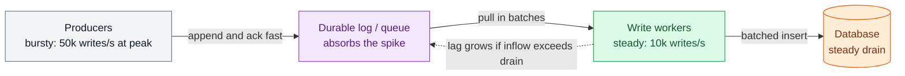

# Scaling Writes

> **Prerequisites:** [Sharding & Consistent Hashing](/synapse/system-design-from-first-principles/distributed-data/sharding-and-consistent-hashing), [Queues & Brokers](/synapse/system-design-from-first-principles/building-blocks/queues-and-brokers) | **You'll be able to:** decide whether to *spread* or *defer* a write bottleneck, diagnose and relieve a hot shard, and recognize the writes that genuinely cannot be parallelized.

## The problem (why this exists)

Scaling reads is, at bottom, a copying problem. A read touches data that already exists and does not change it, so you can make more copies — read replicas, caches, CDN edges — and point readers at whichever copy is nearest or least busy. Copies are cheap and they compose: ten replicas serve roughly ten times the read traffic. If a piece of data gets hot, you copy it more.

Writes break every part of that story. A write *changes* state, so you cannot satisfy it from a copy — every copy of the affected data has to end up reflecting the change, or you have introduced an inconsistency. Making more copies makes writes *harder*, not easier: now the write has to reach all of them. And a single logical record lives in exactly one authoritative place, so all writes to that record funnel through one machine's disk, CPU, and network card. When the arrival rate of writes to that machine exceeds what it can durably absorb, you are stuck. You cannot copy your way out.

This is why interviewers reach for write scaling to separate strong candidates from the rest. "It works for a thousand users — now how does it handle a hundred million?" is almost always a write question in disguise. The read side you can usually cache; the write side forces genuine architecture. As DDIA puts it, sharding exists precisely for the case where "there is so much data or such high write throughput that a single node cannot handle it" [DDIA2 p. 251] — and it notes that if *only* read throughput is the problem, you don't need any of this; read replicas suffice [DDIA2 p. 253].

## Intuition first

There are only two fundamental moves for a write you cannot serve on one machine, and everything in this lesson is a variation on one of them.

**Spread the writes.** If one disk can absorb 10,000 writes per second and you need 100,000, put the data on ten machines and send each write to whichever machine owns that record. Ten machines, ten times the write capacity — *if* the writes divide evenly. This is sharding, and its entire success or failure rides on whether the load actually splits evenly or piles onto one unlucky machine.

**Defer the writes.** If the write does not have to hit durable storage *right now*, park it somewhere cheap and fast — a queue, an in-memory log — acknowledge the client, and apply it to the real database later, at a rate the database can sustain. This turns a spiky, unpredictable arrival rate into a smooth, controllable drain rate. You are not doing less work; you are doing it on your own schedule.

Everything else is refinement. Batching is deferral plus *combining* — hold writes briefly and merge many into one. Write-optimized storage engines (LSM trees) are batching baked into the database itself. Relaxing a durability or consistency knob — asynchronous replication, a write-behind cache — is deferral applied to the *guarantee* rather than the write.

Here is the through-line to hold onto: **you scale writes by spreading them out or deferring them — and each move quietly trades away a guarantee.** Spreading trades away cheap cross-record transactions (data that used to live together now lives apart). Deferring trades away durability or read-your-writes freshness (the client hears "OK" before the write is safely stored). A senior answer does not just name the technique; it names the guarantee it just spent.

<div style="border-left:4px solid #15448e;background:rgba(21,68,142,0.08);padding:0.6rem 1rem;border-radius:0 0.5rem 0.5rem 0;margin:1.25rem 0">

**Definitions.** A **shard** (a.k.a. partition) is a subset of the data; each record belongs to exactly one shard [DDIA2 p. 251]. A **hot shard** is a shard carrying disproportionately high load; a **hot key** is a single key with high load — the celebrity in a social network [DDIA2 p. 256].

</div>

## How it works

Before spreading or deferring anything, exhaust the cheap wins. Confirm you are actually disk-, CPU-, or network-bound with a quick back-of-envelope estimate — modern instances with 100+ cores and NVMe disks go much further than most candidates assume. Then check whether your *storage engine* fits the workload: a log-structured store like Cassandra writes sequentially to an append-only commit log instead of updating pages in place, and can absorb 10,000+ writes/second on modest hardware versus roughly 1,000 for a comparable B-tree relational database doing the same work. That gap is the whole reason [storage engines](/synapse/system-design-from-first-principles/data-foundations/storage-engines) matter here: LSM trees turn many small random writes into a few large sequential ones — batching, built in. Only once single-machine tuning is exhausted do you reach for the two structural moves.

### Spreading: shard by a key that keeps the load flat

Sharding maps each record to a shard via its **partition key**. The mechanism is simple; the design is entirely in the key. The goal is that N nodes carry N times the data and throughput of one node [DDIA2 p. 255], and that only happens if writes distribute *evenly*. The one-line test is **flat is good**: choose a key that minimizes the variance in writes-per-shard.

Hashing a high-cardinality identifier — `hash(userId)`, `hash(postId)` — is the reliable way to get flat, because a good hash turns even skewed inputs into a near-uniform spread across the hash space [DDIA2 p. 258]. The classic failure is picking a *low-cardinality* or *skewed* attribute: shard by country and China's shard melts while New Zealand's idles. Same lesson, formally: skew is an unfair split where some shards hold more load than others [DDIA2 pp. 255–256].

A subtlety candidates miss: don't naively map keys with `hash(key) % N` over the node count, because when N changes almost every key has to move [DDIA2 pp. 258–259]. Real systems use a **fixed large shard count** (many shards per node, move whole shards on rebalance) or **consistent hashing**, which keeps keys-per-shard roughly even while moving as few keys as possible when the node count changes [DDIA2 p. 263]. This is the machinery behind the [sharding lesson](/synapse/system-design-from-first-principles/distributed-data/sharding-and-consistent-hashing); here it matters because a bad rebalancing scheme turns "add a shard" into a cluster-wide data stampede.

But sharding evenly by key does not guarantee even *load*. Consistent hashing spreads *keys* uniformly, not the traffic hitting them [DDIA2 p. 263]. One key — a celebrity's post absorbing millions of likes — can overload its shard while every other shard idles [DDIA2 p. 263]. Sharding cannot fix this, because a single key lives on a single shard by definition. This is the hot-key problem, and it is where the diagram below starts.

```d2
direction: right
classes: {
  client: {style: {fill: "#f3f4f6"; stroke: "#6b7280"}}
  edge:   {style: {fill: "#dbeafe"; stroke: "#2563eb"}}
  data:   {style: {fill: "#ffedd5"; stroke: "#ea580c"}}
}
writers: "Writers hash the partition key" {class: client}
router: "Router and shard map" {class: edge}
writers -> router: "write key value"
shard0: "Shard 0\nnormal load" {class: data}
shard1: "Shard 1\ncelebrity key\nHOT" {class: data}
shard2: "Shard 2\nnormal load" {class: data}
shard3: "Shard 3\nnormal load" {class: data}
router -> shard0
router -> shard1: "every write to the\ncelebrity key lands here"
router -> shard2
router -> shard3
```

The fix is **key salting**: append a small random suffix to the hot key so its writes fan out across many derived keys that land on different shards. Two random digits split one key's writes across 100 derived keys [DDIA2 p. 264]; in interview terms, a viral tweet taking 100,000 likes/second becomes 100 sub-keys of ~1,000 likes/second each. The cost is paid on reads: to get the true count you must read all the sub-keys and sum them, so salting relieves *write* load but multiplies *read* work [DDIA2 p. 264]. You therefore salt only the few keys that are actually hot, and you need bookkeeping so readers know which keys are split.

```d2
direction: right
classes: {
  client: {style: {fill: "#f3f4f6"; stroke: "#6b7280"}}
  edge:   {style: {fill: "#dbeafe"; stroke: "#2563eb"}}
  data:   {style: {fill: "#ffedd5"; stroke: "#ea580c"}}
}
writers: "Writers salt the hot key\ncelebrity-00 .. celebrity-03" {class: client}
router: "Router and shard map" {class: edge}
writers -> router: "write celebrity-rand value"
shard0: "Shard 0\ncelebrity-00" {class: data}
shard1: "Shard 1\ncelebrity-01" {class: data}
shard2: "Shard 2\ncelebrity-02" {class: data}
shard3: "Shard 3\ncelebrity-03" {class: data}
router -> shard0
router -> shard1
router -> shard2
router -> shard3
```

Because salting only helps counters and aggregates (things you can sum back together), it works for likes, views, and balances but not for data that must stay a single atomic record. Some cloud databases automate the whole detect-and-split loop — Amazon calls it **heat management** or **adaptive capacity** [DDIA2 p. 264].

### Deferring: absorb the burst, drain at a steady rate

Real write traffic is bursty. If you must handle 4× your normal volume at peak, provisioning for peak means running at 25% utilization the rest of the time — usually unaffordable. Autoscaling a stateful database mid-spike is slow and often means reduced throughput exactly when you need more. So instead of scaling the database to the burst, you put a buffer in front of it: a durable [queue or log](/synapse/system-design-from-first-principles/building-blocks/queues-and-brokers). Producers append and get a fast acknowledgement; workers pull from the queue and apply writes to the database at whatever steady rate it can sustain.



The queue buys **burst absorption**, and it does so by spending a guarantee: the client is told "recorded" when the write is in the queue, not when it is durably in the database. That is fine for many systems and unacceptable for some — you have made the write asynchronous, so clients that need to read their own write immediately now need a callback or a poll to learn it landed. And a queue only smooths *temporary* bursts. If the steady-state inflow exceeds the drain rate, the backlog grows without bound and every write's effective latency climbs — the dashed edge in the diagram. A queue in front of a database that simply cannot keep up is not a solution; it is a slow-motion outage.

When even deferral is not enough, **shed load**: drop the least valuable writes rather than let the whole system topple. This sounds like cheating and is in fact a precision tool. If Uber or Strava clients report location every few seconds, dropping one update costs almost nothing — a fresher one is seconds behind it. Shedding turns a hard failure (everything fails) into a graceful degradation (some data thins out).

The last refinement is **batching** — deferral plus combining. A "like batcher" reads a minute's worth of like events, tallies the per-post deltas, and writes one update per post instead of one per like; 100 likes in a window collapse to a single database write. This amortizes per-write overhead (network round trips, transaction setup, index maintenance) across many logical writes. It is the same principle an LSM engine applies internally, just moved up into your application. At the extreme, high-volume analytics uses **hierarchical aggregation**: write processors fan writes *in* (aggregating by key over a window) and broadcast nodes fan updates *out*, turning an all-to-all O(N×M) problem into O(N+M) — the mechanism behind live-comment counters at millions of viewers.

### The hard case: writes that cannot be spread

Spreading and deferring both assume writes are *independent* — that it does not matter which order they apply in or which machine handles them. Some writes are not. A unique username must be globally unique; an account balance must never go negative; an event log may need a strict total order. You cannot salt a uniqueness check across 100 sub-keys — the whole point is that all candidates must be compared against one authority. And a write that must update related records on several shards at once needs a **distributed transaction** to stay consistent, which is much slower than a single-node transaction and can become its own bottleneck [DDIA2 p. 253].

The senior move is not to coordinate harder — it is to *make the invariant fit inside one shard*. Ordering within a single shard is free: one leader owns the shard and serializes its writes. So choose the partition key such that everything an invariant touches lives on the same shard. Shard chat messages by conversation ID and message ordering within a conversation is automatic. Shard a ledger by account ID and single-account balance checks stay single-shard. The invariant that spans shards — a transfer between two accounts on different shards — is the one that genuinely costs a distributed transaction, and a good design pushes as few operations as possible into that category. As DDIA notes, every shard operating independently "is what allows a sharded database to scale to multiple machines" [DDIA2 p. 272]; the writes that refuse to be independent are exactly the ones that resist scaling. Beyond that boundary lies [CQRS and the outbox/CDC family](/synapse/system-design-from-first-principles/patterns/event-driven-cqrs-outbox-cdc), which splits the write model from the read model so each can scale on its own terms.

## Trade-offs

| Move | Gives you | Costs you | Use when |
| --- | --- | --- | --- |
| Shard by hashed key | Linear write scale-out; independent shards | Cross-shard transactions get expensive; range scans scatter | Write volume exceeds one node and records are mostly independent |
| Salt a hot key | Relieves a single overloaded key/shard | Reads must fan out and recombine; only works for aggregatable data | One key dominates load despite a good partition key |
| Queue + async apply | Burst absorption; smooth database load | Loses read-your-writes; unbounded backlog if steady-state exceeds drain | Bursts are short-lived and writes tolerate delay |
| Load shedding | Survival under overload | Dropped/less-fresh data | Writes are frequent, replaceable, and low individual value |
| Batching / aggregation | Amortizes per-write overhead 5–100× | Added latency; possible loss of in-flight batch on crash | High volume of small, combinable writes |
| Write-optimized store (LSM) | High sequential write throughput | Slower, multi-file reads | Write-heavy workload where read latency is negotiable |

The row that unifies the table: every technique **reduces throughput per component** — spreading divides it across shards, deferral and batching flatten it over time. And every row spends a guarantee in the "costs you" column. That column is the interview.

## Numbers that matter

Anchor these against the [estimation reference](/synapse/system-design-from-first-principles/foundations/estimation-and-numbers):

- **~1,000 writes/s** for a general-purpose relational DB doing in-place updates, vs. **10,000+ writes/s** for a log-structured store (Cassandra) on comparable hardware — the write-optimization gap in one comparison.
- **4× peak → 25% baseline utilization.** Provisioning for a 4× burst means paying for idle capacity 75% of the time — the economic case for queues over over-provisioning.
- **100,000 likes/s → 100 sub-keys × ~1,000/s** each: the arithmetic of salting a viral hot key down to per-shard capacity.
- **Batching 100 → 1:** a one-minute like window collapses 100 writes into a single database write — but only if posts actually receive many likes per window; batch a post that gets one like an hour and you save nothing.

`Rule of thumb, not from source:` treat ~10k writes/s per commodity node as the order-of-magnitude line where single-node tuning gives way to sharding — real numbers vary widely by engine, row size, and durability settings, so always redo the estimate for the specific design.

## In production

**Cassandra and DynamoDB** are the canonical write-scaled stores. Both hash the partition key to place data, both use log-structured engines to absorb writes sequentially, and DynamoDB automates hot-shard relief through adaptive capacity, adding or removing shards to track load swings "within a matter of minutes" [DDIA2 pp. 264–265]. That automation is double-edged: DDIA warns that automatic rebalancing combined with automatic failure detection can trigger a **cascading failure** — an overloaded node is wrongly declared dead, its load shifts onto already-strained peers, which then also look dead [DDIA2 p. 265]. This is why serious operators keep a human in the loop for rebalancing and pre-split shards ahead of known surges like a product launch or ticket on-sale [DDIA2 pp. 257, 265].

**Kafka** is the write-absorption backbone for high-volume ingestion: producers append to a partitioned, durable log at very high throughput, and consumers drain it at their own pace — the queue pattern above, productionized, and the substrate for [stream processing](/synapse/system-design-from-first-principles/building-blocks/stream-processing) and CDC pipelines. **Redis** illustrates the durability knob directly: its default flushes writes to disk every 100ms, so a batch of 1,000 writes hits disk once rather than 1,000 times — faster, at the cost of up to 100ms of writes lost on a crash. That is the durability-for-throughput trade in a single config line, and it is the same trade [asynchronous replication](/synapse/system-design-from-first-principles/distributed-data/replication) makes at the cluster level: acknowledge the write before the followers have it, and gain throughput while risking a small window of loss on failover.

**Resharding under live traffic** is the operational nightmare. Splitting a shard means rewriting all its data into new files, and a shard hot enough to need splitting is often already overloaded, so the split makes things temporarily worse [DDIA2 p. 258]. Some systems cannot reshard while serving writes at all, which turns "add capacity" into "schedule downtime" [DDIA2 p. 260]. Production teams migrate gradually with dual writes — write to both the old and new shard, read with preference for the new one, then cut over — precisely to avoid that downtime.

## Pitfalls & interview traps

<div style="border-left:4px solid #da5233;background:rgba(218,82,51,0.08);padding:0.6rem 1rem;border-radius:0 0.5rem 0.5rem 0;margin:1.25rem 0">

⚠️ **Sharding does not relieve a single hot key, and a queue does not fix a slow database.** A key lives on one shard by definition, so no amount of resharding spreads one celebrity's writes — you need salting or a dedicated split. And a queue only absorbs *temporary* bursts; put one in front of a database that cannot handle the steady-state load and you have built an unbounded backlog whose write latency grows without limit. Also remember async absorption *defers durability*: the client hears "OK" before the write is safe, so anything that needs read-your-writes must add a callback.

</div>

The traps interviewers spring, in rough order of frequency:

- **Optimizing a bottleneck that isn't there.** The most common mistake is applying write-scaling machinery when a quick estimate shows one node handles the load fine. Always do the arithmetic before you shard.
- **Naming the technique but not the guarantee.** "We'll add a queue" is a junior answer. "We'll add a queue, which makes writes asynchronous, so profile edits need a callback to confirm and location pings can be shed instead" is a senior one.
- **"Add a shard" as if it's free.** The follow-up is always *how do you rebalance without moving all the data and without downtime* — the answer is consistent hashing / fixed shard count, and dual-write migration, not `hash % N` [DDIA2 pp. 259, 263].
- **Salting write-only data and forgetting the read cost.** Salting multiplies read work; the interviewer will ask how you read the true value back. Answer: readers fan out across all sub-keys and sum, which is why you only salt aggregatable, genuinely-hot keys [DDIA2 p. 264].
- **Trying to spread a write that can't be spread.** When the write enforces uniqueness or a total order, the right move is to make the invariant shard-local, not to coordinate across shards. If it genuinely spans shards, say "distributed transaction" and acknowledge the cost [DDIA2 p. 253].

## Check yourself

```quiz
{"prompt": "You shard a social graph by hash(userId) and it distributes users perfectly evenly. A celebrity with 50M followers starts posting, and one shard's write load spikes while the others stay idle. What went wrong?", "options": ["The hash function is broken and needs re-seeding", "Even key distribution does not guarantee even load — one hot key overloads its single shard", "You should switch from hash sharding to key-range sharding", "The shard needs a bigger disk"], "answer": "Even key distribution does not guarantee even load — one hot key overloads its single shard"}
```

```quiz
{"prompt": "Your write path is: producer -> Kafka queue -> workers -> database. Steady-state incoming write rate is 30k/s; the workers can drain to the database at 20k/s. What happens?", "options": ["The queue absorbs it indefinitely; this is exactly what queues are for", "The backlog grows without bound and effective write latency climbs until something breaks", "Kafka automatically speeds up the database", "Writes are silently dropped to keep the queue small"], "answer": "The backlog grows without bound and effective write latency climbs until something breaks"}
```

```quiz
{"prompt": "You need to relieve a hot key holding a like counter taking 100k writes/s. Which technique fits, and what does it cost?", "options": ["Read replicas — they cost extra storage", "Key salting — cheap to read, expensive to write", "Key salting — splits writes across sub-keys, but reads must now fan out and sum them", "A distributed transaction across all shards — it costs latency"], "answer": "Key salting — splits writes across sub-keys, but reads must now fan out and sum them"}
```

```quiz
{"prompt": "Which write genuinely resists both sharding and queueing, forcing coordination?", "options": ["Recording a page-view impression", "Appending a like to a viral post", "Reserving a globally-unique username at signup", "Storing a user's latest GPS location"], "answer": "Reserving a globally-unique username at signup"}
```

<details>
<summary>Why is scaling writes fundamentally harder than scaling reads?</summary>

A read does not change state, so you can serve it from any of many copies — replicas, caches, CDN edges — and copies compose linearly. A write changes state, so it cannot be served from a copy; every copy must eventually reflect it, and the authoritative record for any key lives on exactly one machine. Adding copies makes writes *harder* (more places to update), not easier. So you cannot copy your way to write scale — you must either spread writes across shards or defer them in time.
</details>

<details>
<summary>You've decided to absorb a write burst with a queue. What must you check about your requirements before this is safe?</summary>

Two things. First, the burst must be *temporary* — the steady-state inflow must be below the rate at which workers can drain to the database, or the backlog grows without bound. A queue smooths spikes; it does not add capacity. Second, the system must tolerate the write becoming *asynchronous*: the client is acknowledged when the write hits the queue, not the database, so any flow that needs to immediately read its own write needs a callback or poll, and you must decide what durability you promise if the queue's contents are lost before they're applied.
</details>

<details>
<summary>When is making the invariant shard-local not possible, and what do you do then?</summary>

It's impossible when the invariant inherently spans records that can't all share a partition key — a money transfer between two accounts that hash to different shards, or a uniqueness constraint over a whole namespace. Then you pay for coordination: a distributed transaction to update the shards atomically (slower, a potential bottleneck), or a design that funnels those specific operations through a single serializing authority. The goal is to keep that expensive category as small as possible — most operations shard-local and fast, only the genuinely cross-shard ones coordinated.
</details>

## PoC — Proof of concepts

Writes scale by partitioning — here is how three systems make that automatic:

- [Vitess](https://github.com/vitessio/vitess) — MySQL sharded horizontally with online resharding;
  the write-scaling story behind YouTube and Slack.
- [Citus](https://github.com/citusdata/citus) — distributed tables on PostgreSQL, so a single logical
  table absorbs writes across many nodes.
- [CockroachDB](https://github.com/cockroachdb/cockroach) — distributed SQL that shards and rebalances
  ranges for you (Raft per range); write scaling without hand-managing shards.

## Sources

DDIA2 ch. 7 pp. 251–272 (sharding, skew/hot shards, hot keys pp. 255–256, hash vs. consistent hashing pp. 258–263, key salting & heat management p. 264, rebalancing & cascading failure pp. 257–265, cross-shard transactions pp. 253, 272) · cross-refs: [storage-engines](/synapse/system-design-from-first-principles/data-foundations/storage-engines), [replication](/synapse/system-design-from-first-principles/distributed-data/replication), [event-driven-cqrs-outbox-cdc](/synapse/system-design-from-first-principles/patterns/event-driven-cqrs-outbox-cdc)
