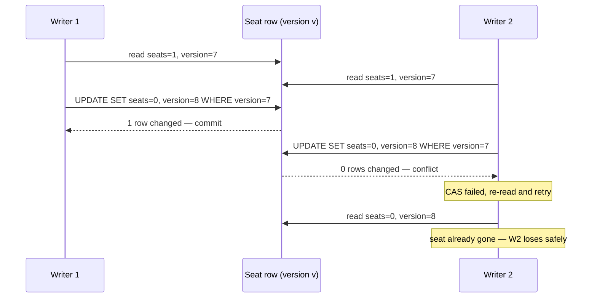
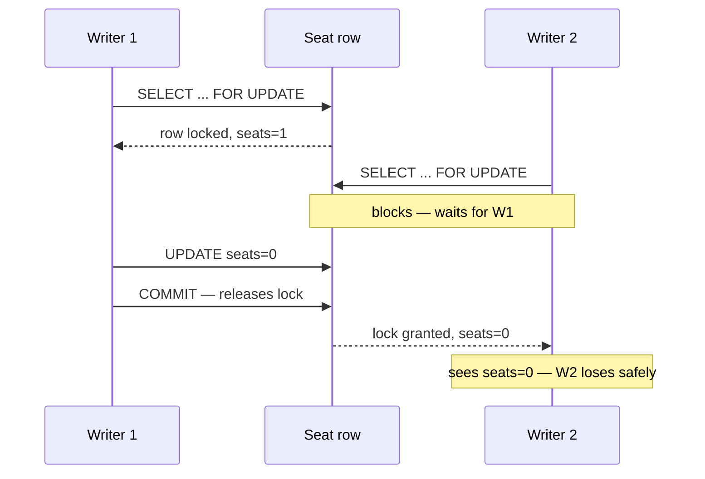
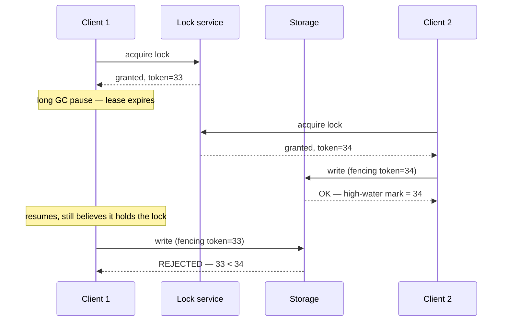

# Dealing with Contention

> **Prerequisites:** [Transactions & Isolation](/synapse/system-design-from-first-principles/distributed-data/transactions-and-isolation), [Faults, Clocks & Time](/synapse/system-design-from-first-principles/distributed-data/faults-clocks-and-time) | **You'll be able to:** choose optimistic vs. pessimistic vs. serialize by conflict rate and cost-of-mistake, and demand a fencing token for any distributed lock.

## The problem (why this exists)

There is one aisle seat left for Friday's show. At 7:00:00.000 pm, four hundred people are staring at it, and two of them tap **Buy** in the same tenth of a second. Both of their requests read the database, both see `seats_available = 1`, both conclude "yes, there's a seat," and both write `seats_available = 0` and insert a ticket. The counter ends at 0 — which looks correct — but two tickets exist for one seat. Someone is going to fly across the country and be turned away at the door.

This is the **lost update** problem, and it is the beating heart of a whole class of system-design questions. It shows up wherever many actors compete for the same scarce thing: the last item in inventory, a unique username, a bank balance that must not go negative, a global counter, a single ride offered to a single driver. The naive read-modify-write cycle — *read the value, decide based on it, write a new value* — is unsafe the instant two of them interleave, because the second writer's decision was based on a fact (the seat is free) that stopped being true the moment the first writer committed [DDIA2 p. 299].

The trap is that the code looks obviously correct. `if (seatsAvailable > 0) { book(); }` reads like airtight logic. It is airtight — for one actor at a time. Contention is the study of what happens when that assumption breaks, and of the surprisingly small toolkit that makes "when two people grab the last item, someone must lose *safely*" a guarantee instead of a hope.

## Intuition first

Strip away the jargon and there are only three things you can ever do about two actors reaching for one resource.

**Detect and retry.** Let both actors proceed as if they're alone, but have each one check, at the moment it writes, whether the world still matches what it assumed. If it does, commit. If someone got there first, the loser notices the mismatch, throws its work away, and tries again from the fresh state. This is **optimistic** concurrency control — optimistic because you bet conflicts are rare and only pay a cost when your bet is wrong. It's the CAS (compare-and-set) idea you met with lost updates in [Transactions & Isolation](/synapse/system-design-from-first-principles/distributed-data/transactions-and-isolation).

**Block.** Make the actors take turns. Before anyone touches the resource, they must grab a lock; whoever gets it goes first, and everyone else waits in line until it's released. No one ever operates on stale data because no one can read-and-write concurrently in the first place. This is **pessimistic** concurrency control — pessimistic because you assume a conflict is coming and pay the coordination cost up front, every time, even when you're alone.

**Remove the concurrency.** Change the shape of the problem so the contention can't happen. Push every competing operation through a single point that handles them one at a time (a queue, a single-writer thread), or split the one hot resource into many cool ones so the crowd spreads out (partition the counter). If there's only ever one writer, or if no two writers ever touch the same shard, there's nothing to coordinate.

<div style="border-left:4px solid #195045;background:rgba(25,80,69,0.08);padding:0.6rem 1rem;border-radius:0 0.5rem 0.5rem 0;margin:1.25rem 0">

💡 **The whole lesson in one sentence.** You either **detect-and-retry** (optimistic), **block** (pessimistic), or **remove the concurrency** (serialize / partition) — and you pick between them by two numbers: how often conflicts actually happen, and how expensive a single mistake is.

</div>

Everything below is just these three ideas made precise, plus the special hazards that appear once the resource and the actors live on different machines.

## How it works

### Optimistic concurrency control (compare-and-set)

The mechanism is a version check. You add a `version` column (or use a timestamp, or the value itself) to the row. An actor reads the row *and its version*, does its thinking, then writes with a conditional: `UPDATE seats SET available = 0, version = 8 WHERE id = 42 AND version = 7`. The database reports how many rows it changed. If it changed one, you won — the version was still 7, so nobody slipped in between your read and your write. If it changed *zero*, someone else committed first and bumped the version to 8; your `WHERE` matched nothing. You didn't corrupt anything — you simply failed cleanly, and now you re-read the fresh row and decide again.



This is exactly the CPU's compare-and-swap instruction lifted to the database [DDIA2 p. 302]. Nobody ever holds a lock; readers never block writers. The cost is paid only by the loser, and only when there's an actual conflict — which is why optimistic control is a superb fit when conflicts are *rare* and terrible when they're common (every retry is wasted work, and under heavy contention the retries pile onto an already-saturated system, a failure mode DDIA calls out explicitly for optimistic schemes [DDIA2 p. 318]).

Databases give you this for free at several levels. `PostgreSQL`'s repeatable-read isolation and `SQL Server`'s snapshot isolation *automatically detect* lost updates and abort the loser, so you don't even have to write the `WHERE version =` clause — though note MySQL/InnoDB repeatable read does *not* detect them, so there you must be explicit [DDIA2 p. 301]. `DynamoDB` conditional writes (`ConditionExpression`) are CAS as a first-class API.

### Pessimistic locking (SELECT … FOR UPDATE)

When you'd rather not gamble, you lock. `SELECT ... FOR UPDATE` tells the database "I'm about to modify these rows — give me an exclusive lock on them now." Any other transaction that tries to `FOR UPDATE` the same rows blocks until you commit or roll back and release. The second actor doesn't read stale data and doesn't retry; it simply waits its turn and then sees the world the first actor left behind.



This is what two-phase locking does under the hood to give you serializable isolation: a writer needs exclusive access, so any transaction that might race waits [DDIA2 p. 313–314]. It is unconditionally safe for the lost-update case, and it's the tool you reach for when the decision logic *can't* be expressed as a single conditional write — a game-move legality check, a multi-row invariant. The price is throughput: locks serialize access to the contended rows, so your effective concurrency on that resource drops to one-at-a-time, tail latencies get spiky under load, and you invite **deadlocks** (A locks row 1 then waits on row 2 while B locks row 2 then waits on row 1). Databases detect deadlocks and abort one victim, which you must retry — so even pessimistic locking hands you a retry loop at the edges [DDIA2 p. 300, 315].

### Atomic single-operation primitives

Often you don't need a general read-modify-write at all — you need one specific mutation done atomically, and the store already knows how to do it in a single indivisible step. `UPDATE counters SET value = value + 1` never has a read-modify-write cycle for the application to race on; the database does the read, the add, and the write as one locked operation on the row [DDIA2 p. 299–300]. Redis `INCR`, DynamoDB atomic counters, and conditional writes are all instances of the same move: **push the contention down into the store**, where a single node with a single lock resolves it far more cheaply than an application-level transaction could. When your operation is expressible this way, it is almost always the best answer — it removes the race by removing the gap between read and write.

### Distributed locks, TTLs, and why you need a fencing token

Everything above assumed one database with one lock manager arbitrating. The moment the resource being coordinated lives *outside* a single transactional store — you want mutual exclusion across services, or one worker per file, or a single leader — you reach for a **distributed lock**: a key in Redis, or a lease in ZooKeeper/etcd, that says "I hold this." Because the holder might crash and never release, every distributed lock carries a **TTL** (a lease): if you don't renew it in time, it expires and someone else can take it.

And here is the trap that separates a junior answer from a senior one. A lease can expire *while its holder is still running but frozen* — a long GC pause, a VM suspend, a scheduler stall of tens of seconds is entirely realistic [DDIA2 p. 367]. The holder doesn't know time passed. It wakes up, still believing it owns the lock, and does its write — but another client already acquired the now-expired lease and did *its* write. Two "owners," one resource: **split brain**, and corrupted data. DDIA's Figure 9-4 is a real HBase bug of exactly this shape [DDIA2 p. 373–374]. Worse, you don't even need a pause: a write request can sit *delayed in the network* past the lease timeout and land after someone else took over [DDIA2 p. 374].

Shutting the zombie down doesn't save you — by the time you detect it, the damage is done, and it can't stop a request already in flight [DDIA2 p. 374–375]. The robust fix is a **fencing token**: the lock service returns a number that increases on every grant, and every write to the protected storage must carry the token the writer holds. The storage remembers the highest token it has accepted and **rejects any write carrying a lower one** [DDIA2 p. 375].



The zombie's stale token (33) is now permanently below the high-water mark (34), so its write is refused no matter how confused it is. This is the same idea as optimistic CAS — reject a write premised on an outdated view — except a fencing rejection is *permanent* rather than retryable, because the token can never come back [DDIA2 p. 375–376]. Real systems already hand you these tokens: ZooKeeper's `zxid`, etcd's revision number, Chubby's sequencers, Kafka's epoch numbers, and the term/ballot numbers inside Raft and Paxos [DDIA2 p. 375].

### Serialize through a single writer, or partition the resource

The last family removes concurrency instead of coordinating it. **Serialize** by funneling every competing operation through one point that processes them in order — a queue with a single consumer, or the actual serial-execution approach where a database runs transactions one at a time on a single thread and gets serializability *by definition*, with no lock manager at all [DDIA2 p. 309]. There's no race because there's no concurrency; the cost is that your throughput is capped by that one processor and one slow operation stalls everyone behind it.

**Partition** by splitting the one hot resource into many. A single global "likes" counter that 100,000 writers hammer becomes 100 sub-counters, each taking ~1,000 writes/s, summed on read — the crowd that was fighting over one row now spreads across a hundred, and the contention on any single one drops by 100×. This "escrow" or hot-key-split technique is how you scale a contended counter (see [Scaling Writes](/synapse/system-design-from-first-principles/patterns/scaling-writes) for the full treatment), and it works precisely because addition is commutative — the order the sub-counters are incremented in doesn't change the sum [DDIA2 p. 302].

## Trade-offs

The three core strategies line up against the two numbers that decide everything — how often conflicts happen, and how much a mistake costs.

| Strategy | Best when conflict rate is… | Throughput | Safety | Use when |
| --- | --- | --- | --- | --- |
| **Optimistic (CAS / version check)** | **Low** — most writes don't collide | High — no locks, no waiting; losers pay only on conflict | Safe if you actually check on write; degrades to retry storms under high conflict | Conflicts are rare and retrying is cheap: profile edits, low-contention inventory, most CRUD |
| **Pessimistic (FOR UPDATE / locks)** | **High** — collisions are the norm | Lower — serializes the contended rows; risks deadlock & tail-latency spikes | Unconditionally safe; no wasted work under contention | Conflicts are frequent, or the decision can't be a single conditional write; a mistake is costly (money, seats) |
| **Serialize / partition** | **Any** — you engineered it away | Serialize: capped at one processor. Partition: scales with shard count | Safe by construction — no two writers touch the same thing | The resource is a bottleneck by nature (hot counter → partition) or correctness demands one-at-a-time (single-writer ledger) |

The through-line: **optimistic and pessimistic are mirror images across the conflict rate.** Optimistic wins with spare capacity and low contention; pessimistic wins under high contention by not wasting work on doomed retries — which is exactly DDIA's optimistic-vs-pessimistic verdict for SSI versus 2PL [DDIA2 p. 318]. When neither is comfortable, you change the problem: serialize if correctness demands strict order, partition if the resource is simply too hot for one row.

## Numbers that matter

- **Shrink the contention window instead of coordinating harder.** Ticketmaster doesn't hold a lock for the ~5 minutes a user spends entering card details; it *reserves* the seat in a millisecond-scale write, then does the slow purchase flow against that reservation. Contention that would have lasted minutes now lasts milliseconds — the single highest-leverage move in the whole toolkit.
- **Uber's driver-offer hold is ~10 seconds** before the ride is reassigned — a lease TTL tuned to "how long will a driver realistically take to tap accept?"
- **Hot-counter split math:** 100,000 writes/s on one key ÷ 100 sub-keys ≈ 1,000 writes/s per key — back under a single row's comfortable ceiling. See [Estimation & the Numbers](/synapse/system-design-from-first-principles/foundations/estimation-and-numbers).
- **Serial execution is single-core-bound:** one thread running transactions in order tops out at one CPU core's throughput; to go faster you must shard so each shard runs its own serial loop, and cross-shard transactions collapse to *~1,000 writes/s* in VoltDB's measurements [DDIA2 p. 312–313].
- **Realistic pause budget:** stop-the-world GC pauses have historically reached *several minutes*, and network delays *over a minute* occur in real datacenters — which is why "the lease hasn't expired yet" is never a safe assumption without fencing [DDIA2 p. 367, 350].

## In production

Real systems mix these tools rather than picking one. Systems like **Ticketmaster** typically lean on the reserve-then-buy window above, backed by a short-lived lock or status flag on the seat row — pessimistic on the seat for the reservation instant, then optimistic/expiry-based for the checkout window. **Payment systems** lean on idempotency keys and conditional writes so a retried charge (from the network duplication and timeout ambiguity you saw in [Faults, Clocks & Time](/synapse/system-design-from-first-principles/distributed-data/faults-clocks-and-time)) doesn't double-charge — the same detect-a-stale-premise idea, applied to exactly-once (see [Idempotency & Exactly-once](/synapse/system-design-from-first-principles/patterns/idempotency-and-exactly-once)).

The distributed-database world resolves this at the storage layer for you: **NewSQL** systems (Spanner, CockroachDB, TiDB, FoundationDB) implement serializable isolation across shards — CockroachDB and FoundationDB via optimistic SSI, MySQL/InnoDB and SQL Server via pessimistic 2PL — so "how do I coordinate a distributed write?" is often best answered by *choosing a database that already does it* rather than hand-rolling a distributed lock [DDIA2 p. 317, 333]. When you genuinely need a lock outside a transactional store, the production-grade answer is ZooKeeper or etcd, precisely because they hand you a monotonic `zxid`/revision to fence with — a Redis `SETNX` lock without fencing is a liability, not a solution.

The **rate limiter** is the atomic-primitive story end to end: every counted request is an atomic `INCR` (or a Lua script for token-bucket math) executed inside Redis, pushing the contention into the store so no two app servers ever race on the count. See [Design a Rate Limiter](/synapse/system-design-from-first-principles/case-studies/rate-limiter). **Uber**'s driver dispatch is the lease story: offer the ride, hold it with a TTL, reassign if the driver doesn't accept in time — see [Design Uber](/synapse/system-design-from-first-principles/case-studies/uber). And **Ticketmaster** is the reservation-window story — see [Design Ticketmaster](/synapse/system-design-from-first-principles/case-studies/ticketmaster).

## Pitfalls & interview traps

<div style="border-left:4px solid #da5233;background:rgba(218,82,51,0.08);padding:0.6rem 1rem;border-radius:0 0.5rem 0.5rem 0;margin:1.25rem 0">

⚠️ **A Redis lock without a fencing token is not safe — say so before the interviewer asks.** "I'll use a Redis distributed lock" is an incomplete answer. The lease can expire during a GC pause or the holder's write can be delayed in the network, and a second client will already be writing when the zombie wakes up. Without a monotonically increasing fencing token that the *storage* checks and rejects on, you have split brain and data corruption. The correct sentence is: "distributed lock **with a fencing token** that storage enforces." The other side of the same trap: **optimistic concurrency under high contention becomes a retry storm** — every conflict is wasted work, and the retries load an already-saturated system, so above a certain conflict rate you must switch to pessimistic locking or partition the resource.

</div>

Three more that trip people up:

- **"The counter is correct, so we're fine."** The double-booking bug leaves `seats = 0`, which *looks* right. Lost updates hide behind correct-looking aggregate state; the corruption is in the duplicated tickets, not the counter. Reason about the invariant ("one ticket per seat"), not the number.
- **Optimistic detection isn't uniform across databases.** PostgreSQL repeatable read and SQL Server snapshot isolation auto-detect lost updates; **MySQL/InnoDB repeatable read does not** [DDIA2 p. 301]. If you're relying on the database to catch the conflict, know which database, or write the explicit `WHERE version =` check.
- **Write skew slips past everything above.** If two transactions read the *same* rows but write *different* ones — two on-call doctors each checking "someone else is on call" and each going off-call — CAS and per-row locks won't catch it, because no single row is contended. That needs true serializable isolation or `SELECT ... FOR UPDATE` on the *read* set [DDIA2 p. 303–304]. Interviewers love this one because it defeats the reflexive "just add a version column."

## Check yourself

```quiz
{"prompt": "Ten thousand users hammer a single 'like' button per second, and an occasional lost like is tolerable, but you must not fall over. Which approach fits best?", "options": ["Pessimistic SELECT ... FOR UPDATE on the like counter row", "Optimistic version-check with retry on the single counter row", "Partition the counter into many sub-counters and sum on read", "A distributed Redis lock around each increment"], "answer": "Partition the counter into many sub-counters and sum on read"}
```

```quiz
{"prompt": "Conflicts on a resource are rare (well under 1% of writes collide) and retrying a failed write is cheap. Which concurrency-control style is the better default?", "options": ["Pessimistic locking, because it is unconditionally safe", "Optimistic (compare-and-set), because you only pay a cost on the rare conflict", "Serial execution on a single thread", "Two-phase commit across the writers"], "answer": "Optimistic (compare-and-set), because you only pay a cost on the rare conflict"}
```

```quiz
{"prompt": "Why does a distributed lock with a TTL still need a fencing token to be safe?", "options": ["Because TTLs are always set too short in practice", "Because the lock holder can freeze (GC pause) or have its write delayed past the lease, so a second holder writes concurrently — a token lets storage reject the stale writer", "Because Redis is not durable", "Because fencing tokens make the lock faster to acquire"], "answer": "Because the lock holder can freeze (GC pause) or have its write delayed past the lease, so a second holder writes concurrently — a token lets storage reject the stale writer"}
```

```quiz
{"prompt": "Two transactions each read 'how many doctors are on call?' (both see 2), and each takes a DIFFERENT doctor off call. Both commit under snapshot isolation, leaving zero on call. What is this, and what actually prevents it?", "options": ["A lost update; prevented by an atomic increment", "A dirty read; prevented by read-committed isolation", "Write skew; prevented by serializable isolation or SELECT ... FOR UPDATE on the read set", "A deadlock; prevented by lock ordering"], "answer": "Write skew; prevented by serializable isolation or SELECT ... FOR UPDATE on the read set"}
```

<details>
<summary>You propose "use a distributed lock" for one-worker-per-file processing. The interviewer asks: "What happens if a worker pauses for 30 seconds holding the lock?" Walk through the failure and the fix.</summary>

The lease expires while the worker is frozen. A second worker acquires the lock and starts processing the file. The first worker resumes, still believing it holds the lock, and writes its results too — now two workers have written the same output, possibly corrupting it (split brain). The fix is a **fencing token**: the lock service returns a monotonically increasing number on each grant, and the output storage records the highest token it has accepted and rejects any write with a lower one. When the paused worker (token 33) writes after the new worker (token 34) has committed, storage refuses it. STONITH (shooting the zombie) isn't enough on its own — a delayed in-flight write can still land after the takeover, and by detection time the corruption may already exist [DDIA2 p. 373–376].
</details>

<details>
<summary>When would you deliberately choose pessimistic locking over optimistic, even knowing it lowers throughput?</summary>

When the conflict rate is high (so optimistic retries would storm and waste work on an already-loaded system), or when the cost of a single mistake is severe (money, a physical seat) and you want zero chance of a lost update rather than eventual-detect-and-retry, or when the decision logic can't be expressed as a single conditional write (multi-row invariants, external validity checks) so there's no clean value to compare-and-set on. Pessimistic trades throughput for unconditional, up-front safety — the right trade when collisions are the norm rather than the exception [DDIA2 p. 300, 318].
</details>

## PoC — Proof of concepts

The mechanics of pessimistic and optimistic contention control, from the primary sources:

- [PostgreSQL — Explicit Locking](https://www.postgresql.org/docs/current/explicit-locking.html) —
  row locks (`FOR UPDATE`), advisory locks and the deadlock detector; the pessimistic side made
  precise.
- [How to do distributed locking](https://martin.kleppmann.com/2016/02/08/how-to-do-distributed-locking.html)
  — Kleppmann on why a distributed lock needs a *fencing token*, and how naive Redis locks fail; the
  trap this lesson warns about.
- [Redis](https://github.com/redis/redis) — `SET key val NX PX` and `WATCH`/`MULTI` are the building
  blocks of application-level optimistic concurrency; read them alongside the critique above.

## Sources

DDIA2 ch. 8 pp. 299–302 (lost updates, atomic writes, compare-and-set), pp. 303–304 (write skew), pp. 309–318 (serial execution, 2PL, optimistic vs. pessimistic) · DDIA2 ch. 9 pp. 366–376 (leases, process pauses, split brain, fencing tokens) · Cross-links: [Transactions & Isolation](/synapse/system-design-from-first-principles/distributed-data/transactions-and-isolation), [Faults, Clocks & Time](/synapse/system-design-from-first-principles/distributed-data/faults-clocks-and-time), [Scaling Writes](/synapse/system-design-from-first-principles/patterns/scaling-writes), [Idempotency & Exactly-once](/synapse/system-design-from-first-principles/patterns/idempotency-and-exactly-once), [Design Ticketmaster](/synapse/system-design-from-first-principles/case-studies/ticketmaster), [Design Uber](/synapse/system-design-from-first-principles/case-studies/uber), [Design a Rate Limiter](/synapse/system-design-from-first-principles/case-studies/rate-limiter)
