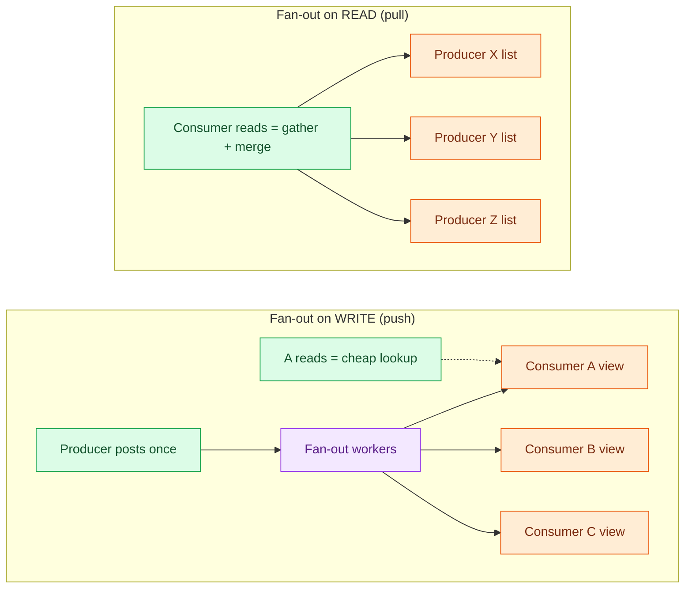
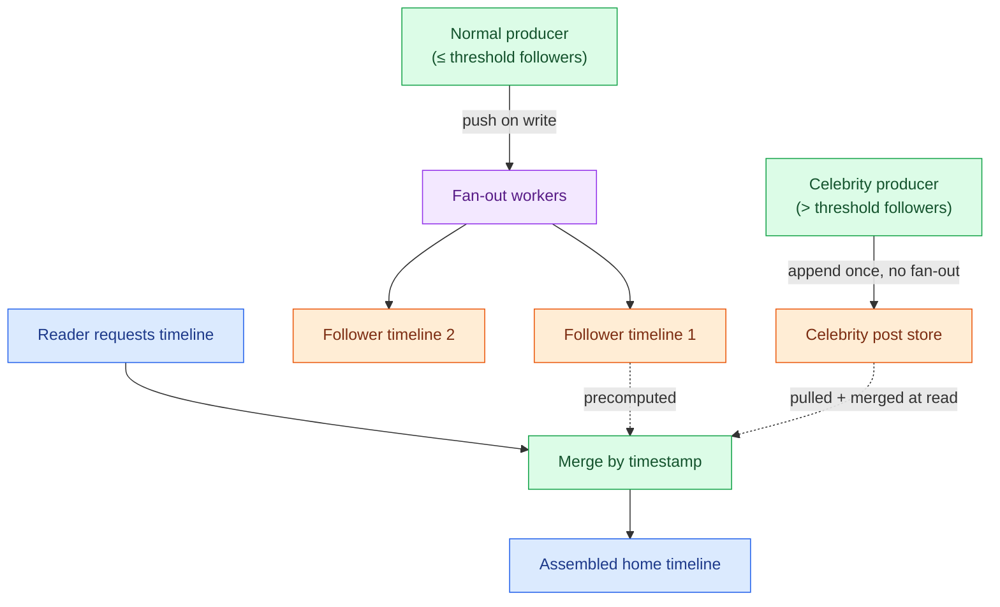

# Fan-out: Push vs Pull

> **Prerequisites:** [Caching](/synapse/system-design-from-first-principles/building-blocks/caching), [Queues & Brokers](/synapse/system-design-from-first-principles/building-blocks/queues-and-brokers) | **You'll be able to:** (1) pick fan-out-on-write, fan-out-on-read, or a hybrid from a read:write ratio and a fan-out factor; (2) justify the celebrity carve-out from write-amplification arithmetic; (3) apply the pattern beyond feeds — to notifications, activity streams, and materialized views.

## The problem (why this exists)

One thing happens. Many people need to know about it.

A user posts a message and 200 followers should see it. A price changes and every open product page should reflect it. An order ships and the buyer's notification center, the seller's dashboard, and the analytics pipeline all need the event. In each case a *single* write has to become visible in *many* independent places. The question this pattern answers is deceptively small: **when do you do the work of spreading that event to all those places — the moment it happens, or the moment someone asks?**

Get the answer wrong and one of two failures shows up. Answer "at read time" for a hugely popular consumer and every page load triggers a massive gather — the read melts. Answer "at write time" for a hugely popular *producer* and one action detonates into millions of writes — the write melts. The whole pattern lives in the tension between those two explosions.

The canonical arena is the social-network home timeline, and it comes with real numbers. DDIA models a service like X (Twitter): 500 million posts per day, about 5,800 posts/second on average, spiking to 150,000/second [DDIA2 p. 34]. The average user follows 200 accounts and has 200 followers, but the range is enormous — most people have a handful of followers, while a celebrity like Barack Obama has over 100 million [DDIA2 p. 34]. A user's **home timeline** is the recent posts from everyone they follow. With 10 million users online, each polling every 5 seconds, that's 2 million timeline reads/second [DDIA2 p. 35]. We are going to decide how to build those timelines, and the decision generalizes far past feeds.

This lesson is about the *data-delivery strategy* — where the fan-out work happens and what it costs. It is **not** about the wire: how the update actually travels from server to a connected client (WebSockets, SSE, long-polling) is the [Real-time delivery](/synapse/system-design-from-first-principles/building-blocks/realtime-delivery) building block. Here we assume the transport exists and ask what to send through it.

## Intuition first

Imagine an office with a mail room. A memo needs to reach 200 people. There are two honest ways to do it.

**Push (fan-out on write).** The moment the memo arrives, the mail room makes 200 copies and drops one into each person's mailbox. Later, when someone checks their mailbox, their memo is already sitting there — reading is instant. The cost was paid up front, once, at delivery time, whether or not the recipient ever opens the box.

**Pull (fan-out on read).** The mail room keeps a single master copy on a shelf. Nobody's mailbox holds anything. When a person wants their memos, they walk to the shelf, look up everyone they care about, and assemble their own stack on the spot. Writing is trivial — one copy on one shelf. Reading is the expensive part, and it's paid every single time someone asks.

That is the entire trade, stated in one breath: **either you prepare everyone's copy in advance, or you build it when they ask.** Push front-loads work onto writes to make reads cheap. Pull keeps writes cheap and pays on every read.

DDIA calls the multiplication factor **fan-out**: how many downstream operations one initial request spawns [DDIA2 p. 35]. Push moves the fan-out to write time (one post → 200 mailbox writes). Pull moves it to read time (one timeline request → gather from 200 shelves). The factor is the same 200; the question is *which side of the ledger* pays it — and how often. You post once but your timeline is read constantly, so paying at write time is usually the better deal. That single asymmetry is why real feeds default to push.

## How it works

**Fan-out on write (push).** When an event occurs, the producing service resolves the set of interested consumers and writes a copy of the event into each consumer's own precomputed view — a per-user timeline cache, a per-user inbox, a materialized list. DDIA describes exactly this: push each new post to the timelines of all online followers, so that a timeline read is a cheap lookup of an already-assembled list rather than an expensive query [DDIA2 p. 35]. Each timeline is **derived data** — a [materialized view](/synapse/system-design-from-first-principles/patterns/event-driven-cqrs-outbox-cdc) that must be updated on every relevant write [DDIA2 p. 36]. The delivery is almost always done asynchronously: the post is accepted, and the fan-out writes are handed to a worker pool through a [queue](/synapse/system-design-from-first-principles/building-blocks/queues-and-brokers) so that a spike in posts becomes a spike in queue depth, not a spike in user-visible latency [DDIA2 p. 36].

**Fan-out on read (pull).** When an event occurs, you do almost nothing — append it to the producer's own list and stop. The work happens when a consumer asks: their read fans out across every producer they follow, gathers the recent items, merges them by timestamp, and returns the assembled view. This is the naive timeline query — join posts, follows, and users, order by time, limit 1000 [DDIA2 p. 34-35]. Cheap writes, but the read is heavy and repeated.

The arithmetic makes the default obvious. Under pull, 2 million timeline reads/second each looking up 200 followed accounts is **400 million lookups/second** [DDIA2 p. 35]. Under push, 5,800 posts/second each fanning out to 200 followers is **just over 1 million timeline writes/second** [DDIA2 p. 36]. Same fan-out factor of 200 on both sides — but pull pays it on the 2M/s read path while push pays it on the 5,800/s write path. Push does roughly 400× less total work here, because reads vastly outnumber writes. That is the whole case for precomputing.

<div style="border-left:4px solid #15448e;background:rgba(21,68,142,0.08);padding:0.6rem 1rem;border-radius:0 0.5rem 0.5rem 0;margin:1.25rem 0">

**The deciding lever is the read:write ratio, weighted by fan-out.** Push wins when reads dominate writes (feeds, timelines — a post read thousands of times). Pull wins when writes dominate reads, or when most produced items are never consumed (a chatty producer with few active followers, an audit log rarely queried). Ask: for one produced event, how many times is the resulting view read before it changes again?

</div>

The diagram below contrasts the two shapes. On write, the event pushes outward into N consumer views. On read, the consumer pulls inward, gathering from N producers.



**The hybrid.** Neither pure strategy survives the celebrity. Push a celebrity's post to 100 million timelines and one write becomes 100 million writes — DDIA notes this "still requires significant infrastructure" and is not something you can just drop [DDIA2 p. 36]. But pull for a normal user's timeline resurrects the 400M-lookups/second problem. The resolution is to mix: **push for the many, pull for the expensive few.** Ordinary producers fan out on write into follower timelines. A small set of hot producers (celebrities) are exempted — their posts are stored once, apart, and each reader *merges* those hot-producer posts into their precomputed timeline at read time [DDIA2 p. 36]. A reader's timeline becomes "my mostly-precomputed list, plus a quick pull of the two or three celebrities I follow, merged by timestamp." The bulk of the work stays precomputed; only the pathological producers are pulled.

The threshold between push and pull is **tunable**. You classify a producer as "hot" (pull) when their follower count — the write-amplification they'd cause on push — crosses some line, say 100k–1M followers (a rule of thumb, not from source; the exact cut is a capacity decision). Everyone below the line is pushed. The line can move as your write budget changes, and a producer can cross it in either direction as they gain or lose followers.



There is a second escape valve for the opposite pathology. DDIA notes that a user who follows tens of thousands of high-volume accounts receives a punishing *write* rate into their timeline — but since they can't possibly read it all, it's acceptable to **drop** some of those timeline writes and show only a sample [DDIA2 p. 36]. Push doesn't have to be complete to be useful.

**Ordering and delivery guarantees.** Because push fan-out is asynchronous and parallel, per-consumer ordering is not free. If two of a producer's posts race through the worker pool, they can land in a follower's timeline out of order. Real systems lean on the item's own timestamp or a sequence number and sort at read time rather than trusting insertion order. Delivery is typically **at-least-once**: a worker can crash after writing to some timelines but before acking, and the retry re-delivers to the ones it already touched. That makes the fan-out write need to be **idempotent** — writing the same post to the same timeline twice must be a no-op (dedupe on post id). This is the same at-least-once-plus-idempotency contract covered in [Idempotency & exactly-once](/synapse/system-design-from-first-principles/patterns/idempotency-and-exactly-once); fan-out is one of its most common homes. DDIA frames the crash-mid-fan-out case directly: if the machine updating timelines dies partway, tolerance requires another to take over "without missing or duplicating posts" — exactly-once semantics [DDIA2 p. 43-44].

## Trade-offs

| Strategy | Write cost | Read cost | Freshness | Use when |
| --- | --- | --- | --- | --- |
| **Push** (fan-out on write) | High — one event × fan-out writes; amplifies with follower count | Very low — read is a single precomputed lookup | Near-real-time for pushed items; bounded by worker lag | Reads ≫ writes; moderate, bounded fan-out; most consumers active |
| **Pull** (fan-out on read) | Very low — append once to producer's list | High — every read gathers + merges from N producers | Always current (built from source on demand) | Writes ≫ reads, or most produced items never read; huge/unbounded fan-out; inactive consumers |
| **Hybrid** (push + celebrity pull) | Bounded — normal producers pushed; hot producers exempt from fan-out | Low — precomputed base + small pull of hot producers, merged | Near-real-time; hot-producer items as fresh as the read | Skewed producer popularity — a few huge accounts among many small ones (the realistic case) |

The hybrid is not a compromise you settle for; it is what production systems actually run, because real producer popularity is heavily skewed and neither pure strategy survives that skew.

## Numbers that matter

Anchor everything to the home-timeline case [DDIA2 p. 34-36]:

- **Workload:** 500M posts/day → 5,800 posts/s average, 150,000/s peak. Average 200 follows / 200 followers per user. 10M concurrent users, polling every 5s → 2M timeline reads/s.
- **Pull cost:** 2M reads/s × 200 followed accounts = **400M lookups/s.** This is the number push exists to avoid.
- **Push cost:** 5,800 posts/s × 200 followers = **~1M timeline writes/s.** Large, but ~400× cheaper than pull's read load — because writes (5,800/s) are far rarer than reads (2M/s).
- **The skew:** average fan-out is 200, but a celebrity's is >100M. One celebrity post under pure push = >100M writes — the single number that forces the hybrid.
- **Read:write as the dial:** the [scaling-reads](/synapse/system-design-from-first-principles/patterns/scaling-reads) lesson notes content apps commonly run 100:1 reads:writes or higher — squarely push territory. Flip that ratio (write-heavy, rarely read) and pull wins; see [scaling-writes](/synapse/system-design-from-first-principles/patterns/scaling-writes).

A back-of-envelope for storage: precomputed timelines cost RAM/disk you didn't pay under pull. If you cap each timeline at ~1,000 entries × ~100 bytes of reference each × hundreds of millions of users, materialization is not free — it is a real capacity line item, and it is why heavy-follow timelines get sampled rather than fully materialized.

## In production

**X / Twitter** is the reference implementation of the hybrid. Its timeline architecture famously pushes ordinary posts into per-user timeline caches on write, while posts from very-high-follower accounts are pulled and merged at read time — the exact carve-out DDIA generalizes [DDIA2 p. 36]. The engineering history here is public: an early pull-only design couldn't keep up, a push-everything design broke on celebrities, and the durable answer was the mix. `[web: DDIA references this as the canonical case; treat specific internal thresholds as illustrative]`

**Instagram and Facebook feeds** follow the same shape and are the [News feed](/synapse/system-design-from-first-principles/case-studies/news-feed) case study in this book — that case study is a full worked design; this lesson is the reusable pattern extracted from it. Read the case study for the end-to-end system; return here for the decision that drives it.

**Beyond feeds, the same pattern appears constantly:**

- **Notifications / activity streams.** "Someone commented on your photo" fans out to interested users. Push into per-user notification inboxes for instant badges; pull-and-merge for accounts followed by millions.
- **Materialized views & CQRS.** Precomputing a read model from a write model *is* fan-out on write — the event updates a derived view so queries stay cheap. See [Event-driven, CQRS, outbox & CDC](/synapse/system-design-from-first-principles/patterns/event-driven-cqrs-outbox-cdc).
- **Chat fan-out.** A group message pushed to each member's device/inbox is fan-out on write; the [WhatsApp](/synapse/system-design-from-first-principles/case-studies/whatsapp) case study wrestles with exactly this for large groups, where naive push to every member is the write explosion.
- **Cache warming.** Precomputing (pushing) a popular result into caches ahead of demand versus computing it on the first request (pull) is the same front-load-vs-on-demand trade in a different costume.

Operationally, the hard parts in production are: keeping the fan-out worker pool from falling behind at peak (queue depth is the alarm, not CPU — see [Long-running tasks](/synapse/system-design-from-first-principles/patterns/long-running-tasks)); reconciling timelines after a worker crash (idempotent, replayable writes); and re-materializing a timeline when someone follows/unfollows (a follow change retroactively alters what should have been pushed). None of these exist under pure pull — they are the price of precomputation, and they are worth it because reads dominate.

## Pitfalls & interview traps

<div style="border-left:4px solid #da5233;background:rgba(218,82,51,0.08);padding:0.6rem 1rem;border-radius:0 0.5rem 0.5rem 0;margin:1.25rem 0">

⚠️ **The two explosions, stated plainly.** Fan-out on write for a *celebrity producer* is a **write explosion** — one action becomes 100M writes and saturates the fan-out tier. Fan-out on read for a *hot consumer* (or a normal user in a pull-only system at scale) is a **read explosion** — every request re-gathers from hundreds of sources and the read tier melts. An interviewer probes both ends. The senior answer is the hybrid plus the tunable threshold, not "just pick push."

</div>

Other traps:

- **Confusing the transport with the strategy.** "I'll use WebSockets" answers *how the bytes reach the client*, not *where the fan-out work happens*. Push vs pull is orthogonal to WebSocket vs SSE vs polling; you choose both. Keep [Real-time delivery](/synapse/system-design-from-first-principles/building-blocks/realtime-delivery) and this pattern in separate boxes.
- **Forgetting the follow-graph mutation.** Push precomputes against *today's* follower set. When someone follows a new account, their timeline should retroactively include recent history — but you already fanned those posts out to whoever followed *then*. New follows usually pull-and-backfill; a pure-push mental model misses this entirely.
- **Assuming push means synchronous.** Push fan-out that blocks the producer's write until all N copies land turns a viral post into a request timeout. Real push is async through a queue — the producer's write returns immediately; delivery drains behind it [DDIA2 p. 36].
- **Ignoring wasted work for inactive consumers.** Push pays the fan-out cost whether or not the recipient ever logs in. For an app where most users are dormant, you've precomputed millions of timelines nobody reads — a real argument for pull, or for pushing only to *active* users (DDIA's "online followers" [DDIA2 p. 35]).
- **Treating the threshold as static.** A rising creator crosses the celebrity line; a faded one should cross back. Hard-coding "celebrity = verified badge" instead of "celebrity = follower count > threshold" mis-classifies and either explodes writes or needlessly pulls.

## Check yourself

```quiz
{"prompt": "A product feed has a 200:1 read-to-write ratio, an average fan-out of ~150 consumers per event, and most consumers are active daily. Which strategy is the natural default?", "options": ["Fan-out on read (pull) — writes are rare so keep them cheap", "Fan-out on write (push) — reads dominate, so precompute each view", "Neither — the fan-out is too small to matter", "Always pull, then add a cache in front of the read"], "answer": "Fan-out on write (push) — reads dominate, so precompute each view"}
```

```quiz
{"prompt": "In a timeline system that pushes on write, an account with 90 million followers posts. Under pure push, what breaks, and what is the standard fix?", "options": ["Reads break; fix by adding read replicas", "One write fans out to 90M timeline writes (write explosion); fix by exempting the account and pulling+merging its posts at read time", "Nothing breaks; push scales linearly with followers", "Storage breaks; fix by deleting old posts"], "answer": "One write fans out to 90M timeline writes (write explosion); fix by exempting the account and pulling+merging its posts at read time"}
```

```quiz
{"prompt": "Fan-out workers deliver at-least-once, so a crashed-and-retried worker may write the same post to a follower's timeline twice. What property must the fan-out write have?", "options": ["Strong consistency across all timelines", "Idempotency — writing the same post id to the same timeline twice is a no-op", "Synchronous delivery to avoid retries", "Exactly-once network delivery from the queue"], "answer": "Idempotency — writing the same post id to the same timeline twice is a no-op"}
```

```quiz
{"prompt": "A user follows 40,000 extremely high-volume accounts. Their pushed timeline receives writes faster than they could ever read. What does DDIA suggest is acceptable here?", "options": ["Switch the whole system to pull for everyone", "Reject the user's follows beyond a limit", "Drop some of the timeline writes and show only a sample, since they can't read it all", "Store every write forever in cold storage"], "answer": "Drop some of the timeline writes and show only a sample, since they can't read it all"}
```

<details>
<summary>Why is the hybrid the production default rather than a fallback you settle for?</summary>

Because real producer popularity is heavily *skewed*, not uniform. Average fan-out is ~200, but the distribution has a long tail reaching >100M followers [DDIA2 p. 34]. Pure push dies on that tail (write explosion); pure pull dies on the common case (400M lookups/s). The hybrid is the only design that matches the actual shape of the data: precompute for the many small producers, pull-and-merge for the few enormous ones. It isn't a compromise between two good options — it's the correct response to a skewed distribution.

</details>

<details>
<summary>You're told fan-out and real-time delivery are "the same thing." How do you separate them?</summary>

Fan-out is the *data-delivery strategy*: where the work of spreading one event to many views happens — at write time (precompute) or read time (gather). Real-time delivery is the *transport*: how an update crosses the last hop to a connected client — WebSocket, SSE, long-poll, or client polling. They're orthogonal. You can push-on-write and deliver over polling; you can pull-on-read and deliver over WebSocket. Deciding one tells you nothing about the other. Answer both explicitly in an interview.

</details>

<details>
<summary>When would you deliberately choose fan-out on read for the whole system?</summary>

When writes dominate reads, or when most produced items are never consumed. An audit/event log written constantly but queried rarely: precomputing per-viewer views would be enormous wasted work — build the view on the rare read. A brand-new social app where most accounts are dormant: pushing to millions of timelines nobody opens burns capacity for nothing; pull until you see real read pressure, then materialize. Pull is also right when fan-out is unbounded and you have no threshold that keeps push affordable.

</details>

## Sources

DDIA2 ch. 2 pp. 34–36 (home-timeline fan-out: materializing/updating timelines, fan-out factor, celebrity carve-out, dropping writes for heavy-follow users) and p. 43–44 (crash-mid-fan-out → exactly-once) · Cross-links: [News feed](/synapse/system-design-from-first-principles/case-studies/news-feed) case study (the worked design this pattern generalizes), [Real-time delivery](/synapse/system-design-from-first-principles/building-blocks/realtime-delivery) (transport), [Idempotency & exactly-once](/synapse/system-design-from-first-principles/patterns/idempotency-and-exactly-once), [Event-driven, CQRS, outbox & CDC](/synapse/system-design-from-first-principles/patterns/event-driven-cqrs-outbox-cdc).
