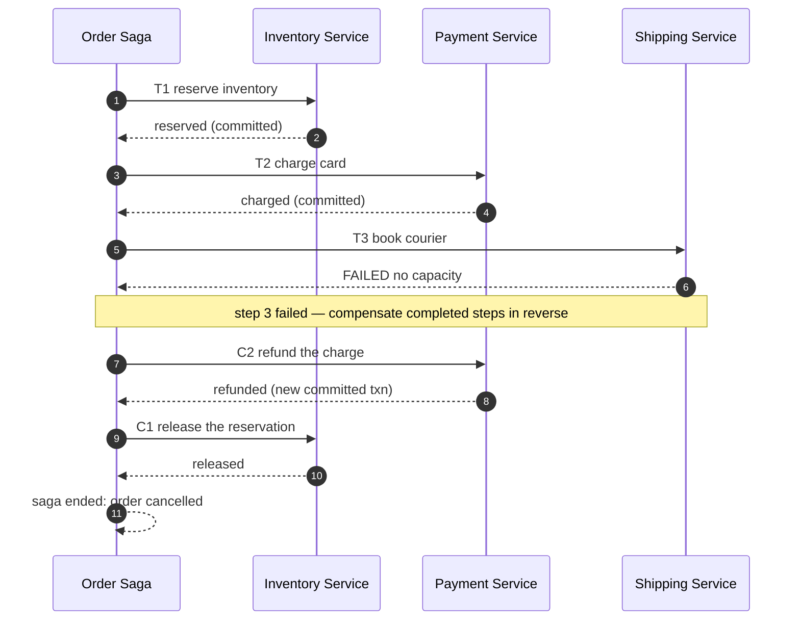

# Multi-step Processes & Sagas

> **Prerequisites:** [Distributed Transactions](/synapse/system-design-from-first-principles/distributed-data/distributed-transactions), [Queues & Brokers](/synapse/system-design-from-first-principles/building-blocks/queues-and-brokers) | **You'll be able to:** design a compensating action for each step of a multi-service operation; choose between orchestration and choreography; and explain why a durable workflow engine survives crashes that would corrupt a naive coordinator.

## The problem (why this exists)

Book a holiday: reserve a flight, then a hotel, then a rental car. Three separate providers, three separate systems. Now the car company has nothing available on your dates. What happens to the flight and hotel you already booked?

This shape is everywhere once you look. Place an order and the system must reserve inventory, charge the card, then dispatch a courier. Onboard an employee and it must create an identity, provision a laptop, and enroll them in payroll. Each of these is one *business* operation that the user thinks of as a single atomic act — "book my trip", "place my order" — but underneath it is a sequence of steps against different services, any of which can fail while the earlier ones have already succeeded.

The instinct from single-database land is to wrap the whole thing in a transaction: `BEGIN`, do all three, `COMMIT`, and if anything fails, `ROLLBACK` and it's as if nothing happened. That instinct is correct — and unavailable. The flight, the hotel, and the car live in three different databases owned by three different companies. There is no shared `BEGIN`/`COMMIT` that spans them. The airline committed your seat the moment its API returned 200; it has no idea your car booking later failed, and it will not un-commit on your behalf.

So you are left holding a half-finished operation: money moved, a seat held, and no clean way back. The multi-step process pattern — and its most common instantiation, the **saga** — is the discipline for finishing or safely unwinding these operations when a single transaction is impossible.

## Intuition first

Why can't you just span one ACID transaction across all three services? The [distributed transactions](/synapse/system-design-from-first-principles/distributed-data/distributed-transactions) lesson covers this in full, but the short version matters here. The classic tool for cross-node atomicity is **two-phase commit (2PC)**: a coordinator asks every participant "can you commit?", and only if all say yes does it tell them all to commit. It works, but it has a vicious failure mode — a participant that has voted "yes" but not yet heard the final decision is **in doubt**: it cannot commit (the coordinator might have aborted) and cannot abort (the coordinator might have committed), so it *waits*, holding its locks the entire time. If the coordinator crashes, those locks can be held for minutes or forever, and large parts of the system freeze.

That fragility is why teams avoid 2PC across services, and why it's essentially never available across *organizations* — the airline is not going to enroll in your distributed-transaction protocol and let your coordinator pin its inventory rows. As DDIA puts it, you generally "can't wrap two service tasks in one transaction" once third-party gateways are involved.

The saga throws out the fantasy of a global rollback and replaces it with a plan. Break the operation into a series of **local transactions** — each one a normal, committed transaction inside a single service. For each local transaction, define a **compensating action** that semantically undoes it. Then run the steps forward one at a time; if a step fails, run the compensations for the completed steps backward. Booked the flight and hotel but the car failed? Cancel the hotel, then cancel the flight. You never had atomicity, but you engineered your way to *eventual* consistency: the operation as a whole either fully happens or is fully undone — just not instantaneously, and not with locks.

The crucial mental shift: a compensation is **not a rollback**. A rollback erases uncommitted changes so no one ever saw them. A compensation runs *after* the original step committed and became visible — the seat really was reserved, the card really was charged. You cannot un-charge a card; you issue a **refund**, a new committed transaction that brings the net effect back to zero. This distinction drives most of the hard design work, and we return to it repeatedly.

## How it works

A saga is an ordered list of steps `T1, T2, … Tn`, each a local transaction, paired with compensations `C1, C2, … Cn` where `Ci` semantically undoes `Ti`. The happy path runs `T1 → T2 → … → Tn` and finishes. If some `Tk` fails, the saga executes `C(k-1) → C(k-2) → … → C1` — compensating the already-completed steps in reverse order — and reports failure. Reverse order matters: later steps may depend on earlier ones, so you unwind in the opposite direction you built up.

Here is an order-fulfilment saga where the third step fails and triggers compensations:



Notice that `C2 refund` is a brand-new committed transaction, not an undo of `T2` — the money already left the customer's account when `T2` committed, so the only honest correction is to send it back.

### Two ways to coordinate

Something has to decide the order of steps, react to each result, and drive the compensations when a step fails. There are two structural answers, and choosing between them is the central design decision of the pattern.

**Orchestration** puts a single component — the **orchestrator** — in charge. It calls `T1`, waits for the result, calls `T2`, and so on; on failure it walks back through the compensations. The orchestrator holds the workflow logic; the participating services are dumb executors that just do what they're told and report back. This is what a workflow engine like Temporal gives you.

**Choreography** has no central brain. Each service reacts to an event, does its step, and emits an event that the next service is subscribed to. The Order service emits `OrderPlaced`; Inventory reacts, reserves stock, emits `InventoryReserved`; Payment reacts, charges, emits `PaymentCharged`; Shipping reacts. On failure a service emits a failure event (`ShippingFailed`) that upstream services subscribe to as their cue to compensate. The workflow logic is *distributed* across the services and the [event bus](/synapse/system-design-from-first-principles/patterns/event-driven-cqrs-outbox-cdc) — there is no single place that knows the whole plan.

```d2
direction: right

classes: {
  svc:   {style: {fill: "#dcfce7"; stroke: "#16a34a"}}
  async: {style: {fill: "#f3e8ff"; stroke: "#9333ea"}}
}

orchestration: "Orchestration (central coordinator)" {
  orch: "Orchestrator" {class: svc}
  inv1: "Inventory" {class: svc}
  pay1: "Payment" {class: svc}
  shp1: "Shipping" {class: svc}
  orch -> inv1: "1 do step"
  inv1 -> orch: "2 result"
  orch -> pay1: "3 do step"
  pay1 -> orch: "4 result"
  orch -> shp1: "5 do step"
  shp1 -> orch: "6 result"
}

choreography: "Choreography (events, no coordinator)" {
  bus: "Event bus" {class: async}
  inv2: "Inventory" {class: svc}
  pay2: "Payment" {class: svc}
  shp2: "Shipping" {class: svc}
  inv2 -> bus: "InventoryReserved"
  bus -> pay2: "reacts"
  pay2 -> bus: "PaymentCharged"
  bus -> shp2: "reacts"
  shp2 -> bus: "ShippingFailed"
  bus -> pay2: "compensate"
  bus -> inv2: "compensate"
}
```

The honest trade is about **visibility versus coupling**. With orchestration, the whole workflow is written down in one place: you can read it, log its state, and answer "where is order 12345 right now?" with a single query. The cost is a central component that every step flows through — a potential bottleneck and a piece of infrastructure you must run and scale. With choreography, there is no central bottleneck and services stay loosely coupled through events — but the workflow exists only as an emergent property of who-subscribes-to-what. Add a fourth step and you edit several services' subscriptions; debug a stuck order and you reconstruct its path by correlating events across services. Beyond three or four steps, choreography's "where is this order?" question becomes genuinely hard to answer, which is why most non-trivial workflows drift toward orchestration.

### Surviving crashes: durable execution

Both styles share a nastier problem than a failed step: what if the *coordinator itself* crashes mid-saga? The orchestrator has charged the card (`T2` done) and is about to book shipping (`T3`) when its process dies. On restart, it has no memory of where it was. Did it charge the card already? Re-run `T2` and you double-charge. Skip it and you ship for free.

Naive answers — keep the saga state in a local variable, or in a single database row you update as you go — all have a window where a crash between "do the step" and "record that I did the step" leaves you unsure. This is the same in-doubt hazard 2PC has, relocated to the coordinator.

**Durable execution** engines (Temporal, and its predecessor Cadence, both born at Uber; also Restate, AWS Step Functions, Azure Durable Functions) solve this by making the workflow's state itself crash-proof. The engine logs every step invocation and its result to durable storage, like a write-ahead log, as it happens. When a worker crashes, the engine re-executes the workflow from the beginning — but every step that already completed is **not re-run**; the engine replays the logged result instead. DDIA describes exactly this: durable execution provides exactly-once semantics because "on task failure the framework re-executes but skips RPC calls and state changes already completed, returning the previous results instead." The engine calls the workflow definition your **workflow** and each external step an **activity** (other engines say "durable function") — the workflow code is deterministic so it can be replayed, and the activities are where the messy, non-deterministic outside world lives.

Two obligations fall on you. First, because the engine may re-execute an activity whose result it never recorded (it crashed *during* the step), each activity must be **idempotent** — running it twice must have the same effect as running it once. That is why the [idempotency & exactly-once](/synapse/system-design-from-first-principles/patterns/idempotency-and-exactly-once) lesson is a hard prerequisite for correct sagas: the external services you call (the payment gateway, the courier API) must accept an idempotency key so a retried charge doesn't become a second charge. Second, because the engine replays workflow code deterministically, that code must *be* deterministic — no reading the wall clock or a random number directly; the engine supplies deterministic versions.

Durable execution does not replace the saga; it *hosts* it. The saga defines what the steps and compensations are; durable execution guarantees the orchestrator that drives them survives crashes, retries transient failures, and never loses track of where a given run is.

## Trade-offs

The core decision is orchestration versus choreography.

| Dimension | Orchestration (central coordinator) | Choreography (events) |
| --- | --- | --- |
| Where the workflow lives | One place — the orchestrator definition | Emergent from event subscriptions across services |
| Visibility / "where is order X?" | Easy — query the orchestrator's state | Hard — correlate events across services |
| Coupling | Services coupled to the orchestrator's API | Services loosely coupled via events |
| Single bottleneck / SPOF | Yes — the coordinator (mitigated by making it HA) | No central choke point |
| Adding a step | Edit one definition | Edit several services' subscriptions |
| Debugging a stuck run | Central log and state | Distributed tracing across the event bus |
| Best fit | Complex workflows, many steps, human-in-the-loop, strong audit needs | Few steps, high decoupling, autonomy across teams |

A second, orthogonal choice is whether to run the coordinator yourself as plain code or adopt a durable-execution engine. Hand-rolled orchestration is fine for a two-step saga with a well-understood crash story; a workflow engine earns its operational weight once you have many steps, long waits (human approvals, days-long holds), versioning needs, and a real requirement that no run is ever silently lost.

## Numbers that matter

These are engine limits and conventions, useful for sizing a design — treat them as current-as-of-writing figures, not laws.

- **AWS Step Functions** caps a single workflow execution at **1 year** and the workflow's state payload at **256 KB** `[web: docs.aws.amazon.com/step-functions]`. If a step needs to pass a large blob to the next, pass a reference (an object-storage key), not the blob — the same discipline as keeping [long-running task](/synapse/system-design-from-first-principles/patterns/long-running-tasks) payloads out of the queue.
- Compensations are asynchronous and take real wall-clock time: a card **refund** is a fresh transaction that may take seconds to settle at the gateway and days to appear on the customer's statement. Design the UI and downstream logic to tolerate a window where the original charge and its refund both exist.
- A saga's steps run **serially** in the common case, so end-to-end latency is the *sum* of the step latencies plus the coordination overhead — a five-step saga over services that each take 100–300 ms is a multi-hundred-millisecond to multi-second operation before you add any retries. Where steps are independent, an orchestrator can fan them out in parallel; where they depend on each other (charge before ship), they cannot.

For the underlying request-rate and capacity figures the services themselves must handle, see the [numbers reference](/synapse/system-design-from-first-principles/foundations/estimation-and-numbers).

## In production

**Uber** built Cadence (open-sourced) and its successor **Temporal** precisely because ride and delivery flows are multi-step sagas with human-in-the-loop waits — a trip request must be offered to a driver, wait for acceptance (or time out and re-offer), then proceed through pickup, ride, and fare capture, any stage of which can fail or be cancelled. Durable execution lets that state survive worker restarts and lets a step "wait for a human" for minutes without a thread sitting idle. See the [Uber case study](/synapse/system-design-from-first-principles/case-studies/uber).

**Stripe**-style payment processing is the canonical durable-execution motivation in DDIA: charging a card involves fraud checks, the card network, and bank settlement as separate services, and a mid-workflow crash could "charge the card without depositing the funds." The fix is exactly-once execution over idempotent activities keyed by an idempotency key — the same key the client sends so a retried API call doesn't create a second charge. See the [Stripe payments case study](/synapse/system-design-from-first-principles/case-studies/stripe-payments).

**Ticketmaster** and similar high-contention booking systems combine a saga with a deliberately *short* reservation window: reserve the seat (a local transaction that holds it for a few minutes), then run the payment saga; if payment fails or the window expires, the compensation releases the seat. This keeps the contended resource locked for milliseconds-to-minutes rather than the full purchase flow — a pattern explored in [dealing with contention](/synapse/system-design-from-first-principles/patterns/dealing-with-contention) and the [Ticketmaster case study](/synapse/system-design-from-first-principles/case-studies/ticketmaster).

Operationally, teams that run sagas at scale invest in three things: a **dead-letter path** for compensations that themselves fail (a refund that can't complete needs a human, not an infinite retry loop); **observability** that can answer "how many sagas are stuck, and where?" (trivial with orchestration, a tracing project with choreography); and **versioning discipline** — DDIA warns that durable-execution code is brittle to change because re-executions replay the original call sequence, so you deploy a new workflow version alongside the old and let in-flight runs finish on the version they started with.

## Pitfalls & interview traps

<div style="border-left:4px solid #da5233;background:rgba(218,82,51,0.08);padding:0.6rem 1rem;border-radius:0 0.5rem 0.5rem 0;margin:1.25rem 0">

⚠️ **A compensation is not an atomic rollback.** The original step already committed and became visible — the card was charged, the seat was booked, an email may already have gone out. Compensation is a *new* forward transaction that brings the net effect back toward zero (a refund, a cancellation), and it happens *later*, so there is a window where the world has seen the in-between state. If your design assumes "if the saga fails it's as if nothing happened", it is wrong. Some effects (a sent email, a shipped package) cannot be fully compensated at all — the best you can do is a follow-up correction (an apology, a return label).

</div>

Other traps interviewers probe:

- **Compensations must be idempotent too.** The saga coordinator can crash after issuing `C2` but before recording it, then re-issue `C2` on recovery. A refund endpoint that isn't idempotent will refund twice. Every compensation needs the same idempotency-key discipline as every forward step.
- **Choreography's hidden coupling.** "No central coordinator" sounds like zero coupling, but the services are tightly coupled *through the event contract and the implicit ordering*. Change the shape of `PaymentCharged` and you can silently break every downstream subscriber; there is no single definition that reveals the full flow. Interviewers love to ask "how do you know order 999 is stuck?" — with choreography, the honest answer is "distributed tracing", and that's a real cost.
- **Non-compensatable steps should run last.** Order the saga so that irreversible or hard-to-undo steps (shipping the physical package, sending the notification) come *after* the easily-compensated ones (reserving inventory, authorizing — not capturing — payment). If the risky step is last, a failure before it needs no ugly compensation; if it's first, every later failure forces you to unwind something you can't cleanly unwind.
- **"Just use 2PC" is a trap answer.** Reaching for two-phase commit across services signals you haven't internalized why teams avoid it — the in-doubt/locks-held failure mode, and its unavailability across organizational boundaries. Name the saga instead.
- **Semantic locks / dirty reads between sagas.** While a saga is mid-flight, its partial state is visible to other transactions (the seat shows "reserved", the balance is already debited). Concurrent sagas can read this in-between state and make decisions on it — a saga-level analog of a dirty read. Designs handle it with status flags ("pending") and by keeping windows short; it connects directly to [dealing with contention](/synapse/system-design-from-first-principles/patterns/dealing-with-contention).

## Check yourself

```quiz
{"prompt": "Your order saga has charged the customer's card, then the shipping step fails permanently. What is the correct way to undo the charge?", "options": ["Roll back the payment transaction so the charge never happened", "Issue a refund as a new committed transaction (a compensating action)", "Leave the charge and retry shipping forever", "Wrap all steps in a 2PC transaction so the charge auto-rolls-back"], "answer": "Issue a refund as a new committed transaction (a compensating action)"}
```

```quiz
{"prompt": "A team wants maximum visibility — one place to query 'where is order 12345 right now?' — and expects the workflow to grow to eight steps with human approvals. Which coordination style fits best?", "options": ["Choreography, because it avoids a central bottleneck", "Orchestration, because the workflow lives in one queryable place", "Neither — use 2PC across all services", "Choreography, because events are always easier to debug"], "answer": "Orchestration, because the workflow lives in one queryable place"}
```

```quiz
{"prompt": "Why must each activity in a durable-execution workflow (e.g. Temporal) be idempotent?", "options": ["To make the workflow code deterministic on replay", "Because the engine may re-execute a step whose result it never durably recorded, so running it twice must equal running it once", "To reduce the 256 KB state-size limit", "Because choreography has no coordinator"], "answer": "Because the engine may re-execute a step whose result it never durably recorded, so running it twice must equal running it once"}
```

```quiz
{"prompt": "Which statement about choreography (event-driven saga coordination) is most accurate?", "options": ["It has zero coupling between services", "The full workflow is written down in one definition", "Services are coupled through the event contract and implicit ordering, and tracing a stuck run means correlating events across services", "It cannot implement compensations"], "answer": "Services are coupled through the event contract and implicit ordering, and tracing a stuck run means correlating events across services"}
```

<details>
<summary>Why can't you just wrap a flight + hotel + car booking in a single ACID transaction, and what do you use instead?</summary>

The three bookings live in three separate databases owned by three different companies; there is no shared `BEGIN`/`COMMIT` spanning them. Two-phase commit could give cross-node atomicity in principle, but it is fragile (a coordinator crash leaves participants in doubt, holding locks) and is never available across organizational boundaries. Instead you use a **saga**: three local transactions, each with a compensating action (cancel the hotel, cancel the flight), run forward and unwound in reverse on failure. You trade instantaneous atomicity for eventual consistency.
</details>

<details>
<summary>Order these steps for a saga so that failures are cheapest to handle, and say why: (a) capture payment, (b) reserve inventory, (c) ship the package.</summary>

Reserve inventory → capture payment → ship the package. Put the **hardest-to-compensate** step (shipping a physical package — effectively irreversible) **last**, so a failure before it needs no ugly compensation. Reserving inventory is trivially compensated (release it) and payment capture is compensated by a refund, so those go earlier where a later failure can still unwind them. If shipping were first, every subsequent failure would force you to reverse something you can't cleanly reverse.
</details>

<details>
<summary>An interviewer asks: "With choreography there's no coordinator, so how do you find out that a specific order is stuck halfway?"</summary>

Honestly acknowledge the cost: because the workflow is emergent from event subscriptions, there is no single place holding the run's state. You answer the question with **distributed tracing** — a correlation ID (the order ID) attached to every event, aggregated in a tracing/observability system so you can reconstruct the order's path and see which event it's waiting on. This is precisely the visibility advantage orchestration gives you for free, and a strong reason complex workflows drift toward orchestration or a durable-execution engine.
</details>

## Sources

DDIA2 ch. 5 pp. 186–189 (durable execution & workflows) · DDIA2 ch. 8 pp. 323–334 (2PC contrast, in-doubt participants, exactly-once via idempotency) · `[web: docs.aws.amazon.com/step-functions]` (execution/state-size limits)
