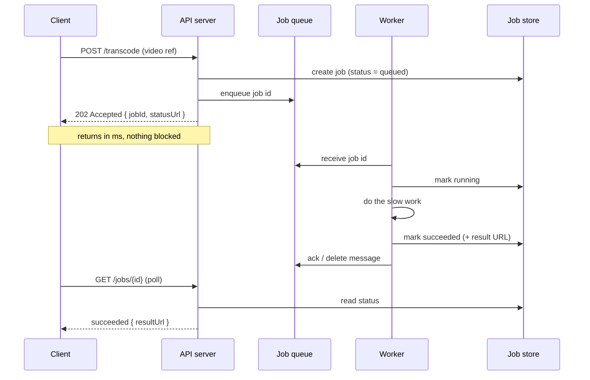
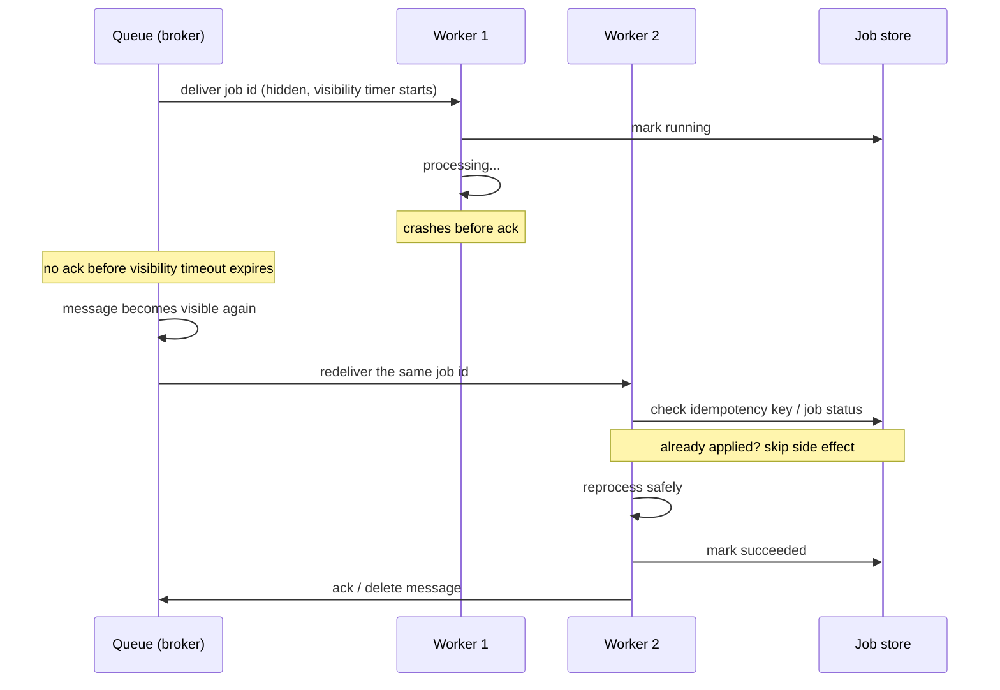

# Long-running Tasks

> **Prerequisites:** [Queues & Brokers](/synapse/system-design-from-first-principles/building-blocks/queues-and-brokers), [Faults, Clocks & Time](/synapse/system-design-from-first-principles/distributed-data/faults-clocks-and-time) | **You'll be able to:** (1) recognize when work is too slow for the request/response cycle and split it into accept-now, process-later; (2) design the accept → enqueue → worker → poll/notify loop with a job lifecycle; (3) make that loop reliable with visibility timeouts, retries with backoff, dead-letter queues, and idempotent execution.

## The problem (why this exists)

A user uploads a 20-minute video and taps **Publish**. Encoding it into six resolutions takes four minutes. A finance user clicks **Export** and the quarterly report scans ten million rows and renders a PDF — forty-five seconds. A marketer hits **Send** on a campaign to 10,000 recipients. In every case the *work* is real and unavoidable. The mistake is trying to do it **inside the HTTP request that asked for it.**

Hold that request open and three things break, in order.

First, the **client gives up**. A browser's `fetch`, a mobile app, or a reverse proxy in front of your service all have timeouts. Load balancers and API gateways typically cut idle connections at **30–60 seconds** (`[web: common ALB/nginx defaults]`). Your 45-second PDF returns a `504 Gateway Timeout` even though the work would have finished — and now the user retries, doubling the load.

Second, the **server runs out of threads**. A synchronous server handles each request on a thread (or an async server on an event-loop slot / connection). A thread blocked for four minutes on a transcode is a thread doing nothing but *waiting*. Ship a modest pool of 200 threads and 200 slow uploads freeze the entire service — health checks fail, fast requests queue behind slow ones, and the box looks hung. This is **thread-pool exhaustion**, and it takes down endpoints that have nothing to do with video.

Third, the **user experience is a spinner**. Even if nothing timed out, making someone stare at a frozen page for a minute — with no progress, no way to navigate away, no resilience to a dropped connection — is a bad product. Close the laptop lid and the work is lost.

The request/response cycle is built for work measured in **milliseconds**. The moment a unit of work is measured in **seconds to hours**, it doesn't belong there. This lesson is the pattern for getting it out.

## Intuition first

Walk into a busy coffee shop. You order a complicated drink. The barista does **not** make you stand at the register, blocking the line, until it's ready. They take your order, shout a number, hand you a buzzer, and wave the next customer forward. Somewhere behind the counter, your drink gets made. The buzzer goes off; you collect it.

That is the entire pattern.

- **Taking the order** is your API request. It's fast — write it down, hand back a claim ticket, return.
- **The order rail** where tickets pile up is a **queue**.
- **The baristas** are a pool of **workers** pulling tickets off the rail and doing the slow work, in parallel, at their own pace.
- **The buzzer number** is a **job id** — your handle to ask "is it ready?" or to be told when it is.

Two properties fall straight out of the metaphor. The register never blocks, so the line stays fast no matter how slow one drink is. And you can add more baristas when the rail gets long — the order desk doesn't change. **Decouple accepting work from doing work, and each side scales on its own.** A spike in orders becomes a longer rail (more queue depth), not a frozen register.

The only thing the coffee shop hides that a distributed system cannot is failure. A barista can drop a cup, walk off shift mid-drink, or make your order twice. The back half of this lesson is entirely about making the buzzer honest when the baristas are unreliable.

## How it works

The pattern has a fast synchronous half and a slow asynchronous half, joined by a queue and a job store.

**1. Accept.** The API validates the request, creates a **job record** in a store (a row in Postgres, an item in DynamoDB, a hash in Redis) with status `queued`, and enqueues a **reference** to that job — usually just the job id, not the payload. Message brokers cap message size (SQS at **256 KB**), and a raw video obviously won't fit; you store the input in object storage or the job record and pass the id [DDIA2 p. 491]. The API then returns **immediately** — the HTTP convention is `202 Accepted` with the job id and a status URL:

```
POST /videos/transcode        →  202 Accepted
                                  { "jobId": "vt_8f3a", "status": "queued",
                                    "statusUrl": "/jobs/vt_8f3a" }
```

The request returns in milliseconds. No thread is held; the client holds a handle instead of a connection.

**2. Enqueue.** The job id lands on a queue — a message broker, "essentially a database optimized for message streams" that centralizes durability so it survives producers and consumers connecting, disconnecting, and crashing [DDIA2 p. 491]. Faced with a burst, a broker buffers rather than dropping or blocking the producer, and consumers read asynchronously [DDIA2 p. 491]. That buffer is exactly what turns a spike in submissions into a spike in **queue depth** instead of user-visible latency.

**3. Process.** A pool of **workers** — long-lived servers, containers, or serverless functions — pulls job ids off the queue, loads the job record, flips it to `running`, does the slow work, writes the result (a URL to the encoded video, the generated PDF, a success count), and flips the record to `succeeded`. Then it **acknowledges** the message so the broker removes it [DDIA2 p. 493].

**4. Deliver the result.** The client learns the outcome one of two ways — it **polls** the status URL until the status is terminal, or the server **pushes** a notification when the job finishes (WebSocket, SSE, or a webhook). The push path is the [Real-time delivery](/synapse/system-design-from-first-principles/building-blocks/realtime-delivery) building block; the trade-off between them is the table below.



### The job lifecycle

The job record is the source of truth the client reads. Its status walks a small state machine:

- `queued` — accepted, waiting for a worker.
- `running` — a worker has picked it up. Optionally carries a **progress** field (percent, or "encoding 3/6 resolutions") that long jobs update as they go, so a UI can show a real bar instead of an indeterminate spinner.
- `succeeded` — done; the record holds the result or a pointer to it.
- `failed` — done, unsuccessfully; the record holds an error the client can act on.
- `retrying` — transiently failed; the system will attempt it again (see reliability below).

Modeling this explicitly matters: the API stays trivial (read a row), the client has a clean contract, and every failure mode maps to a status rather than a dropped connection.

### Scaling workers to queue depth

Because accepting and processing are decoupled, you scale the worker pool **independently** of the API tier — and the signal you scale on is **queue depth**, not CPU. A deep queue means work is arriving faster than it's draining; add workers. An empty queue means you can scale down. CPU is a lagging, misleading indicator here — workers can be near-idle waiting on I/O while the backlog grows. Autoscaling on queue depth (or the derived *estimated wait time* = depth ÷ drain rate) is the standard control loop.

There's a subtlety the [Queues & Brokers](/synapse/system-design-from-first-principles/building-blocks/queues-and-brokers) lesson covers: with a **log-based** broker (Kafka), parallelism is capped by the number of partitions, because whole shards are assigned to consumers [DDIA2 p. 497]. With a **traditional** broker (SQS, RabbitMQ) that hands out individual messages, you can add workers freely up to the rate the queue can serve. The choice of broker constrains how far "just add workers" goes.

### Reliability — the part that's actually hard

A worker *will* crash mid-job: the box is preempted, the process OOMs, the network partitions. If a crashed worker's job simply vanished, users would silently lose work. Brokers prevent this with **acknowledgments**: a delivered message isn't deleted, only *held*, until the worker explicitly acks that it finished. If the ack never comes, the broker **redelivers** the message to another worker [DDIA2 p. 493].

The mechanism that decides "the ack never came" is the **visibility timeout** (SQS's name; brokers vary). On delivery, the message is made invisible to other workers for a configured window. If the worker acks (deletes) it inside the window, it's gone for good. If the window expires first — because the worker crashed, or is simply too slow — the message becomes visible again and is redelivered. A reasonable starting point is **10–30 seconds**, tuned to the work.

That immediately raises a problem for genuinely long jobs. A four-minute transcode cannot ack within a 30-second visibility window — so the broker would redeliver it to a second worker while the first is still happily encoding, and now the same video is being transcoded twice. Two fixes, used together:

- **Heartbeats.** A long-running worker periodically extends the visibility timeout ("I'm still alive, give me 30 more seconds") while it works. The message stays hidden as long as the worker keeps checking in; the moment the worker dies, the heartbeats stop, the window lapses, and redelivery kicks in. This lets you keep a *short* visibility timeout (fast failure detection) even for hour-long jobs.
- **Retries with backoff.** A transient failure — a flaky downstream, a throttled API — shouldn't fail the job outright. The worker (or the broker's redelivery) retries, with **exponential backoff** so a struggling dependency isn't hammered: wait 1s, then 2s, 4s, 8s, with a little random jitter so a fleet of retriers doesn't synchronize into a thundering herd.

But some jobs fail *every* time — a malformed input, a missing field, a bug. DDIA calls this a **poison message**: a message that repeatedly crashes its consumer can loop forever, wasting resources or, worse, blocking every message behind it [DDIA2 p. 494]. The fix is a **dead-letter queue (DLQ)**: after N failed attempts (commonly **3–5**), the broker moves the poison job aside into a separate queue where it stops blocking healthy work and can be inspected, fixed, or replayed by an operator [DDIA2 p. 495]. The DLQ is a monitored alarm, not a graveyard — items landing there mean a bug to investigate.

Redelivery has a consequence that makes idempotency non-negotiable, so it gets its own diagram.



### Idempotent execution — because a job may run twice

The redelivery mechanism guarantees **at-least-once** processing, never exactly-once. DDIA is blunt about why: on failover, a new worker resumes from the last recorded position, so a message that was *processed but not yet acked* gets processed **a second time** [DDIA2 p. 498]. You cannot engineer this away at the delivery layer; you engineer *around* it at the execution layer.

The goal is **effectively-once** — DDIA notes "exactly-once semantics, although *effectively-once* would be a more descriptive term": records may be processed multiple times, but the visible effect is as if processed once [DDIA2 p. 527]. The tool is **idempotence**: an operation whose repeated execution has the same effect as a single execution [DDIA2 p. 528]. Deleting a key is naturally idempotent; incrementing a counter or charging a card is not.

You make a non-idempotent job idempotent by attaching **metadata that lets a repeat detect itself**. DDIA's canonical trick: store the message's offset (or an idempotency key) alongside the write, so a redelivered message finds its own mark and skips the already-applied update [DDIA2 p. 528]. Concretely, the worker checks "has job `vt_8f3a` already reached `succeeded`?" before doing side-effectful work, or writes results under the job id so a second write is a harmless overwrite. This is the same at-least-once-plus-idempotency contract developed in [Idempotency & exactly-once](/synapse/system-design-from-first-principles/patterns/idempotency-and-exactly-once) — background jobs are one of its most common homes. Note DDIA's fine print: idempotence assumes deterministic reprocessing in order and **no other node concurrently updating the same value** — you may need **fencing** to block a presumed-dead worker that isn't actually dead [DDIA2 p. 528]. Grounding this failure model is exactly why [Faults, Clocks & Time](/synapse/system-design-from-first-principles/distributed-data/faults-clocks-and-time) is a prerequisite: "the visibility timeout expired" does **not** mean the first worker is dead — it may just be slow or partitioned, and about to finish.

### The recurring-task cousin

Everything above is triggered by a user request. Its sibling is triggered by a **clock**: "email every user their weekly digest on Monday at 9am," "expire abandoned carts hourly." That's a **job scheduler** — the same worker/queue/retry/idempotency machinery, fronted by a scheduler that enqueues jobs on a cron-like trigger instead of on an API call. The whole worked design is the [Job scheduler](/synapse/system-design-from-first-principles/case-studies/job-scheduler) case study; the reliability rules you just learned are what it's built on.

## Trade-offs

The main design fork after "yes, make it async" is **how the client learns the result**: polling vs push-notify.

| Delivery | How it works | Gives you | Costs you | Use when |
| --- | --- | --- | --- | --- |
| **Short polling** | Client re-`GET`s the status URL on an interval | Dead simple; stateless; works through any proxy/firewall | Wasted requests while pending; result latency ≈ poll interval; a stampede of pollers at scale | Jobs finish in seconds–minutes; simple or offline-tolerant clients |
| **Long polling** | Server holds the status request open until the job changes state or a timeout | Far fewer requests; near-instant result with no new transport | Ties up a connection/thread per waiter; needs a wait-and-notify server side | Moderate waits; you want fast notify without adding WebSockets |
| **Push (WebSocket / SSE / webhook)** | Server actively notifies the client on completion (and streams progress) | Instant result; no wasted polls; live progress bars | Connection/state management, reconnection, extra fan-out infrastructure | Many concurrent long jobs; live progress matters; server-to-server (webhook) |

There's a second trade-off worth naming: **how much you trust the queue's ordering and delivery.** A traditional broker gives per-message acks and redelivery (great for independent tasks, but redelivery **reorders** messages [DDIA2 p. 494]); a log-based broker gives total order within a partition and free replay, at the cost of head-of-line blocking behind a slow message [DDIA2 p. 497]. Pick per workload — see [Queues & Brokers](/synapse/system-design-from-first-principles/building-blocks/queues-and-brokers).

## Numbers that matter

- **Why async at all:** load balancers / gateways idle-timeout at **~30–60s**; a job that might exceed that must not live in the request `[web: common proxy defaults]`. A worked PDF-generation example taking **≥45s** synchronously is already over the line.
- **Message size:** SQS caps a message at **256 KB** — pass a job id or a pointer, never the payload [DDIA2 p. 491].
- **Serverless workers:** AWS Lambda caps a single execution at **15 minutes** — fine for a thumbnail, wrong for a two-hour video encode; long jobs want container/VM workers or chunking.
- **Visibility timeout / heartbeat:** start around **10–30s**, and heartbeat-extend for jobs longer than the window.
- **DLQ threshold:** move a job to the dead-letter queue after **3–5** failed attempts; the underlying rationale — poison messages loop forever without one — is DDIA [p. 494–495].
- **Queue as a buffer:** a durable disk-backed log buffers a lot — DDIA's back-of-envelope has a 20 TB drive at 250 MB/s holding **~22 hours** of messages, and real deployments keep days [DDIA2 p. 499]. Your queue can absorb a long outage of the worker tier without losing work.

## In production

The pattern is everywhere; only the plumbing changes.

- **Brokers.** **Amazon SQS** (visibility timeouts + built-in DLQs), **RabbitMQ** (AMQP acks + DLX), and **Kafka** (log-based, offset-tracked, replayable) are the common queues [DDIA2 pp. 491–499]. Framework layers ride on top: **Celery** (Python), **Sidekiq** / **Resque** (Ruby, Redis-backed), and **BullMQ** (Node, Redis-backed) give you the job record, retries, backoff, and DLQ semantics out of the box `[web: framework docs]`.
- **YouTube / video platforms.** Upload returns immediately; **transcoding** into multiple resolutions and codecs runs as background jobs across a worker fleet, often chunked (split the video, encode segments in parallel, stitch). The video is "processing" — a job status — until the workers finish. This is the [YouTube](/synapse/system-design-from-first-principles/case-studies/youtube) case study.
- **LeetCode / online judges.** Submitting code returns a submission id, not a verdict. The code runs in a sandboxed worker against the test suite; the client polls (or is pushed) the result. Untrusted code makes worker **isolation** and hard **timeouts** first-class concerns — a poison submission (infinite loop) must be killed, not allowed to block the pool.
- **Web crawlers.** The frontier of URLs-to-fetch *is* a giant work queue; fetch/parse workers pull from it, and newly discovered links are enqueued back. Politeness delays, retries with backoff, and dedup (don't re-crawl a URL) are the same reliability primitives at massive scale — the [Web crawler](/synapse/system-design-from-first-principles/case-studies/web-crawler) case study.
- **When *not* to.** If the work reliably finishes in tens of milliseconds, an async job adds a queue, a store, a worker tier, and a polling contract for no benefit — just do it inline. The pattern earns its complexity only when the work is genuinely slow, spiky, or must survive a client disconnect.

For workflows that are more than one step — "encode, then generate thumbnails, then notify subscribers, and compensate if step 2 fails" — a single job is the wrong unit. That's an orchestration problem: see [Multi-step processes & sagas](/synapse/system-design-from-first-principles/patterns/multi-step-processes-and-sagas).

## Pitfalls & interview traps

<div style="border-left:4px solid #da5233;background:rgba(218,82,51,0.08);padding:0.6rem 1rem;border-radius:0 0.5rem 0.5rem 0;margin:1.25rem 0">

⚠️ **Visibility timeout shorter than the job runtime = guaranteed duplicate processing.** If a job takes 4 minutes and the visibility timeout is 30 seconds with no heartbeat, the broker redelivers the *still-running* job to a second worker every 30 seconds — you get the same video transcoded many times over, each attempt racing the others. And if the job is **not idempotent** (it charges a card, sends an email, increments a counter), those side effects happen once *per redelivery*. The two failures compound: a too-short timeout manufactures duplicates, and non-idempotent work turns duplicates into real-world damage. Heartbeat to extend the window, and make the side effect idempotent — you need **both**.

</div>

Other traps interviewers reach for:

- **"Just do it in the request and raise the timeout."** Bumping the gateway timeout to 5 minutes doesn't fix thread-pool exhaustion — it *worsens* it, because now threads block five times longer, and one slow-endpoint spike starves every other route. The problem was never the timeout value; it was holding the thread at all.
- **Assuming the queue gives exactly-once.** No mainstream broker does — delivery is at-least-once, and failover reprocesses in-flight messages [DDIA2 p. 498]. If a candidate says "exactly-once queue," the follow-up is "what happens when the worker crashes after the side effect but before the ack?" The answer is idempotent execution, not a magic queue.
- **No DLQ.** Without a dead-letter queue, one poison job (a corrupt upload that crashes the decoder) is retried forever, burning workers and — on an ordered queue — blocking every job behind it [DDIA2 pp. 494–495].
- **Polling storms.** Ten thousand clients polling a status endpoint every second is 10k req/s of mostly-"still running" answers. Use a sane poll interval with backoff, cache the status read, or switch to push for high-concurrency waits.
- **Trusting the visibility timeout as a liveness verdict.** Timeout expiry means "no ack yet," not "worker is dead." The first worker may be slow or partitioned and about to succeed. That's why side effects need idempotency and, for exclusive resources, **fencing** [DDIA2 p. 528] — a lesson straight out of [Faults, Clocks & Time](/synapse/system-design-from-first-principles/distributed-data/faults-clocks-and-time).
- **Losing progress on very long jobs.** A one-hour job that stores nothing until the end restarts from zero on every crash. Checkpoint intermediate progress (chunk-level for a transcode) so a retry resumes rather than redoes.

## Check yourself

```quiz
{"prompt": "An endpoint generates a report that takes ~50 seconds. Under load, unrelated fast endpoints on the same service start timing out too. What is the root cause of the collateral damage?", "options": ["The database is too slow", "Threads (or connection slots) are held for the full 50s per report, exhausting the pool so other requests can't be served", "The load balancer is misconfigured", "The report query needs an index"], "answer": "Threads (or connection slots) are held for the full 50s per report, exhausting the pool so other requests can't be served"}
```

```quiz
{"prompt": "A worker picks up a job with a 30-second visibility timeout, but the job takes 4 minutes and the worker sends no heartbeats. What happens?", "options": ["The broker waits 4 minutes automatically because it detects the worker is busy", "After 30s the message becomes visible again and is redelivered to another worker, so the job runs concurrently more than once", "The job fails and goes straight to the dead-letter queue", "Nothing — the visibility timeout only applies to failed jobs"], "answer": "After 30s the message becomes visible again and is redelivered to another worker, so the job runs concurrently more than once"}
```

```quiz
{"prompt": "Your queue delivers at-least-once and a worker may crash after charging a customer's card but before acking the message. What makes the redelivered job safe?", "options": ["Switching to a queue that guarantees exactly-once delivery", "Making the charge idempotent — e.g. keyed on the job id so a repeat detects the prior charge and skips it", "Increasing the number of retries", "Deleting the message before doing the work"], "answer": "Making the charge idempotent — e.g. keyed on the job id so a repeat detects the prior charge and skips it"}
```

```quiz
{"prompt": "A single malformed upload crashes the decoder every time it's processed. With no dead-letter queue configured, what is the consequence?", "options": ["The broker automatically discards it after one failure", "It is retried indefinitely, wasting workers and (on an ordered queue) blocking healthy jobs behind it", "It succeeds on the third attempt", "The API returns an error to the original client immediately"], "answer": "It is retried indefinitely, wasting workers and (on an ordered queue) blocking healthy jobs behind it"}
```

<details>
<summary>Why enqueue a job <em>id</em> instead of the full payload (e.g. the video bytes)?</summary>

Brokers are optimized for small messages and cap size hard (SQS at 256 KB) [DDIA2 p. 491] — a video won't fit. Beyond the limit, keeping the queue lean makes it fast and cheap to buffer millions of items, and the authoritative state lives in the job store, not smeared across in-flight messages. Store the input in object storage or the job record, enqueue the id, and let the worker fetch what it needs. The id is also your idempotency and status handle.

</details>

<details>
<summary>Polling or push — how do you choose for result delivery?</summary>

Poll when jobs are short, clients are simple or intermittently connected, and a few seconds of result latency is fine — it's stateless and works through any network path. Push (WebSocket/SSE/webhook) when waits are long, progress should be live, or you have so many concurrent waiters that polling would flood the status endpoint; you pay for connection state and reconnection logic in return. Many systems do both: poll as the reliable baseline, push as the low-latency optimization. The transport itself is the [Real-time delivery](/synapse/system-design-from-first-principles/building-blocks/realtime-delivery) building block.

</details>

<details>
<summary>The queue promises "at-least-once." Why can't you just buy an "exactly-once" queue and skip idempotency?</summary>

Because the duplicate isn't created on the wire — it's created by the crash. A worker can finish the side effect (charge the card, write the file) and then die before recording that it acked. On failover, another worker resumes from the last recorded position and reprocesses that message [DDIA2 p. 498]. No delivery guarantee can undo a side effect that already escaped the system. The achievable goal is *effectively-once* [DDIA2 p. 527]: let the work be retried, but make the effect idempotent so the second run is a no-op. Idempotency is where correctness actually lives.

</details>

## PoC — Proof of concepts

The accept-now / work-later pattern, in the task systems that industry actually deploys:

- [Celery](https://github.com/celery/celery) — the Python distributed task queue: enqueue a job,
  return immediately, process on a worker pool; the archetype this lesson describes.
- [Sidekiq](https://github.com/sidekiq/sidekiq) — the Ruby equivalent, thread-based over Redis; good
  for seeing retry, scheduling and dead-job handling concretely.
- [Temporal](https://github.com/temporalio/temporal) — when a "task" is really a long, stateful
  workflow with retries and timers, this is the durable step up from a plain queue.

## Sources

DDIA2 ch. 12 pp. 491–499 (message brokers as durable stream databases; acknowledgments and redelivery; reordering; poison messages and dead-letter queues; consumer-offset reprocessing on failover; log-based vs traditional brokers; disk-buffer sizing) and pp. 527–528 (exactly-once/effectively-once, idempotence via offset metadata, fencing assumptions) · Cross-links: [Queues & Brokers](/synapse/system-design-from-first-principles/building-blocks/queues-and-brokers), [Faults, Clocks & Time](/synapse/system-design-from-first-principles/distributed-data/faults-clocks-and-time), [Real-time delivery](/synapse/system-design-from-first-principles/building-blocks/realtime-delivery), [Idempotency & exactly-once](/synapse/system-design-from-first-principles/patterns/idempotency-and-exactly-once), [Multi-step processes & sagas](/synapse/system-design-from-first-principles/patterns/multi-step-processes-and-sagas), and the [YouTube](/synapse/system-design-from-first-principles/case-studies/youtube), [Web crawler](/synapse/system-design-from-first-principles/case-studies/web-crawler), and [Job scheduler](/synapse/system-design-from-first-principles/case-studies/job-scheduler) case studies.
