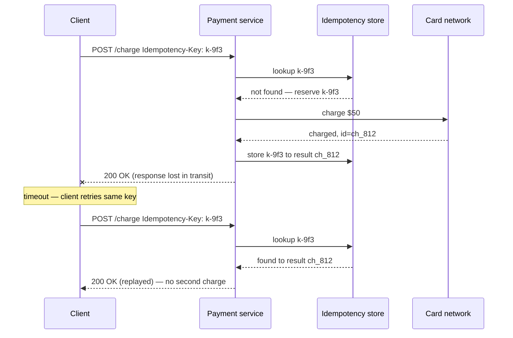
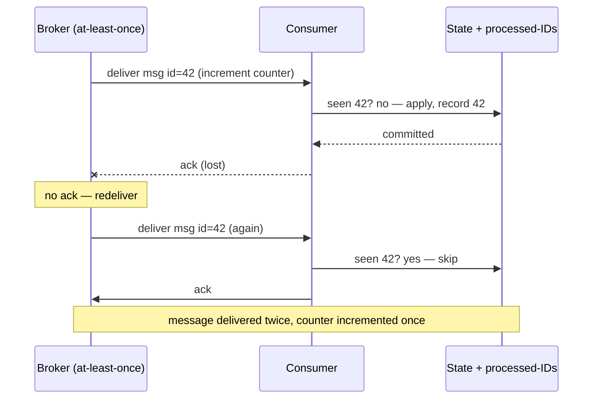

# Idempotency & Exactly-once

> **Prerequisites:** [Distributed Transactions](/synapse/system-design-from-first-principles/distributed-data/distributed-transactions), [Stream Processing](/synapse/system-design-from-first-principles/building-blocks/stream-processing) | **You'll be able to:** design a client-supplied idempotency-key flow end to end, and explain precisely why "exactly-once" means effect-not-delivery.

## The problem (why this exists)

A user taps **Pay $50**. Your payment service calls the card network, the charge succeeds, and the service starts writing the confirmation back to the user — and right then the response is lost. Maybe the user's phone dropped off Wi-Fi, maybe a load balancer timed out, maybe a network blip swallowed the packet. The user sees a spinner, then an error. What do they do? They tap **Pay $50** again.

Here is the whole difficulty in one sentence: **the client cannot tell the difference between "the request never arrived" and "the request succeeded but the reply got lost."** From the outside, a timeout looks identical in both cases. If the client gives up, a legitimate payment may be silently dropped. If the client retries — which is the only safe default, because dropping real work is worse — it risks charging the customer twice.

This is not an edge case you can wave away. It is a direct consequence of the faults you already met in [Faults, Clocks & Time](/synapse/system-design-from-first-principles/distributed-data/faults-clocks-and-time): the network can delay, drop, duplicate, and reorder messages, and an unbounded delay is indistinguishable from a loss. DDIA makes the point starkly with the transaction case: a client sends `COMMIT`, then loses its connection before hearing back, and now it genuinely cannot know whether the transaction committed or aborted [DDIA2 p. 563]. A database transaction can be safely retried in general, but a retry after a *lost commit acknowledgment* causes a duplicate unless you add application-level deduplication [DDIA2 p. 288].

So retries are mandatory — any client that gives up on the first timeout will eventually lose real writes — and once retries are mandatory, **duplicates are inevitable.** The entire discipline of idempotency exists to make that inevitability harmless: to arrange things so that the second, third, and tenth delivery of "Pay $50" all collapse into the single effect the user intended.

## Intuition first

An operation is **idempotent** if doing it many times has the same effect as doing it once. That is the whole definition, and it is worth saying in plain language before any formalism: *a retry of an idempotent operation is free.* If the second delivery lands, nothing bad happens; the state is already what it should be.

Some operations are born idempotent. "Set the thermostat to 20°C" is idempotent — send it once or five times, the thermostat ends at 20°C. "Delete key `X`" is idempotent — after the first delete the key is gone, and deleting a gone key is a no-op [DDIA2 p. 528]. An HTTP `PUT` that replaces a resource with a specific value is idempotent for the same reason: you're asserting a final state, not requesting a relative change.

Other operations are born *not* idempotent, and they're the dangerous ones. "Add $50 to the balance" is not idempotent — run it twice and the balance is $100 too high [DDIA2 p. 528]. "Increment the view counter," "append a row," "send the email," "charge the card" — every one of these has a cumulative effect, so every duplicate delivery corrupts the result. DDIA is blunt about the stakes: processing a message twice is a form of data corruption, like double-charging a customer or double-incrementing a counter [DDIA2 p. 562].

The engineering move, then, is to take an operation that is *not* naturally idempotent and *make* it idempotent. There are only a few ways to do this, and they're all variations on one idea: **give the operation an identity, and remember what you've already done with that identity.** If a request carries a unique key and the server has seen that key before, the server doesn't do the work again — it just replays the answer it computed the first time. The counter isn't incremented twice because the second request never reaches the increment; it hits the "I've seen this already" check and stops.

<div style="border-left:4px solid #195045;background:rgba(25,80,69,0.08);padding:0.6rem 1rem;border-radius:0 0.5rem 0.5rem 0;margin:1.25rem 0">

💡 **The whole lesson in one sentence.** Retries are mandatory, so duplicates are inevitable — the fix is not to prevent the duplicate delivery (you can't) but to make the *handler* idempotent, so the duplicate has no additional effect.

</div>

## How it works

### Four ways to make an operation idempotent

**1. Natural idempotency — assert a final state, not a delta.** The cheapest idempotency is the kind you get for free by changing the operation's shape. "Set balance to $150" is idempotent; "add $50" is not. A `PUT /profile {name: "Ana"}` is idempotent; a `POST` that appends is not. Where you can express an operation as *setting a value* or *deleting a thing* rather than *changing it by an amount*, you inherit idempotency with no bookkeeping [DDIA2 p. 528]. This is why [API Design](/synapse/system-design-from-first-principles/foundations/api-design) treats `PUT` and `DELETE` as idempotent by contract — the shape carries the guarantee.

**2. Idempotency keys — the Stripe pattern.** When the operation genuinely is a cumulative side effect (charge a card, place an order), you attach a **client-supplied unique identifier** to the request. The client generates a fresh key — a UUID, or a hash of the meaningful request fields — before the *first* attempt, and reuses the *same* key on every retry of that same intent. The server keeps a table keyed by that identifier: on arrival it looks the key up, and if it has already processed it, the server skips the work and **replays the stored result** — the same response body, the same status code — as if it were executing for the first time. The card is charged once; every retry returns the original charge.



The key discipline: the identifier must be generated by the *client* and survive across retries, because only the client knows that attempt #2 is "the same intent" as attempt #1. If the server minted the ID, every retry would look like a brand-new request. This is exactly DDIA's request-ID scheme: generate a unique request ID (a UUID, or a hash of the form fields), carry it through the flow, and pass it to the database so only one execution happens per ID [DDIA2 p. 564].

**3. Deduplication by a uniqueness constraint or conditional write.** How does the server enforce "only once per key" when two retries might race each other concurrently? It leans on the database's own atomicity. Put a `UNIQUE` constraint on the `request_id` column and `INSERT` the request row *in the same transaction* as the effect: a duplicate `INSERT` fails and aborts the whole transaction, so the second execution can never commit [DDIA2 p. 564]. This is stronger than an application-level "check if it exists, then insert," which is itself racy under weak isolation (the phantom/write-skew problem from [Transactions & Isolation](/synapse/system-design-from-first-principles/distributed-data/transactions-and-isolation)); a relational uniqueness constraint holds even at weak isolation levels [DDIA2 p. 564]. The stream-processing equivalent is the same shape: keep a table of processed message IDs, and inside one transaction check the ID, do the work, and record the ID — a uniqueness constraint stops a racing retry [DDIA2 p. 334].

**4. Versioning / conditional writes.** When the operation is an *update* to existing state, you can dedup by version: the write only applies if the record is still at the version the client read (`UPDATE … WHERE version = 7`), or you stamp each write with the source message's offset and skip any offset you've already applied. DDIA's canonical example: store the Kafka message offset alongside the database write, so a replayed message whose offset is already recorded is detected and skipped [DDIA2 p. 528]. This is the same compare-and-set idea from [Dealing with Contention](/synapse/system-design-from-first-principles/patterns/dealing-with-contention), reused to reject a duplicate rather than a concurrent conflict.

### At-least-once delivery + idempotent handler = effectively-once

Now zoom out from a single HTTP call to a whole pipeline: a producer, a broker, a consumer. Message brokers give you **at-least-once** delivery — they redeliver until they get an acknowledgment, which means a consumer that crashes after processing but before acking will see the message *again* [DDIA2 p. 498]. In a log-based broker the same thing happens on failover: messages processed but not yet recorded in the committed offset are reprocessed a second time [DDIA2 p. 498]. Delivery, in other words, is at-least-once by nature.

You don't fight this. You *pair* it with an idempotent consumer, and the two together give you the effect you actually wanted:



The message was *delivered* twice; its effect happened *once*. That is what the industry means by "exactly-once," and DDIA is emphatic that the name is misleading — "effectively-once would be a more descriptive term" [DDIA2 p. 527]. Records may be *processed* multiple times, but the visible effect is arranged to be as if each input were processed exactly once [DDIA2 p. 527]. There is no magic that makes the network deliver a message precisely once; there is at-least-once delivery plus an idempotent handler, and the combination *appears* exactly-once.

### The dedup must be end-to-end, not just at the transport

Here is the subtlety that separates a correct design from one that looks correct. It is tempting to think a lower layer already solved this. TCP deduplicates packets using sequence numbers — but only *within a single TCP connection* [DDIA2 p. 563]. The moment the client reconnects and retries, it's a new connection, and TCP's dedup scope is gone. A database transaction deduplicates within *its* scope — but it can't stop a user resubmitting a form after a timeout. The browser's `POST` succeeds, the response is lost, the user hits reload, and "Are you sure you want to submit this form again?" is exactly this failure; Post/Redirect/Get hides the warning but doesn't help on a timeout [DDIA2 p. 563–564].

This is the **end-to-end argument** (Saltzer, Reed, and Clark, 1984): a function like duplicate suppression can be completely and correctly implemented only with knowledge held at the *endpoints* of the communication — the application on each side — not by any intermediate layer [DDIA2 p. 565]. TCP dedup and broker-level exactly-once are useful because they reduce the frequency of problems, but they are *not sufficient* on their own [DDIA2 p. 565–566]. The only complete solution is an identifier that the client generates and that is passed, unchanged, all the way down to the store that enforces uniqueness [DDIA2 p. 565]. The idempotency key is that end-to-end identifier. If you dedup only at the transport, you've solved the wrong layer.

### Where keys live, how long they're kept, and scoping

An idempotency key is state, so the practical questions are storage, lifetime, and scope.

- **Where they live.** In the same transactional store as the effect, so the "record the key" and "do the work" commit atomically (option 3 above). A separate cache (Redis) is common for the fast-path lookup, but the *authoritative* record must be transactional with the side effect, or a crash between "did the work" and "recorded the key" reopens the duplicate window.
- **How long they're kept.** Long enough to outlive any retry that could plausibly still arrive — client retry budgets, broker redelivery windows, human "reload the page tomorrow" behavior. Stripe retains idempotency keys for 24 hours `[web: stripe.com/docs/api/idempotent_requests]`; after that a reused key is treated as a fresh request. The tension is real: keep them forever and the table grows without bound; expire them too soon and a late retry re-executes.
- **Scoping.** A key is meaningful only within a scope — typically per merchant/account and per endpoint. The same random UUID from two different customers must not collide, and reusing a key with a *different* request body should be an error, not a silent replay of the wrong result.

<div style="border-left:4px solid #15448e;background:rgba(21,68,142,0.08);padding:0.6rem 1rem;border-radius:0 0.5rem 0.5rem 0;margin:1.25rem 0">

**Definition — idempotency key.** A unique identifier, generated by the *client* before the first attempt and reused unchanged on every retry of that same intent, that lets the server recognize a duplicate and replay the original result instead of re-executing the side effect.

</div>

## Trade-offs

| Technique | Gives you | Costs you | Use when |
| --- | --- | --- | --- |
| **Natural idempotency (PUT / DELETE / set-to-value)** | Free idempotency, no bookkeeping | Only works when the op can be expressed as a final state, not a delta | You control the API shape and the operation is a state assignment |
| **Idempotency key + replay (Stripe pattern)** | Safe retries for genuine side effects; client gets the *same* answer every time | A stored key→result table; storage, TTL, and scoping to manage | Cumulative external effects: payments, orders, "send" actions |
| **Uniqueness constraint / conditional write** | Race-safe dedup enforced by the DB, even under weak isolation | Requires the effect and the ID to share one transaction | You need two concurrent retries to be resolved atomically |
| **Offset / version dedup** | Cheap skip of already-applied updates in a stream | Assumes ordered, deterministic replay; needs per-key state | Stream consumers replaying a log after a crash |

The through-line: **idempotency is always "give the work an identity and remember it."** Natural idempotency hides the identity in the state itself (the final value); keys make the identity explicit; uniqueness constraints and offsets are how the store *enforces* "remember it" atomically. You pick based on whether you own the API shape, whether the effect is external, and whether concurrent retries can race.

## Numbers that matter

- **A timeout tells you nothing.** The client's decision to retry is forced by a single fact: after a timeout, the probability that the write succeeded is neither 0 nor 1. There is no threshold that makes "assume it failed" safe — dropping real writes is a correctness bug, so the retry rate is effectively *whatever the timeout-and-failure rate is*, and every one of those retries is a potential duplicate.
- **Key retention is a storage-vs-safety dial.** At 10k payments/sec, a 24-hour key window is ~864M rows of `key → result` to hold before expiry. Keep them longer for safety against very late retries; expire them to bound the table. See [Estimation & the Numbers](/synapse/system-design-from-first-principles/foundations/estimation-and-numbers) for sizing this kind of table.
- **Dedup is one extra lookup on the hot path.** Every write now pays a keyed read (and an insert) against the idempotency store. That's the price of safety; it's why the fast-path lookup often lives in a cache while the authoritative record stays transactional.

## In production

**Stripe** is the reference implementation: send an `Idempotency-Key` header on any `POST`, and Stripe stores the first result and replays it for 24 hours, so a client that retries a charge after a network blip gets the original charge back rather than a second one `[web: stripe.com/docs/api/idempotent_requests]`. This is the pattern the whole [Design a Payment System (Stripe)](/synapse/system-design-from-first-principles/case-studies/stripe-payments) case study is built on, alongside the CDC/outbox durability backbone in [Event-driven Architecture: CQRS, Outbox & CDC](/synapse/system-design-from-first-principles/patterns/event-driven-cqrs-outbox-cdc).

**Ad-click aggregation** is the counting version of the same problem: an at-least-once ingestion pipeline will deliver some click events twice, and if you naively `+1` per delivery your advertiser bills are wrong. The fix is an idempotent counter — dedup click events by a unique event ID before aggregating, so a redelivered click doesn't double-count [DDIA2 p. 490, 528]. See [Design an Ad Click Aggregator](/synapse/system-design-from-first-principles/case-studies/ad-click-aggregator).

**Job schedulers** promise at-least-once execution, which means a worker may run the same job twice (a crash after doing the work but before recording success looks identical to a job that never ran). The robust designs make the job handler itself idempotent — the most durable approach is designing the job so a re-run is harmless, backed by a dedup table when it can't be [DDIA2 p. 334]. See [Design a Job Scheduler](/synapse/system-design-from-first-principles/patterns/long-running-tasks) and [Design a Job Scheduler](/synapse/system-design-from-first-principles/case-studies/job-scheduler).

**Messaging (WhatsApp)** relies on client-generated message IDs so that a message re-sent after a flaky connection is de-duplicated by the recipient rather than shown twice — the same end-to-end identifier idea, applied to chat delivery. See [Design WhatsApp](/synapse/system-design-from-first-principles/case-studies/whatsapp).

Across all of these, the deeper architectural pattern is the one DDIA advocates: reliable stream processing preserves *integrity* without distributed transactions by representing the write as a single atomically-appended event, deriving downstream updates deterministically, and passing a **client-generated request ID through every level** for end-to-end deduplication [DDIA2 p. 572–573]. It's the same toolkit as [Multi-step Processes & Sagas](/synapse/system-design-from-first-principles/patterns/multi-step-processes-and-sagas), where each step must be safely retryable for the saga to make progress.

## Pitfalls & interview traps

<div style="border-left:4px solid #da5233;background:rgba(218,82,51,0.08);padding:0.6rem 1rem;border-radius:0 0.5rem 0.5rem 0;margin:1.25rem 0">

⚠️ **"We use a queue with exactly-once delivery, so we're safe" is a red flag.** There is no such thing as exactly-once *delivery* over an unreliable network — the network can always duplicate or drop, and a broker that claims "exactly-once" achieves it with at-least-once delivery plus idempotent processing behind the scenes [DDIA2 p. 527]. Equally wrong is "TCP already deduplicates, so retries are fine": TCP dedup lives inside one connection and evaporates the moment the client reconnects to retry [DDIA2 p. 563]. Dedup at the transport is not dedup end-to-end. The correct sentence is: "at-least-once delivery **plus an idempotent handler keyed on a client-supplied ID**, checked at the store — that gives us exactly-once *effect*."

</div>

Three more that trip people up:

- **An idempotency key protects one intent, not the user's wallet.** If the *client* generates a **new** key for each button press, then a double-tap produces two different keys — and the server sees two distinct intents and charges twice. The key only collapses duplicates that carry the *same* key; it does nothing about a user (or buggy client) that issues genuinely separate requests. Deliberate double-submission protection is a different concern (debounce, a per-form token) from retry idempotency.
- **Recording the key and doing the work must be atomic.** If you charge the card, then crash before writing the key, the retry re-charges. The key write and the effect must commit together (one transaction with a uniqueness constraint), or the store you dedup against must be the same store you write the effect to [DDIA2 p. 334].
- **Idempotent replay assumes deterministic, single-writer processing.** Offset-based dedup relies on the same messages replaying in the same order, deterministic processing, and no *other* node concurrently updating the same value — and on failover you may need a fencing token to block a presumed-dead node from writing [DDIA2 p. 528]. "Just make it idempotent" quietly assumes those conditions; name them.

## Check yourself

```quiz
{"prompt": "A mobile client charges a card. On the FIRST attempt it generates Idempotency-Key A; the response times out, so on retry it generates a NEW key, B, for the same charge. What happens?", "options": ["The server replays the first result — one charge", "The server sees two distinct keys and charges the card twice", "The retry is rejected because B is newer than A", "TCP deduplicates the second request automatically"], "answer": "The server sees two distinct keys and charges the card twice"}
```

```quiz
{"prompt": "A candidate says: 'I'll use a message broker with exactly-once delivery, so duplicates are impossible.' What's the most accurate correction?", "options": ["Correct — modern brokers guarantee each message is delivered exactly once over the network", "Exactly-once DELIVERY is impossible over an unreliable network; you get at-least-once delivery plus an idempotent handler, which yields exactly-once EFFECT", "Brokers give at-most-once, so you'll actually lose messages", "It's fine as long as the broker uses TCP, which deduplicates packets"], "answer": "Exactly-once DELIVERY is impossible over an unreliable network; you get at-least-once delivery plus an idempotent handler, which yields exactly-once EFFECT"}
```

```quiz
{"prompt": "Why is deduplicating at the TCP layer (packet sequence numbers) insufficient to prevent a double charge from a retried payment?", "options": ["TCP sequence numbers aren't unique enough", "TCP dedup only works within a single connection; a client retry opens a new connection, so the duplicate is invisible to TCP — dedup must be end-to-end", "TCP doesn't guarantee ordering", "Because TCP is slower than UDP for payments"], "answer": "TCP dedup only works within a single connection; a client retry opens a new connection, so the duplicate is invisible to TCP — dedup must be end-to-end"}
```

```quiz
{"prompt": "Which of these operations is naturally idempotent, requiring no dedup bookkeeping to be retry-safe?", "options": ["POST that appends a comment to a thread", "UPDATE balance SET balance = balance + 50", "PUT /thermostat {target: 20} (set the value)", "INCR page_views in Redis"], "answer": "PUT /thermostat {target: 20} (set the value)"}
```

<details>
<summary>Walk through why retries are mandatory in the first place — why can't the client just treat a timeout as "it failed" and give up?</summary>

Because a timeout is ambiguous: it happens both when the request never arrived *and* when the request succeeded but the response was lost [DDIA2 p. 563]. If the client treats every timeout as failure and gives up, it will silently drop writes that actually succeeded on the server — a correctness bug. If it treats every timeout as "maybe succeeded" and retries, it risks duplicates. Since dropping real work is worse than a harmless duplicate, retrying is the only safe default — and that is precisely why the *handler* must be made idempotent, so the unavoidable duplicate does no damage [DDIA2 p. 288].
</details>

<details>
<summary>Sketch the end-to-end idempotency-key flow for a payment, and say exactly which store enforces "only once."</summary>

The client generates a UUID before the first attempt and sends it as an `Idempotency-Key` header, reusing the *same* key on every retry. The payment service, inside one database transaction, `INSERT`s a row into a `requests` table that has a `UNIQUE(request_id)` constraint, performs the charge, and commits — so the key and the effect are atomic. On a retry, the duplicate `INSERT` violates the uniqueness constraint and the transaction aborts, or the service looks the key up first and replays the stored result [DDIA2 p. 564, 334]. The *database's uniqueness constraint* is what enforces once-only, because it holds even under weak isolation and even when two retries race concurrently — an application-level check-then-insert would not [DDIA2 p. 564]. The key travels end-to-end from client to that constraint; no intermediate layer (TCP, the broker) is trusted to dedup.
</details>

## Sources

DDIA2 ch. 8 pp. 288, 329–330, 334 (exactly-once message processing, idempotent dedup by message-ID, retry ambiguity) · DDIA2 ch. 12 pp. 498, 527–528 (at-least-once redelivery, effectively-once, idempotence, offset-tagged writes) · DDIA2 ch. 13 pp. 562–565, 572–573 (end-to-end argument, request IDs, uniqueness constraints, TCP dedup scope) · [web: stripe.com/docs/api/idempotent_requests] (24-hour key retention) · Cross-links: [Distributed Transactions](/synapse/system-design-from-first-principles/distributed-data/distributed-transactions), [Stream Processing](/synapse/system-design-from-first-principles/building-blocks/stream-processing), [Faults, Clocks & Time](/synapse/system-design-from-first-principles/distributed-data/faults-clocks-and-time), [Transactions & Isolation](/synapse/system-design-from-first-principles/distributed-data/transactions-and-isolation), [Dealing with Contention](/synapse/system-design-from-first-principles/patterns/dealing-with-contention), [Multi-step Processes & Sagas](/synapse/system-design-from-first-principles/patterns/multi-step-processes-and-sagas), [Event-driven Architecture: CQRS, Outbox & CDC](/synapse/system-design-from-first-principles/patterns/event-driven-cqrs-outbox-cdc), [Design a Payment System (Stripe)](/synapse/system-design-from-first-principles/case-studies/stripe-payments), [Design an Ad Click Aggregator](/synapse/system-design-from-first-principles/case-studies/ad-click-aggregator), [Design a Job Scheduler](/synapse/system-design-from-first-principles/case-studies/job-scheduler), [Design WhatsApp](/synapse/system-design-from-first-principles/case-studies/whatsapp)
