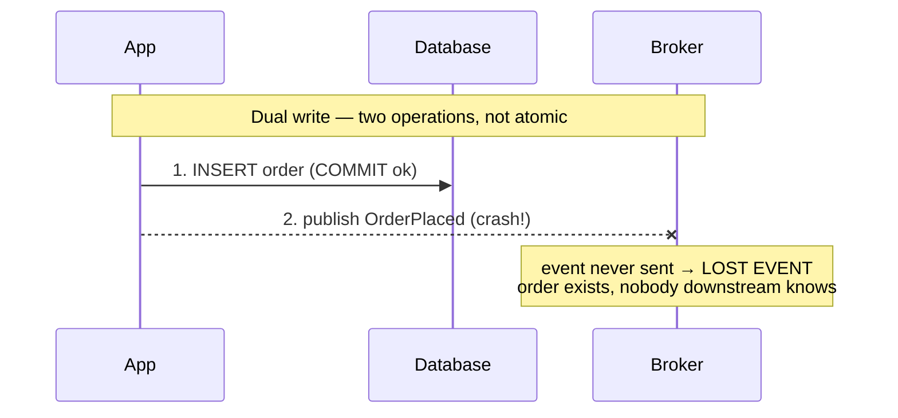
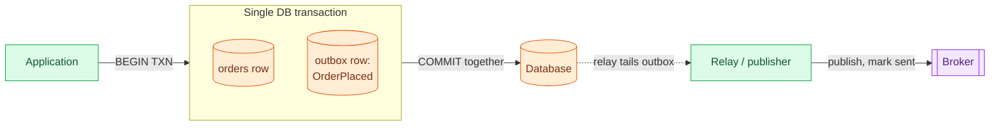

# Event-driven: CQRS, Outbox & CDC

> **Prerequisites:** [Stream Processing](/synapse/system-design-from-first-principles/building-blocks/stream-processing), [Queues & Brokers](/synapse/system-design-from-first-principles/building-blocks/queues-and-brokers) | **You'll be able to:** (1) explain how event-driven systems decouple services and derive read models from an event log; (2) spot the dual-write hazard that silently loses or fabricates events; (3) choose between the outbox pattern and change data capture to emit events atomically.

## The problem (why this exists)

Two systems must agree on what just happened, and there is no safe moment to tell them both.

A customer places an order. Your service writes the order row to its database. Then it publishes an `OrderPlaced` event so the warehouse can pick the goods, the email service can send a receipt, and the analytics pipeline can count the sale. That is two operations: a database commit and a message publish. They are not one atomic act. So ask the uncomfortable question: what happens if the process crashes *between* them?

If the database commit succeeds and the publish never happens, the order exists but no warehouse, no email, and no analytics ever hear about it — a **lost event**. Flip the order of operations and it gets worse: publish first, then commit, and a crash leaves a `OrderPlaced` event racing through your system for an order that was never saved — a **phantom event**. Either way, no error is raised. The order looks fine in the database. The bug surfaces days later as an unshipped package or a revenue number that doesn't reconcile.

This is the **dual-write problem**, and it is the reason a whole family of patterns exists. The synchronous alternative — have the order service call the warehouse, the mailer, and analytics directly over HTTP and wait for each — trades the dual-write hazard for tight coupling: now a slow mailer stalls checkout, and any downstream outage takes the whole flow down. Event-driven architecture, event sourcing, CQRS, the outbox pattern, and change data capture are all answers to the same underlying question: **how do you reliably turn one thing that happened into a stream of facts that many independent systems can consume, without losing events, fabricating them, or coupling everyone together?**

## Intuition first

Start from a single idea that reframes everything: **an event is a fact about something that already happened, written down once and never changed.** "Seat 14C was booked." "The cart had item X removed." "Payment of $30 was captured." Past tense, immutable, self-contained.

Now the trick. Instead of storing *current state* and mutating it in place, you store the *sequence of events* and treat that log as the single source of truth. Current state is not something you keep — it is something you **compute** by replaying the events from the beginning:

```
state = fold(events)   # apply each event in order to an accumulator
```

Your bank balance is not a number the bank "has"; it is the sum of every credit and debit ever applied to your account. Available seats in a theater are the capacity minus every processed booking plus every cancellation. This is exactly the perspective the [Data Models](/synapse/system-design-from-first-principles/data-foundations/data-models) lesson introduced as **event sourcing**, and it is the same shape as the operation log behind a collaborative editor like [Google Docs](/synapse/system-design-from-first-principles/case-studies/google-docs): the document is the fold of every keystroke operation, not a blob you overwrite.

Once the log is the source of truth, a second idea falls out for free. If you can build *one* view by folding events, you can build *many*. A booking dashboard, a search index, a per-user cache, a badge printer — each is its own fold of the same log, shaped for the way it will be read. You stop asking "how do I store this data?" and start asking "which events happened, and what views do I want from them?"

That reframing is the heart of everything below. Emit events. Build views from them. The three hard problems — decoupling, splitting reads from writes, and getting the events out of the database safely — are all consequences of taking this idea seriously.

## How it works

### Event-driven architecture: react, don't call

In a request/response system, service A knows about service B: it calls B's API and waits. In an **event-driven** system, A knows nothing about who cares. It emits an event to a durable log — Kafka, Kinesis, a log-based broker (see [Queues & Brokers](/synapse/system-design-from-first-principles/building-blocks/queues-and-brokers)) — and moves on. B, C, and D each subscribe and react on their own schedule.

The payoff is **loose coupling** in two directions. At the system level, the log buffers for a slow or crashed consumer, so a failing analytics job cannot stall checkout and producers keep running — a local fault stays local [DDIA2 p. 549]. At the human level, teams own their consumers behind a well-defined event contract and evolve independently [DDIA2 p. 550]. The price is **eventual consistency**: consumers lag the producer, so for a moment the warehouse has not yet heard about an order the database already committed. And debugging gets harder — there is no single call stack tracing a request end to end; a business action becomes a diffuse ripple across many asynchronous consumers.

### Event sourcing: the log is the source of truth

Event-driven systems *emit* events but often still keep mutable state as their system of record. **Event sourcing** goes further: the append-only event log itself is the source of truth, and application state is strictly derived [DDIA2 p. 102]. Events are named in the past tense and are never updated or deleted — a cancellation is a *new* event appended after the booking, not an erasure of it [DDIA2 p. 103]. This buys reproducibility (delete a buggy view and recompute it from the log), a built-in audit trail valued in regulated industries, and clear intent — "booking was cancelled" says more than a mutated row [DDIA2 pp. 103–104]. Mutable state and an append-only log "are two sides of the same coin" — state is always the result of folding a sequence of events [DDIA2 p. 509].

### CQRS: split the write model from the read models

Here is where event-driven design meets the scaling ladder. In the [Scaling Reads](/synapse/system-design-from-first-principles/patterns/scaling-reads) lesson you added replicas and caches; in [Scaling Writes](/synapse/system-design-from-first-principles/patterns/scaling-writes) you denormalized so reads wouldn't need expensive joins. **CQRS — Command Query Responsibility Segregation — is the natural endpoint of that ladder**: stop forcing one representation to serve both writes and every query. Write commands in the form that is easy and correct to write (an event log, or a normalized write model); derive one or more **read models**, each optimized for a specific query, and keep them up to date by consuming the log [DDIA2 p. 102].

<div style="border-left:4px solid #15448e;background:rgba(21,68,142,0.08);padding:0.6rem 1rem;border-radius:0 0.5rem 0.5rem 0;margin:1.25rem 0">

**Definition.** A **command** is a request to change state that must be *validated* before it becomes a fact; once accepted it is appended as an event. A **read model** (also called a projection or materialized view) is a query-shaped representation derived from those events. The log contains only valid events — a view-building consumer is never allowed to reject one [DDIA2 pp. 102–103].

</div>

The classic diagram: one write model feeds an event log, and several read models fan out from it.

```d2
direction: right
classes: {
  svc:   {style: {fill: "#dcfce7"; stroke: "#16a34a"}}
  async: {style: {fill: "#f3e8ff"; stroke: "#9333ea"}}
  data:  {style: {fill: "#ffedd5"; stroke: "#ea580c"}}
  client: {style: {fill: "#f3f4f6"; stroke: "#6b7280"}}
}
cmd: "Command (validate)" {class: svc}
log: "Event log\n(source of truth)" {class: async}
sql: "Relational read model\n(reporting)" {class: data}
search: "Search index\n(full-text)" {class: data}
cache: "Per-user cache\n(dashboard)" {class: data}
reader: "Query API" {class: client}

cmd -> log: append event
log -> sql: fold
log -> search: fold
log -> cache: fold
reader -> sql: query
reader -> search: query
reader -> cache: query
```

The crucial caveat: read models are updated **asynchronously**, so they are *eventually consistent* with the write model. A user may not immediately read their own write — CQRS's biggest downside [DDIA2 p. 511]. Every materialized view must also process events in **exactly the same order** as the log, or two views will disagree [DDIA2 p. 105].

### The dual-write problem, precisely

Now back to the hazard from the opening. The naive way to emit events is a **dual write**: the application writes to the database and *separately* publishes to the broker. This fails two ways. First, **partial failure** — one write succeeds, the other doesn't, and there is no error [DDIA2 p. 502]. Second, a **race condition** — two clients' writes can reach the database and the broker in opposite orders, leaving the two systems permanently inconsistent with nobody in charge of ordering [DDIA2 pp. 501–502].



The fix everyone reaches for first — "just publish inside the transaction" — doesn't work, because the message broker is a *different* system that cannot join the database transaction. What you *can* do is make both writes land in the **same database**, so a single transaction covers them atomically. That is the outbox pattern.

### The outbox pattern: one transaction, then a relay

Write the event into an **outbox table** in the *same transaction* as the state change. Because both rows commit together, you can never have the order without its event or vice versa — the atomicity you wanted, achieved entirely inside one database [DDIA2 pp. 507–508]. A separate **relay** (a message relay / publisher) then reads unpublished outbox rows and pushes them to the broker, marking them sent.



The relay guarantees **at-least-once** delivery: if it crashes after publishing but before marking the row sent, it re-publishes on restart. Consumers must therefore be **idempotent** (dedupe by event ID) — the same requirement you'll meet again in exactly-once processing. The outbox's other quiet benefit: the outbox table has its *own* schema, decoupling your internal database columns from the public event contract, so an internal column rename doesn't break downstream consumers [DDIA2 pp. 507–508].

### Hands-on: run the outbox

A runnable implementation lives at `proof-of-concepts/05-patterns/08-event-driven-cqrs-outbox-cdc/` in the repo root — a real Postgres (via `./run`), a Unit of Work that writes the order and its event in one transaction, a relay that polls the outbox with `FOR UPDATE SKIP LOCKED`, and an idempotent consumer.

```bash
cd proof-of-concepts/05-patterns/08-event-driven-cqrs-outbox-cdc
./run            # start Postgres + run the walkthrough
./run test       # mypy --strict + smoke (all three guarantees)
./run stop       # tear down
```

The walkthrough is precisely the diagram above, made to fail on purpose: five orders write atomically; a rejected order writes *neither* row nor event; then the relay is crashed *after* publishing two events but *before* marking them sent — so the retry re-publishes them and the broker ends up with **9** messages including **2** duplicates, which the idempotent consumer absorbs to apply exactly **7** effects. The atomic write and the `SKIP LOCKED` poll run against real Postgres; the broker and consumer are simulated in-process so the duplicate is countable — the README maps exactly what is real versus simulated.

### Change data capture: no dual write at all

The outbox still asks the application to write an extra row. **Change data capture (CDC)** removes even that. Every database already keeps a **replication log** — an ordered stream of every committed write, used to feed replicas (see [Replication](/synapse/system-design-from-first-principles/distributed-data/replication)). CDC taps that log directly: a connector tails the commit stream and turns each row change into an event [DDIA2 p. 503]. The database is the single leader whose commit order is authoritative; every derived system becomes a follower applying changes in that same order [DDIA2 pp. 503–504]. There is no second write to lose, because there is no second write.

```d2
direction: right
classes: {
  data:  {style: {fill: "#ffedd5"; stroke: "#ea580c"}}
  async: {style: {fill: "#f3e8ff"; stroke: "#9333ea"}}
  svc:   {style: {fill: "#dcfce7"; stroke: "#16a34a"}}
}
db: "Source DB\n(single leader)" {class: data}
wal: "Replication log\n(WAL / binlog)" {class: data}
conn: "CDC connector\n(Debezium)" {class: svc}
stream: "Event stream\n(Kafka topic)" {class: async}
idx: "Search index" {class: data}
dw: "Warehouse" {class: data}

db -> wal: every commit
wal -> conn: tail
conn -> stream: emit change events
stream -> idx: apply in order
stream -> dw: apply in order
```

CDC is almost always **asynchronous** — the source database commits without waiting for consumers — so all the usual replication-lag caveats apply [DDIA2 p. 504]. Bootstrapping a brand-new consumer needs an **initial snapshot** consistent with a known log offset, after which it applies the ongoing stream; Debezium uses Netflix's DBLog watermarking to take that snapshot without stopping writes [DDIA2 pp. 504–505].

**CDC versus event sourcing** are often confused. CDC extracts *low-level* row changes from the replication log after the fact, and the application may not even know it's happening — easy to bolt onto an existing database [DDIA2 p. 507]. Event sourcing captures *high-level application intent* ("SeatBooked", not "row 14C updated") and is a deliberate architectural commitment where the log is the system of record [DDIA2 pp. 506–507].

## Trade-offs

The recurring decision is **how to get events out of the database**: outbox or CDC. Both fix the dual-write problem; they differ in effort, coupling, and fidelity.

| Option | Gives you | Costs you | Use when |
| --- | --- | --- | --- |
| **Outbox pattern** | Atomic write + event in one DB transaction; a stable public event schema decoupled from internal tables; explicit, application-authored events | App must write an extra row and run a relay; extra write load; events limited to what the app remembers to emit | You control the application code and want clean, intentful events with a curated contract |
| **Change data capture** | No dual write and no app change — taps the existing replication log; captures *every* committed change in true commit order | Events mirror low-level table structure; a schema change can ripple to consumers; connector infra (Debezium/Kafka Connect) to operate | You must integrate an existing or third-party database, or want every change with zero app modification |
| **Naive dual write** *(anti-pattern)* | Nothing safe | Silent lost/phantom events and permanent inconsistency | Never — this is the hazard the other two exist to fix |

A second axis worth naming — **event-driven vs request/response** — sits underneath the whole family: asynchronous events give loose coupling, buffering, and replay at the cost of eventual consistency and harder debugging; synchronous calls give immediate read-your-write and a simple mental model at the cost of tight coupling and cascading failures. Neither wins outright; you pick per interaction.

## Numbers that matter

- **Log throughput.** Log-based brokers achieve millions of messages/second per topic via sharding, despite writing every message to disk, and get durability from replication [DDIA2 p. 497]. Appends are sequential, so an event log absorbs write bursts better than a random-access database and lets downstream views catch up at their own pace [DDIA2 p. 104].
- **How much history the log buffers.** A single 20 TB HDD writing sequentially at ~250 MB/s takes about **22 hours** to fill [DDIA2 p. 499]. That is the floor: a disk-backed log can buffer at least a day of events, and real deployments keep days to weeks — which is also how long a consumer can be down before it misses data.
- **Replication / consumer lag.** CDC and CQRS read models are asynchronous, so budget for lag measured in milliseconds-to-seconds under health, and much longer while a consumer catches up after an outage. Never assume a read model is current the instant a write commits.
- **End-to-end freshness target.** Pushing a state change all the way from one device through logs and processors to another device's UI can be done in **under one second** end-to-end [DDIA2 p. 559] — the yardstick for "real-time" event-driven UX.

<div style="border-left:4px solid #195045;background:rgba(25,80,69,0.08);padding:0.6rem 1rem;border-radius:0 0.5rem 0.5rem 0;margin:1.25rem 0">

💡 **Rule of thumb, not from source:** size your log retention to at least your worst realistic consumer-downtime window plus your snapshot-rebuild time. If a consumer can be offline for a weekend, a 22-hour buffer will silently drop its data.

</div>

## In production

**CDC tooling.** [Debezium](https://debezium.io) is the de facto open-source CDC platform, with connectors for MySQL, PostgreSQL, Oracle, SQL Server, Cassandra and more; it parses each database's replication log and emits change events, typically onto Kafka via Kafka Connect [DDIA2 p. 504]. Kafka's protocol has become a de facto event-stream standard, and Kafka Connect sinks export the stream into search indexes, caches, and warehouses [DDIA2 pp. 504, 550]. Netflix's DBLog algorithm (used by Debezium) is what lets a fresh consumer take a consistent initial snapshot without pausing production writes [DDIA2 pp. 504–505].

**Event logs as product infrastructure.** [Stripe](https://stripe.com) exposes an event log as a first-class API: every state change to a charge or subscription is an immutable `Event` object that merchants consume via webhooks — the same event-sourcing shape used to keep external systems in sync, and the backbone of the [Stripe payments](/synapse/system-design-from-first-principles/case-studies/stripe-payments) design. The [ad-click aggregator](/synapse/system-design-from-first-principles/case-studies/ad-click-aggregator) is a canonical event-driven analytics pipeline: clicks are events streamed into windowed aggregations. In a [news feed](/synapse/system-design-from-first-principles/case-studies/news-feed), CDC-style change events drive cache invalidation and materialized-timeline maintenance — a post event fans out to every follower's read model.

**Read-model / IVM engines.** Keeping CQRS read models current is materialized-view maintenance, and a class of streaming databases now automate it: Kafka Streams and ksqlDB maintain views from Kafka topics, while **incremental view maintenance** engines — Materialize, RisingWave, ClickHouse, Feldera — convert SQL queries into operators that recompute only the changed data instead of periodically rebuilding the whole view [DDIA2 pp. 516–517]. Dedicated event-sourcing stores exist too (EventStoreDB, Marten on PostgreSQL, Axon), though a plain Kafka log with stream processors is the common substrate [DDIA2 p. 105].

## Pitfalls & interview traps

<div style="border-left:4px solid #da5233;background:rgba(218,82,51,0.08);padding:0.6rem 1rem;border-radius:0 0.5rem 0.5rem 0;margin:1.25rem 0">

⚠️ **The dual write drops events silently.** Writing to the database and *then* publishing to the broker as two separate operations will, eventually, lose an event or emit a phantom one on a crash between the two — with **no error raised**. This is not a rare edge case; at scale it happens daily. If an interviewer hears "then we publish the event," the expected follow-up is "what if that publish fails after the commit?" The correct answer is outbox or CDC, never "add a retry."

</div>

- **Reading your own write from an eventually-consistent read model.** After a command commits, the CQRS read model has *not* caught up yet. UI that immediately re-queries the read model shows stale data and users think their action failed. Mitigations: read the write model for the just-written entity, echo the command's result optimistically, or wait for the read model to advance past the event's offset — but never assume the read model is instantly current [DDIA2 p. 511].
- **Ordering only holds within a shard.** A log-based broker guarantees total order *within a partition*, not across partitions [DDIA2 pp. 496–497]. If related events (e.g., all events for one account) land on different partitions, consumers can apply them out of order. Route causally related events to the same partition by keying on a natural ID (user ID, account ID) [DDIA2 p. 498].
- **Reprocessing replays side effects.** Rebuilding a read model by replaying the log is a superpower — until an event handler sends an email or charges a card. Replaying then resends every confirmation and double-charges. Keep externally-visible side effects out of pure projections, or guard them with idempotency keys [DDIA2 p. 104].
- **Immutable logs and the right to be forgotten.** Event sourcing's "never delete" collides with GDPR erasure. A per-user log can be dropped wholesale, but a mixed log cannot; the usual escape is to store personal data outside the event or **crypto-shred** it (encrypt, then discard the key), which complicates recomputing derived state [DDIA2 pp. 104, 512].
- **At-least-once needs idempotent consumers.** Outbox relays and CDC connectors both redeliver on failure, so every consumer must dedupe — commonly by storing the processed event's offset or ID alongside its write and skipping duplicates [DDIA2 p. 528].

## Check yourself

```quiz
{"prompt": "An order service commits the order row, then publishes an OrderPlaced event to Kafka as a separate step. The process crashes immediately after the commit but before the publish. What is the result?", "options": ["The database rolls back the order because the event failed", "The order exists but no consumer ever learns of it — a lost event", "Kafka detects the missing event and requests a retry from the database", "Nothing is lost because the commit and publish are one atomic operation"], "answer": "The order exists but no consumer ever learns of it — a lost event"}
```

```quiz
{"prompt": "You must emit events from a third-party database whose application code you cannot modify, and you want every committed change captured in true commit order. Which approach fits best?", "options": ["The outbox pattern", "Change data capture (CDC)", "A naive dual write with retries", "Synchronous request/response calls"], "answer": "Change data capture (CDC)"}
```

```quiz
{"prompt": "In a CQRS design, a user submits a command that commits successfully, then the UI immediately re-queries the read model and shows the OLD value. Why?", "options": ["The command was silently rejected by the write model", "The read model is updated asynchronously and is only eventually consistent with the write model", "CQRS forbids reading after writing", "The event log lost the event"], "answer": "The read model is updated asynchronously and is only eventually consistent with the write model"}
```

```quiz
{"prompt": "What is the primary advantage the outbox pattern has over change data capture?", "options": ["It requires no application code changes", "It captures every low-level row change automatically", "The application authors explicit, intentful events with a public schema decoupled from internal tables", "It guarantees exactly-once delivery with no idempotent consumers needed"], "answer": "The application authors explicit, intentful events with a public schema decoupled from internal tables"}
```

<details>
<summary>Why doesn't "wrap the DB write and the Kafka publish in a transaction" solve the dual-write problem?</summary>

Because a transaction can only span a single transactional resource — the database. Kafka is a separate system that cannot enlist in the database's transaction, so there is no commit point that atomically covers both. (Heterogeneous distributed transactions via XA technically exist but have poor performance and fault tolerance, so they are rarely used for this.) The outbox pattern sidesteps the problem by making *both* writes land in the same database — the order row and the outbox row commit together — after which a relay moves the event to Kafka with at-least-once delivery.

</details>

<details>
<summary>Event sourcing and CDC both produce a log of changes. What's the real difference, and when would you pick each?</summary>

CDC extracts **low-level row changes** from the database's replication log *after* they happen; the application is often unaware, so CDC is easy to add to an existing or third-party system. But the events mirror table structure, so schema changes ripple downstream. Event sourcing makes the **application emit high-level intent events** ("SeatBooked") and treats the log as the system of record — richer semantics, better auditability, reproducible views, but a deliberate architectural commitment that touches all your write logic. Pick CDC to integrate systems you don't control or to avoid changing app code; pick event sourcing when intent, audit trails, and reprocessing are first-class requirements.

</details>

## Sources

DDIA2 ch. 12 pp. 500–508 (CDC, event sourcing, dual writes, outbox) · pp. 495–499 (log-based brokers, retention) · DDIA2 ch. 13 pp. 541–559 (derived data, systems of record, write/read paths) · DDIA2 ch. 3 pp. 101–105 (event sourcing & CQRS) · [web: debezium.io], [web: stripe.com] (tooling references)
