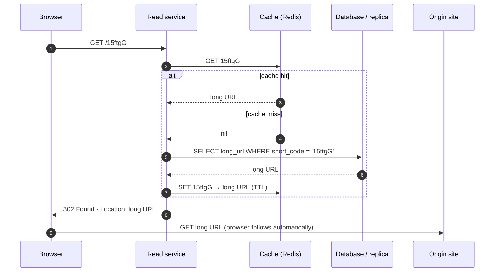

# Design a URL Shortener

> **Prerequisites:** [Estimation & the Numbers](/synapse/system-design-from-first-principles/foundations/estimation-and-numbers), [Indexing](/synapse/system-design-from-first-principles/data-foundations/indexing) | **You'll be able to:** run the full delivery framework end to end on the canonical opener; choose a short-code generation strategy with real collision math and defend it; scale a ~1000:1 read-heavy system with a cache and replicas — and predict what a 301 does to your analytics before the interviewer asks.

## The problem (why this exists)

"Let's design a URL shortener — something like Bitly." That's the whole brief. You paste in `https://example.com/collections/summer-2026?ref=newsletter&utm_campaign=...`, you get back `short.ly/15ftgG`, and anyone who clicks the short link lands on the long one.

This is the canonical opener of system design interviews, pitched explicitly at the junior end. Don't mistake that for "easy to do well": the product fits in one sentence, so the interview is decided by *how* you execute — whether your requirements are quantified, whether your uniqueness argument survives arithmetic, whether you notice that this system's whole personality is its read-to-write ratio. It is also the cleanest stage anywhere for two ideas this book keeps returning to: scaling reads and unique-ID generation.

We'll run it the way [the delivery framework](/synapse/system-design-from-first-principles/foundations/the-interview-at-10000-feet) says to: requirements → core entities → API → high-level design → deep dives. A book can afford what 45 minutes can't, so in places we go past any interviewable answer — into birthday-problem arithmetic and DDIA's ID-generator theory — and each descent is marked **Going deeper**.

**Functional requirements.** State the top features and explicitly park the rest — [scoping is a graded skill](/synapse/system-design-from-first-principles/foundations/nonfunctional-requirements):

1. Users can submit a long URL and get back a short one — optionally with a custom alias and an expiration date.
2. Anyone who opens a short URL is redirected to the original URL.

*Below the line:* accounts and authentication; click analytics. Park them out loud — shelving analytics now is what makes the 301-vs-302 decision later land.

**Non-functional requirements — quantified.** All four:

1. **Uniqueness:** no two long URLs may ever share a short code — a throwaway-sounding line that turns out to be the hardest requirement on the board.
2. **Latency:** redirects well under 100 ms — the redirect *is* the product, sitting in front of every page load it serves.
3. **Availability:** 99.99%, and availability beats consistency on the redirect path. Say the arithmetic aloud: that's ~52 minutes of downtime per *year*, which alone rules out any single box on the critical path.
4. **Scale:** 1 billion stored URLs, 100 million DAU.

Then name the structural fact hiding inside those numbers: reads dwarf writes. A short URL is created once and clicked forever — roughly 1,000 reads per write. That skew is why this question opens the module: it is the purest rep of [the scaling-reads pattern](/synapse/system-design-from-first-principles/patterns/scaling-reads).

## Intuition first

Start with the dumbest thing that works, because knowing precisely *where* it breaks is the design.

One server, one database table. `POST /urls` inserts a row mapping `short_code → long_url`; `GET /{code}` looks up the row and returns a redirect. The short code column is the primary key, so [the index comes for free](/synapse/system-design-from-first-principles/data-foundations/indexing) and every lookup is a single point read. This one box genuinely satisfies both functional requirements — for a hobby deployment you'd be done.

Now hold it against the non-functional requirements and watch three cracks open:

**Crack 1 — uniqueness under concurrency.** Where do short codes come from? Truncating the long URL is dead on arrival — every URL sharing a prefix collides. Hashing looks plausible until you run the collision math at a billion rows (we will). A counter fixes uniqueness by construction — and quietly becomes the design's only true *distributed-systems* problem the moment more than one server issues codes.

**Crack 2 — read volume.** 100M DAU at ~5 redirects each is ~500M redirects/day — about 5,800/second averaged. But traffic isn't averaged: size the peak at 100× — ~600k reads/second — deliberately harsh, because a shortener's job includes surviving someone else's viral moment. A single database node manages tens of thousands of reads per second. That gap is deep dive #2.

**Crack 3 — one box, four nines.** 52 minutes of allowed downtime a year doesn't survive one unlucky kernel upgrade. Redundancy everywhere on the read path is non-negotiable.

Just as important is the crack that *doesn't* open — the one your instincts will falsely report. Writes are a rounding error: ~100k new URLs/day is about **1 write per second**, and 1B rows at ~500 bytes is **~500 GB** — a dataset one modern database node holds without noticing. No write bottleneck, no sharding for size. Reaching for sharding here is [the classic estimation mistake](/synapse/system-design-from-first-principles/foundations/estimation-and-numbers). This system is a read-scaling problem wearing a CRUD costume.

## How it works

### Core entities

Keep this stage to a spoken list — detail belongs in the high-level design; interviewers reward the restraint:

- **Short URL mapping** — short code, original long URL, creation time, optional expiration, optional custom alias, creator.
- **User** — whoever created the link.

One [data-modeling](/synapse/system-design-from-first-principles/data-foundations/data-models) observation worth saying aloud: the hot path touches exactly one entity — no joins, no cross-entity transactions, a key-value lookup shape. That's why nearly any storage engine serves it, and why caching will work so well.

### The API

One endpoint per functional requirement, [REST with the obvious verbs](/synapse/system-design-from-first-principles/foundations/api-design):

```
POST /urls
{ "longUrl": "https://example.com/very/long/path?with=params",
  "customAlias": "optional", "expirationTime": "optional" }
→ 200 { "shortUrl": "https://short.ly/15ftgG" }

GET /{shortCode}
→ 302 Found, Location: https://example.com/very/long/path?with=params
```

Two details mark a practiced answer. The redirect endpoint lives at the domain root, not under `/api/v1/...` — path characters are product surface. And a `GET` returns no page, just a redirect status plus a `Location` header the browser follows automatically; *which* status is a real design decision with analytics consequences — flag it now, resolve it in deep dive #2.

### High-level design

Draw the single-service version and walk both flows before optimizing anything — a complete working system by minute 25 beats a perfect fragment.

```d2
direction: right
classes: {
  client: {style: {fill: "#f3f4f6"; stroke: "#6b7280"}}
  edge:   {style: {fill: "#dbeafe"; stroke: "#2563eb"}}
  svc:    {style: {fill: "#dcfce7"; stroke: "#16a34a"}}
  data:   {style: {fill: "#ffedd5"; stroke: "#ea580c"}}
}
client: "Client\nbrowser or app" {class: client}
server: "Primary server\nvalidate · generate code · look up" {class: svc}
db: "Database\nshort_code (PK) → long_url" {class: data}
client -> server: "POST /urls"
client -> server: "GET /{code}"
server -> db: "insert mapping"
server -> db: "point lookup by PK"
server -> client: "302 · Location: long URL" {style.stroke-dash: 3}
```

**Write path.** The server validates the long URL (cheap sanity checks), generates a short code — treat generation as a magic function and *say that's deliberate*; it's your first deep dive — handles a custom alias if supplied (after checking it's free), inserts the row, returns the short URL.

**Read path.** The server looks up the code (primary-key point read), checks expiration, and answers with a redirect — or a 404. At small scale this is already fast: one indexed lookup, low single-digit milliseconds.

That's a working system. Everything from here is the interview's second half.

## Deep dives

Three dives, one per NFR under threat: uniqueness, read-scale latency, load skew. This is where the interview is decided.

### Short-code generation: uniqueness without a bottleneck

Constraints: codes must be **unique** (hard requirement), **short** (it's the product's name), and **cheap to generate**. Evaluate the strategies in escalating order; here they are with the arithmetic filled in.

**How short is short?** Base62 — `a–z A–Z 0–9`, chosen over base64 because `+` and `/` collide with URL syntax. Six characters give 62⁶ ≈ 56.8 billion codes against a 1-billion requirement; concretely, 1,000,000,000 encodes as `15ftgG`. A seventh character buys 62⁷ ≈ 3.5 trillion. Six is comfortable; seven is forever.

**Strategy A — hash and truncate.** Hash the long URL, base62-encode, keep the first 6 characters. Deterministic (the same URL yields the same code — free dedupe, though that fights per-user links and expirations), stateless, no coordination. The failure mode is collisions, and the right lens is the birthday problem. **Going deeper** — the interview needs the phrase; the book can afford the arithmetic. For n keys hashed into N slots, expected colliding pairs ≈ n²∕2N. With N = 62⁶ ≈ 5.7 × 10¹⁰:

| codes stored (n) | 6-char space | 7-char space | 8-char space |
| --- | --- | --- | --- |
| 1 million | ~9 collisions | ~0.1 | ~0 |
| 100 million | ~88,000 | ~1,400 | ~23 |
| **1 billion (target)** | **~8.8 million** | ~142,000 | ~2,300 |

(The collision *counts* are this lesson's arithmetic via the standard birthday approximation, not a figure from either source.) The table's shape is the argument: at target scale, 6-character hashes collide millions of times, so every insert needs a check-and-retry — and the check must be **atomic** (a unique constraint or conditional write), because two concurrent inserts can both "check" clean and both insert. Enforcing uniqueness at write time is exactly the shape DDIA identifies as requiring [linearizability](/synapse/system-design-from-first-principles/distributed-data/linearizability-and-ordering) — an atomic compare-and-set on the code [ch. 10 p. 409]. An 8th character buys headroom, but now the "short" URL is longer than a counter's and the atomic check remains. Purely random codes inherit the same math without the dedupe.

**Strategy B — a counter.** Issue codes from an incrementing integer, base62-encoded. Uniqueness becomes true *by construction* — no collision checks — and codes stay as short as the space allows, gaining a character only at each power of 62. The natural home for it is Redis: single-threaded, atomic `INCR`, so concurrent requests can't race. This is the right interview answer.

It also just moved the hard problem: every write, from every write server, now depends on one counter agreeing on "next." **Going deeper:** DDIA treats this exact object. A single-node auto-incrementing counter is a *linearizable fetch-and-add* — the textbook's simplest linearizable system [ch. 10 p. 417] — and it inherits the textbook problems: single point of failure, throughput ceiling, a round trip from everywhere the writers are [ch. 10 pp. 417–418]. Your `INCR` is a tiny timestamp oracle — the object TiDB builds transaction IDs on [ch. 10 p. 424]. (At our ~1 write/second, be honest: a Postgres sequence would also do — the *strategy* is the decision; Redis is headroom.)

**Batched ranges** are the standard pressure release. Each write server leases a block of 1,000 values (`INCRBY 1000`), issues codes locally, and returns when exhausted — one counter round trip per thousand writes. DDIA generalizes: hand out IDs in batches, persisting the batch's high-water mark before serving from it [ch. 10 p. 424]; statically preallocated blocks per node sit in the same family [ch. 10 p. 418]. Two properties matter, and interviewers probe both:

- **Crashes waste, never repeat.** A server that dies mid-block abandons the rest of its range and leases a fresh one on restart. Gaps are harmless — the requirement is uniqueness, not density. Re-issuing a value is *never* acceptable, which is why the counter persists the high-water mark **before** handing out a range, not after [ch. 10 p. 424].
- **Ordering is quietly gone.** With blocks outstanding on several servers, codes stop appearing in global creation order — DDIA flags exactly this loss for preallocated blocks [ch. 10 p. 418]. Here that costs *nothing*: no requirement says codes reflect creation order.

**Going deeper — the ordering ladder.** DDIA's ID-generator taxonomy runs **uniqueness only** (random UUIDs — no coordination, no order) → **approximate time order** (wall-clock schemes like Snowflake and UUIDv7; clock skew can invert nearby IDs) [ch. 10 pp. 418–419] → **causal order** (Lamport and hybrid logical clocks: if A influenced B, A's ID is smaller; unrelated events order arbitrarily) [ch. 10 pp. 420–422] → **linearizable order** (if A completed before B began, *anywhere*, A's ID is smaller — a single sequencer, or Spanner waiting out its clock's uncertainty interval) [ch. 10 pp. 423–425]. A URL shortener lives on the bottom rung: codes are opaque names nobody compares, so uniqueness is the entire requirement. Batched ranges surrender ordering — a guarantee we never needed — and buy back throughput. Locate the requirement on that ladder unprompted and the deep dive is over.

One genuinely senior failure mode remains: the counter itself. If its state replicates asynchronously and it fails over, the replica may have missed the latest `INCRBY` — a stale counter re-issues ranges, meaning duplicate codes: exactly the async-failover hazard DDIA flags — committed writes simply lost [ch. 10 p. 411]. The fixes are ordinary once named: persist the high-water mark durably *before* releasing a range — checkpoint ahead of what's issued, so recovery over-skips rather than repeats — or hold the counter in a store whose failover can't lose acknowledged writes. That is the only place consensus enters this design: as failover machinery for one integer, not an architecture — fault-tolerant agreement is consensus territory [ch. 10 p. 425]. "Raft" without a *what for* is name-dropping, and interviewers can tell.

Rule of thumb, not from source: sequential codes are enumerable — `15ftgG` implies `15ftgF` exists — letting strangers crawl every link ever shortened. Deployments that care apply a cheap bijective scramble to the counter value; either way, treat short links as public.

### The read path: redirects in single-digit milliseconds

The requirements: under 100 ms per redirect at ~5,800/second average, spiking toward the 600k/second peak. Build the path in layers, cheapest first.

**Layer 0 — the index you already have.** With `short_code` as primary key, the lookup is a PK point read — O(log n) B-tree or O(1) hash index ([Indexing](/synapse/system-design-from-first-principles/data-foundations/indexing)) — the cheapest question a database answers. The problem is never the *cost* of one read; it's the *count*.

**Layer 1 — [a cache](/synapse/system-design-from-first-principles/building-blocks/caching) in front.** The numbers make the argument: memory ~100 ns, SSD ~0.1 ms, disk ~10 ms — memory is ~1,000× faster than SSD, and a cache node serves 100k+ operations/second where a database node manages tens of thousands. So: Redis or Memcached in front, cache-aside — try the cache; on a hit, redirect from memory; on a miss, read the database, populate with a TTL, redirect.

And this is a *dream* caching workload: the mapping is effectively immutable — a code's target never changes, so the only invalidation events are expiration and deletion, and caching's classic hard problem (coherence with a changing source of truth) barely exists. Hit ratio reduces to cache size plus traffic skew, and skew is your friend: clicks concentrate on recent and popular links, so a cache holding a small fraction of 1B mappings absorbs most reads. (Skew here is a traffic-shape rule of thumb, not a sourced figure — the design needs only its existence.)



**Layer 2 — replicas, not shards.** Misses and cache failures still reach the database, and four nines forbid a single copy anyway. The scaling tool is [leader–follower replication](/synapse/system-design-from-first-principles/distributed-data/replication) with reads on followers: DDIA is explicit that when *read* throughput is the bottleneck, read scaling via replicas is the answer — sharding is for datasets or write rates that exceed a node, and 500 GB at 1 write/second is neither [ch. 7 p. 253]. Replication brings lag, with one user-visible sting: create a link, share it instantly, and the first click may hit a follower that hasn't seen the row — a 404 on a brand-new link, the staleness hazard DDIA opens its consistency chapter with [ch. 10 p. 401]. The fix costs one line in the write path: populate the cache at creation time. Fresh links are the likeliest clicks, and a write-time fill serves them without touching a replica.

**301 or 302 — the status code is a caching decision.** Both redirect, but they instruct the browser differently: **301 Moved Permanently** invites the browser to cache the redirect itself — that browser's later clicks go straight to the destination, never touching you; **302 Found** is temporary — every click comes back. With 301s, repeat clicks vanish from analytics: browsers answer them from cache, counts skew silently low, and there's no retroactive fix — the cached redirects live in a million browser caches you don't control. A cached 301 also outlives your ability to expire or retarget that link for that browser. In 301's favor: browser-cached redirects are free capacity. We land on 302 — keeping click tracking possible ("below the line" today doesn't mean amputated forever) and links revocable. Rule of thumb, not from source: production systems pin behavior with explicit `Cache-Control` headers rather than trusting status-code defaults.

**Layer 3, mentioned not built — the edge.** The final escalation answers popular codes from CDN points of presence (edge functions à la Cloudflare Workers) without touching the origin — real latency wins, real costs (invalidation across PoPs, cold caches, debugging, money). At our scale, cache + replicas already clears the bar; name the option, decline it with reasons — a senior move.

### Hot keys: what a viral link does to your design

A celebrity posts one short link; for an hour it takes hundreds of thousands of clicks per second. This is the *hot key* problem — one key whose load rivals your whole system's [ch. 7 p. 256] — raised to see whether you understand your own architecture's failure surface.

The honest first answer: the design above *mostly* handles it already — say so rather than reflexively adding machinery. One viral code is one cache entry; reads hit the cache and the database sees a single miss. Recognizing a problem your design already solved is itself signal. Two places it genuinely bites:

**The cold start.** The instant a link goes viral it isn't cached yet, and thousands of concurrent requests miss simultaneously — a stampede on the database for one row. (Stampedes and their fix — request coalescing: one request fetches, the rest wait — are a general caching hazard; rule of thumb, not from the graded sources. Write-time cache population, already in our design, blunts the common case: links go viral young, and young links are pre-warmed.)

**The single-node ceiling.** Hash-based distribution — across cache nodes or database shards — gives each *key* one home, and DDIA's warning is precise: consistent hashing spreads keys evenly, **not load** [ch. 7 p. 263]. A 10-node cache cluster does not serve a viral key at 10× one node's throughput; the owning node serves all of it, to its ops ceiling or its network card, while nine neighbors idle. When one entry outgrows one node:

- **Replicate the hot entry** — several cache nodes each hold the viral mapping; readers fan out among them. Trivially safe because the value is immutable. This is the read-hot answer; the general version is [hot-key mitigation](/synapse/system-design-from-first-principles/patterns/scaling-writes).
- **Isolate it** — range-based schemes can give a hot key a shard, even a machine, of its own [ch. 7 p. 264]; managed stores automate this — Amazon's *heat management* / *adaptive capacity* [ch. 7 p. 264].
- **Not key salting.** DDIA's salting trick — append two random digits, splitting one key across 100 — spreads *write* load, at the price of reading and recombining all 100 keys per lookup [ch. 7 p. 264]. Our viral key is read-hot with one immutable value: salting adds fan-out and helps nothing. Write-hot and read-hot keys demand different strategies [ch. 7 p. 264]; matching tool to hotness separates understanding from pattern-matching.

A tempting cross-connection: wouldn't 301s absorb viral load? Barely — viral traffic is overwhelmingly *first* clicks from *distinct* browsers, each of which must reach you once; browser caching only dedupes repeats.

The final whiteboard:

```d2
direction: right
classes: {
  client: {style: {fill: "#f3f4f6"; stroke: "#6b7280"}}
  edge:   {style: {fill: "#dbeafe"; stroke: "#2563eb"}}
  svc:    {style: {fill: "#dcfce7"; stroke: "#16a34a"}}
  data:   {style: {fill: "#ffedd5"; stroke: "#ea580c"}}
  async:  {style: {fill: "#f3e8ff"; stroke: "#9333ea"}}
}
client: "Client" {class: client}
lb: "Load balancer" {class: edge}
read: "Read service\nstateless · scale horizontally" {class: svc}
write: "Write service\nvalidate · encode · insert" {class: svc}
cache: "Cache\ncode → long URL" {class: data}
counter: "Counter\nleases ranges of 1,000" {class: data}
db: "Primary DB\n~500 GB · one node" {class: data}
replica: "Read replicas" {class: data}
clicks: "Click event stream\noff the hot path" {class: async}
client -> lb: "GET /{code} · POST /urls"
lb -> read: "reads"
lb -> write: "writes"
read -> cache: "1 · get"
read -> replica: "2 · on miss"
read -> clicks: "fire and forget" {style.stroke-dash: 3}
write -> counter: "lease range"
write -> db: "insert"
write -> cache: "populate on create" {style.stroke-dash: 3}
db -> replica: "async replication" {style.stroke-dash: 3}
```

The whole final architecture once more, in C4 Container notation — pan and zoom to inspect each container and edge (rendered live from this module's `c4/url-shortener.c4` model):

<iframe
  src="/c4/view/sdfp_urlshortener_container"
  width="100%"
  height="520"
  style="border: 1px solid var(--border, #2b2b2b); border-radius: 8px;"
  loading="lazy"
  title="URL shortener — C4 Container view (final architecture)"
></iframe>

### Hands-on: run this design

This design's low-level structure — the C4 **code level** inside the decisive service (click any box for its doc):

<iframe
  src="/c4/view/sdfp_urlshortener_code"
  width="100%"
  height="480"
  style="border: 1px solid var(--border, #2b2b2b); border-radius: 8px;"
  loading="lazy"
  title="URL shortener — C4 code level (inside the API service)"
></iframe>

A **runnable implementation** of this exact design lives at `proof-of-concepts/06-case-studies/01-url-shortener/` in the repo root — FastAPI + Postgres + Redis via docker-compose, with the four classes above (`LinkCreator`, `Base62Codec`, `RangeLease`, `RedirectHandler`) mirroring the code view 1:1. Start it and watch the design's claims become concrete:

```bash
cd proof-of-concepts/06-case-studies/01-url-shortener
./run            # frees ports 8310–8312, builds, starts, waits healthy
./run test       # pure unit tests + end-to-end smoke
```

Then observe the two moves this case study turns on: create five links and hit `/stats` to see `ranges_leased` stay at **1** while `ids_issued` climbs — the allocator row is touched once per *thousand* writes, not once per write; and hammer one code to watch `redirect.hit_ratio` climb toward 1.0 as Redis absorbs the read skew. Restart the API and the next code jumps forward by a whole batch — the crash-safety property made visible: **leased-but-unused ids are lost, never reissued**. `./run stop` tears it down.

## Trade-offs

The two decisions that define this design:

**Short-code generation** (deep dive #1):

| Option | Gives you | Costs you | Use when |
| --- | --- | --- | --- |
| Hash long URL, truncate | Stateless, no coordination; same URL → same code (dedupe) | Birthday collisions (~8.8M expected at 1B in 6 chars) → atomic check-and-retry per insert; longer codes for headroom | Writers must stay coordination-free; dedupe desired |
| Random 6-char code | Stateless, no coordination | Same collision math, no dedupe | Rarely, at this scale |
| Single global counter + base62 | Uniqueness by construction; shortest codes; no collision checks | Every write round-trips one counter: SPOF, throughput ceiling, cross-region latency [ch. 10 pp. 417–418] | Single region, modest write rate — or as the base the next row fixes |
| Counter + **batched ranges** | Counter contact per ~1,000 writes; crash-safe if high-water mark persists before issue [ch. 10 p. 424] | Global creation order lost [ch. 10 p. 418] — irrelevant here; counter failover needs care | The recommended design at our scale |

**Redirect status** (deep dive #2):

| Option | Gives you | Costs you | Use when |
| --- | --- | --- | --- |
| 301 Moved Permanently | Browsers cache the redirect → repeat clicks cost you nothing | Analytics silently undercount; cached redirects are irrevocable — no expiry or retargeting for that browser | Mappings truly permanent and click data worthless |
| 302 Found (our choice) | Every click observed → analytics possible; links stay expirable and retargetable | Every repeat click is a request you serve | Analytics or link lifecycle matter at all |

## Numbers that matter

The estimates that changed decisions — the [estimation lesson's](/synapse/system-design-from-first-principles/foundations/estimation-and-numbers) test: each ends in a verb.

| Estimate | Value | Decision it bought | Source |
| --- | --- | --- | --- |
| Storage: 1B rows × ~500 B | ~500 GB | One database node; **don't shard** | Estimation |
| Write rate: ~100k URLs/day | ~1/sec | Any database works; no write-scaling design | Estimation |
| Read rate: 100M DAU × 5 | ~5,800/sec avg | Beyond one node's comfort once spiky → **cache + replicas** | Estimation |
| Peak sizing: avg × 100 | ~600k/sec | Cache is load-bearing, not garnish | Estimation — deliberately harsh; typical diurnal peaks are far smaller (rule of thumb); viral tails are the point |
| Code space: 62⁶ | ~56.8 billion | 6-char codes cover 1B ~57× over; 62⁷ ≈ 3.5T is forever | Arithmetic; `15ftgG` and the 3.5T figure |
| Hash collisions at 1B into 62⁶ | ~8.8 million expected | Hash-truncation needs atomic check-and-retry → **counter wins** | Derived here (birthday approximation) |
| Access speed: RAM / SSD / HDD | ~100 ns / ~0.1 ms / ~10 ms | Cache hits make the <100 ms budget trivial | Estimation |
| Availability: 99.99% | ~52 min downtime/year | No single box on the read path | Arithmetic |

## In production

The parts no interview asks about.

**The dashboard metric is cache hit ratio.** A hit is a memory read behind one network hop; a miss adds a database round trip. At ~5,800 requests/second average, 99% vs 90% hit ratio is ~58 vs ~580 database reads per second — replicas coasting vs replicas mattering. Watch the ratio, not just p99; the ratio moves *first*. (Reasoning from the access-speed numbers above, not a sourced operational figure.)

**The counter's gaps tell on your crashes.** Two operational habits from deep dive #1: alarm on issued-range history — a re-issued range is a uniqueness catastrophe in progress, the one alert here that can't wait — and expect code-sequence gaps in proportion to write-server restarts. Gaps are normal; duplicates never are.

**Link rot runs in both directions.** Destinations die — the table fills with codes pointing at 404s — and every code *you* expire creates dead links in other people's documents. Expiration is a *product* decision with an infrastructure bill: "links live forever" means the table only grows (fine — ~1 row/second), while aggressive expiry breaks the web that embedded you. Neither source adjudicates this; raise it, don't invent an answer.

**Abuse is the unglamorous half of the job.** A shortener is a machine for hiding destinations — a phishing and malware tool by default. Malicious-URL filtering was scoped below the line earlier; production cannot leave it there. The standard shape — industry practice, not from the graded sources — is screening destinations at creation and periodically afterward (destinations change *after* shortening precisely to evade creation-time checks) against threat feeds such as Google Safe Browsing, plus interstitial warnings and creation rate limits.

**Analytics rides the 302, asynchronously.** With 302s every click passes through you. When analytics gets funded, the read service emits a click event (code, timestamp, coarse client info) onto a queue or stream and *never waits on it* — the redirect returns immediately; aggregation happens downstream ([the event-driven pipeline pattern](/synapse/system-design-from-first-principles/patterns/event-driven-cqrs-outbox-cdc)). The production sin is making redirect latency depend on the analytics pipeline's health.

Closing honesty note: this section describes *this* design's operational surface, not how Bitly the company runs its systems — this is an interview-shaped walkthrough, not an engineering blog.

## Pitfalls & interview traps

**Sharding 500 gigabytes.** The most common failure on this question: proposing sharding for a dataset one node holds easily — 2015 constraints in a 2026 interview. The counter-signal is doing the storage math aloud and *declining* to shard, citing read replicas as the read-scaling tool [ch. 7 p. 253].

**"Hashes are unique."** Truncating a hash to 6 characters and calling it collision-free misses the birthday arithmetic by roughly seven orders of magnitude at 1B keys (~8.8 million expected collisions, not "a couple"). The senior version knows the expected-collision count and the atomic check-and-retry it forces, then chooses the counter *because* of that arithmetic.

<div style="border-left:4px solid #da5233;background:rgba(218,82,51,0.08);padding:0.6rem 1rem;border-radius:0 0.5rem 0.5rem 0;margin:1.25rem 0">

⚠️ **The 301 "optimization."** "Use 301 — it saves a request" sounds like a performance win, and interviewers let you walk into it. A cached 301 lives in browsers you will never control again: click analytics silently undercount from day one, and expiration and retargeting stop working for that browser, permanently. The follow-up is always "so how do you count clicks?" — asked after you've made counting impossible. Default to 302; adopt 301 only while *stating* you're trading analytics and control away forever.

</div>

**A counter with no failover story.** "Redis INCR" and stopping invites the obvious probe: what happens when Redis fails over? The answer must include the persisted high-water mark [ch. 10 p. 424] and the stale-counter re-issue hazard on async failover [ch. 10 p. 411]. Equally bad in reverse: "we'll use Raft/ZooKeeper" with no *what for* — the substantive claim is one sentence: the counter's tiny state must survive failover without losing acknowledged increments.
**The leveling bar.** This question is pitched at juniors, which recalibrates what each answer is worth: a junior pass executes the framework with prompting and lands counter + cache; a senior *leads* — quantifies the NFRs unasked, kills sharding with arithmetic, runs the collision math, pre-empts the counter's failover problem, and chooses 302 with the analytics rationale attached. On the easiest question in the canon, the differentiator is depth delivered unprompted.

## Check yourself

```quiz
{"prompt": "You ship 301 redirects to reduce server load. Weeks later, reported click counts look impossibly low. What happened?", "options": ["Browsers cached the redirects, so repeat clicks never reach your servers to be counted", "301 responses are slower, so users abandon before the redirect completes", "301 redirects strip query parameters from the destination URL", "Nothing — 301 and 302 produce identical analytics"], "answer": "Browsers cached the redirects, so repeat clicks never reach your servers to be counted"}
```

```quiz
{"prompt": "A write server leases counter range 41,000–41,999, issues 412 codes, then crashes. What should happen next?", "options": ["Its replacement leases a fresh range; the rest of the old range is abandoned — gaps are harmless, duplicates are not", "Its replacement resumes at 41,412 by scanning the database for the highest issued code", "The counter service rolls back to 41,000 and the range is re-issued", "All codes from the dead range are recalled and re-generated"], "answer": "Its replacement leases a fresh range; the rest of the old range is abandoned — gaps are harmless, duplicates are not"}
```

```quiz
{"prompt": "A short link goes viral: 500k reads/sec for one code. Your cache layer hashes keys across 10 nodes. What actually happens?", "options": ["The single node that owns the key takes all 500k reads/sec — hashing spreads keys evenly, not load", "Load spreads evenly at ~50k reads/sec per node", "The cache evicts the hot key because its access frequency exceeds the LRU threshold", "The load balancer detects the hot key and shards it automatically"], "answer": "The single node that owns the key takes all 500k reads/sec — hashing spreads keys evenly, not load"}
```

<details>
<summary><strong>Q:</strong> When would batched ranges NOT be good enough — when would you need a true linearizable ID generator?</summary>

**A:** When IDs must encode *real-time order across the whole system*, not just uniqueness. DDIA's example: an account is set private from a laptop, then a photo is uploaded from a phone; if the photo's ID can sort *before* the privacy change's, a snapshot read shows the photo under the old public setting [ch. 10 pp. 423–424]. Guaranteeing "A completed before B began ⇒ A's ID < B's ID" takes a linearizable generator — a single sequencer (a timestamp oracle, batch-optimized [ch. 10 p. 424]) or Spanner waiting out its clock's uncertainty interval [ch. 10 pp. 424–425]. A URL shortener needs none of this: codes are opaque names nobody compares for order, so uniqueness — the weakest rung — is the whole requirement. Matching the guarantee to the requirement, not maximizing it, is the point.

</details>

## Sources

- `DDIA2 ch. 10 pp. 409–425 (ID generators)` — uniqueness as linearizability (p. 409); async-failover write loss (p. 411); the single-node counter as linearizable fetch-and-add and its limits (pp. 417–418); the ordering ladder — preallocated blocks, wall-clock IDs, Lamport/hybrid clocks (pp. 418–422); linearizable generators, the timestamp oracle, batching, persist-before-issue, Spanner's alternative (pp. 423–425); fault-tolerant agreement as consensus (p. 425).
- `DDIA2 ch. 7 pp. 253–264 (hash sharding, hot keys)` — read scaling via replicas vs sharding (p. 253); hot shard / hot key definitions (p. 256); consistent hashing spreads keys, not load (p. 263); dedicated shards, key salting and its read cost, read-hot vs write-hot strategies, heat management / adaptive capacity (p. 264).
- Derived here, flagged inline: birthday collision counts (n²∕2N); 99.99% ≈ 52 min/year; 62⁶ ≈ 56.8B. Rules of thumb, flagged inline: enumerability, peak factors, fresh-link skew, stampede coalescing, `Cache-Control` pinning, abuse screening.
