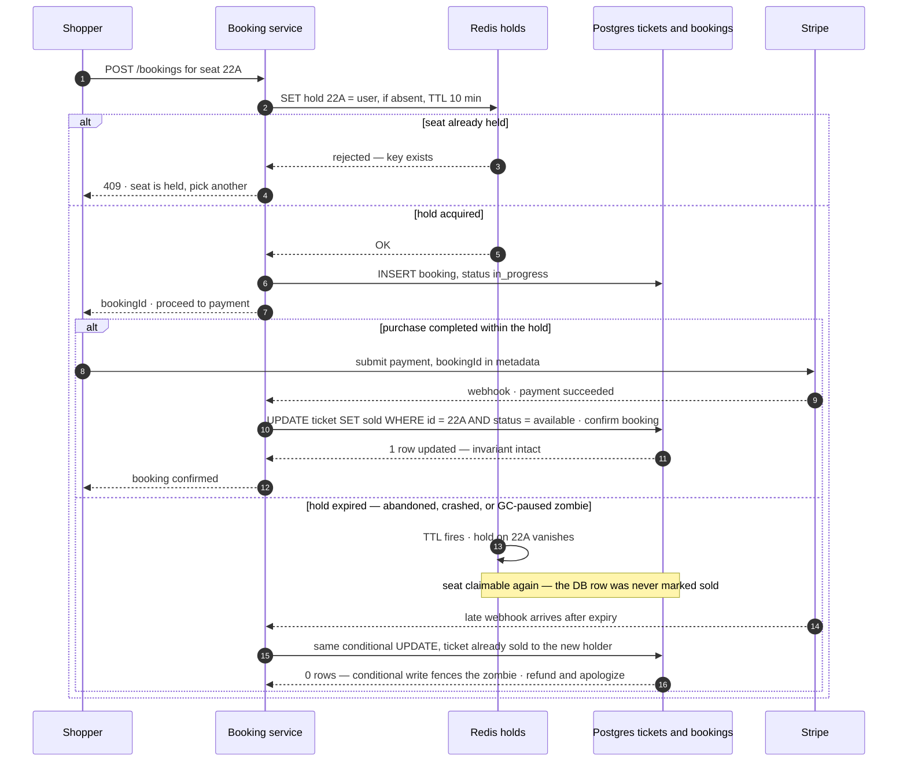

# Design Ticketmaster

> **Prerequisites:** [Design a URL Shortener](/synapse/system-design-from-first-principles/case-studies/url-shortener), [Storage Engines](/synapse/system-design-from-first-principles/data-foundations/storage-engines) | **You'll be able to:** name the exact isolation anomaly behind a double-sold seat and kill it at the cheapest level that works; run the hold ladder — row locks → status-plus-expiry → distributed lock with TTL — and defend a choice, including what happens when the lock holder GC-pauses mid-flight; explain why an on-sale spike is an admission-control problem and design the waiting room.

## The problem (why this exists)

"Let's design Ticketmaster." Concerts, sports, theater: users browse events, search, and buy tickets to specific seats. Where [the URL shortener](/synapse/system-design-from-first-principles/case-studies/url-shortener) was the canonical *read-scaling* rep, this is the canonical *contention* rep: the moment tickets go on sale, millions arrive simultaneously to fight over a fixed number of seats — and selling the same seat to two people is the one unforgivable failure.

We run [the delivery framework](/synapse/system-design-from-first-principles/foundations/the-interview-at-10000-feet) as always: requirements → entities → API → high-level design → deep dives. Marked **Going deeper** descents dig past the interviewable answer — into DDIA's isolation-anomaly vocabulary and fencing machinery — because this question is *decided* by whether you understand what the double-sell actually is.

**Functional requirements:**

1. Users can view events — details, venue, performers, and a seat map with availability.
2. Users can search for events.
3. Users can book tickets.

*Below the line:* viewing your own bookings, admin event creation, dynamic pricing. Park them out loud — [scoping is a graded skill](/synapse/system-design-from-first-principles/foundations/nonfunctional-requirements).

**Non-functional requirements — and the tension inside them.** All four together:

1. **Split consistency posture:** *availability* for viewing and searching, *strong consistency* for booking — **no double booking**. One system, two postures, divided by endpoint — consistency is a per-operation choice, not a database-wide switch, and saying so early is a cheap signal.
2. **Spike scale:** survive a single popular event drawing **10 million users**.
3. **Search latency:** under 500 ms.
4. **Read-heavy:** roughly **100:1** reads to writes.

Then name the structural fact the numbers hide. A big venue holds tens of thousands of seats — call it ~50k for a stadium (venue capacity is a rule of thumb, not a sourced figure). Ten million users against 50k seats is a **200:1 demand-to-supply ratio** (derived arithmetic): over 99% of the spike *cannot possibly buy anything*. You are designing two systems wearing one trench coat — a read-mostly catalog for the 99%, and a small, ferociously contended transactional core for the rest. Keeping them apart is most of the design.

## Intuition first

Start with the dumbest thing that works and find the exact line where it double-sells.

One Postgres. When an event is created, insert one **ticket row per physical seat** — `ticket(id, event_id, seat, price, status)`, status `available` or `sold` (this per-seat model will quietly turn out to be the most important schema decision on the board). Booking: read the ticket row; if `available`, set it to `sold`, insert a booking, charge the card.

Now run two shoppers at the same seat. Request A reads the row: `available`. Request B reads the row: `available` — both reads see committed data, so read committed, the default isolation level in Postgres and most peers, has no objection. A writes `sold` and commits; B writes `sold` and commits. Two confirmation emails, one seat. Note what did *not* go wrong: no dirty read, no dirty write — the defaults kept every promise they make. The race lives in the gap between *check* and *write*: a read-modify-write cycle where the second write clobbers the first. DDIA's name for it is the **lost update**, and naming it precisely is the difference between fixing it and waving at it.

Three more cracks, in descending severity:

**Pay-then-lose.** Even with an atomic purchase instant, a shopper spends five minutes typing payment details, *then* learns someone faster took the seat. Correct, and miserable. The fix is **holding** a seat during checkout — which smuggles a lock with a timeout into the design, and locks with timeouts are where distributed systems keep their sharpest knives. Deep dive #1.

**The on-sale wall.** At sale time, 10M users arrive in the same minute. The seat map is stale the instant it renders; refresh storms hammer the database; and no amount of stateless compute changes the fact that everyone wants the same 50k rows. Deep dive #2.

**Search by table scan.** `WHERE name LIKE '%taylor%'` can't use an ordinary index — full scan, nowhere near 500 ms at catalog scale. Deep dive #3.

And name the crack that *doesn't* open, because your instincts will report it anyway: write volume. Selling out a 50k-seat stadium is 50k successful writes — over even a one-hour on-sale, ~14 writes/second (derived arithmetic), a trickle any single node laughs at. The hard part was never write *throughput*; it's that the writes all aim at the same rows. **Contention, not load** — say those three words and the interviewer knows you've seen this before.

## How it works

### Core entities

Spoken as a list — detail lands in the design, not here:

- **Event** — date, description, links to venue and performer.
- **Venue** — location, capacity, the seat map.
- **Performer** — the act; deliberately generic.
- **Ticket** — *one row per seat per event*: event ID, seat details, price, status.
- **Booking** — a user's purchase attempt: user, ticket IDs, price, status (`in_progress` → `confirmed`).
- **User.**

One [data-modeling](/synapse/system-design-from-first-principles/data-foundations/data-models) observation worth saying aloud: **Ticket is the unit of contention.** Every seat two people can fight over exists as a lockable, updatable row *before* the fight starts. Hold that thought — it is the load-bearing wall of deep dive #1.

### The API

[REST, obvious verbs](/synapse/system-design-from-first-principles/foundations/api-design), one endpoint per requirement:

```
GET /events/{eventId}
→ event details + venue + performers + seat availability

GET /events/search?keyword=&location=&date=&type=
→ list of matching events

POST /bookings
{ "ticketIds": [...], "paymentDetails": {...} }
→ { "bookingId": "..." }
```

Flag the evolution now, resolve it later: booking will split into *reserve* (claim a hold) and *confirm* (payment completes it) once we fix pay-then-lose. Start simple and evolve out loud — and resist enumerating every Event field; it spends minutes you'll want back.

### High-level design

Three services behind a gateway, one database. Draw it, walk each requirement through it, then optimize.

```d2
direction: right
classes: {
  client: {style: {fill: "#f3f4f6"; stroke: "#6b7280"}}
  edge:   {style: {fill: "#dbeafe"; stroke: "#2563eb"}}
  svc:    {style: {fill: "#dcfce7"; stroke: "#16a34a"}}
  data:   {style: {fill: "#ffedd5"; stroke: "#ea580c"}}
}
client: "Client\nseat map · search · checkout" {class: client}
gw: "API gateway\nrouting · auth · rate limits" {class: edge}
event: "Event service\nstateless — view events" {class: svc}
search: "Search service" {class: svc}
booking: "Booking service" {class: svc}
db: "Events DB (Postgres)\nevents · venues · performers\ntickets · bookings" {class: data}
stripe: "Stripe\npayments" {class: edge}
client -> gw: "HTTPS"
gw -> event: "GET /events/{id}"
gw -> search: "GET /events/search"
gw -> booking: "POST /bookings"
event -> db: "read event · venue · performer"
search -> db: "query events (for now)"
booking -> db: "transactional ticket + booking writes"
booking <-> stripe: "charge · webhook"
```

**View.** The event service assembles event + venue + performer + per-seat availability from the database. **Search.** The search service filters events on the request parameters — a deliberate placeholder; it's deep dive #3. **Book.** The booking service runs a transaction: check the ticket rows are available, mark them `sold`, insert the booking, handle payment. That's the naive design from the intuition section, transaction included — functionally complete, double-sell fixed *at the purchase instant only*, pay-then-lose unfixed. Say exactly that, then dive.

## Deep dives

### No double-booking: name the anomaly, then climb the ladder

Everything here follows from a question interviewers rarely hear answered precisely: *what kind of race is a double-sell?*

Because the schema pre-creates a ticket row per seat, both buyers' transactions read **the same row** and write **the same row** — a lost update, the read-modify-write clobber. Now imagine the schema had *not* done that: bookings recorded only as inserted rows, availability checked by asking "does any booking exist for seat 22A?" Two transactions each see zero rows and each insert — they read the same data but write *different* rows, which is **write skew**; and because the guard was the *absence* of rows, it's a **phantom**: there is nothing to lock, because you cannot lock rows that don't exist yet. DDIA's meeting-room double-booking example is exactly this shape, and its escape hatch — **materializing conflicts** — artificially creates a row per bookable resource so the phantom collapses into an ordinary, lockable single-row conflict. The punchline: *the ticket-per-seat table is materialized conflict as a first-class data model.* DDIA's last-resort technique, promoted to the design's foundation — which is why this system, terrifying at the traffic level, is the *easy* version of contention at the data level. Every fight has an address.

Now the ladder. Each rung answers "who may sell seat 22A?" with different machinery.

**Rung 0 — the atomic claim.** For the purchase instant alone, one conditional write suffices:

```sql
UPDATE tickets SET status = 'sold'
WHERE id = :ticketId AND status = 'available';
```

This is DDIA's *conditional write* (compare-and-set): MVCC databases deliberately let concurrent committed writes be visible to an `UPDATE`'s `WHERE` clause even when they're invisible to the transaction's snapshot — so exactly one of two racing statements matches the row, and the loser's affected-row count of 0 *is* the rejection. When the purchase is multi-statement (check, update, insert booking), wrap it in a short transaction with an explicit pessimistic lock — `SELECT ... FOR UPDATE` — so the second transaction waits, sees `sold`, and gives up. Either way: milliseconds of locking, correctness at the purchase instant. A `UNIQUE` constraint on confirmed bookings' ticket ID is belt-and-braces — DDIA notes uniqueness constraints solve claim-a-unique-thing races cleanly, and a constraint can't be forgotten by a future code path.

**Rung 1 — the trap: stretch the lock across checkout.** The pay-then-lose fix candidates reach for first — the named *bad* solution — is holding that `FOR UPDATE` lock for the whole five-minute checkout: an *interactive transaction* spanning human think-time. Row locks are built for statement-scale durations. Held for minutes, each shopper pins a connection; lock waits and deadlocks pile up behind popular seats; and there's no native timeout for an abandoned hold, so a crash or a wandered-off user strands the lock until something kills the connection. Under 2PL-style locking, writers and readers block each other — long-held locks stall everyone who touches those rows. Say "database locks are for milliseconds; holds need a *lease*" and climb.

**Rung 2 — the hold as data: status + expiry.** Make the hold a *fact in the row*, not a lock in the lock manager: status becomes `available | reserved | booked` plus a `reserved_until` timestamp. Reserving is a short transaction — eligible iff `available` *or* (`reserved` and expired) — that sets `reserved` and `now() + 10 minutes`. Confirming requires the reservation to be yours and unexpired. The elegance: **expiry is data, not a job.** A sweeper flipping stale `reserved` rows back is pure hygiene — a delayed sweep changes nothing, because every transaction re-derives validity from the timestamp. (The cron-*dependent* variant — tickets unclaimable until the sweep runs — is strictly worse: sales lost to sweep lag, correctness hostage to a scheduler.) Costs: availability checks filter on two fields (compound index or materialized view), and the table lies a little — some `reserved` rows are expired until swept.

**Rung 3 — the hold as a lease: distributed lock with TTL.** The chosen design moves holds out of the database: on seat selection, the booking service writes `ticketId → userId` into **Redis with a 10-minute TTL** (atomic set-if-not-exists); the ticket table shrinks back to `available | sold`. Complete the purchase → confirm in the DB, drop the hold. Walk away → the TTL fires and the seat frees itself — no sweeper, no expired-row clutter. Why new infrastructure? Because on-sale *hold churn* — grab-and-abandon attempts vastly outnumbering sales — now lands on memory instead of the transactional tables, and the value doubling as the holder's identity lets confirm verify the right user is completing.

**Now the knife: the lease that lies.** A lock with a timeout is a **lease**, and DDIA's distributed-systems chapter is blunt that leases are a common source of serious bugs. The canonical failure: your booking server acquires the hold for 22A, then stops — a [GC pause, a VM migration](/synapse/system-design-from-first-principles/distributed-data/faults-clocks-and-time); multi-second pauses are realistic and can strike between any two instructions. The TTL expires mid-pause. Redis, correctly, hands the seat to someone else. Your server resumes *with no idea time has passed* and continues the purchase it believes it still holds — a **zombie**: a former leaseholder acting on a lease it lost. (No pause needed, either: the zombie's write can simply be a delayed packet arriving after expiry.) DDIA documents this as a real HBase corruption bug, and its general fix is the **fencing token**: the lock service hands out a monotonically increasing number with each grant, every downstream write carries the holder's token, and storage rejects any write bearing a lower token than one it has already seen — the zombie's token-33 write bounces off a store that has processed token 34. The idea wears many names: Chubby *sequencers*, Kafka *epochs*, Raft *terms*, ZooKeeper's `zxid`, etcd revisions.

So is this design broken without one? No — and articulating *why* is the senior moment of the interview. The final sale is not "whoever holds the Redis key wins"; it is the **rung-0 conditional write in Postgres**, which insists the row still be sellable regardless of what any lease claims — the database's own concurrency control backstops everything. DDIA explicitly blesses the alternative: storage supporting conditional atomic writes can replace fencing tokens — the compare-and-set *is* the fence. The layering to say out loud:

**Redis is the experience; Postgres is the invariant.** Lose every hold — Redis crashes, or fails over to an async replica that missed recent grants — and shoppers race, some losing at the payment page: degraded UX, *zero* double-sells. This failure mode beats the sweep-based rung's (where a dead sweeper makes tickets *look* unavailable — invisible inventory instead of visible races).



One honest wrinkle: if a zombie's late confirm lands while the seat is still *unsold* — the new holder mid-checkout — the zombie can win the row and the new holder loses at payment time. Annoying, visible, refundable. What can never happen is two `sold` transitions on one row: the conditional write admits exactly one.

**Going deeper — the isolation-ladder honesty.** The tempting shortcut is "set SERIALIZABLE and all of this vanishes." *True* — serializable prevents every anomaly in the chapter: dirty reads, read skew, phantoms, lost updates, write skew; that is its definition. Now price it. Serializability has three implementations. Actual serial execution needs short, in-memory, single-shard transactions. Two-phase locking blocks in both directions and, under contention, delivers frequent deadlocks and [tail latencies](/synapse/system-design-from-first-principles/foundations/latency-throughput-percentiles) that fall apart exactly when the on-sale hits. Serializable snapshot isolation (Postgres's `SERIALIZABLE`) is *optimistic* — run without blocking, abort at commit on conflict — and DDIA is explicit that optimistic control performs badly under high contention: abort-and-retry storms add load to an already saturated system. An on-sale *is* the high-contention worst case; pessimism wins precisely when conflicts are likely. So the discriminating answer: run **read committed** — the default — and *hand-place the pessimism* with `FOR UPDATE` and conditional writes on exactly the rows where the fight is, which the ticket-per-seat model gave addresses to. You pay for coordination only where contention lives. Two closing honesty notes: "serializable" on the label isn't always serializable — Oracle's implements snapshot isolation, which still permits write skew — and weak-isolation races aren't academic: one bankrupted a Bitcoin exchange, and an attacker (or ten million fans) can generate the concurrency to trigger them deliberately.

### The on-sale spike: admission control, not autoscaling

One event, 10M users, sale opens at 10:00:00. Why doesn't "autoscale the booking path" answer it?

1. **The spike outruns the scaler.** A step function, not a ramp: the crowd arrives inside the first minute, autoscalers react to metrics in minutes, and by the time capacity arrives the damage is done. (Reasoning, not a sourced figure.)
2. **More servers buy more contention, not more seats.** The stateless event service scales freely, but every added booking-service instance just adds concurrent transactions converging on the *same ~50k ticket rows*. Pessimistic locks queue them; optimistic schemes abort them; either way sales are bounded by row-level serialization, and 200 servers fighting over one row do not sell it faster than 2.
3. **Even infinite capacity leaves the product broken.** The seat map is stale before it paints; two hundred people click the same green seat and one hundred ninety-nine eat an error. Past a certain demand ratio, the *experience* is the outage.

The answer comes in two tiers, and the second is the interesting one.

**Tier 1 — keep the seat map honest: push, don't poll.** For popular-but-sane events, hold a **Server-Sent Events** stream per open seat map and push seat-state changes as they happen — SSE's one-way, server-to-client shape fits a feed of "22A just went away," and it kills the refresh storm. Its limit is the "Taylor Swift case": when seats sell in seconds, real-time updates faithfully deliver a demoralizing blur of disappearing green — technically flawless, experientially useless.

**Tier 2 — the virtual waiting room: control admission.** For extreme events, stop the crowd *before* the seat map. Arriving users enter a queue — a WebSocket per waiting user — and the system dequeues at a controlled rate (periodically, or keyed to booking progress), notifying each admitted user and recording their eligibility so the booking path can enforce it. Admission control converts an uncontrollable 10M-user stampede into a drain at whatever rate the contended core sustains — and, the quieter win, the seat map an *admitted* user sees is fresh enough to act on, because only a few thousand others are looking at it. Push queue position and estimated wait over the socket; opaque waits convert demand into rage. This pair is the senior/staff dividing line, and the lesson generalizes: the waiting room is not harder technology than SSE-everywhere — it's recognizing that the *business* problem ("sell 50k seats without riots") admits a product-shaped solution where the technical problem ("render 10M live seat maps") admits none. (Dive #1's machinery and this dive's crowd control are [dealing with contention](/synapse/system-design-from-first-principles/patterns/dealing-with-contention) and [real-time delivery](/synapse/system-design-from-first-principles/building-blocks/realtime-delivery) in the wild — each has its own dedicated lesson.)

```d2
direction: right
classes: {
  client: {style: {fill: "#f3f4f6"; stroke: "#6b7280"}}
  edge:   {style: {fill: "#dbeafe"; stroke: "#2563eb"}}
  svc:    {style: {fill: "#dcfce7"; stroke: "#16a34a"}}
  data:   {style: {fill: "#ffedd5"; stroke: "#ea580c"}}
}
label: "Normal day — browse mode"
client: "Clients" {class: client}
gw: "API gateway" {class: edge}
event: "Event service" {class: svc}
cache: "Cache\neventId → details" {class: data}
db: "Events DB" {class: data}
booking: "Booking service" {class: svc}
client -> gw: "browse · book"
gw -> event: "views"
gw -> booking: "bookings (few)"
event -> cache: "read-through"
event -> db: "on miss" {style.stroke-dash: 3}
booking -> db: "short transactions"
```

```d2
direction: right
classes: {
  client: {style: {fill: "#f3f4f6"; stroke: "#6b7280"}}
  edge:   {style: {fill: "#dbeafe"; stroke: "#2563eb"}}
  svc:    {style: {fill: "#dcfce7"; stroke: "#16a34a"}}
  data:   {style: {fill: "#ffedd5"; stroke: "#ea580c"}}
  async:  {style: {fill: "#f3e8ff"; stroke: "#9333ea"}}
}
label: "On-sale — waiting room engaged (admin-enabled)"
crowd: "10M clients" {class: client}
gw: "API gateway" {class: edge}
wr: "Virtual waiting room\nWebSocket queue · position updates" {class: async}
event: "Event service + SSE\nlive seat map for admitted users" {class: svc}
booking: "Booking service" {class: svc}
redis: "Redis holds\nticketId → userId · TTL 10 min" {class: data}
db: "Events DB\nconditional writes = invariant" {class: data}
crowd -> gw
gw -> wr: "everyone queues first"
wr -> event: "admit at a controlled rate"
event -> booking: "admitted users book"
booking -> redis: "1 · take hold"
booking -> db: "2 · confirm sale (conditional)"
wr -> crowd: "position · ETA pushes" {style.stroke-dash: 3}
```

### Read scaling for browse and search

The 100:1 read skew means the catalog path, not the booking path, carries the volume — and it's a friendly workload for [scaling reads](/synapse/system-design-from-first-principles/patterns/scaling-reads), because event details are written once and read millions of times.

**Browse: cache like crazy.** Event details, venue information, performer bios, seat-map geometry — high read rate, near-zero update rate: cache them aggressively. Redis or Memcached keyed `eventId → event object`, read-through (miss → DB → populate), long TTLs on static fields, invalidation triggered from the database when an event actually changes. The stateless event service scales horizontally behind the load balancer; the cache absorbs what would otherwise be identical queries hammering Postgres. The one thing you must *not* cache lazily is seat availability — that's the real-time surface dive #2 just built. The split: static details from cache; availability over SSE or short-TTL reads.

**Search: precompute or perish.** The placeholder search service filters with `LIKE '%keyword%'` — a leading wildcard defeats B-tree [indexes](/synapse/system-design-from-first-principles/data-foundations/indexing), so every query scans. Climb the ladder:

1. **Indexes + query discipline.** B-trees on event name, date, venue; avoid `SELECT *`; cap result counts. Handles structured filters — does nothing for keyword-in-the-middle matches, the queries users actually type.
2. **Database full-text indexes.** Postgres and MySQL ship full-text extensions that index tokenized words, making "Taylor" fast without new infrastructure — at the price of index storage, slower writes, and awkward maintenance.
3. **A search-optimized store: Elasticsearch.** An inverted index maps each term to the documents containing it, so keyword lookup is an index probe, not a scan; fuzzy matching absorbs typos ("Tayler Swift") that SQL can't reasonably serve. Keep it in sync via **change data capture** from Postgres — inserts, updates, deletes stream into the index near-real-time. Costs, plainly: a second stateful cluster, a sync pipeline that can lag or break, and eventual consistency between catalog and index. For repeated queries, layer caching on top — normalized query → results in Redis with TTLs, Elasticsearch's node/shard caches, even CDN caching for non-personalized searches. Inverted-index *internals* get their own treatment in [the Search building block](/synapse/system-design-from-first-principles/building-blocks/search); the interview needs the shape and the costs.

All three dives assembled into one picture — the final architecture in C4 Container notation, pan-and-zoomable (rendered live from this module's `c4/ticketmaster.c4` model):

<iframe
  src="/c4/view/sdfp_ticketmaster_container"
  width="100%"
  height="520"
  style="border: 1px solid var(--border, #2b2b2b); border-radius: 8px;"
  loading="lazy"
  title="Ticketmaster — C4 Container view (final architecture)"
></iframe>

### Hands-on: run this design

This design's low-level structure — the C4 **code level** inside the decisive service (click any box for its doc):

<iframe
  src="/c4/view/sdfp_ticketmaster_code"
  width="100%"
  height="480"
  style="border: 1px solid var(--border, #2b2b2b); border-radius: 8px;"
  loading="lazy"
  title="Ticketmaster — C4 code level (inside the booking service)"
></iframe>

A **runnable implementation** lives at `proof-of-concepts/06-case-studies/02-ticketmaster/` in the repo root — FastAPI + Postgres + Redis via docker-compose, with the three classes above (`SeatHoldService`, `BookingConfirmer`, `PaymentClient`) mirroring the code view 1:1. It isolates the one thing this design exists to protect: the no-double-booking invariant.

```bash
cd proof-of-concepts/06-case-studies/02-ticketmaster
./run            # frees ports 8320–8322, builds, starts, waits healthy
./run test       # smoke + the concurrency stampede
./run stop
```

`./run test` fires **25 concurrent confirms at a single seat** and proves that the `SELECT … FOR UPDATE` path lets **exactly one** win (`double_sold_seats == 0`). It then re-runs the stampede on an intentionally unsafe path (`FOR UPDATE` dropped) and shows the same seat being sold ~20 times — the anomaly the row lock prevents, made concrete. The TTL seat holds (`SET … NX PX`) throttle checkout; the lock is what guarantees correctness.

## Trade-offs

The decision that defines the interview — **how a seat is held**:

| Option | Gives you | Costs you | Use when |
| --- | --- | --- | --- |
| Row lock held through checkout (interactive transaction) | Trivially correct; no new parts | Connections pinned minutes per shopper; deadlocks on hot seats; no lease timeout — crashes strand locks | Never at on-sale scale — name it to kill it ("bad") |
| Status + `reserved_until` expiry in the row | Correctness and holds in one database; expiry is data, sweeper optional | Two-field availability checks; expired-row clutter; hold churn lands on the DB | The mid-level pass bar ("good"); moderate contention |
| Redis lease w/ TTL **over conditional DB writes** | Hold churn served from memory; native expiry; two-state ticket table | New infrastructure; leases breed zombies — safe *only* because the DB conditional write is the fence | The pick used here; high-contention on-sales |
| `SERIALIZABLE` everywhere | Machine-checked correctness for every query, present and future | 2PL: blocking + deadlocks; SSI: abort storms under exactly this contention; per-DB meaning varies | Contention rare, correctness surface wide — not here |

**Surviving the on-sale**:

| Option | Gives you | Costs you | Use when |
| --- | --- | --- | --- |
| Autoscale + cache only | Simple; no product change | Contended rows still serialize; stale seat map; step-spike outruns scaler | Ordinary demand |
| SSE seat-map updates | Fresh map, no refresh storm | Connection fan-out; futile when the map empties in seconds | Popular events ("good") |
| Virtual waiting room | Admission control — drain at a sustainable rate; fresh map for the admitted | Queue infrastructure (WebSocket state at 10M scale); wait frustration — needs position/ETA feedback | Extreme demand, admin-enabled per event ("great") |

## Numbers that matter

The [estimation lesson's](/synapse/system-design-from-first-principles/foundations/estimation-and-numbers) test — every number ends in a decision:

| Estimate | Value | Decision it bought | Source |
| --- | --- | --- | --- |
| Spike population | 10M users, one event | Admission control (waiting room), not just autoscale | Non-functional requirement |
| Venue capacity | ~20k arena · ~50–100k stadium | The contended core is *small*; the crowd is not | Rule of thumb, not from source |
| Demand : supply | 10M vs ~50k ≈ 200:1 | >99% of the spike never buys — design for browsers, admit buyers slowly | Derived from the two rows above |
| Successful sale writes | 50k over a ~1h on-sale ≈ ~14/s | Write throughput was never the problem; **contention** is | Derived here |
| Read : write ratio | ~100:1 | Cache event details aggressively; scale the read path independently | Non-functional requirement |
| Search latency budget | < 500 ms | Precomputed search index (full-text / Elasticsearch), never `LIKE` scans | Non-functional requirement |
| Hold TTL | 10 minutes | Hold state is one small key per held seat — trivial for Redis *or* a row column; the choice is churn placement, not size | Design choice |

## In production

What operating this design looks like — flagged where it goes beyond the graded sources.

**Watch the invariant, not just the latency.** The one alert that cannot wait is oversell: a recurring check that no ticket has more than one confirmed booking (cheap SQL), alarming on any hit. (Operational practice, not from the graded sources.) The justification *is* sourced: weak-isolation races have real financial body counts — one bankrupted a Bitcoin exchange — and they're triggerable by deliberately concurrent bursts, an adversary description that also fits ten million fans at 10:00:00.

**Sweepers are hygiene; treat their lag as a signal.** On the status-plus-expiry rung, the sweep exists for data legibility, not correctness — the design survives its failure by construction. Monitor its lag anyway: unswept `reserved` rows skew any dashboard or consumer that reads the table naively. On the Redis rung, reconcile the other direction: holds that outlive their booking's terminal state indicate leaks.

**Webhooks retry; confirms must be idempotent.** Payment confirmation arrives as a Stripe webhook, and webhooks redeliver. The confirm transaction is already idempotent by shape — a conditional update keyed on the booking's current state makes a replay a no-op — which is DDIA's dedup-and-idempotence pattern for [exactly-once effects](/synapse/system-design-from-first-principles/patterns/idempotency-and-exactly-once) without distributed transactions. The production sin is a confirm handler that increments, emails, or charges *outside* that guarded transaction.

**The queue is a fairness and abuse surface.** The waiting room is admin-enabled per event; everything after that sentence is the unglamorous war — bots joining the queue from thousands of identities to flip inventory. Standard shapes — per-account and per-device rate limits at queue entry, CAPTCHAs or verified-fan gating, anomaly scoring on join patterns — are industry practice, not from the graded sources; raise the problem rather than invent a victory over it.

A closing honesty note, as in the last case study: this section describes *this design's* operational surface. It is not a claim about how Ticketmaster the company runs its systems — this is an interview-style walkthrough, not an engineering blog.

## Pitfalls & interview traps

**"It's ACID, so double-booking can't happen."** The C in ACID is *your* invariant, upheld by *your* transactions — and the default isolation, read committed, permits the lost update outright. "Postgres is ACID" answers a different question; "at read committed the check-then-write races, so I make the write conditional" answers this one.

**The five-minute `FOR UPDATE`.** Proposing an interactive transaction across checkout is the classic mid-level stumble — the named bad solution. The follow-ups write themselves: what happens to the connection pool at 50k concurrent shoppers? Who releases the lock when the app server dies? Why is a human's think-time inside your lock hold?

<div style="border-left:4px solid #da5233;background:rgba(218,82,51,0.08);padding:0.6rem 1rem;border-radius:0 0.5rem 0.5rem 0;margin:1.25rem 0">

⚠️ **The Redis lock is not your correctness.** The seductive wrong summary of this design is "Redis prevents double-booking." It doesn't — a lease holder can GC-pause past its TTL and resume as a zombie, or its write can arrive as a delayed packet after expiry, and Redis will have already handed the seat to someone else. Real systems have corrupted data exactly this way. The safe formulations are a **fencing token** (monotonic grant number, storage rejects lower tokens) or what this design uses: a **conditional write at the database**, which is a fence by construction. Say the layering out loud — *Redis is the experience, the database write is the invariant* — because "what if the lock holder pauses?" is the exact follow-up this interview exists to ask.

</div>

**"SERIALIZABLE fixes it."** True — and the follow-up is "at what cost, here?" Under on-sale contention, SSI answers with abort storms and 2PL with deadlocks and collapsing tail latencies; the word itself is unreliable anyway (Oracle's SERIALIZABLE is snapshot isolation, which still permits write skew). The senior version: name the anomaly, buy the *cheapest* mechanism that kills it on the rows that need it, and reserve serializable isolation for systems whose conflict surface you can't enumerate.

**Forgetting the 99%.** Candidates who spend forty minutes on the lock ladder and never scale browse/search have designed a box office with no storefront. The read path is most of the traffic *and* the easy points: cache the catalog, push seat-map deltas, precompute search.

**The leveling bar:** a mid-level pass executes the framework, lands the functional design, and reaches at least the status-expiry-sweep solution with some prompting. Senior moves fast through breadth and goes deep unprompted on no-double-booking (a distributed lock or equally strong design *with its failure story*), search scaling, and the popular-event experience. Staff+ is proactivity and judgment — looking around corners, and the waiting-room move: recognizing when the winning solution is product-shaped. The interviewer should come away having learned something.

## Check yourself

```quiz
{"prompt": "A booking server acquires the Redis hold for seat 22A, then GC-pauses for 45 seconds. The TTL expires mid-pause; another user holds and buys the seat. The paused server resumes and proceeds to confirm its user's purchase. In this lesson's design, what prevents a double-sell?", "options": ["The final database UPDATE is conditional on the ticket still being sellable — the zombie's write matches 0 rows and fails", "Redis detects the server resumed and re-grants the original lock", "The API gateway deduplicates the two purchase requests", "Nothing — the seat is double-sold, which is why fencing tokens are mandatory in every design"], "answer": "The final database UPDATE is conditional on the ticket still being sellable — the zombie's write matches 0 rows and fails"}
```

```quiz
{"prompt": "Two transactions each read ticket row 22A (status 'available'), then each set it to 'sold' and insert their own booking. Both commit under read committed with no explicit locks. In DDIA's vocabulary, the race on the ticket row is a…", "options": ["Lost update — a read-modify-write cycle where the second write clobbers the first", "Dirty write — one transaction overwrote uncommitted data", "Write skew — the transactions updated disjoint objects", "Dirty read — a transaction read uncommitted data"], "answer": "Lost update — a read-modify-write cycle where the second write clobbers the first"}
```

```quiz
{"prompt": "An on-sale brings 10 million users for ~50,000 seats. Why doesn't 'autoscale the booking service' solve the problem on its own?", "options": ["The contention is on the seat rows themselves — added servers multiply transactions fighting over the same rows, and the step-shaped spike outruns the scaler anyway", "Booking services are stateful and therefore cannot be horizontally scaled", "Postgres can only execute one transaction at a time regardless of load", "Redis TTLs become unreliable above one million keys"], "answer": "The contention is on the seat rows themselves — added servers multiply transactions fighting over the same rows, and the step-shaped spike outruns the scaler anyway"}
```

```quiz
{"prompt": "You switch Postgres to SERIALIZABLE (SSI) instead of using explicit locks, then run a maximum-contention on-sale. What failure mode should you predict?", "options": ["An abort-and-retry storm — optimistic concurrency control degrades under high contention, and retries add load to an already saturated system", "Dirty reads leak uncommitted seat states to the seat map", "SSI silently downgrades to read uncommitted under load", "Deadlocks become impossible but writes are lost instead"], "answer": "An abort-and-retry storm — optimistic concurrency control degrades under high contention, and retries add load to an already saturated system"}
```

<details>
<summary><strong>Q:</strong> DDIA's canonical double-booking example — meeting rooms — requires either serializable isolation or "materializing conflicts" to fix. Why does plain <code>SELECT ... FOR UPDATE</code> work for Ticketmaster seats when it can't for meeting rooms?</summary>

**A:** Because of what exists to be locked. Meeting-room bookings are *inserted rows*; the availability check is "no conflicting booking exists" — a condition on the **absence** of rows. Two transactions both see zero conflicts and both insert: write skew, guarded by a phantom, and `FOR UPDATE` has nothing to grab — you can't lock rows that don't exist. DDIA's escape is materializing conflicts: pre-create a row per room × time slot purely as a lock target. Ticketmaster's model does this *natively* — every seat of every event exists as a ticket row from creation, so the check is on the **presence** of a specific row, and a row lock or conditional write resolves the race. Same anomaly family, different schema: "one row per bookable unit" is the quiet superpower of this design.

</details>

## PoC — Proof of concepts

**Run it yourself.** [Ticketmaster — no double-booking](https://github.com/ani2fun/synapse-content/tree/main/proof-of-concepts/06-case-studies/02-ticketmaster)
— a real Postgres and a 25-way concurrent stampede for one seat: exactly one booking wins, the rest
get a clean rejection. From `proof-of-concepts/06-case-studies/02-ticketmaster/`, run `./run`.

**Study real implementations.**

- [PostgreSQL — Explicit Locking](https://www.postgresql.org/docs/current/explicit-locking.html) —
  `SELECT … FOR UPDATE` and `SKIP LOCKED`, the exact primitives that make the seat-hold critical
  section correct under contention.
- [Redis](https://github.com/redis/redis) — where a short-lived *hold* (a key with a TTL) usually
  lives, so an abandoned checkout releases the seat automatically.
- [How to do distributed locking](https://martin.kleppmann.com/2016/02/08/how-to-do-distributed-locking.html)
  — the caveats if you reach for a distributed lock instead of the database's own row lock.

## Sources

- `DDIA2 ch. 8 pp. 288–335 (isolation anomalies, locks, serializability)` — retry duplicates and idempotence (pp. 288, 334); exploitable weak-isolation bugs, the bankrupted exchange (p. 289); read committed as default, row locks vs dirty writes (pp. 290–292); lost updates, atomic/conditional writes, `FOR UPDATE`, MVCC's WHERE-clause visibility exception (pp. 299–302); write skew degenerating to lost update on the same object (pp. 303–304); double-booking, uniqueness constraints, phantoms, materializing conflicts (pp. 305–308); the three serializability implementations, 2PL blocking/deadlock/tail costs, SSI aborts, optimistic-vs-pessimistic under contention (pp. 308–318); Oracle's "serializable" = snapshot isolation (p. 281); the anomaly-by-level table (p. 335).
- `DDIA2 ch. 9 pp. 366–377 (locks/leases/fencing)` — leases and their misuse (pp. 366–367, 373); process pauses as a realistic hazard (pp. 367–369); the HBase split-brain bug and delayed-write variant (pp. 373–374); zombies and STONITH's inadequacy (pp. 374–375); fencing tokens and their aliases — Chubby sequencers, Kafka epochs, Raft terms, ZooKeeper zxid, etcd revisions (pp. 375–376); conditional/CAS writes as an accepted fencing alternative (p. 376).
- Derived here, flagged inline: 200:1 demand-to-supply; ~14 sale-writes/second. Rules of thumb, flagged inline: venue capacities; autoscaler reaction lag; bot-defense shapes; the oversell-invariant monitor.
