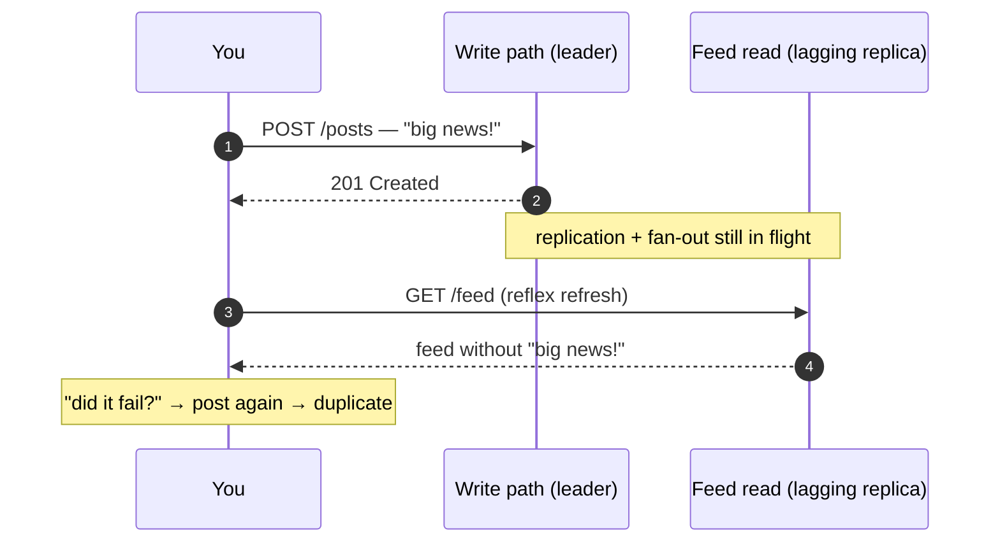

# Design a News Feed

> **Prerequisites:** [Nonfunctional Requirements](/synapse/system-design-from-first-principles/foundations/nonfunctional-requirements), [Data Models](/synapse/system-design-from-first-principles/data-foundations/data-models) | **You'll be able to:** run the delivery framework on the fan-out canonical; do the pull-vs-push arithmetic that decides the architecture, and defend the hybrid this lesson lands on — the same conclusion DDIA reaches independently; name the consistency guarantee behind "why can't I see my own post?" and three ways to provide it.

## The problem (why this exists)

"Design a news feed — Facebook's, say." Users create posts and follow other users; opening the app shows recent posts from the people they follow, newest first; scrolling pages back through older ones. That's the entire product — and the third rep of [the delivery framework](/synapse/system-design-from-first-principles/foundations/the-interview-at-10000-feet) in this module, after the [URL shortener](/synapse/system-design-from-first-principles/case-studies/url-shortener) and [Ticketmaster](/synapse/system-design-from-first-principles/case-studies/ticketmaster). Where Ticketmaster was a contention problem and the shortener a read-scaling problem, this one is the canonical **fan-out** problem: one action by one user becomes work for millions.

It also holds a distinction no other case study here has: DDIA's second edition adopts this exact system — a social network with home timelines — as its running case study, with worked load numbers [ch. 2 pp. 33–36]. Where other designs make you invent estimates, this one lets you check your arithmetic against the textbook. This lesson does, page cites and all.

**Functional requirements**:

1. Users can create posts.
2. Users can follow other users — a uni-directional follow, deliberately, rather than early Facebook's bidirectional friendship.
3. Users can view a feed of posts from the accounts they follow, in chronological order.
4. Users can page through that feed.

*Below the line:* likes and comments; private or restricted-visibility posts. Users are already authenticated.

**Non-functional requirements — quantified**:

1. Highly available, explicitly at consistency's expense — up to **1 minute of post staleness** is tolerated.
2. Posting and feed loads return in **< 500 ms**.
3. Scale to **2 billion users**.
4. **Unlimited follows, unlimited followers.**

Requirement 4 reads like generosity. It's a planted trap: "unlimited followers" is the interviewer reserving the right to ask what happens when an account with a hundred million followers posts — the celebrity problem, and this design's decisive deep dive. DDIA's version of the brief contributes one more number worth adopting out loud: a post should reach followers' feeds within about **five seconds** [ch. 2 p. 35]. The staleness NFR and that freshness target are the yardsticks the delivery pipeline gets judged against.

## Intuition first

Start naive, and say you're doing it — name the coming scaling problems verbally while sketching the simple thing first, because a mostly-complete design you then deepen beats a perfect fragment.

Three tables: **users**, **posts**, **follows** — exactly the relational schema DDIA opens with (its Figure 2-1) [ch. 2 p. 34]. The feed is then a query you run when someone asks: look up whom the reader follows, fetch those authors' recent posts, sort by timestamp descending, return the first page. In SQL it's one join across posts and follows, `ORDER BY timestamp DESC LIMIT` [ch. 2 pp. 34–35]. Every functional requirement: satisfied. For a small product you'd be done.

Now run the textbook's numbers at it. Posts must appear within ~5 seconds, and without any push mechanism the client gets freshness the only way it can — **polling**, re-running the feed query every 5 seconds while the app is open. With 10 million users online, that's **2 million feed queries per second** [ch. 2 p. 35]. Each query touches every followed account — 200 on average — so the storage layer eats **400 million per-sender lookups per second**, and worse for users following tens of thousands of accounts [ch. 2 p. 35]. Four hundred million per second is not a "add replicas" number; no sane fleet answers it. And almost all of that work is *waste*: the overwhelming majority of polls find nothing new, yet each one recomputed the same join from scratch.

The instinct that saves the design: stop recomputing at read time — do the work **when the post is created**. A post is written once and read by hundreds of followers; move the join to the write path and each follower's feed becomes a precomputed answer waiting to be fetched. That single decision — *where does the join between posts and follows happen: read time (pull), write time (push), or both* — is what this case study is actually about.

Push isn't free, though. Quantify before celebrating: 5,800 posts arrive per second on average, each fanning out to ~200 followers — just over **1 million timeline writes per second** [ch. 2 p. 36]. That's a big bill, but 400× smaller than the read-side one. And requirement 4 is still lurking: the *average* fan-out is 200, but some accounts have over 100 million followers [ch. 2 p. 34], and for them push turns one tap into a hundred million writes. Both extremes get their reckoning in the deep dives.

## How it works

### Core entities

Keep this stage to a spoken list — detail belongs later:

- **User** — an account in the system.
- **Follow** — a uni-directional edge, follower → followee. A many-to-many relationship that must be queried in *both* directions: "whom does X follow" builds X's feed; "who follows X" drives fan-out of X's posts. Both directions need an index — the [data-modeling](/synapse/system-design-from-first-principles/data-foundations/data-models) point about many-to-many edges made physical, here as a table keyed one way with a reversed secondary index.
- **Post** — author, content, creation timestamp.

DDIA's case study uses the same three tables [ch. 2 p. 34]. When the textbook and interview framing agree on a data model, spend your minutes elsewhere.

### The API

One endpoint per functional requirement, [REST with the obvious verbs](/synapse/system-design-from-first-principles/foundations/api-design):

```
POST /posts
{ "content": { ... } }
→ 201 { "postId": "..." }

PUT /users/{userId}/followers
→ 200  — idempotent; unfollow is a DELETE

GET /feed?cursor={oldestSeenTimestamp}&limit=20
→ 200 { "posts": [ ... ], "nextCursor": "..." }
```

Two spoken details earn credit here: follow is a `PUT` because following twice must be a no-op — idempotency for free; and the feed paginates with a **cursor** — the timestamp of the oldest post the reader has seen — so each page asks for "the next N older than T." Why a cursor and not an offset is deep dive #2's business.

### High-level design

```d2
direction: right
classes: {
  client: {style: {fill: "#f3f4f6"; stroke: "#6b7280"}}
  edge:   {style: {fill: "#dbeafe"; stroke: "#2563eb"}}
  svc:    {style: {fill: "#dcfce7"; stroke: "#16a34a"}}
  data:   {style: {fill: "#ffedd5"; stroke: "#ea580c"}}
}
user: "Client" {class: client}
gw: "API gateway / LB" {class: edge}
post: "Post service" {class: svc}
follow: "Follow service" {class: svc}
feed: "Feed service\nnaive: join at read time" {class: svc}
posts: "Posts store\n+ (author, createdAt) index" {class: data}
follows: "Follows store\nindexed in both directions" {class: data}
user -> gw
gw -> post: "POST /posts"
gw -> follow: "PUT /users/{id}/followers"
gw -> feed: "GET /feed"
post -> posts: "insert post"
follow -> follows: "insert edge"
feed -> follows: "1 · whom do I follow?"
feed -> posts: "2 · recent posts by those authors"
```

**Write paths.** Creating a post is an insert through a stateless, horizontally scaled post service; following someone is an edge insert. Nothing interesting fails here — say so and keep moving.

**Read path — naive on purpose.** The feed service resolves the reader's follow list, pulls each author's recent posts via an author + timestamp index on the posts store, merges by time, and returns a page. Flag the three alarms out loud as you draw: the reader may follow *many* accounts; each account may have *many* posts; and the merged candidate set can be huge. You've built the pull design whose arithmetic already failed in "Intuition first" — deliberately, because now the deep dives repair it with the interviewer watching the reasoning.

## Deep dives

### Fan-out: pull, push, and the hybrid that actually ships

**Fan-out** is the multiplier from one incoming request to downstream work [ch. 2 p. 35] — and this design has it on both sides. Pull fans out *reads*: one feed load touches all ~200 followed accounts. Push fans out *writes*: one post touches all its followers' feeds. The architecture question is which fan-out you choose to pay, and the case-study numbers make the comparison honest:

- **Pull (fan-out on read):** 2M feed queries/sec × 200 followed accounts = **400M lookups/sec**, mostly recomputing unchanged answers [ch. 2 p. 35].
- **Push (fan-out on write):** 5,800 posts/sec × 200 followers = **just over 1M timeline writes/sec** [ch. 2 p. 36].

Push wins by ~400×, because posting is rare and reading is constant. Mechanically, push means **materializing the timeline**: when a post is created, insert its ID into a precomputed per-user feed for every follower — DDIA's image is delivering mail to a mailbox [ch. 2 p. 35]. The feed read collapses to one key lookup. Two properties follow immediately from "precomputed." First, the timeline is **derived data** — a materialized view of the posts⋈follows join that must be updated on every write [ch. 2 pp. 35–36]. Second, the delivery work can be **queued**: during posting spikes (peaks hit 150,000 posts/sec [ch. 2 p. 34]) you enqueue deliveries and accept some lag, while reads stay fast because they never left the cache [ch. 2 p. 36]. That queue is what turns the 5-second freshness target into an SLO on an async pipeline rather than a request-path deadline.

The write path, built up in three steps:

```d2
direction: right
classes: {
  client: {style: {fill: "#f3f4f6"; stroke: "#6b7280"}}
  svc:    {style: {fill: "#dcfce7"; stroke: "#16a34a"}}
  data:   {style: {fill: "#ffedd5"; stroke: "#ea580c"}}
  async:  {style: {fill: "#f3e8ff"; stroke: "#9333ea"}}
}
label: "Step 1 — accept the post, defer the delivery"
author: "Author" {class: client}
post: "Post service" {class: svc}
posts: "Posts store" {class: data}
q: "Fan-out queue" {class: async}
author -> post: "POST /posts"
post -> posts: "1 · write the post"
post -> q: "2 · enqueue {postId, authorId}" {style.stroke-dash: 3}
post -> author: "3 · 201 — returns before any fan-out" {style.stroke-dash: 3}
```

```d2
direction: right
classes: {
  svc:    {style: {fill: "#dcfce7"; stroke: "#16a34a"}}
  data:   {style: {fill: "#ffedd5"; stroke: "#ea580c"}}
  async:  {style: {fill: "#f3e8ff"; stroke: "#9333ea"}}
}
label: "Step 2 — workers materialize follower timelines"
q: "Fan-out queue" {class: async}
workers: "Fan-out workers\nhorizontally scaled" {class: svc}
follows: "Follows store\nwho follows the author?" {class: data}
tl: "Timeline store\nuserId → capped list of post IDs" {class: data}
q -> workers: "consume, at-least-once"
workers -> follows: "1 · look up followers"
workers -> tl: "2 · prepend postId into each\nfollower's timeline (~200 avg)"
```

```d2
direction: right
classes: {
  client: {style: {fill: "#f3f4f6"; stroke: "#6b7280"}}
  svc:    {style: {fill: "#dcfce7"; stroke: "#16a34a"}}
  data:   {style: {fill: "#ffedd5"; stroke: "#ea580c"}}
}
label: "Step 3 — the celebrity bypass: merge at read time"
reader: "Reader" {class: client}
feed: "Feed service" {class: svc}
tl: "Timeline store\nprecomputed IDs — ordinary accounts" {class: data}
posts: "Posts store\ncelebrity posts + hydration" {class: data}
reader -> feed: "GET /feed"
feed -> tl: "1 · read precomputed post IDs"
feed -> posts: "2 · pull recent posts from\nflagged celebrity follows"
feed -> feed: "3 · merge two\ntime-sorted streams"
feed -> posts: "4 · hydrate IDs → content"
```

The queue needs only at-least-once delivery and high scale (SQS fits), but note the operational wrinkle: work per message varies brutally — one message might mean 200 timeline writes, another a million — so large jobs must be split or they'll skew worker load.

**The celebrity problem.** The average fan-out is 200; the *distribution* is the trap. Accounts exist with over 100 million followers [ch. 2 p. 34]. One such post is 100M+ timeline writes — hitting the 5-second freshness target would mean ~20 million writes per second for a single post (arithmetic from the case study's own numbers, not a figure either source states). The naive answer dies for a clear reason: blasting the writes synchronously from the post service fails on connection limits and leaves one service host doing millions of writes while its neighbors idle; even the async queue just relocates the problem into one monstrous message. And simply dropping celebrity deliveries is not acceptable — a celebrity's followers must see the post [ch. 2 p. 36].

**The hybrid.** DDIA independently converges on the same resolution, which is exactly what makes it the graded answer: handle celebrities *separately* — store their posts apart from the materialized timelines and merge them in when each user's timeline is read [ch. 2 p. 36]. Mechanically: mark high-follower accounts' follow edges as *not precomputed*, have fan-out workers skip them, and have the feed service merge the precomputed timeline with a live query of those few accounts at read time. Same design: **push for the many, pull for the huge**. Every feed read becomes a small merge of two time-sorted streams — the materialized list plus fresh posts from the handful of celebrity accounts the reader follows. The threshold between "fan out" and "merge at read" is a tunable dial: raise it and reads do more merging; lower it and the write pipeline carries more load.

**Going deeper — the other extreme, and what "eventual" concretely means.** Two expert layers close the dive. First, the mirror-image whale: a user who *follows* thousands of high-volume accounts has a torrential write rate into their own timeline. DDIA's blunt engineering call: they can't possibly read it all, so it's acceptable to **drop some of their timeline writes** and show a sample [ch. 2 p. 36]. Say that plainly: the materialized feed is not a ledger. It is a best-effort derived view whose SLO is freshness, not completeness — for hyper-followers, "eventual consistency" is not even eventual *completeness*, by design. (The same place is reachable through a product lever worth naming: Facebook caps friendships at 5,000, and a user following 100k accounts won't notice posts arriving minutes late — asking "can the product bend?" is itself a senior move.) Second, the crash: a fan-out worker dies after delivering a post to 60,000 of 100,000 followers. Nothing downstream reconciles a materialized timeline — a missed delivery isn't "eventually" repaired, it's permanently invisible. Fault tolerance here means another worker takes over **without missing or duplicating posts** — [exactly-once semantics](/synapse/system-design-from-first-principles/patterns/idempotency-and-exactly-once), which DDIA names as exactly this scenario's requirement [ch. 2 pp. 43–44]. The practical shape (rule of thumb, not from source): at-least-once redelivery plus an idempotent timeline insert — inserting a post ID twice must converge to one entry — which composes into an effectively-exactly-once pipeline.

### Feed storage & pagination: what a timeline physically is

"Precomputed feed" sounds abstract until you ask what's actually on disk. DDIA's chapter 3 answers precisely: the materialized timeline is **a cache of the join** between posts and follows, and the fan-out process is the thing that keeps that denormalized copy consistent [ch. 3 p. 74]. Denormalization is derived data plus an obligation — some process must update every copy when the source changes [ch. 3 p. 74].

**IDs, not post text.** X's materialized timeline stores only the post ID, the poster's user ID, and a little extra — not the content [ch. 3 pp. 74–75]. Reading a feed therefore performs two joins *in application code*: hydrate the post IDs into content and stats, and the sender IDs into names and avatars — "hydrating the IDs" [ch. 3 pp. 74–75]. Why tolerate read-time joins in a design that exists to avoid them? Because the referenced data is fast-changing — like counts and profile photos mutate constantly — so denormalized copies would be stale the moment they were written, and storage would balloon with duplicated text. Hydration parallelizes well, and its cost is independent of the author's follower count; read-time joins are not inherently an impediment to scale [ch. 3 p. 75]. One honesty note this book owes you: hydration works because the posts store hides behind heavy caching — a post is written once and read enormously, the friendliest skew caching ever gets (exactly the shape of a post cache and its hot-key variants). Caching earns [a full lesson](/synapse/system-design-from-first-principles/building-blocks/caching); treat "hydrate" as "read a very cacheable record."

**Sizing.** Cap each materialized timeline at ~200 entries. At ~10 bytes per post ID that's ~2 KB per user; across 2B users, single-digit terabytes (quoted at ~2 TB; strict multiplication gives 4 TB — either way, trivially affordable, which is the point). Put in cost terms, it's vivid: a fraction of a cent of storage against ~$100/year of revenue per US user. The cap has a consequence: page far enough back and the materialized feed simply ends. The answer is the design's own history — fall back to the pull path and query follows + posts directly. Almost nobody pages that deep (about as often as reaching page 30 of search results), so the fallback can be slow in peace.

Physically, the timeline store is a key-value shape — user ID → a capped, time-ordered list of IDs — absorbing ~1.16M small prepends per second across the fleet. That write-heavy, sequential-ish profile is what [log-structured storage engines](/synapse/system-design-from-first-principles/data-foundations/storage-engines) are built for; in-memory list structures with persistence work too. Name the shape, not a brand.

**Cursor pagination.** The cursor is the timestamp of the oldest post the reader has seen; each page requests "the next N older than T." Offsets would break twice in a feed: new posts arriving between pages shift every position (page 2 re-serves page 1's tail), and `OFFSET 100000` forces the store to materialize and discard 100k rows. A cursor names a *record*, not a position, so inserts can't shift it and the store can seek straight to it — [the API-design lesson](/synapse/system-design-from-first-principles/foundations/api-design) covers the keyset mechanics, including the tie-breaker detail (timestamps collide, so production cursors are effectively `(timestamp, postId)`). One elegance worth saying in the room: the cursor composes perfectly with the hybrid read — the feed service is merging two time-sorted streams anyway, and the cursor is just the low-water mark both merge inputs respect.

### Seeing your own post: read-your-writes, made concrete

The bug report that never stops coming: *"I posted, refreshed, and my post was gone. So I posted it again."* Now it's up twice, and the user thinks your product is haunted.

Why it happens in this architecture — two independent async gaps. First, **replication lag**: the posts store runs [leader-based replication](/synapse/system-design-from-first-principles/distributed-data/replication) with reads on followers; your refresh hit a replica that hasn't applied your write yet. This is eventual consistency, and "eventually" is deliberately vague — normally sub-second, but near capacity it stretches to seconds or minutes [ch. 6 p. 209]. Second, **the fan-out pipeline itself**: your own timeline entry rides the same queue as everyone else's, seconds behind by design — comfortably inside the 1-minute staleness NFR. And that's the trap in averages again: a minute of staleness is fine for posts from *others* (you don't know what you haven't seen) and disastrous for your *own* (you know exactly what should be there).



The guarantee to ask for by name: **[read-after-write (read-your-writes) consistency](/synapse/system-design-from-first-principles/distributed-data/linearizability-and-ordering)** — a user always sees their *own* submitted updates; it promises nothing about anyone else's [ch. 6 p. 210]. That narrow scope is what keeps it cheap: you're not making the feed strongly consistent, just self-consistent. DDIA gives three techniques [ch. 6 pp. 210–211]:

1. **Route self-reads to the leader** — anything the user might have modified (their own posts, their profile) reads from the leader; everyone else's data reads from replicas.
2. **Time-based routing** — for one minute after a user's last write, serve their reads from the leader; independently, stop serving reads from any replica lagging more than a minute.
3. **Client-remembered timestamps** — the client keeps the (logical) timestamp of its latest write, and the system only serves its reads from a replica caught up to at least that point, waiting or rerouting otherwise.

Applied to this feed, the layered production answer (rule of thumb, not from source — the techniques above are DDIA's; this composition is engineering): let the client echo the new post optimistically at the top of the feed; have the write path insert the author's post into *their own* timeline synchronously — a fan-out of exactly one that never touches the queue; and lean on technique 3 for everything the first two miss.

**The cross-device wrinkle** [ch. 6 p. 211]. Post from your phone, refresh on your laptop: the laptop never made the write, so *its* remembered timestamp knows nothing — the last-write timestamp has to move server-side, centralized across the user's devices. Worse, different devices may route to different regions, so read-your-writes across devices can require pinning all of a user's requests to one region.

**Going deeper — the feed also shouldn't time-travel.** Refresh twice and let the second read land on a *laggier* replica than the first: a post you just saw vanishes — time moving backward. The guarantee that forbids it is **monotonic reads**, weaker than strong consistency but stronger than eventual; the classic implementation routes each user's reads to the same replica, chosen by a hash of the user ID [ch. 6 pp. 212–213]. And take DDIA's design rule with you: decide *now* how the app behaves if lag grows to minutes — if the answer is "badly," design the guarantee in rather than pretending asynchronous replication is synchronous [ch. 6 p. 214].

The hybrid design end-to-end, in C4 Container notation — pan and zoom (rendered live from this module's `c4/news-feed.c4` model):

<iframe
  src="/c4/view/sdfp_newsfeed_container"
  width="100%"
  height="520"
  style="border: 1px solid var(--border, #2b2b2b); border-radius: 8px;"
  loading="lazy"
  title="News feed — C4 Container view (hybrid fan-out)"
></iframe>

### Hands-on: run this design

This design's low-level structure — the C4 **code level** inside the decisive service (click any box for its doc):

<iframe
  src="/c4/view/sdfp_newsfeed_code"
  width="100%"
  height="480"
  style="border: 1px solid var(--border, #2b2b2b); border-radius: 8px;"
  loading="lazy"
  title="News feed — C4 code level (fan-out pipeline + read path)"
></iframe>

A **runnable implementation** lives at `proof-of-concepts/06-case-studies/03-news-feed/` in the repo root — a FastAPI feed API and a **separate fan-out worker**, over Postgres + Redis (Stream queue + timeline cache). The four classes above (`TimelineReader`, `CelebrityMerger`, `FanoutConsumer`, `TimelineFanout`) mirror the code view 1:1.

```bash
cd proof-of-concepts/06-case-studies/03-news-feed
./run            # frees ports 8330–8332, builds, starts api + worker, waits healthy
./run test       # smoke + the hybrid fan-out demonstration
./run stop
```

`./run test` makes the hybrid concrete: a **normal** author's post is fanned out on write into a follower's materialized timeline (visible at `GET /timeline/{id}`), while a **celebrity** author's post is *skipped* by the worker — absent from the materialized timeline, yet still present in `GET /feed` tagged `"source": "celebrity-merge"`, pulled in at read time and merged by time order. That split — push for the many, pull for the few — is the whole design.

## Trade-offs

The decision that defines this design, with both extremes and the production answer:

| Option | Gives you | Costs you | Use when |
| --- | --- | --- | --- |
| **Pull** — fan-out on read | Cheap writes; always-fresh reads; no derived state to maintain or repair | The join on every read: 400M lookups/sec at case-study scale [ch. 2 p. 35]; latency paid while the user waits; work repeated even when nothing changed | Celebrity accounts (via the merge); rarely-read feeds; paging past the materialized cap |
| **Push** — fan-out on write | Feed read = one key lookup + hydration; freshness work moved off the request path and queueable through spikes [ch. 2 p. 36] | ~1M timeline writes/sec [ch. 2 p. 36]; a celebrity post = 100M+ writes; derived state that a crashed worker can silently corrupt | The default for ordinary accounts (~200 followers) |
| **Hybrid** — push for most, pull for flagged accounts | Push economics where fan-out is small, pull correctness where it's huge; a tunable threshold between them | A merge (two time-sorted streams) on every read; two delivery paths to operate and monitor | The production answer, matching DDIA's own conclusion independently [ch. 2 p. 36] |

The [push-vs-pull](/synapse/system-design-from-first-principles/patterns/fan-out-push-vs-pull) sentence to carry between systems: **push shifts work from the frequent operation to the rare one** — here reads are constant and posts are rare, so push wins ~400:1 — until fan-out skew (one post, 100M followers) makes push explode, and you selectively re-introduce pull. One caveat travels with push: DDIA frames delivery as pushing to *online* followers' cached timelines [ch. 2 p. 35] — fanning out to accounts that haven't logged in for a year is pure waste, and real systems skip or lazily rebuild dormant users' feeds (rule of thumb, not from source: the sources gesture at this but don't specify a mechanism).

## Numbers that matter

The rare case study where the numbers are citable rather than invented — DDIA's home-timeline workload [ch. 2 pp. 34–36], with the [estimation lesson's](/synapse/system-design-from-first-principles/foundations/estimation-and-numbers) test applied: each number ends in a decision.

| Quantity | Value | What it decides | Source |
| --- | --- | --- | --- |
| Posts per day | 500M (5,800/sec avg) | Write volume is modest — the *posts* store is easy | DDIA2 [p. 34] |
| Posting peak | 150,000/sec | Fan-out must queue, not block [p. 36] | DDIA2 [p. 34] |
| Avg follows / followers | 200 / 200 | The fan-out multiplier for both arithmetic runs | DDIA2 [p. 34] |
| Celebrity followers | >100M | Uniform push is impossible → hybrid | DDIA2 [p. 34] |
| Freshness target | ~5 seconds | The async pipeline's SLO | DDIA2 [p. 35] |
| Concurrent users | 10M, polling per 5 s | 2M feed queries/sec | DDIA2 [p. 35] |
| Pull cost | **400M lookups/sec** | Kills fan-out on read as the default | DDIA2 [p. 35] |
| Push cost | **just over 1M timeline writes/sec** | The ~400× saving that justifies materialization | DDIA2 [p. 36] |
| Feed entry | ~200 post IDs ≈ 2 KB/user | Timelines are cheap enough to keep for everyone | Rule of thumb, not from source |
| Total timeline storage | ~2 TB quoted (strict: 4 TB) for 2B users | Either way negligible vs ~$100/user/yr revenue | Rule of thumb, not from source (discrepancy noted) |
| Celebrity burst | 100M writes in 5 s ≈ 20M writes/sec | Even async push can't honor freshness for whales | Derived here from DDIA2's figures |

The one comparison to memorize, because it *is* the design: **400 million read lookups/sec vs ~1.16 million timeline writes/sec** — the polling-vs-materialized gap [ch. 2 pp. 35–36].

## In production

**Fan-out lag is the SLO you page on.** The queue is the design's shock absorber — DDIA's spike story is "enqueue and accept delay" [ch. 2 p. 36] — which makes queue state your staleness. Measure post-created → timeline-delivered lag at p99 against the 5-second target and the 1-minute NFR, and alert on the *age of the oldest undelivered post*, not just queue depth: depth looks fine while one massive celebrity job starves everything behind it. (The targets are sourced; the metric choices are operational rules of thumb.)

**New follows need a backfill.** Fan-out only writes *forward*: follow someone today and your materialized feed contains none of their existing posts until they post again. Either patch at read time (merge a live query for recent follows, the hybrid machinery reused) or run a small backfill job that inserts their recent post IDs into your timeline. Unfollow is the mirror: their IDs linger in your list until aged out, so filter at read or purge on unfollow. Neither source details this — it falls straight out of "the timeline is a materialized view whose defining query just changed," but treat the mechanisms as unsourced engineering.

**Ranking is a separate concern.** This design — and the interview — scopes the feed as chronological. Feeds at this scale are generally *ranked* by relevance models instead, which changes the read side (score and reorder candidates before rendering) but leaves the delivery machinery intact: fan-out, materialized candidate lists, and hydration all survive as the retrieval layer beneath a ranker. Neither graded source covers ranking, so take this paragraph as orientation, not design — and don't present ranking claims about any specific company as fact.

**Timelines are rebuildable — use that.** A lost timeline-store node is degradation, not data loss: the materialized view can always be recomputed from posts + follows via the pull path. The operational catch is *how* you rebuild — recomputing millions of feeds at once stampedes the posts store, so warm lazily (rebuild each user's feed on their first read) or throttle a bulk job. (Rule of thumb, not from source.)

**Designed drops must be distinguishable from failures.** Sampling timeline writes for hyper-followers is policy [ch. 2 p. 36]; a worker silently losing deliveries is an incident. If both look identical in your metrics, you cannot detect the second — so label intentional drops explicitly in pipeline telemetry. (Operational corollary, not from source.)

Closing honesty note: this section describes *this design's* operational surface. It is not a description of how Meta runs News Feed — this is an interview-shaped walkthrough, not an engineering blog, and no company-internal claims are made here.

## Pitfalls & interview traps

**Designing for the average.** The mean fan-out is 200; the account that breaks your design has 100 million followers [ch. 2 p. 34]. Candidates who size the pipeline off the average get exactly one follow-up question and no second one. The distribution — its tail, specifically — is the design input, and the "unlimited followers" NFR was the interviewer telling you so in advance — made a core requirement on purpose.

<div style="border-left:4px solid #da5233;background:rgba(218,82,51,0.08);padding:0.6rem 1rem;border-radius:0 0.5rem 0.5rem 0;margin:1.25rem 0">

⚠️ **"What happens when Justin Bieber posts?" is not an edge case — it's the question the interview was built around.** The failure ladder to have ready: synchronous blast from the post service dies on connection limits and grotesquely uneven load; async workers help but one queue message now means 100M writes, so jobs must be split; and the graded answer stops fanning out entirely for such accounts — store their posts separately, merge at read time [ch. 2 p. 36]. If your whiteboard shows a single delivery path for all accounts, expect this follow-up — and answer with the threshold, not a patch.

</div>

**Push or pull as religion.** Committing wholesale to either loses: pure pull re-runs the 400M-lookup arithmetic; pure push melts on celebrities. The senior move is the per-account hybrid and the sentence that generalizes it — precompute for the many, merge at read for the few — a great design principle: different problem classes, different solutions, combined.

**Forgetting the feed is derived data.** No reconciliation story means a worker crash mid-fan-out leaves 40,000 followers permanently missing a post — nothing ever repairs a materialized timeline after the fact. The requirement has a name — exactly-once effect on delivery [ch. 2 pp. 43–44] — and the interviewer asking "what if a fan-out worker dies?" is checking whether you know your precomputed state doesn't heal itself.

**Hand-waving "it's eventually consistent."** Accepting eventual consistency is fine — the NFR literally does — but the phrase isn't a design. The senior version names the two user-visible anomalies and the guarantee that fixes each: your own post missing → read-your-writes [ch. 6 p. 210]; posts vanishing between refreshes → monotonic reads [ch. 6 p. 212]. Bonus point for knowing both guarantees are *per-user* scoped, which is why they're affordable.

**The leveling bar.** Mid-level: a clean API and data model, a functional high-level design, some scaling solutions with prompting — not expected to cover every edge. Senior: speed through the basics and spend the time in ≥2 deep dives, proactively surfacing the fan-out problems before being asked. Staff+: all the deep dives including ones the prompt didn't enumerate, plus performance-tuning instincts. Wherever you sit, the fan-out arithmetic is table stakes on this question — it's the reason the question gets asked.

## Check yourself

```quiz
{"prompt": "The workload runs 5,800 posts/second on average, and the average poster has 200 followers. Under full fan-out-on-write, roughly how many timeline writes per second does the pipeline perform?", "options": ["About 5,800 — one write per post", "About 29,000 — one write per post per online device", "About 1.2 million — 5,800 posts × 200 followers", "About 400 million — 2 million reads × 200 follows"], "answer": "About 1.2 million — 5,800 posts × 200 followers"}
```

```quiz
{"prompt": "An account with 100 million followers publishes a post. What does the graded design do with it?", "options": ["Fan out as usual — the async queue will absorb the burst eventually", "Skip fan-out for this account: store its posts normally and merge them into followers' feeds at read time", "Drop the deliveries for most followers and show the post to a random sample", "Write all 100M timeline entries synchronously before returning 201 to the author"], "answer": "Skip fan-out for this account: store its posts normally and merge them into followers' feeds at read time"}
```

```quiz
{"prompt": "A user posts, immediately refreshes their feed, sees no post, and posts a duplicate. Which consistency guarantee was missing?", "options": ["Linearizability across the entire feed", "Read-your-writes — a user must always see their own submitted updates", "Monotonic reads — a user's reads must never move backward in time", "Consistent prefix reads — writes must be observed in causal order"], "answer": "Read-your-writes — a user must always see their own submitted updates"}
```

```quiz
{"prompt": "A user follows 20,000 high-volume accounts, producing an enormous write rate into their one timeline. Per the DDIA case study, what is the accepted engineering response?", "options": ["Drop some of their timeline writes and show a sample — they cannot read it all anyway", "Move their timeline to a dedicated high-throughput node", "Switch the entire system to fan-out-on-read", "Pause their feed updates until the backlog drains"], "answer": "Drop some of their timeline writes and show a sample — they cannot read it all anyway"}
```

<details>
<summary><strong>Q:</strong> The materialized timeline stores only post IDs — forcing a read-time join to fetch content. Isn't the whole point of materialization to avoid read-time joins?</summary>

**A:** The materialization exists to avoid the *expensive* join — the one across all followed accounts. Hydration is a different, cheap join: given ~200 IDs, fetch ~200 records whose cost is independent of anyone's follower count, in parallel [ch. 3 p. 75]. Storing content inline would fail twice: the referenced data changes fast (like counts, profile photos), so copies would be perpetually stale; and duplicating text into every follower's timeline would multiply storage enormously [ch. 3 pp. 74–75]. DDIA's conclusion is the interview-worthy line: read-time joins are not inherently an impediment to scalable services — *unbounded* ones are [ch. 3 p. 75]. Materialize the join whose fan-out is unbounded; leave the bounded one at read time, where caching absorbs it.

</details>

<details>
<summary><strong>Q:</strong> A fan-out worker crashes after delivering a post to 60,000 of 100,000 followers. What must the system guarantee, and how would you achieve it?</summary>

**A:** The guarantee is exactly-once *effect*: another worker must take over without missing any of the remaining 40,000 followers and without double-posting to the first 60,000 — DDIA names this exact scenario as requiring exactly-once semantics [ch. 2 pp. 43–44]. It matters because the timeline is derived data with no background reconciliation: an undelivered entry isn't "eventually" fixed, it's invisible forever. The practical construction (rule of thumb, not from source): the queue redelivers the job (at-least-once), and the timeline insert is idempotent — adding a post ID that's already present changes nothing — so retries converge on exactly-once outcomes. The interview trap inside the question: answering "the queue guarantees exactly-once" — off-the-shelf queues generally guarantee at-least-once, and the idempotence is yours to build.

</details>

## Sources

- `DDIA2 ch. 2 pp. 33–36 (home-timeline case study)` — the workload numbers (500M posts/day, 5,800/sec avg, 150k/sec peak, 200 avg fan-out, >100M celebrity followers, 5 s target); the polling-vs-materialized comparison (2M queries/sec, 400M lookups/sec vs just over 1M timeline writes/sec); materialized views and derived data; queueing deliveries through spikes; dropping timeline writes for hyper-followers; celebrities stored separately and merged at read. Plus pp. 43–44 — the crash-mid-fan-out example and its exactly-once requirement.
- `DDIA2 ch. 6 pp. 209–214 (replication lag)` — eventual consistency and the vagueness of "eventually"; read-your-writes and its three implementation techniques; the cross-device and cross-region wrinkles; monotonic reads and replica-pinning; the design-for-lag principle.
- `DDIA2 ch. 3 pp. 74–75 (timeline denormalization)` — the materialized timeline as a cache of the posts⋈follows join maintained by fan-out; IDs-only storage and read-time hydration; why fast-changing referenced data shouldn't be denormalized.
- Derived or flagged inline: the 20M writes/sec celebrity-burst arithmetic; the idempotent-insert exactly-once construction; the synchronous self-insert + optimistic echo composition; dormant-user delivery skipping; backfill-on-follow, rebuild, and monitoring mechanics — all marked as rules of thumb or derived where they appear.
