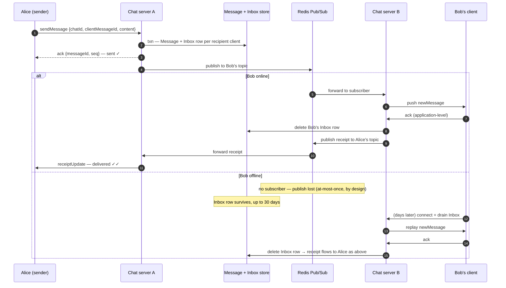

# Design WhatsApp

> **Prerequisites:** [Design a News Feed](/synapse/system-design-from-first-principles/case-studies/news-feed), [Networking Essentials](/synapse/system-design-from-first-principles/foundations/networking-essentials) | **You'll be able to:** defend a WebSocket-first API and walk the connection-routing ladder (load balancer → queue-per-user → consistent hashing → pub/sub), saying why each rung fails or holds; explain what "sent / delivered" receipts commit to; construct effectively-exactly-once delivery from at-least-once redelivery plus idempotent dedup.

## The problem (why this exists)

"Design WhatsApp" — or Messenger, or Telegram; interviewers use them interchangeably. Users send messages, one-to-one and in groups; messages arrive fast when the recipient is online and wait when they're not. This is the fourth rep of [the delivery framework](/synapse/system-design-from-first-principles/foundations/the-interview-at-10000-feet), and it earns its slot by breaking an assumption the first three never questioned. The [URL shortener](/synapse/system-design-from-first-principles/case-studies/url-shortener), [Ticketmaster](/synapse/system-design-from-first-principles/case-studies/ticketmaster), and the [news feed](/synapse/system-design-from-first-principles/case-studies/news-feed) are all request/response systems: a stateless server answers whoever asks and forgets them. Here the *server* must initiate delivery — a message for you has to find the machine currently holding your connection, out of hundreds. State moves into the serving tier, and that change drives everything interesting in this design.

**Functional requirements**:

1. Users can start group chats with multiple participants — capped at **100**. A 1:1 chat is the 2-participant special case, so design the general case once.
2. Users can send and receive messages.
3. Users receive messages sent while they were offline — held for up to **30 days**.
4. Users can send and receive media in messages.

*Below the line*: audio/video calling, business interactions, registration and profile management.

**Non-functional requirements — quantified**:

1. Messages delivered to available (online) users with **low latency, < 500 ms**.
2. **Guaranteed deliverability** — messages make their way to users, eventually, no matter what.
3. **Billions of users**, high throughput.
4. Messages stored on centralized servers **no longer than necessary**.
5. Resilient to failures of individual components.

*Below the line*: exhaustive treatment of security concerns; spam and scraping prevention. The first exclusion matters here — WhatsApp is famously end-to-end encrypted, and an honest paragraph at the end of the deep dives covers what that changes for the server (less than you'd think, and that's the point).

Notice the tension between NFRs 1 and 2: *fast* delivery and *guaranteed* delivery are different machines — a hot path over an open socket versus durable storage that survives every intermediate failure. The design's central trick is refusing to make one mechanism do both jobs. And NFR 4 is a genuine constraint, not decoration: it will end up dictating that delivery *deletes*.

## Intuition first

Build it the way every previous case study would suggest: HTTP. `POST /chats/{id}/messages` to send. And to receive... there's the crack in the foundation. HTTP only works in one direction — the client asks, the server answers. The recipient didn't ask anything. So the naive design has every client **poll** every few seconds — and the server answers "nothing new" almost every time.

Two things kill it. First, the latency floor: with 5-second polling, the *average* message waits 2.5 seconds before its recipient even asks — the 500 ms target would need sub-second polling from hundreds of millions of clients. Second, the waste curve DDIA names precisely: polling for new events gets more expensive the closer you push toward continual, low-delay processing — the smaller the fraction of polls that return anything, the higher the relative overhead [ch. 12 p. 489]. A chat app at the 500 ms grain sits at the ruinous end of that curve.

DDIA's definition of a messaging system: a producer sends a message, the system **pushes** it to consumers — the mechanism that exists precisely because polling doesn't scale down to low delay [ch. 12 p. 489]. WhatsApp *is* a messaging system whose producers and consumers are humans. So the fix is a reversal of direction: keep one connection open per client and let the server push down it the moment a message exists. [Networking Essentials](/synapse/system-design-from-first-principles/foundations/networking-essentials) built the tool — a **WebSocket**, a long-lived bidirectional channel over one TCP connection. A plain TLS socket would do just as well — what matters is the property: *the server can send without being asked*.

That decision's price tag is the design's whole second act: an open socket is **state**. A stateless HTTP fleet can route any request anywhere; a socket fleet cannot — the message for Bob must reach the specific machine holding Bob's connection.

## How it works

### Core entities

Four nouns, one of which candidates reliably forget:

- **User** — an account.
- **Chat** — a conversation with 2–100 participants.
- **Message** — sender, chat, content, and (we'll earn this later) a per-chat sequence number.
- **Client** — a *device*. One user may run WhatsApp on a phone, a tablet, and a laptop; each holds its own socket and delivery state. It's load-bearing by deep dive #2, because "delivered" is a per-device fact.

### The API: a WebSocket contract, not REST

Every previous case study wrote `GET`/`POST` endpoints. Here the honest interface is the set of **commands exchanged over the socket**. Both sides send; both sides acknowledge:

```
// client → server
createChat        { participantIds }            → chatId
sendMessage       { chatId, clientMessageId, content }  → ack {messageId, seq}
getAttachmentTarget { chatId }                  → presigned upload URL
addUser / removeUser { chatId, userId }
ack               { messageId }                 // "this device has the message"

// server → client (pushed, unprompted — the reason WebSockets exist here)
newMessage        { messageId, chatId, seq, sender, content }
chatUpdated       { ... }
receiptUpdate     { messageId, status }
```

Two details in this contract carry the design. First, `sendMessage` carries a **client-generated message id**, so a retry after a timeout is recognized as a duplicate, not a second message — the sender-side half of a construction completed in deep dive #2. Second, every server→client push expects an **ack** back. This is non-obvious but crucial, and DDIA explains why it can't be skipped: a TCP-level acknowledgment only proves the remote *kernel* buffered the bytes — the app may crash before handling them, so true receipt requires a positive response from the application itself [ch. 9 p. 349]. The ack command is that response; the delivery machinery below is built on it.

### High-level architecture

Single host first — the standard move for infrastructure problems: make the mechanics work on one machine before scaling, since scale-first designs back you into corners. One chat server terminates every socket and keeps an in-memory hash map `userId → connection`. Storage is a key-value store (DynamoDB) with four tables: **Chat**, **ChatParticipant** (composite key on `chatId, participantId`, plus a secondary index the other way, so "who's in this chat" and "which chats am I in" are each one lookup), **Message**, and the table doing the real work — **Inbox**: one row per *undelivered message per recipient client*.

Sending a message:

1. Sender's socket delivers `sendMessage`.
2. The server looks up the chat's participants.
3. In one transaction: write the Message and an Inbox row for each recipient client. Only then ack the sender with the final message id — "sent" *means* this transaction committed.
4. Push `newMessage` down each connected recipient's socket.
5. When a client acks, delete its Inbox row.

Offline recipients simply do nothing at step 4; their Inbox rows wait. On reconnect, a client drains its Inbox — the server replays every surviving row as `newMessage`, deleting each on ack. A cron job deletes anything older than 30 days. Requirement 3 and NFR 4 turn out to be one mechanism seen from two sides: delivery *is* deletion — the server holds a message exactly as long as necessary.

**Media** rides a different road: the client asks for a presigned URL (`getAttachmentTarget`), uploads the blob **directly to blob storage** — chat servers never touch the bytes — and sends the resulting opaque URL as ordinary message content. Recipients download with presigned GETs; blobs carry a 30-day TTL. The design explicitly declines a [CDN](/synapse/system-design-from-first-principles/building-blocks/cdn-and-edge): with at most 100 recipients per attachment, cache hit rates don't justify it — the inverse of the URL shortener's 1000:1 read skew, where caching was the whole game.

```d2
direction: right
classes: {
  client: {style: {fill: "#f3f4f6"; stroke: "#6b7280"}}
  edge:   {style: {fill: "#dbeafe"; stroke: "#2563eb"}}
  svc:    {style: {fill: "#dcfce7"; stroke: "#16a34a"}}
  data:   {style: {fill: "#ffedd5"; stroke: "#ea580c"}}
  async:  {style: {fill: "#f3e8ff"; stroke: "#9333ea"}}
}
alice: "Alice's phone" {class: client}
bob: "Bob's laptop" {class: client}
lb: "L4 load balancer\n(raw TCP pass-through\nfor WebSockets)" {class: edge}
csA: "Chat server A\nuserId → socket map" {class: svc}
csB: "Chat server B\nuserId → socket map" {class: svc}
ps: "Redis Pub/Sub\none topic per userId" {class: async}
db: "Chat store\nChat · Participant ·\nMessage · Inbox" {class: data}
blob: "Blob storage\nattachments, 30-day TTL,\npresigned URLs" {class: data}
alice -> lb: "wss:// (persistent)"
lb -> csA
bob -> lb: "wss:// (persistent)"
lb -> csB
csA -> db: "1 · txn: Message +\nInbox row per client"
csA -> ps: "2 · publish to each\nrecipient's topic"
ps -> csB: "3 · subscribed servers\nreceive"
csB -> bob: "4 · push newMessage;\nack deletes Inbox row" {style.stroke-dash: 3}
alice -> blob: "media: direct upload\nvia presigned URL" {style.stroke-dash: 3}
```

The load balancer is **L4**, not L7: a WebSocket is a long-lived TCP connection, so the balancer picks a server once at connect time and then gets out of the byte stream's way. The purple box — Redis Pub/Sub — answers a problem the single-host story doesn't have yet: deep dive #1's business, drawn here post-resolution.

## Deep dives

### Persistent connections at billions of users — routing a message to a socket

Run the numbers that make the single host a fiction. With 1 billion users, roughly **200 million concurrently connected** is a reasonable estimate. WhatsApp's famous historical figure — a ceiling story from a purpose-built Erlang system — was **1–2 million connections per host**, which still means **hundreds of chat servers**. (Rule of thumb, not from source: commodity deployments plan tens to low hundreds of thousands per node — per-connection memory, file descriptors, heartbeats, and TLS state add up. Either way the *shape* is fixed: a fleet, not a machine.)

Now the assumption that broke silently: Alice's socket lands on server A, Bob's on server B. Alice's `sendMessage` arrives at A, which checks its in-memory map for Bob and... doesn't have him. Storage is shared, but **sockets aren't** — the message sits durably in Bob's Inbox and *nothing will push it to him* until his server hears about it. This is the routing problem; a four-rung ladder gets there, each failure teaching the constraint the next rung satisfies.

**Rung 1 — just add servers behind the load balancer.** Broken outright: the balancer chooses where *connections* live, and gives senders no way to reach the server holding the *recipient's* connection.

**Rung 2 — a queue per user.** The instinct is sound — "Bob needs a mailbox that follows him" — so candidates reach for Kafka: one topic per user, subscribed by whichever server holds Bob's socket. It fails on arithmetic: Kafka is not built for billions of topics and carries on the order of **50 KB of overhead per topic** — tens of terabytes of broker bookkeeping before the first message flows. The deeper reason: log-based brokers scale by sharding topics into partitions assigned whole to consumers [ch. 12 pp. 496–497] — machinery for few-topics-huge-throughput, asked to do billions-of-topics-tiny-throughput.

**Rung 3 — [consistent hashing](/synapse/system-design-from-first-principles/distributed-data/sharding-and-consistent-hashing): co-locate the user with a known server.** Make placement *deterministic*: hash each userId onto a ring of chat servers, keep the ring's membership in a coordination service (ZooKeeper or etcd), and connect each user to the server owning their hash range. Now any server can compute where Bob lives and call it directly. This *works* — and the costs are real: every chat server needs connections to every other (pushing toward few, large servers), and **scaling the fleet is a re-hashing event** — users must migrate without a thundering herd of simultaneous reconnects, with messages delivered to both old and new owners during the handoff so nothing drops.

**Rung 4 — pub/sub: let the subscription be the registry (the chosen answer).** Redis Pub/Sub keeps a lightweight in-memory map from topic to subscribers. When Bob's socket lands on server B, B subscribes to the topic `bob`; when any server accepts a message for Bob, it publishes to `bob`, Redis forwards to subscribers, and B pushes down Bob's socket. Nobody computes where Bob is — *the subscription itself is the answer*, updated as a side effect of connecting. Placement becomes free again, and scaling the fleet stops being a re-hashing event.

The catch is printed on the tin: Redis Pub/Sub is **at-most-once**. If no subscriber is listening at publish time — Bob offline, his server mid-restart — the message is simply gone from the pub/sub layer. That's *fine*, because durability never lived there: the Inbox row was committed before the publish, and a delivery that misses the socket is retried from the Inbox on reconnect (a periodic Inbox poll sweeps transient gaps too). This is DDIA's durability trade made deliberately — durability costs writes and waiting; tolerating loss buys throughput and latency [ch. 12 p. 490] — so buy the cheap lossy thing for the hot path and pay for durability exactly once, in storage. Rung 4's costs: an extra single-digit-ms hop through Redis, and the all-to-all mesh moves to chat-servers↔Redis-nodes rather than disappearing.

What dies first as this tier grows? Not steady-state throughput — *correlated reconnection*. One chat server dying orphans millions of sockets that redial at once, each paying the expensive path: TLS handshake, subscribe, Inbox drain. This hazard applies to rung 3's rebalancing too; the production section returns to it, because deploys trigger it deliberately.

### Offline delivery, receipts, and ordering — what the system actually promises

**The Inbox is a per-client durable message queue**, and it matches [the classic broker model](/synapse/system-design-from-first-principles/building-blocks/queues-and-brokers) with striking fidelity: DDIA describes JMS/AMQP-style brokers as databases optimized for message streams that hold messages until a consumer acknowledges, then **delete on ack** — precisely why they're unsuitable for long-term storage [ch. 12 pp. 491–492]. That "unsuitability" is NFR 4 achieved for free: acked messages vanish immediately, unacked ones age out at 30 days. The design didn't fight the broker model's limitation; it hired it.

Per-*client*, not per-user — the Client entity collecting its debt. Your phone acked a message; your laptop, asleep in a bag, did not. A user-level inbox would call that delivered and delete it — the laptop would never see it. So: a Clients table maps each user to their devices (capped at ~3), the send transaction writes one Inbox row *per recipient client*, and each device acks and drains independently. Routing doesn't change — servers still subscribe to the *user's* topic and push to whichever of that user's sockets they hold.

**What the ticks commit to.** Receipts are honest exactly when each is pinned to a machine-checkable event:

- **Sent (one tick):** the server's ack to the sender — *the Message + Inbox transaction committed*. Not "Bob has it"; "the system can no longer lose it."
- **Delivered (two ticks):** the recipient client's application-level ack came back. Only this — not the TCP write, not the pub/sub publish — because the kernel buffering bytes proves nothing about the app having them [ch. 9 p. 349]. In a group, delivery is a *set* of facts — per participant, per device — aggregated in the sender's UI.
- **Read:** the same machinery one level up — the client emits a read event when the message renders. (Extending the mechanism beyond delivery acks to read receipts is a flagged extrapolation — the same ack pipe carrying a different verb.)



**Ordering, honestly.** Refuse the trap first: there is **no global order** across a distributed system, and this design doesn't need one. DDIA's log-based brokers state the achievable guarantee exactly: total order *within* a partition, none across [ch. 12 pp. 496–497] — and events that must stay ordered are routed through the same ordering key [ch. 12 p. 498]. The unit users perceive is the **conversation**, so the chat is the ordering domain: the server assigns each message a monotonically increasing **per-chat sequence number** at commit time, and clients render by sequence, not arrival.

Why sequence numbers and not timestamps — the part candidates get wrong under pressure:

- *Client clocks are untrustworthy by construction*: devices you don't control can't be trusted at all — users set clocks wrong deliberately [ch. 9 p. 361].
- *Even server clocks can't order events*: NTP's accuracy is bounded below by network round-trip time [ch. 9 p. 364], and DDIA's worked failure shows a causally-later write getting the *smaller* timestamp with under 3 ms of skew [ch. 9 pp. 362–363]. The safe tool is a **logical clock** — a counter capturing only relative order [ch. 9 p. 364]; a per-chat sequence is exactly that.
- Sequence survives **redelivery reordering** — an unacked message redelivered after newer ones arrives late [ch. 12 p. 494]; by arrival order the conversation scrambles, by sequence it self-heals.

And the expert-grade honesty: per-chat ordering is where the guarantee *stops*. Alice posts "check the group" in your 1:1 before you've received the group message it refers to — the answer arriving before the question. That's the **consistent prefix reads** anomaly, native to exactly this shape: independent ordering domains with no order between them [ch. 6 pp. 213–214]. Every mainstream messenger accepts it rather than pay for cross-chat causality; the second prose question below works through why that's the right trade.

**The [exactly-once](/synapse/system-design-from-first-principles/patterns/idempotency-and-exactly-once) construction.** NFR 2 says messages arrive; users additionally expect *once*. The failure that makes this hard: Bob's client receives a message and acks it, but server B crashed between the push and the Inbox delete. On reconnect, the row is still there, so the message replays. Not a bug — a missing ack *must* trigger redelivery, or crashes lose messages [ch. 12 p. 493]. TCP won't save you: its deduplication lives inside one connection, and a reconnect is a new connection [ch. 9 p. 349]. So delivery is irreducibly **at-least-once**, and the duplicate must die at the receiver: every message carries a unique id, the client keeps a window of recently seen ids, and a redelivered id is acked but not rendered — an **idempotent** receive [ch. 12 p. 528]. The same construction runs in the sending direction: Alice's `sendMessage` times out (send succeeded, ack lost — indistinguishable from failure [ch. 9 p. 348]), her client retries with the same `clientMessageId`, and the server recognizes the duplicate instead of committing it twice. At-least-once transport plus idempotent endpoints composes into exactly-once *semantics* — "effectively-once" being DDIA's more honest term, since processing may repeat while the *effect* lands once [ch. 12 p. 527]. Here the construction is user-visible, one duplicate "I love you" at a time.

### Group chat fan-out — write amplification with a product-shaped safety valve

A group message is a fan-out event, and the arithmetic rhymes with the [news feed's](/synapse/system-design-from-first-principles/case-studies/news-feed) — with one decisive difference in the tail. One `sendMessage` to a full 100-person group becomes (derived, not stated explicitly): **1** Message row, up to **99** recipient Inbox writes — up to ~**300** with the 3-device client cap — all inside the send transaction, plus up to 99 pub/sub publishes and socket pushes on the hot path. Write amplification equals group size × devices. The transaction scales worst — cost and failure surface grow linearly with participant count — which is why "sent" can't be acked until it commits.

Now put this next to the news feed's version of the same problem. There, fan-out-on-write met an unbounded distribution — accounts with 100M followers — and the design went hybrid: push for the many, pull for the huge. Here the amplification factor is **capped at 100 by a product decision**, and that cap does structural work: it's why pure push (always write every recipient's inbox) is viable with no hybrid machinery, no celebrity path, no read-time merge. The transferable lesson: **fan-out-on-write architectures live or die by the maximum of the fan-out distribution, and a product cap is a legitimate engineering instrument for pinning that maximum.** The news feed couldn't cap followers — unlimited reach was the product; WhatsApp can cap group size — a 500-person group is a different product (broadcast). When an interviewer raises the limit — "what if groups had 10,000 members?" — they're asking whether you noticed the cap was load-bearing: at 10k× amplification the celebrity problem is back, and the answers rhyme — move delivery off the synchronous path, or stop materializing per-recipient state and pull at read time. (Rule of thumb, not from source: a standard follow-up; the design holds the 100 cap throughout.)

The amplification also runs *backwards*: a message to N participants generates on the order of N delivered and N read receipts flowing back to the sender (derived; the design accounts for the ack flow but not this arithmetic); real messengers throttle or batch receipt fan-in — rule of thumb, not a sourced claim.

**One honest paragraph on end-to-end encryption.** Crypto is scoped out (exhaustive security sits below the line), so this stays at the architecture level with nothing invented: E2EE means clients encrypt message content such that servers cannot read it — and the striking fact is how little of this design that changes. Each mechanism consumed only metadata: routing needs userId and chatId; the Inbox needs recipient client and message id; ordering needs the chat's sequence number; receipts need message ids and statuses. **None of it reads content.** The chat server was already, structurally, a store-and-forward system for payloads it has no reason to open — E2EE makes that formal: content becomes an opaque blob (attachments already were — opaque URLs into blob storage). The server gives up every content-touching feature — search, content-based moderation, previews; it keeps everything in this lesson. Key exchange, group re-keying on membership change, and multi-device key state are real, hard, and outside this lesson's scope — in the interview, name that boundary rather than improvising past it.

The whole final architecture once more, in C4 Container notation — pan and zoom; click any element for its doc (rendered live from this module's `whatsapp.c4` model):

<iframe
  src="/c4/view/sdfp_whatsapp_container"
  width="100%"
  height="520"
  style="border: 1px solid var(--border, #2b2b2b); border-radius: 8px;"
  loading="lazy"
  title="WhatsApp — C4 Container view (final architecture)"
></iframe>

### Hands-on: run this design

This design's low-level structure — the C4 **code level** inside a chat server (click any box for its doc):

<iframe
  src="/c4/view/sdfp_whatsapp_code"
  width="100%"
  height="480"
  style="border: 1px solid var(--border, #2b2b2b); border-radius: 8px;"
  loading="lazy"
  title="WhatsApp — C4 code level (inside a chat server)"
></iframe>

A **runnable implementation** lives at `proof-of-concepts/06-case-studies/04-whatsapp/` in the repo root — **two** FastAPI WebSocket chat servers over one Redis, with the three classes above (`ConnectionRegistry`, `MessageRouter`, `ReceiptTracker`) mirroring the code view 1:1.

```bash
cd proof-of-concepts/06-case-studies/04-whatsapp
./run            # build + start redis + chat1 (8351) + chat2 (8352)
./run test       # mypy --strict + WebSocket smoke
./run stop
```

`./run test` proves the two hard parts over real WebSockets: `alice` on **chat1** messages `bob` on **chat2** — chat1 can't see bob's socket, so it looks him up in the presence store and publishes to chat2's channel, whose subscriber delivers it (and a **delivered** receipt routes back the same way); and a message sent to an *offline* `carol` is written to her inbox and **drained onto her socket when she reconnects**. Message-first-to-inbox, delete-on-ack is what makes delivery survive a missing socket.

## Trade-offs

The connection-routing ladder — the decision that defines this design:

| Option | Gives you | Costs you | Use when |
| --- | --- | --- | --- |
| **Load balancer only** | Zero routing machinery | Undeliverable messages — no path from sender's server to recipient's socket | Never past one host; the broken baseline that reveals the problem |
| **Queue per user** (Kafka topic per userId) | Durable mailbox that follows the user | ~50 KB/topic × billions of users; brokers scale by sharding few topics, not hosting billions [ch. 12 pp. 496–497] | Don't — but know *why*: right tool, wrong cardinality |
| **Consistent hashing** — user co-located with a deterministic server | Direct server-to-server delivery; no per-message infrastructure | All-to-all server mesh; coordination registry (ZooKeeper/etcd); rebalancing = orchestrated migration with thundering-herd risk | Very large scale where the extra hop matters — the runner-up |
| **Pub/sub** (Redis) — subscription *is* the location registry | Free connection placement; fleet scaling without re-hashing | Extra single-digit-ms hop; chat-server↔Redis mesh; **at-most-once** — demands a durable Inbox beneath | The chosen answer here — a durable layer already guarantees delivery, so routing may be lossy |

And the delivery-guarantee ladder the receipts are built on:

| Guarantee | Mechanism here | What can still go wrong | Grounding |
| --- | --- | --- | --- |
| **At-most-once** | Redis Pub/Sub publish; the socket push itself | Message vanishes if no subscriber / drop mid-push — acceptable *only* because a stronger layer backstops it | ch. 12 p. 490 |
| **At-least-once** | Inbox row deleted only on application-level ack; missing ack → redelivery | Duplicates — ack lost after processing means replay [ch. 12 p. 493]; TCP dedup doesn't span reconnects [ch. 9 p. 349] | ch. 12 p. 493; ch. 9 p. 349 |
| **Effectively exactly-once** | At-least-once + idempotent endpoints: client dedups by message id, server by clientMessageId | Nothing user-visible — processing may repeat, the *effect* lands once; the dedup state is yours to build and bound | ch. 12 pp. 527–528 |

The sentence to carry out, [trade-off thinking](/synapse/system-design-from-first-principles/foundations/thinking-in-tradeoffs) in one line: **make the hot path lossy and fast, the durable path slow and certain, and let acks reconcile the two** — each guarantee paid for exactly once, in the layer whose job it is.

## Numbers that matter

Fewer citable numbers than the news feed — the estimates here arrive just-in-time, at the scaling bottleneck — and the [estimation lesson's](/synapse/system-design-from-first-principles/foundations/estimation-and-numbers) test still applies: each number ends in a decision.

| Quantity | Value | What it decides | Source |
| --- | --- | --- | --- |
| Concurrently connected | ~200M (of ~1B modeled users) | Connection tier is a fleet problem | Design estimate |
| Connections per host | 1–2M (WhatsApp's storied Erlang figure); plan tens–low hundreds of thousands | Hundreds of chat servers even at heroic density; don't promise 2M in an interview | Historical figure + rule of thumb, not from source |
| Delivery latency target | < 500 ms to online users | Kills polling; forces push over persistent sockets | Requirement (NFR 1) |
| Kafka per-topic overhead | ~50 KB | Kills queue-per-user at 10⁹ users (tens of TB of bookkeeping — derived) | Design estimate |
| Pub/sub added latency | single-digit ms | The routing hop fits inside the 500 ms budget | Design estimate |
| Group size cap | 100 participants | Bounds fan-out; makes pure push viable — no hybrid, no CDN for media | Requirement (FR 1) |
| Client (device) cap | ~3 per account | Bounds Inbox amplification: ≤ ~300 rows per full-group message (derived) | Design estimate |
| Offline retention | 30 days | Inbox TTL; the deletion cron; NFR 4's number | Requirement (FR 3) |
| NTP sync floor | ~35 ms best, ~1 s spikes (internet) | Timestamps can't order messages; sequence numbers can | DDIA2 ch. 9 [p. 361] |

## In production

Everything here is operational reality for *this design's shape* — stateful connection tiers — with sourcing flagged; none of it claims to describe how Meta runs WhatsApp.

**Deploys are disconnection events — drain, don't drop.** A stateless service deploys by swapping instances; a chat server deploy severs live sockets. This surfaces exactly at the consistent-hashing rung — careful orchestration of dropping connections, without a thundering herd — and the discipline generalizes (rule of thumb, not from source): stop assigning new connections to the draining server, nudge existing clients to reconnect on a randomized schedule, only then take the instance down. The Inbox makes draining *safe* — a message racing the disconnect is redelivered on reconnect; the schedule makes it *cheap*.

**Reconnect storms are the real capacity test.** Steady state flatters this system — sockets mostly sit idle. The stress arrives correlated: a server crash or network blip, and a million clients redial inside seconds, each paying the expensive path (TLS handshake, auth, subscribe, Inbox drain). Rules of thumb, not from source: randomized exponential backoff must be shipped in clients *before* the incident; fleet headroom is measured against reconnect throughput, not steady-state connections; presence updates ride the same wave.

**Monitor delivery lag as the user experiences it.** The 500 ms NFR is end-to-end — measure send-ack to delivered-ack at p99 (the receipts pipeline generates both timestamps), per the [percentiles lesson](/synapse/system-design-from-first-principles/foundations/latency-throughput-percentiles), tail first. And watch **Inbox depth and age for connected users**: offline users legitimately accumulate rows, but a *connected* user with an aging Inbox row means the pub/sub hot path is dropping and the sweep is doing delivery's job — at-most-once losses are invisible by design, so you must measure the backstop to see them (using the Inbox poll's hit-rate as the drop-rate metric is a rule of thumb, not from source).

**Dead connections lie.** A socket can be half-open — the client vanished behind a NAT timeout while the server still holds a "connection." The only failure signal is silence, and a timeout can't distinguish a dead peer from a slow one [ch. 9 pp. 348, 352] — hence application-level heartbeats on every socket, tuned against the trade ch. 9 makes precise: aggressive timeouts amplify reconnect churn; lazy ones leave messages routed to ghosts [ch. 9 p. 352].

## Pitfalls & interview traps

<div style="border-left:4px solid #da5233;background:rgba(218,82,51,0.08);padding:0.6rem 1rem;border-radius:0 0.5rem 0.5rem 0;margin:1.25rem 0">

⚠️ **"Your sender and recipient are on different chat servers — now what?" is the question this interview was built around.** Draw a second chat server and routing is your problem; the graded path is the ladder: naive load balancing is broken; Kafka-topic-per-user dies on per-topic overhead; consistent hashing works but costs an all-to-all mesh and orchestrated rebalancing; pub/sub wins *because the Inbox already guarantees durability*, so the routing layer is allowed to be lossy. Bolting pub/sub on without the durable Inbox underneath builds a message-losing machine — "durability lives in the Inbox, not the pipe" is the answer the interviewer is listening for.

</div>

**Confusing TCP's ack with delivery.** "The write returned, so Bob has it" — no: the remote kernel buffered bytes; the app may never see them [ch. 9 p. 349]. Every receipt here is pinned to an *application-level* event (transaction commit; client ack). "When exactly do you show the second tick?" checks whether your ticks mean anything.

**Ordering by timestamp.** Client clocks are adversarial [ch. 9 p. 361], server clocks can't beat network delay [ch. 9 p. 364], and redelivery reorders arrivals [ch. 12 p. 494]. Per-chat server-assigned sequence numbers — a logical clock — are the answer, plus the honesty that cross-chat causality (consistent prefix) is knowingly unguaranteed [ch. 6 pp. 213–214].

**Designing for one device per user.** The Inbox must be per-*client* or your laptop silently loses everything your phone acked. The Client entity looked like ceremony in minute five and is a data-loss bug by minute thirty-five.

**The leveling bar.** Mid-level: functional high-level design, working API, quick acknowledgment that the single host can't scale — interviewer driving the deep dives. Senior: fluency in consistent hashing and long-lived socket mechanics, proactively surfacing the routing problem and arguing the pub/sub-vs-hashing trade. Staff+: two or three levels deeper on failure modes — routing-layer fault tolerance, database optimization, regionalization, cell-based architecture — the interviewer intervening only to focus. The routing ladder is the spine of the conversation at every level; what changes is who's climbing it.

## Check yourself

```quiz
{"prompt": "A design keeps HTTP and has clients poll GET /messages every 5 seconds. Which requirement does this fail first, and why?", "options": ["Guaranteed deliverability — polls can be lost in the network", "The <500 ms delivery target — average delivery waits half the polling interval before the recipient even asks", "The 30-day offline retention — polling can't find old messages", "Billions of users — HTTP cannot serve that many clients"], "answer": "The <500 ms delivery target — average delivery waits half the polling interval before the recipient even asks"}
```

```quiz
{"prompt": "Redis Pub/Sub delivers at-most-once: if no chat server is subscribed to Bob's topic at publish time, the message is simply dropped from the pub/sub layer. Why is this acceptable in the graded design?", "options": ["It isn't — the design adds Kafka underneath pub/sub for durability", "Bob's client re-requests all recent messages from every chat server on reconnect", "Durability was already committed to Bob's Inbox before the publish; anything the socket path misses is redelivered from the Inbox on reconnect", "The sender retries the publish until a subscriber appears"], "answer": "Durability was already committed to Bob's Inbox before the publish; anything the socket path misses is redelivered from the Inbox on reconnect"}
```

```quiz
{"prompt": "Bob's client receives a message and acks it, but the chat server crashes before deleting the Inbox row. On reconnect, the Inbox replays the message. What prevents Bob from seeing it twice?", "options": ["TCP's built-in deduplication recognizes the retransmission", "The client dedups by message id — an idempotent receive that acks the replay without rendering it", "The new chat server checks with Redis Pub/Sub whether the message was already delivered", "Nothing — brief double-display is accepted as an at-least-once artifact"], "answer": "The client dedups by message id — an idempotent receive that acks the replay without rendering it"}
```

```quiz
{"prompt": "One message is sent to a full 100-participant group where every member has 3 registered devices. Roughly how many Inbox rows does the send transaction write, and what bounds that number?", "options": ["1 — the group shares a single inbox row", "99 — one per other participant; devices share their user's row", "About 300 — one per recipient device; the 100-participant cap and ~3-device cap bound it", "Unbounded — it depends on how many followers each participant has"], "answer": "About 300 — one per recipient device; the 100-participant cap and ~3-device cap bound it"}
```

<details>
<summary><strong>Q:</strong> TCP already retransmits lost packets and acknowledges delivery. Why does this design still require an application-level ack from the client before showing "delivered" and deleting the Inbox row?</summary>

**A:** Because TCP's guarantees end at the wrong layer, twice. A TCP-level acknowledgment proves the recipient's *kernel* buffered the bytes — the app may crash before reading them, so "the application has this message" requires a positive response from the application itself [ch. 9 p. 349]. And TCP's retransmission and dedup live inside a single connection — mobile clients reconnect constantly, and a new connection inherits nothing [ch. 9 p. 349]. So the application-level ack is the only event that can safely mean "delivered" — exactly why the broker pattern ties deletion to consumer acknowledgment, not transmission [ch. 12 p. 493]. Delete on TCP success and you build a message-loser; delete on app ack and the worst case is a duplicate, which idempotent dedup absorbs [ch. 12 p. 528].

</details>

<details>
<summary><strong>Q:</strong> Alice sends "look at the group chat 😱" in her 1:1 with Bob, seconds after posting a bombshell in their shared group. Bob receives the 1:1 message first. Which consistency guarantee is missing, and should you fix it?</summary>

**A:** A **consistent prefix reads** violation — writes observed out of causal order, DDIA's "answer before the question" anomaly — specific to systems whose independent shards (here: independent chats, each with its own sequence) share no global write order [ch. 6 pp. 213–214]. The design guarantees order *within* each chat and deliberately nothing *across* chats. The known fixes — funnel causally related writes through one ordering domain, or track causal dependencies explicitly [ch. 6 p. 214] — would mean ordering all of a user's conversations together or shipping causality metadata on every message: a real cost against a mild, self-healing anomaly (the group message arrives moments later). The senior answer names the guarantee, names the price, and declines to pay it — the mirror image of the news feed's read-your-writes discussion, where the *cheap, narrow* guarantee was worth buying.

</details>

## PoC — Proof of concepts

**Run it yourself.** [WhatsApp — realtime messaging](https://github.com/ani2fun/synapse-content/tree/main/proof-of-concepts/06-case-studies/04-whatsapp)
— persistent connections, per-device delivery and the online/offline mailbox that lets a message
survive a recipient being away. From `proof-of-concepts/06-case-studies/04-whatsapp/`, run `./run`.

**Study real implementations.**

- [libsignal](https://github.com/signalapp/libsignal) — the Signal Protocol (Double Ratchet) that
  WhatsApp actually uses for end-to-end encryption; the reference for the crypto this lesson gestures
  at.
- [MDN — WebSockets API](https://developer.mozilla.org/en-US/docs/Web/API/WebSockets_API) — the
  persistent-connection transport underneath any chat system, handshake and framing included.
- [Centrifugo](https://github.com/centrifugal/centrifugo) — a scalable connection/fan-out *server*:
  presence, channels and routing to millions of sockets, the operational half of the design.

## Sources

- `DDIA2 ch. 12 pp. 488–498, 527–528 (messaging systems, acks/redelivery, ordering, exactly-once)` — polling's overhead curve and push-based messaging [p. 489]; the durability-vs-latency trade [p. 490]; brokers deleting on ack [pp. 491–492]; ack-triggered redelivery [p. 493] and redelivery reordering [p. 494]; partition-scoped total order and ordering keys [pp. 496–498]; exactly-once as "effectively-once" [p. 527]; idempotence-based dedup [p. 528].
- `DDIA2 ch. 6 pp. 213–214 (ordering)` — consistent prefix reads, the cross-shard causality anomaly, its two fixes (co-location; explicit causal tracking).
- `DDIA2 ch. 9 pp. 348–364 (connection and clock reality)` — timeout indistinguishability [p. 348]; TCP's guarantees ending at the kernel and at connection scope [p. 349]; timeout tuning [p. 352]; untrustworthy device clocks [p. 361]; timestamp ordering failing under <3 ms skew, NTP's network-delay floor, logical clocks [pp. 362–364].
- Derived or flagged inline: the ~300-row group-write and receipt fan-in arithmetic; realistic connections-per-host planning; read receipts as an ack-pipe extension; the 10k-group extrapolation; drain/backoff/monitoring mechanics; the E2EE paragraph's architecture-level scope — all marked where they appear.
