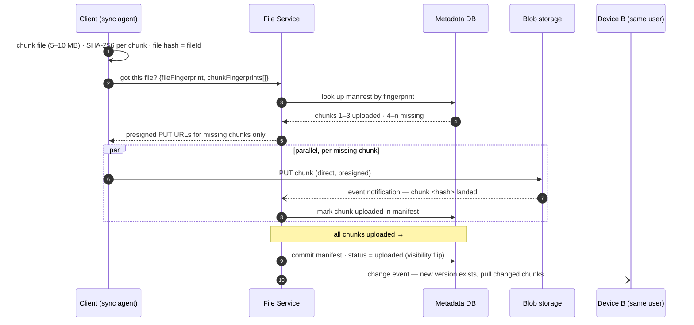

# Design Dropbox

> **Prerequisites:** [Design WhatsApp](/synapse/system-design-from-first-principles/case-studies/whatsapp), [Data Models](/synapse/system-design-from-first-principles/data-foundations/data-models) | **You'll be able to:** design the presigned-URL upload/download path and say precisely why file bytes must never traverse your application servers; build resumable uploads, cross-user dedup, and delta sync out of one primitive — the content-addressed chunk; reason about multi-device sync conflicts as a multi-leader replication problem and say what "this file is synced" actually commits to.

## The problem (why this exists)

"Design Dropbox" — or Google Drive, or OneDrive; the brief is a cloud file-storage service: store files, get them back from any device, share them, and keep every device's copy in sync automatically. This is the fifth rep of [the delivery framework](/synapse/system-design-from-first-principles/foundations/the-interview-at-10000-feet), and it earns its slot by breaking an assumption the previous reps never questioned. The [URL shortener](/synapse/system-design-from-first-principles/case-studies/url-shortener) moved a few hundred bytes per request; [Ticketmaster](/synapse/system-design-from-first-principles/case-studies/ticketmaster) and the [news feed](/synapse/system-design-from-first-principles/case-studies/news-feed) moved kilobytes; [WhatsApp](/synapse/system-design-from-first-principles/case-studies/whatsapp) already shunted its media sideways to blob storage as a supporting detail. Here the payload *is* the product, and a single object can be **50 GB** — orders of magnitude past anything a request/response body was designed to carry. That one number invalidates the default architecture: you cannot POST it, you cannot buffer it, you cannot afford to route it through your compute tier at all.

**Functional requirements:**

1. Users can upload a file from any device.
2. Users can download a file from any device.
3. Users can share a file with other users and see files shared with them.
4. Files sync automatically across a user's devices.

*Below the line*: editing files, viewing files without downloading them. This design also scopes out designing [blob storage](/synapse/system-design-from-first-principles/building-blocks/object-storage-and-blobs) itself — we consume S3-style storage as a building block; its internals are a different interview.

**Non-functional requirements — quantified:**

1. **Highly available** — explicitly prioritizing availability over consistency, per the [non-functional requirements](/synapse/system-design-from-first-principles/foundations/nonfunctional-requirements) discipline of naming the CAP stance. A useful calibration: a stock trade must be read-consistent across continents; a file appearing in Germany seconds before it's visible in the US harms nobody.
2. Files as large as **50 GB**.
3. Secure and **recoverable** — lost or corrupted files can be restored.
4. Upload, download, and sync as fast as possible — [low latency](/synapse/system-design-from-first-principles/foundations/latency-throughput-percentiles) on all three.

*Below the line*: per-user storage limits, file versioning, virus scanning.

Two of these NFRs are quietly at war. "As fast as possible" pushes bytes toward the shortest path between client and storage; "recoverable, from any device, in sync" demands bookkeeping that knows — durably, transactionally — which bytes exist and which version is current. The design's central move is to split the system along exactly that line and never let the halves blur: a **data plane** that moves bytes, a **metadata plane** that moves *facts about* bytes.

## Intuition first

Build it the obvious way first, because every wrong instinct in this interview is the same instinct: treat a file like any other request payload. `POST /files` with the bytes in the body; the File Service writes them to local disk and records a row in its database. Download streams them back. This works in a demo, and it dies precisely as follows.

It dies three deaths. **First, the box fills up** — files accumulate forever, and sharding them across app servers by hand reinvents, badly, the distributed storage layer blob stores already are. **Second, the box is a single point of loss** — NFR 3 says *recoverable*; one failed drive says otherwise. **Third — and this survives even after you swap local disk for S3 — the bytes traverse your compute tier twice.** Client to server, server to blob storage: every gigabyte crosses the network twice and holds an application thread for the duration. The arithmetic that makes this fatal rather than wasteful: a 50 GB file on a 100 Mbps uplink is 50 × 8 / 0.1 Gbps = **4,000 seconds — about 1.1 hours** — for a *single* request. Nothing in the chain tolerates that: default request-body limits are under **2 GB** on Apache and NGINX and as low as **10 MB** on managed API gateways, and an hour-long request is a timeout somewhere with probability approaching 1. One dropped packet at minute 59 and the user starts over.

So the naive design's failure teaches the two constraints the real design is built on: **file bytes must flow directly between the client and blob storage, with your servers handling only coordination** — and **a 50 GB transfer must be divisible**, so that progress survives interruption. Everything in the deep dives is the working-out of those two sentences.

## How it works

### Core entities: the split is the design

Three entities anchor this design — File, FileMetadata, User — and the whole architecture hides in the first comma. This lesson promotes a fourth, elsewhere treated as a mere field:

- **File** — the raw bytes. Lives in blob storage, and *only* there. The application never holds or parses it; from the [data-models](/synapse/system-design-from-first-principles/data-foundations/data-models) standpoint it's not a record at all — an opaque value the rest of the system refers to by name.
- **FileMetadata** — the facts about the bytes: name, size, MIME type, owner, status (`uploading` / `uploaded`), and the **chunk manifest** — the ordered list of chunks constituting the file, each with its fingerprint and upload status. This row is the file's identity as far as the system is concerned; the bytes are its shadow.
- **Chunk** — a 5–10 MB slice of a file, identified by the **hash of its content** (a SHA-256 fingerprint). The unit of transfer, resume, dedup, and delta sync — one primitive, four features.
- **User** — plus a `SharedFiles` mapping (userId → fileId) so "files shared with me" is an indexed lookup, not a scan of every file's share list. The path from share-list-in-metadata → inverse cache → this normalized table is a straightforward [indexing](/synapse/system-design-from-first-principles/data-foundations/indexing) argument whose ending we adopt.

The metadata store is a document-shaped, low-relational workload — DynamoDB is a natural reach, though PostgreSQL would do fine too; per [storage engines](/synapse/system-design-from-first-principles/data-foundations/storage-engines), nothing here turns on that choice, and saying so is worth more than the pick.

### The API — and why it refuses to carry the file

Naively (the starting point, per [API design](/synapse/system-design-from-first-principles/foundations/api-design)): `POST /files` with the bytes, `GET /files/{fileId}` returning them, a share endpoint, a changes endpoint for sync. The final API keeps the *shapes* but evicts the bytes — every file-carrying endpoint becomes a **credential-issuing** endpoint:

```
POST /files/presigned-url    { fileFingerprint, chunkFingerprints[], name, size, mimeType }
                             → { fileId, uploadUrls: presigned PUT per *missing* chunk }
GET  /files/{fileId}/presigned-url
                             → { downloadUrl }            // presigned GET, or signed CDN URL
POST /files/{fileId}/share   { targetUserEmail }
GET  /files/changes?since={cursor}
                             → [ changed FileMetadata ]   // the sync feed
```

A **presigned URL** is a time-limited, signed grant: the File Service asks blob storage to mint a URL authorizing exactly one operation — PUT this object, or GET that one — for a few minutes, and hands it to the client, which then talks to blob storage *directly*. Authorization stays server-side (no URL gets minted for a file the metadata store says you can't touch); the bytes take the short path. User identity rides in headers (session token / JWT), never in bodies.

### High-level architecture

Two planes, drawn as one picture. Metadata operations — fingerprints, manifests, shares, the change feed — flow through the File Service to the metadata DB. Bytes flow client ↔ blob storage (uploads and cold downloads) or client ↔ CDN (hot downloads), on presigned/signed URLs. The dashed lines are the point: the heavy arrows never touch the green box.

```d2
direction: right
classes: {
  client: {style: {fill: "#f3f4f6"; stroke: "#6b7280"}}
  edge:   {style: {fill: "#dbeafe"; stroke: "#2563eb"}}
  svc:    {style: {fill: "#dcfce7"; stroke: "#16a34a"}}
  data:   {style: {fill: "#ffedd5"; stroke: "#ea580c"}}
  async:  {style: {fill: "#f3e8ff"; stroke: "#9333ea"}}
}
dev1: "Device A\nsync agent: file watcher,\nchunker, hasher" {class: client}
dev2: "Device B\n(same user)" {class: client}
gw: "LB / API Gateway" {class: edge}
cdn: "CDN\nhot files, signed URLs" {class: edge}
fs: "File Service\nmints presigned URLs,\ncommits manifests" {class: svc}
meta: "File metadata DB\nFileMetadata + chunk manifest\nSharedFiles" {class: data}
s3: "Blob storage (S3)\nchunks, content-addressed" {class: data}
notif: "S3 event notifications" {class: async}
sync: "Sync channel\nWebSocket (fresh files)\npolling (stale files)" {class: async}
dev1 -> gw: "metadata ops only:\nfingerprints, manifests, shares"
gw -> fs
fs -> meta: "manifest commits,\npermission checks"
fs -> s3: "mint presigned URLs"
dev1 -> s3: "chunk bytes: PUT / GET\ndirect, presigned" {style.stroke-dash: 3}
dev1 -> cdn: "hot downloads" {style.stroke-dash: 3}
cdn -> s3: "fill on miss"
s3 -> notif: "chunk uploaded"
notif -> fs: "mark chunk in manifest"
fs -> sync: "change events"
sync -> dev2: "your file changed —\npull the new chunks" {style.stroke-dash: 3}
```

The **sync agent** on each device closes the loop: it watches the local folder via OS file-system events (FSEvents on macOS, FileSystemWatcher on Windows) and on a change pushes *local → remote* through the upload path. In the other direction, devices learn of changes over a hybrid channel: a WebSocket for **fresh** files (recently edited, near-real-time sync matters) and cheap periodic polling of `/files/changes` for **stale** ones — the remote metadata store acting throughout as the source of truth both directions converge on.

## Deep dives

### Moving big files — why bytes never traverse your app servers

This is the ladder for what's often tagged the **handling-large-blobs** pattern; each rung fails in a way that names the constraint the next rung satisfies.

**Rung 1 — file through the app server, onto local disk.** Dies as described in the intuition: disk ceiling, single point of loss, double-transfer tax. Broken baseline.

**Rung 2 — file through the app server, into blob storage.** Blob storage genuinely solves storage: effectively unlimited capacity, redundancy that makes NFR 3's "recoverable" someone else's solved problem, lifecycle policies for free. But the bytes still cross your tier twice, and a subtler wound opens: upload and metadata write are two operations against two systems, and either can succeed while the other fails — bytes with no record, or a record with no bytes. The prescription — commit metadata only once the upload is confirmed — becomes deep dive 2's manifest-commit discipline.

**Rung 3 — presigned URLs: the client uploads directly (the chosen answer).** Three steps: the client asks the File Service for an upload grant; the service writes a FileMetadata row with status `uploading` and returns the presigned URL; the client PUTs the file straight to blob storage. Then the crucial coda — **blob storage, not the client, reports completion**: an S3 event notification fires on upload and the backend flips the status to `uploaded`. Downloads mirror it: `GET /files/{fileId}/presigned-url` checks SharedFiles for permission, then returns a short-lived presigned GET.

**Rung 4 — [CDN](/synapse/system-design-from-first-principles/building-blocks/cdn-and-edge) for hot downloads.** Blob storage lives in a region; users don't. Add a CDN so a frequently fetched file is served from an edge node near the requester, security carried over — signed CDN URLs with a short expiry (~5 minutes), validated at the edge. CDNs bill for what they cache, so cache *strategically*: cache-control headers and invalidation keep only genuinely hot files at the edge. Contrast WhatsApp, which *declined* a CDN for media — an attachment has at most 100 recipients, so edge caching buys nothing. Same pattern, opposite verdict; the deciding variable is read fan-out — the sharpest one-line demonstration of [trade-off thinking](/synapse/system-design-from-first-principles/foundations/thinking-in-tradeoffs) this design offers.

Notice what the File Service has become at the ladder's top: it never touches a byte of file content — it checks permissions, mints grants, and records facts, which is what lets it stay small, stateless, and horizontally boring while the data plane carries the tonnage. In [networking](/synapse/system-design-from-first-principles/foundations/networking-essentials) terms: your servers stay in the control path and exit the data path — every large-blob system you'll ever design (video upload, ML artifacts, photo backup) re-instantiates this split. One honest boundary: your servers now see content only *after* it lands (if ever), so validation, scanning, or transcoding becomes an asynchronous post-upload step driven by the same event notifications, not an inline gate. Name the consequence rather than discovering it.

### Chunking, dedup & delta sync — the content-addressed chunk

A 50 GB object is not just too big to proxy — it's too big to treat as *atomic*. A presigned single PUT still takes 1.1 hours on a 100 Mbps link, still exceeds request-size limits, and still restarts from zero on interruption. So the client — **and it must be the client** — splits the file into **5–10 MB chunks** before anything is transferred. Chunking on the server is the classic trap: the whole file would have to reach the server first, which was the problem. Chunks upload in parallel (saturating the client's bandwidth), each is cheap to retry, and a progress bar falls out for free — chunks done over chunks total.

Now the idea that turns chunking from a transport trick into the design's second pillar: **identify every chunk — and the file itself — by a hash of its content** (a SHA-256 **fingerprint**; the file's fingerprint becomes its `fileId`). Names lie — two users' `report.pdf` collide; a renamed file changes name while the bytes didn't. Content hashes tell the truth in both directions: same bytes, same identity, regardless of name, owner, or device. Once identity *is* content, three features collapse into one lookup against the chunk manifest:

- **Resume.** An interrupted upload is just a manifest with some chunks marked `uploaded` and some not. On retry the client sends its fingerprint list, the server answers with what's missing, and only those chunks move. Nothing was "saved"; the manifest *is* the resume state.
- **Dedup.** If any user ever uploaded a chunk with this hash, the bytes are already in blob storage — record the reference, skip the transfer. The second person to upload a popular 2 GB installer uploads approximately nothing. (Cross-user dedup has real costs — see In production.)
- **Delta sync.** Edit one region of a 50 GB file and re-hash: unchanged chunks produce unchanged fingerprints, so only changed chunks upload. A one-chunk edit moves 5 MB instead of 50 GB — 10,000× less, from the same mechanism that gave you resume.

The upload protocol, end to end — and note who is trusted to say what:



Steps 7–9 are the trust boundary. The obvious alternative — the client PATCHes the manifest after each successful chunk PUT — is the one this design rejects: a client that reports upload status can lie, and a lying (or merely buggy) client leaves the manifest claiming chunks blob storage doesn't hold — corrupt state that surfaces later as a failed download. **S3 event notifications** make blob storage itself the witness: a chunk is `uploaded` when the store says it arrived, and the client is trusted with nothing but bytes.

The final commit — step 10 — gives rung 2's "transactional care" its precise form. A file becomes *visible* — downloadable, shareable, sync-announced — in exactly one place: the metadata transaction that flips its status once every chunk in the manifest is confirmed. Until that flip, the bytes are durable but *invisible*; an upload abandoned forever is orphaned garbage to collect, never a half-file a user can download. The flip is the file's linearization point — everything upstream of it may fail, repeat, or arrive out of order. Same shape as WhatsApp's "sent means the transaction committed": the user-visible promise pinned to a single durable write.

Two footnotes at the expert edge. First, **chunk size is a genuine trade-off** — the Trade-offs table works it through; 5–10 MB is the number used here, adaptive sizing the refinement. Second, fixed-boundary chunking has a weakness this design inherits: *insert* bytes near the front of a file and every subsequent boundary shifts, every downstream hash changes, and delta sync degenerates to a full re-upload. Rule of thumb, not from source: production sync engines use content-defined chunking — rolling hashes place boundaries at content landmarks so an insertion only disturbs its neighborhood (the rsync lineage); neither source covers it, so in an interview it's a flagged "beyond scope, here's the name." Finally, the productized analog: **S3 Multipart Upload** is this protocol — client-side parts, parallel PUTs, server-side assembly — and the advice is to mention it *and* be able to rebuild it from parts, since "I'd call the API" answers nothing about what the API does.

### Sync & conflicts across devices — the metadata store as the coordination point

The first two deep dives moved one file from one device. Requirement 4 is stranger than it looks: the *same* user's laptop, phone, and desktop each hold a **local copy** of the folder, each accepts **edits while offline**, and all are supposed to converge. Stop and name what that is. Each device is a full replica accepting writes without coordinating with anyone — [multi-leader replication](/synapse/system-design-from-first-principles/distributed-data/replication), exactly. DDIA's sync-engines treatment says an offline-capable app with a local replica per device *is* multi-leader at an extreme: each device is in effect a "region" with an extremely unreliable link, and replication lag isn't milliseconds but **hours or days** — however long the laptop stays in the bag [ch. 6 p. 220]. The client-side sync agent is what DDIA calls a **sync engine** — capture local changes, queue offline, ship when connected, merge remote changes in [ch. 6 p. 221]. Dropbox is the textbook's happy case: sync engines work best when each replica's data can be fully downloaded and held locally — fine for a user's own files, hopeless for an entire product catalog [ch. 6 p. 222] — and it collects the local-first payoff: reads and writes hit local disk first, the UI never blocks on a round-trip, offline isn't a special mode, and local operations skip the per-call error handling RPCs need [ch. 6 pp. 221–222].

The topology, though, is deliberately *not* peer-to-peer. Devices never reconcile with each other; every device syncs against the remote metadata store, designated the **source of truth** — commit local changes there fast, and let every other device converge on it. That star-through-the-hub shape is what keeps the system comprehensible: "current version of file X" has exactly one authoritative answer, the metadata row, guarded by deep dive 2's manifest-commit discipline. Devices are leaders for *accepting* writes; the hub is where write *order* gets decided.

Then two devices edit the same file while both are offline, and no topology can save you — you must choose a **conflict policy**. Precision first, because interviewers probe exactly here: the edits conflict not because they happened at the same wall-clock moment but because they're **concurrent** in the causal sense — each made in ignorance of the other; neither *happens-before* the other [ch. 6 pp. 222, 238–239]. A device offline for a week can conflict with an edit made six days ago. Clocks don't define this; knowledge does.

This design resolves it with **last write wins**: both versions reach the server; the later-timestamped upload becomes current. And here the framing and DDIA genuinely part ways, so we surface both. DDIA's verdict on LWW is unsparing: among concurrent writes "last" is undefined, so LWW *means* one write is picked as winner and the others **silently discarded** — convergent, at the price of data loss; and with wall-clock timestamps, skew can crown a genuinely *earlier* write [ch. 6 pp. 224–225]. For a chat app deciding message order, dropping one ordering is invisible. For a file store, the discarded loser is *someone's day of work*. The correctness-preserving alternative is DDIA's sibling pattern: on detected concurrency, **keep both copies** and surface them for a human (or the application) to merge — CouchDB's approach [ch. 6 p. 225], recognizably the "conflicted copy" sync products drop next to the original. Note what's *not* on the menu: automatic merging — CRDTs and operational transformation converge concurrent edits losslessly [ch. 6 pp. 226–228], but only because they understand the data's structure, and this design's File is an opaque blob by construction; type-aware merging is the road to Google Docs, a different product and a different interview. Ruling: LWW is the accepted answer in the interview's main line, and even that framing gestures at the safety net (versioning: don't overwrite; add a version and move the pointer — scoped below the line). But say the DDIA-grounded sentence out loud: *LWW silently discards a concurrent write; with versioning or conflicted copies the loser stays recoverable.* Knowing what your policy destroys is the difference between choosing a trade-off and stumbling into one.

Now the expert layer worth pushing past: **what does "this file is synced" even mean?** The green checkmark is a compound claim whose parts commit at different moments:

1. **Durable** — every chunk of the new version is confirmed in blob storage (S3 events; all manifest entries `uploaded`). The bytes can no longer be lost. Not yet visible.
2. **Visible** — the manifest transaction committed; "current version" changed. This instant, and no other, is when the upload happened system-wide: shares, downloads, and the change feed all read this row.
3. **Propagated** — some *other* device heard the change event and pulled the chunks. Per-device, unbounded in time (that laptop in the bag), never guaranteed for all devices at once.

The checkmark on the uploading device honestly means 1 + 2 — *the source of truth has it*; it cannot mean 3, which isn't a single fact and never completes for a device that stays offline. WhatsApp pinned each tick to a machine-checkable event; this is the same honesty with different events, and the manifest commit is the hinge — flip visibility before durability is total and a device can be told to download chunks that don't exist. Order of operations *is* the correctness argument, and "walk me through what each state of the status field promises" is how a strong candidate closes this deep dive.

The whole final architecture once more, in C4 Container notation — pan and zoom; click any element for its doc (rendered live from this module's `dropbox.c4` model):

<iframe
  src="/c4/view/sdfp_dropbox_container"
  width="100%"
  height="520"
  style="border: 1px solid var(--border, #2b2b2b); border-radius: 8px;"
  loading="lazy"
  title="Dropbox — C4 Container view (final architecture)"
></iframe>

### Hands-on: run this design

This design's low-level structure — the C4 **code level** inside the sync agent (click any box for its doc):

<iframe
  src="/c4/view/sdfp_dropbox_code"
  width="100%"
  height="480"
  style="border: 1px solid var(--border, #2b2b2b); border-radius: 8px;"
  loading="lazy"
  title="Dropbox — C4 code level (inside the sync agent)"
></iframe>

A **runnable implementation** lives at `proof-of-concepts/06-case-studies/05-dropbox/` in the repo root — the sync agent (`Chunker`, `ManifestDiffer`, `SyncEngine`, mirroring the code view) against a FastAPI file service backed by a content-addressed chunk store in Postgres.

```bash
cd proof-of-concepts/06-case-studies/05-dropbox
./run            # build + start the file service (8360) + Postgres (8361)
./run test       # mypy --strict + pure agent tests + HTTP two-device sync
./run stop
```

`./run test` makes content-addressing pay off: device A pushes a file, device B **pulls an identical copy** from the chunk store; editing only the file's tail re-uploads **just the changed chunk** (the first chunk, unchanged, is reused); and pushing the same content at a new path uploads **zero** chunks — dedup, because the name *is* the hash.

## Trade-offs

The three decisions this design turns on, in the [thinking-in-tradeoffs](/synapse/system-design-from-first-principles/foundations/thinking-in-tradeoffs) frame:

| Option | Gives you | Costs you | Use when |
| --- | --- | --- | --- |
| **Bytes proxied through app servers** | One trust domain; inline validation; simplest mental model | Double transfer; threads held for hours; request-size limits (2 GB / 10 MB defaults); compute scales with tonnage | Small payloads, or when inline content transformation is the product |
| **Presigned direct-to-blob** (the answer used here) | Bytes take the shortest path; small stateless app tier; storage-grade durability | Two-system consistency (manifest-commit discipline); content inspection goes async | MBs to GBs; the default for file products |
| **+ CDN with signed URLs** | Edge-local download latency for a global base | Real money per cached byte; invalidation machinery; only pays for *hot* files | High read fan-out per file — the anti-WhatsApp-media case |

Conflict policy, per deep dive 3:

| Policy | Gives you | Costs you | Use when |
| --- | --- | --- | --- |
| **Last write wins** (the accepted answer) | Automatic convergence, zero user friction | A concurrent write silently discarded; clock skew can pick the wrong winner [ch. 6 pp. 224–225] | Losing a concurrent version is tolerable, or versioning backstops it |
| **Keep both (siblings / conflicted copy)** [ch. 6 p. 225] | No silent loss; loser stays recoverable | A human must merge; conflicted copies accumulate | User data whose loss is expensive — the honest default for a file store |
| **Automatic merge (CRDT / OT)** [ch. 6 pp. 226–228] | Lossless convergence of concurrent edits | Requires understanding the data's structure — impossible for opaque blobs | Structured content you control end-to-end — a different product |

Chunk size — small vs large, at fixed file size:

| Axis | Smaller chunks (~5 MB) | Larger chunks (~64 MB+) |
| --- | --- | --- |
| Retry cost on failure | tiny — you re-send little | you re-send a lot |
| Resume granularity | fine — little progress lost | coarse |
| Delta-sync precision | an edit dirties few bytes' worth | an edit dirties a big chunk |
| Manifest & per-chunk overhead | 10,000 entries for 50 GB; more hashes, requests, events | small manifest, fewer round-trips |
| Dedup hit probability | higher (smaller units match more often) | lower |

The 5–10 MB choice sits deliberately toward the small end — resumability and delta precision are the NFRs that bite — with adaptive sizing by network conditions as the refinement.

## Numbers that matter

Every figure here ends in a decision, per the [estimation discipline](/synapse/system-design-from-first-principles/foundations/estimation-and-numbers):

| Quantity | Value | What it decides | Source |
| --- | --- | --- | --- |
| Max file size | 50 GB | The NFR that shapes the whole design | Requirement |
| Single-POST upload time | 50 GB × 8 / 100 Mbps = 4,000 s ≈ **1.1 h** | Kills the monolithic upload; forces chunking | Derived (math shown) |
| Request-body limits | < 2 GB (Apache/NGINX defaults); 10 MB (managed API gateway) | Even mid-size files can't ride a plain POST | Platform default |
| Chunk size | 5–10 MB, adaptive | Retry/resume/delta granularity vs per-chunk overhead | Design choice |
| Chunks for a 50 GB file | 50 GB / 5 MB = **10,000** | Manifest scale: ~10,000 entries ≈ order-of-1 MB of metadata — trivially stored, non-trivially updated 10,000 times | Derived, from chunk size above |
| Delta sync on a 1-chunk edit | 5 MB moved, not 50 GB — **10,000×** less | Content-addressing pays rent daily, not just on first upload | Derived, from the delta-sync mechanism above |
| Presigned/signed URL lifetime | ~5 minutes | Leaked links self-expire; grants are per-operation | Design choice |
| Sync replication lag (offline device) | hours–days | Conflict handling is mandatory, not an edge case | DDIA2 ch. 6 [p. 220] |

## In production

Operational reality for this design's *shape* — sourcing flagged; none of it claims to describe Dropbox-the-company's internals.

**Incomplete uploads are a garbage stream, not an event.** Clients start uploads and vanish — laptop lids close mid-chunk, forever. Each abandonment leaves durable-but-invisible chunks (deep dive 2's safe failure mode) and an `uploading` manifest row: a steady leak of paid storage at fleet scale. Reap it — expire stale in-progress manifests and delete chunks no manifest references. Blob-storage lifecycle policies help here; S3 specifically can auto-abort incomplete multipart uploads after N days [web: AWS S3 lifecycle documentation]. The subtle bug class is reaping a chunk a *new* upload just claimed via dedup — reference-counting chunks across manifests is the real discipline, and where content-addressing collects its operational tax (rule of thumb, not from source).

**Dedup ratios are workload-dependent — and dedup fights encryption.** Cross-user dedup shines on mass-shared content (installers, media, the forwarded PDF) and does little for personal photos, unique by nature; neither source quantifies ratios, so treat any figure as a rule of thumb, not from source. The structural conflict is worth naming: the compress-before-encrypt point rests on encryption destroying redundancy, and the same fact means client-side encryption with per-user keys makes identical files hash differently — end-to-end-encrypted storage and cross-user dedup are directly at odds.

**Tier cold bytes.** File storage is write-once, read-maybe. DDIA notes the economics — object storage optimized for infrequent access is the cheap home for old data [ch. 6 digest, p. 197]; blob stores productize this as storage classes trading retrieval latency for cost, and demoting long-unread chunks is standard practice — tiering specifics are a rule of thumb, not from source.

**Watch sync lag the way WhatsApp watches delivery lag.** The user-perceived NFR is "my other device has it fast," and "sync is slow" has four different owners — instrument chunk-upload throughput, S3-event-to-manifest-mark latency, manifest-commit-to-change-event latency, and change-event-to-peer-download completion separately. The signature failure is a manifest stuck at 9,999/10,000: one lost event notification leaves a file forever almost-visible, so run a reconciliation sweep that re-lists blob storage against `uploading` manifests — measure the backstop to see the losses (rule of thumb, not from source; the same logic as WhatsApp's inbox sweep).

**Conflicted copies accumulate.** The sibling policy trades silent loss for visible clutter: users who edit on two devices generate conflicted copies faster than they merge them. Still the right side of the trade for user files — but plan the UX, and expect "why are there four copies of my thesis" tickets (rule of thumb, not from source).

## Pitfalls & interview traps

<div style="border-left:4px solid #da5233;background:rgba(218,82,51,0.08);padding:0.6rem 1rem;border-radius:0 0.5rem 0.5rem 0;margin:1.25rem 0">

⚠️ **The bytes are the trap.** The two moves that sink this interview are one mistake at two layers: routing file content through your app servers (dies on double transfer, request limits, and an hour-long connection — the 1.1 h math is your exhibit), and chunking on the *server* (the whole file must reach the server first, which was the problem — this is the most common candidate error). The fix is one sentence said early: *my servers coordinate; the client and blob storage move bytes, in client-side chunks, over presigned URLs.* Every deep dive hangs off that sentence.

</div>

**Trusting the client's word for upload state.** The client-orchestrated PATCH ("I uploaded chunk 7, promise") hands your source of truth to the least trustworthy machine in the system; a malicious or buggy client manufactures manifests claiming bytes blob storage never saw. "Who says a chunk is uploaded?" has exactly one right answer, and it isn't the uploader.

**Flipping visibility before durability is total.** Mark the file `uploaded` when the *client* says it finished — or worse, at presign time — and a sync peer can be told to fetch chunks that don't exist. The flip fires only when every manifest entry is storage-confirmed; everything before it must be repeatable and invisible. "What exactly does your status field promise, and when?" is the metadata-honesty probe.

**Saying "last write wins" like it's free.** LWW is the accepted interview answer *and* it silently discards one of two concurrent versions — a fact you're expected to volunteer, with the mitigation ladder (versioning below the line; conflicted-copy siblings). Trap inside the trap: "last" by wall-clock timestamp inherits every clock-skew pathology — a fast-clocked device wins conflicts it shouldn't [ch. 6 pp. 224–225].

**Treating sync as a feature instead of a replication topology.** Candidates bolt "and it syncs" onto a client-server design and never notice they've built multi-leader replication — every device an offline-capable leader, lag measured in days, conflicts *guaranteed* by construction [ch. 6 p. 220]. Name the topology and the follow-ups — why star-through-the-hub, why conflicts are causal not temporal, why CRDTs don't apply to opaque blobs — become questions you've already answered.

**The leveling bar.** Mid-level: clean API and entities, a working high-level design for upload/download/share; presigned URLs and chunking may need prompting, but you can reason to them when pushed ("you're uploading the file twice — how do we avoid that?"). Senior: through the high-level design fast, because the large-file deep dive is where you plan to live — chunking, fingerprints, resumability, trade-offs argued proactively. Staff+: hands-on fluency (multipart upload by name and by mechanism) and depth where the breakdown goes quiet — the trust boundary, the commit discipline, what sync really is. The gradient is the same as every rep: who drives, and how deep the "why" goes.

## Check yourself

```quiz
{"prompt": "A candidate proposes: the client POSTs the file to the File Service, which streams it into blob storage, then writes the metadata row. For a 50 GB file on a 100 Mbps client uplink, what kills this design first?", "options": ["Blob storage cannot store objects that large", "The metadata row and the blob write can get out of sync", "The bytes cross the network twice and the request must survive for over an hour, blowing every timeout and request-size limit in the chain", "SHA-256 hashing 50 GB is too slow on the server"], "answer": "The bytes cross the network twice and the request must survive for over an hour, blowing every timeout and request-size limit in the chain"}
```

```quiz
{"prompt": "Chunks are identified by the SHA-256 hash of their content rather than by (fileId, index). A second user uploads a byte-identical copy of a 2 GB file the system has already stored. What happens?", "options": ["The file uploads fully — chunk identity is scoped per user for security", "The client's fingerprint list matches existing chunks, so no chunk bytes are transferred; the server records a new FileMetadata row referencing the existing chunks", "The upload is rejected as a duplicate", "Only the first and last chunks upload, to verify the file's integrity"], "answer": "The client's fingerprint list matches existing chunks, so no chunk bytes are transferred; the server records a new FileMetadata row referencing the existing chunks"}
```

```quiz
{"prompt": "Why does the design use S3 event notifications — rather than a client PATCH after each chunk PUT — to mark chunks as uploaded in the manifest?", "options": ["Event notifications are faster than PATCH requests", "PATCH requests cannot carry chunk fingerprints", "The manifest must reflect what blob storage actually holds; a client-reported status lets a buggy or malicious client record chunks that were never uploaded", "S3 requires event notifications for presigned uploads"], "answer": "The manifest must reflect what blob storage actually holds; a client-reported status lets a buggy or malicious client record chunks that were never uploaded"}
```

```quiz
{"prompt": "Two of a user's devices edit the same file while both are offline; both later sync. Under last-write-wins, what does DDIA say actually happens to the losing version?", "options": ["It is preserved as a sibling for the user to merge", "It is silently discarded — LWW picks one concurrent write as winner and drops the rest, and clock skew can even crown the earlier edit", "It is automatically merged into the winner chunk by chunk", "It is rejected at upload time with a conflict error the device must resolve"], "answer": "It is silently discarded — LWW picks one concurrent write as winner and drops the rest, and clock skew can even crown the earlier edit"}
```

<details>
<summary><strong>Q:</strong> A user watches their upload reach 100% and the app shows the file as synced. Unpack that checkmark: what has the system actually committed to at that moment — and what has it deliberately not promised?</summary>

**A:** Three claims hide in the checkmark; only two are in force. **Durability:** every chunk is confirmed in blob storage — not because the client said so, but because storage-side events marked every manifest entry uploaded; the bytes can no longer be lost. **Visibility:** the manifest transaction committed and flipped the status — from this instant "current version" includes this file, so downloads, shares, and the change feed all see it. The order matters: visibility flips strictly after durability is total, so no reader is ever directed to chunks that don't exist; the worst pre-commit failure is orphaned invisible bytes, which a reaper cleans up. What is *not* promised is **propagation**: no other device is guaranteed to have — or soon have — the new version. Each peer converges only when it next connects and drains the change feed, and DDIA is blunt about the timescale: an offline device is a replica whose lag is hours or days [ch. 6 p. 220]. "Synced" from the uploader's chair means *the source of truth has it* — never *everyone has it*, because with offline leaders the latter isn't a fact any system can promise at a moment in time.

</details>

<details>
<summary><strong>Q:</strong> There's a central server in this design — so why does DDIA's taxonomy still classify Dropbox-style sync as multi-leader replication, and what design obligations follow from accepting that label?</summary>

**A:** Leadership is about *where writes are accepted*, not where the hub is. Every device holds a local replica and accepts writes to it immediately — including fully offline — without asking any other node. That is a leader by definition; DDIA calls this multi-leader taken to the extreme, each device a "region" with an unreliable link and lag of hours or days [ch. 6 p. 220]. The central server doesn't change the taxonomy — it's a *topology* choice (star; everyone reconciles through the hub) that gives "current version" a single authoritative answer. Two obligations follow. First, **conflicts are guaranteed, not exceptional**: offline leaders *will* edit the same file in mutual ignorance — concurrency in the causal, happens-before sense [ch. 6 pp. 238–239] — so a conflict policy (LWW's silent discard vs siblings' keep-both [ch. 6 pp. 224–225]) is a mandatory design decision, not an edge case. Second, **the client is a distributed-systems participant**: the sync agent is a real sync engine — capture, queue offline, ship, merge [ch. 6 p. 221] — built for redelivery, reordering, and interrupted transfers, which is exactly why content-addressed chunks (idempotent by identity: re-uploading an existing chunk is a no-op) are the right transport primitive underneath it.

</details>

## Sources

- `DDIA2 ch. 6 pp. 220–228 (sync engines, local-first, conflicts)` — offline devices as multi-leader replicas with hours–days lag, each a "region" [p. 220]; the sync engine defined, offline-first/local-first distinguished [p. 221]; local-read/write advantages and the download-in-advance fit ("a user's own files") [pp. 221–222]; concurrency as mutual unawareness [p. 222]; LWW's real meaning — a concurrent write silently discarded, clock-skew sensitivity [pp. 224–225]; siblings / keep-both (CouchDB) [p. 225]; CRDTs and OT and why they need structured data [pp. 226–228].
- `DDIA2 ch. 6 pp. 238–239 (happens-before)` — the causal definition of concurrent writes backing the conflict discussion.
- Flagged inline: content-defined chunking / rolling hashes (beyond both sources); S3 incomplete-multipart lifecycle specifics [web: AWS S3 lifecycle documentation]; dedup ratios, chunk reference-counting, cold-tiering specifics, sync-pipeline monitoring, and conflicted-copy UX as rules of thumb; the dedup-vs-encryption tension derived from the compression/encryption discussion above.
