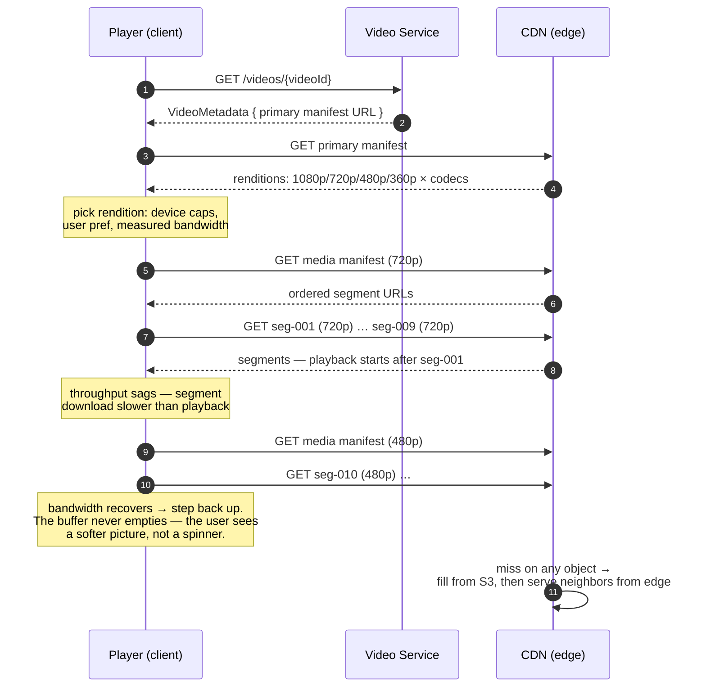

# Design YouTube

> **Prerequisites:** [Design Dropbox](/synapse/system-design-from-first-principles/case-studies/dropbox), [Analytics & Column Stores](/synapse/system-design-from-first-principles/data-foundations/analytics-and-column-stores) | **You'll be able to:** design the upload → process → serve pipeline and say why each stage lives at a different scale; orchestrate a transcoding DAG whose stages are safely re-runnable, grounded in batch-processing fault-tolerance principles; explain adaptive bitrate streaming precisely enough to say what the client, the CDN, and the origin each actually do.

## The problem (why this exists)

"Design YouTube" — a video-sharing platform where users upload videos and other users watch them. Two functional requirements, and that brevity is the trap. This is the sixth rep of [the delivery framework](/synapse/system-design-from-first-principles/foundations/the-interview-at-10000-feet), and where [Dropbox](/synapse/system-design-from-first-principles/case-studies/dropbox) broke the assumption that a payload fits in a request, YouTube breaks a subtler one: that the thing you store is the thing you serve. A file-storage service hands back the bytes it received. A video platform receives *one* file and serves *hundreds* of derived files — segments, renditions, manifests — manufactured by a processing pipeline that sits between upload and playback and is by far the most computationally expensive thing in the design. Upload, process, serve: three stages, three scales, three bottlenecks.

**Functional requirements:**

1. Users can upload videos.
2. Users can watch (stream) videos.

*Below the line*: view counts, search, comments, recommendations, channels, subscriptions. For a feature-rich app like YouTube, pinning scope with the interviewer matters more than usual — this question is about the video pipeline, and everything else is a different interview.

**Non-functional requirements — quantified:**

1. **Highly available** — availability over consistency, in the [non-functional requirements](/synapse/system-design-from-first-principles/foundations/nonfunctional-requirements) discipline of naming the CAP stance. A video appearing for viewer B seconds after viewer A harms nobody.
2. Uploads and streams of **large videos — tens of GBs**.
3. **Low-latency streaming, even in low-bandwidth environments** — the NFR that forces adaptive quality rather than merely fast servers.
4. Scale: **~1M videos uploaded per day, 100M videos watched per day**.
5. **Resumable uploads.**

With only two functional requirements, the NFRs *are* the question — they characterize the complexity hiding inside "upload" and "watch." Read the scale numbers again: 100M watches against 1M uploads is a **100:1 read:write ratio on whole videos** — and since one watch streams hundreds of segment files while one upload lands once, the byte-level asymmetry runs orders of magnitude beyond even that. This is the [scaling-reads](/synapse/system-design-from-first-principles/patterns/scaling-reads) pattern at its extreme: a viral video is uploaded once, watched millions of times. Whatever we build, the watch path must be almost entirely absorbed by infrastructure that never touches our compute — and the upload path must feed a pipeline that chews through a firehose of hours-long files without falling behind.

## Intuition first

Build the naive version: `POST /upload` with the video bytes, store the file in blob storage exactly as received, and `GET /video` streams those original bytes back. One file in, the same file out — Dropbox with a play button.

It fails twice, and the two failures define the two halves of the real design.

**Failure 1 — the original file can't be played everywhere.** A video file is not one thing; it's frames and audio compressed by a **codec** (H.264, H.265, VP9, AV1 — encoder/decoder pairs trading compression time, efficiency, and quality) wrapped in a **container** format (the file layout holding video, audio, and metadata), and support for both varies by device and OS. The 4K H.265 file from a modern phone may be unplayable on an older smart TV, and its **bitrate** — the bits per second of playback the encoding demands — may exceed what a viewer on hotel Wi-Fi can sustain no matter what codec their device speaks. Serving the original means serving only the audience whose hardware and bandwidth match the uploader's; NFR 3 says exactly the opposite.

**Failure 2 — a whole file is the wrong unit to serve.** Even for a compatible device, "download then play" dies on simple arithmetic: a 10 GB video on a 100 Mbps connection takes **13+ minutes** to download before playback starts, and a network blip at minute 12 loses everything a plain HTTP download had fetched. Users expect playback in under a second and expect it to survive a train tunnel.

So the corrected instinct, in one sentence each way: on the **write** side, the original upload is not the product — it's *input* to a pipeline that transcodes it into many formats at many qualities; on the **read** side, the unit of serving is not the file but the **segment** — a few seconds of independently playable video — so a client can start instantly, fetch incrementally, and switch quality mid-stream as its bandwidth changes. This ladder holds for storage (store the raw file → store transcoded formats → store transcoded *segments*) and for watching (download whole file → fetch segments → adaptive bitrate streaming), and each rung fails in a way that names the next. The rest of this lesson is the working-out of those two sentences — plus the pipeline in the middle that manufactures segments from originals, which is where this case study earns its depth.

## How it works

### Core entities: the original, the facts, and the derived files

Three entities anchor this design — User, Video, VideoMetadata — and as in Dropbox, the architecture hides in the distinctions. This lesson makes the derived artifacts explicit:

- **User** — uploader or viewer.
- **Video** — the raw bytes of the *original* upload. Lives in blob storage, and after processing completes it is never served to a viewer again; it's retained as the pipeline's input (and re-input — see In production).
- **VideoMetadata** — the record: uploader, title, status (`uploading` / `processing` / `ready`), the upload-chunk manifest while ingest is in flight, and — once processing completes — the URL of the primary manifest. This is the only entity the serving API ever returns.
- **Renditions & segments** — the pipeline's output: the original split into a few-seconds-long segments, each transcoded into every (resolution × codec) combination in the ladder. Pure derived data — regenerable from the Video at any time, which is the property the pipeline's fault-tolerance story leans on.
- **Manifests** — the index over the segments: a **primary manifest** listing every available rendition, pointing at per-rendition **media manifests** that list the segment URLs in playback order. The manifest is what a "video URL" actually resolves to.

For VideoMetadata storage, the access pattern drives the choice: ~1M uploads/day is ~365M rows/year, access is point lookup by `videoId`, no query spans videos — so a horizontally partitioned store (Cassandra) sharded on `videoId` distributes uniformly, with no [data-model](/synapse/system-design-from-first-principles/data-foundations/data-models) tension. The interesting storage problem here isn't the database; it's the blob store and what the pipeline puts in it.

### The API — metadata in, credentials out

Per the [API design](/synapse/system-design-from-first-principles/foundations/api-design) discipline, and following the Dropbox precedent, no endpoint carries video bytes:

```
POST /videos/presigned-url   { title, size, chunkFingerprints[] }
                             → { videoId, uploadUrls: presigned PUT per missing chunk }
GET  /videos/{videoId}       → VideoMetadata   // incl. primary-manifest URL when status = ready
```

The upload endpoint issues credentials for direct-to-blob transfer; the watch endpoint returns *facts*, one of which is a manifest URL — the client takes it from there, against the CDN, without our servers in the byte path in either direction.

### High-level architecture

Three planes. The **upload path** (left): metadata registration through the Video Service, bytes direct to blob storage. The **processing plane** (middle): blob-storage events trigger an orchestrated DAG of split/transcode/assemble workers, reading and writing only blob storage. The **watch path** (right): metadata from the service, then manifests and segments from the CDN. The dashed lines mark bytes that never touch our compute.

```d2
direction: right
classes: {
  client: {style: {fill: "#f3f4f6"; stroke: "#6b7280"}}
  edge:   {style: {fill: "#dbeafe"; stroke: "#2563eb"}}
  svc:    {style: {fill: "#dcfce7"; stroke: "#16a34a"}}
  data:   {style: {fill: "#ffedd5"; stroke: "#ea580c"}}
  async:  {style: {fill: "#f3e8ff"; stroke: "#9333ea"}}
}
up: "Uploader" {class: client}
viewer: "Viewer\nplayer picks quality\nper bandwidth" {class: client}
gw: "LB / API Gateway" {class: edge}
cdn: "CDN\nsegments + manifests\nthe real video server" {class: edge}
vs: "Video Service\npresigned URLs,\nmetadata queries" {class: svc}
meta: "VideoMetadata DB\n(Cassandra, shard by videoId)\n+ LRU metadata cache" {class: data}
s3: "Blob storage (S3)\noriginals · segments ·\nrenditions · manifests" {class: data}
orch: "Pipeline orchestrator\n(Temporal-style)\nbuilds + drives the DAG" {class: async}
workers: "Transcode worker fleet\nsplit · transcode · assemble\nelastic, queue-driven" {class: svc}
up -> gw: "metadata ops only"
gw -> vs
vs -> meta: "rows + status"
vs -> s3: "mint presigned URLs"
up -> s3: "video chunks: PUT\ndirect, presigned" {style.stroke-dash: 3}
s3 -> orch: "event: upload complete"
orch -> workers: "schedule DAG tasks"
workers <-> s3: "read original,\nwrite segments + manifests"
orch -> meta: "status: ready\n+ manifest URL"
viewer -> gw: "GET /videos/{id}"
viewer -> cdn: "manifests + segments" {style.stroke-dash: 3}
cdn -> s3: "fill on miss"
```

Walk the two journeys through it. **Upload:** register the video (row created, status `uploading`), PUT chunks directly to blob storage over presigned URLs; when storage confirms completion, an event kicks the orchestrator — everything downstream is asynchronous. **Watch:** fetch VideoMetadata (one point read, cache-friendly), pull the primary manifest from the CDN, pick a rendition, fetch segments — quality decisions made *by the player*, request by request. The Video Service, like Dropbox's File Service, never touches a video byte; unlike Dropbox, there's now a third actor — the pipeline — that touches *every* byte, many times, and its design is deep dive 2.

## Deep dives

### Getting the file in: resumable upload, at video size

The mechanics are the [Dropbox](/synapse/system-design-from-first-principles/case-studies/dropbox) large-blobs pattern — client-side chunking into **5–10 MB** pieces, each with a fingerprint hash; a chunk list in VideoMetadata; presigned PUTs direct to blob storage; **S3 event notifications** (not client claims) marking chunks uploaded; resume by fetching the manifest and skipping chunks already marked (mirroring the Dropbox pattern; S3 Multipart Upload is the productized form). That lesson derives the pattern rung by rung — why bytes can't traverse app servers, why the client must chunk, why storage must be the witness. We don't re-derive it; we ask what changes when the file is a video, and three things do.

**The timescales stretch — resume stops being an edge case.** A tens-of-GB video on a residential uplink is an upload measured in **hours** (the Dropbox arithmetic: 50 GB at 100 Mbps ≈ 1.1 h, and home *up*link is a fraction of that). Over hours, laptop lids close, Wi-Fi roams, phones change towers — interruption is the expected path, which is why resumable uploads belong in the NFR list itself. The chunk manifest isn't bookkeeping for the unlucky; it's the upload's actual state machine, and the client is written to crash and re-ask ("which chunks do you have?") as its normal loop.

**Integrity matters more, verified once, at the boundary.** A flipped bit in a Dropbox chunk corrupts one file a user might re-sync; a corrupt chunk here poisons the input to a pipeline about to spend real compute fanning it into hundreds of derived files, and the failure surfaces minutes later in a transcoder's error log. So the chunk fingerprints do double duty: resume bookkeeping *and* end-to-end integrity check — storage confirms arrival, the hash confirms the *right bytes* arrived, before the pipeline may start (the integrity framing is a rule of thumb, not from source).

**The finish line moves.** In Dropbox, "all chunks confirmed" flips the file visible — upload complete *is* the product. Here it merely transitions VideoMetadata to `processing` and fires the event that starts the pipeline; the video isn't watchable until the DAG finishes, minutes later. So the status field needs the honest intermediate state, and the uploader polls or gets notified on `ready`. One optimization shrinks the gap — **pipeline the pipeline**: have the client split the video into segments at upload time so processing starts on early segments while later ones are still in flight, at the cost of client complexity and garbage segments from abandoned uploads. We scope it out for simplicity, but naming the trade is senior-level polish.

### The processing pipeline: a transcoding DAG

The upload landed one original file. What watching requires (deep dive 3) is that file split into segments, each transcoded into every rendition of a (resolution × codec) ladder, plus manifests indexing the results. The pipeline's shape: split → transcode per segment (fan-out) → generate manifests (fan-in) → mark complete — and this work forms a **directed acyclic graph** — each step has explicit inputs and outputs, segment-level work has no cross-segment dependencies, and the expensive middle stage parallelizes across as many workers as you can buy. This is precisely the structure DDIA's batch-processing chapter formalizes: a **workflow** — a DAG of jobs where one job's output is the next job's input [p. 464] — with a **workflow scheduler** that runs a consumer job only after all its input-producing jobs have succeeded [p. 465]. The build-up, as a slideshow:

```d2
direction: right
title: "1 · Upload complete — the orchestrator plans the DAG" {near: top-center}
classes: {
  svc:   {style: {fill: "#dcfce7"; stroke: "#16a34a"}}
  data:  {style: {fill: "#ffedd5"; stroke: "#ea580c"}}
  async: {style: {fill: "#f3e8ff"; stroke: "#9333ea"}}
}
s3in: "Blob storage\noriginal video\n(chunks assembled)" {class: data}
orch: "Orchestrator\nDAG: split → transcode×N → assemble\nnothing scheduled yet" {class: async}
split: "Split step\nffmpeg-style: cut original\ninto ~seconds-long segments" {class: svc}
s3seg: "Blob storage\nsource segments\nseg-001 … seg-450" {class: data}
s3in -> orch: "event: upload complete"
orch -> split: "task 1: split"
split -> s3seg: "write source segments,\nreport segment list"
```

```d2
direction: right
title: "2 · Fan-out — the (resolution × codec) matrix, in parallel" {near: top-center}
classes: {
  svc:   {style: {fill: "#dcfce7"; stroke: "#16a34a"}}
  data:  {style: {fill: "#ffedd5"; stroke: "#ea580c"}}
  async: {style: {fill: "#f3e8ff"; stroke: "#9333ea"}}
}
s3seg: "Blob storage\nsource segments" {class: data}
orch: "Orchestrator\none task per\nsegment × rendition" {class: async}
w1: "Worker\nseg-001 → 1080p H.264" {class: svc}
w2: "Worker\nseg-001 → 480p H.264" {class: svc}
w3: "Worker\nseg-002 → 1080p VP9" {class: svc}
w4: "Worker …×N\naudio · transcripts\nin parallel too" {class: svc}
s3out: "Blob storage\ntranscoded segments\nkeyed by (video, seg, rendition)" {class: data}
orch -> w1
orch -> w2
orch -> w3
orch -> w4
s3seg -> w1: "read"
s3seg -> w2: "read"
s3seg -> w3: "read"
s3seg -> w4: "read"
w1 -> s3out: "write"
w2 -> s3out: "write"
w3 -> s3out: "write"
w4 -> s3out: "write"
```

```d2
direction: right
title: "3 · Fan-in — manifests assembled, video marked ready" {near: top-center}
classes: {
  svc:   {style: {fill: "#dcfce7"; stroke: "#16a34a"}}
  data:  {style: {fill: "#ffedd5"; stroke: "#ea580c"}}
  async: {style: {fill: "#f3e8ff"; stroke: "#9333ea"}}
}
s3out: "Blob storage\nall transcoded segments\nconfirmed present" {class: data}
orch: "Orchestrator\nall transcode tasks done →\nschedule assembly" {class: async}
asm: "Assemble step\nwrite media manifest per rendition\n+ primary manifest" {class: svc}
s3man: "Blob storage\nmanifests" {class: data}
meta: "VideoMetadata DB\nstatus: ready\nmanifest URL set" {class: data}
s3out -> orch: "fan-in: last task reports"
orch -> asm: "task: assemble"
asm -> s3man: "write manifests"
orch -> meta: "flip status — the\nvisibility point"
```

Three design decisions inside that picture deserve their DDIA grounding, because they're what the interviewer probes.

**Intermediate data lives in blob storage; workers pass URLs, not files.** This design uses S3 for all temporary pipeline data, and it's the MapReduce-lineage move: materializing each stage's output durably means the workflow's state *is* the object store's contents — any consumer task can start wherever the producer left things, on any machine [p. 465–466]. The alternative — streaming stage-to-stage through worker memory, as dataflow engines do for speed [p. 466] — couples stage lifetimes and complicates recovery; when stages run for minutes and the artifacts (segments!) are the actual product, durable handoff is the right default.

**Failure is handled at task granularity, leaning on one property of batch work.** With hundreds of parallel tasks per video across a large fleet, some tasks *will* die — hardware faults, network partitions, or deliberate preemption [p. 465]. DDIA's principle: because a batch task reads read-only input and generates its output from scratch, recovery is simply *discard the partial output and reschedule the task elsewhere* — no cross-task state to repair, no rerunning the whole job for one lost segment [p. 466, p. 451]. This is why the DAG's tasks are kept independent (MapReduce's rationale, inherited here [p. 466]), and it has a money consequence: preemption-tolerant work can run on **spot/preemptible instances** — cheap capacity killed more often than hardware actually fails [p. 465] — no footnote when transcoding dominates the compute bill (spot fleets as standard practice: rule of thumb, not from source; the preemption-tolerance argument is DDIA's).

**Idempotence via content-addressed outputs — the expert layer.** "Reschedule the task" is only safe if running a task *twice* is harmless: retries mean duplicate executions, and a preempted worker may have written half its output — or all of it, dying before it reported. Make the output location a pure function of the inputs — the object key derived from (video, segment, rendition), or, borrowing Dropbox's content-addressing, from a hash of the source segment plus the transcode recipe — and re-execution just overwrites (or skips) an identical artifact; the immutable-input, regenerate-from-scratch discipline is exactly what makes re-invocation safe, the property DDIA credits for MapReduce's ability to blindly retry stateless tasks [p. 467, p. 451]. The orchestrator's bookkeeping ("did seg-042×720p-VP9 complete?") then needs only at-least-once accuracy — the artifact store converges regardless — and re-processed segments produce byte-stable keys, so downstream manifests don't churn. (Applying content-addressing to transcode outputs: rule of thumb, not from source — the fault-tolerance principle it instantiates is DDIA's.)

For the orchestrator itself, the advice is to *use one, not build one* — Temporal is a fitting choice; DDIA names the workflow-scheduler category (Airflow, Dagster, Prefect) and the underlying resource-orchestration machinery of schedulers, resource managers, and per-node task executors [pp. 461–465]. In the interview, the winning move is knowing what the orchestrator must do — hold the DAG, dispatch when dependencies clear, detect dead tasks, retry with the idempotence argument above — and then deliberately buying it.

### Serving at watch scale: the client steers, the CDN serves

The pipeline manufactured the ingredients; **adaptive bitrate streaming** is the serving protocol built on them. The insight is where the intelligence lives: *the server is dumb, the client is smart*. Origin and CDN serve static files — manifests and segments — over plain HTTP; every adaptive decision is the player's.



The client's loop: fetch metadata → fetch primary manifest → choose a format from network conditions and settings → stream segments, continuously re-measuring; if throughput degrades, drop to a lower-bitrate rendition for the *next* segment, if it improves, step up. Segment boundaries make quality switching seamless — every segment is independently playable, so a 480p segment can follow a 720p one mid-video. This is why the pipeline had to produce segments-times-renditions rather than whole files-times-renditions: the switch points are the product.

Now scale it. 100M watches/day against 1M uploads/day is the read asymmetry, and each component takes its share of the load. The **Video Service** is stateless — horizontal scaling, solved. The **metadata DB** partitioned by `videoId` spreads load uniformly *except* for the hot-video problem — a viral video's row hammers one partition — mitigated by wider replication plus a distributed **LRU metadata cache**, the same [indexing](/synapse/system-design-from-first-principles/data-foundations/indexing)-adjacent read-path reasoning as every hot-key fix. But metadata is kilobytes; the tonnage is segments, and blob storage's problem isn't capacity — it's *geography*: one origin region is far from most of a global audience, adding latency and buffering for distant viewers.

The [CDN](/synapse/system-design-from-first-principles/building-blocks/cdn-and-edge) is the answer, and the honest framing is that the CDN is the actual video server — cache both segments *and* manifests at edge nodes near viewers. For a hot video the entire watch session — manifest fetches, every segment at every quality — is served edge-local, and *our* system sees exactly one request: the metadata lookup. The origin's residual duties: cache fills, the metadata/URL path, and the long tail too cold to be cached anywhere. That's the read:write asymmetry resolved by placement — writes and processing land on infrastructure we run; reads, 99%+ of all traffic, land on infrastructure whose entire job is being near users. (What the CDN bills for this is the cost story's other half — see Numbers.)

The whole final architecture once more, in C4 Container notation — pan and zoom; click any element for its doc (rendered live from this module's `youtube.c4` model):

<iframe
  src="/c4/view/sdfp_youtube_container"
  width="100%"
  height="520"
  style="border: 1px solid var(--border, #2b2b2b); border-radius: 8px;"
  loading="lazy"
  title="YouTube — C4 Container view (final architecture)"
></iframe>

### Hands-on: run this design

This design's low-level structure — the C4 **code level** inside the transcoding pipeline (click any box for its doc):

<iframe
  src="/c4/view/sdfp_youtube_code"
  width="100%"
  height="480"
  style="border: 1px solid var(--border, #2b2b2b); border-radius: 8px;"
  loading="lazy"
  title="YouTube — C4 code level (inside the transcoding pipeline)"
></iframe>

A **runnable implementation** of the transcoding pipeline lives at `proof-of-concepts/06-case-studies/06-youtube/` in the repo root — the three classes above (`DagOrchestrator`, `SegmentTranscoder`, `ManifestAssembler`) mirroring the code view, over Redis.

```bash
cd proof-of-concepts/06-case-studies/06-youtube
./run            # build + start pipeline (8370) + Redis (8371)
./run test       # mypy --strict + smoke
./run stop
```

`./run test` exercises the DAG: a 3-segment × 3-rendition video fans out to **9 tasks**, fans in to **3 adaptive manifests**, and flips to **live**; a completed video re-processes as a no-op (content-addressed output ⇒ idempotent); and injecting one failed task stops the DAG at **8/9 processing**, after which a re-run transcodes *only* the missing task and goes live — retry at task granularity, never redoing finished work.

## Trade-offs

The three decisions this design turns on, in the [thinking-in-tradeoffs](/synapse/system-design-from-first-principles/foundations/thinking-in-tradeoffs) frame:

| Option | Gives you | Costs you | Use when |
| --- | --- | --- | --- |
| **Pre-transcode everything** (the design used here) | Every rendition ready the instant the video is; watch path is pure static file serving; pipeline runs once per video | Full compute + storage spent on every video *including the never-watched long tail*; new-codec rollout = re-encode campaign | Watch latency is sacred and most content gets some viewership |
| **Transcode on demand / lazily** | Pay compute only for watched (video, rendition) pairs; storage holds original + hot renditions | First viewer at a quality eats transcode latency (or gets a fallback rendition); pipeline must run at *watch* time — your spikiest, least schedulable moment | Extreme long-tail catalogs where most uploads are never watched (rule of thumb framing, not from source) |
| **Hybrid: full ladder for a popular head, minimal ladder + on-demand for the tail** | Cost tracks actual watching | Popularity prediction + a promotion pipeline; two serving paths to operate | Platform scale, where the tail is the majority of bytes but a minority of watches (rule of thumb, not from source) |

The rendition matrix and the segment length are the two knobs inside the chosen design:

| Axis | Small ladder (e.g. 3 renditions, 1 codec) | Big ladder (5+ resolutions × 2–3 codecs) |
| --- | --- | --- |
| Storage & transcode cost per video | ~sum of a few renditions | multiplies per codec family added |
| Bandwidth per delivered view | coarser steps → more bits than needed at many bandwidth levels | finer steps + newer codecs → fewer bits for the same quality |
| Device coverage | one codec must be universally decodable (H.264's role) | modern devices get efficient codecs; old devices keep the fallback |
| Where it wins | tail videos, cost-sensitive | head videos, where egress dwarfs storage |

| Axis | Shorter segments (~2–4 s) | Longer segments (~6–10 s) |
| --- | --- | --- |
| Quality-switch reaction time | fast — next decision point is seconds away | sluggish — committed to a quality for longer |
| Startup latency | first playable unit arrives sooner | later |
| Request overhead & manifest size | more segments → more requests, bigger manifests | fewer, smaller |
| Compression efficiency | each segment self-contained → more keyframe overhead | better compression per byte |

The segment length is specified as "a few seconds" and left there; the endpoints of both tables are rules of thumb, not from source — but the *shape* (segment length trades adaptation speed against overhead; ladder size trades per-video cost against per-view cost) is the answer the interviewer wants articulated.

## Numbers that matter

Every figure ends in a decision, per the [estimation discipline](/synapse/system-design-from-first-principles/foundations/estimation-and-numbers):

| Quantity | Value | What it decides | Source |
| --- | --- | --- | --- |
| Uploads | ~1M/day ≈ 12/s average | Metadata: ~365M rows/year → partitioned store (Cassandra by videoId) | Requirements |
| Watches | 100M/day; **100:1** watch:upload | The read path must live on the CDN, not the origin | Requirements |
| Whole-file download | 10 GB at 100 Mbps = **13+ min** | Kills download-then-play; forces segments | Worked above |
| Max video size | tens of GBs | Upload measured in hours → resumable ingest is an NFR | Requirements |
| Upload chunk size | 5–10 MB, fingerprinted | Resume granularity + integrity unit (the Dropbox pattern) | Design choice |
| Segment length | a few seconds | The adaptation + startup unit — see Trade-offs | Design choice |

The rendition storage math, worked (bitrates are a rule of thumb, not from source; the method is the point). Take 1 hour of video and an H.264 ladder — 1080p @ 5 Mbps, 720p @ 2.5, 480p @ 1.25, 360p @ 0.75:

- Per rendition, size = bitrate × duration: 1080p → 5 Mbps × 3,600 s = 18,000 Mb ≈ **2.25 GB**; 720p ≈ 1.13 GB; 480p ≈ 0.56 GB; 360p ≈ 0.34 GB.
- Ladder total ≈ **4.3 GB** — the whole ladder costs roughly **2×** its own top rendition, because bitrates halve down the ladder and the geometric series converges.
- Add a second codec family (say VP9/AV1 for efficient devices) and stored bytes roughly double again — the multiplier is **per codec, not per resolution**, which is why "just add AV1" is a storage *and* re-encode-campaign decision, not a config change.

And the honest cost story that frames every one of these knobs (structure is rule-of-thumb reasoning, not from source): **transcode compute and rendition storage are paid once per video; egress is paid per view.** For the popular head, a million views times per-view bytes dwarfs any one-time cost — so spending *more* compute and storage on bigger ladders and better codecs to shave per-view bits is pure profit. For the never-watched tail, the one-time costs are the *only* costs — so every rendition transcoded is money burned. One knob, two regimes, opposite settings: that sentence is the expert summary of this design's economics.

## In production

Operational reality for this design's *shape* — sourcing flagged; none of it claims to describe YouTube-the-company's internals.

**The pipeline runs behind a queue, and the backlog is the health metric.** Uploads are bursty; transcode capacity is finite; the buffer between them is a [job queue](/synapse/system-design-from-first-principles/building-blocks/queues-and-brokers), which doubles as the autoscaling trigger — queue depth grows, fleet grows. The operational corollary: *time-to-ready* (upload complete → status `ready`) is the SLO the backlog silently eats, and a pipeline that's "up" but hours behind is down as far as uploaders are concerned. Watch the age of the oldest unprocessed job, not just depth (metric discipline: rule of thumb, not from source).

**Poison videos need a dead-letter path.** Some uploads are malformed — corrupt containers, pathological codec parameters — and a worker that crashes on one will crash on the retry too. Unbounded retries turn one bad file into a fleet-wide grinder: cap attempts, shunt the job to a dead-letter queue for inspection, mark the video failed, tell the uploader (rule of thumb, not from source — standard queue hygiene). The batch frame explains why this is cheap: a poisoned job's partial outputs are discardable derived data; nothing needs repair beyond the verdict [p. 466].

**Re-encode campaigns are the pipeline's second life.** The original is retained precisely so renditions stay *derived* data — when a better codec arrives or a transcoder bug is found, the fix is to re-run the pipeline over the back catalog as a giant batch job. This is DDIA's human fault tolerance made concrete: immutable inputs plus regenerate-from-scratch outputs mean buggy processing is recoverable by rerunning, not by surgery on damaged state [pp. 451–452]. A campaign runs at low priority on spare/spot capacity, prioritized by expected watch-time — head first, tail maybe never (campaign mechanics: rule of thumb, not from source; the recoverability principle is DDIA's).

**Hot-video days are CDN days.** A viral video concentrates load in the two thin layers the origin still owns: the metadata row (hot partition — the LRU cache and replication mitigations from deep dive 3) and CDN fill traffic during the first minutes at each edge. After warm-up, the origin barely notices its own biggest event — which is the design working: *at peak, our infrastructure serves metadata; the CDN serves the video.*

**Watch the watch path from the player's chair.** Server-side metrics can be green while viewers buffer: the truth lives in client-measured signals — startup delay, rebuffer ratio, quality-switch rate, delivered bitrate. Instrument the player and ship those beacons home; they're also the ground truth for whether a bigger ladder or shorter segments would pay (client-side QoE telemetry as the primary signal: rule of thumb, not from source). At platform scale those beacons — plus view events — feed the batch/analytics side of the house, where the [column-store](/synapse/system-design-from-first-principles/data-foundations/analytics-and-column-stores) machinery takes over.

## Pitfalls & interview traps

<div style="border-left:4px solid #da5233;background:rgba(218,82,51,0.08);padding:0.6rem 1rem;border-radius:0 0.5rem 0.5rem 0;margin:1.25rem 0">

⚠️ **"Streaming" is not chunked downloading.** The classic sink: proposing to serve the original file in byte-range chunks and calling it streaming. Segment-based streaming is a *distinct and strictly better* design — a byte range of an arbitrary container isn't necessarily independently playable, and range-chunking gives the client nothing to adapt *with*: no renditions to switch between, no manifest to choose from. Segments are pre-cut, independently playable units that exist in multiple qualities — that's the property adaptive bitrate stands on, and it's manufactured by the pipeline, not by HTTP.

</div>

**Confusing upload chunks with playback segments.** Same instinct, two different objects. A *chunk* is a 5–10 MB transfer unit of the original, chosen by the uploading client for resumability — no playback meaning. A *segment* is a few-seconds playable unit cut by the pipeline. "So do you stream the chunks the uploader sent?" has exactly one right answer: no — chunks reassemble into the original; the pipeline cuts segments from that.

**Saying "CDN" without saying what's in it.** "Add a CDN" earns nothing until you name the objects: *segments and manifests both* — cache segments only and every session still hits origin for its manifest fetches, putting your origin in the startup path of every playback on earth. The follow-up — "what does the origin still serve?" — wants: cache fills, cold-tail videos, and the metadata API.

**Putting the smarts on the server.** Designs where the server picks quality per client — inspecting bandwidth server-side, transcoding on the fly per viewer — recreate the compute-in-the-byte-path mistake and break CDN cacheability (per-viewer responses can't be shared). Adaptive bitrate's whole architecture is that quality choice is client-local and every servable object is static and shared. "Who decides 480p?" — the player, nobody else.

**Treating the pipeline as a black box labeled 'transcoder'.** The senior signal (the leveling here: senior candidates live in post-processing and upload depth; staff+ steer into orchestration details) is decomposing it: split → parallel segment×rendition tasks → fan-in assembly, with retry-safety argued from idempotent, content-addressed task outputs — and knowing you'd *buy* the orchestrator. The follow-up an interviewer asks: "a worker dies mid-transcode — walk me through recovery" — wants task-granularity retry with discarded partial output [p. 466], not "the job restarts."

**Forgetting the video isn't watchable at upload-complete.** Answers that flip the video live when the last chunk lands have skipped the pipeline entirely. The status ladder — `uploading` → `processing` → `ready` — and *what flips each edge* (storage events; DAG fan-in completion) is the same visibility-discipline probe as Dropbox's manifest commit, one stage longer.

**The leveling bar.** Mid-level: clean API and entities, a working upload/watch design; converges on multipart upload and segment-based streaming with some prompting. Senior: fast through the high-level, then real depth on post-processing and resumable upload — the DAG shape, parallel transcoding, manifest generation, proactively argued. Staff+: drives orchestration and adaptation details as a peer — pipeline trade-offs, where idempotence comes from, what the client owns — and steers the conversation somewhere interesting on purpose.

## Check yourself

```quiz
{"prompt": "Why must the pipeline produce segments in multiple renditions, rather than one transcoded file per rendition?", "options": ["Whole files exceed blob storage object-size limits", "Adaptive bitrate switching happens at segment boundaries — the client can only change quality mid-video if each few-seconds unit exists independently at every quality", "Segments compress better than whole files", "Manifests cannot reference whole files"], "answer": "Adaptive bitrate switching happens at segment boundaries — the client can only change quality mid-video if each few-seconds unit exists independently at every quality"}
```

```quiz
{"prompt": "A spot instance running the seg-042 → 720p/VP9 transcode task is preempted; the orchestrator later runs the task again, and it turns out the first run had actually finished writing its output before dying. Why is this harmless in a well-designed pipeline?", "options": ["The orchestrator's exactly-once delivery guarantees prevent the second run", "Transcode outputs are versioned, and the newest version wins", "The task's output key is a pure function of its inputs, so the re-run regenerates a byte-identical artifact at the same location — batch tasks read immutable input and build output from scratch, making re-execution a safe overwrite or no-op", "VP9 transcodes are deterministic, so S3 deduplicates the object automatically"], "answer": "The task's output key is a pure function of its inputs, so the re-run regenerates a byte-identical artifact at the same location — batch tasks read immutable input and build output from scratch, making re-execution a safe overwrite or no-op"}
```

```quiz
{"prompt": "During playback, the viewer's bandwidth drops sharply. In adaptive bitrate streaming, which component detects this and what does it do?", "options": ["The Video Service detects slow responses and transcodes a lower-quality stream on the fly", "The CDN measures the connection and pushes smaller segments", "The player (client) measures its own segment-download throughput and requests subsequent segments from a lower-bitrate rendition listed in the manifest", "The metadata DB flags the session and downgrades the manifest URL"], "answer": "The player (client) measures its own segment-download throughput and requests subsequent segments from a lower-bitrate rendition listed in the manifest"}
```

```quiz
{"prompt": "The system sees 1M uploads and 100M watches per day. Which statement best describes how the design absorbs that asymmetry?", "options": ["Read replicas of the metadata DB serve the video bytes for watches", "Watches are batched and served hourly to smooth the load", "The upload and processing load lands on infrastructure we run, while nearly all watch traffic — manifests and segments — is served by CDN edges, so the origin sees roughly one metadata request per watch session", "The transcoding fleet is scaled to 100× the upload rate to keep up with watches"], "answer": "The upload and processing load lands on infrastructure we run, while nearly all watch traffic — manifests and segments — is served by CDN edges, so the origin sees roughly one metadata request per watch session"}
```

<details>
<summary><strong>Q:</strong> The manifest-assembly step is not allowed to start until every transcode task in the fan-out has succeeded. Name the batch-processing concept this implements, and explain what could go wrong if assembly ran after "most" tasks finished.</summary>

**A:** This is the workflow-scheduler dependency rule for a DAG of jobs: a consumer runs only when all the jobs producing its inputs have completed successfully [pp. 464–465] — assembly is the fan-in whose inputs are *every* (segment × rendition) artifact. Run it early and the media manifests reference segment objects that don't exist yet (or never will, if a task fails into the dead-letter path). Because the manifest URL flowing into VideoMetadata is what flips the video `ready`, a premature manifest is a *visibility* bug, not just a pipeline bug: players fetch it from the CDN, request the missing segment, and buffer or error mid-video — and the CDN might even cache the 404. The fan-in gate is this design's equivalent of Dropbox's manifest-commit discipline: derived data becomes visible in one place, only after every constituent artifact is confirmed durable — and recovery stays clean, because a missing artifact means re-running one idempotent task; nothing published needs retraction [p. 466].

</details>

<details>
<summary><strong>Q:</strong> Your platform's uploads are 90% long-tail videos that will never exceed a handful of views. Argue the case for and against keeping the pre-transcode-everything design, using the cost structure of the pipeline.</summary>

**A:** The cost structure (rule-of-thumb reasoning, method per this lesson's Numbers section): transcode compute and rendition storage are one-time, per-video costs; egress is per-view. **For keeping it:** operational simplicity — one pipeline, one serving path, every video behaves identically; watch latency is uniformly excellent, including for the tail video that unexpectedly goes viral (no cold-start transcode in the watch path, your spikiest and least schedulable moment); and the ladder total is only ~2× the top rendition, so the marginal storage may cost less than engineering a second path. **Against:** for the 90% tail, the one-time costs are the *only* costs — every rendition beyond the minimum is money burned on artifacts nobody fetches, compounding at 1M uploads/day. The hybrid follows the regimes: give the tail a minimal ladder (one or two universally decodable renditions), promote videos to the full matrix when early watch signals arrive, and accept the promotion pipeline plus a window where an ascending video serves fewer quality options. The senior-level point: neither extreme is "right" — the knob is set by where your catalog's watch distribution puts the bytes, and you should be able to say which regime dominates *your* platform before choosing.

</details>

## Sources

- `DDIA2 ch. 11 pp. 451–453 (batch fundamentals)` — batch jobs read read-only input and generate output from scratch [p. 451]; human fault tolerance — recover from buggy code by rolling back and rerunning, the principle behind re-encode campaigns [pp. 451–452].
- `DDIA2 ch. 11 pp. 461–466 (orchestration, workflows, faults)` — job orchestrators as distributed schedulers (task executors, resource managers, scheduling heuristics) [pp. 461–464]; workflows as DAGs of jobs with data handed off through durable storage, consumers gated on producers' success [pp. 464–465]; spot/preemptible instances and batch's preemption tolerance [p. 465]; task-granularity fault handling — discard partial output, reschedule elsewhere; independent tasks retried without rerunning the job [p. 466].
- `DDIA2 ch. 11 p. 467 (safe re-invocation)` — statelessness/immutability as what makes re-running mappers and reducers safe on failure, the principle behind idempotent transcode tasks.
- Flagged inline: bitrate-ladder figures, segment-length endpoints, on-demand/hybrid transcoding economics, spot-fleet framing, DLQ hygiene, campaign prioritization, QoE telemetry, and the chunk-fingerprints-as-integrity framing as rules of thumb, not from source.
