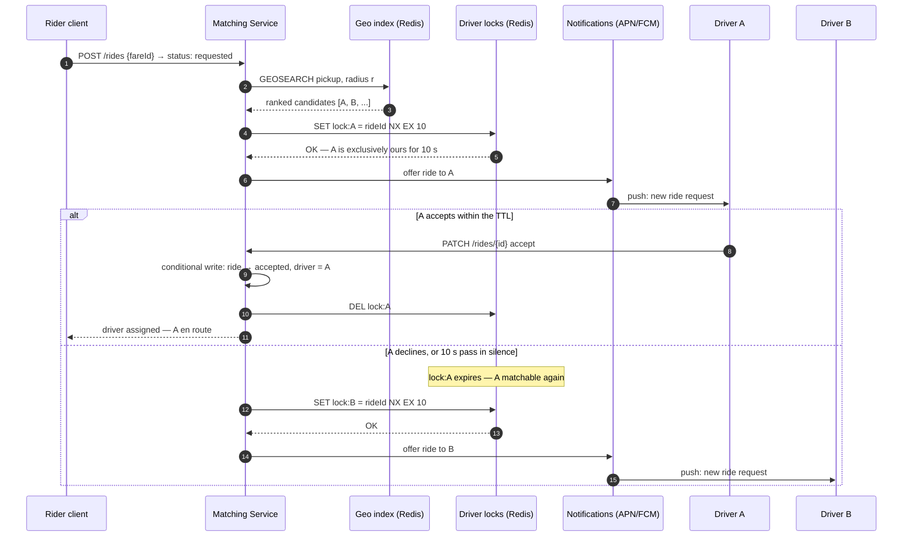

# Design Uber

> **Prerequisites:** [Design Ticketmaster](/synapse/system-design-from-first-principles/case-studies/ticketmaster), [Design WhatsApp](/synapse/system-design-from-first-principles/case-studies/whatsapp) | **You'll be able to:** absorb millions of location writes per second with the right geo index and defend Redis GEO against quadtrees from first principles; run the driver-lock ladder and state precisely what a TTL lock does and does not guarantee; model the trip as a durable multi-step workflow that survives crashed services and silent drivers.

## The problem (why this exists)

"Design Uber" — a ride-hailing platform: riders request a ride, the system matches a nearby available driver, the driver accepts and drives. This is the seventh rep of [the delivery framework](/synapse/system-design-from-first-principles/foundations/the-interview-at-10000-feet), and it introduces something no previous case study had: **the hot dataset is physical reality**. In [Ticketmaster](/synapse/system-design-from-first-principles/case-studies/ticketmaster) the contended inventory sat still in rows; in [YouTube](/synapse/system-design-from-first-principles/case-studies/youtube) the bytes were big but inert. Here, the data the whole design pivots on — where every driver is *right now* — changes every few seconds for millions of entities at once, is stale the moment you store it, and worthless an hour later. And the thing being allocated isn't a row but a human who can be in exactly one car at a time. Two hard problems, one system: a **geospatial firehose** on the write side, **matching contention** on the allocation side.

**Functional requirements:**

1. Riders can input a start location and destination and get a **fare estimate**.
2. Riders can **request a ride** based on that estimate.
3. Upon request, riders are **matched with a driver** who is nearby and available.
4. Drivers can **accept/decline** a request and navigate to pickup/drop-off.

*Below the line*: ratings in both directions, scheduled rides, ride categories (XL, Comfort). Name the rest out loud as out of scope — product thinking, cheaply demonstrated.

**Non-functional requirements — quantified:**

1. **Low-latency matching: under 1 minute to match — or to fail.** A bounded answer either way; a rider staring at a spinner has already opened a competitor's app. Per the [non-functional requirements](/synapse/system-design-from-first-principles/foundations/nonfunctional-requirements) discipline, the "or failure" clause is doing real work — it forces a deadline into the matching loop.
2. **Strong consistency in matching: no driver is ever assigned two rides simultaneously** — and, symmetrically, one ride is offered to one driver at a time. This is the CP corner, deliberately: a wrong match is worse than a slow one.
3. **High throughput at peak — 100k requests from the same location**: a stadium empties, and one geographic cell produces a city's worth of demand in minutes.

Read the three together and the interview's shape appears: NFR 3 says the load is *spatially skewed*, NFR 2 says allocation must be *exclusive*, NFR 1 says both must resolve in *seconds*. The rest of this lesson works out that triangle.

## Intuition first

Build the naive version. One Postgres database. A `drivers` table with `lat` and `lng` columns; every driver's phone POSTs its position every 5 seconds, each ping an `UPDATE drivers SET lat=?, lng=? WHERE id=?`. On a ride request, run `SELECT * FROM drivers WHERE available ORDER BY distance(lat, lng, ?, ?) LIMIT 10` and offer down the list.

It's honest, it demos fine with fifty drivers, and it dies twice at scale — the two deaths that define the first two deep dives.

**Death 1 — the write rate.** Put numbers on it: roughly **10 million drivers** pinging every 5 seconds is about **2 million location updates per second**. Sanity-check that against your [estimation instincts](/synapse/system-design-from-first-principles/foundations/estimation-and-numbers): a single beefy Postgres sustains on the order of tens of thousands of writes per second (rule of thumb, not from source) — two full orders of magnitude short, before a single rider has asked for anything. Even DynamoDB, which *can* scale to this, would cost around **$100k per day** at ~100-byte items. And notice what the writes are: each ping *overwrites* the last one; nobody will ever query where driver 483 was 40 seconds ago. We are paying durable-storage prices — WAL, replication, [B-tree maintenance](/synapse/system-design-from-first-principles/data-foundations/storage-engines) — for data whose value expires in seconds. Wrong store for the data's lifetime.

**Death 2 — the query shape.** "Nearest available drivers" is a two-dimensional proximity query, and B-trees index one dimension. An [index](/synapse/system-design-from-first-principles/data-foundations/indexing) on `lat` narrows to a horizontal band of the planet; the `lng` predicate then scans everything in that band — Vancouver matches a latitude band containing Newfoundland. B-tree indexes are not suited to multi-dimensional data, so without a purpose-built spatial index every match degenerates toward a scan with a distance computation per row, across millions of rows, on the critical path of a sub-minute SLA. Non-starter.

So the corrected instinct, one sentence per death: location data wants an **in-memory, spatially-indexed, self-expiring** store that absorbs the firehose and answers radius queries — not a relational table; the durable database holds only the **facts with a lifetime** — riders, drivers, fares, rides and their state. The rest of the design works out those two sentences, plus the problem the naive version hasn't even met yet: making sure two concurrent requests don't both "win" the same driver.

## How it works

### Core entities: four facts and one firehose

Five entities carry this design; the architecture hides in the mismatch of their lifetimes:

- **Rider** — profile, payment method.
- **Driver** — profile, vehicle details, availability status.
- **Fare** — a priced quote: pickup, destination, estimated fare and ETA. Created before the ride exists; what the rider says yes to.
- **Ride** — the durable spine: rider, driver, the fare it was created from, **status**, route, timestamps. Every important transition in this design is a transition on this row.
- **Location** — driver's latest lat/lng plus timestamp. The odd one out: written 2M times a second, overwritten on every write, worthless when stale. The first four are rows; this one is a firehose wanting a different store.

### The API — and what never crosses it

Per the [API design](/synapse/system-design-from-first-principles/foundations/api-design) discipline, the endpoints:

```
POST  /fare       { pickupLocation, destination }        → Fare (estimate + ETA)
POST  /rides      { fareId }                             → Ride (status: requested)
POST  /drivers/location   { lat, lng }                   → 200   // high-frequency
PATCH /rides/{rideId}     { action: accept | decline }   → Ride  // driver responds
```

A security note worth repeating in an interview: the client sends *nothing* the server can compute or already knows. No `userId` (session/JWT carries identity), no timestamps (server clocks), above all no `fareEstimate` — the fare is looked up by `fareId` server-side, because any price the client supplies is a price the client can edit.

### High-level architecture

Two clients, and behind the gateway a split that mirrors the entity analysis: a **Ride Service** owning the durable facts, a **Location Service** owning the firehose, a **Ride Matching Service** performing allocation, and a **Notification Service** delivering offers via APN/FCM push — the same last-mile delivery problem [WhatsApp](/synapse/system-design-from-first-principles/case-studies/whatsapp) solved with persistent connections, solved here with push because drivers can't hold open request connections all shift.

```d2
direction: right
classes: {
  client: {style: {fill: "#f3f4f6"; stroke: "#6b7280"}}
  edge:   {style: {fill: "#dbeafe"; stroke: "#2563eb"}}
  svc:    {style: {fill: "#dcfce7"; stroke: "#16a34a"}}
  data:   {style: {fill: "#ffedd5"; stroke: "#ea580c"}}
  async:  {style: {fill: "#f3e8ff"; stroke: "#9333ea"}}
}
rider: "Rider client" {class: client}
driver: "Driver client\npings location every ~5 s" {class: client}
gw: "API Gateway\nauth · rate limiting" {class: edge}
maps: "Third-party\nMapping API" {class: edge}
ride: "Ride Service\nfares · ride state" {class: svc}
loc: "Location Service\nabsorbs the ping firehose" {class: svc}
match: "Ride Matching Service\nranked candidates · offer loop" {class: svc}
notif: "Notification Service\nAPN / FCM" {class: svc}
db: "Ride DB (Postgres)\nriders · drivers · fares · rides" {class: data}
geo: "Geo index (Redis GEO)\nlatest position, TTL'd" {class: data}
locks: "Driver locks (Redis)\nSET NX, TTL 10 s" {class: data}
q: "Match queue (Kafka)\npartitioned by region" {class: async}
rider -> gw: "POST /fare · POST /rides"
driver -> gw: "pings · accept / decline"
gw -> ride: "fares, rides, accept"
gw -> loc: "location pings"
ride -> maps: "distance + ETA"
ride -> db: "Fare & Ride rows"
ride -> q: "enqueue match request"
q -> match: "consume; commit offset\nonly after match lands"
loc -> geo: "GEOADD driverId\n+ freshness TTL"
match -> geo: "GEOSEARCH around pickup"
match -> locks: "lock exactly one driver"
match -> notif: "offer to locked driver"
match -> db: "ride → matched / accepted"
notif -> driver: "push: ride offer" {style.stroke-dash: 3}
```

Walk the two journeys. **Fare & request:** the rider posts pickup and destination; the Ride Service gets distance and ETA from the mapping API, prices it, persists a Fare, returns it. The rider accepts; the Ride Service creates a Ride in `requested` and drops a match request onto the queue — queued, not called inline, so a surge buffers instead of overwhelming matching, and a crashed matcher's requests are re-consumed since the offset commits only after a match completes. **Ping & match:** drivers stream pings through the Location Service into the geo index; the matcher pulls a request, radius-queries for nearby available drivers, ranks them, and walks the list *one driver at a time* — lock, offer via push, wait 10 seconds, on decline or silence move on. Each verb — absorb, lock, walk — is a deep dive.

## Deep dives

### The location firehose: absorbing two million writes a second

The problem restated: 2M writes/second of overwrite-only, seconds-lived data, queried only as "who is within *r* of this point *right now*." The ladder builds in rungs.

**Rung 1 — keep the database, soften the blows: batch writes + a real spatial index.** Buffer pings and flush them in batches, cutting write transactions; replace the doomed B-tree with a **quadtree**-style spatial index — recursively partition the plane into four quadrants, subdividing where data is dense, so a proximity query descends straight to the leaf cells near the pickup point instead of scanning a latitude band. In Postgres this is the **PostGIS** extension. This rung is legitimately right *in a different problem*: for spatial data that is read-heavy and rarely moves — businesses on a map, houses for sale — an adaptive tree over durable rows is exactly right. Here it carries a poison pill: the batching interval is a staleness window — every second spent buffering is a second the "nearest" drivers are somewhere else — and quadtree rebalancing under constant movement means the index churns as fast as the data.

**Rung 2 — match the store to the data: in-memory geo index with TTL.** The landing solution is **Redis GEO**: `GEOADD` encodes each driver's lat/lng into a **geohash** — the two coordinates interleaved into one sortable value, so nearby points (edge cases aside) share prefixes — stored in a sorted set; `GEOSEARCH` (Redis ≥ 6.2, superseding `GEORADIUS`) answers radius and bounding-box queries directly against that structure. In-memory speed absorbs the write rate without batching, so no staleness window on the write path — and the design gets its most elegant piece for free: **a TTL as the freshness contract**. Expire each driver's entry if not refreshed: a driver whose app crashed, phone died, or tunnel swallowed the signal simply *ages out of matching* within one TTL. No health checker, no liveness protocol — absence of evidence becomes evidence of absence, enforced by the data's own lifecycle.

**The durability objection, inverted.** "It's in memory — what if Redis dies?" The deep insight of this dive: persistence (RDB snapshots / AOF) and Sentinel failover exist, but mostly *you don't need them* — every driver re-pings within ~5 seconds, so a cold replacement node rebuilds the whole working set in one ping interval. The data is self-healing because the source of truth was never the store; it's ten million phones. That's the general **write-absorption** pattern worth naming: when writes are high-frequency, low-value-per-write, and self-refreshing, absorb them in a volatile structure shaped like the query, and let durability live only where facts have a lifetime — the same instinct, opposite direction, as Ticketmaster moving hold-churn off the transactional tables.

**Geohash grid vs quadtree, settled honestly:** geohash is a *fixed* hierarchical grid — cheap, uniform, no rebalancing, indifferent to update rate, which is why it wins under constant movement; a quadtree is an *adaptive* partition — finer where data is dense, better for skewed static datasets, worse when the dataset is a swarm in motion. When the interviewer asks "why not a quadtree?", the answer is update rate, not query power.

### Matching and the driver lock: exactly one offer at a time

NFR 2 in mechanism form: when the matcher offers a ride, that driver must receive **no other offer** until they respond or 10 seconds elapse, and the ride is offered to one driver at a time. If you did [Ticketmaster](/synapse/system-design-from-first-principles/case-studies/ticketmaster), you have seen this exact problem: [an inventory unit claimable by exactly one party for a bounded window](/synapse/system-design-from-first-principles/patterns/dealing-with-contention). The seat became a driver, ten minutes became ten seconds, the inventory now drives around — but the ladder is the same. Climb it.

**Rung 1 — the lock in application memory.** Each matcher instance marks the driver "offered" in its own memory and starts a timer. Fails on arrival: matcher instances don't share memory, so two instances can both "lock" driver A — a race with no referee — and if an instance crashes after locking, no other instance knows the lock exists, stranding the driver. Local locks cannot coordinate a distributed decision.

**Rung 2 — the lock as a status column.** Move it into Postgres: transactionally set `driver.status = 'outstanding_request'` when offering. Coordination solved — the database serializes the matchers, exactly one transaction wins. But now *release* is the bug: the 10-second expiry lives in an in-memory timer, and if that process dies, the driver is locked forever. The patch — a cron sweeping expired locks — works but adds moving parts and sweep-lag during which drivers sit invisible.

**Rung 3 — the lock as a lease: Redis, `SET NX`, TTL 10 s.** The chosen design: to offer a ride, atomically set `lock:driverId → rideId` if absent, with a 10-second TTL. Acquisition failure means someone else holds the driver — skip to the next candidate. Accept in time → update the ride in the DB and delete the lock; silence → **the TTL is the release**, unconditionally, regardless of which processes have crashed. The status column solved coordination but left release in process memory; the TTL moves release into the store itself. The full loop, with the failure branch that makes it real:



**Now the honest part: what this lock does and does not guarantee.** A lock with a timeout is a **lease** — held by one node at a time, expiring unless renewed [pp. 366–367] — and DDIA is blunt that distributed locks and leases are prone to misuse and a common source of serious bugs [p. 373]. The canonical failure: your matcher acquires the lock on driver A, then stops — [a GC pause, a VM migration, paging](/synapse/system-design-from-first-principles/distributed-data/faults-clocks-and-time); multi-second pauses can strike between any two instructions, and the process resumes with no idea time passed [pp. 367–369]. The TTL expires mid-pause; another matcher, correctly, locks A for a different ride. Your matcher resumes as a **zombie** — a former leaseholder that hasn't learned it lost the lease [p. 374] — and keeps offering, or worse, assigning. DDIA's verdict: *it is not safe to assume only one node holds a lease at any moment* [p. 377]. The robust general fix is a **fencing token** — a number increasing with each lock grant, carried on every downstream write, storage rejecting any write bearing a lower token than one already processed [p. 375]; alternatively, storage supporting a conditional atomic compare-and-set write serves the same role [p. 376].

That alternative is exactly what this design has. The assignment that *counts* is not the Redis key — it's the ride row's transition, written conditionally: set `driver = A, status = accepted` only where the ride is still unassigned. A zombie's late write matches zero rows and bounces. Say the layering the way Ticketmaster taught: **the Redis lock is the experience** — no driver gets three simultaneous offer pings, no matcher wastes offers; **the conditional write in Postgres is the invariant** — exactly one driver ever assigned, even if every lease lies. Lose Redis entirely and you get messy offers for a few seconds, not double-booked drivers.

### The trip is a workflow: failures at every arrow

Zoom out from one offer to the whole ride: `requested → matched → offered → accepted → en route → in ride → completed → paid`. Every arrow is a network hop, most involve a human, and the process spans an hour. The offer loop alone must survive its own executor dying — the pointed question: the driver drops the phone on the passenger seat and takes a break; who moves on to driver B if the matcher holding the 10-second timer has meanwhile crashed?

**Rung 1 — scheduled self-messages: the delay queue.** When offering to A, simultaneously schedule a delayed message (SQS-style, 10-second delay): "if this ride is still unassigned, offer to the next driver." Now the timeout is durable — any matcher instance can consume it. The costs: pending timers that must be *cancelled or made harmless* when the driver does accept, and the race where A accepts at second 9.8 while the delayed message is already firing — every edge needs explicit handling, and the workflow's real state ends up smeared across queues, timers, and DB columns.

**Rung 2 — durable execution.** The pattern this is groping toward has a name. A multi-step operation spanning services is a **workflow** — a graph of tasks — and a workflow engine decides when and where each task runs and what happens on failure [p. 187]. **Durable-execution** engines (Temporal, Restate, AWS Step Functions) run the workflow as ordinary code but log every RPC and state change to durable storage, write-ahead-log style; when the executing process crashes, the framework re-executes the workflow *skipping* every step already completed — returning logged results instead of re-calling — which gives exactly-once semantics for the workflow as a whole [p. 188]. The matching loop becomes eight readable lines — offer to A, await accept with a 10-second timeout, on timeout advance to B — and the timer, loop position, and retry logic all survive any instance dying, resumed by whichever worker picks the workflow up. Worth the pedigree: human-in-the-loop, long-lived processes are the signature use case, and Uber itself authored Cadence, the project that gave rise to Temporal.

**Two fine-print clauses, both from DDIA, both interview gold.** First, durable execution's replay only dedupes what the framework logged: any *external* service in the workflow — above all the payment gateway at `completed → paid` — must itself expose an [**idempotent**](/synapse/system-design-from-first-principles/patterns/idempotency-and-exactly-once) API, with the caller supplying unique IDs to make retried calls safe [pp. 188–189]. That's the general truth about retries: a timed-out request may have succeeded, so retrying can execute the action twice unless idempotence is built into the protocol [p. 183] — charge-the-rider is where that stops being abstract, and idempotency keys get their full treatment in the payments discussion later in the book. Second, replay re-runs your code deterministically, so nondeterminism — random numbers, reading the system clock — breaks it; frameworks ship deterministic substitutes you must remember to use, plus static analysis (Temporal's Workflow Check) to catch violations [p. 189].

The whole final architecture once more, in C4 Container notation — pan and zoom; click any element for its doc (rendered live from this module's `uber.c4` model):

<iframe
  src="/c4/view/sdfp_uber_container"
  width="100%"
  height="520"
  style="border: 1px solid var(--border, #2b2b2b); border-radius: 8px;"
  loading="lazy"
  title="Uber — C4 Container view (final architecture)"
></iframe>

### Hands-on: run this design

This design's low-level structure — the C4 **code level** inside the matching service (click any box for its doc):

<iframe
  src="/c4/view/sdfp_uber_code"
  width="100%"
  height="480"
  style="border: 1px solid var(--border, #2b2b2b); border-radius: 8px;"
  loading="lazy"
  title="Uber — C4 code level (inside the matching service)"
></iframe>

A **runnable implementation** of the matching core lives at `proof-of-concepts/06-case-studies/07-uber/` in the repo root — the three classes above (`NearbyDriverQuery`, `DriverLock`, `OfferFlow`), over Redis GEO + Redis locks + Postgres.

```bash
cd proof-of-concepts/06-case-studies/07-uber
./run            # build + start api (8380) + Redis (8381) + Postgres (8382)
./run test       # mypy --strict + smoke
./run stop
```

`./run test` makes the contention concrete: retrying the same ride request returns the **same trip** (exactly-once, backed by `UNIQUE(request_id)`); and 8 riders scrambling for 5 drivers, fired concurrently, produce exactly **5 matches to 5 distinct drivers** — no driver offered to two riders — while the other 3 get a clean "no driver available". The per-driver `SET NX` lock is what serialises the offer.

## Trade-offs

| Option | Gives you | Costs you | Use when |
| --- | --- | --- | --- |
| Postgres/PostGIS, batched writes | One database; durable locations; real spatial index | Staleness = batch interval; write ceiling still looms; index churn under movement | Modest fleet, or spatial data that rarely moves |
| Quadtree-based index | Adaptive resolution where data is dense; strong for skewed, static datasets | Rebalances constantly under a moving swarm; another service to run | Read-heavy spatial search over slowly-changing entities |
| Redis GEO + TTL | Absorbs full write rate; radius queries native; TTL = free liveness; rebuilds in one ping interval | Volatile (needs RDB/AOF/Sentinel if you care); one more store; cell-boundary queries need care | High-frequency, self-refreshing location data — this problem |
| Driver lock: DB status column | Correct coordination via transactions; no new infra | Release depends on in-memory timers or sweep-lag crons; stranded locks on crash | Low contention, coarse windows, minimal stack |
| Driver lock: Redis `SET NX` + TTL | Atomic acquire; expiry survives any crash; lock churn off the DB | A lease, not a guarantee — zombies possible [p. 377]; needs the DB conditional write as backstop | Short exclusive windows at scale — this problem |
| Fixed 5 s ping interval | Simple; bounded staleness everywhere | 2M writes/s at fleet scale; battery + bandwidth burn for parked drivers | Small fleets, or as the baseline you then optimize |
| Adaptive ping interval | Big write reduction — stationary drivers ping rarely, fast movers often | On-device logic to design, test, and trust | Fleet scale, where the write rate is a cost center |

## Numbers that matter

- **~10M drivers × 1 ping / 5 s ≈ 2M location writes/second** — the number that kills the naive design; recite the arithmetic, not just the conclusion.
- **~$100k/day** — the DynamoDB estimate for absorbing that write rate naively (~100-byte items): "technically possible" is not "defensible."
- **Match-or-fail < 1 min; offer window 10 s.** Derived corollary: the offer loop gets at most ~5 sequential silent-driver hops before the deadline — rank candidates well (derived arithmetic, not from source).
- **100k requests from one location** at a peak event — the number justifying the queue in front of matching and the hot-zone discussion below.
- **Staleness ≈ speed × ping interval** (derived): a car at ~50 km/h (~14 m/s) moves ~70 m between 5-second pings, ~140 m at 10 seconds. Against a 1 km match radius, either is noise — why adaptive intervals are nearly free: precision matters at pickup, not candidate selection.
- **Geo-index footprint**: 10M entries × ~100 B ≈ ~1 GB — one Redis node's memory, not a cluster problem (rule of thumb, not from source).

## In production

**Hot zones are the real test.** The stadium empties: tens of thousands of riders and a knot of drivers in one geohash cell. This is textbook **skew** — a *hot spot* is a shard with disproportionate load; a single key with extreme load is a *hot key* [pp. 255–256] — and hashing doesn't save you, because uniform key-spreading does nothing when the workload itself concentrates on one key, DDIA's celebrity problem wearing GPS coordinates [p. 263]. The mitigations are the chapter's own: isolate the hot cell onto dedicated capacity, or subdivide it into finer sub-cells across shards — the spatial analogue of key salting, paying with fan-out on reads [p. 264]. The queue in front of matching absorbs the burst's *arrival* so matchers degrade to higher latency instead of dropped requests, and geographic partitioning of services, queues, and stores keeps one city's meltdown from browning out another — scatter-gather only when a pickup sits on a shard boundary. At the marketplace layer, ride-hailing platforms famously use dynamic ("surge") pricing as a demand valve and supply magnet in these moments — a product lever doing load-shedding's job (rule of thumb, not from source; treat any real company's pricing specifics as unknown).

**GPS lies a little.** Urban canyons bounce signals off glass towers; raw pings put drivers inside buildings or rivers. Production systems map-match — snap pings to the road network before indexing or ETA math (rule of thumb, not from source). The client is a design surface too: adaptive on-device ping logic (stationary drivers ping rarely; fast movers ping often) cuts the firehose at its source.

**Watch the funnel, not the servers.** This system's health is a funnel of matching outcomes: time-to-match percentiles against the 1-minute SLA (discipline per [latency, throughput & percentiles](/synapse/system-design-from-first-principles/foundations/latency-throughput-percentiles)), first-offer acceptance rate (every decline burns 10 seconds of a 60-second budget), lock-contention rate on drivers (rising contention = supply crunch), and geo-index freshness at query time. This paragraph is operational rule of thumb, not from source. One production fact worth naming: the workflow problem is real enough that Uber built Cadence — the durable-execution engine that begat Temporal — for use cases exactly like this.

## Pitfalls & interview traps

- **Quoting the fix without the numbers.** "I'd use Redis GEO" earns nothing by itself. The senior move is the arithmetic — 10M drivers / 5 s → 2M writes/s against a relational write ceiling — *then* the fix, then the quadtree-vs-geohash trade-off when probed.
- **Treating the driver lock as correctness.** The follow-up is scripted: *"your matcher GC-pauses for 12 seconds while holding the lock — what happens?"* If your answer depends on the lock being exclusive, you've been had; leases expire on schedule, zombies resume without noticing [p. 374], and only a fencing token or a downstream conditional write makes the invariant hold [pp. 375–376].
- **Forgetting the TTL on locations.** A geo index without expiry matches riders with drivers whose app died an hour ago. Freshness must be enforced by the store, not assumed of the fleet — which is exactly why the TTL lands here.
- **In-memory timers for the offer window.** Rung 2 of the lock ladder in disguise: any timeout that matters must live in durable or self-expiring form — a TTL, a delayed message, a workflow timer — never in the RAM of a process that might die ([p. 188] for the workflow form).
- **Trusting the client.** Accepting `fareEstimate` — or any price, identity, or timestamp — from the request body is the named red flag: everything the server can derive, the server must derive.

<div style="border-left:4px solid #da5233;background:rgba(218,82,51,0.08);padding:0.6rem 1rem;border-radius:0 0.5rem 0.5rem 0;margin:1.25rem 0">

⚠️ **The lock is not the invariant.** A TTL lock is a *lease*, and DDIA's warning is unconditional: it is not safe to assume only one node holds a lease at a time [p. 377]. The Redis driver lock buys a clean offer experience; the guarantee that no driver is ever double-assigned must come from a fenced or conditional write at the system of record [pp. 375–376]. Say both halves in the interview — candidates who only say the first half get the GC-pause question, and deserve it.

</div>

## Check yourself

```quiz
{"prompt": "Your naive design writes every driver ping as an UPDATE to a Postgres drivers table. At 10M drivers pinging every 5 seconds, what breaks first, and why?", "options": ["Storage volume — location rows accumulate faster than disks grow", "Write throughput — ~2M updates/sec is orders of magnitude beyond a relational database, before query costs even start", "Read latency — riders' SELECTs block behind the writes", "Nothing, if you add a read replica for the proximity queries"], "answer": "Write throughput — ~2M updates/sec is orders of magnitude beyond a relational database, before query costs even start"}
```

```quiz
{"prompt": "Why does Redis GEO put a TTL on each driver's location entry?", "options": ["To cap Redis memory usage as the fleet grows", "To force drivers to re-authenticate periodically", "So a driver whose app crashed or lost signal ages out of matching automatically — freshness enforced by the data's own lifecycle, with no health-check protocol", "To comply with location-data retention regulations"], "answer": "So a driver whose app crashed or lost signal ages out of matching automatically — freshness enforced by the data's own lifecycle, with no health-check protocol"}
```

```quiz
{"prompt": "A matcher acquires the Redis lock on driver A (TTL 10 s), then GC-pauses for 15 seconds. A second matcher locks A for a different ride. The first matcher resumes and tries to assign A. What actually prevents a double assignment?", "options": ["Redis rejects the zombie because it remembers the original lock holder", "Nothing — this design double-assigns drivers under GC pauses", "The TTL guarantees the lock stays valid while its holder is processing", "The conditional write on the ride row: the zombie's late update matches zero rows, so the lease's lie never reaches the system of record"], "answer": "The conditional write on the ride row: the zombie's late update matches zero rows, so the lease's lie never reaches the system of record"}
```

```quiz
{"prompt": "The matching workflow runs on a durable-execution engine and crashes right after driver A accepted but before the payment step. What happens on recovery?", "options": ["The workflow restarts from the beginning, re-offering the ride to driver A", "The framework replays the workflow, skipping logged steps and returning their recorded results, then continues from the payment step — which must be idempotent since it calls an external gateway", "The ride is lost, because workflow state lived in the crashed worker's memory", "The payment is exactly-once by the engine alone, with no requirements on the gateway"], "answer": "The framework replays the workflow, skipping logged steps and returning their recorded results, then continues from the payment step — which must be idempotent since it calls an external gateway"}
```

**Prose questions:**

1. *A stadium empties and 100k ride requests hit one geohash cell within minutes. Walk the failure from geo index to matcher to driver supply, naming one mitigation per layer.*

<details>
<summary>Answer</summary>

The cell is a textbook hot spot [pp. 255–256]: uniform hashing can't help because the workload itself concentrates on one key [p. 263]. **Index layer:** every match hits the same cell — isolate it on dedicated capacity or subdivide it into sub-cells spread across shards (spatial key-salting), paying with scatter-gather on reads [p. 264]. **Matching layer:** requests outrun matcher throughput — the Kafka queue absorbs the burst so requests queue rather than drop, matchers scale out on queue depth, and offsets committing only after a match means a crashed matcher loses nothing. **Supply layer:** no architecture conjures cars; the marketplace lever is dynamic pricing to shed demand and attract drivers (rule of thumb, not from source). The layered answer — index, service, marketplace — separates a systems answer from "add more servers."

</details>

2. *Product asks you to halve location-write volume by pinging every 10 seconds instead of 5. What does it cost, and is there a better cut?*

<details>
<summary>Answer</summary>

Staleness ≈ speed × interval: at ~50 km/h a driver moves ~70 m between 5-second pings, ~140 m at 10 seconds (derived arithmetic). Against a ~1 km matching radius, 140 m barely changes candidate selection; the damage shows up in *pickup* precision, ETA quality, and how long a vanished driver stays matchable (one TTL, now twice as long). The better cut is an adaptive interval: ping rate as a function of movement — a parked driver pings rarely, a highway driver every few seconds. Most of a fleet is slow or stationary at any moment, so the reduction is comparable or better with almost no staleness cost where it matters; the price is on-device logic that must be designed and trusted. Both schemes are *client-side* fixes — a reminder that the client is part of the system.

</details>

## Sources

DDIA2 ch. 9 pp. 366–369, 373–377 (locks, leases, process pauses, zombies & fencing) · DDIA2 ch. 5 pp. 183, 187–189 (retries & idempotence, workflows & durable execution) · DDIA2 ch. 7 pp. 255–256, 263–264 (skew, hot spots & key salting)
