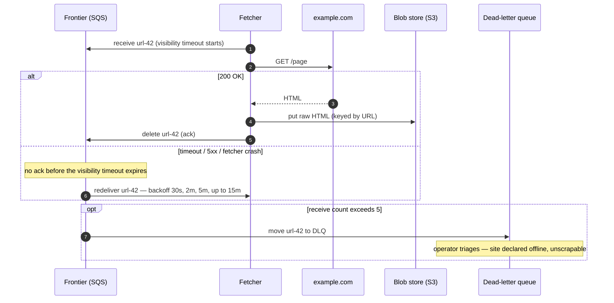

# Design a Web Crawler

> **Prerequisites:** [Design YouTube](/synapse/system-design-from-first-principles/case-studies/youtube), [Estimation & the Numbers](/synapse/system-design-from-first-principles/foundations/estimation-and-numbers) | **You'll be able to:** decompose a crawl into retry-safe pipeline stages and state exactly what visibility timeouts, acknowledgments, and DLQs each guarantee; design a frontier that enforces per-domain politeness without stalling global throughput; run the crawl-rate arithmetic that turns "10 billion pages in 5 days" into a machine count.

## The problem (why this exists)

"Design a web crawler" — a program that starts from a set of seed URLs, downloads each page, extracts its text, discovers the links on it, and follows them, until it has swept (nearly) the whole reachable web. The modern motivation is crisp: the output corpus feeds an LLM training pipeline — the crawler is the front end of exactly the batch data-prep flow DDIA describes, where raw website text lands in an object store and is then cleaned, deduplicated, and tokenized [DDIA2 p. 479]. A search engine would bolt indexing and ranking on top; the interview focuses on the crawl itself either way.

This is the eighth rep of [the delivery framework](/synapse/system-design-from-first-principles/foundations/the-interview-at-10000-feet), and it breaks the mold in two ways. First, **there is no user**. Nobody clicks anything; the "client" of this system is a data-science team that wants a corpus, and the systems we talk to — millions of web servers we don't own — are external, unreliable, and sometimes hostile. Second, it is the first design whose defining constraint is a **hard time budget**: not a latency SLA on a request, but a deadline on a job.

**Functional requirements**:

1. Crawl the web starting from a given set of seed URLs.
2. Extract text data from each page and store it for later processing.

*Below the line*: processing the text (the actual training), non-text media, dynamic JavaScript-rendered content, authenticated pages. Worth naming as a scoping assumption: you cannot reach every page on the web — "crawl the web" means the vast reachable majority, and clarifying that with the interviewer is cheap insurance.

**Non-functional requirements — quantified**:

1. **Fault tolerance**: handle failures gracefully and resume crawling without losing progress. With millions of external servers, failure is not an edge case — it is the steady state.
2. **Politeness**: adhere to robots.txt and never overload a website's servers.
3. **Efficiency**: complete the crawl in **under 5 days**.
4. **Scalability**: handle **10 billion pages**, average size **2 MB** (scale numbers worth asking for up front — they drive everything).

Notice the shape, per the [non-functional requirements](/synapse/system-design-from-first-principles/foundations/nonfunctional-requirements) discipline: requirements 3 and 4 push in one direction (crawl as fast as possible) while requirement 2 pushes in the other (per-site, crawl as *slowly* as each site demands). A crawler is a throughput machine wearing a per-domain speed limiter, and the tension between those two is where most of the design lives. Freshness — recrawling pages as they change — is out of scope for this one-shot corpus build; we name it, park it, and return to it briefly in production concerns.

## Intuition first

The naive crawler is ten lines of code, and every candidate should write it in their head before designing anything:

```python
frontier = list(seed_urls)
seen = set()
while frontier:
    url = frontier.pop(0)
    html = fetch(url)              # network call to someone else's server
    store_text(extract_text(html))
    for link in extract_links(html):
        if link not in seen:
            seen.add(link)
            frontier.append(link)
```

A while-loop with a list. It is genuinely correct on a small site, and it dies three distinct deaths at web scale — each death names one deep dive.

**Death 1 — it never finishes.** One process, one connection, fetching pages one at a time. Even at an optimistic 10 pages per second, 10 billion pages take 10^9 seconds — over thirty years. The [estimation](/synapse/system-design-from-first-principles/foundations/estimation-and-numbers) reflex should fire immediately: this workload is I/O-bound and embarrassingly parallel, so the fix is a fleet of fetchers — which instantly turns the innocent `frontier` list and `seen` set into *shared, distributed state*, and those are the actual design problems.

**Death 2 — it gets banned.** The loop fetches URLs in whatever order they were discovered — and links are overwhelmingly *internal*, so after a few hops the frontier is thousands of consecutive URLs from the same site, and the loop hammers one origin as fast as its connection allows. To the site, that is indistinguishable from a DoS attack. It ignores robots.txt, the file through which sites tell crawlers what they may fetch and how fast. Real sites respond with 429s, IP bans, and abuse complaints. Politeness is not etiquette; it is the survival requirement that keeps the crawl legal, welcome, and unblocked.

**Death 3 — it forgets everything and repeats itself.** The frontier and the seen-set live in process memory: one crash at page 4 billion and the crawl restarts from zero — the exact failure NFR 1 forbids. And the naive dedup is too weak even while it runs: `seen` compares raw URL strings, but `http://example.com`, `https://www.example.com/`, and `example.com/index.html` can be the same page, and entirely different URLs frequently serve identical content — a common enough occurrence to call out. Without real dedup the crawler burns its 5-day budget re-fetching what it already has; with cyclic link structures and adversarial "crawler trap" pages, it can loop forever.

The corrected instincts, one per death: parallelism with **shared state moved out of process memory** — the frontier becomes a durable distributed [queue](/synapse/system-design-from-first-principles/building-blocks/queues-and-brokers), the seen-set a database; a **domain-aware frontier** that spaces out requests per site no matter how many fetchers pull from it; and a **pipeline of small retry-safe stages** with durable checkpoints, so any machine can die at any moment and cost the system one message, not the crawl.

## How it works

### Core entities: a to-do list, a result, and a per-site contract

This system is framed by its interface rather than user-facing entities — but three kinds of state anchor the whiteboard:

- **Frontier entry (URL to crawl)** — the unit of work: the URL itself plus crawl bookkeeping — status, retry count, discovery depth, and once fetched, pointers to where its HTML and text live in blob storage. Lives as a row in the Metadata DB's URL table; the queue carries only its id — more on why below.
- **Page (crawl result)** — the raw HTML and the extracted text, both immutable blobs in object storage; the URL row points at them. The corpus we were asked to build is the set of these text blobs.
- **Domain state (the politeness contract)** — one row per domain: its parsed robots.txt rules (what's disallowed, the crawl-delay), and the last time we crawled it. This is the state that lets a thousand fetchers collectively behave like one polite visitor per site.

### The API — mostly internal, and say so

There is no public API to design, and stating that confidently is itself a signal. For data-processing questions, define the **system interface** instead: **input** — a set of seed URLs; **output** — text data extracted from web pages, landing in blob storage for the downstream training pipeline. Everything else — queue messages between stages, metadata reads and writes — is internal plumbing between our own components, not a contract with any external caller. The [API design](/synapse/system-design-from-first-principles/foundations/api-design) discipline still applies to one thing: the *data flow*, sketched as the sequence take URL from frontier → resolve DNS → fetch HTML → extract text → store → extract links → enqueue new URLs → repeat.

### High-level architecture

The architecture is that data flow made durable: a queue between every expensive step, blob storage for every large artifact, and a metadata database as the shared memory.

```d2
direction: right
classes: {
  client: {style: {fill: "#f3f4f6"; stroke: "#6b7280"}}
  edge:   {style: {fill: "#dbeafe"; stroke: "#2563eb"}}
  svc:    {style: {fill: "#dcfce7"; stroke: "#16a34a"}}
  data:   {style: {fill: "#ffedd5"; stroke: "#ea580c"}}
  async:  {style: {fill: "#f3e8ff"; stroke: "#9333ea"}}
}
web: "The web\n(external servers)" {class: client}
dns: "DNS providers\ncached, round-robin" {class: edge}
frontier: "Frontier queue (SQS)\nURL ids only" {class: async}
dlq: "Dead-letter queue\nunfetchable URLs" {class: async}
fetch: "URL Fetcher fleet\npoliteness gate + GET" {class: svc}
rl: "Rate limiter (Redis)\nper-domain sliding window" {class: data}
meta: "Metadata DB (DynamoDB)\nURL table · Domain table" {class: data}
rawhtml: "Blob store (S3)\nraw HTML" {class: data}
procq: "Processing queue (SQS)" {class: async}
parse: "Parser workers\ntext + link extraction" {class: svc}
text: "Blob store (S3)\nextracted text corpus" {class: data}
frontier -> fetch: "receive URL id"
fetch -> meta: "robots rules ·\nlast-crawl time"
fetch -> rl: "this domain,\nthis second?"
fetch -> dns: "resolve host"
fetch -> web: "GET page"
fetch -> rawhtml: "put raw HTML"
fetch -> procq: "enqueue parsed-me-next"
frontier -> dlq: "after 5 failed receives" {style.stroke-dash: 3}
procq -> parse: "receive page id"
parse -> rawhtml: "read HTML"
parse -> text: "put extracted text"
parse -> meta: "normalize + seen-check\ndiscovered links"
parse -> frontier: "enqueue unseen URLs"
```

Walk the loop. The **frontier queue** holds the URLs waiting to be crawled — seeded at start, fed continuously by the parsers; start technology-agnostic (Kafka, Redis, or SQS) and land on SQS for reasons the second deep dive makes precise. A **fetcher** pulls a URL, consults the Metadata DB's domain state and the Redis rate limiter (the politeness gate), resolves the host via cached **DNS**, fetches the page, writes the raw HTML to **blob storage**, and enqueues a pointer for parsing. A **parser worker** reads the HTML back, writes extracted text to blob storage, then normalizes and dedup-checks every discovered link against the Metadata DB, enqueueing only the unseen ones — closing the loop. S3 is chosen for the blobs because 10B × 2 MB of HTML is petabyte-class data that wants cheap, durable, scalable object storage — the same instinct that sent [YouTube](/synapse/system-design-from-first-principles/case-studies/youtube)'s video bytes and [Dropbox](/synapse/system-design-from-first-principles/case-studies/dropbox)'s file blocks to object stores rather than databases.

One coaching note worth repeating: ask where the seed URLs come from. Almost always they're given; asking shows you're thinking about the whole problem, and if pressed you can propose starting from major directories, news sites, and popular domains.

## Deep dives

### 1. The frontier is much more than a queue

The naive design treats the frontier as FIFO storage. At scale it is the **scheduler of the entire system**, and it has to answer a question a plain queue cannot: *of all the URLs I could crawl right now, which am I allowed to crawl, and which is worth crawling first?*

**Allowed: robots.txt and the crawl-delay.** Before touching a page, the crawler must honor the site's published rules. The flow: on first encounter with a domain, fetch its robots.txt, parse it, and store the rules in the Domain table (assume a one-time download for this design; real crawls refresh it periodically — expect that discussion to come up). Then, for every URL pulled off the queue: if the path is disallowed, acknowledge the message — delete it — and move on; if allowed, check the `Crawl-delay` directive against the domain's last-crawl timestamp. If not enough time has passed, **put the URL back with a delay** — SQS's `DelaySeconds` re-enqueues it to become visible when the wait is over. If enough time has passed, fetch and update the timestamp. The queue itself becomes the waiting room: URLs that arrived too early circle back instead of blocking a worker.

**Allowed: the global rate limit.** Robots.txt compliance alone doesn't stop a fleet from accidentally dog-piling: with N fetchers pulling independently, all N can hit the same domain in the same instant. The norm used here is **1 request per second per domain** (an industry rule of thumb, stated as such), enforced *globally* with a centralized Redis rate limiter — a sliding-window counter per domain that every fetcher checks before making a request. And one production-grade detail worth insisting on: **jitter**. If many fetchers are waiting on the same domain's window, they'll all retry the instant it resets, one will win, and the rest will stampede again in synchronized lockstep; a small random delay per fetcher breaks the synchronization.

**The structural view: shard the frontier by domain.** Politeness has a throughput consequence that motivates the frontier's shape. At 1 request/second, a single domain with a million pages needs a million seconds — about 11.6 days, alone blowing the 5-day budget for that domain (arithmetic from the politeness norm above, not a sourced figure). Per-domain throughput is *capped*; total throughput can only come from **breadth** — crawling thousands of domains concurrently, one polite stream each. The frontier must therefore interleave domains rather than serve them in discovery order (which, remember from Death 2, clusters same-domain URLs together). Thinking of the frontier as logically **sharded by domain** — every URL of a host in one lane, lanes consumed round-robin, a lane that's rate-limited delaying only itself — is the cleanest mental model; classic crawler architectures build exactly this as per-host queues. In this design the same effect emerges compositionally: the shared queue plus the per-domain Redis window plus `DelaySeconds` re-enqueue means a blocked domain's URLs step aside and everyone else's flow continues. Know both framings — the interviewer may push on either.

**Worth crawling first: prioritization.** For this one-shot LLM-corpus crawl, FIFO-with-politeness is defensible — every reachable page gets fetched eventually and coverage is what matters. Say that, then name what changes: a search-engine crawler with freshness requirements wants a **priority frontier**, ordering URLs by importance and recrawl due-date. This maps directly onto a "continual updates" extension: a **URL Scheduler** component that decides what enters the frontier and when, based on last-crawl time and page importance, instead of parsers enqueueing directly. The trade-offs table below prices the choice.

### 2. The fetch pipeline: a fault-tolerant multi-step process

The first deep dive decided *what* to crawl next. This one makes the crawl **unkillable**. The opening observation: the naive crawler service does everything — DNS, fetch, extract, enqueue — so any failure loses all progress on that page, and the fix is to **break the work into pipelined stages** connected by queues, each stage small enough to retry cheaply. This is DDIA's batch-processing insight wearing streaming clothes: keep parallel tasks independent so a failure is retried **at task granularity** — delete the failed task's partial output, run it again — rather than rerunning the whole job [DDIA2 pp. 465–466]; and just as MapReduce bought robustness under constant machine loss by writing every intermediate result to durable storage before the next stage reads it [DDIA2 p. 466], each of our stages checkpoints its output (HTML to S3, text to S3, rows to the Metadata DB) before the message that triggered it is acknowledged.

This design lands on two stages — **URL Fetcher** (fetch HTML, store raw to blob storage) and **Text & URL Extraction** (read HTML, store text, discover links) — noting text and link extraction *could* split further but aren't worth the overhead. The stage boundary earns its keep beyond fault tolerance: when the ML team later wants alt-text included in extraction, you rerun the cheap parse stage over stored HTML without re-fetching a single page.

Two rules make the stages safe. First, **the queue carries pointers, not payloads**: storing raw HTML in queue messages is an anti-pattern — queues aren't built for 2 MB payloads — so the message is just the URL's id in the Metadata DB. Second, **acknowledge only after output is durable**. This is the acknowledgment contract from DDIA: the consumer tells the broker it has finished processing so the message can be deleted, and a missing ack triggers redelivery to another consumer [DDIA2 p. 493]. In SQS terms: receiving a message starts a **visibility timeout** during which it's hidden from other consumers; the fetcher deletes the message only once the HTML is safely in blob storage. A fetcher that dies mid-page simply never deletes — the message reappears after the timeout and another fetcher picks it up. Crash recovery is nobody's job; it's the queue's default behavior. The same contract protects the parse stage.

Watch one URL survive the pipeline:

```d2
direction: right
classes: {
  client: {style: {fill: "#f3f4f6"; stroke: "#6b7280"}}
  svc:    {style: {fill: "#dcfce7"; stroke: "#16a34a"}}
  data:   {style: {fill: "#ffedd5"; stroke: "#ea580c"}}
  async:  {style: {fill: "#f3e8ff"; stroke: "#9333ea"}}
}
step: "Step 1 of 3 — claim, politeness gate, fetch, checkpoint" {shape: text; near: top-center; style: {font-size: 20; bold: true}}
frontier: "Frontier (SQS)" {class: async}
fetch: "Fetcher" {class: svc}
meta: "Metadata DB\nrobots rules · last crawl" {class: data}
web: "example.com" {class: client}
rawhtml: "S3: raw HTML" {class: data}
frontier -> fetch: "1 · receive url-42\n(visibility timeout starts)"
fetch -> meta: "2 · allowed? delay elapsed?"
fetch -> web: "3 · GET /page"
fetch -> rawhtml: "4 · put HTML —\nidempotent, keyed by URL"
```

```d2
direction: right
classes: {
  svc:    {style: {fill: "#dcfce7"; stroke: "#16a34a"}}
  data:   {style: {fill: "#ffedd5"; stroke: "#ea580c"}}
  async:  {style: {fill: "#f3e8ff"; stroke: "#9333ea"}}
}
step: "Step 2 of 3 — ack, hand off, extract" {shape: text; near: top-center; style: {font-size: 20; bold: true}}
frontier: "Frontier (SQS)" {class: async}
fetch: "Fetcher" {class: svc}
procq: "Processing queue (SQS)" {class: async}
parse: "Parser worker" {class: svc}
text: "S3: extracted text" {class: data}
fetch -> frontier: "5 · delete url-42\n(ack — HTML is durable)"
fetch -> procq: "6 · enqueue page-42"
procq -> parse: "7 · receive page-42\n(its own visibility timeout)"
parse -> text: "8 · put extracted text"
```

```d2
direction: right
classes: {
  svc:    {style: {fill: "#dcfce7"; stroke: "#16a34a"}}
  data:   {style: {fill: "#ffedd5"; stroke: "#ea580c"}}
  async:  {style: {fill: "#f3e8ff"; stroke: "#9333ea"}}
}
step: "Step 3 of 3 — discover, dedup, re-enter the frontier" {shape: text; near: top-center; style: {font-size: 20; bold: true}}
parse: "Parser worker" {class: svc}
meta: "Metadata DB\nURL table (seen-set)" {class: data}
frontier: "Frontier (SQS)" {class: async}
procq: "Processing queue (SQS)" {class: async}
parse -> meta: "9 · normalize 30 links ·\nseen-check → 12 unseen"
parse -> frontier: "10 · enqueue the 12 —\nthe loop closes"
parse -> procq: "11 · delete page-42 (ack)"
```

**Retries, backoff, and the DLQ.** Fetching is the stage most likely to fail — servers down, pages moved, connections slow — so failure handling must be designed, not hoped for. Walk the ladder: an in-memory timer (lost on crash, and a few seconds rarely helps); hand-rolled retry topics on Kafka with retry-at timestamps in messages (works, but you're maintaining it); or **SQS's built-in exponential backoff** — failed messages retried per the visibility timeout, backing off 30 seconds → 2 minutes → 5 minutes → up to 15 minutes. And retries must end: after 5 attempts (tracked by SQS's receive count), the message moves to a **dead-letter queue** and the site is declared offline and unscrapable. The DLQ is DDIA's answer to the **poison message** — one that repeatedly crashes its consumer would otherwise redeliver in a loop forever, wasting resources or blocking progress; moving it aside unblocks the pipeline, and the DLQ is monitored so an operator can inspect, fix, or drop what accumulates [DDIA2 pp. 494–495]. Poison *pages* are the crawler's own flavor: the malformed HTML that crashes the parser, the 2 GB "page", the server that answers one byte per second — each burns its retries and lands in the DLQ instead of eating the fleet.



**Name the guarantee honestly.** Visibility timeouts give **at-least-once** delivery, not exactly-once: a fetcher that stores the HTML and then dies *before deleting the message* leaves the URL to be redelivered and fetched again — the same double-processing window DDIA identifies for log consumers that fail between processing and recording their offset [DDIA2 p. 498]. The pipeline absorbs duplicates through [**idempotence**](/synapse/system-design-from-first-principles/patterns/idempotency-and-exactly-once) — an operation that has the same effect performed once or many times [DDIA2 p. 528]: writing HTML to blob storage keyed by (normalized) URL just overwrites itself, the URL row's status update is a no-op the second time, and the dedup check catches re-discovered links. Duplicate deliveries cost a wasted fetch, never a corrupted corpus. Had Kafka been chosen instead, the same at-least-once shape appears with different mechanics — messages retained in the log, consumers advancing offsets only after processing, a failed consumer's successor resuming from the last committed offset ([DDIA2 p. 498]) — which is why the SQS-vs-Kafka pick here is about ergonomics (built-in backoff, `DelaySeconds`, native DLQs) rather than semantics. The `<details>` block in Check yourself runs that comparison properly. If this pattern feels familiar, it should: it's [Uber](/synapse/system-design-from-first-principles/case-studies/uber)'s durable multi-step workflow with the human removed — every arrow a place a machine can die, every step checkpointed, every retry safe.

### 3. Dedup at scale: seen URLs and seen content

Efficiency's quiet killer is redundant work, and it comes in two distinct layers:

**Layer 1 — don't crawl the same URL twice.** Before a discovered link enters the frontier, check whether it's already known: the parser looks the URL up in the Metadata DB's URL table and enqueues only misses. The subtlety is **normalization** — lowercase the scheme and host, strip fragments and default ports, resolve relative paths, canonicalize trailing slashes — so the seen-check compares canonical forms rather than raw strings (the Death-3 problem). This check sits on the hot path of every discovered link, but it's a point lookup on a keyed table — exactly what a hash-style [index](/synapse/system-design-from-first-principles/data-foundations/indexing) is built for, and at 10B rows it's a large but boring table.

**Layer 2 — don't keep the same content twice.** Different URLs routinely serve identical pages — `example.com` and `www.example.com`, mirrors, syndicated articles — and whole domains that are pure duplicates of another are a surprisingly common occurrence on the web. URL dedup cannot see this; only the bytes can. So: **hash the (normalized) content** of each fetched page and check the hash against what we've already stored — a match means skip extraction and storage, just harvest the links or drop it. This matters doubly for an LLM corpus, where near-duplicate documents are actively removed during data prep anyway [DDIA2 p. 479] — cheap exact-dup filtering at crawl time shrinks everything downstream. It's the same fingerprint-before-upload move [Dropbox](/synapse/system-design-from-first-principles/case-studies/dropbox) used to skip re-uploading known blocks.

**Where the exact set gets expensive — and where probabilistic structures earn a mention.** There are two implementations worth weighing. The straightforward one: store the content hash as an indexed column in the Metadata DB and do an indexed lookup per fetched page. The objection writes itself — a 10-billion-row index, a lookup and possible write per page at thousands of pages per second — but that objection is worth pushing back on: modern databases handle large indexes well, the overhead is real but well-optimized, and the concern is safe to overlook at this scale. The seductive alternative is a **Bloom filter** — a probabilistic set (hosted in Redis, which ships one) that answers "definitely not seen" or "probably seen" in constant time and a fraction of the memory. Its price is **false positives**: "probably seen" is sometimes wrong, and each false positive means a genuinely new page silently skipped — for a corpus builder, quiet data loss. The verdict here is refreshingly anti-clever: the Bloom filter is a bit overkill here, candidates reach for it because it's famous, and the boring indexed lookup is the more practical choice. Deploy the nuance, not just the buzzword: exact set for correctness at this scale; probabilistic structures earn their place when memory, not correctness, is the binding constraint — they get a full treatment in [Probabilistic Data Structures](/synapse/system-design-from-first-principles/building-blocks/probabilistic-data-structures).

The whole final architecture once more, in C4 Container notation — pan and zoom; click any element for its doc (rendered live from this module's `web-crawler.c4` model):

<iframe
  src="/c4/view/sdfp_webcrawler_container"
  width="100%"
  height="520"
  style="border: 1px solid var(--border, #2b2b2b); border-radius: 8px;"
  loading="lazy"
  title="Web crawler — C4 Container view (final architecture)"
></iframe>

### Hands-on: run this design

This design's low-level structure — the C4 **code level** inside the frontier (click any box for its doc):

<iframe
  src="/c4/view/sdfp_webcrawler_code"
  width="100%"
  height="480"
  style="border: 1px solid var(--border, #2b2b2b); border-radius: 8px;"
  loading="lazy"
  title="Web crawler — C4 code level (inside the frontier)"
></iframe>

A **runnable implementation** of the frontier lives at `proof-of-concepts/06-case-studies/08-web-crawler/` in the repo root — the three classes above (`FrontierScheduler`, `PolitenessGate`, `UrlDeduper`), over Redis.

```bash
cd proof-of-concepts/06-case-studies/08-web-crawler
./run            # build + start api (8390) + Redis (8391)
./run test       # mypy --strict + smoke
./run stop
```

`./run test` exercises the frontier's three jobs: five seed URLs — three that normalize to the same, one robots-disallowed — admit **two** (dedup + robots); `/next` **rotates across hosts** so none monopolizes the fetchers; and after a host is dispatched, a second `/next` for it returns nothing until the politeness interval elapses — the per-host `SET NX PX` rate gate holding the crawl polite.

## Trade-offs

| Option | Gives you | Costs you | Use when |
| --- | --- | --- | --- |
| FIFO frontier (+ politeness gate) | Simplicity; full coverage; no ranking logic to build or tune | No control over *what* gets crawled first; important pages wait behind trivia | One-shot corpus crawl where coverage is the goal (this design) |
| Priority frontier (URL Scheduler) | Important/fresh pages first; foundation for recrawl scheduling | A scoring pipeline to build; a scheduler component; risk of starving low-priority domains | Search-engine crawls; any freshness requirement (the continual-updates extension above) |
| Exact URL/content dedup (indexed DB lookup) | Zero false positives — no page silently lost | A 10B-row index; a lookup per link/page (modern DBs handle it) | Correctness matters; scale within DB comfort (the pick here) |
| Probabilistic dedup (Bloom filter) | O(1) checks in a fraction of the memory | False positives = new pages silently skipped; needs sizing/tuning | Memory is the binding constraint and small loss is tolerable |
| One-shot crawl (this design) | Bounded job; simple "done" condition; no scheduler | Corpus stales immediately; recrawl = rerun everything | Training-corpus builds on a deadline |
| Continuous recrawl (URL Scheduler by last-crawl time/importance) | Freshness; incremental effort | Scheduling policy, priority logic, per-page recrawl state | Search indexes; monitoring; anything ongoing |

## Numbers that matter

All base figures below; the arithmetic is shown so you can rerun it live — being able to redo the math live is worth more than reciting conclusions. The coaching on *when*: don't front-load the math; run it at the moment it decides something — here, when someone asks "how many machines?"

- **The workload**: 10B pages × 2 MB average = **~20 PB of raw HTML** (product of the figures above) — this is why blob storage, not a database, holds pages. Budget: **5 days**.
- **Required rate**: 10B pages / 5 days (432,000 s) ≈ **~23,000 pages/second** sustained, fleet-wide (arithmetic from the figures above).
- **Per-machine ceiling**: a network-optimized AWS instance offers ~400 Gbps ÷ 8 bits/byte ÷ 2 MB/page = **25,000 pages/second** theoretical. Realistically, server latencies, DNS, politeness waits, and retries mean you utilize a fraction — assume (hand-waving acknowledged) **30%**, giving **7,500 pages/second per machine**.
- **Machine count**: 10B / 7,500 pages/s ≈ 1.33M seconds ≈ **15.4 days on one machine**; it parallelizes linearly, so **4 machines ≈ 3.85 days** — inside the 5-day budget. Four large machines to crawl the web is the punchline worth pausing on: this is a *bandwidth* problem, not a compute problem.
- **Parser fleet**: don't estimate it — autoscale on processing-queue depth (Lambda/ECS), letting the fleet track the fetchers' actual output.
- **Politeness arithmetic**: 1 req/s/domain (the norm above) means a 1M-page domain needs ~11.6 days alone (derived) — per-domain throughput is capped, so the fleet's speed comes from domain breadth, never per-site depth.
- **Retry budget**: backoff 30 s → 2 m → 5 m → 15 m, DLQ after **5** attempts.
- **DNS as the hidden bottleneck**: ~23k pages/s could mean ~23k lookups/s against a third-party provider's rate limits. Cache lookups per domain (all of a host's URLs reuse one resolution) and round-robin across multiple providers — a genuinely practical, low-effort measure. Paying a provider for higher limits is also legitimate given the deadline. The mechanics of resolution live in [networking essentials](/synapse/system-design-from-first-principles/foundations/networking-essentials).

## In production

Everything in this section is operational reality; where it isn't drawn from a cited source, it's flagged as a rule of thumb rather than sourced fact.

**The internet fights back.** **Crawler traps** — pages designed (or accidentally structured) to keep a crawler busy forever, e.g. pages linking to themselves endlessly — are handled with a **maximum crawl depth**: a depth field on each URL row, incremented per hop; past the threshold, stop following. The trap family is wider than the designed ones (rule of thumb, not from source): calendar pages with a link to "next month" forever, session IDs and tracking parameters minting infinite distinct URLs for one page, faceted search grids with combinatorial filter URLs. Depth caps, per-domain page budgets, and aggressive URL normalization (strip known tracking parameters) are the standard defenses. Also real: spam networks of auto-generated pages that exist to be indexed — for an LLM corpus they're pure poison, and crawl-time domain reputation lists plus downstream quality filtering [DDIA2 p. 479] are the countermeasures (rule of thumb).

**Per-domain behavior tuning.** The 1 req/s norm and stored crawl-delays are the floor. Production crawlers additionally back off adaptively — slow down on rising latencies or 429/503 responses, honor `Retry-After` headers, and pause domains that look distressed (rule of thumb, not from source). Politeness at fleet scale is a reputational asset: one abusive incident can get your IP ranges blocked by CDNs fronting half the sites you need.

**Watch the right signals.** Monitoring (Datadog/New Relic-style) is a deep-dive-adjacent concern; what to watch (rule of thumb): **fetch success rate** (a fleet-wide dip = your problem — DNS, egress, IP reputation; a domain-scoped dip = their problem — skip and move on), **DLQ depth** (the direct gauge of how much web you're writing off; DDIA's point that DLQs exist to be *monitored* [DDIA2 p. 495]), **frontier depth and its growth derivative** (discovery outpacing fetch is normal early, alarming late), **crawl rate vs. the ~23k pages/s budget line**, and **duplicate ratio** (a spike often means a trap or a normalization bug, not a suddenly repetitive internet).

**Scope you named, reality you'd meet.** JavaScript-heavy sites render mostly empty HTML to a plain fetcher; crawling them takes headless-browser rendering (e.g. Puppeteer) at radically higher cost per page — a deliberate out-of-scope here, a real cost center in production. Oversized files are cheaply dodged by checking `Content-Length` before downloading. Robots.txt files change; the one-time-download assumption becomes a periodic refresh in any long-lived crawler (worth flagging as a discussion point). And when the corpus must stay fresh, the URL Scheduler extension turns this one-shot design into a continuous system: parsers write discoveries to the Metadata DB, and a scheduler decides what enters the frontier and when, by last-crawl time and importance.

## Pitfalls & interview traps

<div style="border-left:4px solid #da5233;background:rgba(218,82,51,0.08);padding:0.6rem 1rem;border-radius:0 0.5rem 0.5rem 0;margin:1.25rem 0">

⚠️ **The classic failure is designing the happy path.** A crawler that fetches, parses, and stores is the *starting point*; the interview is won in the failure modes — what happens when a fetcher dies mid-page, when a page crashes the parser every time, when one domain rate-limits you, when retries never end. If your design has no visibility-timeout story, no DLQ, and no answer to "who cleans up after a crashed worker?", you've designed a script, not a system. The queue's redelivery contract [DDIA2 p. 493] is doing more work in this design than any box on the diagram.

</div>

- **Putting page content in queue messages.** This is an anti-pattern: queues are not built for 2 MB payloads. Blobs go to blob storage; messages carry ids. (The same instinct that kept video bytes out of [YouTube](/synapse/system-design-from-first-principles/case-studies/youtube)'s metadata path.)
- **Claiming exactly-once because you use a queue.** Visibility timeouts give at-least-once; the crash-after-store-before-ack window guarantees occasional duplicates [DDIA2 p. 498]. The correct sentence — "at-least-once delivery with idempotent stages, so duplicates are harmless" — is short and senior; expect the follow-up "walk me through the crash window" either way.
- **Rate-limiting per fetcher instead of per domain.** Each of 50 fetchers politely doing 1 req/s to the same site is 50 req/s of abuse. The limit is global state — that's *why* the Redis limiter exists. Follow-up to expect: "what happens when the window resets?" — the jitter answer.
- **Conflating URL dedup with content dedup.** They solve different problems at different pipeline points: URL dedup (before enqueue) stops re-*crawling*; content dedup (after fetch) stops re-*storing* what different URLs serve identically. Naming both, unprompted, is a strong signal — they are separate concerns solving different problems.
- **Reaching for the Bloom filter as the flex.** The honest verdict: it's the answer candidates give because it's famous; the indexed exact lookup is the more practical engineering choice here. Precision about false positives — new pages *silently lost* — impresses more than the data structure itself.
- **Doing the bandwidth math too early — or never.** The coaching here: estimate at the moment of need. Run the pages/sec → machines math when scaling comes up, and land the counterintuitive conclusion: ~4 machines, because this is bandwidth-bound, not compute-bound.

## Check yourself

```quiz
{"prompt": "A fetcher stores a page's HTML to blob storage, then crashes before deleting the message from the frontier queue. What happens next?", "options": ["The URL is lost — the crawl silently skips that page", "The message becomes visible again after the visibility timeout and another fetcher re-fetches the URL; the idempotent blob write makes the duplicate harmless", "SQS detects the duplicate and drops the redelivered message automatically", "The message moves straight to the dead-letter queue"], "answer": "The message becomes visible again after the visibility timeout and another fetcher re-fetches the URL; the idempotent blob write makes the duplicate harmless"}
```

```quiz
{"prompt": "Why does the frontier queue carry URL ids rather than the fetched HTML itself?", "options": ["Queue messages are encrypted, and HTML would break the encryption", "SQS cannot deliver messages larger than 1 KB", "Queues are not designed for multi-megabyte payloads — large blobs belong in blob storage, with messages carrying pointers", "HTML in the queue would violate robots.txt"], "answer": "Queues are not designed for multi-megabyte payloads — large blobs belong in blob storage, with messages carrying pointers"}
```

```quiz
{"prompt": "Your crawl uses a Bloom filter for content dedup. What is the concrete cost of its false positives?", "options": ["Some already-crawled pages are stored twice, wasting storage", "Some genuinely new pages are wrongly marked as seen and silently never stored — quiet data loss in the corpus", "The filter grows unboundedly until Redis runs out of memory", "Lookups slow down as the filter fills"], "answer": "Some genuinely new pages are wrongly marked as seen and silently never stored — quiet data loss in the corpus"}
```

```quiz
{"prompt": "The fleet must sustain roughly 23,000 pages/second overall, and politeness caps each domain at 1 request/second. What follows for the frontier's design?", "options": ["Politeness must be relaxed for large domains or the deadline is impossible", "Fetchers should be scaled up until each domain finishes faster", "Throughput must come from breadth — the frontier has to interleave tens of thousands of domains concurrently, since per-domain rate is capped", "The crawl must be scheduled during off-peak hours to raise the per-domain limit"], "answer": "Throughput must come from breadth — the frontier has to interleave tens of thousands of domains concurrently, since per-domain rate is capped"}
```

<details>
<summary><strong>Q: Kafka or SQS for the frontier — and what actually changes?</strong></summary>

Not the delivery guarantee — both give at-least-once, so idempotent stages are required either way. What changes is the retry ergonomics and the parallelism model. SQS supports per-message retries with configurable exponential backoff (30 s → 2 m → 5 m → 15 m), `DelaySeconds` for politeness re-enqueues, and native DLQ hand-off after a receive-count threshold — it's chosen here for exactly this built-in machinery. Kafka retains messages in a partitioned log and tracks consumer offsets; a crashed consumer's successor resumes from the last committed offset (with the just-processed-but-uncommitted messages processed twice [DDIA2 p. 498]) — but per-message backoff and DLQs must be hand-built with retry topics and timestamps in messages. DDIA's broker rule of thumb agrees with the pick: JMS/AMQP-style brokers suit workloads where messages are expensive to process individually and exact ordering doesn't matter; log-based brokers suit high-throughput, order-sensitive streams [DDIA2 p. 497]. A crawl is the former — every URL is independent, and order is irrelevant.

</details>

<details>
<summary><strong>Q: The interviewer asks: "Where is exactly-once in your pipeline?" What's the honest answer?</strong></summary>

Nowhere — and it doesn't need to be. Delivery is at-least-once: the redelivery window between "output stored" and "message acknowledged" guarantees occasional duplicate processing [DDIA2 pp. 493, 498]. The pipeline is *effectively* once because every stage is idempotent — an operation with the same effect performed once or many times [DDIA2 p. 528]: HTML and text writes are keyed by normalized URL (a re-write overwrites itself), metadata status updates are no-ops on repeat, and the seen-check absorbs re-discovered links. Duplicates cost a wasted fetch, never a corrupted corpus. Bonus depth: true exactly-once *appearance* would require output writes and the message ack to commit atomically [DDIA2 pp. 527–528] — machinery this design deliberately avoids by making duplicates harmless instead.

</details>

<details>
<summary><strong>Q: How do you stop the crawler from spending a week inside one hostile website?</strong></summary>

Layered defenses. A **max crawl depth** per URL (depth field incremented per hop, stop past threshold) breaks self-linking trap chains. Aggressive **URL normalization** collapses infinite URL spaces minted by session ids and tracking parameters into their canonical page (extension of the dedup design; rule of thumb). A **per-domain page budget** caps any single site's share of the crawl (rule of thumb, not from source). And the politeness gate is itself a brake: at 1 req/s per domain, even an unbounded trap consumes only one request-slot per second while the rest of the fleet crawls the real web — the trap wastes a lane, not the fleet.

</details>

## Sources

DDIA2 ch. 12 pp. 489–500, 527–528 (acknowledgments & redelivery, poison messages & dead-letter queues, log-based brokers & consumer offsets, broker-choice rule of thumb, exactly-once & idempotence) · DDIA2 ch. 11 pp. 464–466, 479 (workflow pipelines, fault handling at task granularity, durable intermediate outputs, LLM data prep & dedup)
