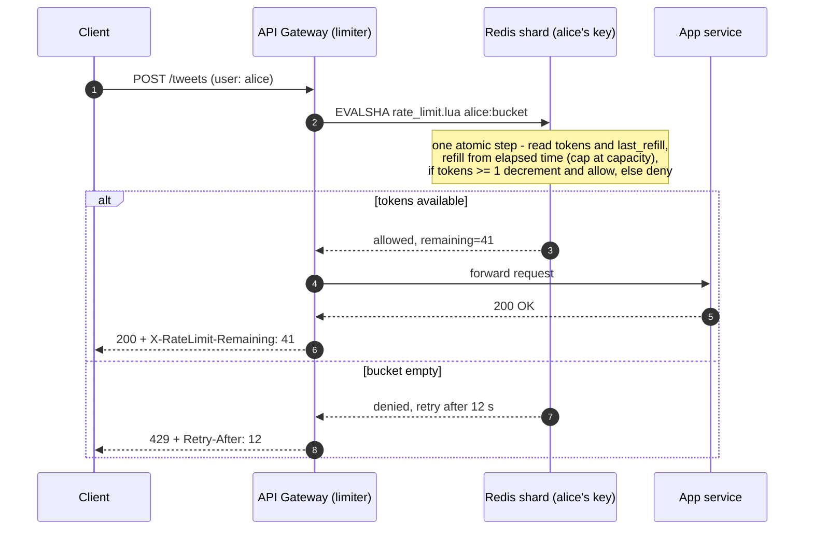

# Design a Rate Limiter

> **Prerequisites:** [Design Ticketmaster](/synapse/system-design-from-first-principles/case-studies/ticketmaster), [Latency, Throughput & Percentiles](/synapse/system-design-from-first-principles/foundations/latency-throughput-percentiles) | **You'll be able to:** choose a rate-limiting algorithm from the accuracy/memory/burst trade-off and defend it; explain why read-check-write against Redis loses updates under concurrency and fix it with an atomic script; pick a failure mode — open or closed — from the system's risk profile rather than instinct.

## The problem (why this exists)

"Design a rate limiter" is a different *kind* of interview than the eight designs before it, and saying so out loud is the first point you score. Every previous case study was a product. This is an **infrastructure component**: its "user" is another engineer's service, and its entire API is a single decision — *may this request proceed?* — returned with a yes, a no, and a few headers. What replaces the product surface is a harder demand: **correctness under concurrency is the product** — a rate limiter that miscounts under load isn't a rate limiter with a bug; it's not a rate limiter. Interviewers pitch this question very differently, from near-code low-level design to distributed-systems architecture; the most common path, and ours, balances the two.

**The brief:** a request-level rate limiter for a social media platform's API — individual HTTP requests, limited server-side, because clients can't be trusted to self-regulate.

**Functional requirements:**

1. Identify clients by user ID, IP address, or API key, and apply the appropriate limits.
2. Limit requests according to configurable rules (e.g., 100 requests/minute per user).
3. When a limit is exceeded, reject with HTTP 429 plus helpful headers (limit, remaining, reset time).

*Below the line:* analytics on rate-limit data, long-term counter persistence, dynamic rule updates at runtime (the last returns in production concerns).

**Non-functional requirements — quantified:**

1. **Minimal added latency**: under **5 ms** per check — the limiter fronts *every* request, so its latency taxes the whole platform.
2. **Highly available**, with eventual consistency acceptable — slight delays in enforcement across nodes are fine.
3. **Scale**: **1M requests/second** (estimates of daily active users range from 10M to 100M across sources; the rps figure is what drives the design).

Note the shape, per the [non-functional requirements](/synapse/system-design-from-first-principles/foundations/nonfunctional-requirements) discipline: **accuracy** (enforce exactly 100/minute, globally) pulls against everything else — perfect accuracy wants strongly consistent global state; the latency and availability targets want state that is near, cached, and forgiving. That tension resolves explicitly here (eventual consistency is acceptable), and the design becomes an exercise in deciding *how much* accuracy to trade away, on purpose, at each layer. You've already met this component from the outside: [the web crawler](/synapse/system-design-from-first-principles/case-studies/web-crawler)'s Redis limiter kept its fetcher fleet polite. Now we build the thing itself.

## Intuition first

The naive rate limiter is a hash map and an if-statement, living inside the API server:

```python
counters = {}  # key -> (count, window_start)

def allow(key, limit=100, window=60):
    count, start = counters.get(key, (0, now()))
    if now() - start >= window:
        count, start = 0, now()          # new window
    if count < limit:
        counters[key] = (count + 1, start)
        return True
    return False
```

Genuinely correct on one server, single-threaded — and it dies three deaths in production, each naming a real design problem.

**Death 1 — multiple nodes.** Put five API servers behind a load balancer and each holds its own `counters` map, seeing only its slice of traffic. A user limited to 100/minute makes 100 requests through *each* server, and every server waves them through — up to 500 where the rule says 100. Worse, the error depends on how the load balancer spreads traffic, so limits become unpredictable rather than merely loose. The limit is a *global* statement; enforcing it takes *global* state.

**Death 2 — restarts.** The counters live in process memory: every deploy, crash, or autoscaling event zeroes them, granting everyone a fresh allowance on demand. Abusers notice deploy windows.

**Death 3 — concurrency, even on one node.** Two threads run `allow()` for the same key at the same instant. Both read `count = 99`, both pass the check, both write `100`: two requests went through on the last slot, and the counter *lost an update* under exactly the load it exists to control. Hold that thought — it becomes the second deep dive, where the same race reappears at distributed scale wearing a Redis costume.

The corrected instincts, one per death: move the state **out of the process** into a store all nodes share; make it **survive restarts** (or accept, explicitly, that a restart briefly resets limits); and make the check-and-increment a **single atomic operation**, not a read followed by a write.

## How it works

### Core entities: rules, clients, and counter state

A rate limiter looks too simple to have entities, but three kinds of state anchor the design:

- **Rule** — a policy: which clients and endpoints it covers, the limit, the window or refill rate. "Search API: 10/minute per IP." Read-heavy, tiny, rarely changed — configuration, not data.
- **Client (the key)** — the unit of limiting: a user ID (auth token), an IP (`X-Forwarded-For`), or an API key (`X-API-Key`). Real systems layer several rules — per-user, per-IP, global, per-endpoint — enforcing the *most restrictive* one: if Alice has budget left but her IP hit its cap, she's blocked.
- **Counter/window state** — the mutable heart: per key, whatever the algorithm must remember. For a token bucket, exactly two numbers — current tokens and last-refill timestamp; for a sliding window log, every recent request timestamp. Written on *every allowed request* at 1M/second — everything hard about the design concentrates here.

### The API: one decision and its headers

Per the [API design](/synapse/system-design-from-first-principles/foundations/api-design) discipline, a component's interface is a contract with calling services — and this one is a single call:

```
check(key, rule) → { allowed: bool, limit, remaining, reset, retry_after? }
```

When the answer is no, the gateway returns **HTTP 429 Too Many Requests** — the status code that exists for exactly this — with headers that make the rejection actionable: `X-RateLimit-Limit` (the ceiling), `X-RateLimit-Remaining` (what's left), `X-RateLimit-Reset` (when it refills, as a Unix timestamp), and often `Retry-After` (seconds to wait). The headers are what let well-behaved clients back off instead of hammering you with doomed retries.

One decision hides in "reject": reject *or queue*? Fail fast — return the 429 immediately: queuing consumes memory, makes latency unpredictable, and invites clients to retry requests they believe failed; it suits only batch settings that can genuinely wait.

### High-level architecture

The other structural decision — **where the limiter lives** — is a three-way choice weighed fully in the third deep dive. The short version: build it into the **API gateway** at the edge, so blocked requests never touch application servers, backed by **Redis** as the shared counter store — fast enough for the latency budget, shared across every gateway instance.

```d2
direction: right
classes: {
  client: {style: {fill: "#f3f4f6"; stroke: "#6b7280"}}
  edge:   {style: {fill: "#dbeafe"; stroke: "#2563eb"}}
  svc:    {style: {fill: "#dcfce7"; stroke: "#16a34a"}}
  data:   {style: {fill: "#ffedd5"; stroke: "#ea580c"}}
}
clients: "Clients\nweb · mobile · API consumers" {class: client}
lb: "Load balancer" {class: edge}
gw: "API Gateway fleet\nrate-limiter middleware" {class: edge}
svc: "Application services\n(the thing being protected)" {class: svc}
redis: "Redis Cluster\ncounter state, sharded by key\n(hash slots)" {class: data}
rules: "Rule config store\nlimits per tier / endpoint" {class: data}
clients -> lb: "request"
lb -> gw
gw -> redis: "atomic check\n(Lua: read · refill · decide)"
gw -> svc: "allowed → forward"
gw -> clients: "denied → 429 +\nRetry-After" {style.stroke-dash: 3}
gw -> rules: "poll rules\n(~every 30 s)" {style.stroke-dash: 3}
```

Walk one request through it. The gateway extracts the key, looks up the applicable rules from its cached config, and makes **one atomic call to Redis** that reads the key's counter state, updates it, and returns the decision. Allowed requests are forwarded with the rate-limit headers attached; denied requests turn around at the edge as 429s — the application fleet never sees them, which is the point of edge placement: think of it as a bouncer at the club door. What "one atomic call" means, and why the obvious implementation gets it wrong, comes next.

## Deep dives

### 1. The algorithm zoo: four ways to count

The core decision — has this key exceeded its limit? — has four production-grade implementations. The right depth here: acknowledge the options, choose one with reasons, don't implement unless pushed — the algorithm menu is table stakes, not the destination.

**Fixed window counter.** Chop time into fixed buckets — 12:00:00–12:00:59, 12:01:00–12:01:59 — and keep one counter per key per bucket, reset at each boundary. State per key: a counter and a window-start time — trivially cheap. The flaw is the **boundary burst**: spend the full limit at the *end* of one window and again at the *start* of the next — 100 requests at 12:00:59, 100 more at 12:01:00 — 200 requests in two seconds against a "100 per minute" rule. No window exceeded its count; the *rule as a user understands it* was violated by 2×. There's also a starvation quirk: burn the budget in a window's first second and you wait out the remaining 59.

```mermaid
gantt
    title Fixed window, limit 100/min — the boundary burst
    dateFormat HH:mm:ss
    axisFormat %H:%M:%S
    section Windows
    Window A - counter resets at 12-01 :a, 12:00:00, 60s
    Window B - fresh counter :b, 12:01:00, 60s
    section One client
    100 requests at 12-00-59 :crit, r1, 12:00:59, 1s
    100 more at 12-01-00 :crit, r2, 12:01:00, 1s
```



**Sliding window log.** Store the timestamp of every request per key; on each check, drop timestamps older than the window and count what remains. This is *exact* — always precisely the last N seconds, no boundary artifacts. The price scales with request rate: a client at 1000 requests/minute means 1000 stored timestamps for one key, scanned and pruned on every check. Multiply by millions of keys and the exact answer becomes the expensive answer.

**Sliding window counter.** The engineer's compromise: keep two fixed-window counters — current and previous — and *estimate* the sliding count by weighting the previous window by how much of it still overlaps. Thirty percent into the current minute, count 70% of the previous minute's requests plus all of the current minute's. Two counters per key, near-sliding accuracy. The honest caveat: it *assumes requests were evenly spread* across the previous window — front- or back-loaded traffic skews the estimate either way, and the weighting math is easy to fumble. It smooths the boundary burst; it does not make the count exact.

**Token bucket.** Change the mental model from "count events in a window" to "spend from a budget that refills." Each key has a bucket holding up to *B* tokens (the burst capacity), refilled at rate *r* (the sustained rate); each request spends one token, and an empty bucket means 429. State per key: two numbers — token count and last-refill timestamp — the refill computed lazily from elapsed time. What makes it popular: **burst tolerance is a first-class dial, not a bug**. Real API traffic is bursty, and *B* = 100, *r* = 10/minute says exactly "burst to 100, sustain 10 a minute." The design decisions shift to choosing *B* and *r* — and to cold starts, since an idle client's bucket is full and every quiet client is entitled to one burst.

This design lands on the token bucket, noting companies like Stripe use the approach because it fits bursty API traffic while still bounding sustained rate. The full comparison lands in Trade-offs; the point to carry out of the zoo: **the algorithms differ in what they promise, not just what they cost**. Fixed window promises "no window exceeds N" (weak), the log "no trailing interval exceeds N" (exact), the sliding counter that *approximately*, the bucket "sustained rate ≤ r, burst ≤ B" — a different, often more useful, contract.

### 2. Distributed counting and the race

Death 1 made the counter shared; Redis is the store. Here is the natural token-bucket implementation against it — wrong in a way worth naming precisely.

The gateway reads the bucket — `HMGET alice:bucket tokens last_refill` — computes the refill from elapsed time, decides, then writes back the new state in a `MULTI`/`EXEC` transaction, plus an `EXPIRE` so idle buckets evaporate instead of leaking memory. The transaction makes the *writes* atomic. It does not help, because **the read happened outside it**: two requests for the same key land on two gateways in the same millisecond, both `HMGET` and see 1 token, both decide "allow", both write back a bucket decremented from the state *they* read. Two requests passed on one token; one gateway's update clobbered the other's.

This anomaly has a name, and using it is the precision the component interview rewards: a **lost update** — two concurrent **read-modify-write cycles** read the same value, and one modification overwrites the other as if it never happened [DDIA2 p. 299]. It is the oldest concurrency bug in the book — DDIA opens its transactions chapter with two clients concurrently incrementing a counter from 42 and producing 43 instead of 44 [p. 281] — and counter increments are its canonical victim [p. 299]. The race lives in the gap between read and write; no amount of atomic *writing* closes a gap that begins at the read. It's the sharpest example of the broader [contention](/synapse/system-design-from-first-principles/patterns/dealing-with-contention) that shared mutable state invites under concurrency.

DDIA also names the fix: **atomic write operations** that remove the read-modify-write cycle entirely — the store applies the whole modification as one indivisible step, usually the best solution where it fits [pp. 299–300]; storage engines almost universally provide single-object atomicity [p. 286]. Redis's version of a rich single-object atomic is the **Lua script**: the entire read-refill-decide-write sequence ships to Redis and executes as one atomic unit, with no other command interleaving — the canonical fix for this race. The decision moves *into* the store:

```lua
-- KEYS[1]=bucket key  ARGV: capacity, refill_rate, now
local t = redis.call('HMGET', KEYS[1], 'tokens', 'last_refill')
local tokens = tonumber(t[1]) or tonumber(ARGV[1])   -- cold start: full bucket
local last   = tonumber(t[2]) or tonumber(ARGV[3])
tokens = math.min(tonumber(ARGV[1]), tokens + (ARGV[3] - last) * ARGV[2])
local allowed = tokens >= 1
if allowed then tokens = tokens - 1 end
redis.call('HSET', KEYS[1], 'tokens', tokens, 'last_refill', ARGV[3])
redis.call('EXPIRE', KEYS[1], 3600)
return { allowed and 1 or 0, tokens }
```

Two concurrent requests now serialize inside Redis: the second run sees the first's decrement — the atomic boundary finally covers the whole cycle. The check end to end:



**Scaling the store.** One Redis instance handles ~100k–200k operations/second — call it 50k–100k checks/second before it bottlenecks. At 1M checks/second the counter state must be **sharded**, and the sharding rule is non-negotiable: *all of one key's traffic must land on one shard*, or the key's state splits and you've rebuilt Death 1 inside the data layer. Hash the key to pick the shard — the same [consistent-hashing](/synapse/system-design-from-first-principles/distributed-data/sharding-and-consistent-hashing) discipline covered in Distributed Data; in practice, Redis Cluster's 16,384 hash slots do the routing. Ten shards meets the target. It's the same partition-by-key discipline as [Ticketmaster](/synapse/system-design-from-first-principles/case-studies/ticketmaster)'s seat state and [Uber](/synapse/system-design-from-first-principles/case-studies/uber)'s geo-shards: state that must be atomically updated together must live together.

**Hot keys.** Hashing spreads *keys* evenly, not *load*: a single key with disproportionately high traffic — DDIA's **hot key**, its example a celebrity user whose ID is the partition key [p. 256] — concentrates on one shard no matter how many exist, and a skewed workload can overload that shard while its neighbors idle [pp. 255–256, 263]. Here the hot key is usually one aggressive client — a broken retry loop, a scraper, a DDoS source, or a legitimate heavy client — hammering one user ID or IP at tens of thousands of requests/second. Note the irony: the checks cost Redis capacity even though every answer is "no." The textbook relief, **key salting** — split the key into N sub-keys across shards [p. 264] — carries a limiter-specific catch: salting splits *write* load but reads must then combine all N sub-keys [p. 264], and a check is a read-modify-write needing the *global* count. The workable variant gives each sub-key a budget of limit/N — no cross-shard reads, but uneven traffic across sub-keys throttles early or late: another accuracy trade, made knowingly. The more practical toolkit: for abusers, an automatic **blocklist** — a key that trips its limit repeatedly gets banned outright, a far cheaper check — plus upstream DDoS protection (Cloudflare, AWS Shield); for legitimate heavy clients, client-side rate limiting in SDKs, request batching, and premium tiers.

### 3. Failure modes and placement

**When Redis is down, what does the limiter say?** The question reveals whether you understand that the limiter is *coupled to the platform's worst moments*. Two options, both defensible:

- **Fail open**: can't check → allow. Availability preserved; protection gone. The danger is precise: if Redis failed *because* the platform is already drowning in traffic, failing open pours the flood onto the backends — the limiter's outage becomes the platform's collapse, exactly when protection mattered most.
- **Fail closed**: can't check → reject (429 or 503). Protection preserved; the API is effectively offline while Redis is down, and users retrying failed requests amplify the pain. Sensible where uncontrolled traffic is worse than downtime — payments, security-sensitive surfaces.

There is no universally right answer — the choice falls out of the availability-versus-protection tension in your [non-functional requirements](/synapse/system-design-from-first-principles/foundations/nonfunctional-requirements). For this social platform, the design lands on **fail closed**, on a counterintuitive but load-bearing argument: limiter failures *correlate* with traffic spikes (viral events are when Redis is most stressed), so the moments you'd fail open are the moments it's most dangerous; brief rejections beat cascading collapse. Either way the failure mode is damage control — the primary answer is keeping Redis up: a replica per shard with automatic failover, built into Redis Cluster. State the choice explicitly, then say what you monitor to know you've entered the degraded mode.

**Where does the limiter live?** Three placements, ordered by distance from the edge:

- **In-process, in each service**: counters in application memory. Fastest possible check — no network hop — and exactly the design Intuition First killed: per-node state makes limits off by up to the server count, unpredictably. Acceptable only single-node or where approximate limits are fine.
- **Dedicated rate-limit service**: services call it before doing work. Maximum flexibility — callers pass rich context (tier, endpoint, business rules) — and precise global limits; the cost is an extra round trip on *every request*, a new critical service, and a new home for the fail-open/fail-closed dilemma. A sidecar — the limiter co-located with each service instance, sharing the Redis backend — trades the network hop for per-host deployment complexity (rule of thumb, not from source).
- **API gateway / edge**: our choice, and the most common production pattern — every request is checked before any application code runs, and rejected traffic never costs the backend anything. The limitation is context: the gateway sees only the HTTP request, so "premium users get 10× limits" works only if the tier is readable from it, e.g. encoded in the JWT.

**The latency budget.** The check sits on every request, so its cost is pure overhead against the < 5 ms NFR. The Redis operation is sub-millisecond; the budget goes to the *network*, so two optimizations do most of the work: **connection pooling** — persistent gateway-to-Redis connections, since a fresh TCP handshake costs 20–50 ms and would blow the budget alone — and **geographic co-location**, because a Tokyo gateway checking a Virginia Redis pays an intercontinental round trip per request (the physics is in [networking essentials](/synapse/system-design-from-first-principles/foundations/networking-essentials)). Beyond those: caching limit state locally in the gateway, synced to Redis asynchronously, cuts the check to nanoseconds — but each gateway then decides on stale, partial state, and the limit becomes approximate in exactly the way Death 1 warned about, bounded now by the sync interval instead of the node count. Local caching is risky for this reason; reach for it only when pooling and co-location aren't enough.

**The expert layer: what does "accurate" even mean across regions?** A 100/minute limit enforced independently in three regions is a global limit of up to 300/minute for a client that spreads its traffic — a *global* limit needs *global* state, and there's a cost ladder for how global you make it. Rung one: independent per-region limits — cheapest, worst-case error = limit × regions; fine when clients are region-sticky. Rung two: home each *key* to one region (hash key → region, as we hashed to a shard) — exact global counts, but far-away clients pay cross-region latency per check, straining the 5 ms budget. Rung three: local enforcement with async cross-region replication — local latency back, plus an over-admission window equal to the lag. Rung four — synchronous global coordination — exact, at a latency no interactive API accepts. This design sits at rungs one/three: limiters and Redis per region, eventual consistency between regions in exchange for latency. (The rung structure beyond that: rule of thumb, not from source.) One honest footnote even within a region: the Lua script is atomic *on the shard's primary*, and Redis [replication](/synapse/system-design-from-first-principles/distributed-data/replication) is asynchronous — a failover can promote a replica missing the last moments of counter updates, so recently spent tokens reappear and a few extra requests slip through. **Race-free is not the same as exact under replication**; the script eliminated the concurrency anomaly, not the replication one. Seconds of over-admission during a failover is a fine trade — the skill being tested is knowing you made it.

The whole component once more, in C4 Container notation — pan and zoom; click any element for its doc (rendered live from this module's `rate-limiter.c4` model):

<iframe
  src="/c4/view/sdfp_ratelimiter_container"
  width="100%"
  height="520"
  style="border: 1px solid var(--border, #2b2b2b); border-radius: 8px;"
  loading="lazy"
  title="Rate limiter — C4 Container view (final architecture)"
></iframe>

### Hands-on: run this design

This design's low-level structure — the C4 **code level** inside the limiter (click any box for its doc):

<iframe
  src="/c4/view/sdfp_ratelimiter_code"
  width="100%"
  height="480"
  style="border: 1px solid var(--border, #2b2b2b); border-radius: 8px;"
  loading="lazy"
  title="Rate limiter — C4 code level (inside the limiter)"
></iframe>

A **runnable implementation** lives at `proof-of-concepts/06-case-studies/09-rate-limiter/` in the repo root — the three classes above (`RuleResolver`, `WindowAlgorithm`, `AtomicCounter`) over Redis, each algorithm a real atomic Lua script.

```bash
cd proof-of-concepts/06-case-studies/09-rate-limiter
./run            # build + start api (8400) + Redis (8401)
./run test       # mypy --strict + smoke
./run stop
```

`./run test` proves the decision holds under concurrency: a `limit=5` key admits 5 then denies; a `vip:` tier (limit 100) admits all (rule resolution by prefix); a token bucket admits a burst of 3 then denies the 4th; and — the point — **20 requests fired concurrently at a `limit=5` key admit exactly 5**, because check-and-increment runs as one atomic Lua script rather than a read-then-write the app could race.

## Trade-offs

The algorithm decision, in one table — this is the centerpiece of the component interview:

| Option | Gives you | Costs you | Use when |
| --- | --- | --- | --- |
| Fixed window counter | Simplest state (counter + window start); cheapest checks | Boundary burst: up to 2× the limit around a window edge; end-of-window starvation | Rough protection where 2× overshoot is tolerable |
| Sliding window log | Exact enforcement over any trailing window | One timestamp per request — memory and scan cost scale with request rate | Low-volume, high-value limits (e.g., login attempts) |
| Sliding window counter | Near-sliding accuracy from two counters per key | An approximation — assumes even spread in the previous window; fiddly math | High-volume APIs wanting better-than-fixed accuracy at fixed-window cost |
| Token bucket (the pick here) | Bursts allowed *by design*, separately tunable (capacity vs refill); two numbers per key | Two parameters to choose and defend; idle clients always hold a full burst | Public/developer APIs with naturally bursty legitimate traffic |
| Fail open (on limiter failure) | API stays available when Redis is down | Protection gone — during correlated spikes, converts limiter outage into platform collapse | Backends have headroom; limiter failures uncorrelated with load |
| Fail closed (the pick here) | Backends protected in exactly the moments failure is likely | API effectively down during limiter outages; retry storms | Overload worse than downtime: viral-traffic platforms, payments, security |

## Numbers that matter

Figures below; arithmetic shown so you can rerun it live.

- **Load**: 1M checks/second, < **5 ms** added latency per check.
- **Redis throughput**: ~100k–200k ops/second per instance; budget ~50k–100k checks/second per shard → **~10 shards** for 1M/second.
- **Memory per key — token bucket**: two numbers (tokens, last-refill). With key string and Redis hash overhead, call it ~100–150 bytes per key (rule of thumb, not from source). 10M active keys × ~150 B ≈ **1.5 GB** — the platform's entire rate-limit state fits in one machine's memory; sharding is for *throughput*, not capacity (derived).
- **Memory per key — sliding window log**: one 8-byte timestamp per request. A key at 1000 requests/minute holds 1000 timestamps ≈ 8 KB (arithmetic derived) — ~**50× the bucket's footprint**, growing with traffic rather than key count. The memory argument in one line.
- **Why connection pooling is mandatory**: a fresh TCP handshake costs 20–50 ms — 4–10× the *entire* latency budget. Pooled connections make the check a sub-millisecond Redis op plus one intra-region round trip.
- **Cleanup**: `EXPIRE` of ~1 hour per bucket key, refreshed on each check, so idle state self-deletes.
- **Rule propagation**: config polled every ~30 s — the worst-case delay for an emergency limit change under polling, and the number that motivates push-based config if you need faster.

## In production

**Tuning limits is ongoing operational work, not a launch-time constant.** The rules table encodes a guess about what "abusive" means; production teaches the real answer. Standard practice: start permissive, watch the per-key traffic distribution, ratchet down toward just above legitimate high-percentile usage — and dry-run new limits in log-only mode before enforcing (rule of thumb, not from source). Layered rules are how real platforms express policy: per-user, per-IP, global, and per-endpoint limits evaluated together, most-restrictive wins — search runs tight, cheap reads run loose, premium tiers buy higher ceilings.

**Watch the right signals.** The monitoring surface: Redis health per shard, check latency, and — critically — an alert on *entering fail-open mode*, because a limiter that silently stopped limiting looks healthy until the backends fall over. Add the **429 rate**, watched from both ends (rule of thumb, not from source): a spike means an attack, a broken client retry loop, or a bad rule deploy; a rate stuck at zero means your limits are decorative. Per-key 429 leaderboards are the abuse radar — repeat offenders are what the automatic blocklist exists for.

**Rule changes without deploys.** Limits change under pressure — a launch needs a temporary raise, an attack an emergency cut. Two shapes: **polling** (gateways re-read a config store every ~30 s — simple, standard, propagation delay as the cost) and **push** (ZooKeeper or Redis pub/sub notifies gateways instantly — faster, but you now operate connection failures and partial-update states). Polling is the default; push earns its complexity only when seconds matter, e.g. active security incidents.

**The client side of the contract.** The headers are half the system: well-built SDKs read `X-RateLimit-Remaining` and `Retry-After` and back off *before* hitting the wall. Client-side rate limiting is a genuine complement — never a substitute, since clients can't be trusted for security — that smooths traffic and keeps legitimate heavy users from becoming hot keys.

## Pitfalls & interview traps

<div style="border-left:4px solid #da5233;background:rgba(218,82,51,0.08);padding:0.6rem 1rem;border-radius:0 0.5rem 0.5rem 0;margin:1.25rem 0">

⚠️ **The trap with the highest hit rate: "I'll wrap it in a Redis transaction."** `MULTI`/`EXEC` makes the *writes* atomic — but the race is a **lost update**, born in the gap between read and write [DDIA2 p. 299], and the `HMGET` happened before the transaction began. The fix is not a bigger transaction; it is moving the *entire read-modify-write cycle* inside one atomic boundary — a Lua script, or any single-object atomic that removes the cycle [DDIA2 pp. 299–300]. Say "transaction" in this interview and expect the follow-up: *"where does the read happen?"*

</div>

- **Designing it like a product.** Fifteen minutes of entity modeling for a system whose entities are a rule, a key, and two numbers signals you didn't recognize the genre. The depth lives in the algorithm choice, the race, and the failure modes — get to them; don't over-linger on algorithm mechanics either, the distributed problems are the destination.
- **Not knowing the boundary burst.** "Fixed window is fine" without naming the 2×-at-the-boundary flaw is the fastest credibility hit here. Conversely, calling the sliding window *counter* exact misses its even-distribution assumption — saying "it's an estimate" is the senior move.
- **Per-node limiting.** Limits enforced from each node's local memory re-derive Death 1: the effective limit is the rule × the node count, modulated by load-balancer luck. Propose local state only alongside what bounds the error.
- **Forgetting the keys expire.** Counter state without TTLs grows with every key ever seen — a slow memory leak in Redis. `EXPIRE` on write is one line; forgetting it is a pager at 3 a.m. (rule of thumb).
- **"Fail open, obviously" (or "fail closed, obviously").** Either answer *stated as obvious* is wrong — the whole content of the question is the availability-versus-protection trade, plus the failure/spike correlation that makes fail-open most dangerous exactly when it's most likely. State both, pick from the risk profile, name the monitoring that detects the degraded mode.
- **Claiming global exactness for free.** Multi-region deployment or async Redis replicas make enforcement approximate somewhere. The follow-up is *"what happens to in-flight counts when the shard fails over?"*; the answer is "recently spent tokens can reappear — bounded over-admission we accept," not "nothing."

## Check yourself

```quiz
{"prompt": "A fixed-window limiter enforces 100 requests/minute with windows aligned to clock minutes. A client sends 100 requests at 12:00:59 and 100 more at 12:01:00. What happens?", "options": ["The second batch is rejected — the client already used its 100 for the minute", "All 200 requests are allowed — each batch lands in a different window whose own counter never exceeds 100", "Exactly 100 of the 200 are allowed, spread across both windows", "The limiter detects the burst and blocks the client for the next window"], "answer": "All 200 requests are allowed — each batch lands in a different window whose own counter never exceeds 100"}
```

```quiz
{"prompt": "Two gateways check the same user's token bucket simultaneously: each runs HMGET (reads 1 token), computes locally, then updates Redis inside a MULTI/EXEC transaction. Both requests get allowed on a single token. What is this anomaly, and what's the fix?", "options": ["Write skew — fix it with snapshot isolation on Redis", "A lost update — the read-modify-write cycle spans the read outside the transaction; fix it by moving the whole cycle into one atomic step (a Lua script)", "A dirty read — fix it by having gateways read from replicas", "A phantom read — fix it by locking the whole keyspace during checks"], "answer": "A lost update — the read-modify-write cycle spans the read outside the transaction; fix it by moving the whole cycle into one atomic step (a Lua script)"}
```

```quiz
{"prompt": "A token bucket has capacity 100 and refills at 10 tokens/minute. A client idle for an hour suddenly sends 150 requests in one second, then continues at 30 requests/minute. What does it experience?", "options": ["All 150 succeed — the hour of idling banked 600 tokens", "The first 100 succeed (full bucket), 50 are rejected, and thereafter only ~10/minute succeed as the refill rate becomes the binding limit", "All 150 are rejected — bursts violate the 10/minute rate", "The first 10 succeed and the rest are rejected — the bucket enforces 10/minute at all times"], "answer": "The first 100 succeed (full bucket), 50 are rejected, and thereafter only ~10/minute succeed as the refill rate becomes the binding limit"}
```

```quiz
{"prompt": "During a viral traffic spike, the Redis cluster backing the rate limiter becomes unreachable. Why does this design choose fail-closed for this social platform?", "options": ["Fail-closed is always correct for infrastructure components", "Rejected requests are cheaper to serve than allowed ones", "Limiter failures correlate with traffic spikes — failing open would release the flood onto the backends at exactly the moment protection matters most", "Redis outages are usually too short for users to notice rejections"], "answer": "Limiter failures correlate with traffic spikes — failing open would release the flood onto the backends at exactly the moment protection matters most"}
```

<details>
<summary><strong>Q: The interviewer asks: "Your platform runs in three regions. Is the 100/minute limit still 100/minute?" What's the honest answer?</strong></summary>

Only if you pay for it. A global limit needs global state, and there's a cost ladder. Independent per-region limits enforce up to 300/minute for a client spreading traffic — often acceptable, since most clients are region-sticky. Homing each key to one region restores exact counts but makes far-away clients pay cross-region latency per check, straining a < 5 ms budget. Async cross-region replication regains local latency but reopens an over-admission window equal to the lag. Synchronous global coordination is exact and unusably slow. The position taken here: accept eventual consistency between regions in exchange for latency. The senior move is stating *which rung you're on and what the bounded error is*, not claiming exactness you don't have. (Ladder framing beyond that: rule of thumb, not from source.)

</details>

<details>
<summary><strong>Q: One API key starts sending 50,000 requests/second. Every check hits the same Redis shard. What breaks, and what do you actually do?</strong></summary>

The key's hash pins it to one shard — DDIA's hot-key problem: uniform key distribution does not mean uniform load, and one high-traffic key can saturate its shard while others idle [DDIA2 pp. 255–256, 263]. Denying the requests doesn't save the shard: every check costs a script execution. The textbook fix, key salting [p. 264], fights the limiter's semantics — reads must combine all N sub-keys [p. 264], and a check needs the global count; the practical variant gives each sub-key limit/N, trading accuracy for spread. The production answer is usually cheaper: an automatic blocklist — repeat offenders banned outright, an expensive bucket check turned into a cheap set lookup — plus upstream DDoS protection, and, for *legitimate* heavy clients, client-side limiting, batching, and a premium tier sized so they never become a hot key by accident.

</details>

<details>
<summary><strong>Q: Why not put the limiter in a dedicated service instead of the gateway? Give the real trade.</strong></summary>

Context versus cost. A dedicated service is called from application code, which can pass rich context — subscription tier, account status, "allow extra during Black Friday" — enabling limits the gateway can't express. The price: an extra round trip on *every* request, another critical service, and a second home for the fail-open/fail-closed dilemma. The gateway inverts this: rejected traffic dies at the edge costing the backends nothing — but the limiter sees only the HTTP request, so tier-based limits work only if the tier travels in it, e.g. inside the JWT. Most platforms use the gateway for blunt volumetric protection and reserve in-service checks for the few business-aware limits that need context — the placements compose rather than compete (composition point: rule of thumb, not from source).

</details>

## PoC — Proof of concepts

**Run it yourself.** [Rate limiter](https://github.com/ani2fun/synapse-content/tree/main/proof-of-concepts/06-case-studies/09-rate-limiter)
— token-bucket, fixed-window and sliding-window limiters side by side, so you can see the boundary
bursts a fixed window allows and the sliding window prevents. From
`proof-of-concepts/06-case-studies/09-rate-limiter/`, run `./run`.

**Study real implementations.**

- [Redis](https://github.com/redis/redis) — `INCR`/`EXPIRE` and sorted sets are how distributed rate
  limiters keep a shared counter across many app servers; the standard backing store.
- [Envoy](https://github.com/envoyproxy/envoy) — global rate limiting at the proxy: a dedicated
  rate-limit service the edge consults, so limits hold across a fleet.
- [System Design Primer](https://github.com/donnemartin/system-design-primer) — where the algorithms
  sit relative to the rest of an API gateway.

## Sources

DDIA2 ch. 8 pp. 281–302 (lost updates, read-modify-write cycles, atomic single-object operations) · DDIA2 ch. 7 pp. 255–264 (skew, hot keys, key salting)
