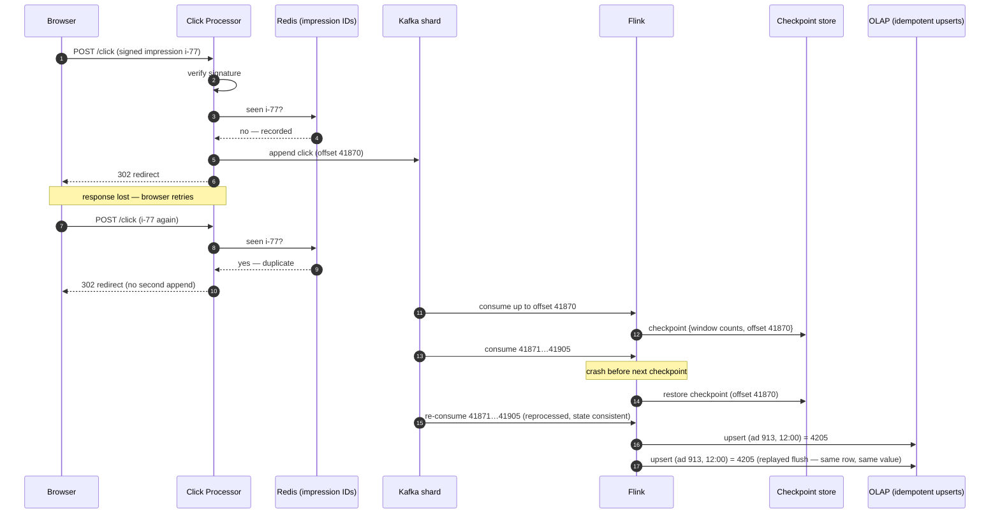

# Design an Ad-Click Aggregator

> **Prerequisites:** [Design a News Feed](/synapse/system-design-from-first-principles/case-studies/news-feed), [Analytics & Column Stores](/synapse/system-design-from-first-principles/data-foundations/analytics-and-column-stores) | **You'll be able to:** design a click pipeline that survives a viral ad without melting one shard; place a late-arriving click in the right window using event time and watermarks, and say what happens to the ones that arrive too late; explain — precisely — what "exactly-once" does and does not promise, and back a billing-grade count with a reconciliation path.

## The problem (why this exists)

Every case study so far served a *user*. This one serves a *number* — and the number is money. An ad-click aggregator sits between two parties with opposite incentives: users clicking ads on a platform, and advertisers paying per click. The system's whole job is to count. But "count things" at 10,000 events per second, across a fleet of machines that crash, retry, and redeliver, while an advertiser refreshes a dashboard expecting sub-second answers about the last minute of traffic — that is the streaming-analytics interview in its canonical form. This is a data-processing question, not a product question: the delivery framework shifts weight from user-facing entities toward the **system interface** (what comes in, what goes out) and the **data flow** between them.

What makes it more than an analytics exercise: **clicks are billed**. An overcounted click is an advertiser overcharged; an undercounted one is revenue silently dropped. DDIA gives this stake a name — this is an **integrity** requirement, not a timeliness one: a dashboard that lags a few seconds is annoying and self-heals, but a count that is *wrong* stays wrong forever unless something detects and repairs it [DDIA2 pp. 571–572]. That framing — violations of timeliness are temporary, violations of integrity are perpetual — is the spine of this whole design.

**The brief**: ads are placed on a website or app (think a Facebook-scale platform). Ad targeting and serving, fraud detection, cross-device tracking, and conversion tracking are all out of scope.

**Functional requirements**:

1. Users click an ad and are redirected to the advertiser's site.
2. Advertisers query aggregated click metrics over time, at a minimum granularity of **1 minute**.

**Non-functional requirements — quantified**:

1. **Scale**: 10M active ads; peak of **10k clicks/second**; ~**100M clicks/day**.
2. **Query latency**: sub-second responses for advertiser analytics.
3. **Fault-tolerant and accurate**: no lost click data — the counts feed billing.
4. **As real-time as possible**: metrics queryable soon after the click.
5. **Idempotent tracking**: the same click must never be counted twice.

Read requirements 3 and 5 together and notice, per the [non-functional requirements](/synapse/system-design-from-first-principles/foundations/nonfunctional-requirements) discipline, that they pull in opposite directions from requirement 4: "never lose, never double-count" wants careful, coordinated bookkeeping; "as real-time as possible" wants to fling events through the pipe. Most of the design is about refusing to pick one — a fast path that is *almost* always right, plus a slow path that makes it *provably* right.

## Intuition first

The naive design is one table and two queries. Every click is an INSERT:

```sql
INSERT INTO clicks (event_id, ad_id, user_id, ts) VALUES (...);
```

and every dashboard load is a GROUP BY (the "store and query from the same database" option):

```sql
SELECT date_trunc('minute', ts) AS minute, COUNT(*)
FROM clicks
WHERE ad_id = 913 AND ts BETWEEN :from AND :to
GROUP BY minute;
```

This is genuinely correct — every click is durably stored, every query computes from the raw truth. It dies on arithmetic, twice.

**The write side.** 10k inserts/second at peak into one transactional table. A single Postgres instance handling 10k sustained writes/second alongside index maintenance is already at the edge of what's reasonable; add read traffic and it tips over. At this scale, the shared database quickly becomes a bottleneck. You can buy time with a write-optimized store — Cassandra is the natural pick, whose LSM-tree engine ([storage engines](/synapse/system-design-from-first-principles/data-foundations/storage-engines)) absorbs write floods happily — but that makes the *read* side worse, because LSM SSTables are built for point reads, not range aggregations.

**The read side is what really kills it.** Consider one popular ad that collected 50M clicks over a week. "Show me clicks per minute for the last 7 days" must touch all 50M rows — on every dashboard refresh, for every advertiser, concurrently — to produce 10,080 numbers. The database recomputes the same aggregation from scratch each time, at query time, on the hot path. Sub-second latency is arithmetic fantasy; row stores aren't built for this scan pattern, and even a [column store](/synapse/system-design-from-first-principles/data-foundations/analytics-and-column-stores) merely makes the scan cheaper without removing it.

The corrected instinct: **do the aggregation once, ahead of the query — move work from the read path to the write path**. Store raw clicks somewhere cheap and append-only; maintain a separate, pre-aggregated table keyed by `(ad_id, minute)` that queries hit directly. The first version of this is batch: a Spark job every few minutes reads new raw events, aggregates, and writes to an OLAP store. It works — and its two flaws name the rest of the design. First, **latency**: advertisers always see data minutes stale, and while you can shrink Flink-style aggregation windows to seconds, you can't realistically launch Spark jobs every few seconds. Second, **spikes**: nothing between the click endpoint and the database absorbs a surge. Both fixes point to the same component — a durable, partitioned **log** with a **stream processor** consuming it. That is the design.

## How it works

### Core entities

Three pieces of state anchor everything:

- **Click event** — small, self-contained, immutable, timestamped: `{impression_id, ad_id, ts, ...}`. Immutability is load-bearing, not stylistic: an event records that something *happened*, so it is never updated, only appended — which is exactly what makes the raw log replayable and auditable later [DDIA2 p. 488, pp. 509–510].
- **Impression ID** — a unique ID minted by the Ad Placement Service for each *instance* of an ad shown to a user, **signed with a secret key** before it's sent to the browser. It rides along with the click and serves as the idempotency key. Note what it identifies: not the user, not the ad — the *showing*. The same user clicking the same ad shown twice (retargeting) is legitimately two clicks.
- **Aggregate window** — the derived row advertisers actually query: `(ad_id, minute_bucket) → click_count`. Everything else in the system exists to compute these rows correctly and quickly.

### The API

Two surfaces, one per party:

```
POST /click  {impression_id, ad_id, ...}   → 302 Location: <advertiser URL>
GET  /ads/{adId}/metrics?granularity=minute&from=...&to=...   → [{minute, clicks}, ...]
```

The `/click` endpoint does double duty: record, then redirect. Weigh client-side redirects (browser navigates directly to the target, click POSTed in parallel — simple, but sophisticated users and inevitable browser extensions bypass tracking entirely) against **server-side 302 redirects**, where the user reaches the advertiser *only through us* — every click tracked, at the cost of one server hop on the click path. The same status code that powered the [URL shortener](/synapse/system-design-from-first-principles/case-studies/url-shortener)'s entire product is here a data-integrity decision. Per the [API design](/synapse/system-design-from-first-principles/foundations/api-design) discipline, note also what the metrics endpoint *doesn't* offer: arbitrary ad-hoc queries. It reads pre-aggregated rows, which is precisely why it can promise sub-second answers.

### High-level architecture

```d2
direction: right
classes: {
  client: {style: {fill: "#f3f4f6"; stroke: "#6b7280"}}
  edge:   {style: {fill: "#dbeafe"; stroke: "#2563eb"}}
  svc:    {style: {fill: "#dcfce7"; stroke: "#16a34a"}}
  data:   {style: {fill: "#ffedd5"; stroke: "#ea580c"}}
  async:  {style: {fill: "#f3e8ff"; stroke: "#9333ea"}}
}
browser: "Browser\nclick with signed\nimpression ID" {class: client}
cp: "Click Processor fleet\nverify signature · dedup · 302" {class: svc}
dedup: "Redis Cluster\nimpression-ID cache" {class: data}
log: "Kafka / Kinesis\nclick log, sharded by AdId\n(retention ~7 days)" {class: async}
flink: "Flink job\ntumbling 1-min event-time\nwindows per AdId" {class: svc}
olap: "OLAP store\n(ad_id, minute) → count" {class: data}
lake: "S3 data lake\nraw click events" {class: data}
spark: "Spark reconciliation\nhourly / daily re-aggregation" {class: svc}
adv: "Advertiser\ndashboard" {class: client}
browser -> cp: "POST /click"
cp -> dedup: "seen this\nimpression ID?"
cp -> browser: "302 redirect" {style.stroke-dash: 3}
cp -> log: "append event"
log -> flink: "consume"
flink -> olap: "flush window counts"
flink -> lake: "dump raw events" {style.stroke-dash: 3}
spark -> lake: "read raw"
spark -> olap: "correct discrepancies" {style.stroke-dash: 3}
adv -> olap: "GET metrics\n(sub-second)"
```

Walk one click through it. The browser POSTs the click with its signed impression ID. The Click Processor verifies the signature (rejecting fabricated IDs), checks the impression ID against a Redis cache — a duplicate turns around right here — then appends the event to the log and 302s the user onward. From the log, a Flink job consumes each ad's events, maintains running counts in one-minute windows, and flushes each closed window into the OLAP store, where the advertiser's dashboard reads pre-aggregated rows. Quietly, in the background, raw events also land in S3, and a periodic Spark job recomputes the same aggregates from scratch — the safety net whose reason for existing is the third deep dive.

The log in the middle is doing more than buffering. It is an **append-only, sharded sequence of records** — a [queue-and-broker](/synapse/system-design-from-first-principles/building-blocks/queues-and-brokers) in which each shard totally orders its messages by offset [DDIA2 pp. 496–497] — which means it decouples ingestion rate from processing rate (a Flink hiccup doesn't drop clicks; they wait, durably), it retains events after consumption so they can be **re-read** (consumption is non-destructive, unlike a classic message queue [p. 495]), and with a retention window of, say, 7 days, it *is* the recent system of record. The whole architecture is DDIA's derived-data pattern in miniature: raw events are written once to a log; everything downstream — Flink's counts, the OLAP rows, the S3 archive — is a **derived view** that can be recomputed from it [DDIA2 pp. 541, 544].

## Deep dives

### 1. The write path at scale — sharding by AdId and the viral-ad problem

10k clicks/second exceeds what one log shard will take — Kinesis, for instance, caps a shard at 1 MB/s or 1,000 records/s — so the click log must be [sharded, and the shard key is a real decision](/synapse/system-design-from-first-principles/distributed-data/sharding-and-consistent-hashing). **Shard by AdId**: all events for a given ad land in one shard, so each Flink task consumes a disjoint set of ads and can keep each ad's running count in purely local state — no cross-shard coordination on the hot path, and within a shard the events arrive in a total order [DDIA2 pp. 496–498]. The partition key is doing exactly what DDIA says a partition key is for: routing all events that must be aggregated together to the same place [p. 498].

Uniform *key* distribution is not uniform *load* distribution. Hashing spreads the 10M AdIds evenly across shards — but the traffic isn't attached evenly to the keys [DDIA2 p. 263]. Consider this example: Nike launches a LeBron James ad and it goes viral. Every one of its clicks hashes to the *same* shard — a **hot shard**, the write-side sibling of the hot-key celebrity problem you met in the [news feed](/synapse/system-design-from-first-principles/case-studies/news-feed) [DDIA2 pp. 255–256]. That shard's throughput cap becomes the viral ad's ceiling: latency climbs and, at the extreme, events get dropped — data loss concentrated precisely on the highest-revenue ad in the system.

The fix is **key salting**: for hot ads only, append a random suffix to the partition key — `AdId:0` through `AdId:N` — so the one hot key becomes N keys hashing to N different shards [DDIA2 p. 264]. DDIA's warning travels with the technique: salting splits the *write* load but taxes the read side, because anything that wants the total must now **read and combine all N sub-keys**, and someone must do the bookkeeping of which keys are salted and by how much [p. 264] — which is why you salt the few hot keys, not everything. Here the "read side" is the aggregation layer: N Flink tasks now each hold a partial count for the ad, and the per-minute totals must be merged downstream (a second-stage aggregation, or summing sub-rows in the OLAP store at query time). How do you know which ads to salt? Choose by ad spend or observed click volume — a static-ish policy; detecting heat dynamically and re-salting live is genuinely hard operational work (rule of thumb, not from source: most teams pre-salt anything *capable* of virality rather than reacting to it).

Before the log there's a plainer scaling story: the Click Processor fleet is stateless — signature verification needs only the secret key, dedup lives in Redis — so it scales horizontally behind a load balancer. And the dedup cache is small enough not to worry about: 100M clicks/day × 16 bytes per impression ID ≈ **1.6 GB** — tiny, though you run it as a replicated Redis Cluster with persistence anyway, because losing the dedup set reopens the double-count window.

### 2. Windowed streaming aggregation — event time, watermarks, and the tumbling window

The Flink job's logic sounds trivial — keep a counter per `(ad_id, minute)`, flush when the minute ends — until you ask the question DDIA calls "surprisingly tricky" [p. 518]: *which* minute? A click has two timestamps. **Event time** is when the click happened; **processing time** is when the Flink operator gets around to handling it — and the two diverge whenever anything queues, retries, backlogs, or restarts [DDIA2 pp. 518–519]. In this design, event time is assigned by the Click Processor at receipt — a server clock, mercifully, so we dodge the untrustworthy-device-clock swamp (DDIA's fix for that, logging three timestamps to estimate device clock offset [p. 521], matters for mobile SDKs that buffer clicks offline — name it as out of scope). But the gap between the Click Processor's stamp and Flink's processing moment is real and elastic: a Flink restart means minutes of backlog processed in a rush.

Windowing by processing time makes that rush *look like traffic*. DDIA's Figure 12-8 argument [p. 519]: restart a lagging consumer, and the backlog burst appears as a fake spike of clicks in the current window — while the minutes during the outage look eerily quiet. For a dashboard, that's misleading; for *billing*, it's charging Nike for a click distribution that never happened. So: **window by event time**, always — the click counts toward the minute it occurred, no matter when it's processed. Event-time windowing has a second, structural virtue: it's the only choice that stays meaningful when you *reprocess* historical events, because on replay the processing time is "now" but the event times are still true [DDIA2 p. 546] — and deep dive 3 depends on replay.

The window itself is a **tumbling window**: fixed one-minute length, every event in exactly one window — bucket by rounding the event timestamp down [DDIA2 pp. 521–522]. That matches the product contract (1-minute granularity), and non-overlap means each click increments exactly one counter — no hopping-window smoothing, no sliding-window buffers; coarser granularities (hour, day) roll up from minutes in the OLAP store rather than widening the streaming window. State stays small: a counter per ad per open window, not a buffer of events [p. 522]. And because Flink can flush *provisional* results every few seconds while the window is still open, the current minute shows up on dashboards incomplete-but-live — the streaming design's real advantage over batch, since shrinking a Spark cadence to seconds is impractical while shrinking a flush interval is a config knob.

Event time forces one honest complication. Clicks can arrive **out of order** — an event stamped 12:00:59 can show up after one stamped 12:01:02 — so the window `[12:00, 12:01)` can never be *certain* it has seen everything [DDIA2 p. 520]. When do you close it? The mechanism is a **watermark**: a signal flowing through the stream asserting "no more events earlier than *t* are coming" — DDIA describes exactly this special message, along with its catch: with multiple producers, each has its own notion of *t*, so the consumer must track the minimum across them [p. 520]. (Watermark is Flink's term for this signal; it advances behind the observed event times by a configured bound. [web: Apache Flink docs — "Timely Stream Processing"]) When the watermark passes 12:01, the window closes and flushes.

And for the click that still arrives after that — the **straggler** — you have exactly two options, and naming both is the senior move [DDIA2 p. 520]: **ignore it**, tracking a dropped-late-events metric so you know how much money you're quietly not counting; or **emit a correction**, an updated value for the already-flushed window, which your OLAP write path must then handle as an upsert rather than an insert. For billing, corrections beat silent drops — and note the quiet dependency: choosing corrections means the sink must tolerate the same row being written twice, which is idempotence, which is deep dive 3's subject.

Watch one click travel the pipeline:

```d2
direction: right
classes: {
  svc:    {style: {fill: "#dcfce7"; stroke: "#16a34a"}}
  data:   {style: {fill: "#ffedd5"; stroke: "#ea580c"}}
  async:  {style: {fill: "#f3e8ff"; stroke: "#9333ea"}}
}
step: "STEP 1 — 12:00:58 · a click lands in the log and the open window" {shape: text}
shard: "Kafka shard for AdId 913\n… | 41868 | 41869 | 41870 ← click(ad 913, et 12:00:58)" {class: async}
flink: "Flink · open window [12:00, 12:01)\ncount(ad 913): 4,181 → 4,182\nwatermark: 12:00:55" {class: svc}
olap: "OLAP row (ad 913, 12:00)\nprovisional flush: 4,182 (incomplete)" {
  class: data
  style.stroke-dash: 3
}
shard -> flink: "consume, offset 41870"
flink -> olap: "early flush every few seconds" {style.stroke-dash: 3}
```

```d2
direction: right
classes: {
  svc:    {style: {fill: "#dcfce7"; stroke: "#16a34a"}}
  data:   {style: {fill: "#ffedd5"; stroke: "#ea580c"}}
  async:  {style: {fill: "#f3e8ff"; stroke: "#9333ea"}}
}
step: "STEP 2 — watermark passes 12:01 · the window closes and flushes" {shape: text}
shard: "Kafka shard for AdId 913\n… | 41902 | 41903 ← watermark advances past 12:01" {class: async}
flink: "Flink · window [12:00, 12:01) CLOSED\nfinal count(ad 913): 4,205\nnew open window [12:01, 12:02)" {class: svc}
olap: "OLAP row (ad 913, 12:00)\nfinal: 4,205" {class: data}
shard -> flink: "consume"
flink -> olap: "flush final count"
```

```d2
direction: right
classes: {
  svc:    {style: {fill: "#dcfce7"; stroke: "#16a34a"}}
  data:   {style: {fill: "#ffedd5"; stroke: "#ea580c"}}
  async:  {style: {fill: "#f3e8ff"; stroke: "#9333ea"}}
}
step: "STEP 3 — 12:01:07 · a straggler stamped 12:00:59 arrives after the close" {shape: text}
late: "Late click\nevent time 12:00:59\nprocessing time 12:01:07" {class: async}
flink: "Flink · window [12:00, 12:01) already closed\ntwo options, pick one deliberately" {class: svc}
dropped: "Option A — ignore\nincrement dropped-late-events metric\n(count stays 4,205)" {
  class: data
  style.stroke-dash: 3
}
corrected: "Option B — emit correction\nupsert OLAP row (ad 913, 12:00) → 4,206\n(sink must be idempotent)" {class: data}
late -> flink: "arrives after watermark"
flink -> dropped: "A" {style.stroke-dash: 3}
flink -> corrected: "B"
```

### 3. Exactly-once counting, honestly

Requirement 5 says a click is never counted twice — the general shape of this problem is [idempotency and exactly-once delivery](/synapse/system-design-from-first-principles/patterns/idempotency-and-exactly-once). Here is why it *wants* to be counted twice: every reliability mechanism in the pipeline works by **retrying**, and a retry is a duplicate wearing a safety vest. The browser retries a POST whose response was lost — the click was recorded, but the user's network dropped the 302. The log consumer restarts and resumes from its last *recorded* offset, reprocessing every event it had handled but not yet checkpointed — DDIA is explicit that this is baked into how consumer offsets work: messages processed but not committed are processed **a second time** on failover [p. 498]. Drop-or-retry is the fundamental fork, and since dropping is data loss, everything downstream of "retry" is about making the duplicates harmless [DDIA2 p. 562].

The defenses layer, innermost to outermost:

**Dedup at the door — the impression ID.** The key insight is *where* dedup must live: **before the stream**, not inside Flink. A windowed operator can only dedup within its window — the same impression clicked at 12:00:59 and again at 12:01:01 lands in two different windows, sails past any per-window check, and counts twice. So the Click Processor checks the impression ID against Redis on ingress: seen → drop; new → record and append. And the ID must be **signed**, because an unsigned unique ID invites the opposite fraud — a malicious script minting fresh fake impression IDs that are all "unique" and all counted; verifying the signature before the cache check closes that hole. Step back and this is DDIA's **end-to-end argument** wearing ad-tech clothes: TCP dedups packets, Kafka can dedup producer retries, Flink can give exactly-once *inside* the framework — and none of them can see that a *user's browser* retried, because that duplication happened above all of them. Only an identifier minted at the true source and carried end-to-end can suppress duplicates end-to-end [DDIA2 pp. 563–565]. The impression ID is this system's request ID.

**Checkpointing — crash recovery without recounting.** Flink periodically snapshots operator state — every open window's counters, plus the input offsets they correspond to — to durable storage, coordinated by barriers flowing through the stream [DDIA2 p. 527]. On a crash, it restores the last checkpoint and rewinds consumption to the checkpointed offsets: state and position move *together*, so no click is skipped and none is double-applied to state. Worth stating the contrarian note plainly, because it scores seniority points: with one-minute windows, checkpointing is arguably *optional* — a crashed job has at most a minute of state in flight, and since the log retains events, it can simply re-read and re-aggregate the lost minute. Checkpointing earns its keep when windows are long or state is large. Know the mechanism; question whether you need it.

**The honest asterisk — what "exactly-once" really promises.** DDIA lands the precise phrase: exactly-once means the *visible effect* is as if each record were processed once — "effectively-once would be a more descriptive term" [p. 527] — and it holds **within the framework's boundary**. The moment output crosses that boundary — a write to the OLAP store, a message to another system — a restarted task performs the side effect *again* [p. 527]. Checkpointing restores Flink's counters perfectly; it does not un-write the rows Flink flushed between the checkpoint and the crash. Two escapes exist [DDIA2 pp. 527–528]: **atomic commit** kept inside the framework — Kafka's transactions commit output messages and consumer offsets together, all or nothing — or **idempotent writes**, which fit this design naturally: the OLAP sink *upserts* by key — `(ad_id, minute_bucket) → count` — so writing the same final window twice converges to the same row instead of doubling it. (Idempotence carries its own fine print: replays must be deterministic and in-order, and a failover may need fencing so a presumed-dead task can't keep writing [p. 528].) The expert one-liner: *exactly-once state inside, idempotent effects outside* — anyone who claims a distributed pipeline gives exactly-once side effects unconditionally hasn't operated one.



**The safety net — batch reconciliation.** After all that, this design still adds a second path, and DDIA explains why it's principled rather than paranoid. Transient Flink bugs, a bad code push, an out-of-order edge case — *software* errors slip through machinery designed for *infrastructure* failures. So: dump raw click events from the stream into S3; run a periodic Spark job — hourly or nightly — that recomputes the aggregates from raw events, from scratch; compare against what streaming wrote; investigate and correct discrepancies. This works because batch output is pure **derived data**: regenerated from immutable input on every run, so a corrected job corrects the numbers — DDIA calls the ability to recover from buggy code by rerunning "human fault tolerance" [DDIA2 pp. 451–452], and names reprocessing-from-the-log as exactly how derived views are rebuilt when logic changes [pp. 545–546]. Running fast-stream and correct-batch over the same log is the two-path shape DDIA discusses as the lambda architecture — with the modern refinement that one engine can run both roles (kappa) if it replays history through the same event-time logic [p. 546]. The dashboards run on the stream; the invoices trust the reconciliation. And notice the quiet prerequisite: reconciliation is only as good as the raw log's integrity — which is why the append-only, immutable event log is the one component nothing is allowed to shortcut. Count-affecting disputes end at the log, or they don't end.

The whole final architecture once more, in C4 Container notation — pan and zoom; click any element for its doc (rendered live from this module's `ad-click-aggregator.c4` model):

<iframe
  src="/c4/view/sdfp_adclick_container"
  width="100%"
  height="520"
  style="border: 1px solid var(--border, #2b2b2b); border-radius: 8px;"
  loading="lazy"
  title="Ad-click aggregator — C4 Container view (final architecture)"
></iframe>

### Hands-on: run this design

This design's low-level structure — the C4 **code level** inside the stream aggregator (click any box for its doc):

<iframe
  src="/c4/view/sdfp_adclick_code"
  width="100%"
  height="480"
  style="border: 1px solid var(--border, #2b2b2b); border-radius: 8px;"
  loading="lazy"
  title="Ad-click aggregator — C4 code level (inside the stream aggregator)"
></iframe>

A **runnable implementation** of the stream aggregator lives at `proof-of-concepts/06-case-studies/10-ad-click-aggregator/` in the repo root — the three classes above (`ImpressionDeduper`, `WindowAggregator`, `IdempotentSink`), over Postgres.

```bash
cd proof-of-concepts/06-case-studies/10-ad-click-aggregator
./run            # build + start api (8410) + Postgres (8411)
./run test       # mypy --strict + smoke
./run stop
```

`./run test` feeds clicks with explicit event times and shows the stream semantics: clicks bucket into **event-time windows** that emit only once the **watermark** passes their end (a window still open is held back); a replayed impression id is **deduped** away; and a click landing in an already-emitted window is a **correction** — the window's count is recomputed and upserted (2 → 3), never lost. Upsert-by-(ad, window) is what makes replay and late data safe to bill on.

## Trade-offs

| Option | Gives you | Costs you | Use when |
| --- | --- | --- | --- |
| Stream-only (Flink → OLAP, no batch path) | One codebase, one pipeline, lowest latency | No independent check on correctness; a stream bug silently corrupts billing data until someone notices [DDIA2 pp. 571–572] | Metrics are advisory, not billed — dashboards, trends |
| Stream + batch reconciliation (this design's choice) | Real-time reads *and* provable counts; bad code fixed by re-running [DDIA2 pp. 451–452, 545–546] | Two systems to operate; discrepancy-investigation toil; S3 lake + Spark cost | Counts move money — this design |
| Small window (1 min) | Fresh data; tiny in-flight state; cheap recovery by replay | More flush traffic; corrections span more window rows | The product promises minute granularity — here |
| Large window (hour/day) | Fewer flushes; less OLAP churn | Big in-memory state; checkpointing becomes genuinely necessary; an hour of work at risk per crash | Coarse-only reporting; better rolled up in OLAP instead |
| Dedup before the stream (Click Processor + Redis) | Catches duplicates across window boundaries; keeps fakes out of the log | A cache on the ingest hot path; cache loss reopens the window | Idempotency is a hard requirement — here |
| Dedup inside the stream processor | No extra infra | Blind to duplicates straddling window boundaries | Only if windows are huge relative to retry gaps |
| Dedup at the sink only (idempotent upserts) | Simplest possible pipeline | Only dedups identical *aggregate writes*, not duplicate *events* — a double-counted click is already inside the number | Never alone; always as the outer layer |

## Numbers that matter

The scale figures, and what each one decides (arithmetic per the [estimation](/synapse/system-design-from-first-principles/foundations/estimation-and-numbers) discipline):

- **100M clicks/day ≈ 1,200/s average; peak 10k/s** — a peak-to-average ratio of ~8×. The peak drives sharding (Kinesis: 1,000 records/s per shard → ≥10 shards before any headroom); the *gap* justifies the log — a buffer that absorbs an 8× swing so consumers can be sized nearer the average.
- **~100 bytes/click event** → 10k/s peak is ~1 MB/s of ingest — trivially small in bandwidth terms. The problem was never bytes; it's write coordination and read aggregation.
- **The batch math**: a 5-minute Spark cadence at 10k/s processes 3M events ≈ **300 MB per run** — well within Spark's capacity. The batch path fails on latency, not on load.
- **Dedup cache: 100M/day × 16-byte impression IDs ≈ 1.6 GB** — small enough that "can Redis hold it?" is not the question; "what happens when it's lost?" is.
- **Raw log retention**: 100M/day × 100 B = **10 GB/day**, 70 GB for a 7-day stream retention — a rounding error against the reconciliation value it buys (rule of thumb, not from source).
- **Aggregate rows**: at most one per ad-minute with ≥1 click, so ≤100M/day (usually far fewer) — the OLAP store grows by roughly the raw click volume ÷ clicks-per-ad-minute, and pre-aggregated day/week roll-up tables shrink long-range queries by another ~1,440×.

## In production

Operating this pipeline is mostly the discipline of watching *lag*. A stream processor has three responses to falling behind — drop, buffer, or backpressure [DDIA2 p. 489] — and this design chose buffering by putting a durable log in the middle: a click-spike or a slow Flink job widens the gap between the log's head and the consumer's offset instead of dropping data. That gap — **consumer lag** — is the pipeline's vital sign, and its event-time twin is **watermark delay**: how far the watermark trails wall-clock time, i.e., how stale "final" windows are. Alert on both; a growing lag with a flat input rate means the consumer is sick, while lag growing *with* input is the hot-shard signature from deep dive 1 — per-shard lag tells you which (operational practice: rule of thumb, not from source).

The log's retention window is also the outage budget: a consumer that falls behind by more than retention starts *missing* events permanently [DDIA2 p. 498] — so "7 days of retention" really means "we can survive a long weekend of pipeline failure and still recompute." And replay is the production superpower the log quietly grants: because reading is non-destructive and the offset is consumer-controlled, you can rewind to yesterday and reprocess with fixed code, repeatedly, without disturbing other consumers [DDIA2 pp. 499–500] — this, plus the S3 lake feeding Spark re-aggregation, is how a bad deploy becomes a re-run instead of an apology. For the serving layer, note DDIA's warning about batch jobs writing straight into a live database — per-record writes throttle the job and can degrade the serving store's query performance [pp. 479–480]; real-time OLAP systems like Druid and Pinot are built to ingest from Kafka streams instead [p. 480], which is why the reconciliation path's corrections also flow through controlled ingestion rather than raw UPDATE storms.

Then there is the reason the audit machinery gets funded: **billing disputes**. An advertiser challenges an invoice; "the dashboard says so" is not an answer. The immutable raw log is what turns the dispute into a procedure — replay the events, recompute the aggregate, compare — and DDIA's "trust, but verify" argument says to run that procedure *continuously*, not just when challenged: hardware and software both corrupt data eventually, so integrity must be checked end-to-end, and event-sourced systems are auditable precisely because state can be re-derived deterministically from the log [DDIA2 pp. 576–578]. The hourly reconciliation job is that principle on a schedule — a continuous audit that happens to also fix the numbers. (Ad platforms' actual dispute and audit workflows are not documented in our sources; the mechanism here is the DDIA-grounded shape, not a claim about how any named company runs billing.)

## Pitfalls & interview traps

<div style="border-left:4px solid #da5233;background:rgba(218,82,51,0.08);padding:0.6rem 1rem;border-radius:0 0.5rem 0.5rem 0;margin:1.25rem 0">

⚠️ **The datasheet trap.** "We enabled exactly-once mode, so counts are correct" is the answer interviewers set up on purpose. Exactly-once is *effectively-once state within the framework* [DDIA2 p. 527] — it says nothing about a browser retrying a POST above the pipeline, and nothing about side effects leaving it below. Correctness here is three separate layers — end-to-end impression-ID dedup at ingress, checkpointed state inside, idempotent upserts at the sink — and dropping any one of them reopens a double-counting hole the other two cannot see.

</div>

- **Dedup by `(user_id, ad_id)`.** Feels obvious; breaks retargeting — the same ad legitimately shown to the same user twice yields two billable clicks. The unit of idempotency is the *impression*, not the user-ad pair. Interviewers ask this as a follow-up precisely because the fix (impression IDs) then invites the fraud question — and unsigned impression IDs walk into it.
- **Dedup inside the windowed operator.** The duplicate that straddles a window boundary — 12:00:59 and 12:01:01 — defeats any per-window check. Dedup must live upstream of windowing.
- **Windowing by processing time.** Restart a lagged consumer and watch it bill a phantom click spike into the recovery minute [DDIA2 p. 519]. Event time, always — and when the interviewer hears "event time," the follow-up is "so when do you close the window?", which is your cue for watermarks and the ignore-vs-correct straggler decision [p. 520].
- **Proposing checkpointing as reflex.** Interviewers push back deliberately here: with one-minute windows and a retained log, replay-and-reaggregate loses you at most a minute of work. Reciting a feature is mid-level; sizing whether it's needed is senior.
- **Sharding by AdId and stopping.** The design is correct until the first viral ad, which is to say: the design is incorrect. Volunteer the hot-shard failure and the salting fix — plus salting's read-side cost [DDIA2 p. 264] — before being asked.
- **Forgetting the counts are money.** Latency questions get all the airtime, but the requirement that shapes this system is integrity — a stale dashboard self-heals, a wrong invoice doesn't [DDIA2 pp. 571–572]. Saying that sentence out loud reframes the whole interview.

## Check yourself

```quiz
{"prompt": "A click is stamped 11:59:58 by the Click Processor but reaches the Flink operator at 12:00:09 (the job was briefly backlogged). Windows are 1-minute tumbling on event time, and the watermark currently reads 11:59:52. Where does the click land?", "options": ["In the [12:00, 12:01) window — it was processed at 12:00:09", "In the [11:59, 12:00) window — its event time is 11:59:58 and that window is still open, since the watermark hasn't passed 12:00", "It's dropped as a straggler — it arrived after its minute ended", "It's counted in both windows, and reconciliation removes one later"], "answer": "In the [11:59, 12:00) window — its event time is 11:59:58 and that window is still open, since the watermark hasn't passed 12:00"}
```

```quiz
{"prompt": "A celebrity-endorsed ad goes viral and its clicks overwhelm the one shard its AdId hashes to. The team salts the key into AdId:0 … AdId:7 across eight shards. What new obligation does this create downstream?", "options": ["None — salting is transparent to consumers", "The Flink layer now holds eight partial counts for that ad, so per-minute totals must be merged across the salted sub-keys before (or when) advertisers read them", "The OLAP store must be resharded to match the new key layout", "The dedup cache must be salted identically to keep impression IDs unique"], "answer": "The Flink layer now holds eight partial counts for that ad, so per-minute totals must be merged across the salted sub-keys before (or when) advertisers read them"}
```

```quiz
{"prompt": "Why does this design dedup clicks at the Click Processor (before the log) instead of inside the Flink job?", "options": ["Redis lookups are faster than Flink state lookups", "Flink cannot store enough state to hold a day of impression IDs", "A windowed operator can only see duplicates within one window — the same impression clicked at 12:00:59 and 12:01:01 falls into two windows and would be counted twice", "Deduping in Flink would break checkpointing"], "answer": "A windowed operator can only see duplicates within one window — the same impression clicked at 12:00:59 and 12:01:01 falls into two windows and would be counted twice"}
```

```quiz
{"prompt": "Flink runs with checkpointing in 'exactly-once' mode. It flushes a window count to the OLAP store, then crashes before its next checkpoint, restores, replays, and flushes again. What actually protected the count from being doubled?", "options": ["The checkpoint — exactly-once mode guarantees no duplicate writes leave the framework", "The Kafka retention window", "The sink's idempotent upsert keyed on (ad_id, minute) — the replayed flush overwrote the same row with the same value; checkpointing alone cannot un-write an external side effect", "Nothing — the count is now doubled until reconciliation fixes it"], "answer": "The sink's idempotent upsert keyed on (ad_id, minute) — the replayed flush overwrote the same row with the same value; checkpointing alone cannot un-write an external side effect"}
```

<details>
<summary><strong>Q: The interviewer says: "You mentioned Flink checkpointing. Do you actually need it here?" What's the strong answer?</strong></summary>

Probably not, and here's the reasoning rather than the reflex. Checkpointing protects *in-flight state* — with tumbling one-minute windows, that's at most a minute of partial counts per ad. The log is durable and retains events for days, so a crashed job can restart, rewind its offsets a minute, and re-aggregate what it lost (this is exactly the pushback worth making: candidates propose checkpointing because they've read about it, and the experienced answer is to notice the windows are tiny). Where checkpointing *does* earn its keep: long windows or big keyed state — daily aggregations, joins — where "just replay" means re-reading hours or days of the log [DDIA2 p. 527]. The meta-lesson is the seniority signal worth calling out explicitly: matching machinery to the actual failure cost, instead of installing every fault-tolerance feature the framework offers.

</details>

<details>
<summary><strong>Q: An advertiser disputes last Tuesday's invoice: "You charged us for 1.2M clicks; our landing-page logs show 900k visits." Walk through how this design answers.</strong></summary>

The answer runs on the raw log, not the dashboard. First, the counts are re-derivable: Tuesday's raw click events are in S3 (and possibly still within stream retention), so you re-run the batch aggregation from immutable input and compare — if streaming miscounted, reconciliation shows the discrepancy and the corrected number, which is precisely why the dual path exists (DDIA2 pp. 545–546, 576–578). Second, the *kind* of gap is diagnosable: per-impression events with signed IDs let you check dedup (were duplicates counted?), signature failures (was there click fabrication?), and the timeline (did their landing page drop traffic — a gap on *their* side of the 302?). What you can't do is arbitrate data you never captured — which is why the immutable, signed, append-only event log is the component this design never compromises: it's the difference between a dispute being a query and being a negotiation. Note the honest boundary: real ad platforms layer fraud detection on top (scoped out here), so this answer covers count integrity, not click *quality*.

</details>

## Sources

DDIA2 ch. 12 pp. 488–528 (immutable events, partitioned logs & consumer offsets, event vs processing time, stragglers & window types, checkpointing, effectively-once & idempotence) · DDIA2 ch. 11 pp. 451–481 (derived output & human fault tolerance, pre-aggregation & OLAP serving, batch writes to serving stores) · DDIA2 ch. 13 pp. 541–578 (derived data & reprocessing, kappa architecture, end-to-end argument & request IDs, timeliness vs integrity, auditing) · DDIA2 ch. 7 pp. 255–264 (skew, hot shards, key salting) · [web: Apache Flink docs — "Timely Stream Processing"] (the term "watermark" for the event-time completeness signal)
