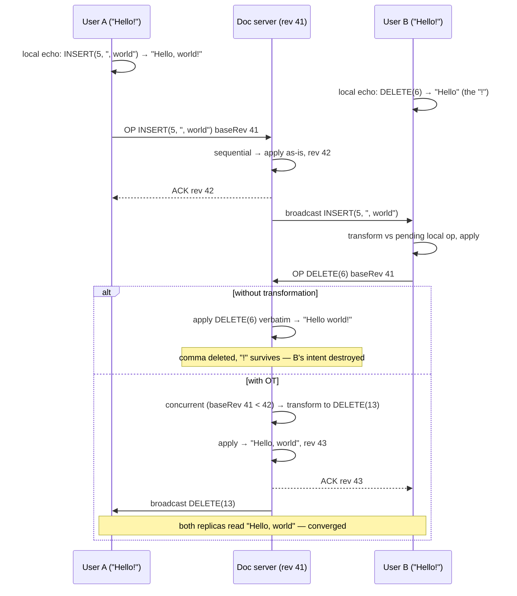

# Design Google Docs

> **Prerequisites:** [Design WhatsApp](/synapse/system-design-from-first-principles/case-studies/whatsapp), [Design Dropbox](/synapse/system-design-from-first-principles/case-studies/dropbox) | **You'll be able to:** explain why last-write-wins destroys a shared document and walk the OT transform that saves it, with the server as the ordering authority; route every editor of a document to the same stateful server with consistent hashing and defend that choice against the pub/sub reflex; treat the document as a fold over an operation log — and use snapshots/compaction so a cold load doesn't replay years of keystrokes.

## The problem (why this exists)

Every case study until now shared one merciful property: the data was easy, and the hard part was around it. Dropbox moved big immutable blobs; WhatsApp delivered small immutable messages; the ad-click aggregator counted immutable events. Here, two people hold the *same mutable value* — a string of text — and change it simultaneously, hundreds of times a minute, each expecting their own keystroke instantly and everyone else's within a blink. The hard problem is not throughput, storage, or fan-out. It is **the data type itself**: what does it even mean for concurrent edits to the same sentence to both "win"?

DDIA gives this a precise home. A real-time collaborative editor is **multi-leader replication** wearing a product UI: each open browser tab is a replica accepting writes locally — your keystroke renders before any server hears about it — and replicating asynchronously to collaborators. Even with no offline mode, the mere fact that edits apply without a server round-trip makes it multi-leader [DDIA2 pp. 220–221]. And multi-leader's defining problem is concurrent writes that **conflict** and must be resolved [p. 222]. This case study is that problem, promoted from deep-dive hazard to the entire product.

**The brief:** a browser-based collaborative document editor — think Google Docs — supporting rich concurrent editing. We assume a simple text editor; sophisticated document structure, permissions/sharing levels, and full document history are below the line, though we will see history fall out of the design nearly for free.

**Functional requirements:**

1. Users can create new documents.
2. Multiple users can edit the same document concurrently.
3. Users see each other's changes in real time.
4. Users see each other's cursor positions and presence.

**Non-functional requirements — quantified:**

1. **Convergence**: eventually consistent — all editors converge on the same document state.
2. **Latency**: updates visible in **< 100 ms**.
3. **Scale**: millions of concurrent users across **billions of documents**.
4. **Concurrency cap**: no more than **100 concurrent editors per document**.
5. **Durability**: documents survive server restarts.

Requirement 4 deserves a beat, per the [non-functional requirements](/synapse/system-design-from-first-principles/foundations/nonfunctional-requirements) discipline: it is a constraint that makes the job *easier*, and saying so is a signal. A hundred editors per document means no document ever needs more than one server's throughput — the scale problem is *many documents*, not *one enormous one*. The real product makes the same call: past a threshold, new arrivals join read-only — a product decision that quietly reveals an architectural one.

## Intuition first

Two naive designs, and how each destroys the product.

**Naive design #1 — lock the document.** The oldest answer to [concurrent mutation](/synapse/system-design-from-first-principles/patterns/dealing-with-contention): one writer at a time. User A takes a lock; everyone else waits, or reads, until A releases it. This is *correct* — no conflicts because no concurrency — and it is precisely the product we were asked not to build. "Multiple users edit concurrently" is functional requirement 2; a lock turns a shared document into an email attachment with extra steps. Per-paragraph locks fail more slowly but still fail: real collaboration converges on the same sentence, lock churn taxes every keystroke, and a crashed client freezes its paragraph until a timeout guesses. Locking removes the problem by removing the requirement.

**Naive design #2 — send the whole document, last write wins.** Fine, allow concurrent editing: every client keeps its own copy and on each edit ships the full document to a server that stores the latest version. This is **last write wins (LWW)**, and DDIA is blunt about what LWW actually means: when the same record is written concurrently in different places, one write is kept — effectively at random — and the others are **silently discarded** [DDIA2 p. 224]. Walk this example: the document reads `Hello!`; User A appends to produce `Hello, world!`, User B concurrently deletes the `!` to produce `Hello`. Whichever upload arrives second *wins entirely*; the other user's work vanishes — not merged, not flagged, gone. It's also grotesquely inefficient — hundreds of KB per keystroke — but the data loss is the disqualifier. Timestamps don't rescue it: with clock skew, LWW can discard the write that was genuinely later [DDIA2 pp. 224–225].

**The half-fix that names the real problem.** Send *edits* instead of documents: A sends `INSERT(5, ", world")`, B sends `DELETE(6)` — tiny messages, both edits at least represented. But run them: if A's insert applies first, B's `DELETE(6)`, which *meant* "delete the `!`", now lands on the comma, producing `Hello world!`. The edit was authored against a document state that no longer exists when it applies. Each operation is **contextual** — its positions are only meaningful relative to the state its author was looking at. DDIA supplies the vocabulary: A's and B's edits are **concurrent** — neither knew about the other when made [DDIA2 p. 222] — and something must resolve them so that (a) neither edit is lost and (b) every replica ends with the same text. Resolving that, mechanically and provably, is deep dive 1.

## How it works

### Core entities

- **Document** — the thing users think they're editing. Structurally it is *derived state*: at any moment, the document equals the result of applying a sequence of operations in order. Metadata (title, owner, access) lives separately from content.
- **Operation (edit)** — the unit of change: `INSERT(position, text)` or `DELETE(position)`, tagged with the author and the **revision** it was authored against. Operations are the system's real writes; the text falls out of them.
- **Revision / version** — a monotonically increasing per-document sequence number assigned by the server as it accepts each operation. Revision *N* names "the state after the first N operations" — the coordinate system that makes transformation possible.
- **Cursor / presence** — where each connected editor is, ephemeral with the connection. Presence is *not* document data — it lives in server memory and dies with the socket.

### The API: an ops protocol over WebSocket

Document CRUD is ordinary REST — `POST /docs` creates a document and its metadata row; per the [API design](/synapse/system-design-from-first-principles/foundations/api-design) discipline there's little more to say. The interesting surface is the editing session: high-frequency, bidirectional, server-push — a WebSocket, for the same reasons [WhatsApp](/synapse/system-design-from-first-principles/case-studies/whatsapp) chose one ([networking essentials](/synapse/system-design-from-first-principles/foundations/networking-essentials)). With WebSockets you specify *messages*, not endpoints:

```
client → server:
  OPEN     {docId}                          — join session
  OP       {docId, baseRev, op}             — an edit, authored against baseRev
  CURSOR   {docId, position}                — presence update

server → client:
  SNAPSHOT {docId, rev, ops|text}           — initial state on join
  ACK      {opId, rev}                      — your op is durable, assigned rev
  OP       {rev, op'}                       — someone else's op (already transformed)
  PRESENCE {editors: [{user, cursor}...]}   — who's here, where
```

The load-bearing field is `baseRev`: every operation declares *which document state it was authored against*. That is what lets the server decide whether an incoming op is sequential (authored against the latest state — apply as-is) or concurrent with ops it hasn't seen (authored against an older revision — transform first). It is the happens-before relation [DDIA2 p. 238] made into a wire field.

### High-level architecture

```d2
direction: right
classes: {
  client: {style: {fill: "#f3f4f6"; stroke: "#6b7280"}}
  edge:   {style: {fill: "#dbeafe"; stroke: "#2563eb"}}
  svc:    {style: {fill: "#dcfce7"; stroke: "#16a34a"}}
  data:   {style: {fill: "#ffedd5"; stroke: "#ea580c"}}
  async:  {style: {fill: "#f3e8ff"; stroke: "#9333ea"}}
}
editors: "Editors of doc D\n(browser tabs: local replica,\nlocal echo + client-side OT)" {class: client}
entry: "Entry\nHTTP connect → redirect to\nring owner → WS upgrade" {class: edge}
crud: "Document CRUD service\n(stateless REST)" {class: svc}
docsvc: "Document Service fleet\nconsistent hash ring: doc D → one server\nholds live doc state · transforms ops\nbroadcasts · presence in memory" {class: svc}
zk: "ZooKeeper\nring membership" {class: async}
opsdb: "Cassandra — Document Ops DB\nappend-only ops,\npartitioned by documentId" {class: data}
meta: "Postgres — Document Metadata\ntitle, owner, documentVersionId" {class: data}
editors -> entry: "connect(docId)"
entry -> docsvc: "route to owner of hash(docId)"
editors <-> docsvc: "WebSocket:\nops · acks · cursors"
docsvc -> zk: "watch ring changes"
docsvc -> opsdb: "append op, ack after\ndurable write"
docsvc -> meta: "flip versionId\non compaction" {style.stroke-dash: 3}
editors -> crud: "POST /docs"
crud -> meta: "metadata row"
```

Walk one keystroke through it. You type a character; your tab applies it **locally, immediately** — the sub-16 ms echo a 60 Hz frame budget demands, no server round-trip [DDIA2 p. 221] — then sends `OP {baseRev, op}` up the socket, which terminates on the *one* Document Service server owning this document (deep dive 2 is why exactly one). That server transforms the op against anything concurrent it already accepted (deep dive 1), assigns the next revision, appends it to the Cassandra ops log — append-only, partitioned by `documentId`, a write pattern an LSM engine loves ([storage engines](/synapse/system-design-from-first-principles/data-foundations/storage-engines)) — and only after the durable write acks you and broadcasts the transformed op to every other connected editor. Their clients apply it — transforming against their own not-yet-acked local ops first — and everyone converges. Cursors ride the same socket but skip the database: the server holds presence in memory, broadcasts changes, and clears you on hangup.

Notice what the database is *not* doing: it never stores "the text" as its primary record. It stores the operations. The document is a **fold over the op log** — the same shape as the event-sourcing pattern from the [data models](/synapse/system-design-from-first-principles/data-foundations/data-models) lesson: events as the source of truth, current state as a derived, recomputable view [DDIA2 ch. 3 pp. 102–104]. That framing pays rent in deep dive 3.

## Deep dives

### 1. Making concurrent edits converge — OT, CRDTs, and the death of last-write-wins

Pin down the goal first. A text editor cannot accept LWW's bargain — one concurrent edit randomly kept, the others silently gone [DDIA2 p. 224] — because in a document *every keystroke is a write*, and users notice every loss. What we need is **automatic conflict resolution** with a specific contract: any two replicas that have seen the same set of operations are in the same state, regardless of arrival order. DDIA names this **strong eventual consistency** [p. 226] — and for text, a good merge must preserve *all* insertions and deletions and order same-position concurrent inserts deterministically [pp. 226–227]. Two algorithm families deliver this contract, by opposite philosophies [p. 227].

**Operational Transformation: fix the operations.** OT keeps operations in their natural, human-readable form — index-based inserts and deletes — and *rewrites the indices* to account for concurrent operations that applied first [DDIA2 pp. 227–228]. Our poisoned example: the server has applied A's `INSERT(5, ", world")`; B's `DELETE(6)` arrives declaring `baseRev` = the state before A's insert, so the server knows it is concurrent. The insert added 7 characters at position 5 — everything at or after position 5 shifted right by 7 — so `DELETE(6)` is transformed to `DELETE(13)`, which lands on the `!` B actually meant. Both edits survive; the result is `Hello, world`. The transform is mechanical — a function `transform(opB, opA)` with case analysis on insert/delete pairs — but the case analysis is famously fiddly: tricky to implement correctly and easy to get wrong.

Watch the exchange, including the counterfactual:



Two structural facts about OT matter more than the index arithmetic. First, **the server is the ordering authority**: transformation is defined relative to *one canonical sequence of operations*, so every op for a document must pass through a single point that decides the order and assigns revisions. That central sequencer is what deep dive 2 must preserve at scale — and it is OT's scaling ceiling, which our 100-editor cap graciously fits under. Second, **the client transforms too**: your tab applies your keystrokes before the server confirms them, so an op arriving while yours are in flight must be transformed against your pending ones. Server and client each see a different arrival order of the same ops; OT's guarantee is that both orders converge.

**CRDTs: fix the data type.** Conflict-free Replicated Data Types take the opposite road: make the operations **commutative by construction**, so they can apply in any order with no transformation and no central sequencer [DDIA2 pp. 227–228]. For text, the trick is to stop identifying characters by index — indexes are exactly the contextual, shifting thing that broke — and give every character a **unique, immutable ID**, positioning each insert relative to its neighbors' IDs; concurrent inserts at the same spot are ordered deterministically by ID, so all replicas sort the characters identically [p. 228]. One useful way to picture the same idea: think of positions as *real numbers* — to insert between positions 4 and 5, mint 4.6; the number line always has room, and positions never change once assigned. Both descriptions are the same move — dense, stable identifiers instead of shifting offsets; DDIA's ID formulation is the mechanically honest one (an implementation must break ties and bound identifier growth), the real-number picture is the interview-friendly intuition. Deletes get the same immutability treatment: a deleted character is not removed but marked with a **tombstone**, hidden from display yet retained so a concurrent operation positioned relative to it still resolves.

The price is written right into the mechanism: per-character IDs and tombstones mean the data structure **only grows** — a heavily edited document carries its whole graveyard — and processing is heavier than OT's plain arrays. The payoff is equally structural: with no transform step and no need for a canonical order, there is **no central server requirement**. Replicas can sync peer-to-peer, buffer offline for hours, and merge whenever connectivity returns — as long as all updates eventually reach all replicas, they converge [DDIA2 p. 228].

**Who uses which — and when each wins.** OT is the classic engine of centralized real-time text editing, and it is what Google Docs uses; CRDTs power Automerge and Yjs (the engines of the local-first world), appear inside Redis Enterprise, Riak, and Azure Cosmos DB, while ShareDB carries the OT flag for JSON sync [DDIA2 p. 228]. The decision rule falls out of the structure: **if your product already has a server in the middle and bounded concurrent editors, OT is cheaper** — compact state, no tombstones, and the server you already have becomes the sequencer. **If your product needs peer-to-peer sync, unbounded collaborators, or long offline periods, CRDTs win** — commutativity does what a central sequencer cannot when there is no center. Figma is a well-known example of an industrial CRDT implementation that cuts corners for practicality.

That last clause opens the expert layer: offline editing. An OT client offline for an hour returns with a long queue of ops authored against an ancient revision — transformable in principle, but OT's correctness burden grows ugly with divergence, which is why offline-first is CRDT home turf. DDIA frames the destination: **sync engines** that capture, queue, and merge changes as a library (Firestore, Realm, Ditto; PouchDB/CouchDB, Automerge, Yjs in the open), *offline-first* apps that edit without a connection, and *local-first* software that keeps working even if the vendor's servers vanish — Git being proof the idea is sound [DDIA2 pp. 221–222]. Honest flag: this is an active frontier, not settled practice — our design, like the real product, stays centralized and treats offline as short-lived disconnection.

### 2. Scaling stateful document sessions — every editor of doc X reaches the same server

Deep dive 1 left an architectural debt: OT requires one canonical op order per document, so all 100 potential editors of document D must talk to *the same server*. A single Document Service box does this trivially and serves a few thousand users; millions of concurrent connections need a fleet, and a fleet raises the question every stateful real-time system faces: **who owns which document?**

You met this problem's general shape in [WhatsApp](/synapse/system-design-from-first-principles/case-studies/whatsapp)'s connection-routing ladder — but note precisely what transfers. WhatsApp's chosen rung was Redis pub/sub: the *subscription* is the registry, and any server publishes toward wherever the recipient's socket lives. That worked because WhatsApp only needed **delivery** — the durable Inbox guaranteed correctness, so routing could be sloppy. Here, pub/sub is *not enough*: we don't need to find the other editors' sockets, we need **all ops for a document to pass through one transform-and-sequence point**. Delivery is not the requirement; *ordering authority* is. So this design lands on WhatsApp's rung 3 — [**consistent hashing**](/synapse/system-design-from-first-principles/distributed-data/sharding-and-consistent-hashing) — and this time it's the right rung, not the runner-up.

The mechanics: every Document Service server joins a consistent-hash ring whose membership lives in [ZooKeeper](/synapse/system-design-from-first-principles/distributed-data/consensus-and-coordination); `hash(documentId)` determines each document's single owner. A client connects by HTTP to any server, naming the document; a server that doesn't own that hash range redirects to the owner; the client connects there and upgrades to a WebSocket. The owner loads the document's ops from Cassandra if not already resident, holds live state and the revision counter in memory, and from then on every op, transform, ack, broadcast, and cursor for that document happens inside one process — co-location makes the 100-editor fan-out a for-loop over local sockets, not a distributed system.

Consistent hashing's virtue — the reason it beats `hash mod N` — is that ring changes move only a small fraction of keys. But "small" is not "free" — this is the design's operational sore spot: **adding or removing a server is a state-migration event** — displaced documents' connections drop and re-establish against the new owner, in-memory state reloads from the ops log, and both rings may see traffic mid-transition. Server failure is the same event without the courtesy of scheduling: clients detect the dead socket, re-run the connect-redirect dance, and resume from the last acked revision — which is why the client protocol carries `baseRev` and buffered unacked ops, making reconnection a resync rather than a data-loss window. Robust reconnect logic and ring-change monitoring are the cost of admission for stateful routing.

Presence and cursors ride entirely on this co-location. Cursor positions are ephemeral — meaningful only while the socket lives — so the owner keeps a per-document in-memory map, broadcasts deltas over the same sockets that carry ops, seeds new joiners from memory, and broadcasts removal on hangup. No database row anywhere: the connection *is* the registry — the WhatsApp lesson's closing insight, applied to a strictly easier sub-problem because everyone is already on one server.

### 3. Persistence and history — the op log as the source of truth

What gets written to disk, and what *is* the document once everyone disconnects? The design's answer is the expert framing promised at the start: **state = fold(ops)**. The Cassandra ops DB — append-only, partitioned by `documentId`, ordered within the partition — is the system of record; the readable text is a derived view computed by replaying the log. This is event sourcing wearing an editor costume, and every property the [data models](/synapse/system-design-from-first-principles/data-foundations/data-models) lesson promised shows up on cue [DDIA2 ch. 3 pp. 102–105]: the write path is a cheap sequential append that absorbs keystroke bursts; the ack means "your op is durably in the log" — acks are sent only after the DB write; the text is recomputable at will; and — the one crucial requirement — every consumer must apply ops **in the same order**, which is precisely the canonical sequence the OT server already enforces [p. 105]. The transform authority of deep dive 1 and this dive's storage model are the same decision seen from two sides.

Event sourcing's classic gift is that history comes free: the log *is* the document's biography, and "the document as of revision 41,000" is just a shorter fold. Its classic curse arrives in the same envelope: **the log only grows**. Run the arithmetic (rule of thumb, not from source — the shape matters more than the constants): a fluent typist produces ~5 characters per second; one op per keystroke at ~50–100 encoded bytes means an hour of active writing appends ~18,000 ops ≈ **1–2 MB of log for perhaps 20 KB of final text**. A living design doc touched daily for 4 months carries hundreds of thousands of ops; a cold open must fetch and fold *every one* before rendering character one — and there's a server-side echo too: active documents live in Document Service memory, so unbounded op state is a memory problem as well.

The fix is the one every event-sourced system reaches for: **snapshots and compaction** — periodically collapse a log prefix into a single equivalent state (in the limit, one big `INSERT`), so a cold load is *latest snapshot + short op tail* instead of *the complete works*. The subtlety is doing this without corrupting a live document, and there are two viable placements. A **separate Compaction Service** scans for large, cold, uncompacted documents, folds their ops, writes the result under a new `documentVersionId`, and asks the Document Service to *flip* the version pointer in the metadata DB — flips route through the Document Service so they can't race a live session, and Cassandra's row-level-only atomicity is sidestepped by making the pointer swap the single atomic act. Or — simpler, exploiting ownership — **the Document Service compacts its own documents** when the last client disconnects: it already holds all ops in memory, nobody is editing, so it folds, writes under a new versionId, flips, and forgets; the risk is compaction CPU stealing latency from other live documents, so the fold runs in a low-priority process.

And here **version history** falls out as a byproduct. Compaction as described *discards* granular history — versioning is the exception that changes the retention story — but the mechanism needs only a policy tweak: keep superseded `documentVersionId`s and their snapshots instead of garbage-collecting them, and each becomes a named restore point; "version history" is the list of retained snapshots, "restore" a flip plus a new op on top. The op log made history *possible*; compaction makes it *cheap enough to keep*. (The retention spacing is a product decision; the real product's policy is not documented in our sources.)

The whole final architecture once more, in C4 Container notation — pan and zoom; click any element for its doc (rendered live from this module's `google-docs.c4` model):

<iframe
  src="/c4/view/sdfp_googledocs_container"
  width="100%"
  height="520"
  style="border: 1px solid var(--border, #2b2b2b); border-radius: 8px;"
  loading="lazy"
  title="Google Docs — C4 Container view (final architecture)"
></iframe>

### Hands-on: run this design

This design's low-level structure — the C4 **code level** inside the document server (click any box for its doc):

<iframe
  src="/c4/view/sdfp_googledocs_code"
  width="100%"
  height="480"
  style="border: 1px solid var(--border, #2b2b2b); border-radius: 8px;"
  loading="lazy"
  title="Google Docs — C4 code level (inside the document server)"
></iframe>

A **runnable implementation** lives at `proof-of-concepts/06-case-studies/11-google-docs/` in the repo root — a pure-Python `OtEngine`, `SessionManager`, and `Snapshotter` (mirroring the code view) behind a `DocumentServer`.

```bash
cd proof-of-concepts/06-case-studies/11-google-docs
./run            # the convergence + snapshot demonstration
./run test       # mypy --strict + OT tests + demo
```

`./run test` proves the hard part — the data type. Two editors inserting at position 0 from the same version both survive in one agreed order (`"" → "AB"`) because the second op is *transformed* against the first; two concurrent deletes of the same character don't double-delete (the second transforms to a **noop**); and folding the op log into a snapshot lets a cold load start from the checkpoint rather than replaying op #1. Operational Transformation is what makes concurrent edits converge without losing a keystroke.

## Trade-offs

The centerpiece — how concurrent edits converge:

| Option | Gives you | Costs you | Use when |
| --- | --- | --- | --- |
| **Lock the document** (or per-paragraph) | Trivial correctness — conflicts prevented, not resolved | The product: no concurrent editing; lock churn; stuck locks on crashed clients | Single-writer, check-out/check-in workflows |
| **LWW on whole snapshots** | Dead-simple server; convergence guaranteed | Concurrent edits *silently discarded* [DDIA2 p. 224]; full doc per keystroke; clock skew can drop the later write [pp. 224–225] | Never for text people care about; overwrite-style records only |
| **OT — transform ops, server sequences** (the real product's choice) | All edits preserved; compact state (no tombstones); low memory; ops stay human-readable [pp. 227–228] | Requires a central ordering server per doc — a scaling ceiling and a routing obligation (deep dive 2); transform case-analysis is notoriously easy to get wrong | Centralized product, bounded editors per doc (our 100 cap), server already in the architecture — this design |
| **CRDT — commutative ops, IDs + tombstones** | Order-independence: no central server, P2P and offline merging for free [p. 228]; strong eventual consistency by construction [p. 226] | State only grows (tombstones, per-char IDs); heavier compute; same-position merges can interleave inelegantly | P2P/WebRTC collaboration, offline-first/local-first apps, unbounded or serverless sync (Yjs, Automerge) |
| **Snapshot cadence: aggressive compaction** | Fast cold loads; small server memory; cheap storage | More background work; granular history destroyed unless versions are deliberately retained | Huge, mostly-idle corpus — billions of docs, most cold |
| **Snapshot cadence: lazy / never** | Full keystroke-level history; no flip machinery | Cold load replays everything; active-doc memory bloat | Small corpus, short docs, or compliance demands total history |
| **Presence: in-memory, ephemeral** | Zero storage; dies naturally with the socket | Lost on server handoff (users see cursors blink out and return) | Always, for cursors — the data's lifetime *is* the connection |
| **Presence: persisted** | Survives failover; "last seen" features | A write path for data nobody wants historically; DB churn at cursor-move frequency | Only for coarse "recently viewed" metadata, never live cursors |

## Numbers that matter

- **< 100 ms update latency** — the end-to-end budget for *someone else's* keystroke reaching your screen: op up one socket, transform, durable append, broadcast down another. Your *own* keystroke must be far faster — local echo inside a **16 ms** frame budget, which is why clients apply edits before the server confirms them [DDIA2 p. 221], and why client-side OT exists.
- **≤ 100 concurrent editors per document** — the constraint that licenses the whole architecture: one server per document is sufficient, the broadcast is a ≤100-iteration loop, and OT's central sequencer is never the bottleneck. Per the [estimation](/synapse/system-design-from-first-principles/foundations/estimation-and-numbers) discipline: at ~5 ops/sec per truly active typist, even a pathological 100-way live session is ~500 ops/sec through one document's sequencer — trivial for a single process (rule of thumb, not from source).
- **Billions of documents, millions of concurrent users** — the scale lives in *document count*; fleet sizing follows connections (WhatsApp's problem), not per-doc load.
- **~50 KB average document → ~50 TB** of current-state text across a billion documents — storage of the *text* is almost a non-problem. The op log is what grows.
- **Op-log growth**: ~5 keystrokes/sec × ~50–100 B/op ≈ **1–2 MB per active writing hour**, versus ~20 KB of resulting text — the log runs two orders of magnitude ahead of the document, which is the arithmetic case for compaction (rule of thumb, not from source — active-doc memory pressure motivates the same conclusion).

## In production

Most of this design's operational personality comes from one fact: the Document Service is **stateful**. A deploy can't just rolling-restart: each server is the live ordering authority for its documents, so a restart is a mini ring-change — drain (stop accepting new documents, flush op state, let clients reconnect to the new owner), then recycle. The same choreography runs, unscheduled, on every crash — this is exactly the price of consistent-hash routing: moving websocket connections *and* document state during ring transitions, tracking old and new rings, fast redistribution on failure. The deploy-drain playbook itself is a rule of thumb, not from source.

**Hot documents** are this system's celebrity problem, and the product ships the mitigation. Sharding by `documentId` concentrates a viral document — the all-hands agenda during the all-hands — onto one server by design; you *cannot* salt this key, because splitting a document across servers is precisely what OT forbids. The pressure valves are product-shaped: the 100-editor cap bounds the write side, and past the threshold new arrivals become *readers* — the real product does exactly this — converting the unbounded audience tail into a read-only fan-out that scales like the [news feed](/synapse/system-design-from-first-principles/case-studies/news-feed), not like OT. Related valves, standard practice though not from source: per-document size and op-rate limits, so a runaway script can't append a gigabyte of ops into one partition and pin a server.

**What you watch** (operational practice — rules of thumb, not from source): op ack latency p99 against the 100 ms budget and its components — transform time, Cassandra append time, broadcast fan-out; per-server active-document counts and resident op-state bytes (the memory-bottleneck concern made into a graph); ring churn and post-change reconnect storms; and compaction lag — every overdue document is a slow cold-load and a fat memory resident waiting to happen. Presence deserves its own throttle: cursor moves are the chattiest, least important message type, so they're batched/debounced client-side. For genuinely cursor-heavy collaboration, Canva's engineering write-up on realtime mouse pointers over WebRTC is worth studying — presence can even leave the server path entirely. [web: Canva Engineering blog]

## Pitfalls & interview traps

<div style="border-left:4px solid #da5233;background:rgba(218,82,51,0.08);padding:0.6rem 1rem;border-radius:0 0.5rem 0.5rem 0;margin:1.25rem 0">

⚠️ **The trap this interview is built around: treating the document as a value instead of a log.** Any design where clients send *text* and the server stores *text* — however sharded, cached, or replicated — has already lost: concurrent writers overwrite each other, and no infrastructure downstream can recover intent that was never captured. The graded path runs snapshot-LWW (silent data loss) → raw positional edits (position drift) → transformation or commutativity. If you're designing storage before you've said how two concurrent inserts at the same position converge, you're answering a different question than the one asked.

</div>

- **"Timestamps will order the edits."** LWW with wall clocks doesn't just drop concurrent edits — under clock skew it can drop the write that was genuinely later [DDIA2 pp. 224–225]. OT's ordering comes from the server's sequence numbers, a logical clock; the follow-up an interviewer wants is *why* physical time can't define "last" — because concurrency is mutual unawareness, not simultaneity [DDIA2 pp. 238–239].
- **Sticky sessions ≠ document affinity.** Load-balancer stickiness pins a *user* to a server; OT needs every user of a *document* on the same server — two different keys. The moment the interviewer draws a second editor, `hash(userId)` routing is broken; the answer is `hash(documentId)` on the ring.
- **The pub/sub reflex.** Fresh from a WhatsApp prep, candidates reach for Redis pub/sub to link servers. Delivery-only routing works when a durable layer beneath guarantees correctness (WhatsApp's Inbox); here correctness lives in the *transform*, which needs one canonical op order — a lossy fan-out between multiple servers each running their own OT is a divergence machine. Say "ordering authority, not delivery" and the trap dissolves.
- **Forgetting the client transforms too.** The server-side story converges the server; your unacked local ops still conflict with incoming broadcasts. Without client-side transformation, every fast typist sees their cursor and text jump — the surprise, easy to miss, is that OT must run on *both* ends.
- **Acking before the durable write.** Ack on receipt and a server crash silently eats confirmed keystrokes — the durability NFR is violated in the worst way, invisibly. The ack means "in the log," nothing earlier.
- **Letting the op log ride forever.** No compaction means cold loads replay years of keystrokes and hot servers hold every op in memory. The interviewer's follow-up — "what breaks when you compact a *live* document?" — is the cue for the versionId flip-through-the-owner dance.
- **Persisting cursors.** Presence is ephemeral with the connection; writing cursor moves to a database adds a write path for data whose value expires in seconds. Name it ephemeral, keep it in memory, move on.

## Check yourself

```quiz
{"prompt": "The document reads \"Hello!\". User A sends INSERT(5, \", world\") and user B concurrently sends DELETE(6) — B meant the \"!\". The server applies A's op first, then applies B's op verbatim, with NO transformation. What does the document say?", "options": ["Hello, world — both intents preserved", "Hello world! — the comma was deleted instead of the !", "Hello, world! — the delete was ignored", "Hello — B's snapshot overwrote A's"], "answer": "Hello world! — the comma was deleted instead of the !"}
```

```quiz
{"prompt": "Why must every editor of a given document connect to the SAME Document Service server in the OT design?", "options": ["WebSocket connections cannot cross load balancers", "Transformation is defined against one canonical order of operations, so a single server must sequence and transform every op for the document", "Cassandra requires all writes to a partition to come from one client", "It reduces bandwidth by deduplicating broadcasts"], "answer": "Transformation is defined against one canonical order of operations, so a single server must sequence and transform every op for the document"}
```

```quiz
{"prompt": "A CRDT text document that has been heavily edited for 4 months is much larger than its visible text, even after every collaborator disconnects. What is the structural reason?", "options": ["CRDTs store a full snapshot per editing session", "CRDTs keep tombstones for deleted characters and a unique immutable ID per character, so the structure only grows — deletions hide text rather than remove it", "CRDT ops are larger on the wire than OT ops", "The version vector grows with each new collaborator"], "answer": "CRDTs keep tombstones for deleted characters and a unique immutable ID per character, so the structure only grows — deletions hide text rather than remove it"}
```

```quiz
{"prompt": "A document has accumulated 400,000 operations over three years. A new reader opens it. In the shipped design, what makes the cold load fast?", "options": ["Cassandra range-scans are fast enough to stream all ops in under 100 ms", "The server folds ops lazily, rendering the document top-down as ops arrive", "Compaction has periodically collapsed old ops into a snapshot under a new documentVersionId, so the load is snapshot + short op tail instead of a full replay", "The document is cached in the CDN after its first load"], "answer": "Compaction has periodically collapsed old ops into a snapshot under a new documentVersionId, so the load is snapshot + short op tail instead of a full replay"}
```

<details>
<summary><strong>Q: The interviewer asks: "Why not just lock the document — or lock each paragraph — and skip all this transformation machinery?" What's the strong answer?</strong></summary>

Concede what locking buys — correctness by *preventing* concurrency — then show it forfeits the product: live concurrent editing is the functional requirement, and a document lock reduces it to taking turns. Pre-empt the fallback: per-paragraph locks fail on the same axis, just more slowly — real collaboration concentrates on the same sentence, lock acquire/release taxes typing, and a crashed client freezes its paragraph until a timeout guesses. Close with the reframe: locks and OT are two answers to concurrent mutation — avoidance versus resolution — and DDIA's conflict-handling ladder (avoidance, LWW, manual merge, automatic merge) puts collaborative text at the automatic-merge end precisely because every keystroke is a write and none may be lost [DDIA2 pp. 223–227]. Locking is the right answer to a different question — name it (check-out/check-in workflows, single-writer records) to show a considered rejection, not a reflex.

</details>

<details>
<summary><strong>Q: "Extend the design: users should be able to edit on a plane and merge when they land." What changes?</strong></summary>

Be honest that this shifts the design's center of gravity. Short disconnections already work: the client buffers unacked ops with their baseRev and resyncs on reconnect. But hours offline means a long queue of ops authored against an ancient revision — OT can transform them in principle, yet its correctness burden grows with divergence, and the server-sequenced model was chosen for the opposite regime — a centralized system with capped editors. Long-lived divergence is CRDT home turf: commutative ops with stable IDs merge after arbitrary separation without a sequencer, which is why offline-first sync engines (Automerge, Yjs; PouchDB/CouchDB; Firestore/Realm/Ditto) are CRDT-based or CRDT-adjacent [DDIA2 pp. 221–222, 228]. The honest architectures: (a) keep OT, cap offline duration, accept manual-merge fallbacks for pathological divergence; or (b) move the document type to a CRDT and demote the server to another replica plus persistence — gaining offline and P2P, paying tombstone growth and heavier merges. Flag the frontier honestly: local-first software is an active research-and-product frontier, not a solved default [DDIA2 p. 221]. The interviewer wants the trade-off named, not a pretend-easy bolt-on.

</details>

## PoC — Proof of concepts

**Run it yourself.** [Google Docs — Operational Transformation](https://github.com/ani2fun/synapse-content/tree/main/proof-of-concepts/06-case-studies/11-google-docs)
— two clients editing the same document concurrently, their operations transformed against each other
so both converge to the same text; OT made observable. From
`proof-of-concepts/06-case-studies/11-google-docs/`, run `./run`.

**Study real implementations.**

- [ShareDB](https://github.com/share/sharedb) — a production OT backend for JSON documents; the same
  approach as this POC, with the presence and subscription plumbing a real editor needs.
- [Yjs](https://github.com/yjs/yjs) — the leading *CRDT* framework, the modern alternative to OT that
  merges without a central transform server; essential for understanding the trade-off.
- [Automerge](https://github.com/automerge/automerge) — another CRDT, with a clear data model and
  strong offline story; read it against Yjs to see the design space.

## Sources

DDIA2 ch. 6 pp. 220–229 (collaborative editors as multi-leader, sync engines & local-first, conflicting writes, LWW, strong eventual consistency, OT/CRDT) and pp. 238–239 (happens-before) · DDIA2 ch. 3 pp. 101–105 (event sourcing: events as source of truth, derived recomputable views, single processing order)
