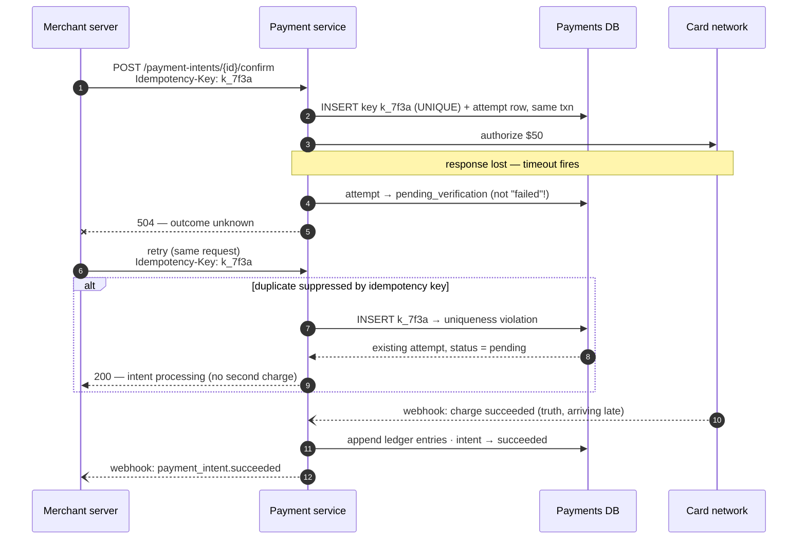
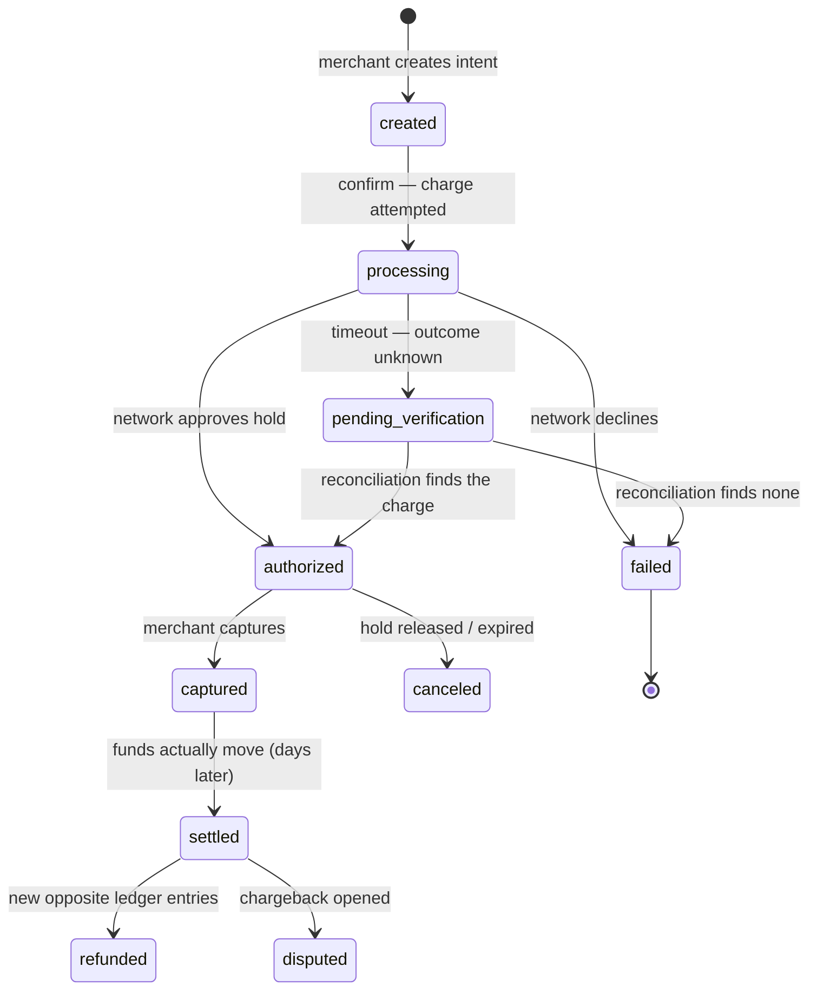

# Design a Payment System

> **Prerequisites:** [Design Ticketmaster](/synapse/system-design-from-first-principles/case-studies/ticketmaster), [Encoding & Schema Evolution](/synapse/system-design-from-first-principles/data-foundations/encoding-and-evolution) | **You'll be able to:** carry an idempotency key from the merchant's retry all the way to a database uniqueness constraint and explain why nothing short of that end-to-end path prevents a double charge; model money as an append-only double-entry ledger driven by an event-sourced payment state machine, with balances as derived views; design for a payment network that answers late — pending as a first-class state, webhooks as truth arriving asynchronously, and reconciliation as a scheduled job rather than a panic.

## The problem (why this exists)

Every case study so far has had an escape hatch. The [ad-click aggregator](/synapse/system-design-from-first-principles/case-studies/ad-click-aggregator) could miscount a few clicks and apologize in the invoice. [Ticketmaster](/synapse/system-design-from-first-principles/case-studies/ticketmaster) could oversell a seat and compensate with a refund and an upgrade. A payment system is where the escape hatches run out: the data *is* money, every record is a legal fact, and "we lost a little under load" is not an incident — it's a regulator's opening question. This is the case study where **at-least-once delivery plus idempotence** stops being a pattern you name in an interview and becomes the entire product.

**The brief:** design a payment processing system in the style of Stripe — a platform that lets businesses (*merchants*) accept card payments from customers without building payment infrastructure themselves. The customer enters card details on the merchant's checkout page; our system carries the charge to the card networks and banks, and reports the outcome back to the merchant.

**Functional requirements:**

1. Merchants can initiate payment requests — charge a customer a specific amount.
2. Customers can pay with credit/debit cards.
3. Merchants can view status updates for payments (pending, succeeded, failed).

Below the line: saved payment methods, refunds, transaction reports, alternative payment methods, subscriptions, and merchant payouts. We will still *model* refunds and disputes in the ledger — the data model must accommodate them even if the flows are out of scope — because a ledger you have to redesign the day legal asks about chargebacks was never a ledger.

**Non-functional requirements — quantified:**

1. **Never charge twice, never lose a charge.** Transaction safety and financial integrity despite the inherently asynchronous external payment networks.
2. **Durable and auditable forever**: no transaction data ever lost, even through failures; the complete history of every payment attempt reconstructible years later.
3. **Highly secure**: raw card data handled under PCI DSS constraints; merchants strongly authenticated.
4. **Scale**: ~10,000 transactions per second at peak, with bursty holiday traffic.

Notice what is *missing* from that list, per the [non-functional requirements](/synapse/system-design-from-first-principles/foundations/nonfunctional-requirements) discipline: low latency on the final outcome. A card authorization should answer in seconds, but full settlement takes days, and everyone accepts that. DDIA gives this asymmetry a name we'll lean on throughout — **timeliness** (is the state up to date?) versus **integrity** (is the state *true* — no money lost, none conjured?) [DDIA2 pp. 571–572]. Its own example is a credit card: a purchase not appearing on your statement for a day is normal; a *wrong balance* is catastrophic [p. 572]. That is this system's contract in one line: **a payment may be slow; it may never be wrong.**

## Intuition first

Here is the design every beginner writes first, because it mirrors how we think about money. One table, one row per account, one column for the balance:

```sql
UPDATE accounts SET balance = balance - 50 WHERE id = 'customer_42';
UPDATE accounts SET balance = balance + 50 WHERE id = 'merchant_7';
```

Wrap it in a database transaction and it even looks safe — atomic, isolated, durable. It loses money two different ways within the first week.

**Way #1: it charges twice.** The merchant's checkout server calls our API to charge $50. The charge succeeds — but the *response* is lost to a network hiccup, or times out. What does the merchant's code see? Nothing distinguishable from failure. So it does the only reasonable thing: it retries. DDIA is precise about why the transaction didn't save us: a transaction can be safely aborted and retried, but if the commit succeeded and only the acknowledgment was lost, the retry performs the writes *twice* unless you add application-level deduplication [DDIA2 p. 288]. TCP won't help either — its duplicate suppression works only within a single connection, and the retry is a new connection [p. 563]. DDIA's own worked example is exactly this shape: retrying a non-idempotent money transfer moves $22 instead of $11 — "the classic atomicity example is not actually correct, and real banks don't work this way" [p. 563]. Processing a message twice is not a hiccup; it is *data corruption* — the canonical example DDIA gives is double-charging a customer [pp. 562–563].

**Way #2: it loses a charge that happened.** Invert the failure. We call the card network to authorize the $50; the bank approves and debits the customer; the response packet is lost; our 30-second timeout fires. Our naive code marks the payment **failed** — because to a synchronous mind, timeout means failure. The merchant tells the customer to try again (hello, way #1) or abandons the order. Either way the customer's card was charged for goods that never ship. The bank knows money moved. We don't. The `UPDATE` model has no place to even *record* that ambiguity — the balance column holds one number and no history, so the evidence of what actually happened was never written down.

And that is the deepest flaw: `UPDATE` **destroys history**. When the row changes from one balance to the next, the fact that it was ever different — when, why, by whom — is gone. A customer disputes a charge six months later and your only forensic tool is grepping old server logs. Every fix in this lesson is, one way or another, a refusal to ever run `UPDATE` on money again.

## How it works

### Core entities: the split IS the design

This entity breakdown is not bookkeeping — it is the architecture, and interviews are won or lost on whether you articulate why the pieces are separate.

- **Merchant** — the business charging customers: identity, bank details, API keys.
- **PaymentIntent** — the merchant's *intention* to collect a specific amount. It owns the payment's lifecycle state machine — created → authorized → captured / canceled / refunded — and it is the object idempotency keys resolve to. One intent, one "please collect $50 from this customer," no matter how many attempts that takes.
- **Transaction** — a money-*movement* record: an attempt to actually move funds. Polymorphic — Charge, Refund, Dispute, Payout — each with amount, currency, status, timestamps, and a reference back to its intent. The relationship is one-to-many: a failed charge retried creates a *second* Transaction under the *same* PaymentIntent; a refund is a new Transaction with opposite direction, not an edit to the old one.
- **LedgerEntry** — the double-entry rows that actually change balances. It's tempting to fold these into Transaction for interview brevity, but in production you'd break out the double-entry rows that actually move balances — so we keep them separate here, because deep dive 2 is about them.

The layering answers a question each layer below it cannot: the PaymentIntent answers *"what does the merchant want?"*, the Transaction answers *"what did we try, and what did the network say?"*, and the LedgerEntry answers *"where is the money, provably?"* Collapse any two and a failure mode becomes unrepresentable — merge intent and transaction and you can't model a retry; merge transaction and ledger and you can't model an attempt that moved no money.

### The API

Merchants interact over REST ([API design](/synapse/system-design-from-first-principles/foundations/api-design)); the surface is small:

```
POST /payment-intents                      — create an intent {amount, currency, ...}
     Idempotency-Key: <merchant-generated key>

POST /payment-intents/{id}/confirm         — attach tokenized payment details, begin charging
     Idempotency-Key: <key>

GET  /payment-intents/{id}                 — current status: created | processing | succeeded | failed

POST /webhook-endpoints                    — register {url, subscribed events}
```

Two details carry the design. First, the **`Idempotency-Key` header** on every mutating call — a unique value the *merchant* generates per logical operation and reuses on retries; deep dive 1 is why this must originate at the far end of the wire. Second, card details are **never** in these payloads: the customer's browser sends card data directly to us via a hosted iframe, and the merchant's server only ever sees an opaque token (the PCI paragraph in "In production" covers this honestly). Status flows back two ways: polling `GET`, and signed **webhooks** we push to the merchant's registered URL as states change — the industry-standard mirror of how the card networks talk to *us*.

### High-level architecture

```d2
direction: right
classes: {
  client: {style: {fill: "#f3f4f6"; stroke: "#6b7280"}}
  edge:   {style: {fill: "#dbeafe"; stroke: "#2563eb"}}
  svc:    {style: {fill: "#dcfce7"; stroke: "#16a34a"}}
  data:   {style: {fill: "#ffedd5"; stroke: "#ea580c"}}
  async:  {style: {fill: "#f3e8ff"; stroke: "#9333ea"}}
}
merchant: "Merchant server\ngenerates idempotency keys,\nretries on timeout" {class: client}
gw: "API Gateway\nHMAC request signing ·\nrate limits" {class: edge}
psvc: "PaymentIntent service\nlifecycle state machine ·\nidempotency-key lookup" {class: svc}
txsvc: "Transaction service\nrecords attempt BEFORE\ncalling the network" {class: svc}
db: "Payments DB (Postgres)\nintents · transactions ·\nidempotency keys ·\nappend-only ledger" {class: data}
cdc: "CDC -> Kafka\nimmutable event stream,\nkeyed by payment_intent_id" {class: async}
recon: "Reconciliation service\nour ledger vs network\nsettlement reports" {class: svc}
hook: "Webhook service\nsigned events, retries\nwith exponential backoff" {class: svc}
psp: "Card networks & banks\n(external: Visa, issuers)" {
  class: client
  style.stroke-dash: 3
}
merchant -> gw: "POST /payment-intents\nIdempotency-Key: k7f3a"
gw -> psvc: "authenticated request"
psvc -> db: "state + key check"
psvc -> txsvc: "charge(intent)"
txsvc -> psp: "authorize / capture"
psp -> txsvc: "async callbacks:\nthe truth, arriving late" {style.stroke-dash: 3}
txsvc -> db: "append attempt,\nledger entries"
db -> cdc: "WAL-level capture"
cdc -> hook: "state-change events"
cdc -> recon: "attempt + timeout events"
psp -> recon: "settlement files\n(daily batch)" {style.stroke-dash: 3}
hook -> merchant: "payment_intent.succeeded" {style.stroke-dash: 3}
```

Walk one $50 charge through it. The merchant creates a PaymentIntent (state `created`); the customer enters card details into our hosted iframe, and the merchant confirms the intent. The Transaction service **writes an attempt record before touching the network** — network name, amount, our reference ID — so that whatever happens next, our intention is on disk — tracking our intentions before acting on them. Then it calls the card network. On a crisp approval, the attempt is marked succeeded, ledger entries are appended, and the intent advances. On a timeout, *nothing is guessed*: the attempt is marked `pending_verification` and the reconciliation machinery of deep dive 3 takes over. Every one of those database changes is captured off the write-ahead log by **CDC into Kafka** — an immutable, ordered event stream that feeds the webhook service, the reconciliation service, and the audit trail, without relying on application code remembering to write audit rows. The dotted lines are the honest part of the diagram: everything crossing them is asynchronous, and the truth on the other side arrives late.

## Deep dives

### 1. Idempotency end-to-end — the retry is mandatory, and the retry is lethal

Start with the uncomfortable pair of facts. In a distributed system, **retries are not optional**: a timeout gives you zero information about whether the operation happened ([Ticketmaster](/synapse/system-design-from-first-principles/case-studies/ticketmaster) met the same ambiguity at the payment step), so any client that wants at-least-once delivery *must* retry. And in a payment system, **a blind retry is the worst bug you can ship**: executing a charge twice is data corruption with a customer attached [DDIA2 pp. 562–563]. The system must therefore be built so retries are simultaneously *encouraged* and *harmless*. That property is [idempotence](/synapse/system-design-from-first-principles/patterns/idempotency-and-exactly-once): an operation whose effect is the same whether executed once or many times [p. 562].

The mechanism is an **idempotency key**. The merchant generates a unique value — a UUID, or a hash of the order — for each logical operation, sends it in the `Idempotency-Key` header, and *reuses the same key* when retrying. On our side, the key is stored in the payments database with a **uniqueness constraint on (merchant_id, idempotency_key)**, inserted in the *same database transaction* that creates the payment attempt. A retry's `INSERT` violates the constraint, and instead of creating a second charge we return the recorded outcome of the first. DDIA's Example 13-2 is the canonical form: insert the client-supplied request ID under a uniqueness constraint in the same transaction as the money writes, so a duplicate submission aborts cleanly [p. 564]. Crucially, relational databases enforce uniqueness correctly even at weak isolation levels — where a hand-rolled "check then insert" would fall to write skew and phantoms [p. 564], the same anomaly family that DDIA lists double-spending under [DDIA2 ch. 8 p. 306].

Three engineering decisions hide inside "store the key":

- **Scope.** Keys are scoped *per merchant* — two merchants may coincidentally generate the same UUID and must not collide — and in practice per endpoint, since "create intent" and "confirm intent" are different logical operations. The scope must exactly equal "one logical operation from the client's point of view."
- **What to store with it.** Not just the key — the *response*. A retry should receive the same status code and body the original would have, even if the original is still in flight (return `409 processing` or block briefly). Storing key → outcome turns the table into a response cache with a legal function.
- **Lifetime.** Keys can't live forever at 10k TPS. Rule of thumb, not from source: retention of ~24 hours covers realistic retry windows (client retry loops span seconds to minutes; queued jobs maybe hours) while keeping the table prunable. Expiry is a trade-off: after it, a very late retry becomes a new operation.

Now the honest theory, because an interviewer who knows this domain will probe it: **why isn't a database transaction enough?** Because the transaction's guarantees end at the database's edge, and the operation doesn't. This is the **end-to-end argument** (Saltzer, Reed & Clark, 1984): a function like duplicate suppression "can be completely and correctly implemented only with the knowledge and help of the application standing at the endpoints" — the communication system alone cannot provide it [DDIA2 p. 565]. Every layer below the endpoints deduplicates only within its own horizon: TCP suppresses duplicate packets, but only inside one connection [p. 563]; the database transaction is atomic, but a client that loses the connection after `COMMIT` cannot know whether it committed, and its retry is a brand-new transaction the database has no reason to link to the old one [p. 563]. Even a user double-clicking a checkout button after a slow response is a duplicate that no infrastructure layer can see — only an ID generated *at the point where the operation is logically one thing* and carried through every hop to the uniqueness check can suppress it [pp. 563–565]. Nor can we fix it with a distributed transaction spanning us and the bank: atomic commit across systems requires every participant to speak the same protocol, which external networks don't [DDIA2 ch. 8 pp. 329–330] — and DDIA's verdict is that you don't need it anyway, because recording a processed request ID under a uniqueness constraint gives exactly-once *effects* from at-least-once *delivery* [p. 334].

<div style="border-left:4px solid #15448e;background:rgba(21,68,142,0.08);padding:0.6rem 1rem;border-radius:0 0.5rem 0.5rem 0;margin:1.25rem 0">

ℹ️ **The same trick, one layer down.** We are a *client* to the card network, so we apply the identical discipline outward: every network call carries our attempt's reference ID, recorded before the call. The idempotency key protects the merchant→us hop; the attempt record protects the us→network hop. Exactly-once is not a property you install once — it's a contract renegotiated at every trust boundary, which is the end-to-end argument restated [DDIA2 p. 565].

</div>

Here is the whole story on one wire — the retry suppressed, and the truth arriving late:



### 2. The ledger and the payment state machine — money is never UPDATEd

The intuition section's real villain was the mutable balance column. The fix is centuries older than computing: a **double-entry ledger**. Every movement of money is recorded as a set of immutable entries that sum to zero — a $50 capture debits the customer-funds account $50 and credits the merchant's pending-balance account $50 (in the full model, a third pair carves out our processing fee). Entries are **only ever appended**. A refund is not an edit to the original entries; it is *new* entries in the opposite direction, linked to a new Refund transaction. A correction of an operator mistake is likewise a new reversing entry. The table has no `UPDATE` or `DELETE` path at all — enforceable at the database-permission level, using insert-only grants for audit tables.

This is **event sourcing** wearing an accountant's visor, and the DDIA framing makes each property fall out rather than get bolted on. Using events as the source of truth and expressing every state change as an immutable, append-only event is the definition of event sourcing [DDIA2 ch. 3 p. 102]; events are named in the past tense because each records that something *happened* — a later cancellation is a separate appended event and "the original fact remains true" [p. 103]. The advantages DDIA lists read like a payment system's compliance checklist: events communicate intent, derived views are reproducible and can be deleted and recomputed, an erroneous event is reversed by a subsequent compensating event that downstream views absorb automatically, and **the event log doubles as an audit log — "valuable in regulated industries"** [pp. 103–104]. Append-only logs also take higher write throughput than update-in-place tables, absorbing bursts while downstream views catch up [p. 104] — which is exactly the Black Friday shape of our traffic.

**So where does a balance live?** Nowhere authoritative. A balance is a **derived view** — a fold over the ledger: `SUM(entries WHERE account = X)`. That is [CQRS](/synapse/system-design-from-first-principles/patterns/event-driven-cqrs-outbox-cdc): write-optimized truth in one representation, read-optimized projections derived from it [DDIA2 ch. 3 pp. 101–102]. At scale you *materialize* the sum (a running-balance table maintained by a consumer of the CDC stream) because summing years of entries per read is absurd — but the materialization is a cache, always reconstructible, never the truth. If a bug corrupts it, you delete it and re-derive [p. 103]. Contrast that with the naive design, where the corrupted balance *was* the record and the bug's damage is permanent. One rule matters when deriving: every view must process events in the same order the log defines [p. 105] — which is why the Kafka stream is keyed by `payment_intent_id`, giving per-intent ordering.

The **PaymentIntent state machine** is the same idea at the lifecycle level. Each transition — created, authorized, captured, settled, refunded, disputed — is an appended event; the intent's "status" column is merely the latest projection of its event history:



Two states deserve a defense. `pending_verification` exists because a timeout is *not* a failure — it is the absence of knowledge, and the state machine must be able to say "I don't know yet" without lying in either direction. And `settled` is separate from `captured` because authorization and capture are messages, while settlement is *money* — the batch process, days later, where funds truly move between banks. A state machine that conflates them will eventually report money as arrived that a network failure still owes you.

Mechanically, this architecture makes the eventing automatic rather than disciplinary: the operational database stays a plain Postgres optimized for current-state queries, and **change data capture** tails its write-ahead log, publishing every committed change to Kafka — so the immutable history is produced at the database level, immune to an application developer forgetting to write the audit row. If it committed, it's in the stream; the stream flows to Kafka with 3× replication and archives to object storage for the years-later audit.

### 3. Living with external money-movers — pending states, webhooks, and reconciliation

Everything so far assumed we eventually learn the truth. This dive is about *how* the truth arrives, because the card networks and banks are systems we do not control, with their own queues, batch windows, and retry logic — a charge we timed out on may still be winding through authorization, and one that succeeded instantly may have lost its response on the way back. The design stance here is to treat these networks as asynchronous partners, not synchronous services.

Three consequences structure the design:

**Pending is a first-class state, not an error.** The synchronous mind wants every payment resolved when the HTTP call returns; the honest system admits a payment can be *unknown* for minutes (a lost authorization response) or *in flight* for days (awaiting settlement). Deep dive 2's state machine encodes this; the merchant-facing API simply reports `processing`. This is the timeliness/integrity split doing load-bearing work: DDIA observes that in most applications integrity matters far more than timeliness — staleness is an annoyance that resolves itself; corruption is a catastrophe that doesn't [DDIA2 pp. 571–572]. Banks embody it: transactions reconcile asynchronously and statements arrive late, but the amounts are exact [p. 572]. Merchants tolerate a `processing` badge; no one tolerates a wrong charge.

**Webhooks are the truth arriving late — in both directions.** Inbound, the networks call *us* back as charges progress through settlement, chargebacks, and reversals; those callbacks — not our optimistic bookkeeping at request time — flip `pending_verification` to a real outcome. Outbound, we owe merchants the same courtesy: a webhook service consumes the CDC stream, and for each state change delivers a **signed** payload to the merchant's registered URL, retrying with exponential backoff (5s, 25s, 125s…) until a `2xx` acknowledgment. The signature lets the merchant authenticate us; the retry policy means merchants receive webhooks *at least once* — so a well-built merchant deduplicates by event ID, which is deep dive 1's lesson recursing outward: our consumers need idempotency from us exactly as we needed it from the networks.

**Reconciliation is a job, not an emergency.** However good the flows, our ledger and the network's records *will* diverge: a lost callback, a bug in either system, a settlement that never lands. DDIA's stance is "trust, but verify" — at sufficient scale even very unlikely corruptions happen, so integrity must be *checked*, not assumed; checking data integrity is auditing, and auditability is prized in finance precisely because everyone knows mistakes happen and must be detectable and fixable [DDIA2 pp. 575–576]. Mature storage systems already live this way — HDFS and S3 continually re-read replicas and compare them rather than trusting disks [p. 576] — and the checking is best done **end-to-end**: verify the whole derived pipeline and you have implicitly verified every disk, network hop, and service along it [p. 578]. Concretely, the networks provide both real-time status-query APIs and periodic **settlement files** — comprehensive, strictly formatted records of everything they processed in a window, the definitive account of what actually happened. A reconciliation service consumes our attempt events off the CDC stream, proactively queries the network for anything stuck in `pending_verification`, and systematically diffs each settlement file against our ledger. Matches confirm integrity; mismatches open cases — and every fix is, of course, an appended correcting entry, never an edit.

Our event-sourced core is what makes this auditing *possible*: DDIA notes that event-sourced systems are inherently more auditable, because replaying the same log through the same deterministic code reproduces the same state — you can hash the log to verify storage and re-derive views to verify processing [DDIA2 p. 577]. A mutable-balance system can be told it's wrong; only a ledger system can *prove* what right is.

<div style="border-left:4px solid #195045;background:rgba(25,80,69,0.08);padding:0.6rem 1rem;border-radius:0 0.5rem 0.5rem 0;margin:1.25rem 0">

💡 **The expert framing.** DDIA's slogan is the whole deep dive: "violations of timeliness are allowed under eventual consistency, whereas violations of integrity result in perpetual inconsistency" [DDIA2 p. 572]. A payment system deliberately spends timeliness — pending states, day-late settlement, batch reconciliation — to buy absolute integrity. Interviewers reward candidates who name this trade explicitly instead of promising "strong consistency" for a system whose external half is asynchronous by nature.

</div>

The whole final architecture once more, in C4 Container notation — pan and zoom; click any element for its doc (rendered live from this module's `stripe-payments.c4` model):

<iframe
  src="/c4/view/sdfp_payments_container"
  width="100%"
  height="520"
  style="border: 1px solid var(--border, #2b2b2b); border-radius: 8px;"
  loading="lazy"
  title="Payment system — C4 Container view (final architecture)"
></iframe>

### Hands-on: run this design

This design's low-level structure — the C4 **code level** inside the payment API (click any box for its doc):

<iframe
  src="/c4/view/sdfp_payments_code"
  width="100%"
  height="480"
  style="border: 1px solid var(--border, #2b2b2b); border-radius: 8px;"
  loading="lazy"
  title="Payment system — C4 code level (inside the payment API)"
></iframe>

A **runnable implementation** lives at `proof-of-concepts/06-case-studies/12-stripe-payments/` in the repo root — the three classes above (`IdempotencyGuard`, `PaymentIntentMachine`, `LedgerWriter`) over Postgres, the whole charge one transaction via a Unit-of-Work port.

```bash
cd proof-of-concepts/06-case-studies/12-stripe-payments
./run            # build + start api (8420) + Postgres (8421)
./run test       # mypy --strict + smoke
./run stop
```

`./run test` proves the money invariants: charging with the same idempotency key twice returns the same payment and credits the merchant **once**; **10 concurrent** charges of one key still produce a single payment (the second key-insert blocks on the unique constraint until the first commits, then replays); an illegal transition (`created → capture`) is a 409; and every movement is two postings that net to zero, so **the whole ledger sums to 0**. Never charge twice, never lose money.

## Trade-offs

| Option | Gives you | Costs you | Use when |
| --- | --- | --- | --- |
| Synchronous outcome at the API (block until network answers) | Simple merchant integration; one round trip | Lies on timeout — must guess failed/succeeded; the guess loses money both ways | Never alone; acceptable only for the fast-path *authorization* response |
| Async webhook truth + pending states | Correctness under network ambiguity; timeout means "unknown," not "failed" | Merchant must handle `processing`, dedupe webhooks; more moving parts | Always, for money — the outcome is genuinely asynchronous |
| Idempotency key scoped per merchant + endpoint | Retries safe end-to-end; no cross-merchant collisions | Merchant must generate and persist keys; key storage at 10k TPS | Every mutating endpoint; the client is the only place "one operation" is defined [DDIA2 p. 565] |
| Idempotency at one internal hop only (e.g. dedupe inside the queue) | Cheap; no client changes | Duplicates from client retries and double-clicks sail through — dedup below the endpoints is incomplete [DDIA2 p. 565] | As an *additional* layer, never the only one |
| Mutable balance column | One-row reads; trivially fast | History destroyed; bugs corrupt permanently; audits become archaeology | Never for the system of record; fine as a materialized cache of the ledger |
| Full double-entry ledger, balances derived | Provable integrity; audit log for free; recomputable views [DDIA2 ch. 3 pp. 103–104] | More rows per payment; balance reads need materialization; strict append discipline | The system of record for any real money movement |
| Coarse ledger (one entry per payment) | Fewer rows, simpler queries | Fees, partial refunds, and multi-leg flows become unrepresentable; auditors ask where the fee went | Prototypes only; granularity should match every distinct account money touches |

## Numbers that matter

The scale figures below are estimates for this exact design. Peak load is **~10,000 TPS** — within reach of a well-tuned, [sharded](/synapse/system-design-from-first-principles/distributed-data/sharding-and-consistent-hashing) Postgres (shard by `merchant_id`), with read replicas absorbing the read-heavy status-check traffic. Kafka comfortably clears it: a single partition sustains roughly 5,000–10,000 messages/second in normal production conditions, so **3–5 partitions** keyed by `payment_intent_id` give throughput plus per-intent ordering, with replication factor 3 for durability. Storage is where payments differ from other systems — nothing is ever deleted: at ~500 bytes per row, 10k TPS is ~5 MB/s ≈ **500 GB/day ≈ 180 TB/year**, which forces the hot/cold split — recent months in the operational store, everything archived to object storage, still queryable for audits years later.

The time dimension matters as much as the volume dimension. Authorization answers in low seconds; settlement — actual movement of funds between banks — arrives in daily batches. Rule of thumb, not from source: card settlement typically lands T+1 to T+2 business days after capture, and settlement files arrive on daily or hourly schedules (both figures are industry rules of thumb you should present as such). Design consequence: any balance shown before settlement is a *projection*, and reconciliation jobs are sized to chew through a full day of volume — roughly **864 million transactions/day** at peak rates — in a few off-peak hours. Back-of-envelope discipline per [estimation](/synapse/system-design-from-first-principles/foundations/estimation-and-numbers): that's ~10k comparisons/second for a 24-hour file processed in one day — trivially parallel, since each payment reconciles independently.

## In production

The gap between this design on a whiteboard and in production is mostly *operational*, and interviewers at senior levels probe exactly here.

**Reconciliation break-glass.** The automated reconciler handles the steady drizzle of mismatches; production reality adds the storm. When a network's settlement file is late, malformed, or contradicts yesterday's (all of which happen — rule of thumb, not from source), thousands of payments pile up in `pending_verification`, and the failure shape follows from the design's middle tier: during peaks like Black Friday, pending backlogs can overwhelm manual review. The production answer is a break-glass runbook: a dashboard of unreconciled volume by age and network, an operator tool that replays a settlement file or forces a status re-query for a batch, and — because every fix appends rather than edits — the comfort that no emergency action can silently destroy history. The two-phase event discipline used by production processors — a "created" event before the write, a "completed" event after, with retries comparing the two — exists precisely so operators can distinguish "we never asked the network" from "we asked and lost the answer."

**Disputes and chargebacks.** A cardholder can dispute a charge months after settlement; the issuing bank claws the funds back *first* and asks questions later. In ledger terms this is clean — a Dispute transaction, reversing entries, a liability account for funds in limbo — but operationally it is a workflow: evidence assembly, submission deadlines, and a terminal ruling that either re-credits the merchant or finalizes the reversal. This is DDIA's compensating-transaction pattern with the roles inverted: the *network* violates our settled state and the apology flows through us [DDIA2 pp. 573–574]. The design requirement it imposes is the one we already met: months-old payment history must be immediately retrievable with full provenance, which is why the audit stream archives forever.

**Monitoring stuck-pending payments.** The scariest failure in a payment system is silent: nothing errors, but payments stop *finishing*. The metric that catches it is the age distribution of non-terminal states — alert when the count of intents in `processing`/`pending_verification` older than N minutes deviates from baseline, and page when CDC lag grows, since every downstream truth-carrier (webhooks, reconciliation, audit) starves together when capture stalls. CDC is technically a single point of failure here, and the production mitigations are: independent CDC instances into separate clusters, lag alerts within seconds, and replay from database logs as recovery. Rule of thumb, not from source: treat "p99 time-to-terminal-state" as a first-class SLO alongside API latency — it is the metric your users actually feel.

**The PCI boundary, honestly.** Raw card numbers put every system that touches them into PCI DSS audit scope, so the entire design conspires to keep them out of both the merchant's servers and most of ours: card data goes from the customer's browser directly to a hosted iframe we serve, is encrypted client-side with our public key before it leaves the device, and is decrypted only inside hardware security modules in a small, isolated, heavily audited enclave; everything else — merchant, gateway, payment service, ledger — handles only tokens. The networks themselves are reached over private links with specialized protocols (ISO 8583-era message formats, HSM-backed connections) rather than public REST. What an interviewer wants is not the acronym but the boundary-drawing instinct: *minimize the surface that ever sees a PAN, and make that surface somebody's full-time job*. And what auditors actually ask for is rarely the cryptography — it is the ledger: show us every entry for this account, prove entries are append-only, prove your balances re-derive from them, show the reconciliation reports against the networks' records [the auditability framing per DDIA2 pp. 576–577; the specifics of any given audit are rule of thumb, not from source].

## Pitfalls & interview traps

<div style="border-left:4px solid #da5233;background:rgba(218,82,51,0.08);padding:0.6rem 1rem;border-radius:0 0.5rem 0.5rem 0;margin:1.25rem 0">

⚠️ **The trap that fails the loop: "timeout means failed."** Marking a timed-out charge as failed is the single most expensive line of code in this domain — the bank may have approved it, and your "failure" triggers the retry that double-charges — the classic $200-becomes-$400 sequence. The moment you say "if the network times out, we return an error," a good interviewer hears both money-losing bugs from the intuition section at once. The only correct verbs after a timeout are *record*, *wait*, and *verify*.

</div>

**Believing the idempotency key is a force field.** It suppresses duplicates *of the same key*. It does nothing if the merchant's buggy client generates a fresh key per retry (two keys, two charges, both "correct" from our side), nothing across the key's expiry horizon, and nothing about our own duplicate calls to the card network — that hop needs its own attempt-ID discipline (deep dive 1). Expect the follow-up: *"where exactly does your idempotency guarantee end?"* The honest answer traces the key's scope and lifetime, then names the next boundary out.

**Putting the balance in a column because "we need fast reads."** The correct move is a *materialized view over the ledger* — same read speed, but the truth stays append-only and the view stays recomputable [DDIA2 ch. 3 p. 103]. Saying "denormalize the balance" without saying "as a derived view" tells the interviewer you'd corrupt permanently what should have been a cache-refresh.

**Trusting your own webhook receipt over the settlement file.** Webhooks are delivery, not truth — they arrive late, duplicated, and occasionally out of order. When a webhook and a settlement file disagree, the file wins (it is the definitive record of what actually happened in the payment network), and your ledger takes a correcting entry. Candidates who make webhook handlers *mutate state monotonically along the state machine* (a `settled` intent ignores a stale `authorized` event) survive this follow-up; candidates who apply events blindly do not.

**Promising exactly-once with a distributed transaction to the bank.** There is no 2PC with Visa. Atomic commit across heterogeneous systems requires all participants to share the protocol [DDIA2 ch. 8 pp. 329–330]; external money-movers don't, so the achievable guarantee is at-least-once messaging with end-to-end idempotence — which DDIA shows is *sufficient* [pp. 334, 564–565]. Interviewers use the phrase "exactly-once" as bait; the strong answer is "exactly-once *effects*, from at-least-once delivery plus dedup at every boundary."

## Check yourself

```quiz
{"prompt": "A merchant's server POSTs a $50 confirm with Idempotency-Key k_9. The charge succeeds, but the HTTP response is lost. The merchant retries with the same key. What should the payment system do?", "options": ["Create a second Transaction under the same PaymentIntent and refund one later", "Return the recorded outcome of the original request without charging again", "Reject the request with an error because the key was already used", "Queue the retry until the original request's outcome is verified with the bank"], "answer": "Return the recorded outcome of the original request without charging again"}
```

```quiz
{"prompt": "Which duplicate-charge scenario does the idempotency key NOT protect against?", "options": ["The merchant's HTTP client times out and retries the same request", "A customer double-clicks Pay and the merchant reuses the stored key for the order", "The merchant's retry logic has a bug and generates a fresh key for each retry", "Our load balancer replays the request to a second payment-service instance"], "answer": "The merchant's retry logic has a bug and generates a fresh key for each retry"}
```

```quiz
{"prompt": "A customer's successful payment doesn't appear in the merchant's dashboard for 90 seconds because the CDC consumer lags. Per the timeliness/integrity distinction, how should the designer classify this?", "options": ["An integrity violation — payment data was corrupted and must be repaired", "A timeliness violation — temporarily stale, self-resolving, and acceptable", "An atomicity violation — the transaction partially committed", "A durability violation — the write was acknowledged but lost"], "answer": "A timeliness violation — temporarily stale, self-resolving, and acceptable"}
```

```quiz
{"prompt": "The daily settlement file shows a captured charge that our ledger has marked failed. What is the correct repair?", "options": ["UPDATE the ledger entries for that payment to match the settlement file", "Append correcting ledger entries and advance the intent's state, keeping the original entries intact", "Delete the failed attempt and re-run the charge against the card network", "Ignore the file — our database is the system of record for our own payments"], "answer": "Append correcting ledger entries and advance the intent's state, keeping the original entries intact"}
```

<details>
<summary><strong>Q: Why doesn't wrapping the charge in a serializable database transaction give exactly-once payment processing?</strong></summary>

Because the operation's endpoints lie outside the transaction. The transaction makes our *database writes* atomic, but the two hops that create duplicates are beyond its reach: the merchant's retry after a lost response arrives as a brand-new transaction the database cannot link to the old one [DDIA2 p. 288, p. 563], and our call to the card network is an external side effect that no database isolation level can undo or deduplicate — there is no shared atomic-commit protocol with the bank [DDIA2 ch. 8 pp. 329–330]. This is the end-to-end argument: duplicate suppression can only be implemented completely at the endpoints, via an operation ID generated by the client and checked against a uniqueness constraint where the effect happens [DDIA2 pp. 564–565]. The transaction is a necessary building block — it makes the key-insert and the attempt-write atomic — but the guarantee is assembled end-to-end, not conjured by isolation.

</details>

<details>
<summary><strong>Q: An auditor asks you to prove that no money was lost or invented last quarter. What does your design let you actually show them?</strong></summary>

Three artifacts, each impossible in the naive UPDATE design. First, the **append-only double-entry ledger**: every entry sums to zero within its transaction, entries are insert-only at the permission level, so the sum over any account is fully explained by its history — nothing was overwritten [DDIA2 ch. 3 pp. 103–104]. Second, **re-derivation**: balances are views over the ledger, so the auditor can watch us recompute any balance from raw entries and match it against what we reported — event-sourced systems are auditable precisely because replaying the log reproduces the state [DDIA2 p. 577]. Third, **external reconciliation**: the diff reports of our ledger against the card networks' settlement files — an end-to-end integrity check that implicitly verifies every service and disk in between [DDIA2 p. 578], showing not just internal consistency but agreement with the counterparty that actually moved the funds. That last one is the "trust, but verify" posture [DDIA2 pp. 575–576]: we don't ask the auditor to trust our software; we show them the verification we run against it continuously.

</details>

## PoC — Proof of concepts

**Run it yourself.** [Payment system — Stripe-style](https://github.com/ani2fun/synapse-content/tree/main/proof-of-concepts/06-case-studies/12-stripe-payments)
— an idempotent charge flow over a double-entry ledger, so a retried payment never double-charges and
the books always balance. From `proof-of-concepts/06-case-studies/12-stripe-payments/`, run `./run`.

**Study real implementations.**

- [Stripe — idempotent requests](https://docs.stripe.com/api/idempotent_requests) — the production
  idempotency-key contract this POC imitates; the definitive statement of "retry safely".
- [TigerBeetle](https://github.com/tigerbeetle/tigerbeetle) — a database built specifically for
  double-entry accounting at high throughput; the ledger this design needs, done seriously.
- [Temporal](https://github.com/temporalio/temporal) — durable orchestration for the multi-step
  authorise → capture → settle flow, so a payment survives a crash mid-way without losing money.

## Sources

DDIA2 ch. 8 pp. 288, 306, 329–334 (exactly-once: retry duplicates, double-spend write skew, why heterogeneous atomic commit fails, message-ID dedup under a uniqueness constraint) · DDIA2 ch. 13 pp. 562–578 (end-to-end argument and operation identifiers pp. 562–566; enforcing constraints pp. 566–568; timeliness vs integrity pp. 571–572; compensating transactions pp. 573–574; trust-but-verify and auditability pp. 575–578) · DDIA2 ch. 3 pp. 101–105 (event sourcing: immutable events as source of truth, derived recomputable views, audit-log value, single processing order)
