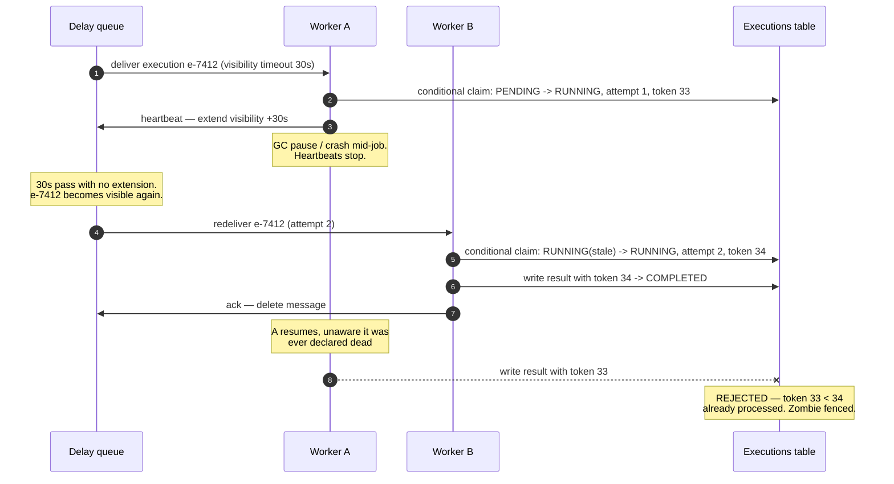

# Design a Distributed Job Scheduler

> **Prerequisites:** [Design Uber](/synapse/system-design-from-first-principles/case-studies/uber), [Design a Payment System](/synapse/system-design-from-first-principles/case-studies/stripe-payments) | **You'll be able to:** design the JobDefinition/Execution split and defend why it is the design; make a leader-elected scheduling tick safe against GC-paused zombies with leases and fencing tokens; explain why "exactly-once execution" is really at-least-once dispatch plus idempotent, deduplicated workers.

## The problem (why this exists)

Every company past a certain size runs on invisible clockwork: nightly billing runs, hourly reports, "send this email at 10 AM Friday," retry queues that wake every few minutes. On one machine this is solved — `cron` has done it since the 1970s. This case study is what happens when the clockwork must survive the machine dying, and it is where half this book's distributed-systems theory reports for duty at once: leader election, leases, fencing tokens, unreliable clocks, at-least-once delivery, idempotence. If [Design a Payment System](/synapse/system-design-from-first-principles/case-studies/stripe-payments) was the exam for *never being wrong*, the job scheduler is the exam for *never being wrong about time*.

**The brief:** design a general-purpose job scheduler — a service that accepts jobs from many users and executes them on schedule. Two terms up front, because the data model hangs on them: a **task** is the reusable definition of work ("send an email"); a **job** is an instance of a task bound to a schedule and parameters ("send a welcome email to john@example.com at 10:00 AM Friday").

**Functional requirements:**

1. Users can schedule jobs to run immediately, at a future time, or on a recurring schedule (a cron-like expression such as "every day at 10:00 AM").
2. Users can monitor the status of their jobs.

Below the line: cancelling and rescheduling jobs, security policies, CI/CD for task code.

**Non-functional requirements — quantified:**

1. **Highly available** — availability over consistency; a scheduler that stops scheduling is worse than one that briefly shows stale status.
2. **Punctual** — execute jobs within **2 seconds** of their scheduled time.
3. **Scalable** — sustain **10,000 job executions per second**.
4. **At-least-once execution** — a due job must run even if workers, schedulers, or queues die mid-flight. Per the [non-functional requirements](/synapse/system-design-from-first-principles/foundations/nonfunctional-requirements) discipline, note what this does *not* promise: that the job runs *only* once. That gap is deep dive 2.

Hold the two hard promises next to each other — **don't miss** (every due job eventually runs) and **don't double-fire** (no job runs twice because two machines both thought they were in charge). The first is a liveness property, the second a safety property, and the entire design is the negotiation between them.

## Intuition first

Start with the single cron box, because it is genuinely good: one machine, a crontab, a loop that wakes up, compares each entry against the wall clock, and forks what's due. It fails you in exactly two ways, and those two failures are the two halves of this lesson.

**Failure one: the box dies, and time doesn't stop.** Cron down for 40 minutes means every job due in those 40 minutes silently didn't happen. Nothing errors — the absence of work produces no alert unless you built one. Worse, when the box comes back: run the missed fires late? Skip them? A naive cron does whichever its author never thought about. So we add a second box for redundancy and immediately meet:

**Failure two: two boxes, and now everything runs twice.** Both replicas evaluate the same crontab against (roughly) the same clock and both fire the 10:00 AM billing run. "Roughly" is doing damage too: quartz clocks drift independently, so the boxes disagree about *when 10:00 AM is* unless actively synchronized [DDIA2 p. 360]. The obvious fix — "only one box is active; a standby takes over if it dies" — is exactly the distributed-locking problem DDIA spends a chapter dismantling: the active box can pause (GC, VM migration, paging) without knowing it, get declared dead, and wake up still believing it holds the crown [p. 367, p. 369]. Two active schedulers again, just with extra steps.

The single box also can't hit the numbers: at 10k executions/second, cron semantics — re-evaluate every schedule expression each tick — means a box that spends its life parsing cron strings for jobs that aren't due. The first structural insight, the one this design builds everything on, is to stop asking "which of my definitions is due?" (a scan over *all* jobs) and start asking "what did I already decide should happen in the next few minutes?" (a range read over *time*). That flip is the two-table split below, and it is worth more in an interview than any technology name.

## How it works

### Core entities: the definition/execution split IS the design

Four entities to name for your interviewer — **Task**, **Job**, **Schedule**, **User** — but the architecture lives in how jobs are stored. A single Jobs table with a `cron_expression` column breaks immediately: to find what runs in the next few minutes you'd evaluate *every* cron expression in the database, on every tick. Unscannable.

So split the model — the definition-versus-instance pattern a calendar app uses for a repeating event, and the split the [payment system](/synapse/system-design-from-first-principles/case-studies/stripe-payments) made between a PaymentIntent and its Transactions:

- **Job (the definition)** — task id, owner, parameters, schedule (one-shot timestamp or cron expression). Partitioned by `job_id`. Answers *"what does the user want, forever?"*
- **Execution (the instance)** — one row per planned occurrence: `execution_id`, `job_id`, `planned_time`, `status` (PENDING → RUNNING → COMPLETED / RETRYING / FAILED), attempt count. Partitioned by a **time bucket** — planned time rounded down to the hour — so "what's due soon?" is a read of one or two partitions, not a table scan. Answers *"what should happen at 10:00:00 on July 11, and did it?"*

When a recurring job's execution completes, the system computes the next occurrence from the cron expression and inserts a fresh Execution row; the Job row never changes. The Execution row is the unit of everything downstream: it is what gets queued, retried, deduplicated, and shown in the status dashboard. Any modern wide-column or key-value store fits — DynamoDB or Cassandra give painless partition scaling, though Postgres would work with more sharding care; the access patterns matter, not the logo (see [data models](/synapse/system-design-from-first-principles/data-foundations/data-models)). Status queries get their own path: a global secondary index on Executions keyed by `user_id`, sorted by execution time, so "show me my jobs" doesn't scan the time-bucketed base table.

### The API

A small surface, per [API design](/synapse/system-design-from-first-principles/foundations/api-design):

```
POST /jobs                    — {task_id, schedule: {type: ONCE|CRON, value}, parameters}
                                → {job_id}
GET  /jobs?status=&cursor=    — the caller's executions, newest first (the user_id GSI)
GET  /jobs/{job_id}           — definition + recent executions
```

Schedules are expressed in UTC. Not a formality: the server's NTP-disciplined clocks decide when 10:00 AM is, never the client device's clock, which DDIA flatly says you cannot trust [p. 361].

### High-level architecture

```d2
direction: right
classes: {
  client: {style: {fill: "#f3f4f6"; stroke: "#6b7280"}}
  edge:   {style: {fill: "#dbeafe"; stroke: "#2563eb"}}
  svc:    {style: {fill: "#dcfce7"; stroke: "#16a34a"}}
  data:   {style: {fill: "#ffedd5"; stroke: "#ea580c"}}
  async:  {style: {fill: "#f3e8ff"; stroke: "#9333ea"}}
}
user: "Job owner\n(API client)" {class: client}
gw: "API gateway" {class: edge}
jobsvc: "Job service\nvalidates schedule ·\nmaterializes executions" {class: svc}
db: "Jobs DB (DynamoDB/Cassandra)\nJobs by job_id ·\nExecutions by hour bucket\n+ user_id GSI" {class: data}
coord: "Coordination service\n(ZooKeeper/etcd)\nlease · epoch/fencing token" {class: data}
sched: "Scheduler tick\n(leader-elected)\npolls next 5-min window" {class: svc}
queue: "Delay queue\n(SQS-style: per-message delay,\nvisibility timeout, DLQ)" {class: async}
workers: "Worker fleet (containers)\nclaim -> heartbeat -> execute\nidempotent by execution_id" {class: svc}
dlq: "Dead-letter queue\npoison-job quarantine" {class: async}

user -> gw: "POST /jobs"
gw -> jobsvc
jobsvc -> db: "write Job +\nfirst Execution"
jobsvc -> queue: "fast path: due < 5 min,\nenqueue directly" {style.stroke-dash: 3}
sched -> coord: "renew lease\n(epoch n)"
sched -> db: "range-read hour bucket:\nPENDING, due <= now+5m"
sched -> queue: "enqueue execution_id\nwith delay = due - now"
queue -> workers: "deliver at due time\n(visibility timeout 30s)"
workers -> db: "conditional claim ->\nRUNNING -> COMPLETED"
queue -> dlq: "after max receives" {style.stroke-dash: 3}
```

Walk one job through it. A user posts "every day at 10:00." The Job service writes the definition and materializes the first Execution row into its hour bucket. Every five minutes, the **scheduler tick** — one logical process, kept singular by a lease in a coordination service — range-reads the current bucket for `PENDING` executions due in the next five minutes and enqueues each `execution_id` into a [**delay queue**](/synapse/system-design-from-first-principles/building-blocks/queues-and-brokers) with delay = *due time minus now*. The queue releases each message at its due moment; a worker claims it with a conditional write to RUNNING, heartbeats while it works, and records the outcome. Jobs created due sooner than the next poll window skip the tick and go straight to the queue. Two layers, two jobs: the database gives durability and cheap time-range queries; the queue gives second-level precision and worker fault tolerance. Neither can do both — which is why this beats "just poll faster," as the first deep dive below proves out.

## Deep dives

### 1) Who decides "it's time"? — one tick, elected and fenced

The tick must be logically singular: if two processes poll the same bucket, every due job is enqueued twice. But a singular process is a single point of failure for the *don't-miss* promise. This is textbook leader election, worth doing precisely, because the naive version has a famous hole.

**The lease.** Scheduler instances race to acquire a **lease** — a lock with an expiry — in a coordination service like ZooKeeper or etcd; the winner runs the tick and renews periodically, and if it dies and stops renewing, the lease lapses and a standby takes over [DDIA2 pp. 366–367]. The lease must be **linearizable** — all nodes agree on who holds it, however the network mangles timing — which is exactly what these services provide via [consensus](/synapse/system-design-from-first-principles/distributed-data/consensus-and-coordination) [p. 408]. DDIA lists "choosing a leader among the instances of a job scheduler" as a canonical coordination-service use case [p. 439]; the service stays a fixed 3-or-5-node cluster however large the fleet grows [pp. 439–440]. Failure detection is heartbeat-based: when a client's session heartbeats stop past the timeout, its **ephemeral node** — the lease — is released automatically [p. 438].

**The hole.** A lease alone does not prevent double-firing, and DDIA's dismantling of the naive lease loop is *the* senior-level moment in this design. The leader checks `lease.isValid()`, then acts — but a GC pause, VM suspension, or page fault can freeze the process for tens of seconds *between the check and the act* [p. 367]. While it's frozen, the lease expires and a standby starts ticking. Then the old leader resumes — unaware any time has passed, unaware it was declared dead [p. 369] — and finishes its tick, enqueueing executions the new leader already enqueued. DDIA's name for this revenant is a **zombie**: a former leaseholder that hasn't yet learned it lost the lease [p. 374]. You cannot prevent zombies (pauses are a fact of life); you can only make them harmless. Killing them — STONITH — is explicitly *not* particularly effective: detection comes too late, and it does nothing about the zombie's requests already in flight [pp. 374–375].

**The fix: fencing tokens.** Each lease grant comes with a **fencing token** — a number that increases with every grant (ZooKeeper's `zxid`, etcd's revision; consensus algorithms call the same idea an epoch or term) [pp. 375–376, pp. 434–435]. Every side effect the leader performs — here, marking an Execution `ENQUEUED` before pushing it to the queue — is a **conditional write carrying the token**, and the store rejects any write bearing a lower token than one already seen [p. 375]; a plain CAS-style conditional write suffices where a full token protocol is overkill [p. 376]. The zombie's late writes bounce. Whatever it *did* push into the queue before fencing caught it is a duplicate delivery — which deep dive 2's idempotence layer absorbs. Defense in depth: fencing stops the zombie at the state store, dedup stops whatever leaked past it.

**The alternative: partition time instead of electing one owner.** Shard the Executions keyspace — say by hash of `job_id` across N schedulers — with the coordination service assigning shards to instances, its other canonical job [p. 439]. The tick now scales horizontally and a scheduler crash orphans only its shards until reassignment. The price: the same lease-plus-fencing machinery *per shard* (shard ownership can zombie exactly like a global leader), plus a rebalancing protocol on membership change. At 10k executions/second a single-leader tick that merely *reads a bucket and enqueues* is rarely the bottleneck — the arithmetic is in Numbers below — so the sequenced answer is: leader-elect first, partition when tick latency data says so.

**Expert layer — whose clock is "due"?** The tick compares `planned_time` to a clock. Which one? Time-of-day clocks can jump — backward, if NTP decides the clock is too far ahead [p. 359] — so a tick that computes its *sleep interval* from wall-clock subtraction can fire twice or stall; measure intervals on the monotonic clock, use wall time only for the due comparison [pp. 359–360]. How wrong is wall time? Google budgets 200 ppm of quartz drift — 17 seconds/day if a node syncs only daily [p. 360] — and NTP over the internet managed ~35 ms error at best, with spikes toward a second [p. 361]. Against a 2-second SLA, tens of milliseconds are noise — *if* NTP is working. The trap is that clock failure is silent: a node firewalled off from NTP drifts indefinitely and nothing crashes [p. 360]. DDIA's operational rule: if correctness depends on synchronized clocks, monitor clock offsets and eject nodes that drift too far [p. 362]. A scheduler is precisely such a system — put clock offset on the same dashboard as schedule lag.

### 2) From due to running — at-least-once dispatch, idempotent execution

Why doesn't the tick just poll every 2 seconds and run things itself? Here's the demolition: at 10k jobs/second, a 2-second poll fetches ~20k rows per query, several hundred milliseconds just to read and ship — the poll frequency becomes the precision ceiling, and the database melts first. Hence the two layers: a **5-minute poll** amortizes the database read, and the **delay queue** converts "rows due soon" into "messages that appear exactly on time." Three ways to build that queue — Redis sorted sets scored by due timestamp (fast, but you hand-roll retries, replication, failure handling), RabbitMQ's delayed-message plugin (mature broker, delay is a bolt-on), or an SQS-style queue with native per-message delay, visibility timeouts, and DLQs — the Trade-offs table takes them up. Note the broker family: per-message delivery with acks, *not* a log. A Kafka-style log delivers in append order, so a just-created job due in 30 seconds would sit behind five minutes of queued messages — the log-vs-queue distinction from [DDIA2 p. 497] cutting in the queue's favor: independent messages, per-message parallelism, order carried by the delay, not the log.

Now the delivery semantics, where the ch. 12 machinery earns its keep. The queue-to-worker contract is **acknowledgment-based**: the worker acks only after finishing; if the ack never comes — worker crashed, network died, processing hung — the broker redelivers to another consumer [DDIA2 p. 493]. That is at-least-once delivery, and the double edge is in the name. The broker *cannot know* whether the missing ack means "worker died before doing the work" or "worker did the work and died before acking" — the same message-lost-or-response-lost ambiguity as every unreliable network hop [p. 348] — so it redelivers in both cases, and the second case duplicates work that already happened. Redelivery also reorders [p. 494], harmless here because each execution is independent and its timing rides in the delay, not the sequence.

<div style="border-left:4px solid #15448e;background:rgba(21,68,142,0.08);padding:0.6rem 1rem;border-radius:0 0.5rem 0.5rem 0;margin:1.25rem 0">

**"Exactly-once execution" is not a delivery guarantee — it's an outcome you assemble.** DDIA is blunt that the honest term is *effectively-once*: inputs may be processed multiple times, but the visible effect is as if once [p. 527]. The recipe is at-least-once delivery **plus** duplicate suppression at the effect [p. 528]. A queue that "does exactly-once" means inside the framework; your job's side effects live outside it [p. 527].

</div>

The dedup key writes itself, and the entity split pays again: the **`execution_id`**. Every path that can duplicate — zombie scheduler double-enqueue, queue redelivery, retry after a lost ack — produces another message bearing the *same* execution id. So the worker's first act is a **conditional claim**: flip the Execution row PENDING → RUNNING only if it isn't already claimed at this attempt; a duplicate finds the row claimed or COMPLETED and drops the message. That's the offset-tagged-write idea from stream processing — store the processing marker with the effect so a replay detects itself [p. 528]. For the job's *external* side effects, the ladder here runs: run blind (unacceptable for anything that moves money or sends email), consult a dedup table keyed by execution id (works, but adds a lookup and a small check-then-write race window), or make tasks naturally idempotent — "set counter to X" not "increment," idempotency keys passed downstream — the robust end state. It is the same end-to-end argument as the [payment system's](/synapse/system-design-from-first-principles/case-studies/stripe-payments) idempotency keys: dedup as close to the effect as possible, because everything upstream can and will duplicate. Where the [ad-click aggregator](/synapse/system-design-from-first-principles/case-studies/ad-click-aggregator) assembled effectively-once for *counts*, here you assemble it for *side effects* — a harder target, because you can't recount an email. See [idempotency and exactly-once](/synapse/system-design-from-first-principles/patterns/idempotency-and-exactly-once) for the general pattern.

**Expert layer — the top of the minute.** Humans write cron expressions like `0 * * * *`, so real workloads spike violently at :00 — the herd is in the *schedules*, not the infrastructure. `Rule of thumb, not from source:` production schedulers splay — hash the job id into a small deterministic jitter (±30s where the job allows it, as an opt-in "flexible window"). The 2-second SLA then applies to the *splayed* time you committed to, which is honest as long as the contract says so.

### 3) When workers die mid-job — timeouts, heartbeats, and quarantine

Workers fail two ways, and the taxonomy below covers both cleanly. **Visible failures** — the task code throws — are easy: catch, mark the Execution RETRYING with its attempt count, and re-enqueue with **exponential backoff**, giving up into FAILED after a bounded number of attempts (3, here). **Invisible failures** — the worker just stops existing mid-job — are the interesting case, because *no signal is ever sent*. Three detection designs:

- **Central health checker** polling every worker: doesn't scale past thousands of workers, false-positives on network blips, and the monitor is now a component that itself fails.
- **Database job leasing**: workers take a lease row per job and renew it; expiry means death. Correct in shape — deep dive 1's lease pattern — but at 10k jobs/second the renewals alone are ~50k writes/second of pure overhead, and it inherits every clock-skew and pause hazard from ch. 9 without the coordination-service machinery that tames them.
- **Visibility timeout + heartbeat** — the chosen one: on delivery the queue hides the message for a window (say 30 seconds); the worker *is* alive as long as it keeps extending the window (a heartbeat every ~15 seconds); death means silence, the window lapses, and the message reappears for another worker. Failure detection with no extra infrastructure — the queue already tracks outstanding deliveries.

Here is the full failure sequence — crash, redelivery, and the zombie's late write bouncing off the fence:



Steps 10–11 are the part candidates miss. Worker A was never *dead* — it was paused, exactly the ch. 9 scenario [p. 367] — and on resuming it happily finishes the job and reports success. If the job's effect was external and non-idempotent, it happened twice and no fence can retract it: the fence protects the *record*, idempotent task design protects the *world*. This is also why "just set a long visibility timeout" is wrong: a genuine crash then strands the job for the whole window, while short-timeout-plus-heartbeat detects death in ~30 seconds and still supports arbitrarily long jobs.

**The poison job.** Some jobs fail deterministically — a bug in the task code, malformed parameters — and retry cannot fix determinism. Left alone, a poison message loops: delivered, crashes the worker, times out, redelivered, forever — wasted capacity at best, a blocked consumer at worst [DDIA2 pp. 494–495]. The **dead-letter queue** is the circuit breaker: after N receives, the message is shunted into a quarantine that pages a human, who can drop it, fix the task, or re-drive it [p. 495]. The Execution goes to FAILED with a reason; the user sees it in the dashboard instead of wondering why their report never came.

**The misfire policy.** When an execution *couldn't* run on time — scheduler outage, DLQ round-trip, hour-long backlog — you owe a decision, not a default: **run late** or **skip**. The term of art is a *misfire* [web: Quartz scheduler documentation — misfire instructions]. It is a product decision, not an engineering one: a billing run must fire late (money is owed regardless of your outage), while a "warm the cache every minute" job should skip — forty stale warm-ups back-to-back are pure waste that delays the one that matters. Per-job policy, declared at creation, default run-late-with-a-deadline. Asking which policy a job needs is one of the best clarifying questions you can put to an interviewer.

The whole final architecture once more, in C4 Container notation — pan and zoom; click any element for its doc (rendered live from this module's `job-scheduler.c4` model):

<iframe
  src="/c4/view/sdfp_jobscheduler_container"
  width="100%"
  height="520"
  style="border: 1px solid var(--border, #2b2b2b); border-radius: 8px;"
  loading="lazy"
  title="Job scheduler — C4 Container view (final architecture)"
></iframe>

### Hands-on: run this design

This design's low-level structure — the C4 **code level** across the elected scheduler and the idempotent worker (click any box for its doc):

<iframe
  src="/c4/view/sdfp_jobscheduler_code"
  width="100%"
  height="480"
  style="border: 1px solid var(--border, #2b2b2b); border-radius: 8px;"
  loading="lazy"
  title="Job scheduler — C4 code level (scheduler + worker)"
></iframe>

A **runnable implementation** lives at `proof-of-concepts/06-case-studies/13-job-scheduler/` in the repo root — both decisive containers: the scheduler (`LeaderLease`, `WindowPoller`, `Dispatcher`) and the worker (`ExecutionClaimer`, `Heartbeat`), over Redis (lease + epoch) and Postgres (executions).

```bash
cd proof-of-concepts/06-case-studies/13-job-scheduler
./run            # build + start api (8430) + Redis (8431) + Postgres (8432)
./run test       # mypy --strict + smoke
./run stop
```

`./run test` drives all four guarantees: one node holds the leader lease while a second is rejected; when the lease lapses the new leader mints a **higher epoch**, and a dispatch carrying the stale epoch is rejected (409) — the **double-fire guard**; 10 workers racing to claim one execution yield **exactly one winner** (a conditional `PENDING → RUNNING`), turning at-least-once delivery into effectively-once; and a worker that stops heartbeating loses its visibility lease, so `reclaim` returns the job to PENDING for a healthy worker.

## Trade-offs

| Option | Gives you | Costs you | Use when |
| --- | --- | --- | --- |
| Single leader-elected tick (lease + fencing) | Simplest correct "one decider" | Failover gap; tick throughput ceiling; full zombie-fencing discipline [DDIA2 pp. 374–376] | Default — tick work is read-and-enqueue, cheap at 10k/s |
| Time/hash-partitioned schedulers | Horizontal tick scaling; a crash orphans one shard | Lease + fencing *per shard*; rebalancing protocol [p. 439] | Tick latency measurably breaches the 2s budget |
| Frequent DB polling (no queue) | One less system | Poll period = precision ceiling; ~20k rows per 2s poll | Small scale, relaxed SLA |
| Delay queue: Redis ZSET | Sub-ms ops; total control | You build retries, replication, failure semantics | In-house-everything shops with Redis expertise |
| Delay queue: RabbitMQ delayed exchange | Mature broker, persistence, confirms | Delay is plugin-grade, less proven at scale | Existing RabbitMQ estate |
| Delay queue: SQS-style managed | Native delay, visibility timeout, DLQ — the deep-dive-3 kit | Vendor lock-in; some interviewers bar managed services | Default when managed services are allowed |
| Misfire: run late | Never miss — liveness honored | Stale work executes; backlog amplifies post-outage load | Billing, notifications, anything owed |
| Misfire: skip | No wasted work; instant recovery | Silently missing occurrences; needs visible accounting | Idempotent freshness jobs (cache warms, polls) |

## Numbers that matter

Back-of-envelope discipline per [estimation](/synapse/system-design-from-first-principles/foundations/estimation-and-numbers).

- **Throughput target:** 10,000 executions/second, within **2 s** of due time.
- **Why naive polling dies:** a 2 s poll fetches 10k/s × 2 s = **20k rows per query**; budget several hundred ms just to fetch and ship — most of the SLA gone before dispatch.
- **The 5-minute window:** 10k/s × 300 s = **3M executions per poll cycle**; at ~200 bytes per message, **~600 MB per window** through the queue — trivial for a distributed queue, impossible as a 2 s hot loop against one table.
- **Hour-bucket arithmetic:** 10k/s × 3,600 s = **36M Execution rows per hour bucket**. `Rule of thumb, not from source:` one partition absorbing that is itself a hot-partition risk — suffix the bucket key with a small hash shard (bucket#00…#15) and read the suffixes in parallel.
- **Queue quotas:** SQS's default quota is ~3,000 messages/second with batching — a 10k/s design needs a quota increase before an architecture change.
- **Failure detection:** visibility timeout 30 s, heartbeat ~15 s → worker death detected in ≤30 s while supporting multi-minute jobs; 3 retries with exponential backoff before FAILED/DLQ.
- **Clock error budget:** quartz drift up to 200 ppm — ~6 ms if synced every 30 s, ~17 s/day unsynced [DDIA2 p. 360]; NTP over the internet ~35 ms at best, ~1 s in spikes [p. 361]. Tens of ms is noise against 2 s; an unmonitored NTP failure is not [p. 362].
- **Coordination cluster:** 3 or 5 nodes, fixed, regardless of fleet size [pp. 439–440].

## In production

Operational reality, mostly rules of thumb from practice rather than either source — flagged accordingly.

**The two graphs that matter.** `Rule of thumb, not from source:` scheduler health is **schedule lag** — the histogram of (actual start − planned time), watched at p99 against the 2 s promise, per the [percentiles discipline](/synapse/system-design-from-first-principles/foundations/latency-throughput-percentiles) — and the **misfire counter**, alarmed *from zero*, because a scheduler's characteristic failure is silence: nothing errors when nothing runs. Pair them with queue depth, DLQ depth, redelivery rate, and per-node clock offset [DDIA2 p. 362 makes clock monitoring a correctness requirement, not hygiene].

**Backlog drain after an outage.** An hour down at 10k/s means ~36M executions owed on recovery. `Rule of thumb, not from source:` never release the backlog at full speed — drain through a throttle, oldest-first for run-late jobs, while *skip*-policy jobs are dropped en masse (where the misfire policy pays for itself). The drain competes with *current* due jobs, so lag stays elevated after the outage ends — say so in the incident channel before users ask.

**Priority lanes.** Multiple queues make sense for functional separation — priorities or job classes — not throughput. `Rule of thumb, not from source:` at minimum split latency-sensitive small jobs from long-running batch jobs so a batch flood can't queue-block a 10:00:00 notification; per-lane worker pools and DLQs.

**Tenant quotas.** A multi-tenant scheduler is one `while(true) { schedule(now) }` away from a self-inflicted DoS. `Rule of thumb, not from source:` cap jobs-created and executions-in-flight per tenant, rate-limiting at admission with the machinery from the [rate limiter case study](/synapse/system-design-from-first-principles/case-studies/rate-limiter) — the scheduler is a downstream service like any other; it just fails more publicly.

**Named reality checks.** DDIA anchors two of this lesson's mechanisms in shipping systems: coordination services (ZooKeeper, etcd) are the production home of scheduler leader election and shard assignment [p. 439], and the fencing-token idea ships as ZooKeeper's `zxid`, etcd's revision, and Kafka's epoch numbers [pp. 375–376]. Kubernetes CronJobs expose the same knobs this lesson derived — retry limits, missed-run deadlines, and concurrency policies for overlapping runs [web: Kubernetes CronJob documentation] — a decent sanity check that the design above is the convergent one.

## Pitfalls & interview traps

<div style="border-left:4px solid #da5233;background:rgba(218,82,51,0.08);padding:0.6rem 1rem;border-radius:0 0.5rem 0.5rem 0;margin:1.25rem 0">

⚠️ **"I'll take a distributed lock so only one scheduler fires" is the trap answer, and interviewers set it deliberately.** A lock alone cannot survive the GC-paused zombie: the pause happens *between* checking the lease and acting on it [DDIA2 p. 367], and the resumed leader doesn't know it was ever gone [p. 369]. The complete answer has three layers: a linearizable lease [p. 408], **fencing tokens** so the store rejects the zombie's stale writes [p. 375], and idempotent, execution-id-keyed processing to absorb whatever leaked into the queue anyway. Say "lock" and the follow-up *will* be "what if the lock holder pauses for 40 seconds?"

</div>

- **Claiming exactly-once delivery.** The broker cannot distinguish "died before the work" from "died after the work, before the ack" [p. 493, p. 348]. Say *at-least-once delivery, effectively-once execution via dedup* [pp. 527–528] and you've pre-empted the follow-up.
- **Evaluating cron expressions at read time.** Scanning definitions to find due work cannot scale; materializing executions into time buckets is the whole ballgame. If you catch yourself saying "scan all jobs," restart.
- **One table for definitions and instances.** You lose per-occurrence retries, status, and the dedup key in one stroke. The follow-up: "a recurring job fails at 10:00 — what does your status API show for 11:00?"
- **Visibility timeout sized to the longest job.** A 6-hour timeout means a crash at minute 1 strands the job for 6 hours. Short timeout + heartbeat extension is the pattern.
- **Trusting wall clocks because NTP exists.** Clocks jump backward [p. 359] and drift silently when NTP is unreachable [p. 360], rewarding you with double-fires or stalls. Monotonic clock for intervals, monitored wall clock for due-ness [pp. 359–362].
- **No misfire policy.** "What happens to the 9:00 run if you're down until 9:40?" is a near-certain follow-up; "run late or skip, per job, product decides" is the shape of the answer.

## Check yourself

```quiz
{"prompt": "Why does the design split Jobs (definitions) from Executions (instances) into two tables?", "options": ["Recurring jobs would overflow a single DynamoDB partition", "Finding due work becomes a time-range read over materialized instances instead of evaluating every cron expression on every tick", "Users may not query another user's job definitions", "Definitions and instances require different consistency levels"], "answer": "Finding due work becomes a time-range read over materialized instances instead of evaluating every cron expression on every tick"}
```

```quiz
{"prompt": "The leader scheduler acquires a lease, then hits a 40-second GC pause. The lease expires and a standby takes over the tick. The old leader resumes and finishes its loop, enqueueing executions the new leader already enqueued. Which pair of mechanisms makes this harmless?", "options": ["STONITH kills the old leader before it resumes, so nothing needs handling", "Fencing tokens make the store reject the zombie's stale writes, and workers dedup deliveries by execution_id", "The coordination service replays the old leader's messages in the correct order", "A longer lease timeout ensures leaders are never declared dead during a pause"], "answer": "Fencing tokens make the store reject the zombie's stale writes, and workers dedup deliveries by execution_id"}
```

```quiz
{"prompt": "A worker is 4 minutes into a 5-minute job, with a 30-second visibility timeout extended by 15-second heartbeats. The worker process is killed at minute 4. What happens to the job?", "options": ["It is lost — the queue deleted the message on first delivery", "It waits the remaining 1 minute, then the queue marks it FAILED", "Heartbeats stop, the 30-second visibility window lapses, and the message reappears for another worker to claim and rerun", "The dead-letter queue receives it on the first missed heartbeat"], "answer": "Heartbeats stop, the 30-second visibility window lapses, and the message reappears for another worker to claim and rerun"}
```

```quiz
{"prompt": "A user creates a one-off job due in 90 seconds, but the scheduler tick polls the database every 5 minutes. How does the design still hit the 2-second precision SLA?", "options": ["The tick temporarily switches to 1-second polling when new jobs arrive", "The job waits for the next poll; the SLA only applies to recurring jobs", "The write path enqueues jobs due sooner than the next poll window directly into the delay queue, bypassing the tick", "The worker fleet polls the database independently for near-term jobs"], "answer": "The write path enqueues jobs due sooner than the next poll window directly into the delay queue, bypassing the tick"}
```

<details>
<summary><strong>Q: Your queue vendor announces "exactly-once delivery." Does that let you delete the execution-id dedup logic from your workers?</strong></summary>

No. Whatever the broker guarantees internally, your job's side effects happen *outside* it — in your database, in a third-party email API, in the world [DDIA2 p. 527]. Duplicates also enter upstream of the queue: a zombie scheduler can enqueue the same execution twice before fencing catches it, and your retry path re-enqueues on visible failure. Dedup keyed by execution id at the point of effect is the only layer covering every producer of duplicates — effectively-once is assembled end-to-end, not bought from a vendor [p. 528].

</details>

<details>
<summary><strong>Q: A nightly billing job and a per-minute cache-warming job both miss two hours of runs during an outage. What should recovery do for each, and why is this not an engineering decision?</strong></summary>

The billing job runs late: money is owed regardless of your outage, and skipping silently corrupts the business. The cache-warm job skips its ~120 missed occurrences: its value is freshness, and replaying the backlog only delays the run that matters — the current one. It's a product decision because engineering cannot know which category a job's *value* falls into; the design's job is to make the policy per-job, explicit at creation, and visible in the status API when applied [misfire terminology: web — Quartz scheduler documentation].

</details>

## Sources

DDIA2 ch. 9 pp. 345–388 — leases and process pauses pp. 366–369, zombies and fencing tokens pp. 373–377, clocks pp. 358–365, clock monitoring p. 362 · DDIA2 ch. 10 pp. 401–442 — linearizable leases/leader election p. 408, epochs pp. 434–435, coordination services pp. 437–440 · DDIA2 ch. 12 pp. 487–529 — acks/redelivery pp. 493–495, DLQs p. 495, offsets p. 498, exactly-once and idempotence pp. 527–528 · [web: Quartz scheduler documentation — misfire instructions] · [web: Kubernetes CronJob documentation]
