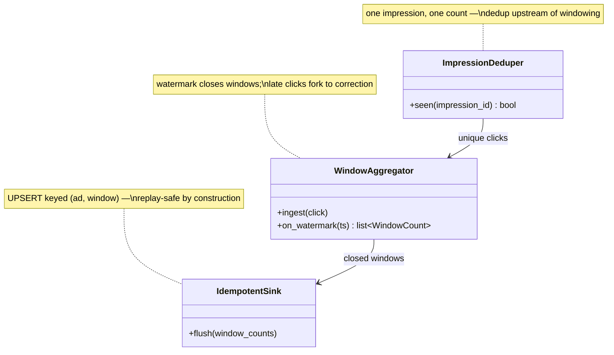

## Stream aggregator

The **Stream aggregator** is the fast path from click to queryable count — and the place where the innocent question "which minute does this click belong to?" gets its honest answer. A click has two timestamps: **event time** (when it happened) and **processing time** (when this worker gets to it), and they diverge whenever anything queues, retries, or restarts. Windowing by processing time turns a restart's backlog into a phantom traffic spike billed into the recovery minute; so this container windows by **event time**, always, and a **watermark** — the signal asserting "nothing earlier than *t* is coming" — decides when a one-minute tumbling window is complete enough to close and flush. Clicks arriving after that fork to a correction rather than being silently dropped: for billing, corrections beat losses.

**Responsibilities**

- Consume the log per shard, keeping a counter per open `(ad, minute)` window — small state, checkpointed with its input offsets so state and position recover *together*.
- Close windows on watermark passage; flush provisional counts early so the current minute is live-but-incomplete on dashboards.
- Emit closed windows to an idempotent sink — because "exactly-once" is effectively-once *state inside the framework*, and a replayed flush is a side effect the framework can't un-write.

Three classes carry that pipeline — the C4 code level, mirrored 1:1 by the forthcoming POC:

Each class maps to a file in the POC at `06-case-studies/examples/ad-click-aggregator/app/` (deferred to the hands-on phase) — click the code-level boxes for their docs.

**Where it breaks.** A salted hot ad means N tasks each hold a partial count, so per-minute totals must be merged downstream. And with one-minute windows, checkpointing is arguably optional — the retained log lets a crashed job replay its lost minute — a pushback worth making before installing every feature the framework offers.
