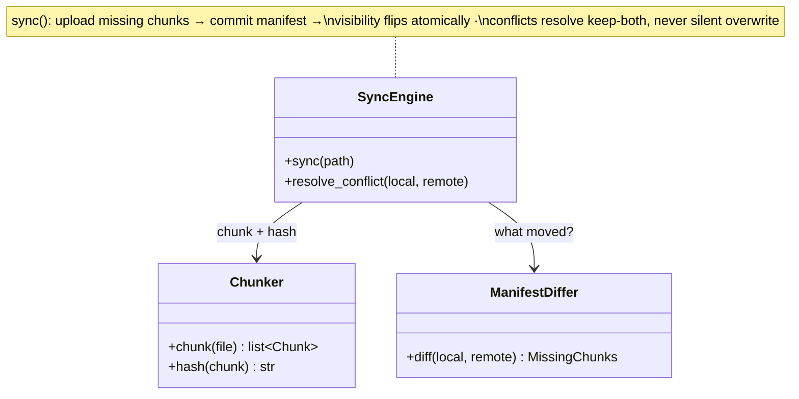

## Sync agent (device)

The **Sync agent** runs on every device and is the design's most unusual container: a distributed-systems participant living on hardware you don't control. It watches the local folder via OS filesystem events (FSEvents, FileSystemWatcher), and on any change chunks the file, hashes each chunk, and drives the upload — talking **metadata to the File Service and bytes to blob storage directly**, never routing a gigabyte through the app tier.

**Responsibilities**

- Detect local changes and push them remote: chunk (5–10 MB), SHA-256 each chunk, send the fingerprint list, upload only what the server says is missing.
- Pull remote changes announced over the sync channel, fetching only changed chunks.
- Queue work while offline and reconcile on reconnect — the agent is what DDIA calls a *sync engine*: capture, queue, ship, merge.
- Resolve concurrent edits keep-both-copies, never by silent overwrite.

Three classes carry that flow — the C4 code level, mirrored 1:1 by the forthcoming POC:

Each class maps to a file in the POC at `06-case-studies/examples/dropbox/agent/` (deferred to the project's hands-on phase) — click the code-level boxes for their docs.

**Where it breaks.** On its own honesty: the agent is the least trustworthy machine in the system, which is why it is trusted with nothing but bytes. It never marks a chunk uploaded (blob-store events do) and never decides the current version (the manifest commit does). A buggy or malicious agent can waste bandwidth; it cannot corrupt the source of truth.
