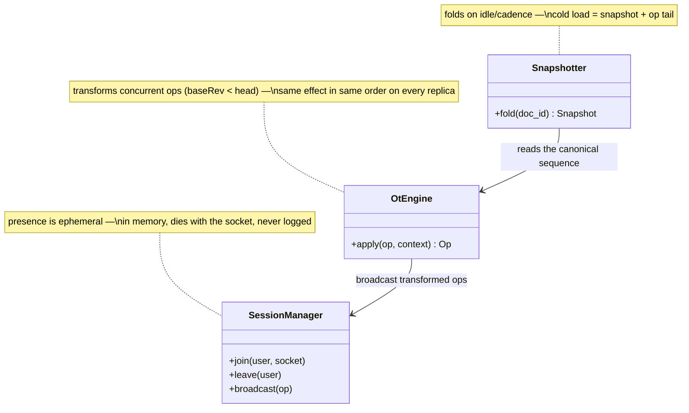

## Document server

The **Document server** is the ordering authority — the single point every op for its documents must pass through, because OT's transform is defined relative to *one canonical sequence of operations*. Consistent hashing pins every editor of doc X to this one process, and co-location turns the whole session into local work: transform, sequence, append, and a ≤100-iteration broadcast loop over local sockets.

**Responsibilities**

- Decide, per incoming op, sequential vs concurrent by its `baseRev`; transform concurrent ops against the accepted ops they hadn't seen, assign the next revision.
- Append the canonical op to the log and **only then** ack — "acked" means durably in the log; the text itself is derived state, `state = fold(ops)`.
- Broadcast each transformed op to every other connected editor of the document.
- Hold presence (membership, cursors) in memory only — ephemeral, never logged.
- Fold cold documents into snapshots so cold loads replay a tail, not years of keystrokes.

Three classes carry that work — the C4 code level, mirrored 1:1 by the forthcoming POC:

Each class maps to a file in the POC at `06-case-studies/examples/google-docs/app/` (deferred to the hands-on phase) — click the code-level boxes for their docs.

**Where it breaks.** Statefulness: a deploy or crash is a mini ring-change — drain, let clients resync from their last acked revision, recycle. And the hot document cannot be salted: splitting one doc across servers is precisely what OT forbids, so the 100-editor cap and read-only overflow are the pressure valves.
